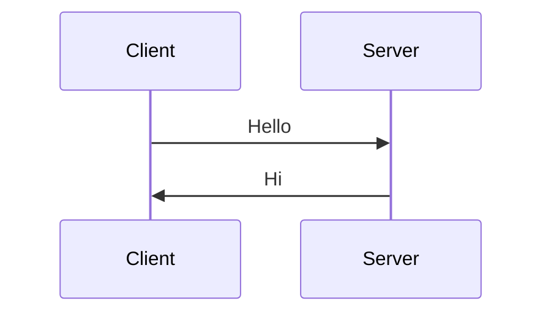

# New Handbook Skill

Create a new **standalone** handbook that renders with the clean article layout (no sidebar, no Prev/Next). These live directly under `handnote/` (NOT inside a section subfolder like `gate-cse/`).

## When to use this vs `add-chapter`

| Situation | Skill |
|-----------|-------|
| Multi-chapter series for a specific exam (GATE CSE) | `/add-chapter` — goes under `handnote/gate-cse/` |
| Single topic deep-dive (SSH, SSL/TLS, React, Auth, Networking) | **`/new-handbook`** — goes under `handnote/` |

## File Location and Naming

```
handnote/<slug-with-hyphens>.md
```

Examples:
- `handnote/docker-basics.md`
- `handnote/kubernetes-intro.md`
- `handnote/postgresql-handbook.md`

## Required Template

### Frontmatter

```md
# <Topic Name> — Complete Guide

> <1-2 sentence hook describing the scope and target audience>
```

### Structured Body (learning flow)

```md
## 📑 Table of Contents
<ordered list of sections — optional but helps readers>

---

## 1. <Topic> কী?  (What)
<define the concept in simple Bangla, first-time reader level>

## 2. কেন দরকার?  (Why)
<real-world motivation, problems solved, 2-3 bullet advantages>

## 3. কিভাবে কাজ করে?  (How)
<mechanism, architecture, diagram>


## 4. Setup / Getting Started
<step-by-step if applicable — commands, code>

## 5. Core Concepts
5.1 <concept A> with example
5.2 <concept B> with example
...

## 6. Advanced / Deep Dive
<edge cases, internals, performance, security>

## 7. Common Pitfalls & Best Practices
<bulleted list>

## 8. Real-world Examples
<code, config, or case study>

## 9. Summary (One-Page Cheat Sheet)
<table / mindmap / quick reference>

## 10. Resources
<links to official docs, RFCs, further reading>
```

## Writing Rules (from CLAUDE.md)

- **Language:** Bangla explanations, **English** for technical keywords
- **Flow:** Never a Q&A dump — structured tutorial feel
- **Progression:** beginner → advanced
- **Mermaid:** every complex concept gets a diagram (flowchart, sequence, state)
- **Code examples:** real, runnable, commented
- **Target length:** 500-3000 words (reading time will auto-compute; aim for depth, not padding)

## Example Patterns

### A. Mermaid sequence for a protocol


### B. Comparison table
| Feature | Option A | Option B |
|---------|----------|----------|
| ... | ... | ... |

### C. Callout for warnings (plain blockquote)
> ⚠️ **Warning:** <thing to watch out for>

## After Writing

1. Build picks it up automatically:
   ```bash
   cd app && npm run build
   ```
2. Dev preview:
   ```bash
   npm run dev
   # visit /docs/<slug>
   ```
3. Verify: article layout renders (no sidebar, no Prev/Next), breadcrumb reads `Home › Handbooks`
4. Commit: `git add handnote/<slug>.md && git commit -m "Add handbook: <topic>"`
5. Deploy: invoke `/deploy` skill

## References

- Existing handbooks for template reference:
  - [handnote/ssh.md](handnote/ssh.md)
  - [handnote/ssl-tls.md](handnote/ssl-tls.md)
  - [handnote/c-programming-hand-book.md](handnote/c-programming-hand-book.md)
