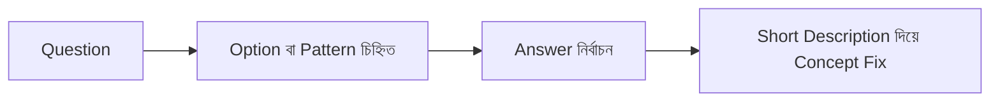

import { Mermaid } from '@/components/mdx/Mermaid';
import { Callout } from '@/components/mdx/Callout';

# DataCamp SQL Exam Notes (18 Apr 2026)

## What

এই document-এ exam-এর objective এবং written অংশের প্রশ্নগুলো question-first format-এ সাজানো হয়েছে।
প্রতিটি item-এ আছে:

- Question
- Options (যেখানে available)
- Answer
- Short Description

---

## Why

এই নোটের লক্ষ্য:

- Exam শেষে দ্রুত revision করা
- SQL pattern (JOIN, Regex, Aggregation, Type conversion, Statistics) ধরে রাখা
- ভবিষ্যৎ practice-এর জন্য concise answer key তৈরি করা

---

## How

ব্যবহার পদ্ধতি:

1. আগে Question পড়ো
2. তারপর Options compare করো
3. Answer দেখে verify করো
4. Short Description দিয়ে concept মনে রাখো



---

## Details

## Part A: Objective + Fill in the blanks

### Q1
Question (English): You are reviewing a colleague's SQL queries and noticed duplicated key columns. How can this query be modified to avoid duplicated key columns?

Options (English):

a) The `JOIN` keyword can be replaced with `RIGHT JOIN`
b) The `ON` syntax can be replaced with `USING (emp_id)`
c) The `FROM` keyword can be replaced with `(s, c)`
d) The `*` syntax can be replaced with `s.emp_id, c.emp_id`

Answer: b) The `ON` syntax can be replaced with `USING (emp_id)`

Short Description (Bangla): `USING` ব্যবহার করলে same key column result-এ একবার আসে, তাই duplicate key column থাকে না।

### Q2
Question (English): Convert `amount` in cents to `amount_dollars` with two decimal places. What should be in the blank after `::`?

Options (English): Fill in the blank

Answer: `numeric(5,2)`

Short Description (Bangla): cents থেকে dollar conversion-এর পরে fixed 2 decimal রাখার জন্য এই numeric scale দরকার।

### Q3
Question (English): Identify users whose `username` ends with a digit. What is the regex blank after `[0-9]`?

Options (English): Fill in the blank

Answer: `$`

Short Description (Bangla): `$` regex anchor string-এর শেষে match করে।

### Q4
Question (English): Return promo codes that start with 1-3 and end with 5-9. What regex should be used?

Options (English): Fill in the blank

Answer: `^[1-3].*[5-9]$`

Short Description (Bangla): শুরু এবং শেষের condition একসাথে enforce করতে start/end anchor ব্যবহার করা হয়েছে।

### Q5
Question (English): Remove digit characters from `username` using `REGEXP_REPLACE`. What goes in the pattern blank?

Options (English): Fill in the blank

Answer: `'[0-9]'`

Short Description (Bangla): digit class replace করে username থেকে সব সংখ্যা বাদ দেওয়া হয়।

### Q6
Question (English): Complete the statement to get the data type of column `category`.

Options (English):

a) `SELECT PG_TYPEOF(category)`
b) `SELECT TYPEOF(category)`
c) `SELECT TYPE(column = category)`
d) `SELECT PG_TYPE(category)`

Answer: a) `SELECT PG_TYPEOF(category)`

Short Description (Bangla): PostgreSQL-এ expression-এর type জানার built-in function হলো `PG_TYPEOF`।

### Q7
Question (English): Combine visits from AMER, EMEA, and APAC and compute global totals. What are the two blanks?

Options (English): Fill in the blank

Answer: `UNION ALL`, `UNION ALL`

Short Description (Bangla): সব row রাখার জন্য `UNION ALL` দরকার, নাহলে duplicate row drop হয়ে যেতে পারে।

### Q8
Question (English): Get all rows from `books` that have at least one related row in `sales`. What goes in the blank?

Options (English): Fill in the blank

Answer: `EXISTS`

Short Description (Bangla): correlated subquery-তে match exists কিনা check করার সবচেয়ে direct উপায় `EXISTS`।

### Q9
Question (English): Convert `day` string in `DD-MM-YYYY` format into a date. Which function fits the blank?

Options (English): Fill in the blank

Answer: `TO_DATE`

Short Description (Bangla): formatted text date parse করতে `TO_DATE` ব্যবহার হয়।

### Q10
Question (English): Get the data type of `hire_date` from table `employees`. What goes in the blank?

Options (English): Fill in the blank

Answer: `PG_TYPEOF`

Short Description (Bangla): type inspection-এর জন্য `PG_TYPEOF` standard function।

### Q11
Question (English): Convert `delivery_date` string (`YYYYMMDD`) to date type. Which function is needed?

Options (English): Fill in the blank

Answer: `TO_DATE`

Short Description (Bangla): format string সহ text-to-date conversion করতে `TO_DATE` লাগে।

### Q12
Question (English): Convert timestamps from `America/New_York` to `America/Los_Angeles`. What SQL operator is missing?

Options (English): Fill in the blank

Answer: `AT TIME ZONE`

Short Description (Bangla): timezone conversion context দিতে `AT TIME ZONE` ব্যবহার করা হয়।

### Q13
Question (English): Return account rows where username starts with `pr`. What are the two blanks?

Options (English): Fill in the blank

Answer: `WHERE`, `'pr'`

Short Description (Bangla): prefix check function ব্যবহার করতে condition clause + prefix literal দুটোই লাগে।

### Q14
Question (English): Find total riders for each `RIDE_ID` across all time. What are the two blanks?

Options (English): Fill in the blank

Answer: `SUM(RIDERS)`, `GROUP BY`

Short Description (Bangla): grouped totals পেতে aggregate + grouping একসাথে লাগে।

### Q15
Question (English): Convert dates to `YYYY-MM` and count sales per month. What are the two blanks?

Options (English): Fill in the blank

Answer: `TO_CHAR`, `sale_month`

Short Description (Bangla): month bucket string বানিয়ে alias ধরে group করা হয়েছে।

### Q16
Question (English): How can you check the storage size of a column in bytes?

Options (English): Fill in the blank

Answer: `PG_COLUMN_SIZE`

Short Description (Bangla): column value কত byte নিচ্ছে সেটা এই function দিয়ে দেখা যায়।

### Q17
Question (English): Complete the statement to get the data type of column `date_time`.

Options (English):

a) `DTYPE`
b) `PG_TYPEOF`
c) `DATATYPE`
d) `TYPEOF`

Answer: b) `PG_TYPEOF`

Short Description (Bangla): PostgreSQL-এ এই option-টাই valid built-in function।

### Q18
Question (English): Get the data type of `amount_paid` from `Customers`. What goes in the blank?

Options (English): Fill in the blank

Answer: `PG_TYPEOF`

Short Description (Bangla): expression-এর runtime data type দেখতে `PG_TYPEOF` লাগে।

### Q19
Question (English): Show movie genres with average score at least 50. What are the three blanks?

Options (English): Fill in the blank

Answer: `AVG`, `HAVING`, `AVG`

Short Description (Bangla): aggregate condition filter সবসময় `HAVING`-এ দিতে হয়।

### Q20
Question (English): Alter `employee_name` data type from `CHAR` to `VARCHAR`. What goes in the blank before `VARCHAR`?

Options (English): Fill in the blank

Answer: `TYPE`

Short Description (Bangla): PostgreSQL alter syntax হলো `ALTER COLUMN col TYPE new_type`।

### Q21
Question (English): Replace NULL `preference` values with `'Unknown'`. What are the first two blanks?

Options (English): Fill in the blank

Answer: `UPDATE`, `SET`

Short Description (Bangla): row-level update statement শুরু হয় `UPDATE ... SET` দিয়ে।

### Q22
Question (English): A collection of entities of the same type in a schema is referred to as what?

Options (English):

a) Attribute set
b) Relation set
c) Entity model
d) Entity set

Answer: d) Entity set

Short Description (Bangla): ER ধারণায় same type entity-এর collection কে entity set বলে।

### Q23
Question (English): In a recursive relationship for employee table, after choosing primary key what is the next step?

Options (English):

a) Define the second normal form of the table
b) Determine which table relate to your table
c) Determine which column is the foreign key
d) Define the recursive hierarchy depth

Answer: c) Determine which column is the foreign key

Short Description (Bangla): self-referencing relation তৈরি করতে FK column identify করাই পরের কাজ।

### Q24
Question (English): Which strategy distributes data across multiple physical servers?

Options (English):

a) Clustering
b) Sharding
c) Normalization
d) Denormalization

Answer: b) Sharding

Short Description (Bangla): sharding data-কে horizontal ভাগে ভেঙে আলাদা server-এ রাখে।

### Q25
Question (English): To normalize a table to 2NF, which dependencies should be removed?

Options (English):

a) Remove transitive dependencies
b) Remove partial dependencies
c) Remove multivalued dependencies
d) Remove multivalued attributes

Answer: b) Remove partial dependencies

Short Description (Bangla): 2NF-এর লক্ষ্য composite key-এর partial dependency দূর করা।

### Q26
Question (English): Storing only research paper text (without metadata) is what type of data?

Options (English):

a) Unstructured data
b) No-SQL data
c) Structured data
d) Word-count data

Answer: a) Unstructured data

Short Description (Bangla): fixed tabular schema ছাড়া raw text সাধারণত unstructured data।

### Q27
Question (English): A product can appear in many orders and an order can include many products. Which design supports this?

Options (English):

a) A column storing product lists
b) A separate linking table
c) A lookup stored procedure
d) A product view with filters

Answer: b) A separate linking table

Short Description (Bangla): many-to-many relation বাস্তবায়নে junction/linking table ব্যবহার করা হয়।

### Q28
Question (English): What should be used to visualize how departments and employees relate in a database?

Options (English):

a) A Venn diagram with totals
b) A dashboard with live metrics
c) A CSV file with all columns
d) An ER diagram showing keys

Answer: d) An ER diagram showing keys

Short Description (Bangla): relation ও key structure বোঝাতে ER diagram সবচেয়ে উপযুক্ত।

### Q29
Question (English): Calculate sample standard deviation of `age`. Which function fills the blank?

Options (English): Fill in the blank

Answer: `STDDEV_SAMP`

Short Description (Bangla): sample dataset-এর standard deviation বের করতে এই function লাগে।

### Q30
Question (English): Calculate median `age` using ordered-set aggregate. Which function is missing?

Options (English): Fill in the blank

Answer: `PERCENTILE_CONT`

Short Description (Bangla): median পেতে `PERCENTILE_CONT(0.5)` ব্যবহার করা হয়।

### Q31
Question (English): Calculate median price for each location. Which function fills the blank?

Options (English): Fill in the blank

Answer: `PERCENTILE_CONT`

Short Description (Bangla): grouped median হিসাবেও একই ordered-set function লাগে।

### Q32
Question (English): Calculate both median and mean for `price`. What are the two blanks?

Options (English): Fill in the blank

Answer: `PERCENTILE_CONT`, `AVG`

Short Description (Bangla): median + mean একসাথে তুলনা করলে distribution বোঝা সহজ হয়।

### Q33
Question (English): Calculate median player score. Which function is missing?

Options (English): Fill in the blank

Answer: `PERCENTILE_CONT`

Short Description (Bangla): ordered score list থেকে middle metric বের করতে এটি ব্যবহার হয়।

### Q34
Question (English): Calculate median spend for each tenure. What are the two blanks?

Options (English): Fill in the blank

Answer: `PERCENTILE_CONT`, `GROUP BY Tenure`

Short Description (Bangla): tenure-wise result পেতে grouping clause অবশ্যই দিতে হয়।

### Q35
Question (English): Determine median score for each user from `responses`. What are the two blanks?

Options (English): Fill in the blank

Answer: `PERCENTILE_CONT`, `score`

Short Description (Bangla): percentile function-এ order expression হিসেবে numeric score লাগে।

---

## Part B: Written Section (Project Tasks)

### Task 1
Question (English): Clean the `branch` table to match all criteria and return the output as `clean_branch_data`.

Options (English): Open-ended SQL task

Answer (Summary):

- `location` only `EMEA/NA/LATAM/APAC`, otherwise `Unknown`
- `total_rooms` valid range `1..400`, otherwise `100`
- `staff_count` missing হলে `total_rooms * 1.5`
- `opening_date` valid `2000..2023`, otherwise `2023`
- `target_guests` only `Leisure/Business`, otherwise `Leisure`

Short Description (Bangla): এই task-এ missing handling, type/range validation, আর category cleaning একসাথে করতে হয়েছে।

### Task 2
Question (English): From `request`, calculate average and maximum `time_taken` by `service_id` and `branch_id`.

Options (English): Open-ended SQL task

Answer:

```sql
SELECT
    service_id,
    branch_id,
    ROUND(AVG(time_taken), 2) AS avg_time_taken,
    MAX(time_taken) AS max_time_taken
FROM request
GROUP BY service_id, branch_id;
```

Short Description (Bangla): এটা grouped numeric aggregation task, যেখানে multiple metric একসাথে নেওয়া হয়েছে।

### Task 3
Question (English): Join `service`, `request`, and `branch`, then filter for Meal/Laundry in EMEA/LATAM.

Options (English): Open-ended SQL task

Answer:

```sql
SELECT
    s.description,
    b.id,
    b.location,
    r.id AS request_id,
    r.rating
FROM request r
JOIN service s
    ON r.service_id = s.id
JOIN branch b
    ON r.branch_id = b.id
WHERE s.description IN ('Meal', 'Laundry')
  AND b.location IN ('EMEA', 'LATAM');
```

Short Description (Bangla): multi-table join করে targeted conditional filtering করা হয়েছে।

### Task 4
Question (English): Extract rows where service/branch level average rating is less than 4.5.

Options (English): Open-ended SQL task

Answer:

```sql
SELECT
    service_id,
    branch_id,
    ROUND(AVG(rating), 2) AS avg_rating
FROM request
GROUP BY service_id, branch_id
HAVING AVG(rating) < 4.5;
```

Short Description (Bangla): aggregate result filter করতে `WHERE` নয়, `HAVING` ব্যবহার করতে হয়।

---

## Summary

এই exam set থেকে সবচেয়ে বেশি reusable pattern:

- Data cleaning with `CASE`, `COALESCE`, regex, trim
- Type handling with `PG_TYPEOF`, `TO_DATE`, casting
- Statistical aggregates with `AVG`, `STDDEV_SAMP`, `PERCENTILE_CONT`
- Correct grouping/filter flow: `GROUP BY` + `HAVING`
- Schema concepts: ER model, Entity set, 2NF, Sharding, linking table

এই নোট future SQL practice-এর জন্য quick revision key হিসেবে ব্যবহার করা যাবে।
