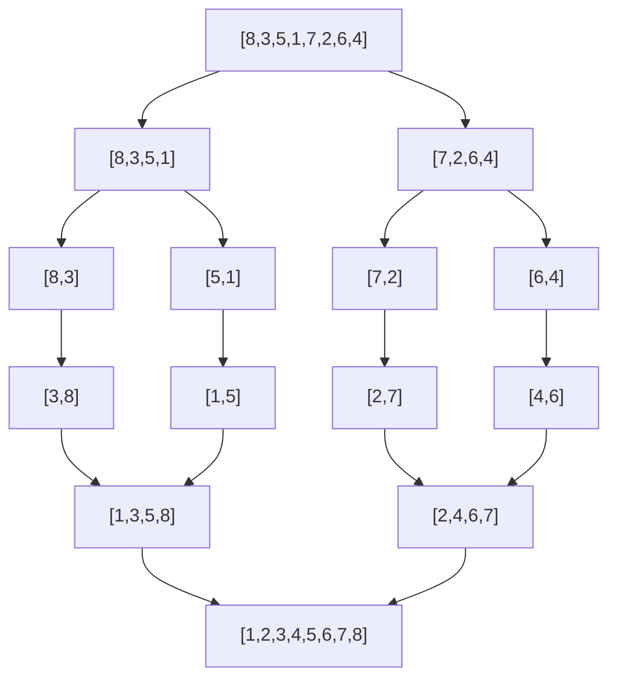
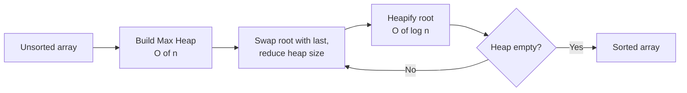
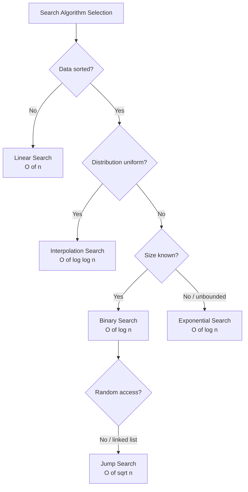
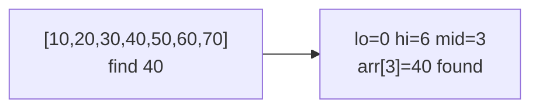
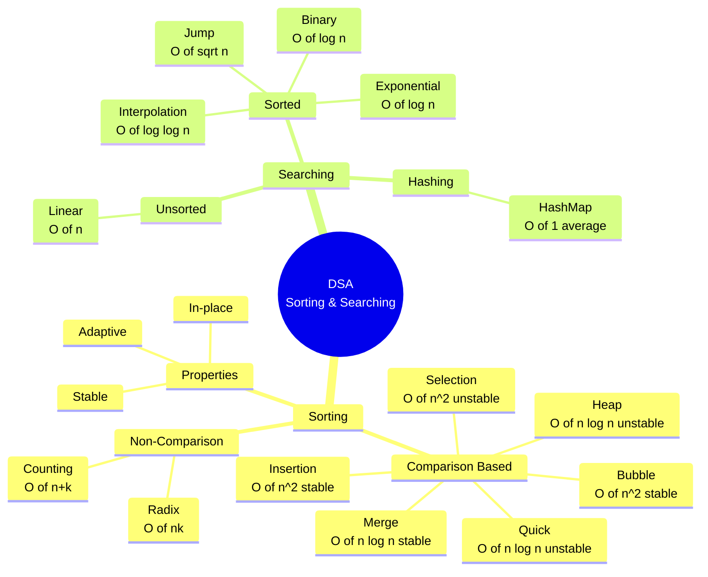

# DSA — Sorting & Searching Algorithms (Bangladesh Bank IT/AME/Programmer)

> Bangladesh Bank IT Officer, Assistant Maintenance Engineer (AME), এবং Programmer পরীক্ষার জন্য DSA-র সবচেয়ে গুরুত্বপূর্ণ দুইটা topic — Sorting ও Searching। Concept Card + Written Q + MCQ — এক জায়গায় exam-ready format-এ।

---

## Table of Contents

1. [Sorting Algorithms — Concept Card](#1-sorting-algorithms--concept-card)
2. [Sorting — Written Card](#2-sorting--written-card)
3. [Sorting — MCQ Card](#3-sorting--mcq-card)
4. [Searching Algorithms — Concept Card](#4-searching-algorithms--concept-card)
5. [Searching — Written Card](#5-searching--written-card)
6. [Searching — MCQ Card](#6-searching--mcq-card)

---

# DSA Topic: Sorting Algorithms

---

## 1. Sorting Algorithms — Concept Card

### 🟦 CONCEPT CARD — Sorting Algorithms

**Sorting** হলো এমন একটা process যেখানে একটা list/array-এর element গুলোকে কোনো নির্দিষ্ট order-এ (সাধারণত ascending বা descending) সাজানো হয়। Sorting হলো computer science-এর সবচেয়ে fundamental operation, কারণ একবার data sorted হয়ে গেলে searching, merging, duplicate detection — সবকিছু অনেক fast হয়ে যায়।

Sorting algorithm-গুলোকে কয়েকটা category-তে ভাগ করা যায়:

- **Comparison-based sort** — element-গুলোকে compare (`<`, `>`, `==`) করে সাজানো হয়। যেমন: Bubble, Selection, Insertion, Merge, Quick, Heap। এদের theoretical lower bound `O(n log n)`।
- **Non-comparison sort** — comparison ছাড়াই key-এর actual value ব্যবহার করে সাজায়। যেমন: Counting Sort, Radix Sort, Bucket Sort। এরা `O(n)` পর্যন্ত যেতে পারে কিন্তু constraint থাকে।
- **In-place sort** — extra memory প্রায় লাগে না (`O(1)` বা `O(log n)`)। যেমন: Bubble, Selection, Insertion, Quick, Heap।
- **Out-of-place sort** — আলাদা array লাগে। যেমন: Merge Sort (`O(n)` extra), Counting Sort (`O(k)` extra)।
- **Stable sort** — equal value-যুক্ত element-দের relative order preserve করে। যেমন: Bubble, Insertion, Merge, Counting, Radix।
- **Unstable sort** — equal element-দের order change হতে পারে। যেমন: Selection, Quick, Heap।

---

### 1️⃣ Bubble Sort

**Bubble Sort** হলো সবচেয়ে simple sorting algorithm। এখানে পাশাপাশি (adjacent) দুইটা element compare করা হয় এবং order ভুল থাকলে swap করা হয়। প্রত্যেকটা pass-এ সবচেয়ে বড় element array-র শেষে "bubble up" হয়ে যায় — তাই নাম Bubble Sort।

- প্রতিটা pass-এ একটা করে largest element নিজের সঠিক জায়গায় যায়।
- Total `n-1` pass লাগে।
- Optimization: কোনো pass-এ যদি কোনো swap না হয়, তাহলে array already sorted — early termination করা যায়।
- **Stable** (equal element swap হয় না)।
- **Best case** `O(n)` (already sorted, with optimization), **Worst/Average** `O(n²)`।

```c
void bubbleSort(int arr[], int n) {
    for (int i = 0; i < n - 1; i++) {
        int swapped = 0;
        for (int j = 0; j < n - i - 1; j++) {
            if (arr[j] > arr[j + 1]) {
                int t = arr[j]; arr[j] = arr[j + 1]; arr[j + 1] = t;
                swapped = 1;
            }
        }
        if (!swapped) break; // early termination
    }
}
```

---

### 2️⃣ Selection Sort

**Selection Sort**-এ unsorted অংশ থেকে সবচেয়ে ছোট element খুঁজে বের করে সেটাকে unsorted অংশের প্রথম position-এ swap করা হয়। প্রতি pass-এ একটা করে minimum select হয়, তাই নাম Selection Sort।

- `n-1` pass লাগে।
- Comparison সবসময় same — তাই best, average, worst সবই `O(n²)`।
- **Not stable** — distant swap-এর কারণে equal element-এর relative order ভাঙতে পারে। যেমন `[5a, 3, 5b, 2]` → first pass-এ `5a` আর `2` swap হবে, ফলে `5a` আর `5b`-এর order উল্টে যাবে।
- **In-place** (`O(1)` extra space)।
- Number of swap minimum (`O(n)`) — তাই memory write costly হলে useful।

```c
void selectionSort(int arr[], int n) {
    for (int i = 0; i < n - 1; i++) {
        int minIdx = i;
        for (int j = i + 1; j < n; j++)
            if (arr[j] < arr[minIdx]) minIdx = j;
        int t = arr[i]; arr[i] = arr[minIdx]; arr[minIdx] = t;
    }
}
```

---

### 3️⃣ Insertion Sort

**Insertion Sort**-এ এক-একটা element নিয়ে তাকে left-side-এর already-sorted অংশে সঠিক জায়গায় insert করা হয় — ঠিক যেভাবে আমরা হাতে তাস (playing cards) সাজাই।

- **Stable**, **in-place**।
- **Nearly sorted** data-র জন্য অসাধারণ — `O(n)` best case।
- **Online algorithm** — data যখন একটা একটা করে আসছে, তখনও sort করা যায়।
- Small array-র জন্য (n < 10-20) Quick Sort/Merge Sort-এর চেয়েও fast (low overhead, cache-friendly)।
- Hybrid sort (যেমন **Timsort**, **Introsort**) ছোট partition-এ Insertion Sort ব্যবহার করে।

```c
void insertionSort(int arr[], int n) {
    for (int i = 1; i < n; i++) {
        int key = arr[i], j = i - 1;
        while (j >= 0 && arr[j] > key) {
            arr[j + 1] = arr[j];
            j--;
        }
        arr[j + 1] = key;
    }
}
```

---

### 4️⃣ Merge Sort

**Merge Sort** হলো **Divide and Conquer** ভিত্তিক algorithm। এটা array-কে দুই ভাগে divide করে, recursively দুই ভাগ sort করে, তারপর দুইটা sorted ভাগ merge করে।

- **Stable**, **out-of-place** (`O(n)` extra space লাগে)।
- সবসময় `O(n log n)` — best, average, worst সবই same।
- Linked list-এ Merge Sort খুব efficient (random access লাগে না)।
- External sorting (disk-এর data sort) — Merge Sort-ই default choice।

**Recurrence:** $T(n) = 2T(n/2) + O(n)$, যার solution $T(n) = O(n \log n)$।



---

### 5️⃣ Quick Sort

**Quick Sort**-ও **Divide and Conquer**, কিন্তু এটা আগেই partition করে — একটা **pivot** select করে, pivot-এর চেয়ে ছোট সব বাঁ-পাশে আর বড় সব ডান-পাশে রাখে। তারপর recursively দুই পাশ sort করে।

- **In-place** (`O(log n)` recursion stack), **not stable**।
- **Average** `O(n log n)`, কিন্তু **worst case** `O(n²)` — যখন pivot সবসময় smallest/largest হয় (already sorted array-তে first element pivot নিলে এটা ঘটে)।
- Practice-এ Merge Sort-এর চেয়ে fast — better cache performance, smaller constants।
- Worst case এড়াতে **randomized pivot** বা **median-of-three** ব্যবহার করা হয়।
- Built-in library sort (C-এর `qsort`, Java/C++-এর older `sort`) প্রায়ই Quick Sort-ভিত্তিক।

```c
int partition(int arr[], int lo, int hi) {
    int pivot = arr[hi], i = lo - 1;
    for (int j = lo; j < hi; j++) {
        if (arr[j] <= pivot) {
            i++;
            int t = arr[i]; arr[i] = arr[j]; arr[j] = t;
        }
    }
    int t = arr[i + 1]; arr[i + 1] = arr[hi]; arr[hi] = t;
    return i + 1;
}
void quickSort(int arr[], int lo, int hi) {
    if (lo < hi) {
        int p = partition(arr, lo, hi);
        quickSort(arr, lo, p - 1);
        quickSort(arr, p + 1, hi);
    }
}
```

---

### 6️⃣ Heap Sort

**Heap Sort** একটা **Max Heap** (binary heap যেখানে parent ≥ children) build করে, তারপর বারবার root (largest element) extract করে array-র শেষে রাখে।

- **In-place**, **not stable**।
- সবসময় `O(n log n)` — best, average, worst।
- Heap build `O(n)`, n-বার extract `O(n log n)`।
- Quick Sort-এর চেয়ে practice-এ slow (cache unfriendly), তবে guaranteed `O(n log n)`।
- **Priority queue** implementation-এর base।



---

### 7️⃣ Counting Sort

**Counting Sort** একটা **non-comparison sort**। এটা প্রতিটা key কতবার আছে সেটা count করে, তারপর cumulative count থেকে output position বের করে।

- **Stable**, **out-of-place** (`O(k)` extra, যেখানে k = range)।
- Time `O(n + k)` — যদি `k = O(n)`, তাহলে linear time।
- শুধু **integer key** (বা integer-এ map করা যায় এমন key) এর জন্য কাজ করে।
- Range বড় হলে (যেমন k = 10⁹) memory blow up হয়ে যায়।
- Radix Sort-এর internal building block।

---

### 8️⃣ Radix Sort

**Radix Sort** digit-by-digit sort করে। সাধারণত **Least Significant Digit (LSD)** থেকে **Most Significant Digit (MSD)** পর্যন্ত যায়, প্রতিটা digit-এ Counting Sort (stable) ব্যবহার করে।

- **Stable**, **non-comparison**।
- Time `O(d × (n + b))` যেখানে d = digit সংখ্যা, b = base (সাধারণত 10 বা 256)।
- Fixed-length integer/string-এর জন্য খুব fast।
- Bucket Sort-এর close cousin।

---

### Key Points (১০টি গুরুত্বপূর্ণ কথা)

1. **Comparison-based sort-এর theoretical lower bound** `Ω(n log n)` — এর নিচে comparison দিয়ে যাওয়া impossible।
2. **Merge Sort** সবসময় `O(n log n)`, কিন্তু `O(n)` extra space লাগে।
3. **Quick Sort** average-এ fastest, কিন্তু worst case `O(n²)` — randomized pivot use করতে হয়।
4. **Heap Sort** in-place এবং guaranteed `O(n log n)`, কিন্তু practice-এ Quick Sort-এর চেয়ে slow।
5. **Insertion Sort** ছোট বা nearly-sorted data-র জন্য best — তাই hybrid sort-এ ব্যবহার হয়।
6. **Bubble, Insertion, Merge, Counting, Radix** — stable। **Selection, Quick, Heap** — unstable।
7. **Counting Sort** integer key-এর সীমিত range-এ `O(n)` দেয়, কিন্তু range বড় হলে useless।
8. **Radix Sort** fixed-width integer-এর জন্য Quick Sort-এর চেয়েও fast হতে পারে।
9. **External sorting** (data RAM-এ ধরে না) — Merge Sort-ই default।
10. **Built-in sort** (Python `sorted`, Java `Arrays.sort` for objects) সাধারণত **Timsort** — Merge + Insertion-এর hybrid।

---

### Time & Space Complexity Comparison

| Algorithm | Best | Average | Worst | Space | Stable | In-place |
|-----------|------|---------|-------|-------|--------|----------|
| **Bubble Sort** | $O(n)$ | $O(n^2)$ | $O(n^2)$ | $O(1)$ | ✅ Yes | ✅ Yes |
| **Selection Sort** | $O(n^2)$ | $O(n^2)$ | $O(n^2)$ | $O(1)$ | ❌ No | ✅ Yes |
| **Insertion Sort** | $O(n)$ | $O(n^2)$ | $O(n^2)$ | $O(1)$ | ✅ Yes | ✅ Yes |
| **Merge Sort** | $O(n \log n)$ | $O(n \log n)$ | $O(n \log n)$ | $O(n)$ | ✅ Yes | ❌ No |
| **Quick Sort** | $O(n \log n)$ | $O(n \log n)$ | $O(n^2)$ | $O(\log n)$ | ❌ No | ✅ Yes |
| **Heap Sort** | $O(n \log n)$ | $O(n \log n)$ | $O(n \log n)$ | $O(1)$ | ❌ No | ✅ Yes |
| **Counting Sort** | $O(n+k)$ | $O(n+k)$ | $O(n+k)$ | $O(k)$ | ✅ Yes | ❌ No |
| **Radix Sort** | $O(nk)$ | $O(nk)$ | $O(nk)$ | $O(n+k)$ | ✅ Yes | ❌ No |

### কখন কোনটা ব্যবহার করব

| Situation | Best Choice |
|-----------|-------------|
| ছোট array (n < 20) | Insertion Sort |
| Nearly sorted data | Insertion Sort / Bubble (with flag) |
| Guaranteed `O(n log n)` লাগবে | Merge Sort / Heap Sort |
| Average-এ fastest, memory tight | Quick Sort (randomized) |
| Stable sort লাগবে + memory আছে | Merge Sort |
| Integer, small range | Counting Sort |
| Fixed-width integer | Radix Sort |
| External / disk-based | Merge Sort |
| Linked list | Merge Sort |
| Priority queue / streaming top-k | Heap Sort |

---

## 2. Sorting — Written Card

### 📝 WRITTEN CARD — Sorting

---

**Q1.** Explain Bubble Sort with algorithm and trace through the array `[5, 3, 8, 1, 2]`.

**Answer:**

Bubble Sort একটা simple comparison-based sorting algorithm। এর core idea হলো — পাশাপাশি (adjacent) দুইটা element compare করো, যদি order ভুল থাকে তাহলে swap করো। প্রত্যেক pass-এ সবচেয়ে বড় element array-র শেষে চলে যায় (bubble up করে), তাই নাম Bubble Sort।

**Algorithm:**

```text
BubbleSort(arr, n):
    for i = 0 to n-2:
        swapped = false
        for j = 0 to n-i-2:
            if arr[j] > arr[j+1]:
                swap(arr[j], arr[j+1])
                swapped = true
        if swapped == false:
            break   // already sorted, early exit
```

**Trace `[5, 3, 8, 1, 2]`:**

**Pass 1** (i = 0): largest element শেষে যাবে।

| Step | Compare | Action | Array |
|------|---------|--------|-------|
| j=0 | 5 vs 3 | swap | `[3, 5, 8, 1, 2]` |
| j=1 | 5 vs 8 | no swap | `[3, 5, 8, 1, 2]` |
| j=2 | 8 vs 1 | swap | `[3, 5, 1, 8, 2]` |
| j=3 | 8 vs 2 | swap | `[3, 5, 1, 2, 8]` |

**Pass 2** (i = 1):

| Step | Compare | Action | Array |
|------|---------|--------|-------|
| j=0 | 3 vs 5 | no swap | `[3, 5, 1, 2, 8]` |
| j=1 | 5 vs 1 | swap | `[3, 1, 5, 2, 8]` |
| j=2 | 5 vs 2 | swap | `[3, 1, 2, 5, 8]` |

**Pass 3** (i = 2):

| Step | Compare | Action | Array |
|------|---------|--------|-------|
| j=0 | 3 vs 1 | swap | `[1, 3, 2, 5, 8]` |
| j=1 | 3 vs 2 | swap | `[1, 2, 3, 5, 8]` |

**Pass 4** (i = 3):

| Step | Compare | Action | Array |
|------|---------|--------|-------|
| j=0 | 1 vs 2 | no swap | `[1, 2, 3, 5, 8]` |

কোনো swap হয়নি → early termination → array sorted: **`[1, 2, 3, 5, 8]`**।

**Complexity:** Worst/Average `O(n²)`, Best `O(n)` (with swap flag), Space `O(1)`, **Stable**।

---

**Q2.** Explain Merge Sort with example. Why is its time complexity `O(n log n)`? Compare with Quick Sort.

**Answer:**

**Merge Sort** হলো একটা **Divide and Conquer** algorithm। তিনটা step আছে:

1. **Divide:** array-কে মাঝখান থেকে দুই ভাগে ভাগ করো।
2. **Conquer:** দুই ভাগকে recursively sort করো।
3. **Combine (Merge):** দুইটা sorted ভাগ merge করে একটা sorted array বানাও।

**Example trace `[8, 3, 5, 1, 7, 2]`:**

```text
Divide phase:
[8,3,5,1,7,2]
   /        \
[8,3,5]    [1,7,2]
 /   \      /   \
[8] [3,5] [1] [7,2]
     / \        / \
    [3][5]    [7][2]

Merge phase:
[3] + [5] -> [3,5]
[8] + [3,5] -> [3,5,8]
[7] + [2] -> [2,7]
[1] + [2,7] -> [1,2,7]
[3,5,8] + [1,2,7] -> [1,2,3,5,7,8]
```

**কেন `O(n log n)`?**

Recurrence relation:
$$T(n) = 2T(n/2) + O(n)$$

- `2T(n/2)` — দুইটা subproblem, প্রতিটা size n/2।
- `O(n)` — merge step linear time-এ হয়।

**Master Theorem** apply করলে: $a = 2$, $b = 2$, $f(n) = O(n)$, $\log_b a = 1$। যেহেতু $f(n) = \Theta(n^{\log_b a})$, তাই Case 2 applicable, এবং:

$$T(n) = \Theta(n \log n)$$

**Intuition:** Recursion tree-র `log n` level আছে, প্রতিটা level-এ মোট `O(n)` কাজ হয়। Total = `n × log n`।

**Merge Sort vs Quick Sort:**

| বিষয় | Merge Sort | Quick Sort |
|------|------------|------------|
| Approach | Divide and Conquer | Divide and Conquer (with partition) |
| Best | $O(n \log n)$ | $O(n \log n)$ |
| Average | $O(n \log n)$ | $O(n \log n)$ |
| Worst | $O(n \log n)$ | $O(n^2)$ |
| Space | $O(n)$ extra | $O(\log n)$ stack |
| Stable | ✅ Yes | ❌ No |
| In-place | ❌ No | ✅ Yes |
| Cache friendly | কম | বেশি |
| Linked list-এ | চমৎকার | কঠিন (random access নেই) |
| External sort-এ | best choice | impractical |
| Practice speed | slower | faster (constant factor কম) |

---

**Q3.** What is a stable sorting algorithm? Which of the common sorting algorithms are stable?

**Answer:**

**Stability** হলো sorting algorithm-এর একটা property যেটা বলে — যদি দুইটা element-এর key value সমান হয়, তাহলে original input-এ তারা যে order-এ ছিল, sorted output-এও সেই order-এ থাকবে।

**Example:** ধরা যাক records `[(5, A), (3, X), (5, B), (2, Y)]` — first element key, second হলো label। Sort by key:

- **Stable sort:** `[(2, Y), (3, X), (5, A), (5, B)]` — `5A` আগে, `5B` পরে (input order preserved)।
- **Unstable sort:** `[(2, Y), (3, X), (5, B), (5, A)]` হতেও পারে — order undefined।

**কেন Stability জরুরি?**

Multi-key sorting-এ। যেমন একটা student list — আগে `name` দিয়ে sort করলাম, তারপর `class` দিয়ে। যদি class-sort stable হয়, তাহলে same class-এর students name-order-এই থাকবে। Unstable হলে এই information হারিয়ে যাবে।

**Stable Algorithms:**

| Algorithm | কেন Stable |
|-----------|-----------|
| Bubble Sort | শুধু adjacent swap, equal হলে swap করে না |
| Insertion Sort | equal element-এর সামনে যায় না |
| Merge Sort | merge-এ left half-এর element আগে নেওয়া হয় (`<=` দিয়ে) |
| Counting Sort | cumulative count + reverse traversal |
| Radix Sort | base-এ stable sort (Counting) ব্যবহার করে |

**Unstable Algorithms:**

| Algorithm | কেন Unstable |
|-----------|--------------|
| Selection Sort | distant swap — `[5a, 3, 5b, 2]` → first pass-এ `5a` আর `2` swap, order ভাঙে |
| Quick Sort | partition-এ pivot equal element-এর order ভাঙে |
| Heap Sort | heap operation parent-child swap unpredictable |

**Note:** Selection Sort, Quick Sort, Heap Sort — extra information রাখলে (যেমন original index) stable বানানো যায়, কিন্তু তখন extra memory লাগে।

---

**Q4.** Explain Quick Sort. What is the worst case of Quick Sort and when does it occur?

**Answer:**

**Quick Sort** একটা Divide and Conquer algorithm যেটা **partitioning** ব্যবহার করে। Steps:

1. একটা **pivot** element select করো (সাধারণত last/first/random/median)।
2. **Partition** করো — pivot-এর চেয়ে ছোট সব element pivot-এর বাঁ-পাশে, বড় সব ডান-পাশে।
3. Pivot এখন তার final sorted position-এ।
4. বাঁ-অংশ আর ডান-অংশকে recursively quick sort করো।

**Trace `[7, 2, 1, 6, 8, 5, 3, 4]`** (last element = pivot = 4):

```text
Partition with pivot 4:
[2, 1, 3, 4, 8, 5, 7, 6]
       ^pivot at index 3

Left:  [2, 1, 3]      Right: [8, 5, 7, 6]
       pivot=3              pivot=6
       [2,1,3]              [5,6,8,7]
       /   \                /     \
      [2,1] []          [5]    [8,7]
       p=1                       p=7
       [1,2]                     [7,8]

Final: [1, 2, 3, 4, 5, 6, 7, 8]
```

**Pseudocode (Lomuto partition):**

```c
int partition(int a[], int lo, int hi) {
    int pivot = a[hi], i = lo - 1;
    for (int j = lo; j < hi; j++)
        if (a[j] <= pivot) { i++; swap(a[i], a[j]); }
    swap(a[i+1], a[hi]);
    return i + 1;
}
void quickSort(int a[], int lo, int hi) {
    if (lo < hi) {
        int p = partition(a, lo, hi);
        quickSort(a, lo, p - 1);
        quickSort(a, p + 1, hi);
    }
}
```

**Worst Case: `O(n²)`**

Worst case ঘটে যখন প্রতিবার pivot সবচেয়ে ছোট বা সবচেয়ে বড় element হয় — তখন partition একদম unbalanced হয়ে যায় (এক পাশে 0 element, অন্য পাশে n-1)।

**কখন ঘটে:**

1. Already sorted array (`[1,2,3,4,5]`) — যদি always last (বা first) element pivot নেওয়া হয়।
2. Reverse sorted array (`[5,4,3,2,1]`) — same reason।
3. সব element same — naive partition-এ।

**Recurrence:** $T(n) = T(n-1) + O(n) = O(n^2)$

**Worst case এড়ানোর উপায়:**

- **Randomized pivot** — random index থেকে pivot নাও।
- **Median-of-three** — first, middle, last তিনটার median নাও।
- **Introsort** — recursion depth বেড়ে গেলে Heap Sort-এ switch করো (C++ STL `std::sort` এভাবেই করে)।

---

**Q5.** When would you choose Insertion Sort over Merge Sort despite worse average complexity?

**Answer:**

Insertion Sort-এর average case `O(n²)`, যা Merge Sort-এর `O(n log n)`-এর চেয়ে theoretically slower। কিন্তু কিছু practical situation-এ Insertion Sort actually better:

**1. Small array (n < 10–20):**

Asymptotic complexity শুধু large n-এর জন্য meaningful। ছোট n-এ constant factor বেশি গুরুত্বপূর্ণ। Merge Sort-এর recursion overhead, function call, extra memory allocation — সব মিলিয়ে ছোট data-তে slow। Insertion Sort-এর simple loop fast। তাই **Timsort, Introsort** ছোট partition-এ Insertion Sort use করে (cutoff সাধারণত 16-32)।

**2. Nearly sorted / partially sorted data:**

যদি data already প্রায় sorted হয়, Insertion Sort `O(n + d)` time-এ চলে, যেখানে `d` = inversions count। Merge Sort তখনও `O(n log n)`। Real-world data প্রায়ই nearly sorted — log file, time-series data ইত্যাদি।

**3. Online algorithm / streaming data:**

Data যখন একটা একটা করে আসছে (stream), Insertion Sort তাৎক্ষণিকভাবে নতুন element-কে correct position-এ insert করতে পারে। Merge Sort-এর জন্য পুরো data আগে collect করা লাগে।

**4. Memory constrained / Embedded system:**

Insertion Sort `O(1)` extra space-এ চলে। Merge Sort `O(n)` extra memory লাগে — embedded device বা microcontroller-এ এটা afford করা যায় না।

**5. Cache locality:**

Insertion Sort sequential access করে, তাই CPU cache-friendly। Merge Sort-এর merge step random access বেশি — cache miss বেশি।

**6. Stable sort + simple implementation:**

Insertion Sort stable এবং কোডে কম জায়গা লাগে। যেখানে binary size matter করে (firmware, IoT), Insertion Sort prefer করা হয়।

**7. Linked list-এ:**

Linked list-এ Insertion Sort-এ shifting লাগে না, শুধু pointer adjust। তবে Merge Sort linked list-এও ভালো — তাই এটা less common reason।

**Summary:** Production-এ "pure" Insertion বা Merge Sort-এর বদলে **hybrid sort** (Timsort, Introsort) ব্যবহার হয়, যেখানে দুইটার strength combine করা হয়।

---

## 3. Sorting — MCQ Card

### ❓ MCQ CARD — Sorting

---

**31.** Which sorting algorithm has the BEST worst-case time complexity?

A) Quick Sort
B) Bubble Sort
C) Merge Sort
D) Insertion Sort

**Correct Answer:** C

**Explanation:** Merge Sort-এর worst case সবসময় $O(n \log n)$, কারণ এটা ALWAYS array-কে অর্ধেকে ভাগ করে — input কেমন তাতে কিছু যায় আসে না। Quick Sort-এর worst case $O(n^2)$ (already sorted array-তে first element pivot)। Bubble Sort এবং Insertion Sort-এর worst case $O(n^2)$। তাই উত্তর **C — Merge Sort**।

---

**32.** Which sorting algorithm is NOT stable?

A) Bubble Sort
B) Merge Sort
C) Quick Sort
D) Insertion Sort

**Correct Answer:** C

**Explanation:** Quick Sort partition phase-এ pivot element-এর সাথে অন্য element swap করে — এতে equal value-যুক্ত element-দের relative order change হতে পারে। উদাহরণ: `[5a, 3, 5b, 2]` partition করলে `5a` এবং `5b`-এর order ভেঙে যেতে পারে। Bubble Sort, Insertion Sort, Merge Sort — তিনটাই stable (equal element-এর original order preserve করে)। তাই উত্তর **C — Quick Sort**।

---

**33.** What is the worst-case time complexity of Quick Sort?

A) $O(n \log n)$
B) $O(n^2)$
C) $O(n)$
D) $O(\log n)$

**Correct Answer:** B

**Explanation:** Quick Sort-এর worst case ঘটে যখন pivot সবসময় smallest বা largest element হয় — তখন partition একদম unbalanced। Already sorted বা reverse sorted array-তে first/last element pivot নিলে এটা ঘটে। Recurrence: $T(n) = T(n-1) + O(n) = O(n^2)$। Average case $O(n \log n)$, কিন্তু worst case $O(n^2)$। তাই উত্তর **B**।

---

**34.** Which sort does NOT need any comparison between elements?

A) Merge Sort
B) Counting Sort
C) Quick Sort
D) Heap Sort

**Correct Answer:** B

**Explanation:** **Counting Sort** একটা **non-comparison sort** — এটা element-গুলোকে compare করে না, বরং প্রতিটা key কতবার appear করে সেটা count করে একটা auxiliary array-তে। তারপর cumulative count থেকে output position বের করে। Merge Sort, Quick Sort, Heap Sort — তিনটাই comparison-based, যেগুলোর theoretical lower bound $\Omega(n \log n)$। Counting Sort $O(n+k)$ time-এ চলে। তাই উত্তর **B — Counting Sort**।

---

**35.** In Bubble Sort, what optimization makes the best case `O(n)`?

A) Using recursion
B) Checking if no swaps occurred in a pass (early termination flag)
C) Using two pointers
D) Reducing comparisons by half

**Correct Answer:** B

**Explanation:** Standard Bubble Sort সবসময় `n-1` pass চালায়, তাই সবসময় `O(n²)`। কিন্তু একটা **swapped flag** যোগ করলে: প্রতিটা pass-এর শুরুতে flag = false, কোনো swap হলে flag = true। যদি একটা পুরো pass-এ কোনো swap না হয়, তার মানে array already sorted — তাই break করা যায়। Already sorted input-এ এক pass-ই যথেষ্ট → `O(n)`। অন্য option-গুলো incorrect: recursion দিয়ে complexity কমে না, two pointer (Cocktail Sort) আলাদা variation, comparison অর্ধেক হলেও `O(n²)`-ই থাকে। তাই উত্তর **B**।

---

**Bonus MCQs (অতিরিক্ত প্রস্তুতির জন্য):**

---

**36.** Which sorting algorithm uses Divide and Conquer paradigm?

A) Insertion Sort
B) Selection Sort
C) Merge Sort
D) Bubble Sort

**Correct Answer:** C

**Explanation:** Merge Sort এবং Quick Sort — দুইটাই Divide and Conquer। Insertion, Selection, Bubble — সব iterative comparison-based। তাই উত্তর **C**।

---

**37.** Which sorting algorithm is best for an almost-sorted array?

A) Quick Sort
B) Merge Sort
C) Insertion Sort
D) Heap Sort

**Correct Answer:** C

**Explanation:** Insertion Sort nearly-sorted data-তে $O(n)$ time-এ চলে — প্রতিটা element তার ঠিক জায়গার কাছাকাছি থাকে, তাই inner while loop প্রায় চলে না। Quick Sort already-sorted array-তে worst case ($O(n^2)$) দেয়। তাই উত্তর **C**।

---

**38.** The number of swaps required by Selection Sort in the worst case is:

A) $O(1)$
B) $O(n)$
C) $O(n \log n)$
D) $O(n^2)$

**Correct Answer:** B

**Explanation:** Selection Sort-এ প্রতিটা pass-এ অনেক comparison ($O(n)$) হলেও, swap শুধু একবার (minimum পাওয়ার পর)। মোট pass `n-1`, তাই swap সংখ্যা `n-1 = O(n)`। Memory write expensive হলে এটা useful। তাই উত্তর **B**।

---

**39.** Heap Sort uses which data structure internally?

A) Stack
B) Queue
C) Binary Heap
D) Linked List

**Correct Answer:** C

**Explanation:** Heap Sort একটা **Binary Heap** (সাধারণত Max Heap) build করে, যেখানে parent ≥ children। তারপর root (largest) repeatedly extract করে শেষে রাখে। Binary heap array-তে implement করা হয় (parent at i, children at 2i+1 and 2i+2)। তাই উত্তর **C**।

---

**40.** For sorting integers in range [0, k] where k = O(n), the most efficient algorithm is:

A) Quick Sort
B) Merge Sort
C) Counting Sort
D) Heap Sort

**Correct Answer:** C

**Explanation:** Counting Sort $O(n+k)$ time-এ চলে। যদি `k = O(n)`, তাহলে total `O(n)` — যা comparison-based sort-এর `O(n log n)` lower bound-এর চেয়ে faster। Quick/Merge/Heap সবই `O(n log n)`। তাই উত্তর **C — Counting Sort**।

---

# DSA Topic: Searching Algorithms

---

## 4. Searching Algorithms — Concept Card

### 🟦 CONCEPT CARD — Searching Algorithms

**Searching** হলো একটা data collection-এর মধ্যে নির্দিষ্ট element (key) খুঁজে বের করার process। Sorting-এর পরে searching হলো computer science-এর সবচেয়ে fundamental operation। Algorithm-এর choice depend করে data-র structure-এর উপর — sorted নাকি unsorted, array নাকি linked list, distribution কেমন।



---

### 1️⃣ Linear Search

**Linear Search** (Sequential Search) হলো সবচেয়ে simple searching algorithm। Array-র শুরু থেকে শেষ পর্যন্ত প্রতিটা element check করা হয়, যতক্ষণ না target পাওয়া যায় বা array শেষ হয়।

- **Prerequisite:** কিচ্ছু লাগে না — sorted/unsorted দুটাতেই কাজ করে।
- **Time:** Best `O(1)` (first position-এ পেলে), Average/Worst `O(n)`।
- **Space:** `O(1)`।
- Linked list, small array, single search, unsorted data — এসব ক্ষেত্রে best।

```c
int linearSearch(int arr[], int n, int key) {
    for (int i = 0; i < n; i++)
        if (arr[i] == key) return i;
    return -1;
}
```

---

### 2️⃣ Binary Search

**Binary Search** sorted array-তে কাজ করে। Idea: middle element-এর সাথে compare করো — যদি equal, found। যদি target ছোট, left half-এ search করো; বড় হলে right half-এ। প্রতিবার search space অর্ধেক হয় — তাই `O(log n)`।

- **Prerequisite:** array অবশ্যই sorted হতে হবে।
- **Time:** Best `O(1)`, Average/Worst `O(log n)`।
- **Space:** Iterative `O(1)`, Recursive `O(log n)` (recursion stack)।
- Random access লাগে — তাই linked list-এ inefficient।

**Iterative version:**

```c
int binarySearch(int arr[], int n, int key) {
    int lo = 0, hi = n - 1;
    while (lo <= hi) {
        int mid = lo + (hi - lo) / 2;  // overflow-safe
        if (arr[mid] == key) return mid;
        else if (arr[mid] < key) lo = mid + 1;
        else hi = mid - 1;
    }
    return -1;
}
```

**Recursive version:**

```c
int binarySearchRec(int arr[], int lo, int hi, int key) {
    if (lo > hi) return -1;
    int mid = lo + (hi - lo) / 2;
    if (arr[mid] == key) return mid;
    if (arr[mid] < key) return binarySearchRec(arr, mid + 1, hi, key);
    return binarySearchRec(arr, lo, mid - 1, key);
}
```

**Recurrence:** $T(n) = T(n/2) + O(1)$, solving: $T(n) = O(\log n)$।



---

### 3️⃣ Jump Search

**Jump Search** sorted array-তে fixed-size block (`√n`) লাফিয়ে যায়। যেই block-এ target থাকতে পারে সেটা detect হলে, সেই block-এ linear search চালায়।

- **Prerequisite:** sorted array।
- **Time:** Best `O(1)`, Average/Worst `O(\sqrt{n})`।
- **Space:** `O(1)`।
- Binary Search-এর চেয়ে slow, কিন্তু linked list-এর মতো structure-এ যেখানে jump cheap কিন্তু backward jump expensive — Jump Search ভালো।

**Optimal block size:** `√n` (calculus দিয়ে minimize করলে এটাই আসে)।

```c
int jumpSearch(int arr[], int n, int key) {
    int step = sqrt(n), prev = 0;
    while (arr[(step < n ? step : n) - 1] < key) {
        prev = step;
        step += sqrt(n);
        if (prev >= n) return -1;
    }
    while (arr[prev] < key) {
        prev++;
        if (prev == (step < n ? step : n)) return -1;
    }
    if (arr[prev] == key) return prev;
    return -1;
}
```

---

### 4️⃣ Interpolation Search

**Interpolation Search** Binary Search-এর uniformly distributed data-র জন্য optimization। Middle এ যাওয়ার বদলে probable position-এ যায়, ঠিক যেভাবে আমরা phone book-এ "S" খুঁজতে শেষের দিকে যাই।

- **Prerequisite:** sorted + **uniformly distributed**।
- **Time:** Best `O(1)`, Average `O(\log \log n)`, Worst `O(n)` (non-uniform data-তে)।
- **Space:** `O(1)`।

**Probable position formula:**

$$pos = lo + \frac{(key - arr[lo]) \times (hi - lo)}{arr[hi] - arr[lo]}$$

```c
int interpolationSearch(int arr[], int n, int key) {
    int lo = 0, hi = n - 1;
    while (lo <= hi && key >= arr[lo] && key <= arr[hi]) {
        if (lo == hi) return arr[lo] == key ? lo : -1;
        int pos = lo + ((double)(hi - lo) * (key - arr[lo])) / (arr[hi] - arr[lo]);
        if (arr[pos] == key) return pos;
        if (arr[pos] < key) lo = pos + 1;
        else hi = pos - 1;
    }
    return -1;
}
```

---

### 5️⃣ Exponential Search

**Exponential Search** (বা Doubling Search) **unbounded / infinite size** array-র জন্য designed। এটা প্রথমে exponentially (1, 2, 4, 8, 16, …) jump করে এমন একটা range খুঁজে বের করে যেখানে target থাকতে পারে, তারপর সেই range-এ Binary Search চালায়।

- **Prerequisite:** sorted array।
- **Time:** `O(\log n)`।
- **Space:** Iterative `O(1)`।
- Unbounded array (যেমন network stream-এর sorted data, infinite list) এবং target যদি array-র শুরুর দিকে থাকে — Binary Search-এর চেয়েও fast।

```c
int exponentialSearch(int arr[], int n, int key) {
    if (arr[0] == key) return 0;
    int i = 1;
    while (i < n && arr[i] <= key) i *= 2;
    return binarySearch(arr, i / 2, (i < n ? i : n - 1), key);
}
```

---

### Key Points (৮টি গুরুত্বপূর্ণ কথা)

1. **Linear Search** sorting ছাড়াই কাজ করে — তাই unsorted data-তে এটা single-shot search-এর জন্য best।
2. **Binary Search** sorted হওয়া প্রয়োজন — কিন্তু একবার sorted হলে $O(\log n)$ search পাওয়া যায়।
3. **Binary Search**-এর mid calculation: `mid = lo + (hi - lo) / 2` — `(lo + hi) / 2` overflow করতে পারে।
4. **n elements**-এ Binary Search-এর maximum comparison = $\lceil \log_2 (n+1) \rceil$।
5. **Jump Search**-এর optimal block size $\sqrt{n}$ — gradient = 0 set করলে এটাই বের হয়।
6. **Interpolation Search** uniform distribution-এ $O(\log \log n)$, কিন্তু skewed data-তে $O(n)$ পর্যন্ত যেতে পারে।
7. **Exponential Search** unbounded array-র জন্য designed — তাই infinite stream / "find first position" type problem-এ ব্যবহার হয়।
8. **Hashing** (HashMap) average $O(1)$ search দেয়, কিন্তু extra space লাগে এবং order preserve হয় না।

---

### Time & Space Complexity Comparison

| Algorithm | Best | Average | Worst | Space | Prerequisite |
|-----------|------|---------|-------|-------|--------------|
| **Linear Search** | $O(1)$ | $O(n)$ | $O(n)$ | $O(1)$ | None |
| **Binary Search** | $O(1)$ | $O(\log n)$ | $O(\log n)$ | $O(1)$ iter / $O(\log n)$ rec | Sorted |
| **Jump Search** | $O(1)$ | $O(\sqrt{n})$ | $O(\sqrt{n})$ | $O(1)$ | Sorted |
| **Interpolation Search** | $O(1)$ | $O(\log \log n)$ | $O(n)$ | $O(1)$ | Sorted + Uniform |
| **Exponential Search** | $O(1)$ | $O(\log n)$ | $O(\log n)$ | $O(1)$ | Sorted |
| **Hash Table** | $O(1)$ | $O(1)$ | $O(n)$ | $O(n)$ | Hash function |

---

## 5. Searching — Written Card

### 📝 WRITTEN CARD — Searching

---

**Q1.** What is Binary Search? Write the algorithm and trace it to find element 40 in `[10, 20, 30, 40, 50, 60, 70]`.

**Answer:**

**Binary Search** হলো একটা efficient searching algorithm যা **sorted array**-তে কাজ করে। Core idea হলো — middle element-এর সাথে compare করে প্রতিবার search space অর্ধেক করে ফেলো। এই অর্ধেক-করা পদ্ধতি Divide and Conquer-এর classic উদাহরণ।

**Algorithm:**

```text
BinarySearch(arr, n, key):
    lo = 0
    hi = n - 1
    while lo <= hi:
        mid = lo + (hi - lo) / 2
        if arr[mid] == key:
            return mid
        else if arr[mid] < key:
            lo = mid + 1
        else:
            hi = mid - 1
    return -1
```

**Trace: array `[10, 20, 30, 40, 50, 60, 70]`, key = 40**

Indexes: `0=10, 1=20, 2=30, 3=40, 4=50, 5=60, 6=70`

| Step | lo | hi | mid | arr[mid] | Action |
|------|----|----|-----|----------|--------|
| 1 | 0 | 6 | 3 | 40 | **Found! return 3** |

মাত্র 1 step-এই পাওয়া গেছে কারণ target ঠিক middle position-এ ছিল।

**আরেকটা trace: key = 60** (একটু কঠিন trace দেখানোর জন্য):

| Step | lo | hi | mid | arr[mid] | Action |
|------|----|----|-----|----------|--------|
| 1 | 0 | 6 | 3 | 40 | 40 < 60 → `lo = mid+1 = 4` |
| 2 | 4 | 6 | 5 | 60 | **Found! return 5** |

**Complexity:** Time `O(log n)`, Space `O(1)` iterative। 7 elements-এ maximum $\lceil \log_2 8 \rceil = 3$ comparisons লাগে।

---

**Q2.** Compare Linear Search and Binary Search. When is Linear Search preferred over Binary Search?

**Answer:**

**Comparison Table:**

| বিষয় | Linear Search | Binary Search |
|------|---------------|---------------|
| Time complexity | $O(n)$ | $O(\log n)$ |
| Best case | $O(1)$ | $O(1)$ |
| Space | $O(1)$ | $O(1)$ iter / $O(\log n)$ rec |
| Prerequisite | কিছুই না | sorted array |
| Implementation | অত্যন্ত simple | একটু বেশি complex |
| Data structure | array, linked list — সব | random access থাকা চাই (array) |
| Sorting overhead | লাগে না | $O(n \log n)$ লাগে আগে |

**Linear Search কখন preferred?**

1. **Unsorted data:** Sort করার cost ($O(n \log n)$) > single search cost ($O(n)$) — তাই sort না করে linear search দ্রুত।

2. **Small array:** ছোট n-এ ($n < 50$) Linear Search-এর constant factor কম, তাই Binary Search-এর চেয়েও fast হতে পারে।

3. **Linked list:** Linked list-এ random access (`arr[mid]`) `O(n)` time লাগে। তাই Binary Search এখানে $O(n \log n)$ হয়ে যায়, যা Linear Search-এর $O(n)$-এর চেয়ে slow।

4. **One-time / single search:** একবার মাত্র search হবে — তাহলে sort করে binary search-এর overhead pay করা worth না। Linear Search সরাসরি $O(n)$।

5. **Frequently changing data:** যদি data continuously insert/delete হয়, sorted রাখা cost-ly। Linear Search সহজেই কাজ করে।

6. **Streaming / online data:** Data যখন আসছে এবং সাথে সাথে check করতে হবে — Linear।

7. **Find all occurrences:** সব matching element চাই — Binary Search-এর চেয়ে Linear simpler।

**সিদ্ধান্ত:** যদি data sorted এবং multiple search-এর জন্য reuse হবে — Binary Search। অন্যথায় — Linear Search।

---

**Q3.** Write recursive and iterative versions of Binary Search. What is the difference in space complexity?

**Answer:**

**Iterative Binary Search:**

```c
int binarySearchIter(int arr[], int n, int key) {
    int lo = 0, hi = n - 1;
    while (lo <= hi) {
        int mid = lo + (hi - lo) / 2;
        if (arr[mid] == key) return mid;
        else if (arr[mid] < key) lo = mid + 1;
        else hi = mid - 1;
    }
    return -1;
}
```

**Recursive Binary Search:**

```c
int binarySearchRec(int arr[], int lo, int hi, int key) {
    if (lo > hi) return -1;             // base case
    int mid = lo + (hi - lo) / 2;
    if (arr[mid] == key) return mid;
    if (arr[mid] < key)
        return binarySearchRec(arr, mid + 1, hi, key);
    else
        return binarySearchRec(arr, lo, mid - 1, key);
}
```

**Space Complexity Difference:**

| Version | Space | Reason |
|---------|-------|--------|
| Iterative | $O(1)$ | শুধু কয়েকটা variable (`lo`, `hi`, `mid`) — fixed memory |
| Recursive | $O(\log n)$ | প্রতিটা recursive call stack-এ একটা frame push করে। Recursion depth = $\log n$ (search space প্রতিবার অর্ধেক), তাই stack-এ $\log n$ frame জমা হয় |

**কোনটা ভালো?**

- **Iterative** generally better — কম memory, no function call overhead, no stack overflow risk।
- **Recursive** code পড়তে easier, কিন্তু large n-এ stack overflow হতে পারে (যদিও $\log n$ depth অনেকটা small)।
- **Tail call optimization (TCO)** যদি compiler support করে, recursive-ও $O(1)$ space-এ run হতে পারে। C-তে standard support নেই।

Time complexity দুইটাতেই same: $O(\log n)$।

---

**Q4.** What is the time complexity of Binary Search? Derive it using the recurrence relation.

**Answer:**

Binary Search-এর time complexity **$O(\log n)$**। Derivation:

**Setting up the recurrence:**

ধরা যাক $T(n)$ = $n$ elements-এ Binary Search-এর time।

প্রতিটা step-এ:
- 1 টা comparison ($O(1)$ time)।
- যদি match না হয়, search space অর্ধেক হয় — অর্থাৎ $T(n/2)$ size-এর subproblem-এ যায়।

তাই recurrence:

$$T(n) = T(n/2) + O(1)$$

Base case: $T(1) = O(1)$।

**Method 1 — Recursion Tree / Substitution:**

বার বার expand করা যাক:

$$T(n) = T(n/2) + c$$
$$= T(n/4) + c + c = T(n/4) + 2c$$
$$= T(n/8) + 3c$$
$$= T(n/2^k) + kc$$

যখন $n/2^k = 1$, মানে $k = \log_2 n$, তখন base case hit হয়:

$$T(n) = T(1) + c \log_2 n = O(\log n)$$

**Method 2 — Master Theorem:**

Master Theorem: $T(n) = aT(n/b) + f(n)$, এখানে $a = 1$, $b = 2$, $f(n) = O(1) = O(n^0)$।

$\log_b a = \log_2 1 = 0$

যেহেতু $f(n) = \Theta(n^{\log_b a}) = \Theta(n^0) = \Theta(1)$, **Case 2** applicable:

$$T(n) = \Theta(n^{\log_b a} \cdot \log n) = \Theta(\log n)$$

**Intuition:** প্রতিটা step-এ search space অর্ধেক হচ্ছে। $n$ থেকে শুরু করে কতবার অর্ধেক করলে 1 হবে?

$$n \to n/2 \to n/4 \to \dots \to 1$$

এই sequence-এ step সংখ্যা = $\log_2 n$। তাই complexity $O(\log n)$।

**Practical example:**
- $n = 1{,}000{,}000$ → maximum $\log_2 1{,}000{,}000 \approx 20$ comparison।
- $n = 1{,}000{,}000{,}000$ → প্রায় 30 comparison মাত্র।

এজন্যই Binary Search এত fast — billion data-তেও 30 step-এর বেশি লাগে না।

---

## 6. Searching — MCQ Card

### ❓ MCQ CARD — Searching

---

**36.** What is the prerequisite for Binary Search?

A) Array must be of even size
B) Array must be sorted
C) Array must contain unique elements
D) Array must be stored in a linked list

**Correct Answer:** B

**Explanation:** Binary Search-এর core idea হলো — middle element-এর সাথে compare করে অর্ধেক search space eliminate করা। এই elimination শুধু তখনই কাজ করে যখন array sorted — কারণ মাঝখানে যা আছে, তার বাঁ-পাশে সব ছোট আর ডান-পাশে সব বড়। Unsorted array-তে এই assumption ভেঙে যায় — eliminate করা half-এ target থাকতে পারে। Array-র size even হতে হবে না, unique element-ও দরকার নেই, এবং linked list-এ binary search inefficient (random access নেই)। তাই উত্তর **B**।

---

**37.** Binary Search on an array of 1024 elements requires at most how many comparisons?

A) 512
B) 64
C) 10
D) 32

**Correct Answer:** C

**Explanation:** Binary Search-এর maximum comparison সংখ্যা = $\lceil \log_2 n \rceil$। এখানে $n = 1024$, এবং $\log_2 1024 = 10$ (কারণ $2^{10} = 1024$)। তাই maximum 10 comparison লাগবে। প্রতিটা comparison-এ search space অর্ধেক হয়: $1024 \to 512 \to 256 \to 128 \to 64 \to 32 \to 16 \to 8 \to 4 \to 2 \to 1$ — exactly 10 step। তাই উত্তর **C**।

---

**38.** What does Binary Search return if the element is not present in the array?

A) 0
B) -1 (or sentinel like null)
C) Enters infinite loop
D) Throws an exception always

**Correct Answer:** B

**Explanation:** Binary Search-এ যখন `lo > hi` হয়, মানে search space empty হয়ে গেছে এবং target পাওয়া যায়নি — তখন function `-1` return করে (অথবা language-ভেদে `null`, `None`, বা `Optional.empty`)। এটা একটা **sentinel value** যেটা বুঝায় "not found"। Index `0` valid index হতে পারে, তাই 0 return করা wrong হবে। সঠিকভাবে implement করলে infinite loop হবে না (loop condition `lo <= hi` ensure করে)। Exception throw করা — language-specific design choice, কিন্তু standard return value হলো `-1`। তাই উত্তর **B**।

---

**39.** Which searching algorithm works best for uniformly distributed sorted data?

A) Linear Search
B) Binary Search
C) Interpolation Search
D) Jump Search

**Correct Answer:** C

**Explanation:** **Interpolation Search** Binary Search-এর একটা optimization, যেটা uniformly distributed data-তে $O(\log \log n)$ time-এ চলে — Binary Search-এর $O(\log n)$-এর চেয়েও fast। এটা middle position-এ না গিয়ে value-ভিত্তিক probable position-এ যায়:

$$pos = lo + \frac{(key - arr[lo]) \times (hi - lo)}{arr[hi] - arr[lo]}$$

ঠিক যেভাবে আমরা phone book-এ "S" letter-এর জন্য শেষের দিকে যাই — middle-এ না। Uniform distribution না হলে worst case $O(n)$ পর্যন্ত যেতে পারে, কিন্তু uniform-এ এটা সবার চেয়ে fast। তাই উত্তর **C**।

---

**40.** For an array of n elements, Jump Search uses block size of?

A) n/2
B) log n
C) $\sqrt{n}$
D) n/3

**Correct Answer:** C

**Explanation:** Jump Search-এর optimal block size $\sqrt{n}$। Derivation:

ধরা যাক block size = $m$। Worst case-এ:
- Block খুঁজতে jump সংখ্যা = $n/m$
- Block-এ linear search = $m - 1$
- Total comparison = $n/m + m$

এটা minimize করতে derivative = 0 set করি:

$$\frac{d}{dm}\left(\frac{n}{m} + m\right) = -\frac{n}{m^2} + 1 = 0$$
$$m^2 = n \implies m = \sqrt{n}$$

তাই $m = \sqrt{n}$ block size-এ Jump Search-এর time complexity $O(\sqrt{n})$ — Linear Search ($O(n)$)-এর চেয়ে fast, কিন্তু Binary Search ($O(\log n)$)-এর চেয়ে slow। তাই উত্তর **C**।

---

**Bonus MCQs (অতিরিক্ত প্রস্তুতির জন্য):**

---

**41.** Time complexity of Linear Search in the worst case is:

A) $O(1)$
B) $O(\log n)$
C) $O(n)$
D) $O(n^2)$

**Correct Answer:** C

**Explanation:** Worst case-এ target array-র শেষে থাকে বা একদমই নেই — তাই সব $n$ element check করা লাগে। Time complexity $O(n)$। উত্তর **C**।

---

**42.** Binary Search is an example of which algorithmic paradigm?

A) Greedy
B) Dynamic Programming
C) Divide and Conquer
D) Backtracking

**Correct Answer:** C

**Explanation:** Binary Search প্রতিবার problem-কে অর্ধেক ভাগে divide করে — একটা ভাগে recurse করে এবং অন্যটা ignore করে। এটা **Divide and Conquer**-এর একটা special case (যেখানে শুধু একটা subproblem solve করা হয়)। তাই উত্তর **C**।

---

**43.** In an array of 16 sorted elements, how many comparisons (at most) does Binary Search make?

A) 2
B) 4
C) 8
D) 16

**Correct Answer:** B

**Explanation:** Maximum comparison = $\lceil \log_2 16 \rceil = 4$ (কারণ $2^4 = 16$)। Sequence: $16 \to 8 \to 4 \to 2 \to 1$, exactly 4 step। তাই উত্তর **B**।

---

**44.** Which search algorithm can search in an unbounded / infinite size sorted array?

A) Linear Search
B) Binary Search
C) Exponential Search
D) Jump Search

**Correct Answer:** C

**Explanation:** Exponential Search-এর design-ই করা হয়েছে unbounded array-র জন্য। এটা প্রথমে exponentially (1, 2, 4, 8, 16, …) jump করে এমন একটা range খুঁজে যেখানে target থাকতে পারে, তারপর সেই range-এ Binary Search চালায়। Total time $O(\log n)$, যেখানে n = target-এর position। Binary Search-এর জন্য array-র size জানা দরকার — তাই unbounded-এ সরাসরি কাজ করে না। উত্তর **C**।

---

**45.** Average case time complexity of Interpolation Search on uniformly distributed data is:

A) $O(\log n)$
B) $O(\log \log n)$
C) $O(\sqrt{n})$
D) $O(n)$

**Correct Answer:** B

**Explanation:** Interpolation Search uniformly distributed data-তে probable position calculation-এ value-ভিত্তিক jump করে — তাই প্রতিটা step-এ search space আরও দ্রুত কমে। Average complexity $O(\log \log n)$, যা $O(\log n)$-এর চেয়েও দ্রুত। কিন্তু non-uniform data-তে worst case $O(n)$-এ degrade করতে পারে। তাই উত্তর **B**।

---

## 7. Quick Revision — One-Page Cheat Sheet



### Last-Minute Recap Table

| Topic | Must Remember |
|-------|---------------|
| Best worst-case sort | **Merge Sort** $O(n \log n)$ |
| Fastest in practice | **Quick Sort** (avg $O(n \log n)$) |
| Quick Sort worst | $O(n^2)$ — sorted array + first pivot |
| Stable sorts | Bubble, Insertion, Merge, Counting, Radix |
| Unstable sorts | Selection, Quick, Heap |
| Best for nearly sorted | **Insertion Sort** ($O(n)$ best) |
| Non-comparison sort | Counting, Radix |
| Comparison lower bound | $\Omega(n \log n)$ |
| Binary Search prerequisite | **Sorted** array |
| Binary Search comparisons | $\lceil \log_2 n \rceil$ |
| Jump Search block | $\sqrt{n}$ |
| Interpolation best for | Uniform distribution |
| Exponential best for | Unbounded array |
| Linear Search use | Unsorted / small / single search |

---

## আরও পড়ুন

- [C Programming](/docs/c-programming) — basic data structures implementation
- [GATE CSE Algorithm Chapter](/docs/gate-cse) — deeper algorithm analysis
- [DBMS](/docs/dbms) — indexing ও B-tree-এর সাথে searching connection

---

**Best of luck for Bangladesh Bank IT/AME/Programmer exam! 🎯**
