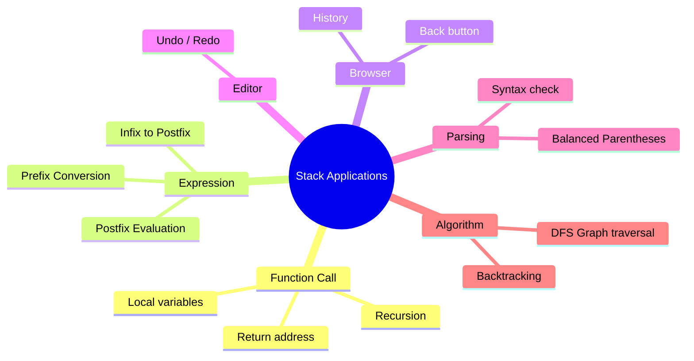
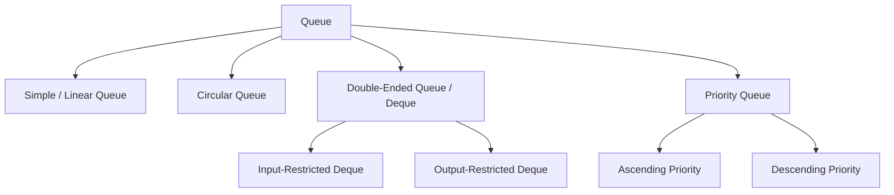
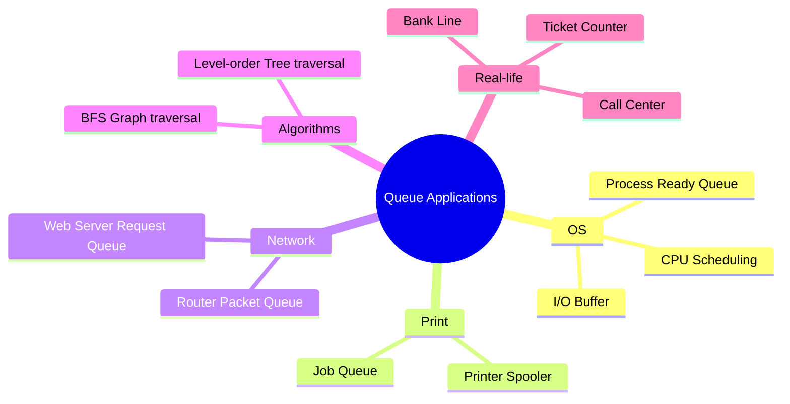

# Bangladesh Bank IT/AME/Programmer — DSA: Stack & Queue

> Bangladesh Bank-এর IT Officer / AME / Programmer পরীক্ষার জন্য Stack এবং Queue টপিকের পূর্ণাঙ্গ Concept Card, Written Q&A এবং MCQ — exam-ready বাংলা ব্যাখ্যাসহ।

---

# DSA Topic 1: Stack

---

## 🟦 CONCEPT CARD — Stack

### সংজ্ঞা (Definition)

**Stack** হলো একটি **linear data structure** যেখানে data insert এবং delete একই প্রান্ত থেকে হয় — এই প্রান্তটিকে বলা হয় **TOP**। Stack অনুসরণ করে **LIFO (Last In First Out)** principle, অর্থাৎ যে element সবার শেষে ঢুকে, সে-ই সবার আগে বের হয়।

বাস্তব জীবনের উদাহরণ ভাবলে — থালা ধোয়ার পর একটার উপর একটা সাজিয়ে রাখা প্লেটের stack, বা বইয়ের পাইল। আপনি সবসময় উপরের প্লেট/বই-টাই আগে নেবেন, নিচেরটা নয়। এটাই LIFO।

### ASCII Diagram — Push / Pop

```
        PUSH ↓        ↑ POP
            ┌─────┐
   TOP →    │  5  │   ← সবচেয়ে last-এ ঢুকেছে, সবার আগে বেরোবে
            ├─────┤
            │  3  │
            ├─────┤
            │  1  │
            ├─────┤
            │  7  │   ← সবচেয়ে আগে ঢুকেছে, সবার শেষে বেরোবে
            └─────┘
            BOTTOM
```

### Stack Operations (মূল পাঁচটি)

| Operation | কাজ | বাংলায় ব্যাখ্যা |
|-----------|-----|-----------------|
| **push(x)** | TOP-এ নতুন element x রাখে | নতুন প্লেট উপরে রাখা |
| **pop()** | TOP-এর element সরিয়ে return করে | উপরের প্লেট তুলে নেওয়া |
| **peek() / top()** | TOP-এর element শুধু দেখায়, সরায় না | উপরের প্লেটে কী আছে দেখা |
| **isEmpty()** | Stack খালি কিনা check করে | পাইল ফাঁকা কিনা |
| **isFull()** | Stack পূর্ণ কিনা check করে (array-এর ক্ষেত্রে) | পাইলে আর জায়গা আছে কিনা |

### Stack Implementation 1 — Array দিয়ে

Array-based stack-এ একটা fixed size array এবং একটা integer variable `top` রাখা হয়। `top = -1` মানে empty stack।

```c
#define MAX 100
int stack[MAX];
int top = -1;

void push(int x) {
    if (top == MAX - 1) {
        printf("Stack Overflow");
        return;
    }
    stack[++top] = x;
}

int pop() {
    if (top == -1) {
        printf("Stack Underflow");
        return -1;
    }
    return stack[top--];
}

int peek() {
    if (top == -1) return -1;
    return stack[top];
}
```

**সুবিধা:** Implementation সহজ, memory continuous, cache-friendly।
**অসুবিধা:** Size আগে থেকে fix, বেশি element হলে overflow।

### Stack Implementation 2 — Linked List দিয়ে

Linked list-based stack-এ প্রতিটি node-এ data এবং next pointer থাকে। **head pointer-ই হলো TOP**। Push মানে head-এর আগে নতুন node যোগ করা, Pop মানে head সরিয়ে নেওয়া।

```c
struct Node {
    int data;
    struct Node *next;
};
struct Node *top = NULL;

void push(int x) {
    struct Node *newNode = malloc(sizeof(struct Node));
    newNode->data = x;
    newNode->next = top;
    top = newNode;
}

int pop() {
    if (top == NULL) return -1;
    struct Node *temp = top;
    int x = temp->data;
    top = top->next;
    free(temp);
    return x;
}
```

**সুবিধা:** Dynamic size, overflow হয় না (memory থাকা পর্যন্ত)।
**অসুবিধা:** Pointer-এর জন্য extra memory, একটু slower।

### Stack-এর Application (পরীক্ষায় বহুল আলোচিত)



1. **Function call stack** — প্রতিটি function call হলে activation record stack-এ push হয়, return হলে pop।
2. **Expression evaluation & conversion** — Infix → Postfix / Prefix conversion এবং Postfix evaluation-এ stack ব্যবহার হয়।
3. **Undo operation** — Text editor-এর Ctrl+Z, প্রতিটি action stack-এ push হয়।
4. **Browser history** — Back button stack থেকে last visited page pop করে।
5. **Balanced parentheses checking** — Compiler `{ [ ( ) ] }` match করতে stack ব্যবহার করে।
6. **DFS (Depth First Search)** — Graph traversal-এ stack (explicit বা recursion) ব্যবহার হয়।
7. **Backtracking** — Maze, N-Queens, Sudoku solver-এ stack-based recursion।

### Stack Overflow & Underflow

- **Stack Overflow** — Stack already full অবস্থায় push করার চেষ্টা। Array-based stack-এ `top == MAX-1` হলে overflow। Recursion খুব deep হলে system stack-ও overflow হয়।
- **Stack Underflow** — Stack already empty অবস্থায় pop করার চেষ্টা। `top == -1` হলে underflow।

দুটি error-ই push/pop-এর শুরুতে check করে handle করা হয়।

### সুবিধা ও অসুবিধা

**সুবিধা (Advantages):**
- Implementation অত্যন্ত সহজ
- সব operation O(1) time-এ হয়
- Memory management automatic (LIFO order)
- Recursion এবং backtracking-এ natural fit

**অসুবিধা (Disadvantages):**
- শুধু এক প্রান্ত থেকে access — middle element access করা যায় না
- Array-based হলে fixed size limitation
- Random access সম্ভব নয়
- Search করতে O(n) লাগে

### Key Points (মুখস্থ করার জন্য)

1. Stack অনুসরণ করে **LIFO** principle — Last In First Out।
2. সব operation (push, pop, peek) **O(1) time complexity**।
3. **TOP** pointer দিয়ে stack-এর শেষ element track করা হয়; empty হলে `top = -1`।
4. **Stack Overflow** = full stack-এ push; **Stack Underflow** = empty stack-এ pop।
5. **Recursion internally call stack** ব্যবহার করে — তাই deep recursion-এ stack overflow হয়।
6. **Infix → Postfix conversion** এবং **Postfix evaluation** — দুটোই stack ছাড়া অসম্ভব।
7. **Balanced parentheses** check করার সবচেয়ে efficient way হলো stack।
8. **Browser back button, Undo, DFS, Backtracking** — সবই stack-এর application।
9. Linked list-based stack dynamic, array-based stack fixed-size।
10. Stack-এ middle element access বা search করা inefficient (O(n))।

### Time & Space Complexity

| Operation | Time | Space |
|-----------|------|-------|
| Push | O(1) | O(1) |
| Pop | O(1) | O(1) |
| Peek/Top | O(1) | O(1) |
| isEmpty | O(1) | O(1) |
| Search | O(n) | O(1) |

---

## 📝 WRITTEN CARD — Stack

### Q1. What is a Stack? Explain LIFO principle with real-life example and show push/pop operations.

**Answer:**

**Stack** হলো একটি linear data structure যেখানে insertion (push) এবং deletion (pop) একই প্রান্ত — TOP — থেকে হয়। এটি **LIFO (Last In First Out)** principle অনুসরণ করে, অর্থাৎ সবচেয়ে শেষে যে element ঢোকে সে-ই সবার আগে বের হয়।

**বাস্তব জীবনের উদাহরণ:** ধরুন একটা থালার pile আছে। আপনি যখন ধোয়া থালা একটার উপর একটা রাখেন, সবচেয়ে শেষে রাখা থালাটা সবার উপরে থাকে। যখন আপনি কোনো থালা নিতে যাবেন, উপরেরটাই আগে নেবেন — অর্থাৎ "Last In First Out"। আরও কিছু উদাহরণ — bullet magazine, browser-এর back button, Ctrl+Z (Undo)।

**Push / Pop Operation Demo:**

প্রথমে empty stack — `top = -1`

```
Step 1: push(7)         Step 2: push(1)         Step 3: push(3)
┌─────┐                 ┌─────┐                 ┌─────┐
│  7  │ ← TOP           │  1  │ ← TOP           │  3  │ ← TOP
└─────┘                 ├─────┤                 ├─────┤
                        │  7  │                 │  1  │
                        └─────┘                 ├─────┤
                                                │  7  │
                                                └─────┘

Step 4: push(5)         Step 5: pop() returns 5
┌─────┐                 ┌─────┐
│  5  │ ← TOP           │  3  │ ← TOP
├─────┤                 ├─────┤
│  3  │                 │  1  │
├─────┤                 ├─────┤
│  1  │                 │  7  │
├─────┤                 └─────┘
│  7  │
└─────┘
```

লক্ষ্য করুন — সবার শেষে push করা **5** সবার আগে pop হলো। এটাই LIFO-এর মূল কথা।

---

### Q2. Convert the infix expression A+B*C-(D/E+F)*G to postfix using stack. Show step-by-step trace.

**Answer:**

**Algorithm (সংক্ষেপে):**
- Operand পেলে সরাসরি output-এ পাঠাও।
- Operator পেলে — stack-এর top-এ যদি বেশি বা সমান precedence-এর operator থাকে, সেগুলো pop করে output-এ পাঠাও, তারপর current operator push করো।
- `(` পেলে push করো।
- `)` পেলে — `(` না পাওয়া পর্যন্ত pop করতে থাকো এবং output-এ পাঠাও; `(` discard করো।
- শেষে stack-এ যা থাকবে সব pop করে output-এ পাঠাও।

**Precedence:** `*, /` > `+, -` > `(`

**Step-by-step trace** infix `A+B*C-(D/E+F)*G`:

| Step | Symbol | Stack | Output (Postfix) | ব্যাখ্যা |
|------|--------|-------|------------------|---------|
| 1 | A | empty | A | Operand → output |
| 2 | + | + | A | Stack empty, push |
| 3 | B | + | AB | Operand → output |
| 4 | * | +* | AB | `*` > `+`, push |
| 5 | C | +* | ABC | Operand → output |
| 6 | - | - | ABC*+ | `-` ≤ `*` ও `+`, দুটোই pop, তারপর `-` push |
| 7 | ( | -( | ABC*+ | Push |
| 8 | D | -( | ABC*+D | Operand → output |
| 9 | / | -(/ | ABC*+D | `(`-এর উপরে push |
| 10 | E | -(/ | ABC*+DE | Operand → output |
| 11 | + | -(+ | ABC*+DE/ | `+` ≤ `/`, pop `/`; তারপর push `+` |
| 12 | F | -(+ | ABC*+DE/F | Operand → output |
| 13 | ) | - | ABC*+DE/F+ | `(` পাওয়া পর্যন্ত pop, `(` discard |
| 14 | * | -* | ABC*+DE/F+ | `*` > `-`, push |
| 15 | G | -* | ABC*+DE/F+G | Operand → output |
| 16 | end | empty | ABC*+DE/F+G*- | বাকি stack pop |

**Final Postfix:** `ABC*+DE/F+G*-`

---

### Q3. Write an algorithm to check balanced parentheses using Stack.

**Answer:**

**Idea:** প্রতিটি opening bracket `(`, `{`, `[` stack-এ push করব। প্রতিটি closing bracket `)`, `}`, `]` পেলে stack-এর top-এ matching opening bracket আছে কিনা check করব। মিললে pop, না মিললে unbalanced। শেষে stack empty হলে balanced।

**Algorithm:**

```c
bool isBalanced(char *expr) {
    Stack s;
    init(&s);
    for (int i = 0; expr[i] != '\0'; i++) {
        char ch = expr[i];
        if (ch == '(' || ch == '{' || ch == '[') {
            push(&s, ch);
        }
        else if (ch == ')' || ch == '}' || ch == ']') {
            if (isEmpty(&s)) return false;
            char top = pop(&s);
            if ((ch == ')' && top != '(') ||
                (ch == '}' && top != '{') ||
                (ch == ']' && top != '[')) {
                return false;
            }
        }
    }
    return isEmpty(&s);
}
```

**Worked example:** Expression `{ [ ( ) ] }`

| Char | Action | Stack (bottom→top) |
|------|--------|--------------------|
| `{` | Push | `{` |
| `[` | Push | `{ [` |
| `(` | Push | `{ [ (` |
| `)` | Top `(` matches, Pop | `{ [` |
| `]` | Top `[` matches, Pop | `{` |
| `}` | Top `{` matches, Pop | empty |

শেষে stack empty → **Balanced ✅**

**Counter-example:** `{ [ ( ] ) }` — যখন `]` আসবে, top-এ থাকবে `(`, mismatch — **Unbalanced ❌**।

---

### Q4. What is Stack Overflow and Stack Underflow? How are they handled?

**Answer:**

**Stack Overflow:**
যখন stack already পূর্ণ অবস্থায় আরও element push করার চেষ্টা করা হয়, তখন **Stack Overflow** হয়। Array-based stack-এ `top == MAX - 1` অবস্থায় push করলে এটা ঘটে। আবার system level-এ — যদি recursion খুব deep হয় (যেমন base case ভুল লিখলে infinite recursion) — তখন program-এর call stack-ও overflow করে এবং program crash করে।

**Handle করার উপায়:**
- Push-এর আগে `isFull()` check করা — পূর্ণ হলে error message দেখানো।
- Dynamic resizing — array পূর্ণ হলে double size-এর নতুন array allocate করে data copy করা।
- Linked list-based stack ব্যবহার করা — যেখানে fixed limit নেই।
- Recursion-কে iteration দিয়ে replace করা যেখানে সম্ভব।

```c
void push(int x) {
    if (top == MAX - 1) {
        printf("Stack Overflow!\n");
        return;
    }
    stack[++top] = x;
}
```

**Stack Underflow:**
যখন stack already empty অবস্থায় pop বা peek করার চেষ্টা করা হয়, তখন **Stack Underflow** হয়। `top == -1` অবস্থায় pop করলে এটা ঘটে।

**Handle করার উপায়:**
- Pop-এর আগে `isEmpty()` check করা — খালি হলে error return করা।
- Exception/error code return করা যাতে caller বুঝতে পারে।

```c
int pop() {
    if (top == -1) {
        printf("Stack Underflow!\n");
        return -1;
    }
    return stack[top--];
}
```

**সারসংক্ষেপ:** দুটোই **boundary condition** — push করার আগে full check, pop করার আগে empty check — এই দুই simple guard দিয়েই handle করা হয়।

---

### Q5. Explain how recursion uses the call stack internally. Give an example with factorial.

**Answer:**

প্রতিটি function call হওয়ার সময় system একটা **activation record** (যাতে থাকে — function-এর parameter, local variable, return address) তৈরি করে এবং সেটা **call stack**-এ push করে। Function return করলে তার activation record stack থেকে pop হয়, এবং control আগের function-এ ফিরে যায়।

Recursion হলো এমন function যেটা নিজেকেই call করে। প্রতিটি recursive call নতুন activation record stack-এ push করে। Base case পৌঁছালে recursion থামে এবং stack unwind হতে হতে original caller-এ result আসে।

**Example — `factorial(3)`:**

```c
int factorial(int n) {
    if (n == 0 || n == 1) return 1;
    return n * factorial(n - 1);
}
```

**Call stack trace:**

```
Step 1: factorial(3) call
        ┌────────────────┐
        │ factorial(3)   │ ← waiting for factorial(2)
        └────────────────┘

Step 2: factorial(2) call
        ┌────────────────┐
        │ factorial(2)   │ ← waiting for factorial(1)
        ├────────────────┤
        │ factorial(3)   │
        └────────────────┘

Step 3: factorial(1) call — Base case! returns 1
        ┌────────────────┐
        │ factorial(1)=1 │ ← returns 1, pop
        ├────────────────┤
        │ factorial(2)   │
        ├────────────────┤
        │ factorial(3)   │
        └────────────────┘

Step 4: factorial(2) = 2 * 1 = 2 → returns 2, pop
        ┌────────────────┐
        │ factorial(2)=2 │
        ├────────────────┤
        │ factorial(3)   │
        └────────────────┘

Step 5: factorial(3) = 3 * 2 = 6 → returns 6, pop
        ┌────────────────┐
        │ factorial(3)=6 │
        └────────────────┘

Final answer: 6
```

**মূল শিক্ষা:**
- প্রতিটি recursive call **memory-তে নতুন frame** তৈরি করে।
- Base case ছাড়া recursion stack overflow করবে।
- Recursion-এর space complexity O(depth), কারণ stack-এ depth-সংখ্যক frame জমা হয়।
- যেকোনো recursion-কে explicit stack ব্যবহার করে iterative-ভাবে লেখা যায়।

---

## ❓ MCQ CARD — Stack

**11.** Which data structure follows LIFO (Last In First Out) principle?
A) Queue
B) Stack
C) Tree
D) Graph
**Correct Answer:** B
**Explanation:** Stack-এ insertion এবং deletion একই প্রান্ত (TOP) থেকে হয়, তাই সবার শেষে ঢোকা element সবার আগে বের হয় — এটাই **LIFO**। Queue হলো FIFO, Tree এবং Graph hierarchical/non-linear structure।

---

**12.** What is the time complexity of PUSH and POP operations in a stack implemented using an array?
A) O(n), O(n)
B) O(1), O(n)
C) O(1), O(1)
D) O(n), O(1)
**Correct Answer:** C
**Explanation:** Array-based stack-এ শুধু `top` index update করেই push/pop সম্পন্ন হয় — কোনো shifting বা searching লাগে না। তাই উভয় operation **constant time O(1)**-এ চলে।

---

**13.** Evaluate the postfix expression `5 3 2 * +` using stack. What is the result?
A) 11
B) 25
C) 16
D) 13
**Correct Answer:** A
**Explanation:** Postfix evaluation step-by-step (operand পেলে push, operator পেলে দুইটা operand pop করে operate করো):

| Token | Action | Stack |
|-------|--------|-------|
| 5 | push | [5] |
| 3 | push | [5, 3] |
| 2 | push | [5, 3, 2] |
| * | pop 2, pop 3, push 3*2=6 | [5, 6] |
| + | pop 6, pop 5, push 5+6=11 | [11] |

Final result = **11**। মনে রাখবেন — operator দ্বিতীয় pop-করা element-কে left operand হিসেবে নেয়।

---

**14.** Which of the following applications does NOT use a Stack?
A) Function call management
B) Infix to Postfix conversion
C) CPU process scheduling
D) Undo operation in text editor
**Correct Answer:** C
**Explanation:** **CPU process scheduling**-এ Queue (বিশেষত **Ready Queue, Priority Queue**) ব্যবহার হয় — কারণ process FIFO order-এ আসে এবং schedule হয়। বাকি তিনটি — function call, expression conversion, এবং undo — সবই LIFO behavior দরকার, তাই stack ব্যবহার করে।

---

**15.** In an array-based stack of size n, if `top = -1` indicates empty, what is the maximum number of elements that can be stored?
A) n - 1
B) n
C) n + 1
D) n / 2
**Correct Answer:** B
**Explanation:** Array index 0 থেকে n-1 পর্যন্ত মোট **n** টি জায়গা আছে। `top = -1` empty এবং `top = n - 1` full অবস্থা নির্দেশ করে। তাই stack সর্বোচ্চ **n** টি element ধারণ করতে পারে। Push হওয়ার সময় `top` বৃদ্ধি পেয়ে শেষে n-1-এ পৌঁছায়, যা মোট n টি element-এর ইঙ্গিত দেয়।

---
---

# DSA Topic 2: Queue

---

## 🟦 CONCEPT CARD — Queue

### সংজ্ঞা (Definition)

**Queue** হলো একটি **linear data structure** যেখানে insertion এক প্রান্ত থেকে এবং deletion অন্য প্রান্ত থেকে হয়। Insertion-এর প্রান্তকে বলে **REAR** (বা back), আর deletion-এর প্রান্তকে বলে **FRONT**। Queue অনুসরণ করে **FIFO (First In First Out)** principle — যে সবার আগে ঢুকেছে, সে-ই সবার আগে বের হবে।

বাস্তব জীবনের উদাহরণ — ব্যাংকের cash counter-এ line, ticket counter-এ সিরিয়াল, printer-এর print job line। যিনি আগে এসেছেন, তিনিই আগে service পাবেন।

### ASCII Diagram

```
   DEQUEUE          ENQUEUE
      ↑                ↓
   ┌─────┬─────┬─────┬─────┬─────┐
   │  1  │  2  │  3  │  4  │  5  │
   └─────┴─────┴─────┴─────┴─────┘
      ↑                       ↑
    FRONT                   REAR
   (এখান থেকে              (এখানে নতুন
    delete হয়)              add হয়)
```

### Queue Operations

| Operation | কাজ |
|-----------|-----|
| **enqueue(x)** | REAR-এ নতুন element x যোগ করে |
| **dequeue()** | FRONT থেকে element সরিয়ে return করে |
| **front()** | FRONT-এর element দেখায় (সরায় না) |
| **rear()** | REAR-এর element দেখায় |
| **isEmpty()** | Queue খালি কিনা |
| **isFull()** | Queue পূর্ণ কিনা (array-এর ক্ষেত্রে) |

### Types of Queue (চার ধরনের)



1. **Simple / Linear Queue** — একদিকে enqueue, অন্যদিকে dequeue। সমস্যা: dequeue হলে front move করে, কিন্তু পেছনের জায়গা reuse হয় না (wasted space)।

2. **Circular Queue** — Array-কে circle হিসেবে treat করে; rear array-এর শেষে গেলে আবার শুরুতে চলে আসে। `(rear + 1) % n` formula দিয়ে wrap-around হয়।

3. **Deque (Double-Ended Queue)** — দুই প্রান্ত থেকেই insert এবং delete করা যায়।
   - **Input-Restricted Deque** — insert শুধু এক প্রান্তে, delete দুই প্রান্তে।
   - **Output-Restricted Deque** — insert দুই প্রান্তে, delete শুধু এক প্রান্তে।

4. **Priority Queue** — প্রতিটি element-এর সাথে একটি priority থাকে; high priority element আগে dequeue হয়। সাধারণত **heap** দিয়ে implement হয়।

### Queue Implementation 1 — Array দিয়ে (Linear Queue)

```c
#define MAX 100
int queue[MAX];
int front = -1, rear = -1;

void enqueue(int x) {
    if (rear == MAX - 1) { printf("Overflow"); return; }
    if (front == -1) front = 0;
    queue[++rear] = x;
}

int dequeue() {
    if (front == -1 || front > rear) { printf("Underflow"); return -1; }
    return queue[front++];
}
```

**সমস্যা — Wasted Space:** কিছু dequeue-এর পর front এগিয়ে যায়, কিন্তু front-এর আগের array cells আর ব্যবহার হয় না। rear যখন MAX-1-এ পৌঁছায়, queue-কে full মনে হয়, যদিও সামনে অনেক জায়গা ফাঁকা।

**সমাধান:** Circular Queue।

### Queue Implementation 2 — Circular Queue

```c
void enqueue(int x) {
    if ((rear + 1) % MAX == front) { printf("Full"); return; }
    if (front == -1) front = 0;
    rear = (rear + 1) % MAX;
    queue[rear] = x;
}

int dequeue() {
    if (front == -1) { printf("Empty"); return -1; }
    int x = queue[front];
    if (front == rear) { front = rear = -1; }   // last element
    else front = (front + 1) % MAX;
    return x;
}
```

**Full condition:** `(rear + 1) % n == front`
**Empty condition:** `front == -1`

### Queue Implementation 3 — Linked List দিয়ে

দুটি pointer রাখা হয় — `front` (head) এবং `rear` (tail)।

```c
struct Node { int data; struct Node *next; };
struct Node *front = NULL, *rear = NULL;

void enqueue(int x) {
    struct Node *n = malloc(sizeof(struct Node));
    n->data = x; n->next = NULL;
    if (rear == NULL) front = rear = n;
    else { rear->next = n; rear = n; }
}

int dequeue() {
    if (front == NULL) return -1;
    struct Node *t = front;
    int x = t->data;
    front = front->next;
    if (front == NULL) rear = NULL;
    free(t);
    return x;
}
```

**সুবিধা:** Dynamic size, no overflow, no wasted space।

### Queue-এর Application



1. **CPU process scheduling** — Ready Queue, FCFS, Round Robin।
2. **Printer spooling** — print jobs FIFO order-এ process হয়।
3. **BFS (Breadth First Search)** — Graph/Tree-এ level-by-level traversal।
4. **Call center system** — incoming calls queue-এ থাকে, agent free হলে next call নেয়।
5. **Web server / Network packet routing** — request buffer।
6. **OS I/O buffer** — keyboard buffer, disk request queue।

### সুবিধা ও অসুবিধা

**সুবিধা:**
- FIFO order — ন্যায্য (fair) scheduling।
- Implementation সহজ।
- O(1) enqueue / dequeue।
- BFS এবং scheduling-এ natural fit।

**অসুবিধা:**
- Linear array queue-এ wasted space সমস্যা।
- Middle element access করা যায় না।
- Priority-based selection করতে পারে না (এ কারণেই Priority Queue আসে)।
- Circular queue-এর implementation একটু complex।

### Key Points

1. Queue **FIFO** principle অনুসরণ করে — First In First Out।
2. দুটি pointer — **FRONT** (delete) এবং **REAR** (insert)।
3. **Linear queue**-এ wasted space সমস্যা; **Circular queue** সেটা solve করে।
4. Circular queue full: `(rear + 1) % n == front`; empty: `front == -1`।
5. **Deque** দুই প্রান্ত থেকেই insert/delete supports।
6. **Priority Queue**-এ priority অনুযায়ী dequeue হয়, FIFO নয়।
7. **BFS, CPU scheduling, printer spooling** — সবই queue-এর application।
8. Linked list-based queue-এ **overflow হয় না** এবং **wasted space নেই**।
9. Stack এবং Queue-এর মধ্যে মূল পার্থক্য — order (LIFO vs FIFO)।
10. Priority Queue সাধারণত **Binary Heap** দিয়ে implement হয় (O(log n))।

### Time & Space Complexity

| Queue Type | Enqueue | Dequeue | Space |
|-----------|---------|---------|-------|
| Simple Array Queue | O(1) | O(1) or O(n) (with shift) | O(n) |
| Circular Queue | O(1) | O(1) | O(n) |
| Priority Queue (heap) | O(log n) | O(log n) | O(n) |
| LL-based Queue | O(1) | O(1) | O(n) |

---

## 📝 WRITTEN CARD — Queue

### Q1. What is a Queue? Explain FIFO principle. What is the difference between Stack and Queue?

**Answer:**

**Queue** হলো একটি linear data structure যেখানে insertion এক প্রান্তে (REAR) এবং deletion অন্য প্রান্তে (FRONT) হয়। এটি **FIFO (First In First Out)** principle অনুসরণ করে — অর্থাৎ যে element সবার আগে ঢুকেছে, সে-ই সবার আগে বের হবে।

**বাস্তব উদাহরণ:** ব্যাংকের cash counter-এ লাইন। যিনি সবার আগে এসেছেন, তিনিই সবার আগে service পান। নতুন কেউ এলে লাইনের পেছনে দাঁড়ান (enqueue), service শেষে সামনের জন বের হয়ে যান (dequeue)।

**Stack vs Queue পার্থক্য:**

| বৈশিষ্ট্য | Stack | Queue |
|----------|-------|-------|
| Principle | LIFO (Last In First Out) | FIFO (First In First Out) |
| Insertion / Deletion | একই প্রান্ত (TOP) | দুই আলাদা প্রান্ত (REAR insert, FRONT delete) |
| Pointer সংখ্যা | একটি (top) | দুইটি (front, rear) |
| অপারেশন নাম | push, pop, peek | enqueue, dequeue, front, rear |
| বাস্তব উদাহরণ | প্লেটের pile, Undo, browser back | ব্যাংকের লাইন, printer queue |
| Application | Recursion, expression conversion, DFS | CPU scheduling, BFS, printer spooler |
| Empty condition | `top == -1` | `front == -1` |
| Order | পরবর্তী element আগে বের হয় | প্রথম element আগে বের হয় |

**সংক্ষেপে:** Stack reverses order, Queue preserves order। দুটোই linear, abstract data type, কিন্তু behavior একদম বিপরীত।

---

### Q2. What is a Circular Queue? How does it solve the limitation of a linear queue? Explain with diagram.

**Answer:**

**Linear Queue-এর সমস্যা:** Linear queue-এ যতই dequeue করা হোক, front-এর আগের array cells আর reuse হয় না। rear যখন array-এর শেষ index-এ পৌঁছায়, queue-কে full মনে হয় — যদিও সামনে অনেক জায়গা খালি। এটাকে বলে **wasted space problem**।

**Linear Queue Wasted Space:**
```
Index:    0    1    2    3    4
        ┌────┬────┬────┬────┬────┐
        │ -- │ -- │ -- │ 50 │ 60 │
        └────┴────┴────┴────┴────┘
                       ↑         ↑
                     FRONT      REAR
   ← wasted (3 cells)
```
এখানে rear=4 (last index), enqueue চাইলে "full" বলবে — কিন্তু আসলে 3টা cell ফাঁকা।

**Circular Queue সমাধান:** Array-কে একটা circle/ring হিসেবে treat করে। rear array-এর শেষে পৌঁছে গেলে আবার index 0-তে চলে আসে — `(rear + 1) % n` formula ব্যবহার করে।

**Circular Queue Diagram:**

```
              [0]
            ╱     ╲
         [4]       [1]
          │         │
         [3]       [2]
            ╲     ╱
             ╲   ╱
              ╲ ╱

   front এবং rear circle-এর চারপাশে move করে।
   rear array শেষে গেলে wrap করে index 0-তে আসে।
```

**Worked example (size 5):**

ধরুন queue-এ আছে: front=3, rear=4, elements [_, _, _, 50, 60]

এখন `enqueue(70)` করলে: rear = (4+1) % 5 = 0 → queue[0] = 70

```
Index:    0    1    2    3    4
        ┌────┬────┬────┬────┬────┐
        │ 70 │ -- │ -- │ 50 │ 60 │
        └────┴────┴────┴────┴────┘
          ↑              ↑
         REAR          FRONT
   (wrap-around হয়েছে)
```

**Conditions:**
- **Full:** `(rear + 1) % n == front`
- **Empty:** `front == -1`

**সুবিধা:** কোনো wasted space নেই, পুরো array efficiently ব্যবহার হয়।

---

### Q3. What is a Priority Queue? How is it different from a normal Queue? Give real-world examples.

**Answer:**

**Priority Queue** হলো এমন একটি queue যেখানে প্রতিটি element-এর সাথে একটি **priority** (গুরুত্ব) যুক্ত থাকে। Element যেই order-এ enqueue হয়েছে সেটা matter করে না — **dequeue-এর সময় সবচেয়ে high priority element আগে বের হয়**।

**দুই ধরনের Priority Queue:**
- **Ascending Priority Queue** — সবচেয়ে কম মান (lowest value) first dequeue হয়।
- **Descending Priority Queue** — সবচেয়ে বেশি মান (highest value) first dequeue হয়।

**সাধারণ Queue vs Priority Queue:**

| বৈশিষ্ট্য | Normal Queue | Priority Queue |
|----------|--------------|----------------|
| Order | FIFO — যে আগে ঢুকেছে | Priority অনুযায়ী |
| Element comparison | নেই | আছে (priority value-এর উপর) |
| Implementation | Array / Linked List | Heap / Sorted array |
| Enqueue time | O(1) | O(log n) (heap) |
| Dequeue time | O(1) | O(log n) (heap) |
| Real-life example | Bank line | Hospital emergency |

**Real-world Examples:**

1. **Hospital Emergency Room** — Heart attack patient (high priority) cold/fever patient-দের আগে চলে যান, যদিও তিনি পরে এসেছেন।

2. **CPU Scheduling (Priority Scheduling)** — OS-এ system-critical process (high priority) user app-এর আগে CPU পায়।

3. **Dijkstra's Shortest Path Algorithm** — সবচেয়ে কম distance-এর node আগে process হয় (min-heap)।

4. **Huffman Coding (Compression)** — সবচেয়ে কম frequency-এর character দুটি combine করে tree বানানো হয়।

5. **Network Router** — Voice/video packet (latency-sensitive) email packet-এর আগে route হয়।

6. **Operating System I/O Scheduling** — Critical I/O request আগে handle হয়।

**Implementation:** সবচেয়ে efficient implementation **Binary Heap** দিয়ে — enqueue এবং dequeue উভয়ই **O(log n)** time-এ।

---

### Q4. What is a Deque (Double-Ended Queue)? What are its types and operations?

**Answer:**

**Deque** (উচ্চারণ: "deck") মানে **Double-Ended Queue** — এটি এমন একটি linear data structure যেখানে **দুই প্রান্ত (front এবং rear) থেকেই insertion এবং deletion** করা যায়। এটি stack এবং queue উভয়ের behavior emulate করতে পারে।

**Diagram:**
```
   insertFront ↓                    ↓ insertRear
            ┌─────┬─────┬─────┬─────┐
            │  A  │  B  │  C  │  D  │
            └─────┴─────┴─────┴─────┘
   deleteFront ↑                    ↑ deleteRear
            FRONT                  REAR
```

**Four Operations:**

| Operation | কাজ |
|-----------|-----|
| `insertFront(x)` | front-এ x add করে |
| `insertRear(x)` | rear-এ x add করে |
| `deleteFront()` | front থেকে delete করে |
| `deleteRear()` | rear থেকে delete করে |

**দুই প্রকার Deque:**

1. **Input-Restricted Deque** — Insertion শুধু এক প্রান্ত (rear)-এ allowed; deletion দুই প্রান্ত থেকেই allowed।
   - Operations: `insertRear`, `deleteFront`, `deleteRear`।

2. **Output-Restricted Deque** — Deletion শুধু এক প্রান্ত (front) থেকে allowed; insertion দুই প্রান্ত থেকেই allowed।
   - Operations: `insertFront`, `insertRear`, `deleteFront`।

**Special Behavior:**
- শুধু `insertRear` + `deleteFront` ব্যবহার করলে Deque কাজ করে **normal Queue**-এর মতো।
- শুধু `insertFront` + `deleteFront` (একই প্রান্ত) ব্যবহার করলে Deque কাজ করে **Stack**-এর মতো।

**Applications:**
- **Sliding window maximum** problem।
- **Palindrome check** — দুই প্রান্ত থেকে character compare।
- **Undo/Redo** sophisticated system।
- **A-Steal job scheduling algorithm** (multiprocessor)।
- **Browser history** — forward এবং back দুটোই।

**Implementation:** সাধারণত doubly linked list বা circular array ব্যবহার করে। সব operation **O(1)**।

---

### Q5. Explain how Queue is used in BFS (Breadth First Search) traversal.

**Answer:**

**BFS (Breadth First Search)** হলো graph/tree-এর level-by-level traversal algorithm। এটা start node থেকে শুরু করে আগে সব immediate neighbor visit করে, তারপর তাদের neighbor — এভাবে layer by layer expand করে।

**কেন Queue?** BFS-এ FIFO order দরকার — প্রথম যে node-গুলো explore-এ এসেছে, তাদের আগে process করতে হবে। এই FIFO behavior **Queue** perfectly serve করে। Stack ব্যবহার করলে DFS হয়ে যাবে।

**BFS Algorithm:**
```
1. Start node-কে queue-এ enqueue এবং visited mark।
2. Queue empty না হওয়া পর্যন্ত:
   a. Dequeue করে current node বের করো, print করো।
   b. Current-এর সব unvisited neighbor enqueue করো এবং visited mark করো।
```

**Example Graph:**
```
        A
       ╱ ╲
      B   C
     ╱ ╲   ╲
    D   E   F
```

**Adjacency:** A→[B,C], B→[D,E], C→[F]

**BFS শুরু A থেকে — step by step trace:**

| Step | Action | Queue State | Visited | Output |
|------|--------|-------------|---------|--------|
| 1 | Enqueue A | [A] | {A} | — |
| 2 | Dequeue A; enqueue B, C | [B, C] | {A,B,C} | A |
| 3 | Dequeue B; enqueue D, E | [C, D, E] | {A,B,C,D,E} | A B |
| 4 | Dequeue C; enqueue F | [D, E, F] | {A,B,C,D,E,F} | A B C |
| 5 | Dequeue D; no new neighbor | [E, F] | unchanged | A B C D |
| 6 | Dequeue E; no new neighbor | [F] | unchanged | A B C D E |
| 7 | Dequeue F; no new neighbor | [] | unchanged | A B C D E F |

**Final BFS Order:** `A → B → C → D → E → F`

লক্ষ্য করুন — সবার আগে level 0 (A), তারপর level 1 (B, C), তারপর level 2 (D, E, F)। এটাই **breadth-first** এর meaning।

**Complexity:**
- Time: **O(V + E)** যেখানে V = vertices, E = edges।
- Space: **O(V)** queue এবং visited set-এর জন্য।

**Applications:**
- Shortest path (unweighted graph-এ)
- Web crawler
- Social network "X-degrees of separation"
- GPS network broadcasting
- Solving puzzles (Rubik's cube, sliding puzzle)

---

## ❓ MCQ CARD — Queue

**16.** Which data structure follows FIFO (First In First Out) principle?
A) Stack
B) Tree
C) Queue
D) Graph
**Correct Answer:** C
**Explanation:** Queue-এ insertion এক প্রান্ত (rear) থেকে এবং deletion অন্য প্রান্ত (front) থেকে হয়, ফলে যে element সবার আগে ঢুকেছে সে-ই সবার আগে বের হয় — এটাই **FIFO**। বাস্তব উদাহরণ — bank-এ লাইন, printer queue। Stack হলো LIFO; Tree এবং Graph non-linear hierarchical structure।

---

**17.** In a circular queue with size n, when is the queue considered full?
A) (rear + 1) % n == front
B) rear == front
C) rear == n - 1
D) front == 0
**Correct Answer:** A
**Explanation:** Circular queue-এ rear array-এর শেষে পৌঁছালে wrap-around করে index 0-তে আসে। যখন rear-এর ঠিক পরের position-এ front থাকে, মানে আর জায়গা নেই — তাই `(rear + 1) % n == front`। Option C `rear == n - 1` linear queue-এর full condition, circular-এর নয়। Option B `rear == front` একই index-এ থাকার শর্ত — যা empty (বা ambiguous) condition হিসেবে ব্যবহৃত হয়।

---

**18.** Which queue is used in CPU process scheduling where higher priority process runs first?
A) Simple Queue
B) Circular Queue
C) Priority Queue
D) Deque
**Correct Answer:** C
**Explanation:** **Priority Queue**-এ প্রতিটি element-এর সাথে priority value থাকে; dequeue-এর সময় সবচেয়ে high priority element আগে বের হয়। OS-এ system-critical process (যেমন kernel task) user application-এর আগে CPU পায় — এই behavior priority queue-ই দিতে পারে। Simple/Circular queue শুধু FIFO order মেনে চলে, priority handle করে না। Priority Queue সাধারণত **binary heap** দিয়ে implement হয় (O(log n))।

---

**19.** In a queue implemented as an array with `front = 3` and `rear = 7`, how many elements are currently in the queue?
A) 3
B) 4
C) 5
D) 7
**Correct Answer:** C
**Explanation:** Linear queue-এ element সংখ্যা = **rear - front + 1** = 7 - 3 + 1 = **5**। Indexes 3, 4, 5, 6, 7 — মোট 5টা cell occupied। (Circular queue-এর ক্ষেত্রে formula আলাদা: `(rear - front + n) % n + 1`।)

---

**20.** In a circular queue of size n, if `front = 0` and `rear = n - 1`, what happens when we try to enqueue a new element?
A) Element is inserted at index 0
B) Queue overflow / Queue is full
C) front becomes n - 1
D) rear becomes 0
**Correct Answer:** B
**Explanation:** Circular queue-এ full condition: `(rear + 1) % n == front`। এখানে rear = n-1, front = 0, তাই `(n-1+1) % n = n % n = 0 == front` — অর্থাৎ queue **পূর্ণ (Full)**। নতুন element enqueue করার চেষ্টা করলে **overflow** হবে। মনে রাখবেন — circular queue-এ পুরো n cell ব্যবহার করতে গেলে full এবং empty distinguish করার জন্য সাধারণত একটা cell sacrifice করতে হয় (অথবা আলাদা `count` variable রাখতে হয়)।

---

## 📌 Quick Revision Summary

```mermaid
mindmap
  root((Stack & Queue))
    Stack
      LIFO
      Operations
        push
        pop
        peek
      Apps
        Recursion
        Infix to Postfix
        Undo
        DFS
        Balanced parentheses
      O(1) all ops
    Queue
      FIFO
      Operations
        enqueue
        dequeue
        front
      Types
        Linear
        Circular
        Deque
        Priority
      Apps
        CPU Scheduling
        BFS
        Printer Spooler
      Circular full
        rear plus 1 mod n equals front
```

### Cheat Sheet

| Aspect | Stack | Queue |
|--------|-------|-------|
| Principle | LIFO | FIFO |
| Insert | push (TOP) | enqueue (REAR) |
| Delete | pop (TOP) | dequeue (FRONT) |
| Pointers | 1 (top) | 2 (front, rear) |
| Empty | top == -1 | front == -1 |
| Full (array) | top == n-1 | rear == n-1 (linear) |
| Apps | Recursion, DFS, Undo | BFS, Scheduling, Buffer |
| Order | Reverses | Preserves |

### পরীক্ষার আগে শেষ মুহূর্তের Tips

1. **LIFO = Stack, FIFO = Queue** — এই দুটো শব্দ দেখলেই উত্তর ৮০% নিশ্চিত।
2. **Circular Queue full formula** `(rear + 1) % n == front` মুখস্থ রাখুন।
3. **Postfix evaluation:** operand push, operator-এ দুইটা pop করে operate (দ্বিতীয় pop = left operand)।
4. **Infix to Postfix:** higher precedence operator stack-এর top-এ push, lower/equal পেলে আগে pop।
5. **Recursion = Stack** — call stack overflow-এর কারণ deep recursion।
6. **BFS = Queue, DFS = Stack** — এই pairing মনে রাখুন।
7. **Priority Queue** = Heap (O(log n)), normal Queue = Array/LL (O(1))।
8. **Deque** stack এবং queue উভয়ের behavior emulate করতে পারে।
9. Linear queue-এর মূল সমস্যা **wasted space** — circular queue solution।
10. Element count formula: linear queue-এ `rear - front + 1`, circular-এ `(rear - front + n) % n + 1`।

---

**শুভকামনা! Bangladesh Bank IT/AME/Programmer পরীক্ষার জন্য Stack এবং Queue-এর এই complete preparation আশা করি কাজে লাগবে।**
