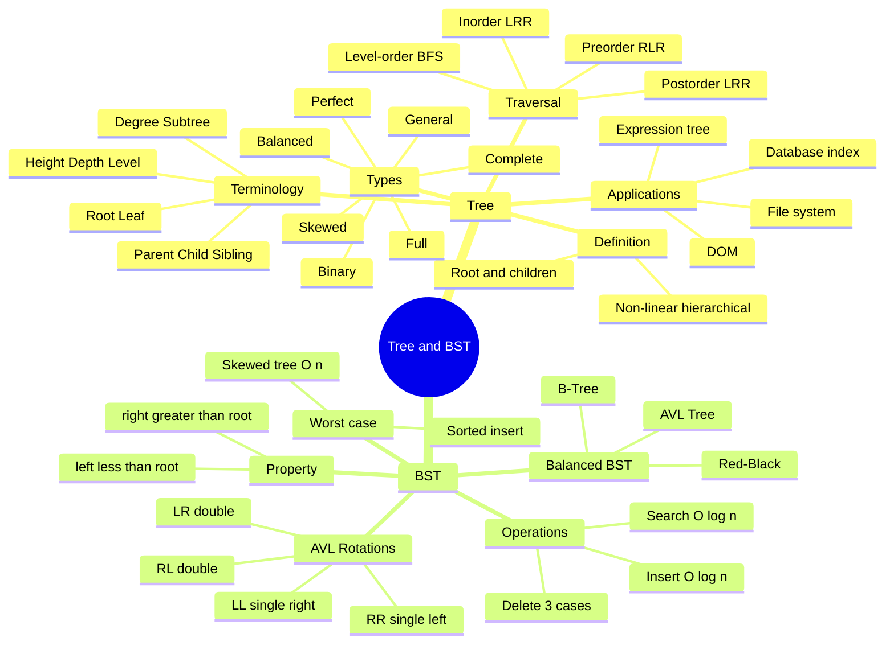

# Tree ও Binary Search Tree — Bangladesh Bank IT/AME/Programmer Exam

> **Priority:** 🔴 High | **Topic:** Data Structures & Algorithms | **Difficulty:** Medium
> Tree এবং BST হলো non-linear hierarchical data structure যা প্রতিটি Bangladesh Bank IT exam-এ আসে — concept, traversal, BST property, AVL সব মিলিয়ে এক complete preparation guide।

---

# DSA Topic: Tree

---

## 🟦 CONCEPT CARD — Tree

### সংজ্ঞা (Definition)

**Tree** হলো একটি **non-linear hierarchical data structure** যেখানে data গুলো parent-child সম্পর্কের মাধ্যমে সাজানো থাকে। Array, Linked List, Stack, Queue — এগুলো linear structure (data পরপর সাজানো), কিন্তু Tree-তে data একটা গাছের মতো শাখা-প্রশাখায় ছড়িয়ে থাকে। তাই এটাকে **non-linear** বলা হয়।

একটি Tree-তে একটি **root node** থাকে এবং বাকি সব node এই root থেকে শুরু হয়ে নিচের দিকে নামতে থাকে। মজার ব্যাপার হলো — computer science-এ tree-কে উল্টো করে আঁকা হয়, root উপরে আর leaf নিচে।

### Tree Terminology (পরিভাষা)

```
              1          ← Root (level 0)
             / \
            2   3        ← Internal nodes (level 1)
           / \ / \
          4  5 6  7      ← Leaves (level 2)
```

| Term | বাংলা ব্যাখ্যা |
|------|---------------|
| **Root** | Tree-এর সবচেয়ে উপরের node, যার কোনো parent নেই। উদাহরণে `1` হলো root। |
| **Node** | Tree-এর প্রতিটি element বা vertex। |
| **Edge** | দুটি node-এর মধ্যকার connection বা link। |
| **Parent** | যে node-এর নিচে অন্য node আছে। `2` হলো `4` ও `5`-এর parent। |
| **Child** | যে node অন্য একটি node-এর নিচে আছে। `4`, `5` হলো `2`-এর child। |
| **Sibling** | একই parent-এর child node গুলো। `4` ও `5` হলো sibling। |
| **Leaf** | যে node-এর কোনো child নেই (terminal node)। উদাহরণে `4, 5, 6, 7` সব leaf। |
| **Internal node** | Leaf ছাড়া বাকি সব node (অর্থাৎ যাদের child আছে)। |
| **Degree** | একটি node-এর child-এর সংখ্যা। `1`-এর degree = 2। |
| **Level** | Root-এর level = 0, তার children-এর level = 1, এভাবে নিচে নামতে থাকে। |
| **Depth** | Root থেকে কোনো node পর্যন্ত edge-এর সংখ্যা। Root-এর depth = 0। |
| **Height** | কোনো node থেকে তার সবচেয়ে দূরের leaf পর্যন্ত edge-এর সংখ্যা। Leaf-এর height = 0। |
| **Subtree** | যেকোনো node এবং তার সব descendant মিলে একটা subtree। |
| **Path** | এক node থেকে অন্য node-এ পৌঁছানোর edge-এর sequence। |

### Types of Trees

**1. General Tree** — যেখানে প্রতিটি node-এর যেকোনো সংখ্যক child থাকতে পারে (no restriction)। File system এর folder structure এর মতো।

**2. Binary Tree** — প্রতিটি node-এর সর্বোচ্চ **2টি child** (left এবং right) থাকতে পারে। এটাই সবচেয়ে বেশি ব্যবহৃত tree।

**3. Full Binary Tree (Strict Binary Tree)** — প্রতিটি node-এর হয় **0টি child** (leaf) অথবা ঠিক **2টি child** থাকবে। কোনো node-এর শুধু 1টি child থাকতে পারবে না।

```
        1
       / \
      2   3
     / \
    4   5
```
এখানে `2`-এর 2টি child আছে, `3`-এর 0টি child — full binary tree।

**4. Complete Binary Tree** — সব level সম্পূর্ণ ভরা থাকবে, শুধু **শেষ level** আংশিক ভরা থাকতে পারে এবং সেটা **left দিক থেকে** ভরতে হবে। Heap data structure এই property follow করে।

```
        1
       / \
      2   3
     / \  /
    4  5 6
```

**5. Perfect Binary Tree** — সব internal node-এর ঠিক 2টি child এবং সব leaf একই level-এ থাকে। অর্থাৎ পুরো tree টা একদম symmetric।

```
        1
       / \
      2   3
     / \ / \
    4  5 6  7
```
Level 0 = 1 node, Level 1 = 2 node, Level 2 = 4 node। মোট = $2^{h+1} - 1$ node (h = height)।

**6. Balanced Binary Tree** — যেকোনো node-এর left এবং right subtree-এর height এর difference সর্বোচ্চ 1। AVL Tree, Red-Black Tree এই category-তে পড়ে।

**7. Degenerate / Skewed Tree** — প্রতিটি node-এর শুধু 1টি child থাকে। এটা practically Linked List-এর মতো হয়ে যায়।

```
    1
     \
      2
       \
        3
         \
          4
```
এখানে search O(n) — performance ভয়ংকর খারাপ।

### Tree Traversals

Tree-এর সব node visit করার পদ্ধতি কে **traversal** বলে। প্রধান 4টি পদ্ধতি আছে।

**Sample Tree:**
```
        1
       / \
      2   3
     / \
    4   5
```

**1. Inorder (Left → Root → Right):** আগে left subtree visit করো, তারপর root, শেষে right subtree।
- Output: `4, 2, 5, 1, 3`
- BST-এর জন্য এটা sorted order দেয়।

**2. Preorder (Root → Left → Right):** আগে root visit করো, তারপর left, শেষে right।
- Output: `1, 2, 4, 5, 3`
- Tree copy করতে বা expression tree-এর prefix বের করতে ব্যবহৃত হয়।

**3. Postorder (Left → Right → Root):** আগে left, তারপর right, শেষে root।
- Output: `4, 5, 2, 3, 1`
- Tree delete করতে বা expression tree-এর postfix বের করতে ব্যবহৃত হয়।

**4. Level-order (BFS):** Level by level visit করো (root level → next level → ...)
- Output: `1, 2, 3, 4, 5`
- Queue ব্যবহার করে implement করা হয়।

### Tree Representation

**1. Linked Representation (সবচেয়ে common):**
```c
struct Node {
    int data;
    struct Node* left;
    struct Node* right;
};
```
প্রতিটি node-এ data এবং দুটি pointer থাকে।

**2. Array Representation (Complete Binary Tree-এর জন্য):**
- Root index = 0 (বা 1)
- 0-indexed: parent of i = `(i-1)/2`, left child = `2i+1`, right child = `2i+2`
- 1-indexed: parent of i = `i/2`, left child = `2i`, right child = `2i+1`

```
Tree:        1
           /   \
          2     3
         / \
        4   5

Array (0-indexed): [1, 2, 3, 4, 5]
                    0  1  2  3  4
```

### Applications

- **File System** — Folder/Directory structure (Windows Explorer, Linux ext4)
- **HTML DOM Tree** — Browser যেভাবে web page-এর element গুলো organize করে
- **Organizational Hierarchy** — Company-এর CEO → Manager → Employee structure
- **Expression Tree** — Compiler-এ arithmetic expression evaluate করতে
- **Database Indexing** — B-Tree, B+ Tree (MySQL, PostgreSQL)
- **Decision Tree** — Machine Learning classification
- **Routing Tables** — Network routers এ
- **Game Tree** — Chess, Tic-Tac-Toe AI (Minimax algorithm)

### Key Points

1. Tree হলো **non-linear hierarchical** data structure।
2. একটি tree-তে **n নোডের জন্য n-1 টি edge** থাকে।
3. **Root** এর parent নেই, **leaf** এর child নেই।
4. **Binary tree**-তে প্রতিটি node-এর সর্বোচ্চ 2টি child।
5. **Perfect binary tree** of height h-এ মোট node = $2^{h+1} - 1$।
6. Level k-তে maximum node = $2^k$ (root level = 0 ধরলে)।
7. **Inorder traversal of BST** sorted ascending order দেয়।
8. **Skewed tree**-এ operation O(n) — Linked List-এর মতো performance।
9. **Complete binary tree** efficiently array দিয়ে represent করা যায় (Heap)।
10. Recursion দিয়ে tree traversal লেখা সবচেয়ে সহজ।

### Time & Space Complexity

| Operation | Binary Tree | Balanced Tree (AVL/RB) |
|-----------|-------------|------------------------|
| Traversal | O(n) | O(n) |
| Search | O(n) | O(log n) |
| Insert | O(n) | O(log n) |
| Delete | O(n) | O(log n) |
| Height | O(n) | O(log n) |
| Space | O(n) | O(n) |

---

## 📝 WRITTEN CARD — Tree

---

**Q1.** Define a Tree. Explain all tree terminology (root, leaf, height, depth, degree, level, parent, child, sibling, edge) with a diagram.

**Answer:**

**Tree** হলো একটি non-linear hierarchical data structure, যেখানে nodes গুলো parent-child relationship-এ সাজানো থাকে। একটি tree-তে একটি বিশেষ node থাকে যাকে **root** বলে, এবং বাকি node গুলো subtree তৈরি করে।

**Diagram:**
```
                 A          ← Root (level 0, depth 0)
                / \
               B   C        ← Level 1
              / \   \
             D   E   F      ← Level 2
            /
           G                ← Level 3 (leaf)
```

**Terminology Explanation:**

- **Root:** Tree-এর সবচেয়ে উপরের node, যার কোনো parent নেই। এখানে `A` হলো root।
- **Node:** Tree-এর প্রতিটি data element। উদাহরণে A, B, C, D, E, F, G — মোট 7টি node।
- **Edge:** দুটি node-এর মধ্যকার connection। A-B, A-C, B-D, B-E ইত্যাদি। n nodes-এ মোট (n-1) edge থাকে।
- **Parent:** যে node-এর নিচে অন্য node আছে। `B` হলো `D` ও `E`-এর parent।
- **Child:** Parent-এর নিচের node। `D, E` হলো `B`-এর children।
- **Sibling:** একই parent-এর children। `D` ও `E` siblings, `B` ও `C` siblings।
- **Leaf (External node):** যে node-এর কোনো child নেই। এখানে `G, E, F` হলো leaves।
- **Internal node:** Leaf ছাড়া বাকি node। `A, B, C, D` হলো internal nodes।
- **Degree of a node:** তার children-এর সংখ্যা। Degree of A = 2, degree of D = 1, degree of E = 0।
- **Level:** Root-এর level 0, তার children level 1, এভাবে নিচে। `G` level 3-এ আছে।
- **Depth:** Root থেকে কোনো node পর্যন্ত edge-এর সংখ্যা। Depth of G = 3।
- **Height of node:** কোনো node থেকে নিচের সবচেয়ে দূরের leaf পর্যন্ত edge সংখ্যা। Height of A = 3, height of G = 0।
- **Height of tree:** Root-এর height = 3 (এই tree-তে)।
- **Subtree:** যেকোনো node এবং তার সব descendant একটি subtree তৈরি করে। `B` এর subtree = {B, D, E, G}।
- **Path:** এক node থেকে অন্য node-এ যাওয়ার edge sequence। A থেকে G-এর path: A → B → D → G।

---

**Q2.** What are the different types of Binary Trees? Explain Full, Complete, and Perfect Binary Tree with examples.

**Answer:**

**Binary Tree** হলো এমন একটি tree যেখানে প্রতিটি node-এর সর্বোচ্চ **2টি child** থাকতে পারে — left child এবং right child। Binary Tree-এর কয়েকটি বিশেষ ধরন আছে।

**1. Full Binary Tree (Strict Binary Tree):**

প্রতিটি node-এর হয় **0টি child** (leaf) অথবা ঠিক **2টি child** থাকবে। কোনো node-এর শুধু 1টি child থাকা allowed না।

```
        1
       / \
      2   3
     / \
    4   5
```
এখানে `1`-এর 2 child, `2`-এর 2 child, `3, 4, 5` সবাই leaf (0 child)। তাই এটা full binary tree।

**Property:** L = I + 1, যেখানে L = leaf সংখ্যা, I = internal node সংখ্যা।

**2. Complete Binary Tree:**

সব level সম্পূর্ণ ভরা থাকবে, শুধু **last level** আংশিক ভরা থাকতে পারে এবং তা অবশ্যই **left দিক থেকে** ভরতে হবে।

```
        1
       / \
      2   3
     / \  /
    4  5 6
```

এটা complete কারণ last level (level 2) left থেকে ভরা শুরু হয়েছে। **Heap** data structure সবসময় complete binary tree হয়, তাই array-তে efficiently store করা যায়।

**Note:** নিচেরটা complete নয় —
```
        1
       / \
      2   3
       \   \
        5   6
```
কারণ left child না দিয়ে right child দেওয়া হয়েছে।

**3. Perfect Binary Tree:**

সব internal node-এর ঠিক 2টি child এবং সব leaf একই level-এ থাকে। সম্পূর্ণ symmetric।

```
        1
       / \
      2   3
     / \ / \
    4  5 6  7
```

**Properties:**
- Height h-এর perfect binary tree-এ মোট node = $2^{h+1} - 1$
- Leaf node সংখ্যা = $2^h$
- Internal node সংখ্যা = $2^h - 1$
- উদাহরণ: h=2, total = $2^3 - 1 = 7$, leaf = $2^2 = 4$ ✓

**সম্পর্ক:** Perfect ⊂ Complete ⊂ Full Binary Tree (সাধারণত)। প্রতিটি perfect tree complete ও full, কিন্তু উল্টোটা সবসময় না।

---

**Q3.** Explain Inorder, Preorder, and Postorder traversal. For the tree given below, write the output of each traversal.

```
      1
     / \
    2   3
   / \
  4   5
```

**Answer:**

Tree traversal হলো প্রতিটি node ঠিক একবার করে visit করার পদ্ধতি। Binary tree-তে 3টি depth-first traversal আছে — **Inorder, Preorder, Postorder**। নাম গুলোতে "order" শব্দটা বোঝায় root-কে কখন visit করা হবে।

**1. Inorder Traversal (Left → Root → Right):**

প্রথমে left subtree পুরোটা inorder-এ visit করো, তারপর root, শেষে right subtree inorder-এ।

**Step-by-step trace:**
- 1-এ আসলাম → আগে 1-এর left subtree (rooted at 2) visit করতে হবে।
  - 2-এ আসলাম → আগে 2-এর left subtree (rooted at 4) visit করো।
    - 4-এর left নেই → print **4** → 4-এর right নেই। ফিরে আসো।
  - এখন 2 print করো → **2**
  - 2-এর right subtree (rooted at 5):
    - 5-এর left নেই → print **5** → right নেই। ফিরে আসো।
- এখন 1 print করো → **1**
- 1-এর right subtree (rooted at 3):
  - 3-এর left নেই → print **3** → right নেই।

**Output: 4, 2, 5, 1, 3**

**2. Preorder Traversal (Root → Left → Right):**

প্রথমে root print করো, তারপর left subtree preorder-এ, শেষে right subtree preorder-এ।

**Trace:**
- print **1** → left subtree:
  - print **2** → left subtree of 2:
    - print **4** → no children
  - right subtree of 2:
    - print **5** → no children
- right subtree of 1:
  - print **3** → no children

**Output: 1, 2, 4, 5, 3**

**3. Postorder Traversal (Left → Right → Root):**

প্রথমে left subtree, তারপর right subtree, শেষে root।

**Trace:**
- 1-এর left subtree (rooted at 2):
  - 2-এর left subtree:
    - 4-এর left/right নেই → print **4**
  - 2-এর right subtree:
    - 5-এর left/right নেই → print **5**
  - এখন print **2**
- 1-এর right subtree:
  - 3-এর left/right নেই → print **3**
- এখন print **1**

**Output: 4, 5, 2, 3, 1**

**Memory Trick:**
- **In**order — Root is **In** the middle (Left, **Root**, Right)
- **Pre**order — Root comes **Pre** (first) (**Root**, Left, Right)
- **Post**order — Root comes **Post** (last) (Left, Right, **Root**)

---

**Q4.** What is the height of a complete binary tree with n nodes? How many nodes are at level k?

**Answer:**

**Height of a Complete Binary Tree with n nodes:**

Height = $\lfloor \log_2 n \rfloor$

**ব্যাখ্যা:** Complete binary tree-তে level গুলো ভরে ভরে যায়। যদি height = h হয়, তাহলে —
- Level 0-এ থাকে $2^0 = 1$ node
- Level 1-এ থাকে $2^1 = 2$ node
- Level k-এ থাকে $2^k$ node
- Level h পর্যন্ত মোট node = $2^{h+1} - 1$ (perfect tree-এর জন্য)

Complete tree-তে শেষ level full না-ও হতে পারে, কিন্তু আগের সব level full। তাই node সংখ্যা থাকে এই range-এ:
$$2^h \leq n \leq 2^{h+1} - 1$$

দুই দিকে log নিয়ে পাই:
$$h \leq \log_2 n < h+1$$

অর্থাৎ $h = \lfloor \log_2 n \rfloor$।

**উদাহরণ:** n = 7 → h = $\lfloor \log_2 7 \rfloor$ = $\lfloor 2.807 \rfloor$ = 2 ✓ (perfect tree of height 2)
n = 10 → h = $\lfloor \log_2 10 \rfloor$ = 3 ✓

**Number of nodes at level k:**

Maximum nodes at level k = $2^k$ (root-এর level 0 ধরে)।

**ব্যাখ্যা:** প্রতিটি node-এর সর্বোচ্চ 2টি child হতে পারে। তাই —
- Level 0: 1 node (root)
- Level 1: 2 nodes (root-এর 2 children)
- Level 2: 4 nodes (level 1 এর প্রতিটি node-এর 2 child = 2×2)
- Level k: $2^k$ nodes

পুরো tree-তে level 0 থেকে level h পর্যন্ত মোট node:
$$\sum_{k=0}^{h} 2^k = 2^{h+1} - 1$$

---

**Q5.** What is an Expression Tree? Convert the expression $(A+B) \times (C-D)$ to an expression tree and find its inorder, preorder, postorder outputs.

**Answer:**

**Expression Tree** হলো একটি binary tree যেখানে —
- **Leaf node** গুলোতে **operand** (variable বা constant) থাকে।
- **Internal node** গুলোতে **operator** (+, -, ×, /) থাকে।

প্রতিটি operator তার দুটি child-এর উপর কাজ করে। Compiler এই tree ব্যবহার করে expression evaluate করে এবং different notation (infix, prefix, postfix) তে convert করে।

**Expression: $(A+B) \times (C-D)$**

**Step-by-step construction:**
1. সবচেয়ে শেষে যে operator evaluate হবে সেটাই root → এখানে `*`।
2. `*`-এর left operand: `(A+B)` → সেটার root হবে `+`, left child A, right child B।
3. `*`-এর right operand: `(C-D)` → সেটার root হবে `-`, left child C, right child D।

**Expression Tree:**
```
              *
             / \
            +   -
           / \ / \
          A  B C  D
```

**Inorder Traversal (Left → Root → Right):**
- left subtree (+): A, +, B
- root: *
- right subtree (-): C, -, D

**Inorder Output: A + B * C - D**

(এটাই **Infix notation** — কিন্তু parenthesis ছাড়া; original expression ছিল $(A+B) \times (C-D)$। Inorder এ parenthesis লাগে precedence ঠিক রাখতে।)

**Preorder Traversal (Root → Left → Right):**
- root: *
- left: + A B
- right: - C D

**Preorder Output: * + A B - C D**

(এটাই **Prefix / Polish notation**)

**Postorder Traversal (Left → Right → Root):**
- left: A B +
- right: C D -
- root: *

**Postorder Output: A B + C D - ***

(এটাই **Postfix / Reverse Polish Notation** — Stack-based calculator এ ব্যবহৃত হয়।)

**Evaluation Example:** A=2, B=3, C=5, D=1
- $(A+B) \times (C-D) = (2+3) \times (5-1) = 5 \times 4 = 20$
- Postfix: `2 3 + 5 1 - *` → stack-এ evaluate করলে = 20 ✓

---

## ❓ MCQ CARD — Tree

---

**21.** In a binary tree, maximum number of nodes at level k (root is level 0) is:

A) 2k
B) $2^k$
C) $2^{k-1}$
D) $k^2$

**Correct Answer:** B

**Explanation:** Root level 0-এ থাকে 1 = $2^0$ node। প্রতিটি node-এর সর্বোচ্চ 2 child, তাই পরের level-এ doubles হয়। Level 1 = 2 = $2^1$, level 2 = 4 = $2^2$, ... level k = $2^k$ nodes। এটাই binary tree-এর fundamental property।

---

**22.** The inorder traversal of a Binary Search Tree gives nodes in:

A) Random order
B) Reverse sorted order
C) Sorted ascending order
D) Level order

**Correct Answer:** C

**Explanation:** BST-এর property হলো left subtree-এর সব value < root < right subtree-এর সব value। Inorder traversal (Left → Root → Right) এই property কাজে লাগিয়ে আগে ছোট value, তারপর root, তারপর বড় value visit করে। ফলে output সবসময় sorted ascending order-এ আসে। এটা BST-এর সবচেয়ে গুরুত্বপূর্ণ feature, এজন্যই BST-কে tree sort-এর জন্য ব্যবহার করা যায়।

---

**23.** A full binary tree with n leaf nodes has how many total nodes?

A) n - 1
B) 2n - 1
C) 2n
D) 2n + 1

**Correct Answer:** B (2n - 1)

**Explanation:** Full Binary Tree-এর property: প্রতিটি internal node-এর ঠিক 2 child। ধরি leaf = L, internal = I। তাহলে L = I + 1 (এটা full binary tree-এর সূত্র)। মোট node = L + I = L + (L - 1) = 2L - 1 = **2n - 1**। উদাহরণ: 4 leaf → 4 + 3 = 7 মোট node = 2(4) - 1 = 7 ✓।

---

**24.** Which traversal of a tree visits nodes level by level?

A) Inorder
B) Preorder
C) Postorder
D) Level-order (BFS)

**Correct Answer:** D — Level-order (BFS)

**Explanation:** Inorder, Preorder, Postorder সবগুলো **DFS (Depth-First Search)** ভিত্তিক — অর্থাৎ একটা branch পুরো শেষ করে তারপর অন্যটায় যায়। কিন্তু **Level-order** হলো **BFS (Breadth-First Search)** — root থেকে শুরু করে প্রতিটি level সম্পূর্ণ visit করে তারপর পরের level-এ যায়। এটা **Queue** data structure ব্যবহার করে implement করা হয়। Network broadcasting, shortest path, tree printing-এ ব্যবহৃত।

---

**25.** For a complete binary tree stored in array (0-indexed), parent of node at index i is at index?

A) i / 2
B) (i - 1) / 2
C) i × 2
D) i × 2 + 1

**Correct Answer:** B — (i - 1) / 2

**Explanation:** Array representation-এ —
- **0-indexed:** Parent of i = `(i-1)/2`, Left child = `2i+1`, Right child = `2i+2`
- **1-indexed:** Parent of i = `i/2`, Left child = `2i`, Right child = `2i+1`

প্রশ্নে 0-indexed বলা হয়েছে, তাই answer **(i-1)/2**। উদাহরণ: index 5-এর parent = (5-1)/2 = 2। Index 2-এর children: 5 ও 6 ✓। এই formula Heap data structure-এ heavily ব্যবহৃত হয়।

---
---

# DSA Topic: Binary Search Tree (BST)

---

## 🟦 CONCEPT CARD — Binary Search Tree

### সংজ্ঞা (Definition)

**Binary Search Tree (BST)** হলো একটি বিশেষ ধরনের binary tree যেখানে প্রতিটি node-এর জন্য নিচের তিনটি শর্ত পূরণ হয় —

1. **Left subtree-এর সব node** এর value root-এর value থেকে **ছোট**।
2. **Right subtree-এর সব node** এর value root-এর value থেকে **বড়**।
3. Left ও right subtree-ও নিজেরা BST।

এই property-র কারণে BST-তে search, insert, delete করা সহজ হয়। Average case-এ O(log n) সময় লাগে — অনেকটা **binary search**-এর মতো, এজন্যই নাম "Binary **Search** Tree"।

### Sample BST

```
            50          ← root
           /  \
          30   70
         / \   / \
        20 40 60 80
```

**Verification:**
- 50-এর left subtree = {30, 20, 40} সবাই < 50 ✓
- 50-এর right subtree = {70, 60, 80} সবাই > 50 ✓
- 30-এর left = 20 < 30 ✓, right = 40 > 30 ✓
- 70-এর left = 60 < 70 ✓, right = 80 > 70 ✓

### BST Operations

**1. Search Operation:**

Root থেকে শুরু করে compare করতে থাকি —
- যদি target = current node → পাওয়া গেছে।
- যদি target < current → left subtree-এ যাও।
- যদি target > current → right subtree-এ যাও।
- যদি null-এ পৌঁছাই → পাওয়া যায়নি।

```c
Node* search(Node* root, int key) {
    if (root == NULL || root->data == key) return root;
    if (key < root->data) return search(root->left, key);
    return search(root->right, key);
}
```

**Time:** O(h), যেখানে h = height। Balanced হলে O(log n), skewed হলে O(n)।

**2. Insertion Operation:**

Search-এর মতোই — ঠিক জায়গায় গিয়ে null position-এ new node insert করি। নতুন node সবসময় leaf হিসেবে যুক্ত হয়।

```c
Node* insert(Node* root, int key) {
    if (root == NULL) return newNode(key);
    if (key < root->data) root->left = insert(root->left, key);
    else if (key > root->data) root->right = insert(root->right, key);
    return root;
}
```

**3. Deletion Operation (3 cases):**

এটাই BST-এর সবচেয়ে tricky operation। Delete করার সময় BST property বজায় রাখতে হবে।

**Case 1: Leaf node delete (no children)** — সরাসরি remove করে দাও, parent-এর pointer null করে দাও।

```
Before:        After (delete 20):
   30              30
   / \              \
  20  40            40
```

**Case 2: One child** — Node-কে সরিয়ে তার child-কে parent-এর সাথে connect করে দাও।

```
Before:        After (delete 30):
   50              50
   /                /
  30              40
   \
    40
```

**Case 3: Two children** — সবচেয়ে কঠিন। দুটি option আছে:
- **Inorder Successor** দিয়ে replace করো (right subtree-এর সবচেয়ে ছোট node), অথবা
- **Inorder Predecessor** দিয়ে replace করো (left subtree-এর সবচেয়ে বড় node)।

সাধারণত successor ব্যবহার করা হয়। Successor-কে copy করে current position-এ বসাও, তারপর successor-কে নিজের original জায়গা থেকে delete করো (যেটা case 1 বা case 2 হবে)।

```
Before (delete 50):
        50
       /  \
      30   70
     / \   / \
    20 40 60 80

Step 1: 50-এর inorder successor = 60 (right subtree-এর leftmost)
Step 2: 50-এর জায়গায় 60 বসাও, 60-এর original জায়গা delete

After:
        60
       /  \
      30   70
     / \    \
    20 40   80
```

### BST Traversal

BST-এর সবচেয়ে শক্তিশালী feature: **Inorder traversal sorted ascending order দেয়**।

উপরের sample BST-তে inorder = **20, 30, 40, 50, 60, 70, 80** (sorted!)।

এজন্যই BST-কে **TreeSort** algorithm-এর ভিত্তি হিসেবে ব্যবহার করা হয়।

### Balanced BST এবং AVL Tree

**সমস্যা:** Sorted data (যেমন 1, 2, 3, 4, 5) কে BST-তে ঢোকালে এটা **right-skewed** হয়ে যায় — practically Linked List-এর মতো!

```
1
 \
  2
   \
    3
     \
      4
       \
        5
```
এতে search O(n) — BST-র সব advantage শেষ।

**সমাধান:** **Self-balancing BST** ব্যবহার করো যেখানে insertion/deletion-এর সময় tree automatically balance হয়।

### AVL Tree (Adelson-Velsky and Landis Tree)

প্রথম self-balancing BST। নিয়ম:

প্রতিটি node-এর **balance factor** = height(left subtree) - height(right subtree)। এটা অবশ্যই **-1, 0, অথবা +1** হতে হবে।

যদি কোনো insertion/deletion-এর পর balance factor |2| বা তার বেশি হয়, **rotation** করে balance করতে হবে।

**4 ধরনের rotation:**
1. **LL Rotation** (Left-Left case): left child-এর left subtree-তে insert হলে — single right rotation।
2. **RR Rotation** (Right-Right case): right child-এর right subtree-তে insert হলে — single left rotation।
3. **LR Rotation** (Left-Right case): left child-এর right subtree-তে insert হলে — left rotation তারপর right rotation।
4. **RL Rotation** (Right-Left case): right child-এর left subtree-তে insert হলে — right rotation তারপর left rotation।

### BST vs Binary Tree

| Feature | Binary Tree | BST |
|---------|-------------|-----|
| Order | কোনো নিয়ম নেই | left < root < right |
| Search | O(n) | O(log n) average |
| Use case | General hierarchy | Searching, sorting |
| Inorder | Random | Sorted ascending |

### Self-balancing Trees (Brief Mention)

- **AVL Tree** — strictly balanced, rotation দিয়ে maintain।
- **Red-Black Tree** — কম strict, কিন্তু faster insertion/deletion। Java TreeMap, C++ std::map এই ব্যবহার করে।
- **B-Tree / B+ Tree** — Database indexing, file system। Multi-way tree (2-এর বেশি child)।
- **Splay Tree** — সম্প্রতি accessed node-কে root-এ আনে।

### Advantages of BST

- দ্রুত search, insert, delete (O(log n) average)।
- Sorted order-এ data পাওয়া যায় (inorder)।
- Range query সহজ (k₁ থেকে k₂ পর্যন্ত সব value)।
- Min/Max সহজে পাওয়া যায় (leftmost / rightmost node)।

### Disadvantages

- Worst case O(n) — skewed tree-এর জন্য।
- Self-balancing implement করা complex।
- Hash table-এর তুলনায় slower (কিন্তু sorted order দেয়)।

### Applications

- **Database indexing** (B-Tree-এর form-এ)
- **Symbol table** in compilers
- **TreeMap, TreeSet** in Java
- **std::map, std::set** in C++
- **File system directories**
- **Auto-complete features**
- **Priority scheduling**

### Key Points

1. BST-এর core property: **left < root < right** for every node।
2. **Inorder traversal of BST = sorted ascending output**।
3. Search/Insert/Delete average O(log n), worst O(n)।
4. Worst case হয় sorted data insert করলে → **skewed tree**।
5. Deletion-এ 3 case: leaf, one child, two children।
6. Two children case-এ **inorder successor** দিয়ে replace করা হয়।
7. **AVL tree** balance factor ∈ {-1, 0, +1}।
8. AVL-এ 4 ধরনের rotation: **LL, RR, LR, RL**।
9. **Red-Black tree**-ও balanced BST, Java/C++ library তে ব্যবহৃত।
10. BST-তে **min** = leftmost node, **max** = rightmost node।

### Time & Space Complexity

| Operation | Average Case | Worst Case (skewed) | AVL/Balanced |
|-----------|--------------|---------------------|---------------|
| Search | O(log n) | O(n) | O(log n) |
| Insert | O(log n) | O(n) | O(log n) |
| Delete | O(log n) | O(n) | O(log n) |
| Traversal | O(n) | O(n) | O(n) |
| Min/Max | O(log n) | O(n) | O(log n) |
| Space | O(n) | O(n) | O(n) |

---

## 📝 WRITTEN CARD — BST

---

**Q1.** What is a Binary Search Tree? What are its properties? Show insertion of 50, 30, 70, 20, 40, 60, 80 step by step.

**Answer:**

**Binary Search Tree (BST)** হলো একটি binary tree যেখানে data এমনভাবে সাজানো থাকে যেন binary search-এর মতো দ্রুত খোঁজা যায়।

**BST Properties:**
1. প্রতিটি node-এর জন্য, **left subtree-এর সব value < node-এর value**।
2. প্রতিটি node-এর জন্য, **right subtree-এর সব value > node-এর value**।
3. Left ও right subtree-ও recursively BST।
4. সাধারণত duplicate value allow করা হয় না।

**Insertion Algorithm:**
- Root থেকে শুরু করো।
- যদি new value < current node → left-এ যাও।
- যদি new value > current node → right-এ যাও।
- Null position পেলে সেখানে insert করো।

**Step-by-step Insertion:**

**Step 1: Insert 50** (প্রথম, এটাই root)
```
   50
```

**Step 2: Insert 30** (30 < 50 → left-এ)
```
     50
    /
   30
```

**Step 3: Insert 70** (70 > 50 → right-এ)
```
     50
    /  \
   30   70
```

**Step 4: Insert 20** (20 < 50 → left, 20 < 30 → left)
```
       50
      /  \
     30   70
    /
   20
```

**Step 5: Insert 40** (40 < 50 → left, 40 > 30 → right)
```
       50
      /  \
     30   70
    / \
   20  40
```

**Step 6: Insert 60** (60 > 50 → right, 60 < 70 → left)
```
       50
      /  \
     30   70
    / \   /
   20 40 60
```

**Step 7: Insert 80** (80 > 50 → right, 80 > 70 → right)
```
        50
       /  \
      30   70
     / \   / \
    20 40 60 80
```

**Final BST verification:**
- Inorder traversal: 20, 30, 40, 50, 60, 70, 80 (sorted ✓)
- Height = 2, perfectly balanced
- প্রতিটি node-এ BST property check করলে ✓

---

**Q2.** Explain the three cases of deletion in BST with examples.

**Answer:**

BST থেকে node delete করার সময় BST property বজায় রাখতে হবে। Node-এর position অনুযায়ী 3টি case আছে।

**Initial BST (সবগুলো case-এ ব্যবহার করব):**
```
        50
       /  \
      30   70
     / \   / \
    20 40 60 80
```

**Case 1: Delete a Leaf Node (no children)**

সবচেয়ে সহজ case। সরাসরি node-টা remove করে parent-এর pointer null করে দাও।

**Example: Delete 20**
- 20 leaf node, কোনো child নেই।
- 30-এর left pointer = NULL করে দাও।

```
        50
       /  \
      30   70
       \   / \
       40 60 80
```

**Case 2: Node with One Child**

Node-কে সরিয়ে তার একমাত্র child-কে directly parent-এর সাথে connect করে দাও।

**Example: Delete 30 (assuming 20 already deleted, so 30 has only right child 40)**
- 30-এর শুধু right child = 40।
- 50-এর left pointer = 40 set করে দাও।

```
        50
       /  \
      40   70
           / \
          60 80
```

**Case 3: Node with Two Children (সবচেয়ে কঠিন)**

দুটি option:
- **Inorder Successor** = right subtree-এর সবচেয়ে ছোট value (leftmost of right subtree)
- **Inorder Predecessor** = left subtree-এর সবচেয়ে বড় value (rightmost of left subtree)

সাধারণত **inorder successor** ব্যবহার করা হয়।

**Algorithm:**
1. Node-কে delete করতে হবে — তার inorder successor খুঁজে বের করো।
2. Successor-এর value copy করে current node-এ বসাও।
3. Successor-কে তার original position থেকে delete করো (যা case 1 বা case 2 হবে)।

**Example: Delete 50 from original BST**
```
        50
       /  \
      30   70
     / \   / \
    20 40 60 80
```

**Step 1:** 50-এর inorder successor = right subtree-এর leftmost = **60**।

**Step 2:** 50-এর জায়গায় 60 বসাও।

**Step 3:** 60 কে তার original position থেকে remove করো (60 ছিল leaf node — case 1)।

**Final BST:**
```
        60
       /  \
      30   70
     / \    \
    20 40   80
```

**Inorder verification:** 20, 30, 40, 60, 70, 80 — সব sorted ✓। BST property preserved ✓।

**কেন successor/predecessor ব্যবহার?** কারণ এই দুইটাই closest value — replace করলে BST-এর order বজায় থাকে।

---

**Q3.** What is the worst case of BST? When does it occur and how can it be avoided?

**Answer:**

**Worst Case of BST: O(n) for search, insert, delete।**

**কখন ঘটে?**

Worst case ঘটে যখন BST **skewed (degenerate)** হয়ে যায় — অর্থাৎ প্রতিটি node-এর শুধু একটি child থাকে, যা দেখতে Linked List-এর মতো।

**কারণ — Sorted data insert করলে:**

Insert sequence: 10, 20, 30, 40, 50

```
10
 \
  20
   \
    30
     \
      40
       \
        50
```

এটা **right-skewed** tree। Height = n - 1 = 4। 50 খুঁজতে হলে 5টা compare করতে হবে — O(n)।

একইভাবে reverse sorted (50, 40, 30, 20, 10) দিলে **left-skewed** হবে।

**সমস্যা:** Skewed tree-তে search/insert/delete-এ O(log n)-এর benefit নেই, পুরোটা O(n) — Linked List-এর সমান।

**কীভাবে এড়ানো যাবে?**

**1. Self-balancing BST ব্যবহার করো:**

- **AVL Tree** — প্রতিটি node-এর balance factor (left height - right height) -1, 0, বা +1। Imbalance হলে rotation দিয়ে ঠিক করো।
- **Red-Black Tree** — প্রতিটি node red বা black, কিছু color rule follow করে balance maintain করে। Java TreeMap, C++ std::map এই use করে।
- **Splay Tree** — সম্প্রতি access করা node-কে root-এ আনে।
- **B-Tree / B+ Tree** — multi-way tree, database/filesystem-এ ব্যবহৃত।

**2. Random Insertion Order:**

Data-কে randomize করে insert করলে expected height O(log n) থাকে। কিন্তু এটা guarantee না।

**3. Treap (Tree + Heap):**

Random priority assign করে heap property + BST property combine করে balance বজায় রাখে।

**4. Pre-sort + Median Insertion:**

Sorted array-এর median নিয়ে root বানাও, recursively দুই দিকে করো। এতে balanced BST পাবে।

**Comparison:**

| Tree Type | Average | Worst Case |
|-----------|---------|------------|
| Plain BST | O(log n) | O(n) — skewed |
| AVL Tree | O(log n) | O(log n) — guaranteed |
| Red-Black | O(log n) | O(log n) — guaranteed |

**Conclusion:** Production code-এ plain BST এর বদলে self-balancing BST ব্যবহার করা উচিত যাতে worst case এড়ানো যায়।

---

**Q4.** What is an AVL Tree? How does it differ from BST? Explain rotations (LL, RR, LR, RL).

**Answer:**

**AVL Tree** হলো প্রথম **self-balancing Binary Search Tree**, 1962 সালে Adelson-Velsky এবং Landis আবিষ্কার করেছিলেন (তাঁদের নামের প্রথম অক্ষর থেকে AVL)।

**Key Property:**

প্রতিটি node-এর **balance factor** হিসেব করা হয়:
$$\text{Balance Factor (BF)} = \text{height(left subtree)} - \text{height(right subtree)}$$

AVL Tree-তে প্রতিটি node-এর BF অবশ্যই **{-1, 0, +1}** এই তিনটির একটি হতে হবে। অর্থাৎ |BF| ≤ 1।

**AVL vs BST:**

| Feature | BST | AVL Tree |
|---------|-----|----------|
| Property | left < root < right | BST + balance factor ≤ 1 |
| Worst case | O(n) — skewed | O(log n) — guaranteed |
| Insert/Delete | Simple | Rotation lাগে |
| Height | up to n-1 | $\leq 1.44 \log_2 n$ |
| Use case | Simple search | Performance-critical |

**Rotations:**

Insert/Delete করার পর যদি কোনো node-এর |BF| > 1 হয়, **rotation** করে tree balance করতে হয়। 4 ধরনের rotation আছে।

**1. LL Rotation (Left-Left case):**

যখন **A-এর left child-এর left subtree-তে** insert হলে imbalance হয়। **Single right rotation** করতে হয়।

**Before (after inserting 1):**
```
    30  (BF = +2, imbalanced)
    /
   20  (BF = +1)
   /
  10
```

**After LL Rotation (right rotate at 30):**
```
    20
   /  \
  10  30
```

**2. RR Rotation (Right-Right case):**

A-এর right child-এর right subtree-তে insert। **Single left rotation**।

**Before (insert order 10, 20, 30):**
```
  10  (BF = -2)
   \
    20
     \
      30
```

**After RR Rotation (left rotate at 10):**
```
    20
   /  \
  10  30
```

**3. LR Rotation (Left-Right case):**

A-এর left child-এর right subtree-তে insert। **Double rotation: প্রথমে left rotate (left child-এ), তারপর right rotate (root-এ)**।

**Before (insert order 30, 10, 20):**
```
    30  (BF = +2)
    /
   10  (BF = -1)
    \
     20
```

**Step 1: Left rotate at 10 →**
```
    30
    /
   20
   /
  10
```
এখন এটা LL case হয়ে গেছে।

**Step 2: Right rotate at 30 →**
```
    20
   /  \
  10  30
```

**4. RL Rotation (Right-Left case):**

A-এর right child-এর left subtree-তে insert। **Double rotation: প্রথমে right rotate (right child-এ), তারপর left rotate (root-এ)**।

**Before (insert order 10, 30, 20):**
```
  10  (BF = -2)
   \
    30  (BF = +1)
    /
   20
```

**Step 1: Right rotate at 30 →**
```
  10
   \
    20
     \
      30
```
এখন এটা RR case।

**Step 2: Left rotate at 10 →**
```
    20
   /  \
  10  30
```

**Summary Table:**

| Case | Imbalance Pattern | Rotation Type | Steps |
|------|-------------------|---------------|-------|
| LL | Insert in Left of Left | Right rotation | 1 (single) |
| RR | Insert in Right of Right | Left rotation | 1 (single) |
| LR | Insert in Right of Left | Left then Right | 2 (double) |
| RL | Insert in Left of Right | Right then Left | 2 (double) |

**Memory Trick:** Same direction (LL, RR) → single rotation opposite direction। Different direction (LR, RL) → double rotation।

---

**Q5.** Find the inorder successor and inorder predecessor of node 40 in the BST: 50, 30, 70, 20, 40, 60, 80.

**Answer:**

**BST construction:**
```
        50
       /  \
      30   70
     / \   / \
    20 40 60 80
```

**সংজ্ঞা:**
- **Inorder Successor:** Inorder traversal-এ যে node-টা current node-এর ঠিক **পরে** আসবে। অর্থাৎ BST-তে current value-এর চেয়ে **সবচেয়ে ছোট বড় value**।
- **Inorder Predecessor:** Inorder traversal-এ যে node-টা current node-এর ঠিক **আগে** আসবে। অর্থাৎ BST-তে current value-এর চেয়ে **সবচেয়ে বড় ছোট value**।

**Inorder traversal of this BST:** 20, 30, 40, **50**, 60, 70, 80

দেখা যাচ্ছে এটা sorted। Now node 40-এর জন্য:

**Inorder Successor of 40:**

Inorder list-এ 40-এর পরেই আছে **50**। তাই successor = **50**।

**Algorithmic পদ্ধতি (general rule):**

**Case 1:** যদি node-এর right subtree থাকে → successor = right subtree-এর সবচেয়ে ছোট value (leftmost node of right subtree)।

**Case 2:** যদি right subtree না থাকে → ancestor চেইন বেয়ে উপরে যাও, যে ancestor-এর left চাইল্ড হিসাবে current node চেইনে আছে — সেটাই successor।

**40-এর জন্য:**
- 40 leaf node, right subtree নেই → Case 2 apply।
- 40-এর parent = 30। 40 হলো 30-এর right child (left না), তাই 30 successor না।
- 30-এর parent = 50। 30 হলো 50-এর left child। তাহলে **50 হলো successor** ✓।

**Inorder Predecessor of 40:**

Inorder list-এ 40-এর আগে আছে **30**। তাই predecessor = **30**।

**Algorithmic পদ্ধতি:**

**Case 1:** যদি node-এর left subtree থাকে → predecessor = left subtree-এর সবচেয়ে বড় value (rightmost node of left subtree)।

**Case 2:** যদি left subtree না থাকে → ancestor চেইন বেয়ে উপরে যাও, যে ancestor-এর right child হিসাবে current node চেইনে আছে — সেটাই predecessor।

**40-এর জন্য:**
- 40-এর left subtree নেই → Case 2 apply।
- 40-এর parent = 30। 40 হলো 30-এর right child। তাহলে **30 হলো predecessor** ✓।

**Final Answer:**
- **Inorder Successor of 40 = 50**
- **Inorder Predecessor of 40 = 30**

**ব্যবহার:** BST-এর deletion operation-এ two children case-এ inorder successor/predecessor দিয়ে node replace করা হয়।

---

## ❓ MCQ CARD — BST

---

**26.** In a BST, which traversal gives nodes in sorted order?

A) Preorder
B) Postorder
C) Inorder
D) Level-order

**Correct Answer:** C — Inorder

**Explanation:** BST-এর fundamental property: left subtree-এর সব node < root < right subtree-এর সব node। Inorder traversal-এর order হলো **Left → Root → Right**। তাই আগে left subtree-এর ছোট value, তারপর root, তারপর right subtree-এর বড় value print হয়। Recursively এটা apply হলে output সবসময় **sorted ascending order**-এ আসে। এজন্য BST-কে sorting algorithm-এর ভিত্তি (Tree Sort) হিসেবে ব্যবহার করা যায়। Reverse sorted চাইলে Right → Root → Left order ব্যবহার করতে হবে।

---

**27.** What is the minimum number of nodes in an AVL tree of height h?

A) h
B) $2^h$
C) Fibonacci-like: N(h) = N(h-1) + N(h-2) + 1
D) $h^2$

**Correct Answer:** C

**Explanation:** AVL tree height h হতে হলে কমপক্ষে কতগুলো node লাগবে সেটা একটা **recurrence** থেকে আসে। Height h-এর minimum AVL tree তৈরি করতে — root, এক subtree height (h-1), অন্য subtree height (h-2) (balance factor allowed 1 হিসেবে)। তাই —

$$N(h) = N(h-1) + N(h-2) + 1$$

Base case: N(0) = 1, N(1) = 2।
- N(2) = N(1) + N(0) + 1 = 2 + 1 + 1 = 4
- N(3) = N(2) + N(1) + 1 = 4 + 2 + 1 = 7
- N(4) = N(3) + N(2) + 1 = 7 + 4 + 1 = 12

এটা **Fibonacci sequence**-এর মতো বাড়ে, এজন্য AVL tree-কে **Fibonacci tree** ও বলা হয়। এই recurrence থেকে প্রমাণ হয় AVL height ≤ 1.44 log₂(n)।

---

**28.** In deletion from BST, when a node with two children is deleted, it is replaced by?

A) Left child
B) Right child
C) Inorder successor (smallest in right subtree)
D) Preorder successor

**Correct Answer:** C — Inorder successor (smallest in right subtree)

**Explanation:** Two-children case-এ node-টাকে সরাসরি delete করলে BST property ভেঙে যাবে। তাই node-এর value-কে replace করতে হবে এমন একটা value দিয়ে যেটা closest এবং BST order বজায় রাখে। দুটি option:

- **Inorder successor** = right subtree-এর leftmost node (current value-এর ঠিক পরের value)।
- **Inorder predecessor** = left subtree-এর rightmost node (current value-এর ঠিক আগের value)।

সাধারণত **inorder successor** ব্যবহার করা হয়। Successor-এর value copy করে current position-এ বসিয়ে original successor-কে delete করা হয় (যা leaf বা one-child case-এ পরিণত হয়)। এতে BST এর sorted order অক্ষুণ্ন থাকে।

---

**29.** If we insert the keys 1, 2, 3, 4, 5 into a BST in this order, the tree becomes?

A) Balanced
B) Left-skewed
C) Right-skewed
D) Complete

**Correct Answer:** C — Right-skewed

**Explanation:** Sorted ascending order-এ insert করলে প্রতিটি new value আগের সব value-এর চেয়ে বড়, তাই সবসময় **right-এ** বসতে থাকে।

```
1
 \
  2
   \
    3
     \
      4
       \
        5
```

এটা **right-skewed** tree, height = n-1 = 4। Search/Insert/Delete O(n) হয়ে যায় — Linked List-এর মতো performance। এই কারণেই plain BST-এর বদলে **AVL** বা **Red-Black tree** ব্যবহার করা হয় production-এ। Reverse sorted (5, 4, 3, 2, 1) দিলে **left-skewed** হত।

---

**30.** The balance factor of a node in AVL tree must be in which range?

A) {0, 1, 2}
B) {-1, 0, +1}
C) {-2, -1, 0, +1, +2}
D) {0, 1}

**Correct Answer:** B — {-1, 0, +1}

**Explanation:** AVL tree-এর সংজ্ঞা অনুযায়ী, প্রতিটি node-এর **balance factor (BF) = height(left) - height(right)** এর absolute value ≤ 1 হতে হবে। অর্থাৎ BF ∈ {-1, 0, +1}।

- **BF = -1:** Right subtree 1 level বেশি লম্বা।
- **BF = 0:** দুই subtree সমান height।
- **BF = +1:** Left subtree 1 level বেশি লম্বা।

যদি কোনো insertion বা deletion-এর পর কোনো node-এর |BF| ≥ 2 হয় (যেমন -2 বা +2), tree imbalanced হয়ে গেছে — তাকে **rotation (LL, RR, LR, RL)** দিয়ে balance ফিরিয়ে আনতে হবে। এই strict balance condition-এর কারণে AVL tree-এর height সবসময় O(log n) থাকে, তাই all operation O(log n) guarantee।

---

## Quick Revision Summary



### Cheat Sheet

| Concept | Key Formula / Fact |
|---------|--------------------|
| Max nodes at level k | $2^k$ |
| Max nodes in tree of height h | $2^{h+1} - 1$ |
| Min height of n nodes | $\lfloor \log_2 n \rfloor$ |
| Full BT: leaves vs internal | L = I + 1 |
| Full BT total nodes (n leaves) | 2n - 1 |
| Array parent (0-indexed) | (i-1)/2 |
| Array left/right child | 2i+1 / 2i+2 |
| BST inorder | Sorted ascending |
| BST worst case | O(n) — skewed |
| AVL balance factor | {-1, 0, +1} |
| AVL min nodes at height h | N(h) = N(h-1) + N(h-2) + 1 |
| Two-children deletion | Replace with inorder successor |

---

**প্রস্তুতি টিপস (Bangladesh Bank Exam):**

1. Tree terminology মুখস্থ রাখো — height vs depth, full vs complete vs perfect — এগুলো প্রতি বছরই MCQ-এ আসে।
2. Traversal-এর output বের করার practice করো — written exam-এ একটা tree দেবে, তিনটা traversal বের করতে বলবে।
3. BST-এর insertion/deletion step-by-step diagram আঁকতে পারলে written-এ পুরো marks পাবে।
4. AVL rotation 4 ধরনের identify করতে শেখো — কোন pattern-এ কোন rotation।
5. Time complexity-এর table মাথায় রাখো — average O(log n), worst O(n) এই pair।
6. Expression tree → infix/prefix/postfix conversion practice করো (compiler-এর প্রশ্নেও কাজে লাগে)।
