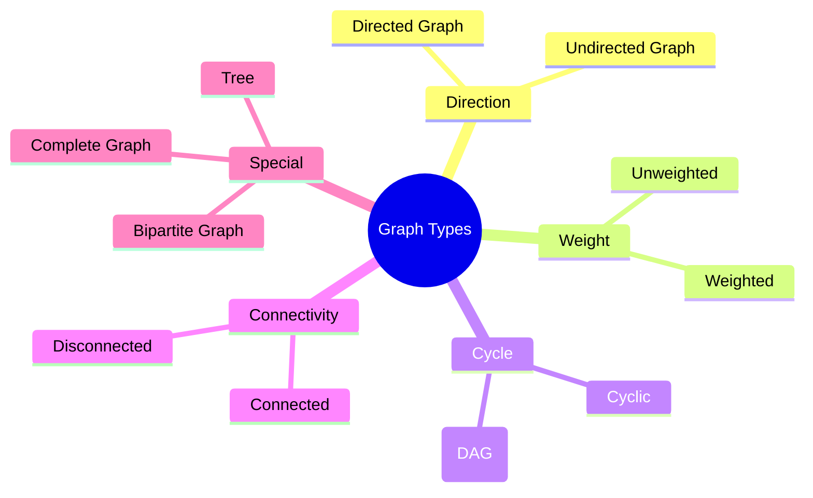
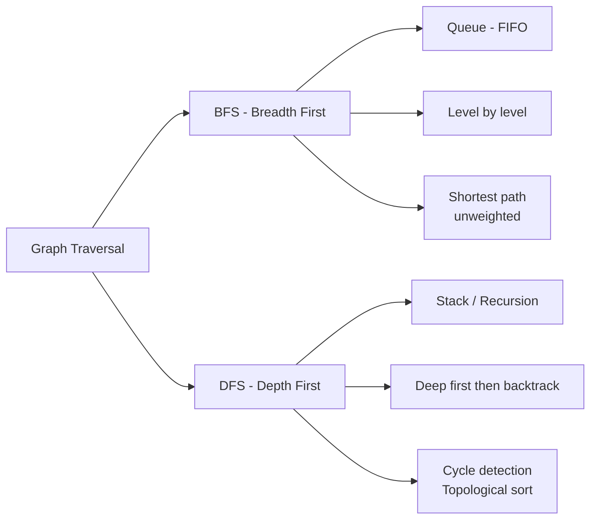
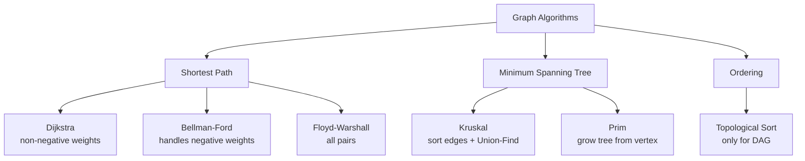
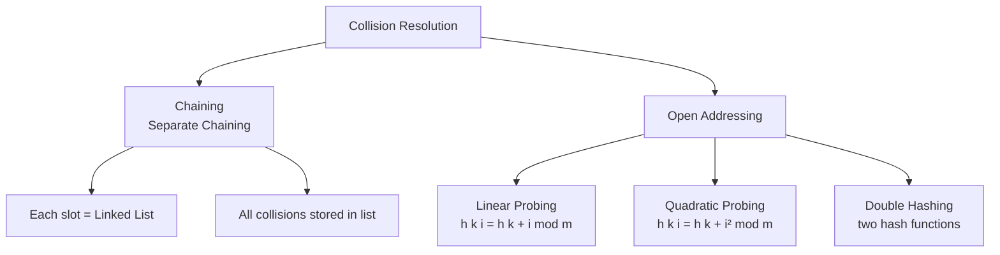
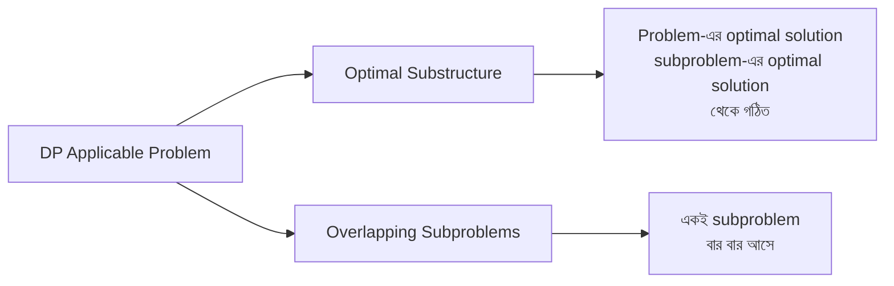
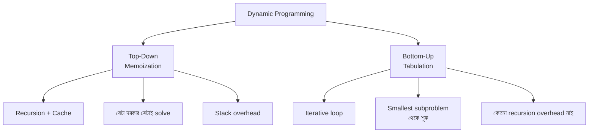
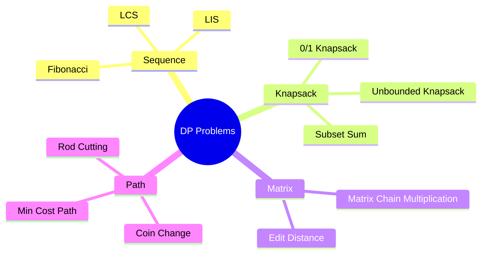
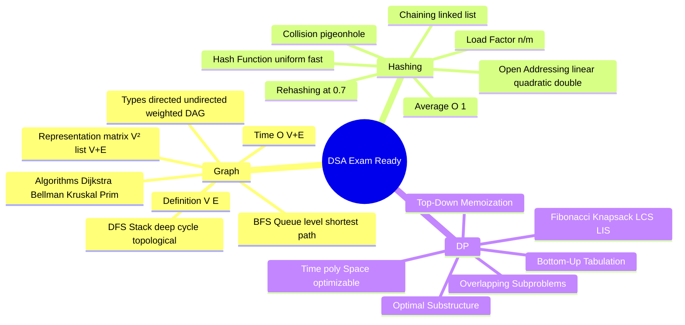

# DSA — Graph, Hashing & Dynamic Programming (Bangladesh Bank IT/AME/Programmer)

> Bangladesh Bank IT Officer / AME / Programmer পরীক্ষার জন্য DSA-র তিনটা গুরুত্বপূর্ণ topic — Graph, Hashing, Dynamic Programming। Concept Card (Bangla), Written Question (English Q + Bangla answer), MCQ (English Q + Bangla explanation) — exam-ready format।

---

# DSA Topic: Graph

---

## 🟦 CONCEPT CARD — Graph

### সংজ্ঞা (Definition)

**Graph** হলো একটা non-linear data structure যেটা দুটো জিনিস দিয়ে তৈরি:

- **Vertices (V)** বা **Nodes** — মূল data point গুলো (যেমন: শহর, মানুষ, computer)
- **Edges (E)** — দুটো vertex-এর মধ্যে connection / সম্পর্ক

গাণিতিকভাবে আমরা লিখি: $G = (V, E)$, যেখানে $V$ হলো vertex set আর $E \subseteq V \times V$ হলো edge set।

সহজ কথায়, একটা graph হলো dot এবং line-এর collection — dot গুলো হলো node, আর line গুলো হলো edge। Tree-ও আসলে graph-এর special case (cycle ছাড়া connected graph)।

### Graph-এর প্রকারভেদ (Types)



**1. Directed vs Undirected:**
- **Undirected Graph:** edge-এর দিক নাই। edge $(u,v)$ মানে $u \leftrightarrow v$ — দুদিকেই যাওয়া যায়। উদাহরণ: Facebook friendship।
- **Directed Graph (Digraph):** প্রত্যেক edge-এর একটা নির্দিষ্ট direction আছে। edge $(u,v)$ মানে শুধু $u \rightarrow v$। উদাহরণ: Twitter follow, web page hyperlink।

**2. Weighted vs Unweighted:**
- **Weighted Graph:** প্রত্যেক edge-এর সাথে একটা weight / cost / distance থাকে। উদাহরণ: Google Maps-এ দুই শহরের মধ্যে দূরত্ব।
- **Unweighted Graph:** সব edge সমান, কোনো weight নাই।

**3. Cyclic vs Acyclic:**
- **Cyclic Graph:** এমন path আছে যেটা একটা vertex থেকে শুরু হয়ে আবার সেই vertex-এ ফিরে আসে।
- **Acyclic Graph:** কোনো cycle নাই। Directed acyclic graph-কে বলে **DAG** — task scheduling, build system, course prerequisite-এ ব্যবহার হয়।

**4. Connected vs Disconnected:**
- **Connected:** যেকোনো দুই vertex-এর মধ্যে কমপক্ষে একটা path আছে।
- **Disconnected:** কিছু vertex অন্য কোনো vertex থেকে reachable না — multiple connected components থাকে।

### Graph Representation (উপস্থাপনা)

একটা graph computer-এ কীভাবে store করব? দুটো প্রধান উপায় আছে।

**ASCII Graph Diagram:**

```
    1 --- 2
    |   / |
    |  /  |
    3 --- 4
```

এখানে vertex = {1, 2, 3, 4} আর edges = {(1,2), (1,3), (2,3), (2,4), (3,4)}।

**(ক) Adjacency Matrix:**

$V \times V$ size-এর একটা 2D array। $A[i][j] = 1$ যদি $i$ থেকে $j$ পর্যন্ত edge থাকে, না হলে $0$।

```
       1  2  3  4
    1 [0  1  1  0]
    2 [1  0  1  1]
    3 [1  1  0  1]
    4 [0  1  1  0]
```

- **Space:** $O(V^2)$ — vertex বেশি হলে অনেক memory লাগে।
- **Edge check:** $O(1)$ — সরাসরি index access।
- **Dense graph** (যেখানে edge সংখ্যা $V^2$-এর কাছাকাছি)-এর জন্য ভালো।

**(খ) Adjacency List:**

প্রত্যেক vertex-এর জন্য একটা list, যেটাতে তার সব neighbor রাখা থাকে।

```
1 -> [2, 3]
2 -> [1, 3, 4]
3 -> [1, 2, 4]
4 -> [2, 3]
```

- **Space:** $O(V + E)$ — sparse graph-এর জন্য অনেক efficient।
- **Edge check:** $O(V)$ worst case — list traverse করতে হয়।
- **Sparse graph**-এর জন্য default choice।

### Graph Traversal (গ্রাফ ভ্রমণ)

Graph-এর সব vertex visit করার দুটো প্রধান পদ্ধতি আছে।



**BFS (Breadth First Search):**

BFS হলো level-by-level traversal — শুরু node থেকে যত vertex সরাসরি connected, সেগুলো আগে visit করে, তারপর তাদের neighbor visit করে।

- **Data structure:** **Queue** (FIFO)
- **মূল ধারণা:** নিকট-আত্মীয় আগে, দূরের পরে।
- **Application:** unweighted graph-এ shortest path বের করা, level order traversal, web crawler।

**BFS Algorithm (pseudo-code):**

```c
BFS(G, start):
    visited[start] = true
    queue.enqueue(start)
    while queue is not empty:
        v = queue.dequeue()
        print(v)
        for each neighbor u of v:
            if not visited[u]:
                visited[u] = true
                queue.enqueue(u)
```

**DFS (Depth First Search):**

DFS হলো গভীরতায় যাওয়ার traversal — যত deep যাওয়া যায় ততদূর গিয়ে তারপর backtrack করে।

- **Data structure:** **Stack** (LIFO) বা recursion।
- **মূল ধারণা:** এক রাস্তা শেষ পর্যন্ত গিয়ে দেখি, তারপর ফিরে অন্য রাস্তা।
- **Application:** cycle detection, connected components, topological sort, maze solving।

**DFS Algorithm (pseudo-code):**

```c
DFS(G, v):
    visited[v] = true
    print(v)
    for each neighbor u of v:
        if not visited[u]:
            DFS(G, u)
```

### গুরুত্বপূর্ণ Algorithms (Mention only)



- **Dijkstra's Algorithm** — weighted graph-এ shortest path (non-negative weights)। Time: $O((V+E) \log V)$ with priority queue।
- **Bellman-Ford** — negative weight handle করে, negative cycle detect করে। Time: $O(VE)$।
- **Kruskal's Algorithm** — Minimum Spanning Tree (MST), edge weight sort করে Union-Find দিয়ে cycle এড়ায়।
- **Prim's Algorithm** — MST, একটা vertex থেকে শুরু করে greedy ভাবে minimum edge add করে।
- **Topological Sort** — শুধু DAG-এর জন্য, dependency order বের করে (course prerequisite এর মতো)।

### Applications (বাস্তব ব্যবহার)

- **Social Network:** Facebook, LinkedIn — মানুষ = vertex, friendship = edge।
- **GPS / Maps:** Google Maps — শহর = vertex, রাস্তা = weighted edge, Dijkstra দিয়ে shortest route।
- **Web Crawling:** webpage = vertex, hyperlink = directed edge।
- **Network Topology:** computer network-এ router/switch arrangement।
- **Recommendation Systems:** Netflix, YouTube — user-item bipartite graph।
- **Compiler Design:** dependency graph, control flow graph।

### Key Points

1. Graph হলো $G = (V, E)$ — vertex এবং edge-এর collection।
2. Tree হলো special graph — connected, acyclic, undirected, $|E| = |V| - 1$।
3. Adjacency Matrix dense graph-এর জন্য ভালো ($O(V^2)$ space)।
4. Adjacency List sparse graph-এর জন্য efficient ($O(V+E)$ space)।
5. BFS Queue ব্যবহার করে, level-by-level explore করে।
6. DFS Stack/recursion ব্যবহার করে, যত deep যাওয়া যায় যায়।
7. BFS unweighted graph-এ shortest path দেয়; DFS দেয় না।
8. Cycle detect করতে DFS-এ back edge খোঁজা হয়।
9. DAG-এর জন্য Topological Sort করা যায়, cyclic graph-এর জন্য যায় না।
10. MST find করতে Kruskal বা Prim — দুটোই greedy approach।

### Time & Space Complexity

| Representation | Space | Add Edge | Remove Edge | Check Edge |
|----------------|-------|----------|-------------|------------|
| Adjacency Matrix | $O(V^2)$ | $O(1)$ | $O(1)$ | $O(1)$ |
| Adjacency List | $O(V+E)$ | $O(1)$ | $O(E)$ | $O(V)$ |

| Traversal | Time | Space |
|-----------|------|-------|
| BFS | $O(V+E)$ | $O(V)$ |
| DFS | $O(V+E)$ | $O(V)$ |

---

## 📝 WRITTEN CARD — Graph

**Q1.** What is a Graph? Explain directed and undirected graphs with examples. What is the difference between a Tree and a Graph?

**Answer:**

**Graph** হলো একটা non-linear data structure যা দুটো set দিয়ে গঠিত — vertex set $V$ এবং edge set $E$, লেখা হয় $G = (V, E)$। Vertex হলো node বা data point, আর edge হলো দুই vertex-এর মধ্যে connection।

**Undirected Graph:** যেখানে edge-এর কোনো নির্দিষ্ট direction নাই। edge $(u, v)$ এবং $(v, u)$ একই জিনিস বোঝায়। উদাহরণ — Facebook-এ friendship, যদি A আর B বন্ধু হয় তবে দুজনেই দুজনের friend।

**Directed Graph (Digraph):** প্রত্যেক edge-এর একটা নির্দিষ্ট direction আছে। edge $(u, v)$ মানে শুধু $u$ থেকে $v$ যাওয়া যায়, $v$ থেকে $u$ আলাদা edge দরকার। উদাহরণ — Twitter follow, A যদি B-কে follow করে B automatically A-কে follow করে না।

**Tree vs Graph:**

| বৈশিষ্ট্য | Tree | Graph |
|-----------|------|-------|
| Cycle | নাই (acyclic) | থাকতে পারে |
| Connectivity | অবশ্যই connected | connected/disconnected হতে পারে |
| Edge সংখ্যা | exactly $n-1$ ($n$ = vertex সংখ্যা) | $0$ থেকে $\binom{n}{2}$ পর্যন্ত |
| Root | একটা specific root আছে | কোনো root concept নাই |
| Path | যেকোনো দুই node-এর মধ্যে unique path | একাধিক path থাকতে পারে |
| Hierarchy | parent-child structure | কোনো hierarchy নাই |

সহজ কথায়, **Tree হলো connected acyclic undirected graph** with exactly $n - 1$ edges। অর্থাৎ Tree হলো Graph-এর special case। সব tree-ই graph, কিন্তু সব graph tree না।

---

**Q2.** Compare Adjacency Matrix and Adjacency List representations. When would you prefer each?

**Answer:**

**Adjacency Matrix:** $V \times V$ size-এর একটা 2D array, যেখানে $A[i][j] = 1$ যদি $i$ থেকে $j$ পর্যন্ত edge থাকে, না হলে $0$ (weighted graph-এ weight রাখা হয়)।

**Adjacency List:** প্রত্যেক vertex-এর জন্য একটা linked list বা dynamic array, যেটাতে সেই vertex-এর সব neighbor-এর তালিকা থাকে।

**তুলনা:**

| বৈশিষ্ট্য | Adjacency Matrix | Adjacency List |
|-----------|------------------|----------------|
| Space | $O(V^2)$ | $O(V + E)$ |
| Edge add | $O(1)$ | $O(1)$ |
| Edge remove | $O(1)$ | $O(E)$ worst |
| Edge check $(u,v)$ | $O(1)$ | $O(V)$ worst |
| All neighbors of $v$ | $O(V)$ | $O(\deg(v))$ |
| Implementation | সহজ | একটু জটিল |

**কখন কোনটা ব্যবহার করব:**

- **Adjacency Matrix প্রাধান্য পায় যখন:**
  - Graph **dense** (অর্থাৎ $E \approx V^2$, প্রায় সব vertex-এর সাথে সব vertex connected)।
  - বার বার edge check করতে হবে (Floyd-Warshall algorithm)।
  - Vertex সংখ্যা ছোট ($V < 1000$)।

- **Adjacency List প্রাধান্য পায় যখন:**
  - Graph **sparse** (edge সংখ্যা অনেক কম, $E \ll V^2$)। বাস্তবের বেশিরভাগ graph sparse।
  - Memory limited।
  - Neighbor traverse করা প্রধান কাজ (BFS, DFS, Dijkstra)।
  - Vertex সংখ্যা বড় ($V > 10^5$)।

**Rule of thumb:** Bangladesh Bank-এর মতো interview-এ "default" answer = Adjacency List, কারণ practical world-এর graph (social network, road network) সবই sparse।

---

**Q3.** Explain BFS traversal with algorithm and trace through the following graph starting from vertex 1: Edges: 1-2, 1-3, 2-4, 2-5, 3-6.

**Answer:**

**BFS (Breadth First Search)** হলো graph traversal algorithm যা একটা source vertex থেকে শুরু করে level-by-level সব vertex visit করে। অর্থাৎ source-এর সরাসরি neighbor আগে, তারপর তাদের neighbor, তারপর আরো দূরের। BFS **Queue (FIFO)** data structure ব্যবহার করে।

**Algorithm:**

```c
BFS(G, start):
    1. visited array সব false দিয়ে initialize কর
    2. visited[start] = true; queue.enqueue(start)
    3. while queue is not empty:
         v = queue.dequeue()
         visit/print v
         for each neighbor u of v:
             if not visited[u]:
                 visited[u] = true
                 queue.enqueue(u)
```

**Graph visualization:**

```
        1
       / \
      2   3
     /|   |
    4 5   6
```

Adjacency list:
```
1 -> [2, 3]
2 -> [1, 4, 5]
3 -> [1, 6]
4 -> [2]
5 -> [2]
6 -> [3]
```

**Step-by-step trace (start = 1):**

| Step | Action | Queue (front → rear) | Visited | Output |
|------|--------|----------------------|---------|--------|
| 1 | start enqueue | [1] | {1} | — |
| 2 | dequeue 1, enqueue 2,3 | [2, 3] | {1,2,3} | 1 |
| 3 | dequeue 2, enqueue 4,5 | [3, 4, 5] | {1,2,3,4,5} | 1, 2 |
| 4 | dequeue 3, enqueue 6 | [4, 5, 6] | {1,2,3,4,5,6} | 1, 2, 3 |
| 5 | dequeue 4, no new neighbor | [5, 6] | same | 1, 2, 3, 4 |
| 6 | dequeue 5, no new neighbor | [6] | same | 1, 2, 3, 4, 5 |
| 7 | dequeue 6, no new neighbor | [] | same | 1, 2, 3, 4, 5, 6 |

**BFS order: 1 → 2 → 3 → 4 → 5 → 6**

**Time complexity:** $O(V + E)$ — প্রত্যেক vertex একবার visit, প্রত্যেক edge একবার check।  
**Space complexity:** $O(V)$ — queue + visited array।

---

**Q4.** Explain DFS traversal with algorithm. How does it differ from BFS in terms of data structure used and application?

**Answer:**

**DFS (Depth First Search)** হলো graph traversal algorithm যা একটা vertex থেকে শুরু করে যত গভীরে (deep) যাওয়া যায় ততদূর গিয়ে, তারপর backtrack করে অন্য পথে যায়। DFS **Stack (LIFO)** ব্যবহার করে — explicitly stack data structure বা implicitly recursion call stack।

**Algorithm (recursive):**

```c
DFS(G, v):
    visited[v] = true
    visit/print v
    for each neighbor u of v:
        if not visited[u]:
            DFS(G, u)
```

**Algorithm (iterative with stack):**

```c
DFS_iterative(G, start):
    stack.push(start)
    while stack is not empty:
        v = stack.pop()
        if not visited[v]:
            visited[v] = true
            visit/print v
            for each neighbor u of v:
                if not visited[u]:
                    stack.push(u)
```

**BFS vs DFS — Comparison:**

| বৈশিষ্ট্য | BFS | DFS |
|-----------|-----|-----|
| Data structure | Queue (FIFO) | Stack / Recursion (LIFO) |
| Exploration | Level-by-level (broad) | Depth first (deep) |
| Memory usage | বেশি (পুরো level একসাথে) | কম (single path) |
| Shortest path (unweighted) | দেয় | দেয় না |
| Cycle detection | possible কিন্তু awkward | natural fit (back edge) |
| Topological sort | ব্যবহার হয় না | DFS দিয়ে সহজে হয় |
| Connected components | কাজ করে | কাজ করে |
| Implementation | iterative সহজ | recursive সহজ |

**DFS-এর Application:**

1. **Cycle detection** — undirected graph-এ visited node-এ আবার পৌঁছালে cycle। Directed graph-এ recursion stack-এ থাকা node-এ ফিরে গেলে cycle।
2. **Topological Sort** — DAG-এর জন্য DFS finish order-এর reverse।
3. **Connected Components** — disconnected graph-এ কতগুলো component আছে।
4. **Strongly Connected Components (SCC)** — Kosaraju / Tarjan algorithm-এ DFS।
5. **Maze / Puzzle solving** — backtracking essentially DFS।
6. **Bridge & Articulation Point** — graph-এর critical edge / vertex।

**BFS-এর Application:**

1. Unweighted graph-এ shortest path।
2. Web crawler — page-গুলো level অনুযায়ী crawl।
3. Social network-এ "friends of friends"।
4. Bipartite graph check।
5. GPS navigation (basic)।

---

**Q5.** What is a Minimum Spanning Tree (MST)? Explain Kruskal's algorithm with an example.

**Answer:**

**Spanning Tree:** একটা connected, undirected graph $G$-এর spanning tree হলো একটা subgraph যা graph-এর সব vertex include করে কিন্তু কোনো cycle নাই, এবং exactly $V - 1$ edge থাকে।

**Minimum Spanning Tree (MST):** weighted graph-এর এমন spanning tree যেখানে edge weight-এর total sum সর্বনিম্ন। অর্থাৎ সব vertex connect করার সবচেয়ে কম খরচের উপায়।

**বাস্তব উদাহরণ:** কয়েকটা শহরের মধ্যে রাস্তা / cable / pipeline বসাতে হবে এমনভাবে যে সব শহর connected থাকবে কিন্তু খরচ সর্বনিম্ন হবে।

**Properties of MST:**
- $V - 1$ edge থাকে।
- Cycle থাকে না।
- Unique হতে নাও পারে (যদি একই weight-এর একাধিক edge থাকে)।

**Kruskal's Algorithm (Greedy approach):**

মূল idea: edge-গুলোকে weight অনুযায়ী sort কর, তারপর ছোট weight-এর edge থেকে শুরু করে এক এক করে add কর — যদি cycle তৈরি না করে। Cycle check-এর জন্য **Union-Find (Disjoint Set Union, DSU)** data structure ব্যবহার হয়।

**Steps:**

```c
Kruskal(G):
    1. সব edge weight অনুযায়ী ascending sort কর
    2. MST = empty set
    3. সব vertex-এর জন্য আলাদা set তৈরি কর (Union-Find)
    4. for each edge (u, v) in sorted order:
         if find(u) != find(v):    // different set, no cycle
             MST.add(edge(u,v))
             union(u, v)
         if MST has V-1 edges: break
    5. return MST
```

**উদাহরণ:**

Graph (5 vertices: A, B, C, D, E):

```
Edges with weights:
A-B: 1
A-C: 4
B-C: 2
B-D: 5
C-D: 3
C-E: 6
D-E: 7
```

**Step 1: Sort edges by weight:**

| Edge | Weight |
|------|--------|
| A-B | 1 |
| B-C | 2 |
| C-D | 3 |
| A-C | 4 |
| B-D | 5 |
| C-E | 6 |
| D-E | 7 |

**Step 2: Process edges one by one:**

| Edge | Weight | Action | MST so far | Sets |
|------|--------|--------|------------|------|
| A-B | 1 | A, B different sets → ADD | {A-B} | {A,B}, {C}, {D}, {E} |
| B-C | 2 | B, C different sets → ADD | {A-B, B-C} | {A,B,C}, {D}, {E} |
| C-D | 3 | C, D different sets → ADD | {A-B, B-C, C-D} | {A,B,C,D}, {E} |
| A-C | 4 | A, C **same set** → SKIP (cycle) | same | same |
| B-D | 5 | B, D **same set** → SKIP (cycle) | same | same |
| C-E | 6 | C, E different sets → ADD | {A-B, B-C, C-D, C-E} | {A,B,C,D,E} |

MST complete (4 edges = V-1 = 5-1)। **Total weight = 1 + 2 + 3 + 6 = 12**।

**MST edges:** A-B, B-C, C-D, C-E

**Time complexity:** $O(E \log E)$ — sorting dominate করে। Union-Find amortized প্রায় $O(1)$।

**Kruskal vs Prim:**

| বৈশিষ্ট্য | Kruskal | Prim |
|-----------|---------|------|
| Approach | Edge-based, sort + Union-Find | Vertex-based, grow tree |
| Best for | Sparse graph | Dense graph |
| Data structure | Disjoint Set Union | Priority Queue (Min-Heap) |
| Time | $O(E \log E)$ | $O(E \log V)$ |

---

## ❓ MCQ CARD — Graph

**41.** Which data structure is used in BFS traversal of a graph?

A) Stack  
B) Queue  
C) Priority Queue  
D) Array  

**Correct Answer:** B  

**Explanation:** BFS level-by-level explore করে — অর্থাৎ আগে যে vertex add হয়েছে তাকে আগে process করতে হয়। এই **FIFO (First In First Out)** behavior **Queue** data structure দেয়। Stack (LIFO) দিলে DFS হবে। Priority Queue use হয় Dijkstra-তে যেখানে weight অনুযায়ী order দরকার।

---

**42.** The time complexity of BFS and DFS on a graph with V vertices and E edges is:

A) $O(V^2)$  
B) $O(V \times E)$  
C) $O(V + E)$  
D) $O(E \log V)$  

**Correct Answer:** C  

**Explanation:** BFS এবং DFS দুটোতেই **প্রতিটি vertex একবার visit হয়** ($O(V)$) এবং **প্রতিটি edge একবার check হয়** ($O(E)$, undirected graph-এ প্রতিটি edge দুবার, কিন্তু সেটাও $O(E)$)। তাই total time $O(V + E)$। Adjacency Matrix ব্যবহার করলে neighbor খুঁজতে $O(V)$ লাগে, তখন total $O(V^2)$ হয়। কিন্তু standard adjacency list-এর জন্য $O(V+E)$।

---

**43.** Adjacency matrix of an undirected graph is always:

A) Diagonal matrix  
B) Symmetric matrix  
C) Identity matrix  
D) Triangular matrix  

**Correct Answer:** B (Symmetric matrix)  

**Explanation:** Undirected graph-এ যদি $u$ থেকে $v$ edge থাকে, তবে $v$ থেকে $u$-ও আছে (একই edge)। তাই $A[i][j] = A[j][i]$ — অর্থাৎ matrix-টা **main diagonal-এর সাপেক্ষে symmetric**। Directed graph-এ এটা সত্য না, কারণ direction matter করে। Diagonal matrix-এ শুধু diagonal-এ value থাকে, identity matrix-এ diagonal = 1 সব 0 — এগুলো adjacency matrix-এর সাথে মেলে না।

---

**44.** Which algorithm finds the shortest path in a weighted graph with non-negative weights?

A) BFS  
B) DFS  
C) Dijkstra's  
D) Kruskal's  

**Correct Answer:** C (Dijkstra's)  

**Explanation:** **BFS** শুধু **unweighted graph**-এ shortest path দেয় (প্রত্যেক edge weight 1 ধরা হয়)। Weighted graph-এ BFS ভুল উত্তর দিতে পারে। **Dijkstra's algorithm** non-negative weighted graph-এ single-source shortest path বের করে greedy approach + priority queue দিয়ে। **Negative weight** থাকলে Dijkstra কাজ করে না, তখন **Bellman-Ford** ব্যবহার হয়। **Kruskal's** হলো MST algorithm, shortest path না।

---

**45.** A graph with $n$ vertices and $n-1$ edges that is connected must be a:

A) Complete graph  
B) Cyclic graph  
C) Tree  
D) Bipartite graph  

**Correct Answer:** C (Tree)  

**Explanation:** Tree-র সংজ্ঞা থেকে — **connected, acyclic, undirected graph with exactly $n-1$ edges (n vertex-এর জন্য)**। যদি connected graph-এ exactly $n-1$ edge থাকে তবে অবশ্যই **acyclic** (কারণ একটা cycle তৈরি করতে কমপক্ষে $n$ edge দরকার একটা connected component-এ)। **Complete graph**-এ $\binom{n}{2} = \frac{n(n-1)}{2}$ edge থাকে। **Cyclic graph**-এ অবশ্যই cycle আছে যেটা $n-1$ edge দিয়ে connected হলে impossible। **Bipartite graph** হতেও পারে নাও পারে — সেটা edge সংখ্যার ওপর নির্ভর করে না। Tree আসলে bipartite-ই হয়, কিন্তু সবচেয়ে নির্দিষ্ট uttor হলো **Tree**।

---
---

# DSA Topic: Hashing & Dynamic Programming

---

## 🟦 CONCEPT CARD — Hashing

### সংজ্ঞা (Definition)

**Hashing** হলো একটা technique যেটা দিয়ে একটা **key** কে একটা ছোট fixed-size **index**-এ map করা হয়, যাতে আমরা সরাসরি (constant time-এ) data access / store / retrieve করতে পারি।

মূল idea: একটা **Hash Function** $h(k)$ ব্যবহার করে key $k$ থেকে একটা index বের করা হয়, যেটা দিয়ে **Hash Table** (একটা array)-এ data store করা যায়।

$$h(k) = \text{index in hash table}, \quad 0 \le h(k) < m$$

যেখানে $m$ হলো hash table-এর size।

**বাস্তব উদাহরণ:** ছাত্রের roll number থেকে তার marks store করা। Roll = key, marks = value, hash function roll-কে array index-এ convert করে।

```
Key (Name)  ->  Hash Function  ->  Index  ->  Hash Table
"Rahim"           h("Rahim")         3         table[3] = "Rahim, 85"
"Karim"           h("Karim")         7         table[7] = "Karim, 90"
```

### Hash Function-এর গুণাবলী (Properties)

একটা ভালো hash function-এর তিনটা property থাকা দরকার:

1. **Deterministic** — একই key সবসময় একই hash value দেবে।
2. **Uniform distribution** — সব index-এ data সমানভাবে ছড়িয়ে পড়বে, একটা slot-এ জমে যাবে না।
3. **Fast computation** — hash calculate করতে $O(1)$ সময় লাগবে।
4. **Minimum collision** — ভিন্ন key-এর জন্য একই hash কম হবে।

**সহজ উদাহরণ — Division Method:**

$$h(k) = k \mod m$$

যেমন $k = 23$, $m = 10$ হলে $h(23) = 23 \mod 10 = 3$।

### Hash Table (হ্যাশ টেবিল)

Hash table হলো একটা array যেখানে index-গুলো hash function-এর output, আর value হলো actual data। Direct addressing-এর মতো, কিন্তু key অনেক বড় range-এর হলেও ছোট table-এ store করা যায়।

### Collision (সংঘর্ষ)

**Collision** ঘটে যখন **দুটো ভিন্ন key একই hash value** দেয়। 

উদাহরণ: $h(k) = k \mod 10$ হলে $h(23) = 3$ এবং $h(13) = 3$ — দুজনেই index 3-এ যেতে চাচ্ছে। এটাকেই collision বলে।

**Pigeonhole Principle:** যদি keys-এর সংখ্যা hash table size-এর চেয়ে বেশি হয়, তবে collision অবশ্যম্ভাবী।

### Collision Resolution Methods



**(ক) Chaining (Separate Chaining):**

প্রত্যেক table slot-এ একটা **linked list** রাখা হয়। Collision হলে নতুন element সেই list-এ append হয়।

```
index 0: -> 
index 1: -> 11 -> 21 -> 31
index 2: -> 
index 3: -> 13 -> 23
index 4: -> 14
```

**সুবিধা:**
- Implementation সহজ।
- Table কখনো "full" হয় না।
- Delete operation সহজ।

**অসুবিধা:**
- Linked list traverse করতে হয় (worst case $O(n)$)।
- Extra memory pointer-এর জন্য।

**(খ) Open Addressing (Closed Hashing):**

Collision হলে table-এর অন্য কোনো খালি slot খুঁজে নেয়, কোনো extra structure লাগে না।

**Linear Probing:** যদি $h(k)$ index-এ already filled থাকে, তবে পরের slot, তার পরের slot... দেখা হয়।

$$h(k, i) = (h(k) + i) \mod m, \quad i = 0, 1, 2, \dots$$

- **সমস্যা:** **Primary Clustering** — consecutive filled slot-গুলো একসাথে cluster তৈরি করে, ফলে probe sequence দীর্ঘ হয়।

**Quadratic Probing:** linear-এর বদলে quadratic step নেয়।

$$h(k, i) = (h(k) + c_1 i + c_2 i^2) \mod m$$

- Primary clustering কমে, কিন্তু **Secondary Clustering** থাকে (একই hash-এর key-গুলো একই probe sequence follow করে)।

**Double Hashing:** দ্বিতীয় একটা hash function ব্যবহার করে।

$$h(k, i) = (h_1(k) + i \cdot h_2(k)) \mod m$$

- সবচেয়ে ভালো distribution, clustering সবচেয়ে কম।

### Load Factor (λ) এবং Rehashing

**Load Factor:**

$$\lambda = \frac{n}{m}$$

যেখানে $n$ = stored element সংখ্যা, $m$ = table size।

- $\lambda$ বেশি হলে collision বেশি, performance খারাপ।
- Chaining-এ $\lambda > 1$ হতে পারে (linked list দীর্ঘ হয়)।
- Open addressing-এ $\lambda < 1$ থাকতে হয় (table full হলে kaj করে না)।

**Rehashing:** যখন load factor threshold (সাধারণত $\lambda > 0.7$) ছাড়িয়ে যায়, তখন **table size double** করে সব element-কে নতুন hash function দিয়ে নতুন table-এ পুনরায় insert করা হয়। এটাকেই rehashing বলে।

### Applications (বাস্তব ব্যবহার)

- **Dictionary / Map** — Python `dict`, Java `HashMap`, C++ `unordered_map`।
- **Database Indexing** — fast lookup।
- **Cache** — LRU cache, browser cache।
- **Symbol Table** — compiler-এ variable lookup।
- **Password Storage** — password hash store করে রাখা (bcrypt, SHA-256)।
- **Set Implementation** — HashSet।
- **Cryptography** — digital signature, blockchain।

### Hashing Key Points

1. Hashing $O(1)$ average time-এ search/insert/delete দেয়।
2. Hash function deterministic এবং uniform হওয়া দরকার।
3. Collision unavoidable — pigeonhole principle।
4. Chaining + Linked list সহজ, table full হয় না।
5. Open addressing extra memory লাগে না, কিন্তু load factor-এ সীমা।
6. Linear Probing → primary clustering, Double Hashing best।
7. Load factor $\lambda > 0.7$ হলে rehashing দরকার।
8. Worst case (সব key একই hash) → $O(n)$, কিন্তু rare।

### Hashing Time Complexity

| Operation | Average | Worst |
|-----------|---------|-------|
| Search | $O(1)$ | $O(n)$ |
| Insert | $O(1)$ | $O(n)$ |
| Delete | $O(1)$ | $O(n)$ |

---

## 🟦 CONCEPT CARD — Dynamic Programming

### সংজ্ঞা (Definition)

**Dynamic Programming (DP)** হলো একটা optimization technique যেখানে একটা বড় problem-কে ছোট subproblem-এ ভেঙে solve করা হয়, এবং প্রত্যেক subproblem-এর answer **একবারই calculate করে store করে রাখা হয়** যাতে আবার দরকার পড়লে recompute করতে না হয়।

মূল মন্ত্র: **"Solve once, remember forever."**

DP-র মূল লক্ষ্য — **same subproblem বারবার solve করার অপচয় বন্ধ করা**।

### দুটো অপরিহার্য Property

DP apply করতে হলে problem-টার এই দুটো property থাকতেই হবে:



**1. Optimal Substructure:**

বড় problem-এর optimal solution তার ছোট subproblem-গুলোর optimal solution থেকে গঠন করা যায়।

উদাহরণ: shortest path A → C through B = (shortest path A → B) + (shortest path B → C)।

**2. Overlapping Subproblems:**

Recursive solution-এ একই subproblem বার বার solve করতে হয়। যেমন Fibonacci-তে $F(5)$ calculate করতে $F(3)$ অনেকবার লাগে।

### Fibonacci Example (DP-র Hello World)

**Plain recursion (BAD):**

```c
fib(n):
    if n <= 1: return n
    return fib(n-1) + fib(n-2)
```

Time: $O(2^n)$ — exponential, কারণ একই subproblem বহুবার solve হয়।

**Recursion tree for fib(5):**

```
                fib(5)
              /        \
          fib(4)        fib(3)
         /     \        /    \
      fib(3)  fib(2) fib(2) fib(1)
      /  \    /  \   /  \
   fib(2) ... ...
```

লক্ষ্য কর `fib(3)` দুবার, `fib(2)` তিনবার calculate হচ্ছে — wasted work!

**With DP (GOOD):**

প্রত্যেক value একবারই calculate করে array/dictionary-তে store করব।

```c
// Bottom-up DP (Tabulation)
fib(n):
    dp[0] = 0; dp[1] = 1
    for i from 2 to n:
        dp[i] = dp[i-1] + dp[i-2]
    return dp[n]
```

Time: $O(n)$, Space: $O(n)$ (further optimized to $O(1)$)।

### DP-র দুই Approach



**(ক) Top-Down (Memoization):**

Recursion দিয়ে problem solve কর, কিন্তু প্রত্যেক subproblem-এর answer একটা cache (dictionary/array)-এ রাখো। আবার দরকার পড়লে cache থেকে নাও।

```c
memo = {}
fib(n):
    if n in memo: return memo[n]
    if n <= 1: return n
    memo[n] = fib(n-1) + fib(n-2)
    return memo[n]
```

**(খ) Bottom-Up (Tabulation):**

ছোট subproblem থেকে শুরু করে iteratively বড় subproblem solve কর, একটা table fill কর।

```c
fib(n):
    dp[0] = 0; dp[1] = 1
    for i from 2 to n:
        dp[i] = dp[i-1] + dp[i-2]
    return dp[n]
```

### DP vs Divide-and-Conquer

| বৈশিষ্ট্য | Dynamic Programming | Divide and Conquer |
|-----------|---------------------|---------------------|
| Subproblems | **Overlapping** (একই subproblem বার বার) | **Non-overlapping** (আলাদা আলাদা subproblem) |
| Solution caching | হ্যাঁ, store করে | না |
| Approach | bottom-up / top-down with memoization | recursive divide |
| Examples | Fibonacci, LCS, Knapsack | Merge Sort, Quick Sort, Binary Search |

### Classic DP Problems



- **Fibonacci** — basic DP intro।
- **0/1 Knapsack** — items-কে include/exclude decide কর, max value within capacity।
- **Longest Common Subsequence (LCS)** — দুটো string-এর সবচেয়ে বড় common subsequence।
- **Longest Increasing Subsequence (LIS)** — array-তে সবচেয়ে বড় increasing subsequence।
- **Matrix Chain Multiplication** — matrix multiplication-এর optimal parenthesization।
- **Edit Distance** — এক string থেকে আরেকটা string বানাতে min insert/delete/replace।
- **Coin Change** — given coin denomination, target amount বানানোর min coin সংখ্যা।

### Applications (বাস্তব ব্যবহার)

- **Resource Optimization** — production planning, project scheduling।
- **Bioinformatics** — DNA sequence alignment (Needleman-Wunsch algorithm)।
- **Finance** — portfolio optimization, option pricing।
- **Game Theory** — optimal strategy in games (chess engine, AI)।
- **NLP** — spell checker (Edit Distance), parsing।
- **Compiler Optimization** — register allocation।

### DP Key Points

1. DP = recursion + caching, exponential থেকে polynomial-এ time কমায়।
2. Two pillars: **optimal substructure** + **overlapping subproblems**।
3. Top-down (memoization) সহজ implement, কিন্তু stack overhead।
4. Bottom-up (tabulation) iterative, faster, no recursion।
5. DP table-এর dimension = problem-এর state variable সংখ্যা।
6. Many DP problems can be space-optimized (only previous row/state needed)।

---

## 📝 WRITTEN CARD — Hashing & DP

**Q1.** What is Hashing? Explain hash collision and its resolution methods (Chaining and Linear Probing).

**Answer:**

**Hashing** হলো এমন একটা technique যেটা **hash function** ব্যবহার করে যেকোনো key-কে fixed-size table-এর একটা index-এ convert করে, যাতে **constant time-এ** ($O(1)$ average) data store/search/retrieve করা যায়। Hash table হলো সেই array যেখানে key-value pair store হয়।

উদাহরণ: $h(k) = k \mod 10$ একটা সহজ hash function। $k = 25$ হলে index = 5।

**Hash Collision:**

যখন **দুটো ভিন্ন key একই hash value (একই index)** দেয়, তখন তাকে collision বলে। যেমন $h(15) = 5$ এবং $h(25) = 5$ — দুজনেই index 5-এ যেতে চাচ্ছে। **Pigeonhole principle** অনুযায়ী key বেশি হলে collision অনিবার্য।

**Resolution Method 1 — Chaining (Separate Chaining):**

প্রত্যেক hash table slot-এ একটা **linked list** রাখা হয়। Collision হলে নতুন element সেই list-এ append করা হয়।

**ASCII Diagram:**

```
Index    Linked List
-----    -----------
  0   ->  
  1   ->  [21] -> [11] -> NULL
  2   ->  
  3   ->  [13] -> [23] -> [33] -> NULL
  4   ->  [14] -> NULL
  5   ->  [25] -> [15] -> [5]  -> NULL
```

- **সুবিধা:** simple, no clustering, table কখনো full হয় না।
- **অসুবিধা:** extra memory (pointer), worst case $O(n)$ if all hash to same slot।

**Resolution Method 2 — Linear Probing (Open Addressing):**

Collision হলে next available slot খোঁজা হয় sequentially।

$$h(k, i) = (h(k) + i) \mod m, \quad i = 0, 1, 2, \dots$$

**ASCII Diagram (insert 15, 25, 35 with $h(k) = k \mod 10$):**

```
Step 1: insert 15, h(15)=5  -> [_, _, _, _, _, 15, _, _, _, _]
Step 2: insert 25, h(25)=5 (collision)
        try (5+1)%10=6      -> [_, _, _, _, _, 15, 25, _, _, _]
Step 3: insert 35, h(35)=5 (collision)
        try (5+1)%10=6 (filled)
        try (5+2)%10=7      -> [_, _, _, _, _, 15, 25, 35, _, _]
```

- **সুবিধা:** no extra memory, cache friendly।
- **অসুবিধা:** **primary clustering** — consecutive filled slots একটা long cluster তৈরি করে, ফলে probe sequence বড় হয়, performance কমে। Load factor $\lambda > 0.7$ হলে খুব বাজে।

**তুলনা:**

| বৈশিষ্ট্য | Chaining | Linear Probing |
|-----------|----------|----------------|
| Memory | বেশি (pointer) | কম |
| Table full | কখনো না | $\lambda = 1$ হলে full |
| Clustering | নাই | আছে (primary) |
| Delete | সহজ | জটিল (tombstone দরকার) |
| Cache | poor (random pointer) | excellent |

---

**Q2.** What is the load factor in hashing? How does it affect performance? What is rehashing?

**Answer:**

**Load Factor ($\lambda$):**

Hash table-এর **load factor** হলো store করা element সংখ্যা ($n$) এবং hash table-এর total size ($m$)-এর ratio:

$$\lambda = \frac{n}{m}$$

এটা hash table কতটা ভর্তি সেটা নির্দেশ করে।

**Performance-এ প্রভাব:**

- **Chaining-এর জন্য:**
  - Average chain length = $\lambda$।
  - Average search time = $O(1 + \lambda)$।
  - $\lambda \le 1$ হলে practically constant time।
  - $\lambda$ বড় হলে chain দীর্ঘ → search slow।

- **Open Addressing-এর জন্য:**
  - $\lambda < 1$ থাকতেই হবে (table full হলে কাজ করে না)।
  - Linear Probing-এ average probe = $\frac{1}{2}\left(1 + \frac{1}{1-\lambda}\right)$।
  - $\lambda \to 1$ হলে probe সংখ্যা explode করে।
  - Common threshold: $\lambda \le 0.7$ রাখা।

**Real-world threshold:**
- Java HashMap default load factor = 0.75
- Python dict load factor threshold = 0.66
- Go map = 6.5 (chaining-based)

**Rehashing (পুনঃ-হ্যাশিং):**

যখন load factor threshold (সাধারণত $0.7$ বা $0.75$) ছাড়িয়ে যায়, তখন hash table-এর performance খারাপ হতে শুরু করে। এ সময় আমরা **rehashing** করি।

**Rehashing-এর Steps:**

1. একটা **নতুন table** allocate কর সাধারণত **double size** ($m_{new} = 2m$, prime number হলে আরো ভালো)।
2. **নতুন hash function** define কর (modulus নতুন size-এ)।
3. পুরানো table-এর **প্রত্যেক element** নতুন table-এ পুনরায় hash করে insert কর।
4. পুরানো table free কর।

**Cost:** Rehashing $O(n)$ time-এর কাজ। কিন্তু এটা কম ঘন ঘন হয়, তাই **amortized cost প্রতি insertion-এ $O(1)$**।

**উদাহরণ:**

```
Old table (size 8, n=6, λ=0.75):
[_, 11, _, 13, _, 25, 14, _]

Rehash to new table size 16:
নতুন h(k) = k mod 16
11 -> 11, 13 -> 13, 25 -> 9, 14 -> 14
[_, _, _, _, _, _, _, _, _, 25, _, 11, _, 13, 14, _]

New λ = 6/16 = 0.375 (much better!)
```

**সুবিধা:** Performance পুনরুদ্ধার, future operation আবার $O(1)$।  
**অসুবিধা:** এক-বারের জন্য $O(n)$ cost, real-time system-এ pause হতে পারে।

---

**Q3.** What is Dynamic Programming? What are overlapping subproblems and optimal substructure?

**Answer:**

**Dynamic Programming (DP):**

DP হলো একটা **algorithmic technique** যেখানে একটা complex problem-কে ছোট subproblem-এ ভেঙে solve করা হয়, এবং প্রত্যেক subproblem-এর answer **একবারই calculate করে memory-তে store করে রাখা হয়** যাতে পরবর্তীতে recompute করতে না হয়।

মূলত DP দুটো জিনিসের combination:
1. **Recursion** (problem-কে subproblem-এ ভাঙা)
2. **Memoization / Tabulation** (result store করা)

DP **Brute-force exponential time**-কে **polynomial time**-এ নামিয়ে আনে।

**দুটো অপরিহার্য Property:**

DP কোনো problem-এ apply করতে হলে এই দুটো property থাকতেই হবে:

**1. Optimal Substructure:**

একটা problem-এ optimal substructure আছে যদি তার **optimal solution তার subproblem-এর optimal solution থেকে গঠন করা যায়**।

উদাহরণ — **Shortest path:** A থেকে C যাওয়ার shortest path যদি B হয়ে যায়, তবে:
$$\text{shortest}(A \to C) = \text{shortest}(A \to B) + \text{shortest}(B \to C)$$

**Counter example — Longest path:** Longest simple path-এ optimal substructure নাই, কারণ subpath optimal হলেও মূল path simple না-ও হতে পারে।

**2. Overlapping Subproblems:**

Recursive solution-এ যদি **একই subproblem বারবার solve করতে হয়**, তবে problem-টায় overlapping subproblems আছে।

**Fibonacci Example:**

```c
fib(5) = fib(4) + fib(3)
fib(4) = fib(3) + fib(2)
fib(3) = fib(2) + fib(1)   <- fib(3) দ্বিতীয়বার
fib(2) = fib(1) + fib(0)   <- fib(2) তৃতীয়বার
```

**Recursion tree:**

```
                    fib(5)
                   /      \
              fib(4)        fib(3)
             /     \        /    \
         fib(3)   fib(2) fib(2) fib(1)
         /  \      /  \    /  \
      fib(2) fib(1)...
```

লক্ষ্য কর — `fib(3)` 2 বার, `fib(2)` 3 বার, `fib(1)` 5 বার calculate হচ্ছে। এটাই overlapping subproblem। Plain recursion-এ time $O(2^n)$।

**DP দিয়ে সমাধান:**

```c
// Memoization (top-down)
memo = {}
fib(n):
    if n in memo: return memo[n]
    if n <= 1: return n
    memo[n] = fib(n-1) + fib(n-2)
    return memo[n]
```

প্রতিটি `fib(i)` মাত্র একবার calculate হয়, পরের বার cache থেকে আসে। Time এখন $O(n)$।

**কখন DP নয়:**
- যদি subproblem-গুলো overlap না করে → divide-and-conquer (যেমন merge sort) ব্যবহার কর।
- যদি optimal substructure না থাকে → greedy বা অন্য approach।

---

**Q4.** Solve the 0/1 Knapsack problem using Dynamic Programming. Items: weights = [1, 3, 4, 5], values = [1, 4, 5, 7], capacity W = 7.

**Answer:**

**0/1 Knapsack Problem:**

$n$টা item আছে, প্রত্যেকটার ওজন $w_i$ এবং দাম $v_i$ আছে। একটা bag-এর capacity $W$। প্রত্যেক item হয় পুরোপুরি নাও (1) নয়তো একদম নিও না (0) — fractional নেওয়া যাবে না। এমনভাবে item বাছাই কর যাতে total ওজন $\le W$ এবং **total দাম maximum** হয়।

**DP Recurrence:**

ধরি $dp[i][w]$ = প্রথম $i$টা item বিবেচনা করে capacity $w$-এ সর্বোচ্চ value।

$$
dp[i][w] = 
\begin{cases}
0 & \text{if } i = 0 \text{ or } w = 0 \\
dp[i-1][w] & \text{if } w_i > w \\
\max(dp[i-1][w],\ v_i + dp[i-1][w - w_i]) & \text{otherwise}
\end{cases}
$$

ব্যাখ্যা: প্রতি item-এর জন্য দুটো choice — **item নেও** (then value add + remaining capacity-তে আগের answer) বা **item নিও না** (আগের answer সরাসরি)।

**Given:**
- $n = 4$
- weights = $[1, 3, 4, 5]$
- values = $[1, 4, 5, 7]$
- $W = 7$

**DP Table Construction ($dp[i][w]$, rows = items, columns = capacity 0 to 7):**

| $i \backslash w$ | 0 | 1 | 2 | 3 | 4 | 5 | 6 | 7 |
|---|---|---|---|---|---|---|---|---|
| **0 (no item)** | 0 | 0 | 0 | 0 | 0 | 0 | 0 | 0 |
| **1 (w=1, v=1)** | 0 | 1 | 1 | 1 | 1 | 1 | 1 | 1 |
| **2 (w=3, v=4)** | 0 | 1 | 1 | 4 | 5 | 5 | 5 | 5 |
| **3 (w=4, v=5)** | 0 | 1 | 1 | 4 | 5 | 6 | 6 | 9 |
| **4 (w=5, v=7)** | 0 | 1 | 1 | 4 | 5 | 7 | 8 | 9 |

**Step-by-step calculation (some critical cells):**

- `dp[2][3]`: item 2 (w=3, v=4) নিতে পারি। max(dp[1][3]=1, 4 + dp[1][0]=0) = **4**।
- `dp[3][7]`: item 3 (w=4, v=5)। max(dp[2][7]=5, 5 + dp[2][3]=4) = max(5, 9) = **9**।
- `dp[4][7]`: item 4 (w=5, v=7)। max(dp[3][7]=9, 7 + dp[3][2]=1) = max(9, 8) = **9**।

**Final Answer: $dp[4][7] = 9$।**

**Selected items (backtrack):**

`dp[4][7]=9` came from `dp[3][7]` (item 4 not taken)। `dp[3][7]=9` came from `5 + dp[2][3]=4` (item 3 taken)। `dp[2][3]=4` came from `4 + dp[1][0]=0` (item 2 taken)। `dp[1][0]=0` (no item)।

**Selected: item 2 (w=3, v=4) + item 3 (w=4, v=5) = total weight 7, total value 9 ✓**

**Complexity:**
- Time: $O(nW) = O(4 \times 7) = O(28)$।
- Space: $O(nW)$ standard, optimizable to $O(W)$ using rolling array।

---

**Q5.** What is the difference between Memoization (Top-down) and Tabulation (Bottom-up) in DP?

**Answer:**

DP-তে subproblem-এর result store করার দুটো প্রধান approach আছে।

**1. Memoization (Top-Down):**

মূল problem থেকে শুরু করে recursively subproblem-এ যাও, কিন্তু প্রত্যেক subproblem-এর answer **cache (dictionary বা array)**-এ store করে রাখো।

```c
memo = {}
solve(state):
    if state in memo:
        return memo[state]
    if base_case(state):
        return base_value
    result = recurrence using solve(smaller_states)
    memo[state] = result
    return result
```

**2. Tabulation (Bottom-Up):**

ছোট subproblem থেকে শুরু কর, iteratively একটা table fill করতে করতে বড় problem-এর answer-এ পৌঁছাও।

```c
solve():
    dp[base_cases] = base_values
    for state from smallest to largest:
        dp[state] = recurrence using dp[smaller_states]
    return dp[final_state]
```

**Detailed Comparison:**

| বৈশিষ্ট্য | Memoization (Top-Down) | Tabulation (Bottom-Up) |
|-----------|------------------------|------------------------|
| **Approach** | Recursive | Iterative |
| **Direction** | বড় problem → ছোট subproblem | ছোট subproblem → বড় problem |
| **Storage** | Hashmap বা array (lazy fill) | Array (eager fill) |
| **Stack overhead** | আছে (recursion) — deep recursion-এ stack overflow risk | নাই |
| **Speed** | Slightly slower (function call overhead) | Faster (no overhead, cache-friendly) |
| **Subproblem solve** | শুধু **needed** subproblem | **সব** subproblem (কিছু অপ্রয়োজনীয়ও) |
| **Implementation** | Plain recursion-এ cache add করলেই হয় (সহজ) | Order of subproblem ঠিক করতে হয় (একটু কঠিন) |
| **Space optimization** | কঠিন | সহজ (rolling array) |
| **Debugging** | সহজ (recursion natural) | একটু কঠিন (table tracing) |

**উদাহরণ — Fibonacci-তে দুটো approach:**

**Top-down (Memoization):**

```python
memo = {}
def fib(n):
    if n in memo: return memo[n]
    if n <= 1: return n
    memo[n] = fib(n-1) + fib(n-2)
    return memo[n]
```

**Bottom-up (Tabulation):**

```python
def fib(n):
    if n <= 1: return n
    dp = [0] * (n+1)
    dp[1] = 1
    for i in range(2, n+1):
        dp[i] = dp[i-1] + dp[i-2]
    return dp[n]
```

**Space-Optimized Bottom-up (only O(1) space):**

```python
def fib(n):
    if n <= 1: return n
    prev, curr = 0, 1
    for i in range(2, n+1):
        prev, curr = curr, prev + curr
    return curr
```

**কখন কোনটা ব্যবহার করব:**

- **Memoization preferred** যখন:
  - সব subproblem solve করা লাগে না (sparse DP)।
  - Problem-টা naturally recursive (tree DP, graph DP)।
  - Implementation দ্রুত করতে হবে।

- **Tabulation preferred** যখন:
  - Performance critical।
  - Stack overflow-এর সম্ভাবনা (large $n$)।
  - Space optimization দরকার।
  - সব subproblem-এর answer লাগবেই।

**Time complexity দুটোতেই same।** Difference শুধু constant factor এবং memory pattern-এ।

---

## ❓ MCQ CARD — Hashing & DP

**46.** What is the average time complexity of search operation in a Hash Table (with good hash function)?

A) $O(n)$  
B) $O(\log n)$  
C) $O(1)$  
D) $O(n \log n)$  

**Correct Answer:** C  

**Explanation:** ভালো **hash function** uniform distribution দেয়, ফলে collision কম হয়। তখন প্রত্যেক slot-এ কম element থাকে, এবং hash table direct indexing দিয়ে $O(1)$ time-এ key access করতে পারে। **Average case $O(1)$**। তবে worst case (যখন সব key একই hash দেয়) $O(n)$ হতে পারে — এটা rare এবং practical না। তুলনা: BST $O(\log n)$, linear search $O(n)$।

---

**47.** Which collision resolution technique suffers from "primary clustering"?

A) Chaining  
B) Double Hashing  
C) Quadratic Probing  
D) Linear Probing  

**Correct Answer:** D  

**Explanation:** **Linear Probing**-এ collision হলে next consecutive slot ($h(k)+1, h(k)+2, \dots$) দেখা হয়। ফলে filled slot-গুলো **পাশাপাশি cluster** তৈরি করে, এবং নতুন element সেই cluster-এর শেষে join করে cluster আরো বড় করে। এই phenomena-কে **primary clustering** বলে — performance ব্যাপকভাবে degrade হয়। **Quadratic probing**-এ secondary clustering থাকে (একই hash-এর key একই sequence follow করে)। **Double Hashing** দ্বিতীয় hash function ব্যবহার করে best distribution দেয়। **Chaining**-এ আলাদা linked list থাকায় clustering হয় না।

---

**48.** Which of the following problems CANNOT be solved using Dynamic Programming?

A) Fibonacci  
B) 0/1 Knapsack  
C) Binary Search  
D) Longest Common Subsequence  

**Correct Answer:** C (Binary Search)  

**Explanation:** **DP-র দুটো property** লাগে — **optimal substructure** এবং **overlapping subproblems**। **Binary Search** হলো একটা **searching algorithm** যেটা **divide and conquer** approach ব্যবহার করে। প্রতি step-এ array অর্ধেক করে এবং একটা subproblem-ই solve করে — কোনো **overlapping subproblem নাই** (সেই subproblem আবার আসে না)। তাই DP apply হয় না। অন্যদিকে Fibonacci, Knapsack, LCS — সব-ই classical DP problem যেখানে subproblem বারবার আসে।

---

**49.** What is the time complexity of computing $n$th Fibonacci number using DP (bottom-up)?

A) $O(2^n)$  
B) $O(n \log n)$  
C) $O(n)$  
D) $O(\log n)$  

**Correct Answer:** C — $O(n)$  

**Explanation:** **Naive recursion** Fibonacci-তে time $O(2^n)$ কারণ একই subproblem বার বার solve হয়। **DP তে (bottom-up tabulation)** আমরা $dp[0], dp[1], dp[2], \dots, dp[n]$ পর্যন্ত একটা loop চালিয়ে fill করি। প্রতিটি subproblem **মাত্র একবার solve** হয়, এবং প্রতি step constant time লাগে। তাই total time $O(n)$। Space $O(n)$, optimize করে $O(1)$ করা যায় (শুধু last দুটো value রাখলে চলে)। $O(\log n)$ পেতে চাইলে **matrix exponentiation** technique ব্যবহার করতে হয়।

---

**50.** In 0/1 Knapsack DP, if we have $n$ items and capacity $W$, what is the time and space complexity?

A) Time $O(nW)$, Space $O(nW)$  
B) Time $O(n^2)$, Space $O(n)$  
C) Time $O(nW)$, Space $O(W)$ (with optimization)  
D) Both A and C are correct  

**Correct Answer:** D  

**Explanation:** **Standard 0/1 Knapsack DP**-তে একটা $n \times W$ size-এর table fill করা হয় — প্রতিটি cell calculate করতে $O(1)$ লাগে, তাই **time $O(nW)$** এবং **space $O(nW)$**। তবে close observation করলে দেখা যায়, $dp[i][w]$ calculate করতে শুধু $dp[i-1][\cdot]$ row লাগে। তাই **space optimize** করে শুধু একটা 1D array ($O(W)$) দিয়েও কাজ চালানো যায় (right-to-left iterate করতে হয়)। সুতরাং A (standard) এবং C (optimized) — **দুটোই correct**। এজন্য answer **D**। 

⚠️ **মনে রেখো:** $O(nW)$ pseudo-polynomial — $W$-এর value বড় হলে ব্যবহারিকভাবে slow হয়, কারণ $W$-এর digit সংখ্যার উপর নির্ভর করে complexity exponential হয়ে যেতে পারে।

---

## Summary Cheat Sheet



**Top Exam-Day Reminders:**

1. **Graph BFS = Queue, DFS = Stack** — মুখস্থ রাখো।
2. **Adjacency List** sparse, **Matrix** dense।
3. **Dijkstra** non-negative, **Bellman-Ford** negative weights।
4. **Tree** = connected acyclic with $n-1$ edges।
5. **Hash collision** unavoidable, resolution = chaining or open addressing।
6. **Linear Probing** → primary clustering।
7. **DP property** = optimal substructure + overlapping subproblems।
8. **Memoization** top-down recursive, **Tabulation** bottom-up iterative।
9. **0/1 Knapsack** time-space $O(nW)$, optimize space to $O(W)$।
10. **Binary Search** is divide-and-conquer, NOT DP।

---

**Best of luck for Bangladesh Bank exam!** 🇧🇩
