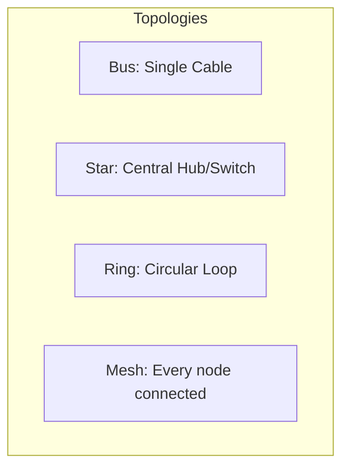

# Chapter 01 — Fundamentals of Networking — Computer Networking 🌐

*নেটওয়ার্কিং শিখতে হলে আগে এর ভিত্তি বুঝতে হবে। এই লেকচারে আমরা নেটওয়ার্কের গঠন, যোগাযোগের ধরন এবং ফিজিক্যাল মিডিয়া নিয়ে আলোচনা করব।*

---

# Topic 1: Network Topologies

*"নেটওয়ার্কের ডিভাইসগুলো একে অপরের সাথে কীভাবে যুক্ত থাকে, সেই নকশাকেই বলে টপোলজি"*

একটি নেটওয়ার্কের লেআউট বা নকশা হলো **Topology**। প্রধান টপোলজিগুলো হলো:

### 1.1 প্রধান টপোলজির বৈশিষ্ট্য
1. **Star Topology:** সবচেয়ে কমন। একটি কেন্দ্রীয় Switch থাকে। একটি ক্যাবল নষ্ট হলেও পুরো নেটওয়ার্ক সচল থাকে।
2. **Mesh Topology:** হাই সিকিউরিটি। প্রতিটি ডিভাইস সবার সাথে যুক্ত। সূত্র: $n(n-1)/2$ সংখ্যক তার লাগে।
3. **Bus Topology:** একটি মেইন ক্যাবল (Backbone) থাকে। খরচ কম কিন্তু মেইন তার নষ্ট হলে পুরো নেটওয়ার্ক ডাউন।

---

# Topic 2: Modes of Communication
ডেটা প্রবাহের দিকের ওপর ভিত্তি করে যোগাযোগ ৩ প্রকার:

- **Simplex:** শুধু একদিকে ডেটা যায়। উদাহরণ: TV, Radio।
- **Half-Duplex:** দুই দিকেই যায়, তবে একসাথে নয়। উদাহরণ: Walkie-Talkie।
- **Full-Duplex:** একই সাথে দুই দিকে ডেটা আদান-প্রদান সম্ভব। উদাহরণ: Mobile Phone।

---

# Topic 3: Transmission Media
ফিজিক্যাল মিডিয়া বা তার যার মাধ্যমে সিগন্যাল ট্রাভেল করে।

### 3.1 Twisted Pair Cable (Ethernet)
- **Category 5e:** 1 Gbps পর্যন্ত স্পিড।
- **Category 6:** 10 Gbps পর্যন্ত (কম দূরত্বে)।

### 3.2 Fiber Optic Cable
- **Single-mode:** অনেক দূর পর্যন্ত ডেটা নিতে পারে (Laser ব্যবহার হয়)।
- **Multi-mode:** কম দূরত্বের জন্য (LED ব্যবহার হয়)।

---

### 🔥 Job Exam Special (BPSC/Bank)
- **Shannon Capacity Formula:** $C = B \log_2(1 + S/N)$। যেখানে B হলো Bandwidth। এটি দিয়ে নয়েজ থাকা অবস্থায় ম্যাক্সিমাম ডাটা রেট বের করা হয়।
- **MAC Address:** এটি একটি 48-bit (6 bytes) ফিজিক্যাল অ্যাড্রেস।
- **Full-mesh formula:** $n$ টি নোডের জন্য কতটি লিংক লাগে? উত্তর: $n(n-1)/2$।

### ⚠️ Interview Traps
- **প্রশ্ন:** "একটি হাফ-ডুপ্লেক্স নেটওয়ার্কে কি কলিশন হতে পারে?" 
- **উত্তর:** হ্যাঁ, যেহেতু একই সাথে দুই দিক থেকে ডেটা পাঠালে ধাক্কা বা Collision হতে পারে।

---

### 🧠 Practice Zone

#### MCQ Drill
1. কোন টপোলজিতে সেন্ট্রাল সুইচ ব্যবহৃত হয়?
   - (ক) Bus (খ) Ring (গ) Star (ঘ) Mesh
   - **উত্তর: (গ) Star**
2. Walkie-Talkie কোন মোডে কাজ করে?
   - (ক) Simplex (খ) Half-duplex (গ) Full-duplex (ঘ) কোনটিই নয়
   - **উত্তর: (খ) Half-duplex**
3. মেস টপোলজিতে ১০টি কম্পিউটারের জন্য কয়টি লিংক লাগবে?
   - (ক) ১০ (খ) ২০ (গ) ৪৫ (ঘ) ৯০
   - **উত্তর: (গ) ৪৫** [সূত্র: $n(n-1)/2 \rightarrow 10(9)/2 = 45$]
4. ফাইবার অপটিক ক্যাবলে ডেটা কিসের মাধ্যমে যায়?
   - (ক) তামা (খ) বিদ্যুৎ (গ) আলো (ঘ) বাতাস
   - **উত্তর: (গ) আলো**
5. সিগন্যাল যখন একমুখী হয় তখন তাকে কী বলে?
   - (ক) Simplex (খ) Duplex (গ) Hybrid (ঘ) Serial
   - **উত্তর: (ক) Simplex**
6. ওএসআই মডেলের ফিজিক্যাল লেয়ারে ডেটার একক (PDU) কোনটি?
   - (ক) Frame (খ) Packet (গ) Segment (ঘ) Bits
   - **উত্তর: (ঘ) Bits**
7. সিগন্যালের কোয়ালিটি না হারিয়ে দূরত্ব বাড়ানোর জন্য কোন ডিভাইস ব্যবহৃত হয়?
   - (ক) Router (খ) Switch (গ) Repeater (ঘ) Hub
   - **উত্তর: (গ) Repeater**
8. টোকেন পাসিং (Token Passing) কোন টপোলজিতে দেখা যায়?
   - (ক) Ring (খ) Star (গ) Bus (ঘ) Mesh
   - **উত্তর: (ক) Ring**
9. নিচের কোনটি গাইডেড মিডিয়া (Guided Media)?
   - (ক) Radio wave (খ) Microwave (গ) Coaxial Cable (ঘ) Satellite
   - **উত্তর: (গ) Coaxial Cable**
10. ইথারনেট কানেকশনে সাধারণত কোন ক্যাবলটি বেশি ব্যবহৃত হয়?
    - (ক) Fiber Optic (খ) Twisted Pair (গ) Coaxial (ঘ) Serial
    - **উত্তর: (খ) Twisted Pair**

#### Written Challenge
1. ডায়াগ্রামসহ Star এবং Mesh টপোলজির তুলনা করো।
2. Shannon Capacity Formula কেন গুরুত্বপূর্ণ? এর একটি ছোট ম্যাথ উদাহরণ দাও।
3. **MAC Address এবং IP Address এর মধ্যে প্রধান পার্থক্যগুলো লিখুন। কোনটি কেন গুরুত্বপূর্ণ?**
4. **Network Topology বাছাই করার ক্ষেত্রে কোন ৩টি ফ্যাক্টর সবচেয়ে বেশি প্রভাব ফেলে এবং কেন?**
5. **Simplex এবং Half-duplex মোডের বাস্তব উদাহরণসহ বিস্তারিত ব্যাখ্যা দিন।**

---

### 🔥 Math Solve Zone (Step-by-Step)

**Problem: ক্যালকুলেট Shannon Capacity**
যদি একটি চ্যানলের ব্যান্ডউইডথ (Bandwidth) হয় 4kHz এবং Signal-to-Noise Ratio (SNR) হয় 15, তবে চ্যানেলের ম্যাক্সিমাম থ্রুপুট বের করুন।

**ধাপ ১: সূত্র নির্ধারণ**
শ্যানন ক্যাপাসিটি সূত্র: $C = B \log_2(1 + S/N)$

**ধাপ ২: মান বসানো**
$B = 4000$ Hz (যেহেতু 4kHz)
$S/N = 15$

**ধাপ ৩: ক্যালকুলেশন**
$C = 4000 \times \log_2(1 + 15)$
$C = 4000 \times \log_2(16)$
আমরা জানি, $16 = 2^4$; তাই $\log_2(16) = 4$
$C = 4000 \times 4 = 16000$ bps বা **16 kbps**.

**উত্তর: ১৬ কেলোবিট পার সেকেন্ড (16 kbps)**।

---

### 🏛️ BPSC/Bank Job Pattern Analysis
- **প্রশ্ন প্যাটার্ন:** বিপিএসসি এবং ব্যাংক পরীক্ষায় সাধারণত "OSI Layers vs TCP/IP" এবং "IP Class" থেকে বেশি প্রশ্ন আসে।
- **টিপস:** ল্যান (LAN) এবং ওয়্যান (WAN) এর পার্থক্য সবসময় মাথায় রাখবেন। সুইচ (Switch) একটি লেয়ার-২ এবং রাউটার (Router) একটি লেয়ার-৩ ডিভাইস — এটি ইন্টারভিউতে খুব বেশি জিজ্ঞাসা করা হয়।

