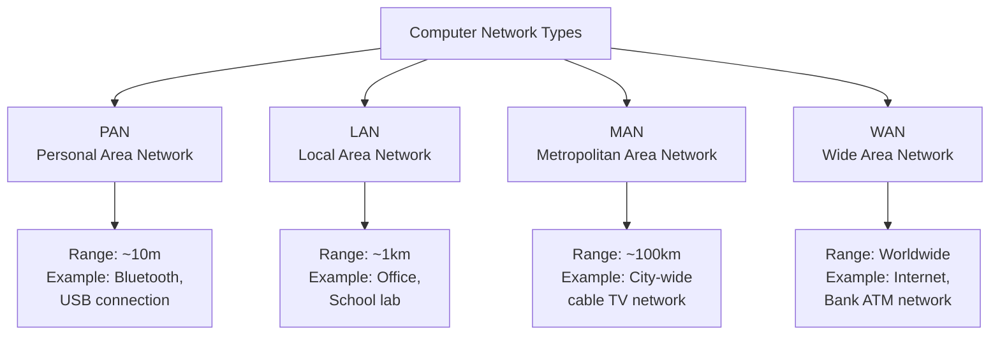
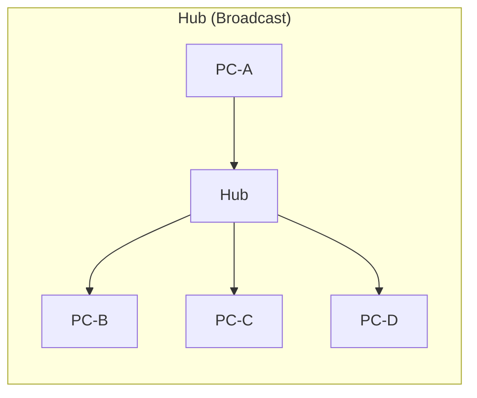
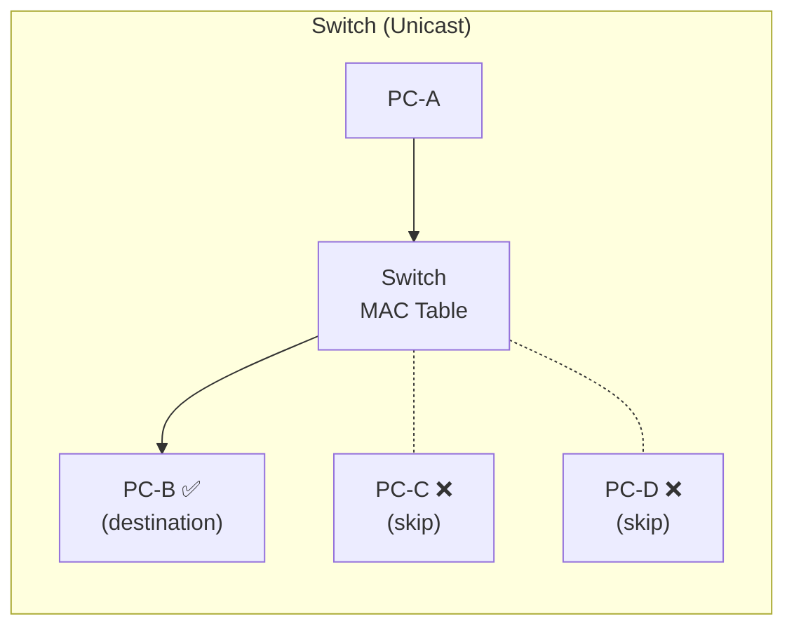
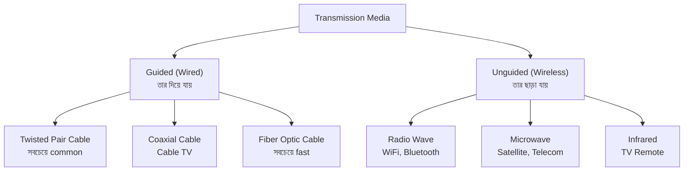
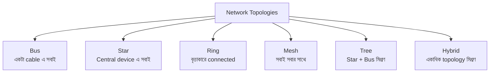
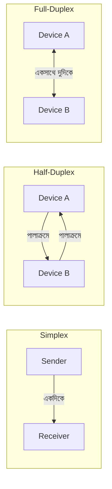

# Chapter 01 — Fundamentals — Computer Networking 🌐

> Network কী ও কেন, devices, transmission media, topologies, transmission modes।

---
# LEVEL 1: FUNDAMENTALS (মৌলিক ধারণা)

*Computer Networking এর মৌলিক ভিত্তি — এই অংশ না বুঝলে পরের কিছুই বোঝা যাবে না*


---
---

# Topic 1: Computer Network কী ও কেন

<div align="center">

*"দুই বা ততোধিক device যখন একে অপরের সাথে data আদান-প্রদান করতে পারে — সেটাই Network"*

</div>

---

## 📖 1.1 ধারণা (Concept)

**Computer Network** হলো দুই বা ততোধিক **computing device** এর সংযোগ যেখানে তারা নিজেদের মধ্যে **data, resource এবং information share** করতে পারে।

সহজ ভাষায় — আপনার বাসার WiFi তে phone, laptop, printer সব connected থাকে এবং একে অপরের সাথে communicate করতে পারে — এটাই একটা **network**।

### Network এর মূল উদ্দেশ্য

| উদ্দেশ্য | উদাহরণ |
|----------|--------|
| **Resource Sharing** | একটা printer অনেকগুলো computer share করে |
| **Data Communication** | Email, file transfer, video call |
| **Centralized Management** | Server থেকে সব কিছু control করা |
| **Cost Reduction** | প্রতিটি computer এ আলাদা printer না কিনে share করা |
| **Reliability** | Data backup রাখা multiple location এ |

### Network এর প্রকারভেদ (Types of Network)



### বিস্তারিত তুলনা

| বৈশিষ্ট্য | PAN | LAN | MAN | WAN |
|-----------|-----|-----|-----|-----|
| **Full Form** | Personal Area Network | Local Area Network | Metropolitan Area Network | Wide Area Network |
| **Range** | ~10 মিটার | ~1 কিলোমিটার | ~100 কিলোমিটার | সারা বিশ্ব |
| **Speed** | Low-Medium | High (1 Gbps+) | Medium-High | Low-Medium |
| **Owner** | Individual | Organization | ISP/Govt | Multiple entities |
| **Error Rate** | Very Low | Low | Medium | High |
| **Cost** | Very Low | Low | High | Very High |
| **Example** | Bluetooth headset | Office network | Cable TV in city | Internet |
| **Maintenance** | Easy | Easy | Moderate | Difficult |

### অন্যান্য Network Types

| Type | বিবরণ |
|------|-------|
| **CAN (Campus Area Network)** | University campus এর মধ্যে — multiple LAN connected |
| **SAN (Storage Area Network)** | শুধুমাত্র storage devices এর dedicated network |
| **VPN (Virtual Private Network)** | Public network এর উপর private, encrypted tunnel |
| **WLAN (Wireless LAN)** | WiFi based LAN — cable ছাড়া |

---

## 💻 1.2 Practical Examples

```
Real-world Network Examples:

🏠 Home Network (LAN/WLAN):
   Phone ──WiFi──┐
   Laptop ──WiFi──├── Router ──── ISP ──── Internet
   Smart TV ─WiFi─┘

🏢 Office Network (LAN):
   PC-1 ──┐                           ┌── File Server
   PC-2 ──├── Switch ── Router ──┬────├── Mail Server
   PC-3 ──┘                     │    └── Web Server
   Printer ─────────────────────┘

🌐 Internet (WAN):
   Dhaka Office ──ISP──┐
                       ├── Internet Backbone
   Chittagong Office ──┘
```

---

## ❓ 1.3 MCQ Problems

**Q1.** LAN এর সর্বোচ্চ range সাধারণত কত?

- (a) 10 মিটার
- (b) 100 মিটার
- (c) 1 কিলোমিটার ✅
- (d) 100 কিলোমিটার

> **ব্যাখ্যা:** LAN সাধারণত একটি building বা campus এর মধ্যে সীমাবদ্ধ, range প্রায় 1 km পর্যন্ত। 10m হলো PAN, 100km হলো MAN।

**Q2.** Internet কোন ধরনের network?

- (a) LAN
- (b) MAN
- (c) WAN ✅
- (d) PAN

> **ব্যাখ্যা:** Internet হলো সবচেয়ে বড় **WAN (Wide Area Network)** — সারা পৃথিবী জুড়ে বিস্তৃত।

**Q3.** Bluetooth কোন ধরনের network তৈরি করে?

- (a) LAN
- (b) PAN ✅
- (c) MAN
- (d) WAN

> **ব্যাখ্যা:** Bluetooth **Personal Area Network (PAN)** তৈরি করে — range মাত্র ~10 মিটার।

**Q4.** কোনটি LAN এ সবচেয়ে বেশি ব্যবহৃত হয়?

- (a) Coaxial cable
- (b) Fiber optic
- (c) Ethernet (UTP cable) ✅
- (d) Satellite

> **ব্যাখ্যা:** LAN এ **Ethernet (UTP/Cat5e/Cat6 cable)** সবচেয়ে বেশি ব্যবহৃত হয়। Fiber optic সাধারণত backbone বা WAN এ ব্যবহার হয়।

**Q5.** SAN এর পূর্ণরূপ কী?

- (a) Server Area Network
- (b) Storage Area Network ✅
- (c) Secure Area Network
- (d) System Area Network

> **ব্যাখ্যা:** **SAN = Storage Area Network** — এটা dedicated high-speed network যেটা শুধুমাত্র storage devices (disk array, tape library) কে server এর সাথে connect করে।

**Q6.** কোন network এর error rate সবচেয়ে বেশি?

- (a) PAN
- (b) LAN
- (c) MAN
- (d) WAN ✅

> **ব্যাখ্যা:** WAN এ data অনেক দূরত্ব অতিক্রম করে, অনেক device এবং medium এর মধ্য দিয়ে যায়, তাই **error rate সবচেয়ে বেশি**।

---

## ✍️ 1.4 Written Problems

**W1. LAN ও WAN এর মধ্যে ৫টি পার্থক্য লিখুন।**

| বিষয় | LAN | WAN |
|-------|-----|-----|
| **Range** | ছোট এলাকা (office/building) | বিশ্বব্যাপী |
| **Speed** | High (1-10 Gbps) | Low-Medium (কয়েক Mbps) |
| **Error Rate** | কম | বেশি |
| **Ownership** | একটি organization এর | Multiple organization/ISP |
| **Cost** | কম | অনেক বেশি |

**W2. Computer Network ব্যবহারের ৪টি সুবিধা ও ২টি অসুবিধা লিখুন।**

**সুবিধা:**
1. **Resource Sharing** — printer, scanner, internet connection একাধিক user share করতে পারে
2. **Communication** — email, video call, instant messaging সহজে সম্ভব
3. **Data Backup** — centralized server এ data backup রাখা যায়
4. **Cost Effective** — প্রতিটি computer এ আলাদা resource না কিনে share করা যায়

**অসুবিধা:**
1. **Security Risk** — network এ connected থাকলে hacking, virus attack এর সম্ভাবনা বাড়ে
2. **Setup Cost** — প্রাথমিক setup (cable, switch, router, server) এর খরচ বেশি

---

## ⚠️ 1.5 Tricky Parts

> ⚠️ **Trap 1:** "Internet কি LAN?" — **না**, Internet হলো **WAN**। অনেক LAN মিলে MAN, অনেক MAN মিলে WAN তৈরি হয়।

> ⚠️ **Trap 2:** "WiFi মানেই Internet?" — **না**, WiFi হলো wireless LAN technology। WiFi connected মানে Internet connected না — Router এ Internet connection না থাকলে WiFi তে শুধু local network কাজ করবে।

> ⚠️ **Trap 3:** MAN এবং WAN গুলিয়ে ফেলা — **MAN** হলো একটা **শহরের** মধ্যে (cable TV network), **WAN** হলো **দেশ/বিশ্ব** জুড়ে (Internet)।

---

## 📝 1.6 Summary

- **Computer Network** = দুই বা ততোধিক device connected হয়ে data share করা
- **PAN** = ব্যক্তিগত (~10m) — Bluetooth
- **LAN** = Local (~1km) — Office, School — **সবচেয়ে common**
- **MAN** = শহর (~100km) — Cable TV
- **WAN** = বিশ্বব্যাপী — **Internet হলো সবচেয়ে বড় WAN**
- **Speed:** LAN > MAN > WAN
- **Error Rate:** WAN > MAN > LAN
- **Cost:** WAN > MAN > LAN

---
---

# Topic 2: Network Devices

<div align="center">

*"Network এ data কিভাবে যাবে সেটা নির্ধারণ করে Network Devices — প্রতিটি device এর কাজ আলাদা"*

</div>

---

## 📖 2.1 ধারণা (Concept)

Network device গুলো হলো সেই hardware যেগুলো computer এবং অন্যান্য device কে **connect, manage এবং data route** করে। প্রতিটি device **OSI Model এর নির্দিষ্ট layer** এ কাজ করে।

### Network Devices এর শ্রেণীবিভাগ

```
Network Devices
├── Layer 1 (Physical)
│   ├── Hub          → সব port এ data পাঠায় (broadcast)
│   ├── Repeater     → signal strengthen করে
│   └── Modem        → analog ↔ digital convert করে
│
├── Layer 2 (Data Link)
│   ├── Switch       → MAC address দেখে নির্দিষ্ট port এ পাঠায়
│   ├── Bridge       → দুটো LAN segment connect করে
│   └── NIC          → Network Interface Card
│
├── Layer 3 (Network)
│   ├── Router       → IP address দেখে best path বের করে
│   └── Layer 3 Switch → routing + switching একসাথে
│
└── Multi-Layer
    ├── Gateway      → সম্পূর্ণ ভিন্ন network connect করে (protocol convert)
    ├── Firewall     → security — traffic filter করে
    └── Access Point → wireless devices কে wired network এ connect করে
```

### প্রতিটি Device বিস্তারিত

#### Hub (হাব) — Layer 1

**Hub** হলো সবচেয়ে সাধারণ networking device। এটা একটা port এ data পেলে **সব port এ** পাঠিয়ে দেয় (broadcasting)।

| বৈশিষ্ট্য | বিবরণ |
|-----------|-------|
| **Layer** | Physical (Layer 1) |
| **Intelligence** | না — কোন filtering নেই |
| **Data Sending** | সব port এ broadcast করে |
| **Collision** | বেশি — single collision domain |
| **Speed** | Shared bandwidth |
| **এখন ব্যবহার** | প্রায় বিলুপ্ত, Switch দ্বারা replaced |

**Hub এর প্রকার:**
- **Passive Hub** — শুধু signal pass করে, amplify করে না
- **Active Hub** — signal amplify করে pass করে
- **Intelligent Hub** — management features আছে

#### Switch (সুইচ) — Layer 2

**Switch** হলো Hub এর intelligent version। এটা **MAC address table** maintain করে এবং data শুধুমাত্র **destination port** এ পাঠায়।

| বৈশিষ্ট্য | বিবরণ |
|-----------|-------|
| **Layer** | Data Link (Layer 2) |
| **Intelligence** | হ্যাঁ — MAC address table দেখে |
| **Data Sending** | শুধু destination port এ (unicast) |
| **Collision** | কম — প্রতিটি port আলাদা collision domain |
| **Speed** | Dedicated bandwidth per port |
| **এখন ব্যবহার** | সবচেয়ে বেশি ব্যবহৃত LAN device |





#### Router (রাউটার) — Layer 3

**Router** হলো সবচেয়ে important networking device। এটা **IP address** দেখে **different network** এর মধ্যে data route করে। Router **best path** বের করতে **routing table** ব্যবহার করে।

| বৈশিষ্ট্য | বিবরণ |
|-----------|-------|
| **Layer** | Network (Layer 3) |
| **Uses** | IP address |
| **Function** | Different network এর মধ্যে routing |
| **Broadcast Domain** | আলাদা করে (blocks broadcast) |
| **Routing Table** | হ্যাঁ — best path decision |
| **NAT Support** | হ্যাঁ |

#### Gateway — Multi-Layer

**Gateway** হলো **"translator"** — সম্পূর্ণ ভিন্ন protocol ব্যবহার করে এমন দুটো network কে connect করে। যেমন: TCP/IP network কে SNA (IBM) network এর সাথে connect করা।

#### Modem — Layer 1

**Modem = MOdulator + DEModulator**

| Direction | কাজ |
|-----------|-----|
| **Sending** | Digital signal → Analog signal (Modulation) |
| **Receiving** | Analog signal → Digital signal (Demodulation) |

ISP এর telephone line (analog) কে আপনার computer এর digital data তে convert করে।

#### Bridge vs Switch

| বিষয় | Bridge | Switch |
|-------|--------|--------|
| **Ports** | 2-4 টি | 8-48+ টি |
| **Speed** | Slow (software-based) | Fast (hardware-based, ASIC) |
| **Processing** | Software | Hardware (ASIC chip) |
| **Use** | দুটো LAN segment connect | Multiple devices connect |
| **এখন** | Almost obsolete | Widely used |

### কোন Device কোন Layer এ — Master Table

| Device | OSI Layer | কী দেখে কাজ করে | Broadcast Domain | Collision Domain |
|--------|-----------|-----------------|-----------------|-----------------|
| **Hub** | 1 (Physical) | কিছু দেখে না, সব জায়গায় পাঠায় | 1 | 1 |
| **Repeater** | 1 (Physical) | কিছু না, signal boost করে | 1 | 1 |
| **Bridge** | 2 (Data Link) | MAC Address | 1 | Separate |
| **Switch** | 2 (Data Link) | MAC Address | 1 | Separate per port |
| **Router** | 3 (Network) | IP Address | Separate | Separate |
| **Gateway** | 7 (All Layers) | Protocol conversion | Separate | Separate |

---

## ❓ 2.2 MCQ Problems

**Q1.** Switch কোন Layer এ কাজ করে?

- (a) Physical Layer
- (b) Data Link Layer ✅
- (c) Network Layer
- (d) Transport Layer

> **ব্যাখ্যা:** Switch **Layer 2 (Data Link)** এ কাজ করে এবং **MAC address** দেখে data forward করে।

**Q2.** Hub ও Switch এর মূল পার্থক্য কী?

- (a) Hub বেশি port আছে
- (b) Switch MAC address দেখে specific port এ data পাঠায় ✅
- (c) Hub বেশি expensive
- (d) Switch wireless কাজ করে

> **ব্যাখ্যা:** Hub সব port এ **broadcast** করে, কিন্তু Switch **MAC address table** দেখে শুধু destination port এ **unicast** করে। এটাই মূল পার্থক্য।

**Q3.** Router কী দেখে data forward করে?

- (a) MAC Address
- (b) IP Address ✅
- (c) Port Number
- (d) Hostname

> **ব্যাখ্যা:** Router **Layer 3 (Network)** এ কাজ করে এবং **IP address** দেখে data route করে। MAC address দেখে Switch কাজ করে।

**Q4.** Modem এর পূর্ণরূপ কী?

- (a) Modern Electronic Machine
- (b) Modulator-Demodulator ✅
- (c) Modified Device Module
- (d) Module Decoder

> **ব্যাখ্যা:** **Modem = MOdulator + DEModulator**। এটা analog ↔ digital signal convert করে।

**Q5.** কোন device broadcast domain আলাদা করে?

- (a) Hub
- (b) Switch
- (c) Router ✅
- (d) Repeater

> **ব্যাখ্যা:** **Router** broadcast domain আলাদা করে। Hub ও Switch একই broadcast domain এ থাকে। Router broadcast traffic block করে, তাই আলাদা broadcast domain তৈরি হয়।

**Q6.** Gateway কোন layer এ কাজ করে?

- (a) Layer 1
- (b) Layer 2
- (c) Layer 3
- (d) All Layers (Layer 7) ✅

> **ব্যাখ্যা:** Gateway **সব layer** এ কাজ করে কারণ এটা complete **protocol conversion** করে — এক ধরনের network protocol কে অন্য ধরনে রূপান্তর করে।

---

## ✍️ 2.3 Written Problems

**W1. Hub ও Switch এর মধ্যে ৫টি পার্থক্য লিখুন।**

| বিষয় | Hub | Switch |
|-------|-----|--------|
| **Layer** | Layer 1 (Physical) | Layer 2 (Data Link) |
| **Intelligence** | Dumb device — কোন filtering নেই | Smart — MAC address table maintain করে |
| **Data Forwarding** | সব port এ broadcast | শুধু destination port এ unicast |
| **Collision** | Single collision domain — বেশি collision | Per-port collision domain — কম collision |
| **Bandwidth** | Shared — সবাই ভাগাভাগি | Dedicated — প্রতিটি port এ full speed |

**W2. Router ও Switch এর মধ্যে পার্থক্য লিখুন।**

| বিষয় | Switch | Router |
|-------|--------|--------|
| **Layer** | Layer 2 | Layer 3 |
| **Address** | MAC Address ব্যবহার করে | IP Address ব্যবহার করে |
| **Network** | Same network এর মধ্যে | Different network এর মধ্যে |
| **Broadcast** | Broadcast forward করে | Broadcast block করে |
| **Table** | MAC Address Table | Routing Table |

---

## ⚠️ 2.4 Tricky Parts

> ⚠️ **Trap 1:** "Switch কি Router এর কাজ করতে পারে?" — সাধারণ **Layer 2 Switch পারে না**। কিন্তু **Layer 3 Switch** routing করতে পারে। Exam এ specify না করলে Layer 2 Switch ধরতে হবে।

> ⚠️ **Trap 2:** "Gateway ও Router কি একই?" — **না**। Router শুধু **same protocol** এর different network connect করে (IP to IP)। Gateway **different protocol** convert করে (TCP/IP to SNA)। তবে কথ্য ভাষায় Router কে "default gateway" বলা হয়, সেটা ভিন্ন concept।

> ⚠️ **Trap 3:** "Hub কি এখনো ব্যবহার হয়?" — প্রায় **না**। Switch সম্পূর্ণভাবে Hub কে replace করেছে। কিন্তু exam এ Hub সম্পর্কে প্রশ্ন **প্রচুর** আসে।

---

## 📝 2.5 Summary

- **Hub** = Layer 1, broadcast, dumb, collision বেশি — **almost obsolete**
- **Switch** = Layer 2, MAC address দেখে, unicast, smart — **most used**
- **Router** = Layer 3, IP address দেখে, different network connect — **essential**
- **Bridge** = Layer 2, Switch এর আদিরূপ — **obsolete**
- **Gateway** = All layers, protocol conversion — **different protocol এর network connect**
- **Modem** = Modulator + Demodulator — analog ↔ digital
- **Router broadcast domain আলাদা করে**, Switch collision domain আলাদা করে

---
---

# Topic 3: Transmission Media

<div align="center">

*"Network এ data পরিবহনের মাধ্যম — cable হোক বা wireless, প্রতিটির বৈশিষ্ট্য আলাদা"*

</div>

---

## 📖 3.1 ধারণা (Concept)

**Transmission Media** হলো সেই physical path বা মাধ্যম যেটার মধ্য দিয়ে data এক device থেকে অন্য device এ travel করে।



### Guided Media (তার-ভিত্তিক)

#### 1. Twisted Pair Cable

দুটো insulated copper wire একসাথে পাকিয়ে (twist) তৈরি — **electromagnetic interference (EMI) কমাতে** twist করা হয়।

| Type | Full Form | Shield | Speed | Use |
|------|-----------|--------|-------|-----|
| **UTP** | Unshielded Twisted Pair | নেই | 1 Gbps (Cat6) | LAN — সবচেয়ে common |
| **STP** | Shielded Twisted Pair | আছে | 10 Gbps (Cat6a) | Noisy environment |

**Category (Cat) Comparison:**

| Category | Speed | Bandwidth | Use |
|----------|-------|-----------|-----|
| Cat5 | 100 Mbps | 100 MHz | পুরনো Ethernet |
| Cat5e | 1 Gbps | 100 MHz | বর্তমান LAN standard |
| Cat6 | 1 Gbps (10Gbps short) | 250 MHz | Modern office |
| Cat6a | 10 Gbps | 500 MHz | Data center |
| Cat7 | 10 Gbps | 600 MHz | High-performance |

#### 2. Coaxial Cable

কেন্দ্রে copper conductor, তারপর insulator, তারপর metallic shield, সবশেষে plastic jacket। **Cable TV** তে ব্যবহার হয়।

| বৈশিষ্ট্য | বিবরণ |
|-----------|-------|
| **Structure** | Central conductor + Insulator + Shield + Jacket |
| **Bandwidth** | Up to 1 GHz |
| **Noise Resistance** | ভালো (shield আছে) |
| **Use** | Cable TV, older Ethernet (10Base2, 10Base5) |

#### 3. Fiber Optic Cable

**আলোর pulse** (light signal) দিয়ে data পাঠায় — **সবচেয়ে দ্রুত এবং নির্ভরযোগ্য** transmission media।

| Type | Core Size | Light Source | Distance | Use |
|------|-----------|-------------|----------|-----|
| **Single-mode** | 8-10 µm | Laser | 100+ km | WAN, undersea cable |
| **Multi-mode** | 50-62.5 µm | LED | 2 km | LAN, data center |

**Fiber Optic এর সুবিধা:**
- ⚡ **অত্যন্ত দ্রুত** — 100 Gbps+
- 🔒 **Secure** — tap করা কঠিন
- 📏 **দূরপাল্লা** — 100+ km signal loss ছাড়া
- 🛡️ **EMI immune** — electromagnetic interference প্রভাবিত করে না

**Fiber Optic এর অসুবিধা:**
- 💰 ব্যয়বহুল
- 🔧 Installation কঠিন, বিশেষজ্ঞ লাগে
- 💪 ভঙ্গুর — বাঁকালে ভেঙে যেতে পারে

### Unguided Media (তারবিহীন)

| Type | Frequency | Range | Use | Obstacle |
|------|-----------|-------|-----|----------|
| **Radio Wave** | 3 KHz - 1 GHz | Long | WiFi, FM Radio, Bluetooth | দেয়াল ভেদ করতে পারে |
| **Microwave** | 1 GHz - 300 GHz | Line of sight | Satellite, mobile towers | দেয়াল ভেদ করতে পারে না |
| **Infrared** | 300 GHz - 400 THz | Very short | TV Remote, short range | দেয়াল ভেদ করতে পারে না |

### Master Comparison Table

| বৈশিষ্ট্য | Twisted Pair | Coaxial | Fiber Optic | Radio Wave |
|-----------|-------------|---------|-------------|------------|
| **Speed** | 1-10 Gbps | ~1 Gbps | 100+ Gbps | Variable |
| **Distance** | 100m | 500m | 100+ km | কয়েক km |
| **Cost** | সবচেয়ে কম | মাঝারি | সবচেয়ে বেশি | Medium |
| **EMI** | Affected | Less affected | Not affected | Affected |
| **Security** | Low | Medium | Very High | Low |
| **Installation** | Easy | Moderate | Difficult | Easy |

---

## ❓ 3.2 MCQ Problems

**Q1.** Fiber Optic cable এ data কিসের মাধ্যমে travel করে?

- (a) Electricity
- (b) Radio wave
- (c) Light ✅
- (d) Sound

> **ব্যাখ্যা:** Fiber Optic cable এ **light pulse (আলোর সংকেত)** দিয়ে data পাঠানো হয়। এটাই এত দ্রুত হওয়ার কারণ।

**Q2.** LAN এ সবচেয়ে বেশি কোন cable ব্যবহার হয়?

- (a) Coaxial
- (b) Fiber Optic
- (c) UTP (Unshielded Twisted Pair) ✅
- (d) STP

> **ব্যাখ্যা:** LAN এ **UTP cable (Cat5e/Cat6)** সবচেয়ে বেশি ব্যবহৃত হয় — সস্তা, install করা সহজ, এবং 1 Gbps speed দিতে পারে।

**Q3.** Twisted Pair cable এ তার কেন পাকানো (twist) থাকে?

- (a) বেশি data carry করতে
- (b) Electromagnetic Interference (EMI) কমাতে ✅
- (c) দেখতে সুন্দর করতে
- (d) cable কে flexible করতে

> **ব্যাখ্যা:** Twist করলে দুটো তারের electromagnetic field একে অপরকে cancel করে, ফলে **EMI/crosstalk কমে**। একে বলে **cancellation effect**।

**Q4.** কোনটি সবচেয়ে বেশি secure transmission media?

- (a) UTP
- (b) Coaxial
- (c) Fiber Optic ✅
- (d) Radio Wave

> **ব্যাখ্যা:** **Fiber Optic** সবচেয়ে secure — আলো দিয়ে data যায়, তাই wiretap করা প্রায় অসম্ভব। Copper cable এ electrical signal থাকায় tap করা সহজ।

**Q5.** Single-mode এবং Multi-mode fiber এর মধ্যে কোনটি দূরপাল্লায় ব্যবহৃত হয়?

- (a) Multi-mode
- (b) Single-mode ✅
- (c) দুটোই সমান
- (d) কোনোটিই না

> **ব্যাখ্যা:** **Single-mode** fiber এ laser ব্যবহার হয় এবং core অনেক চিকন (8-10µm), তাই signal দূরে (100+ km) যেতে পারে। Multi-mode সাধারণত 2 km পর্যন্ত।

---

## ⚠️ 3.3 Tricky Parts

> ⚠️ **Trap 1:** "UTP vs STP — কোনটা ভালো?" — STP বেশি shielded, কিন্তু **UTP বেশি ব্যবহৃত** কারণ সস্তা এবং বেশিরভাগ office environment এ STP এর দরকার হয় না।

> ⚠️ **Trap 2:** "Fiber Optic এ কোন ধরনের signal যায়?" — **Light signal (optical)**, electrical signal না। এটা exam এ গুলিয়ে দেয়।

> ⚠️ **Trap 3:** "Cat5 আর Cat5e কি same?" — **না**। Cat5 = 100 Mbps, Cat5e = **1 Gbps**। "e" মানে "enhanced"।

---

## 📝 3.4 Summary

- **Guided Media:** Twisted Pair (UTP/STP) → Coaxial → Fiber Optic
- **Unguided Media:** Radio Wave → Microwave → Infrared
- **LAN এ সবচেয়ে common:** UTP (Cat5e/Cat6)
- **সবচেয়ে fast ও secure:** Fiber Optic (light signal)
- **Twisted Pair এ twist করা হয়:** EMI কমাতে
- **Single-mode fiber:** Long distance (laser), **Multi-mode:** Short distance (LED)
- **Radio wave দেয়াল ভেদ করতে পারে**, Microwave ও Infrared পারে না

---
---

# Topic 4: Network Topologies & Architectures

<div align="center">

*"Network এ device গুলো কিভাবে সাজানো/connected — সেটাই Topology"*

</div>

---

## 📖 4.1 ধারণা (Concept)

**Network Topology** হলো network এ device (node) গুলো কিভাবে physically বা logically connected/arranged সেটার layout বা map।

**দুই ধরনের Topology:**
- **Physical Topology** — cable গুলো physically কিভাবে connected
- **Logical Topology** — data actually কিভাবে flow করে

### Topology Types



#### 1. Bus Topology

সব device একটা **single cable (backbone/bus)** এ connected। Data bus দিয়ে সবার কাছে যায়, যার address match করে সে receive করে।

```
    ┌─────┐  ┌─────┐  ┌─────┐  ┌─────┐
    │PC-1 │  │PC-2 │  │PC-3 │  │PC-4 │
    └──┬──┘  └──┬──┘  └──┬──┘  └──┬──┘
───────┴────────┴────────┴────────┴───────── Bus (Backbone Cable)
  Terminator                         Terminator
```

| সুবিধা | অসুবিধা |
|--------|---------|
| সহজ ও সস্তা | Backbone fail = পুরো network down |
| কম cable লাগে | Device বাড়লে performance কমে |
| ছোট network এ ভালো | Troubleshooting কঠিন |

#### 2. Star Topology

সব device একটা **central device (Hub/Switch)** এর সাথে connected। **সবচেয়ে বেশি ব্যবহৃত** topology।

```
         ┌─────┐
         │PC-1 │
         └──┬──┘
            │
┌─────┐  ┌──┴──┐  ┌─────┐
│PC-2 ├──┤Hub/ ├──┤PC-3 │
└─────┘  │Switch│  └─────┘
         └──┬──┘
            │
         ┌──┴──┐
         │PC-4 │
         └─────┘
```

| সুবিধা | অসুবিধা |
|--------|---------|
| একটা device fail হলে বাকিরা চলে | Central device fail = সব down |
| নতুন device যোগ করা সহজ | বেশি cable লাগে |
| Troubleshooting সহজ | Central device ব্যয়বহুল |

#### 3. Ring Topology

প্রতিটি device **পাশের device** এর সাথে connected হয়ে একটা **বৃত্ত (ring)** তৈরি করে। Data একদিকে (unidirectional) বা দুদিকে (bidirectional — dual ring) ঘোরে।

```
       ┌─────┐
       │PC-1 │
       └┬───┬┘
        │   │
   ┌────┘   └────┐
   │             │
┌──┴──┐      ┌───┴─┐
│PC-4 │      │PC-2 │
└──┬──┘      └───┬─┘
   │             │
   └────┐   ┌────┘
        │   │
       ┌┴───┴┐
       │PC-3 │
       └─────┘
```

| সুবিধা | অসুবিধা |
|--------|---------|
| Equal access — কোন collision নেই | একটা device/cable fail = পুরো ring down |
| Token passing এ predictable performance | নতুন device যোগ করলে ring ভাঙতে হয় |
| Heavy load এও ভালো perform করে | Troubleshooting কঠিন |

#### 4. Mesh Topology

প্রতিটি device **অন্য সব device** এর সাথে directly connected। **সবচেয়ে reliable** কিন্তু **সবচেয়ে ব্যয়বহুল**।

**Full Mesh:** প্রতিটি device সবার সাথে connected
**Partial Mesh:** কিছু device সবার সাথে, বাকিরা কিছু device এর সাথে

**Full Mesh এ cable সংখ্যার formula:**

```
Links = n(n-1)/2
যেখানে n = device সংখ্যা

Example: 5 টি device হলে = 5(5-1)/2 = 10 টি cable
```

| সুবিধা | অসুবিধা |
|--------|---------|
| সবচেয়ে reliable — redundant paths | সবচেয়ে বেশি cable ও cost |
| একটা link fail হলেও alternative আছে | Configuration complex |
| Security ভালো — dedicated links | Scalable না — device বাড়লে cable অনেক বাড়ে |

#### 5. Tree Topology (Hierarchical)

**Star + Bus** এর combination। একটা root node থেকে branches বের হয়।

#### 6. Hybrid Topology

দুই বা ততোধিক topology এর **combination**। বাস্তবে বেশিরভাগ বড় network **hybrid** topology ব্যবহার করে।

### Master Comparison Table

| বৈশিষ্ট্য | Bus | Star | Ring | Mesh |
|-----------|-----|------|------|------|
| **Cable** | কম | মাঝারি | মাঝারি | সবচেয়ে বেশি |
| **Cost** | কম | মাঝারি | মাঝারি | সবচেয়ে বেশি |
| **Performance** | Decreases with load | Good | Good | Best |
| **Reliability** | Low | Medium | Low | Very High |
| **Failure Impact** | Backbone fail = all down | Central fail = all down | One fail = all down | One fail = others work |
| **Scalability** | Limited | Easy | Difficult | Difficult |
| **Troubleshooting** | Hard | Easy | Hard | Easy |
| **Real Use** | Older networks | **Most common (LAN)** | Token Ring | WAN backbone, Internet |

### Network Architectures

| Architecture | বিবরণ | Example |
|-------------|-------|---------|
| **Client-Server** | একটা powerful server, বাকিরা client — server resource দেয় | Web browsing, Email |
| **Peer-to-Peer (P2P)** | সবাই সমান — যেকোনো device server ও client হতে পারে | BitTorrent, file sharing |

**Client-Server vs P2P:**

| বিষয় | Client-Server | Peer-to-Peer |
|-------|-------------|--------------|
| **Central Server** | হ্যাঁ | না |
| **Management** | সহজ (centralized) | কঠিন (decentralized) |
| **Security** | ভালো | দুর্বল |
| **Cost** | বেশি (server দরকার) | কম |
| **Scalability** | ভালো | সীমিত |
| **Example** | Website, Email | BitTorrent, Blockchain |

---

## ❓ 4.2 MCQ Problems

**Q1.** কোন topology তে central device fail হলে পুরো network down হয়?

- (a) Bus
- (b) Star ✅
- (c) Ring
- (d) Mesh

> **ব্যাখ্যা:** **Star topology** তে সব device central hub/switch এর সাথে connected। Central device fail হলে কেউ কারো সাথে communicate করতে পারে না।

**Q2.** Full Mesh topology তে 6 টি device থাকলে কতটি cable লাগবে?

- (a) 6
- (b) 12
- (c) 15 ✅
- (d) 30

> **ব্যাখ্যা:** Formula: **n(n-1)/2** = 6(6-1)/2 = 6×5/2 = **15**। এটা exam এ খুব common প্রশ্ন।

**Q3.** বর্তমানে LAN এ সবচেয়ে বেশি কোন topology ব্যবহৃত হয়?

- (a) Bus
- (b) Ring
- (c) Star ✅
- (d) Mesh

> **ব্যাখ্যা:** **Star topology** সবচেয়ে বেশি ব্যবহৃত কারণ — troubleshooting সহজ, নতুন device যোগ করা সহজ, এবং একটা device fail হলে বাকিরা চলতে থাকে।

**Q4.** BitTorrent কোন architecture ব্যবহার করে?

- (a) Client-Server
- (b) Peer-to-Peer ✅
- (c) Hybrid
- (d) Master-Slave

> **ব্যাখ্যা:** BitTorrent **P2P (Peer-to-Peer)** architecture ব্যবহার করে — প্রতিটি user একই সাথে file download ও upload করে, কোন central server নেই।

**Q5.** কোন topology সবচেয়ে reliable?

- (a) Bus
- (b) Star
- (c) Ring
- (d) Mesh ✅

> **ব্যাখ্যা:** **Mesh topology** সবচেয়ে reliable কারণ প্রতিটি device এর multiple path আছে। একটা path fail হলে alternative path দিয়ে data যায়।

---

## ⚠️ 4.3 Tricky Parts

> ⚠️ **Trap 1:** "Star topology তে একটা PC fail হলে কী হবে?" — **কিছুই না**, বাকিরা চলবে। কিন্তু **central switch fail** হলে সব down। Exam এ "device fail" বললে কোন device সেটা carefully পড়তে হবে।

> ⚠️ **Trap 2:** "Mesh topology formula" — **n(n-1)/2** মনে রাখতে হবে। Exam এ directly calculation দেয়। Port সংখ্যা: প্রতিটি device এ **(n-1)** port লাগবে।

> ⚠️ **Trap 3:** "Ring topology তে collision হয় কি?" — **না**, কারণ **Token Passing** mechanism ব্যবহার হয়। Token যার কাছে থাকে শুধু সে data পাঠাতে পারে।

---

## 📝 4.4 Summary

- **Bus** = একটা cable এ সবাই, সস্তা, backbone fail = সব down
- **Star** = Central device, **সবচেয়ে বেশি ব্যবহৃত**, central fail = সব down
- **Ring** = বৃত্তাকার, token passing, একটা fail = সব down
- **Mesh** = সবাই সবার সাথে, **সবচেয়ে reliable**, cable formula = **n(n-1)/2**
- **Tree** = Star + Bus combination
- **Hybrid** = Real-world তে এটাই ব্যবহার হয়
- **Client-Server** = centralized (web), **P2P** = decentralized (BitTorrent)

---
---

# Topic 5: Data Transmission Modes

<div align="center">

*"Data কোন direction এ যায় — একদিকে, দুদিকে পালাক্রমে, নাকি দুদিকে একসাথে?"*

</div>

---

## 📖 5.1 ধারণা (Concept)

**Data Transmission Mode** বলতে বোঝায় দুটো device এর মধ্যে data **কোন direction** এ flow করে।



### তিন ধরনের Transmission Mode

| Mode | Direction | একসাথে? | উদাহরণ |
|------|-----------|---------|--------|
| **Simplex** | একদিকে (Unidirectional) | - | Keyboard → CPU, TV broadcast |
| **Half-Duplex** | দুদিকে, পালাক্রমে | না, একবারে একদিকে | Walkie-talkie, হ্যালো বললে অপরপক্ষ শোনে |
| **Full-Duplex** | দুদিকে, একসাথে | হ্যাঁ, simultaneously | Telephone, Video call |

### Serial vs Parallel Transmission

| বৈশিষ্ট্য | Serial | Parallel |
|-----------|--------|----------|
| **Data Path** | একটা channel এ bit by bit | একাধিক channel এ multiple bits |
| **Speed** | ধীর (কিন্তু long distance এ reliable) | দ্রুত (short distance এ) |
| **Cable** | কম (1 wire) | বেশি (8+ wire) |
| **Cost** | কম | বেশি |
| **Distance** | Long distance | Short distance |
| **Example** | USB, Ethernet | Printer port (LPT), old IDE |

### Synchronous vs Asynchronous

| বৈশিষ্ট্য | Synchronous | Asynchronous |
|-----------|-------------|-------------|
| **Clock** | Shared clock signal | No shared clock |
| **Data Format** | Continuous stream (frame) | Character by character (start/stop bit) |
| **Speed** | দ্রুত | ধীর |
| **Overhead** | কম | বেশি (start/stop bit) |
| **Efficiency** | বেশি | কম |
| **Example** | HDLC, SDLC | UART, RS-232 |

---

## ❓ 5.2 MCQ Problems

**Q1.** Walkie-talkie কোন transmission mode ব্যবহার করে?

- (a) Simplex
- (b) Half-Duplex ✅
- (c) Full-Duplex
- (d) Multiplex

> **ব্যাখ্যা:** Walkie-talkie তে একজন কথা বলার সময় অন্যজন শুধু শুনতে পারে — **পালাক্রমে** দুদিকে যায়। এটাই **Half-Duplex**।

**Q2.** Telephone call কোন mode?

- (a) Simplex
- (b) Half-Duplex
- (c) Full-Duplex ✅
- (d) Simplex + Half-Duplex

> **ব্যাখ্যা:** Telephone এ দুজন **একসাথে কথা বলতে ও শুনতে পারে** — এটা **Full-Duplex**।

**Q3.** Keyboard থেকে CPU তে data কোন mode এ যায়?

- (a) Simplex ✅
- (b) Half-Duplex
- (c) Full-Duplex
- (d) Parallel

> **ব্যাখ্যা:** Keyboard থেকে data **শুধু CPU এর দিকে যায়**, CPU থেকে keyboard এ কিছু আসে না — এটা **Simplex (unidirectional)**।

**Q4.** Serial transmission এ data কিভাবে যায়?

- (a) একসাথে অনেক bit
- (b) একটা একটা bit করে (bit by bit) ✅
- (c) Byte by byte
- (d) Frame by frame

> **ব্যাখ্যা:** **Serial transmission** এ data **একটা bit করে** একটা single channel দিয়ে যায়। Parallel এ multiple bit একসাথে যায়।

**Q5.** Asynchronous transmission এ কোন extra bit যোগ হয়?

- (a) Parity bit only
- (b) Start ও Stop bit ✅
- (c) Checksum
- (d) Header bit

> **ব্যাখ্যা:** Asynchronous transmission এ প্রতিটি character এর আগে **start bit (0)** এবং পরে **stop bit (1)** যোগ হয় — যেন receiver বুঝতে পারে কখন data শুরু এবং শেষ।

---

## ⚠️ 5.3 Tricky Parts

> ⚠️ **Trap 1:** "Half-Duplex এ কি দুদিকে data যায়?" — **হ্যাঁ**, কিন্তু **একসাথে না, পালাক্রমে**। অনেকে "দুদিকে" শুনে Full-Duplex ভাবে।

> ⚠️ **Trap 2:** "Serial কি সবসময় Parallel এর চেয়ে ধীর?" — Short distance এ Parallel দ্রুত। কিন্তু **long distance এ Serial বেশি reliable** কারণ parallel এ wire গুলোর মধ্যে timing skew হয়। Modern USB (serial) অনেক পুরনো parallel port এর চেয়ে দ্রুত।

---

## 📝 5.4 Summary

- **Simplex** = একদিকে (Keyboard, TV)
- **Half-Duplex** = দুদিকে পালাক্রমে (Walkie-talkie)
- **Full-Duplex** = দুদিকে একসাথে (Telephone, Ethernet)
- **Serial** = bit by bit, long distance, কম cable (USB, Ethernet)
- **Parallel** = multiple bits, short distance, বেশি cable (old printer port)
- **Synchronous** = continuous stream, shared clock, efficient
- **Asynchronous** = start/stop bit, no shared clock, less efficient

---

> **Level 1 সম্পূর্ণ!** 🎉 এখন আপনি Computer Network এর মৌলিক ধারণা — types, devices, media, topology এবং transmission modes সম্পর্কে জানেন।

---
---


---

## 🔗 Navigation

- 🏠 Back to [Computer Networking — Master Index](00-master-index.md)
- ➡️ Next: [Chapter 02 — OSI & TCP/IP Models](02-osi-tcp-ip-models.md)
