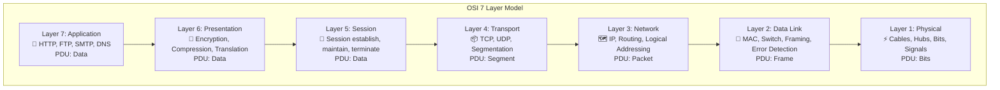
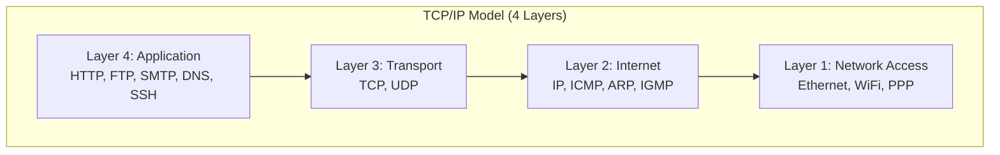
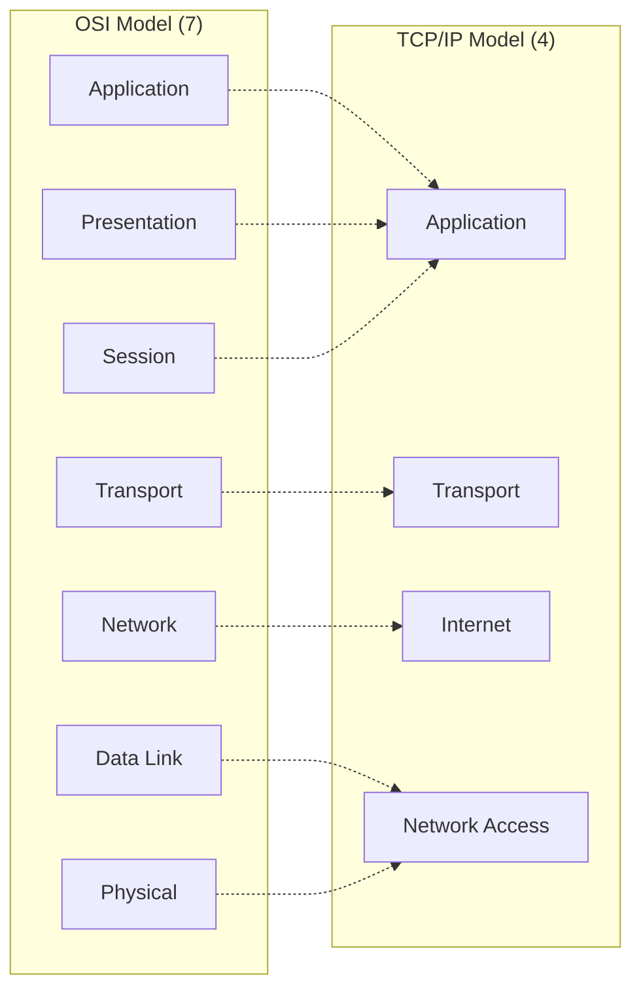
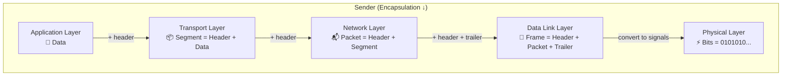

# Chapter 02 — OSI & TCP/IP Models — Computer Networking 🌐

> OSI 7-layer, TCP/IP 4-layer, encapsulation/decapsulation।

---
# LEVEL 2: OSI & TCP/IP MODEL (রেফারেন্স মডেল)

*Networking এর সবচেয়ে গুরুত্বপূর্ণ concept — প্রতিটি পরীক্ষায় আসবেই*


---
---

# Topic 6: OSI Model

<div align="center">

*"OSI Model হলো networking এর blueprint — 7 টি layer এ সব কিছু ভাগ করা"*

</div>

---

## 📖 6.1 ধারণা (Concept)

**OSI (Open Systems Interconnection) Model** হলো **ISO (International Organization for Standardization)** কর্তৃক তৈরি একটা **7-layer reference model** যেটা বর্ণনা করে network এ data কিভাবে এক device থেকে অন্য device এ পৌঁছায়।

> ⚠️ OSI Model একটা **theoretical/reference model** — বাস্তবে আমরা **TCP/IP model** ব্যবহার করি। কিন্তু networking বোঝার জন্য OSI Model **অপরিহার্য** এবং **exam এ সবচেয়ে বেশি প্রশ্ন** এখান থেকেই আসে।

### 7 Layers মনে রাখার Trick

```
🔝 Layer 7: Application      ─┐
   Layer 6: Presentation      │ Upper Layers
   Layer 5: Session           ─┘ (Software)
   ─────────────────────────
   Layer 4: Transport         ── Heart of OSI
   ─────────────────────────
   Layer 3: Network           ─┐
   Layer 2: Data Link          │ Lower Layers
🔽 Layer 1: Physical          ─┘ (Hardware)
```

**মনে রাখার সূত্র (উপর থেকে নিচে):**

> **A**ll **P**eople **S**eem **T**o **N**eed **D**ata **P**rocessing
>
> **A**pplication → **P**resentation → **S**ession → **T**ransport → **N**etwork → **D**ata Link → **P**hysical

**নিচে থেকে উপরে:**

> **P**lease **D**o **N**ot **T**hrow **S**ausage **P**izza **A**way

### প্রতিটি Layer বিস্তারিত



---

### Layer 7: Application Layer

**User এর সবচেয়ে কাছের layer** — end-user applications network access করে এই layer দিয়ে।

| বিষয় | বিবরণ |
|-------|-------|
| **কাজ** | Network services provide করে user applications কে |
| **PDU** | Data |
| **Protocols** | HTTP, HTTPS, FTP, SMTP, POP3, IMAP, DNS, DHCP, Telnet, SSH, SNMP |
| **Example** | Browser, Email client, File transfer |

> ⚠️ **গুরুত্বপূর্ণ:** Application Layer মানে **application নিজে না**। Chrome browser হলো application, কিন্তু Chrome যখন HTTP protocol ব্যবহার করে server এ request পাঠায় — সেই **HTTP protocol টা** Application Layer এ কাজ করে।

---

### Layer 6: Presentation Layer

**Data র "translator"** — data কে এমন format এ রূপান্তর করে যেটা application বুঝতে পারে।

| বিষয় | বিবরণ |
|-------|-------|
| **কাজ** | Translation, Encryption/Decryption, Compression/Decompression |
| **PDU** | Data |
| **Protocols/Standards** | SSL/TLS (encryption), JPEG, GIF, PNG (image), MPEG (video), ASCII, Unicode |

**তিনটি মূল কাজ:**

```
1. Translation    → EBCDIC ↔ ASCII রূপান্তর
2. Encryption     → Data encrypt/decrypt করা (SSL/TLS)
3. Compression    → Data ছোট করা (JPEG, ZIP)
```

---

### Layer 5: Session Layer

**Communication session manage** করে — শুরু, চালিয়ে যাওয়া, এবং শেষ করা।

| বিষয় | বিবরণ |
|-------|-------|
| **কাজ** | Session establishment, maintenance, termination, synchronization |
| **PDU** | Data |
| **Protocols** | NetBIOS, PPTP, RPC, SQL sessions |
| **Example** | Login session, video call session |

**Session Layer এর কাজ:**
- **Dialog Control** — কে কখন data পাঠাবে (half-duplex/full-duplex)
- **Synchronization** — Checkpoint রাখে, connection ভাঙলে আবার checkpoint থেকে শুরু করে
- **Session Recovery** — 100MB file download করতে গিয়ে 80MB তে connection ভাঙলে, আবার 80MB থেকে শুরু করে (0 থেকে না)

---

### Layer 4: Transport Layer

**"Heart of OSI Model"** — end-to-end reliable data delivery নিশ্চিত করে।

| বিষয় | বিবরণ |
|-------|-------|
| **কাজ** | Segmentation, Flow Control, Error Control, End-to-end delivery |
| **PDU** | Segment (TCP) / Datagram (UDP) |
| **Protocols** | TCP, UDP |
| **Addressing** | Port Number |
| **Device** | Firewall (some) |

**Transport Layer এর কাজ:**

```
1. Segmentation     → বড় data কে ছোট ছোট segment এ ভাগ করে
2. Reassembly       → Receiver end এ segment গুলো আবার জোড়া লাগায়
3. Flow Control     → Receiver এর capacity অনুযায়ী data পাঠানোর speed control
4. Error Control    → Segment হারিয়ে গেলে বা corrupt হলে retransmit
5. Multiplexing     → Port number দিয়ে একাধিক application এর data আলাদা করে
```

---

### Layer 3: Network Layer

**Logical addressing (IP) এবং routing** — source থেকে destination পর্যন্ত **best path** বের করে।

| বিষয় | বিবরণ |
|-------|-------|
| **কাজ** | Logical Addressing (IP), Routing, Packet forwarding |
| **PDU** | Packet |
| **Protocols** | IP (IPv4, IPv6), ICMP, ARP, RARP, IGMP |
| **Addressing** | IP Address |
| **Device** | Router, Layer 3 Switch |

---

### Layer 2: Data Link Layer

**Physical addressing (MAC) এবং framing** — same network এর মধ্যে node-to-node data delivery।

| বিষয় | বিবরণ |
|-------|-------|
| **কাজ** | Framing, Physical Addressing (MAC), Error Detection, Flow Control |
| **PDU** | Frame |
| **Protocols** | Ethernet, PPP, HDLC, Wi-Fi (802.11) |
| **Addressing** | MAC Address (48-bit) |
| **Device** | Switch, Bridge |

**দুটি Sub-layer:**

| Sub-layer | Full Form | কাজ |
|-----------|-----------|-----|
| **LLC** | Logical Link Control | Flow control, error detection, multiplexing |
| **MAC** | Media Access Control | Physical addressing, media access (CSMA/CD) |

---

### Layer 1: Physical Layer

**Bits কে physical signal এ রূপান্তর** — electrical, optical, বা radio signal।

| বিষয় | বিবরণ |
|-------|-------|
| **কাজ** | Bit transmission, signal encoding, physical connections |
| **PDU** | Bits (0 and 1) |
| **Standards** | RS-232, RJ-45, V.35, DSL |
| **Device** | Hub, Repeater, Modem, Cables |
| **Concern** | Voltage levels, cable specifications, pin layout, data rates |

---

### OSI Layer Master Table (Exam এর জন্য সবচেয়ে গুরুত্বপূর্ণ)

| Layer | নাম | PDU | Protocol Examples | Device | Addressing |
|:---:|------|-----|-------------------|--------|-----------|
| 7 | Application | Data | HTTP, FTP, SMTP, DNS | - | - |
| 6 | Presentation | Data | SSL/TLS, JPEG, MPEG | - | - |
| 5 | Session | Data | NetBIOS, RPC | - | - |
| 4 | Transport | Segment | TCP, UDP | Firewall | Port Number |
| 3 | Network | Packet | IP, ICMP, ARP | Router | IP Address |
| 2 | Data Link | Frame | Ethernet, PPP, WiFi | Switch, Bridge | MAC Address |
| 1 | Physical | Bits | RS-232, RJ-45 | Hub, Repeater | - |

---

## ❓ 6.2 MCQ Problems

**Q1.** OSI Model এ কতটি layer আছে?

- (a) 4
- (b) 5
- (c) 7 ✅
- (d) 6

> **ব্যাখ্যা:** OSI Model এ **7 টি layer** আছে — Physical, Data Link, Network, Transport, Session, Presentation, Application।

**Q2.** Router কোন layer এ কাজ করে?

- (a) Layer 1
- (b) Layer 2
- (c) Layer 3 ✅
- (d) Layer 4

> **ব্যাখ্যা:** Router **Layer 3 (Network Layer)** এ কাজ করে — IP address দেখে packet route করে।

**Q3.** TCP কোন layer এর protocol?

- (a) Application
- (b) Network
- (c) Transport ✅
- (d) Data Link

> **ব্যাখ্যা:** TCP হলো **Layer 4 (Transport Layer)** এর protocol — reliable, connection-oriented data delivery করে।

**Q4.** MAC Address কোন layer এ ব্যবহৃত হয়?

- (a) Physical Layer
- (b) Data Link Layer ✅
- (c) Network Layer
- (d) Transport Layer

> **ব্যাখ্যা:** **MAC Address** হলো **Layer 2 (Data Link Layer)** এর physical addressing। Switch MAC address দেখে frame forward করে।

**Q5.** OSI Model এ কোন layer কে "Heart of OSI" বলা হয়?

- (a) Network Layer
- (b) Transport Layer ✅
- (c) Session Layer
- (d) Application Layer

> **ব্যাখ্যা:** **Transport Layer (Layer 4)** কে "Heart of OSI" বলা হয় কারণ এটা end-to-end reliable delivery নিশ্চিত করে, segmentation করে, error ও flow control করে।

**Q6.** Data Link Layer এর দুটি sub-layer কী কী?

- (a) TCP ও UDP
- (b) LLC ও MAC ✅
- (c) IP ও ICMP
- (d) HTTP ও FTP

> **ব্যাখ্যা:** Data Link Layer দুটি sub-layer এ বিভক্ত — **LLC (Logical Link Control)** এবং **MAC (Media Access Control)**।

**Q7.** Presentation Layer এর কাজ কোনটি?

- (a) Routing
- (b) Session management
- (c) Encryption ও Data translation ✅
- (d) Bit transmission

> **ব্যাখ্যা:** **Presentation Layer (Layer 6)** — Translation (format convert), Encryption/Decryption, এবং Compression/Decompression করে।

**Q8.** কোন layer packet তৈরি করে?

- (a) Transport Layer
- (b) Network Layer ✅
- (c) Data Link Layer
- (d) Physical Layer

> **ব্যাখ্যা:** **Network Layer (Layer 3)** — PDU হলো **Packet**। Transport Layer এর PDU = Segment, Data Link = Frame, Physical = Bits।

---

## ✍️ 6.3 Written Problems

**W1. OSI Model এর প্রতিটি layer এর নাম, PDU এবং একটি করে protocol লিখুন।**

| Layer | নাম | PDU | Protocol |
|:---:|------|-----|----------|
| 7 | Application | Data | HTTP |
| 6 | Presentation | Data | SSL/TLS |
| 5 | Session | Data | NetBIOS |
| 4 | Transport | Segment | TCP |
| 3 | Network | Packet | IP |
| 2 | Data Link | Frame | Ethernet |
| 1 | Physical | Bits | RS-232 |

**W2. Transport Layer ও Network Layer এর মধ্যে পার্থক্য লিখুন।**

| বিষয় | Transport Layer (L4) | Network Layer (L3) |
|-------|---------------------|-------------------|
| **PDU** | Segment | Packet |
| **Addressing** | Port Number | IP Address |
| **Delivery** | End-to-end (process to process) | Host-to-host |
| **Protocol** | TCP, UDP | IP, ICMP |
| **Device** | - | Router |
| **Responsibility** | Reliable delivery, flow control | Routing, logical addressing |

---

## ⚠️ 6.4 Tricky Parts

> ⚠️ **Trap 1:** "Application Layer কি application?" — **না**। Chrome browser হলো application। Chrome যে **HTTP protocol** ব্যবহার করে সেটা Application Layer এ কাজ করে। Layer ≠ Software।

> ⚠️ **Trap 2:** "ARP কোন layer?" — **Network Layer (L3)**। কিন্তু ARP MAC address (L2) resolve করে। তাই কেউ কেউ বলে L2, কেউ বলে L2.5। Exam এ **Layer 3** বলাই safe।

> ⚠️ **Trap 3:** PDU গুলিয়ে ফেলা — মনে রাখুন: **Data → Segment → Packet → Frame → Bits** (উপর থেকে নিচে)। "`D-S-P-F-B`" = "**D**on't **S**ome **P**eople **F**orget **B**irthdays"

> ⚠️ **Trap 4:** "OSI Model কি বাস্তবে ব্যবহৃত হয়?" — **না**, বাস্তবে **TCP/IP Model** ব্যবহৃত হয়। OSI হলো **reference/theoretical model** — networking বুঝতে ব্যবহৃত হয়।

---

## 📝 6.5 Summary

- **OSI = 7 Layer** — ISO তৈরি করেছে, theoretical model
- **মনে রাখার সূত্র:** "All People Seem To Need Data Processing"
- **PDU:** Data → Segment → Packet → Frame → Bits
- **Layer 7 (Application):** HTTP, FTP, DNS — user এর কাছের layer
- **Layer 4 (Transport):** TCP/UDP — "Heart of OSI", port number
- **Layer 3 (Network):** IP, routing — Router কাজ করে
- **Layer 2 (Data Link):** MAC, framing — Switch কাজ করে, LLC + MAC sub-layer
- **Layer 1 (Physical):** Bits, signals — Hub, cable

---
---

# Topic 7: TCP/IP Model

<div align="center">

*"TCP/IP হলো Internet এর ভিত্তি — বাস্তবে এটাই ব্যবহৃত হয়"*

</div>

---

## 📖 7.1 ধারণা (Concept)

**TCP/IP (Transmission Control Protocol / Internet Protocol)** Model হলো **4-layer practical model** যেটা **Internet এর backbone**। OSI Model theoretical হলেও TCP/IP Model **বাস্তবে ব্যবহৃত** হয়।

**DoD (Department of Defense)** এই model তৈরি করেছে।

### TCP/IP এর 4 Layers



### OSI vs TCP/IP — সবচেয়ে গুরুত্বপূর্ণ Comparison



| বিষয় | OSI Model | TCP/IP Model |
|-------|-----------|-------------|
| **Layers** | 7 | 4 |
| **Developed by** | ISO | DoD (DARPA) |
| **Type** | Theoretical/Reference | Practical/Implementation |
| **Approach** | Protocol independent | Protocol dependent |
| **Transport** | Connection-oriented only | Both (TCP + UDP) |
| **Used in** | Teaching, reference | Real-world Internet |
| **Session + Presentation** | আলাদা layer | Application layer এ merged |
| **Data Link + Physical** | আলাদা layer | Network Access layer এ merged |

### TCP/IP প্রতিটি Layer বিস্তারিত

#### Layer 4: Application Layer (OSI Layer 5+6+7)

OSI Model এর Application, Presentation, Session — এই **তিনটি layer মিলিয়ে** TCP/IP তে একটি Application Layer।

| Protocol | Port | কাজ |
|----------|------|-----|
| HTTP | 80 | Web page access |
| HTTPS | 443 | Secure web |
| FTP | 20/21 | File transfer |
| SSH | 22 | Secure remote login |
| Telnet | 23 | Remote login (insecure) |
| SMTP | 25 | Email send |
| DNS | 53 | Domain → IP resolve |
| DHCP | 67/68 | Auto IP assign |
| POP3 | 110 | Email receive |
| IMAP | 143 | Email receive (advanced) |
| SNMP | 161 | Network monitoring |

#### Layer 3: Transport Layer

OSI Layer 4 এর সমতুল্য।

| Protocol | Type | কখন ব্যবহার |
|----------|------|-------------|
| **TCP** | Connection-oriented, reliable | Web, email, file transfer — যেখানে data loss acceptable না |
| **UDP** | Connectionless, unreliable | Video streaming, gaming, DNS — যেখানে speed বেশি important |

#### Layer 2: Internet Layer (OSI Layer 3)

| Protocol | কাজ |
|----------|-----|
| **IP** | Logical addressing ও routing |
| **ICMP** | Error reporting, ping, traceroute |
| **ARP** | IP → MAC address resolve |
| **IGMP** | Multicast group management |

#### Layer 1: Network Access Layer (OSI Layer 1+2)

Physical ও Data Link layer মিলিয়ে একটা layer। Hardware, cables, MAC addressing, framing সব এখানে।

| Protocol/Standard | কাজ |
|-------------------|-----|
| **Ethernet (802.3)** | Wired LAN |
| **Wi-Fi (802.11)** | Wireless LAN |
| **PPP** | Point-to-Point Protocol (WAN) |
| **ARP** | কেউ কেউ এটাকে এই layer এও রাখে |

---

## ❓ 7.2 MCQ Problems

**Q1.** TCP/IP Model এ কতটি layer আছে?

- (a) 3
- (b) 4 ✅
- (c) 5
- (d) 7

> **ব্যাখ্যা:** TCP/IP Model এ **4 টি layer** — Network Access, Internet, Transport, Application।

**Q2.** OSI Model এর কোন তিনটি layer TCP/IP এর Application layer এ merge হয়েছে?

- (a) Physical, Data Link, Network
- (b) Application, Presentation, Session ✅
- (c) Transport, Network, Data Link
- (d) Session, Transport, Network

> **ব্যাখ্যা:** OSI এর **Application (L7) + Presentation (L6) + Session (L5)** = TCP/IP এর **Application Layer**।

**Q3.** TCP/IP Model কে কোন সংস্থা তৈরি করেছে?

- (a) ISO
- (b) IEEE
- (c) DoD (DARPA) ✅
- (d) ITU

> **ব্যাখ্যা:** **DoD (Department of Defense)** এর গবেষণা সংস্থা **DARPA** TCP/IP model তৈরি করেছে। OSI model তৈরি করেছে **ISO**।

**Q4.** TCP/IP Model এর Internet Layer, OSI Model এর কোন layer এর সমতুল্য?

- (a) Transport Layer
- (b) Network Layer ✅
- (c) Data Link Layer
- (d) Session Layer

> **ব্যাখ্যা:** TCP/IP এর **Internet Layer** = OSI এর **Network Layer (L3)**। দুটোতেই IP, ICMP, routing কাজ করে।

**Q5.** কোনটি TCP/IP Model এর বৈশিষ্ট্য?

- (a) 7 টি layer আছে
- (b) ISO তৈরি করেছে
- (c) বাস্তবে ব্যবহৃত হয় ✅
- (d) Theoretical model

> **ব্যাখ্যা:** TCP/IP Model **বাস্তবে ব্যবহৃত (practical)** model — Internet এটার উপর based। OSI হলো theoretical/reference model।

---

## ⚠️ 7.3 Tricky Parts

> ⚠️ **Trap 1:** "TCP/IP Model এ 4 না 5 layer?" — Original TCP/IP তে **4 layer**। কিছু textbook **5 layer** দেখায় (Network Access কে Physical + Data Link আলাদা করে)। Exam এ specific না বললে **4 layer** ধরুন।

> ⚠️ **Trap 2:** "OSI Model বাস্তবে ব্যবহৃত হয়?" — **না**। OSI শুধু **reference/teaching purpose**। বাস্তবে **TCP/IP** ব্যবহৃত হয়। Exam এ জিজ্ঞেস করতে পারে "Which model is used in real Internet?"

> ⚠️ **Trap 3:** "ARP কোন layer?" — TCP/IP Model এ ARP কে কেউ **Internet Layer** এ, কেউ **Network Access Layer** এ রাখে। Exam এ সাধারণত **Internet/Network Layer** বলাই safe।

---

## 📝 7.4 Summary

- **TCP/IP = 4 Layer** — Application, Transport, Internet, Network Access
- **DoD/DARPA** তৈরি করেছে — **বাস্তবে ব্যবহৃত** model
- OSI এর L5+L6+L7 = TCP/IP এর **Application**
- OSI এর L1+L2 = TCP/IP এর **Network Access**
- **Internet Layer = Network Layer** (IP, ICMP, ARP)
- OSI = **theoretical**, TCP/IP = **practical**

---
---

# Topic 8: Data Encapsulation & Decapsulation

<div align="center">

*"Data পাঠানোর সময় প্রতিটি layer নিজের header যোগ করে — এটাই Encapsulation"*

</div>

---

## 📖 8.1 ধারণা (Concept)

**Encapsulation** হলো সেই process যেখানে data এক layer থেকে নিচের layer এ যাওয়ার সময় প্রতিটি layer নিজের **header (এবং কখনো trailer)** যোগ করে। Receiver end এ উল্টো process হয় — **Decapsulation**।



### Encapsulation Step-by-Step

```
Application Layer:  [          DATA          ]
                             ↓ + TCP/UDP Header
Transport Layer:    [TCP HDR][     DATA      ]  ← Segment
                             ↓ + IP Header
Network Layer:      [IP HDR][TCP HDR][ DATA  ]  ← Packet
                             ↓ + MAC Header + Trailer (FCS)
Data Link Layer:    [MAC HDR][IP][TCP][ DATA ][FCS]  ← Frame
                             ↓ Convert to electrical/optical signals
Physical Layer:     01010011101001010101...    ← Bits
```

### PDU (Protocol Data Unit) প্রতিটি Layer এ

| Layer | PDU নাম | কী যোগ হয় |
|:---:|---------|----------|
| Application/Presentation/Session | **Data** | User data |
| Transport | **Segment** (TCP) / **Datagram** (UDP) | Source/Destination Port |
| Network | **Packet** | Source/Destination IP Address |
| Data Link | **Frame** | Source/Destination MAC + FCS Trailer |
| Physical | **Bits** | Electrical/optical signals |

### Decapsulation (Receiver End)

Receiver end এ **উল্টো process** হয় — প্রতিটি layer নিজের header পড়ে remove করে এবং উপরের layer কে data দেয়।

```
Physical:    01010011101001010101... → bits receive
                    ↓ remove MAC header/trailer
Data Link:   [MAC HDR][IP][TCP][ DATA ][FCS] → Frame check
                    ↓ remove IP header
Network:     [IP HDR][TCP HDR][ DATA ] → Route/deliver
                    ↓ remove TCP header
Transport:   [TCP HDR][ DATA ] → Reassemble
                    ↓
Application: [ DATA ] → User দেখে
```

---

## ❓ 8.2 MCQ Problems

**Q1.** Network Layer এ data এর PDU কে কী বলে?

- (a) Segment
- (b) Frame
- (c) Packet ✅
- (d) Bits

> **ব্যাখ্যা:** Network Layer (L3) এর PDU = **Packet**। Transport = Segment, Data Link = Frame, Physical = Bits।

**Q2.** Encapsulation process এ কোন layer সবার শেষে header যোগ করে?

- (a) Application Layer
- (b) Transport Layer
- (c) Network Layer
- (d) Data Link Layer ✅

> **ব্যাখ্যা:** Encapsulation উপর থেকে নিচে যায়। **Data Link Layer** সবার শেষে MAC header ও FCS trailer যোগ করে frame তৈরি করে। Physical Layer শুধু bits এ convert করে, header যোগ করে না।

**Q3.** Frame এর শেষে কোন trailer যোগ হয়?

- (a) IP checksum
- (b) TCP checksum
- (c) FCS (Frame Check Sequence) ✅
- (d) CRC header

> **ব্যাখ্যা:** Data Link Layer **FCS (Frame Check Sequence)** trailer যোগ করে — error detection এর জন্য। FCS সাধারণত **CRC (Cyclic Redundancy Check)** algorithm ব্যবহার করে।

**Q4.** Decapsulation কোন end এ হয়?

- (a) Sender
- (b) Receiver ✅
- (c) Router
- (d) Switch

> **ব্যাখ্যা:** **Decapsulation** হলো Encapsulation এর উল্টো — **Receiver** end এ হয়। প্রতিটি layer নিজের header remove করে উপরের layer কে data পাঠায়।

---

## ⚠️ 8.3 Tricky Parts

> ⚠️ **Trap 1:** "PDU sequence মনে রাখা" — **Data → Segment → Packet → Frame → Bits**। উল্টো করলেও আসতে পারে: Bits → Frame → Packet → Segment → Data (decapsulation order)।

> ⚠️ **Trap 2:** "Physical Layer কি header যোগ করে?" — **না**। Physical Layer শুধু frame কে **bits (electrical/optical signals)** এ convert করে। কোন header/trailer যোগ করে না।

> ⚠️ **Trap 3:** "Data Link Layer header আর trailer দুটোই যোগ করে" — এটা unique। অন্য layer শুধু **header** যোগ করে, কিন্তু Data Link Layer **header (MAC) + trailer (FCS)** দুটোই যোগ করে।

---

## 📝 8.4 Summary

- **Encapsulation** = প্রতিটি layer header যোগ করে (sender side, top → bottom)
- **Decapsulation** = প্রতিটি layer header remove করে (receiver side, bottom → top)
- **PDU order:** Data → Segment → Packet → Frame → Bits
- **Data Link Layer** = একমাত্র layer যেটা header **এবং** trailer (FCS) দুটোই যোগ করে
- **Physical Layer** = কোন header যোগ করে না, শুধু bits এ convert করে
- **FCS** = Frame Check Sequence — error detection এর জন্য CRC ব্যবহার করে

---

> **Level 2 সম্পূর্ণ!** 🎉 OSI Model (7 layers), TCP/IP Model (4 layers), এবং Encapsulation/Decapsulation — networking এর সবচেয়ে fundamental concepts শেখা হয়ে গেছে।

---
---


---

## 🔗 Navigation

- 🏠 Back to [Computer Networking — Master Index](00-master-index.md)
- ⬅️ Previous: [Chapter 01 — Fundamentals](01-fundamentals.md)
- ➡️ Next: [Chapter 03 — IP Addressing & Subnetting](03-ip-addressing-subnetting.md)
