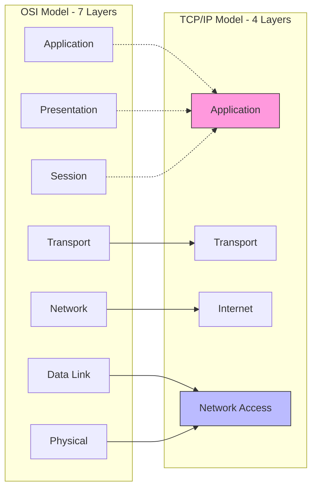

# Chapter 02 — OSI & TCP/IP Models — Computer Networking 🌐

*Networking এর সবচেয়ে শক্তিশালী ভিত্তি হলো OSI এবং TCP/IP Model। এই আর্টিকেলে আমরা এই দুটি মডেলের গভীরতা এবং বাস্তব প্রয়োগ নিয়ে আলোচনা করব।*

---

# Topic 6: OSI Model (The Theoretical Blueprint)

*"সাতটি ধাপে নেটওয়ার্কিং বোঝার মূল চাবিকাঠি - OSI Model"*

**OSI (Open Systems Interconnection)** হলো একটি **Theoretical/Reference Model** যা ISO তৈরি করেছে। এটি নেটওয়ার্কের কাজকে ৭টি লেয়ারে ভাগ করে বোঝায়।

### 6.1 OSI 7 Layers & PDUs
নেটওয়ার্কের প্রতিটি লেয়ারে ডেটার একেকটি নাম থাকে, যাকে **PDU (Protocol Data Unit)** বলা হয়।

| Layer No | Layer Name | PDU Name | Device / Hardware |
|:---:|---|---|---|
| 7 | **Application** | Data | PC, Browser |
| 6 | **Presentation** | Data | Gateway |
| 5 | **Session** | Data | Gateway |
| 4 | **Transport** | **Segment** | Firewall |
| 3 | **Network** | **Packet** | **Router**, L3 Switch |
| 2 | **Data Link** | **Frame** | **Switch**, Bridge, NIC |
| 1 | **Physical** | **Bits** | Hub, Repeater, Cable |

---

# Topic 7: TCP/IP Model (The Real World)
বাস্তব জীবনে আমরা যে ইন্টারনেট ব্যবহার করি তা **TCP/IP Model** মেনে চলে। এটি ৪টি (কখনও ৫টি) লেয়ারে বিভক্ত।

### 7.1 Layer Comparison: OSI vs TCP/IP

---

# Topic 8: Encapsulation & Decapsulation
ডেটা যখন ওপর থেকে নিচে যায়, তখন তাকে **Encapsulation** বলে। আর যখন রিসিভার এন্ডে নিচ থেকে ওপরে উঠে, তাকে **Decapsulation** বলে।

1. **Encapsulation (Sender Side):** Data ➔ Segment (Layer 4) ➔ Packet (Layer 3) ➔ Frame (Layer 2) ➔ Bits (Layer 1).
2. **Decapsulation (Receiver Side):** Bits ➔ Frame ➔ Packet ➔ Segment ➔ Data.

---

### 🎓 Job-Ready Specials

#### Common Interview Questions
1. **Why is a Bridge/Switch called a Layer 2 device?**
   - **Ans:** কারণ Bridge বা Switch ডেটা ট্রান্সফারের জন্য **MAC Address** ব্যবহার করে এবং এটি শুধুমাত্র **Data Link Layer** (Layer 2) এ কাজ করে ফ্রেমগুলো ফিল্টার করতে পারে।
2. **Router vs L3 Switch এর পার্থক্য কী?**
   - **Ans:** Router মূলত Software-based এবং WAN এ ব্যবহৃত হয়। L3 Switch মূলত Hardware-based (ASIC) এবং LAN এ দ্রুতগতির ইন্টার-ভ্ল্যান রাউটিংয়ের জন্য ব্যবহৃত হয়।
3. **ICMP কোন লেয়ারে কাজ করে?**
   - **Ans:** Network Layer (Layer 3)।

---

### 📝 Practice Zone

#### Written Challenge
1. OSI Model এর ৭টি লেয়ারের ক্রমানুসারে নাম লিখুন এবং প্রতিটি লেয়ারের একটি করে প্রটোকল উল্লেখ করুন।
2. "Transport Layer is the heart of OSI" - ব্যাখ্যা করুন।
3. TCP/IP এবং OSI মডেলের মধ্যে ৩টি প্রধান পার্থক্য লিখুন।
4. **Encapsulation এবং Decapsulation বলতে কী বোঝায়? ডায়াগ্রামের সাহায্যে ব্যাখ্যা করুন।**
5. **Layer 2 Switch এবং Layer 3 Switch এর মধ্যে প্রধান পার্থক্য আলোচনা করুন।**

#### MCQ Drill
1. Router কোন লেয়ারে কাজ করে?
   - (A) Layer 2 (B) Layer 3 (C) Layer 4 (D) Layer 7
   - **উত্তর: (B) Layer 3**
2. Layer 4 এর PDU নাম কী?
   - (A) Packet (B) Frame (C) Segment (D) Bit
   - **উত্তর: (C) Segment**
3. MAC Address কোথায় চেক করা হয়?
   - (A) Network Layer (B) Data Link Layer (C) Physical Layer (D) Transport Layer
   - **উত্তর: (B) Data Link Layer**
4. নিচের কোনটি OSI Model এর ৫ম লেয়ার?
   - (A) Presentation (B) Session (C) Transport (D) Network
   - **উত্তর: (B) Session**
5. End-to-End communication নিশ্চিত করে কোন লেয়ার?
   - (A) Network (B) Data Link (C) Transport (D) Application
   - **উত্তর: (C) Transport**
6. Hub কোন লেয়ারে কাজ করে?
   - (A) Physical (B) Network (C) Session (D) Application
   - **উত্তর: (A) Physical**
7. Error Detection সাধারণত কোন লেয়ারে করা হয়?
   - (A) Application (B) Data Link (C) Physical (D) Session
   - **উত্তর: (B) Data Link**
8. HTTP এবং FTP কোন লেয়ারে কাজ করে?
   - (A) Network (B) Session (C) Presentation (D) Application
   - **উত্তর: (D) Application**
9. মডেম (Modem) কোন লেয়ারের ডিভাইস?
   - (A) Layer 1 (B) Layer 2 (C) Layer 3 (D) Layer 4
   - **উত্তর: (A) Layer 1**
10. প্যাকেট (Packet) থেকে ফ্রেমে (Frame) রূপান্তর হওয়াকে কী বলে?
    - (A) Encapsulation (B) Decapsulation (C) Routing (D) Filtering
    - **উত্তর: (A) Encapsulation**

---

### 🔥 Core Concept Analysis (Step-by-Step)

**Problem: ওএসআই মডেলের লেয়ার মনে রাখার টেকনিক**
অনেকেই লেয়ারগুলোর সিকোয়েন্স ভুলে যান। নিচের ছন্দটি মনে রাখতে পারেন:

**"Please Do Not Throw Sausage Pizza Away"**
1. **P** - Physical
2. **D** - Data Link
3. **N** - Network
4. **T** - Transport
5. **S** - Session
6. **P** - Presentation
7. **A** - Application

---

### 🏛️ BPSC/Bank Job Pattern Analysis
- **বিপিএসসি প্রশ্ন:** প্রায় প্রতি বছরই বিপিএসসি পরীক্ষায় ওএসআই মডেলের লেয়ারগুলোর কার্যাবলী থেকে লিখিত প্রশ্ন আসে।
- **ব্যাংক জব টিপস:** ডেটা লিংক লেয়ারের দুটি সাব-লেয়ার (LLC এবং MAC) সম্পর্কে বিস্তারিত জেনে রাখুন।
- **ইন্টারভিউ প্রশ্ন:** "আপনার কম্পিউটারে একটি ইউটিউব ভিডিও দেখার সময় ওএসআই মডেলের কোন লেয়ার কী কাজ করছে?" - এই ধরণের প্রাকটিক্যাল প্রশ্ন করার ট্রেন্ড এখন বেশি।

