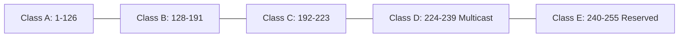
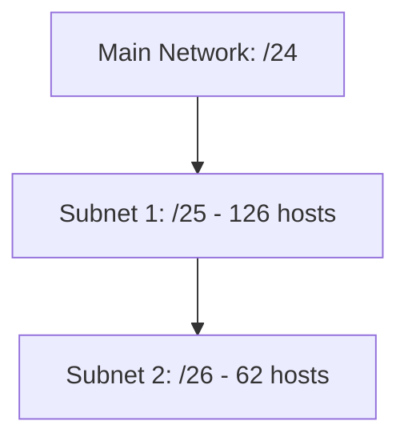

# Chapter 03 — IP Addressing & Subnetting — Computer Networking 🌐

*চাকরি পরীক্ষায় নেটওয়ার্কিংয়ের সবচেয়ে ভয়ের জায়গা হলো IP ম্যাথ ও সাবনেটিং। এই লেকচারে আমরা সেই ভয় দূর করব সহজ বাংলায়।*

---

# Topic 9: IPv4 Basics

*"প্রতিটি device-কে network এ চিনতে একটা unique logical address লাগে — সেটাই IP Address"*

**IP Address (Internet Protocol Address)** হলো network এ প্রতিটি device এর **logical address**। এটি OSI Model এর **Layer 3 (Network Layer)** এ কাজ করে।

### 9.1 Binary to Decimal Conversion (The Core)
IPv4 এ **32 bits** থাকে, যা **4টি octet** (8-bit each) এ বিভক্ত। 
দ্রুত আইপি কনভারশনের জন্য **Power of 2 Table** মুখস্থ রাখা জরুরি:

| 128 ($2^7$) | 64 ($2^6$) | 32 ($2^5$) | 16 ($2^4$) | 8 ($2^3$) | 4 ($2^2$) | 2 ($2^1$) | 1 ($2^0$) |
|:---:|:---:|:---:|:---:|:---:|:---:|:---:|:---:|
| 1 | 1 | 0 | 0 | 0 | 0 | 0 | 0 |

**Example:** $11000000_2 = 128 + 64 = 192_{10}$

### 9.2 IPv4 Classes
আইপিকে মূলত ৫টি ক্লাসে ভাগ করা হয়েছে। পরীক্ষার জন্য প্রথম ৩টি ক্লাস সবচেয়ে গুরুত্বপূর্ণ:

- **Class A:** বিশাল অর্গানাইজেশনের জন্য (Default Mask: `255.0.0.0` or `/8`)
- **Class B:** মাঝারি অর্গানাইজেশনের জন্য (Default Mask: `255.255.0.0` or `/16`)
- **Class C:** ক্ষুদ্র অর্গানাইজেশনের জন্য (Default Mask: `255.255.255.0` or `/24`)

---

# Topic 10: Special IP Addresses

ইন্টারভিউয়ের জন্য নিচের IP রেঞ্জগুলো মুখস্থ রাখা জরুরি:

- **Loopback Address (`127.0.0.1`):** নিজের কম্পিউটার বা সার্ভিসকে টেস্ট করার জন্য।
- **APIPA (`169.254.x.x`):** যদি DHCP সার্ভার থেকে IP না পায়, কম্পিউটার নিজে থেকে এই IP সেট করে নেয়।
- **0.0.0.0:** Default route বোঝাতে ব্যবহৃত হয়।
- **255.255.255.255:** Limited Broadcast address.

### Private vs Public IP
- **Public IP:** ইন্টারনেটে সরাসরি ব্যবহৃত হয় এবং ISP থেকে কিনে বা লিজে নিতে হয়।
- **Private IP:** লোকাল নেটওয়ার্কে (বাসা বা অফিস) ফ্রিতে ব্যবহারের জন্য সংরক্ষিত: 
    - **Class A:** `10.0.0.0 - 10.255.255.255`
    - **Class B:** `172.16.x.x - 172.31.x.x`
    - **Class C:** `192.168.x.x` (সবচেয়ে কমন)

---

# Topic 11: Subnetting Masterclass

*"একটি বড় নেটওয়ার্ককে ছোট ছোট নেটওয়ার্কে (Subnet) ভাগ করার পদ্ধতিই Subnetting"*

### Magic Number Method (সাবনেটিং ম্যাজিক)
সাবনেটিং বের করার সবচেয়ে সহজ উপায় হলো **Magic Number** বের করা। 

**Formula:** $\text{Magic Number} = 256 - \text{Subnet Mask Value}$

**Example:** `192.168.1.0/26` এর সাবনেটগুলো বের করো।
1. `/26` মানে মাস্ক হলো `255.255.255.192` (৪র্থ অষ্টকে প্রথম ২ বিট অন: $128+64=192$)
2. Magic Number = $256 - 192 = 64$
3. সাবনেটগুলো হবে ৬৪ এর গুণিতক: `0, 64, 128, 192`

### /24 to /30 Shortcuts Table
| CIDR | Subnet Mask | Magic No | Hosts (Usable) |
|:---:|:---:|:---:|:---:|
| /24 | 255.255.255.0 | 256 | 254 |
| /25 | 255.255.255.128 | 128 | 126 |
| /26 | 255.255.255.192 | 64 | 62 |
| /27 | 255.255.255.224 | 32 | 30 |
| /28 | 255.255.255.240 | 16 | 14 |
| /29 | 255.255.255.248 | 8 | 6 |
| /30 | 255.255.255.252 | 4 | 2 (Point-to-Point) |

---

# Topic 12: VLSM Concept
**VLSM (Variable Length Subnet Masking)** হলো এক একটি সাবনেটে ভিন্ন ভিন্ন মাস্ক ব্যবহার করা। 

- **Why?** IP অপচয় রোধ করতে। 
- **Rule:** যে সাবনেটে হোস্ট (কম্পিউটার) বেশি লাগে, তার কাজ আগে শুরু করতে হয়।

---

### 📝 Chapter Summary
- IPv4: 32 bits, IPv6: 128 bits.
- Network ID বের করা হয় (IP AND Mask) লজিকে।
- Broadcast ID হলো সাবনেটের সর্বশেষ আইপি।

---

### 🔥 Job Exam Special (BPSC/Bank)
- **Problem:** `10.0.0.0/8` তে কতগুলো হোস্ট সম্ভব? 
  - **Ans:** $2^{24} - 2$ (যেহেতু নেটওয়ার্ক বিট ৮, হোস্ট বিট ২৪)।
- **Common Question:** "Which layer does a Router work on?" - Network Layer.
- **Shortcut:** `255.255.255.252` (or /30) মাস্ক ব্যবহৃত হয় দুটি রাউটারের সিরিয়াল পোর্টে সংযোগ দিতে।

---

### ⚠️ Interview Traps
1. **প্রশ্ন:** "একটি ক্লাস-সি আইপি যদি ১৯২ দিয়ে শুরু হয়, তাহলে ১২৭ দিয়ে শুরু হলে সেটা কোন ক্লাস?" 
   - **উত্তর:** ১২৭ কোনো ক্লাসের অংশ নয়, এটি **Loopback** এর জন্য সংরক্ষিত।
2. **প্রশ্ন:** "একটি পিসিতে কি একাধিক আইপি থাকতে পারে?" 
   - **উত্তর:** হ্যাঁ, প্রতিটি ইন্টারফেসে (Wi-Fi, LAN) আলাদা আইপি থাকতে পারে।

---

### 🧠 Practice Zone

#### MCQ Drill
1. IPv4 এ মোট কয়টি ক্লাস আছে?
   - (ক) ৩ (খ) ৪ (গ) ৫ (ঘ) ৮
   - **উত্তর: (গ) ৫** (Class A, B, C, D, E)
2. `192.168.10.5` কোন ক্লাসের আইপি?
   - (ক) A (খ) B (গ) C (ঘ) D
   - **উত্তর: (গ) C** (রেঞ্জ: ১৯২-২২৩)
3. `/28` সাবনেট মাস্কে মোট কতটি ইউজাবল (Usable) হোস্ট অ্যাড্রেস পাওয়া যায়?
   - (ক) ১৪ (খ) ১৬ (গ) ৩০ (ঘ) ৩২
   - **উত্তর: (ক) ১৪** [সূত্র: $2^{(32-28)} - 2 = 2^4 - 2 = 14$]
4. APIPA অ্যাড্রেস রেঞ্জ কোনটি?
   - (ক) 10.x.x.x (খ) 169.254.x.x (গ) 127.x.x.x (ঘ) 172.16.x.x
   - **উত্তর: (খ) 169.254.x.x**
5. Subnetting এর প্রধান উদ্দেশ্য কী?
   - (ক) স্পিড বাড়ানো (খ) আইপি অপচয় কমানো (গ) সিকিউরিটি কমানো (ঘ) উপরের সবগুলি
   - **উত্তর: (খ) আইপি অপচয় কমানো**
6. IPv6 অ্যাড্রেস কত বিটের হয়ে থাকে?
   - (ক) ৩২ (খ) ৪৮ (গ) ৬৪ (ঘ) ১২৮
   - **উত্তর: (ঘ) ১২৮**
7. লুপব্যাক (Loopback) অ্যাড্রেস কোনটি?
   - (ক) 127.0.0.1 (খ) 192.168.1.1 (গ) 0.0.0.0 (ঘ) 255.255.255.255
   - **উত্তর: (ক) 127.0.0.1**
8. একটি ক্লাস-বি (Class B) নেটওয়ার্কে ডিফল্ট সাবনেট মাস্ক কোনটি?
   - (ক) 255.0.0.0 (খ) 255.255.0.0 (গ) 255.255.255.0 (ঘ) 255.255.255.255
   - **উত্তর: (খ) 255.255.0.0**
9. `/30` সাবনেট মাস্কটি মূলত কোথায় ব্যবহৃত হয়?
   - (ক) লোকাল ল্যান (খ) পয়েন্ট-টু-পয়েন্ট লিংক (গ) মাল্টিকাস্টিং (ঘ) স্লাইস নেটওয়ার্ক
   - **উত্তর: (খ) পয়েন্ট-টু-পয়েন্ট লিংক**
10. আইপি অ্যাড্রেসিং এ "0" এবং "255" সাধারণত কেন হোস্ট হিসেবে ব্যবহার করা হয় না?
    - (ক) রিজার্ভড (খ) নয়েজ তৈরি করে (গ) এগুলো নেটওয়ার্ক এবং ব্রডকাস্ট আইডি (ঘ) হার্ডওয়্যার সাপোর্ট করে না
    - **উত্তর: (গ) এগুলো নেটওয়ার্ক এবং ব্রডকাস্ট আইডি**

#### Written Challenge
1. `172.16.0.0/20` নেটওয়ার্কের সাবনেট মাস্ক এবং এর প্রথম ৫টি সাবনেটের নেটওয়ার্ক আইডি নির্ণয় করো।
2. কেন IPv4 এর পর IPv6 কেন আনা হয়েছে? সংক্ষেপে এর সুবিধাগুলো লেখো।
3. **Public IP এবং Private IP এর মধ্যে ৩টি মূল পার্থক্য বিস্তারিত আলোচনা করুন।**
4. **"NAT (Network Address Translation)" কেন সাবনেটিং এর সাথে সম্পর্কিত? এটি কীভাবে আইপি সংকট দূর করে?**
5. **CIDR (Classless Inter-Domain Routing) কী এবং এটি কেন ট্রেডিশনাল ক্লাস সিস্টেম থেকে উন্নত?**

---

### 🔥 Math Solve Zone (Step-by-Step)

**Problem: সাবনেটিং ক্যালকুলেশন**
একটি ছোট আইটি কোম্পানিকে `192.168.10.0/26` নেটওয়ার্কটি দেওয়া হয়েছে। তাদের নিচের তথ্যগুলো বের করতে হবে:
১. সাবনেট মাস্ক (Decimal)
২. মোট কতটি সাবনেট করা সম্ভব?
৩. প্রতিটি সাবনেটে কতটি ইউজাবল হোস্ট থাকবে?
৪. ২য় সাবনেটের নেটওয়ার্ক আইডি এবং ব্রডকাস্ট আইডি কত?

**সমাধান:**

**ধাপ ১: সাবনেট মাস্ক নির্ণয়**
- `/26` মানে প্রথম ২৬টি বিট ১ (On)।
- ১ম, ২য়, ৩য় অষ্টক পূর্ণ (৮+৮+৮ = ২৪)। ৪র্থ অষ্টকে থাকবে আরও ২ বিট ($26-24=2$)।
- ৪র্থ অষ্টক: $11000000_2 = 128 + 64 = 192$।
- **মাস্ক:** `255.255.255.192`।

**ধাপ ২: সাবনেট সংখ্যা**
- আমরা জানি, ক্লাস-সি এর ডিফল্ট মাস্ক `/24`। এখানে নেওয়া হয়েছে `/26`।
- বাড়তি বিট (Borrow bits) $n = 26 - 24 = 2$।
- সাবনেট সংখ্যা = $2^n = 2^2 = 4$টি।

**ধাপ ৩: হোস্ট সংখ্যা**
- হোস্ট বিট বাকি আছে $32 - 26 = 6$টি।
- ইউজাবল হোস্ট = $2^6 - 2 = 64 - 2 = 62$টি।

**ধাপ ৪: ২য় সাবনেট বের করা (Magic Number Method)**
- Magic Number = $256 - 192 = 64$।
- সাবনেটগুলো হলো:
  - ১ম: `192.168.10.0`
  - ২য়: `192.168.10.64`
  - ৩য়: `192.168.10.128`
  - ৪র্থ: `192.168.10.192`
- **২য় সাবনেটের নেটওয়ার্ক আইডি:** `192.168.10.64`
- **২য় সাবনেটের ব্রডকাস্ট আইডি:** ৩য় সাবনেটের ঠিক আগের আইপি অর্থাৎ `192.168.10.127`।

---

### 🏛️ BPSC/Bank Job Pattern Analysis
- **ফোকাস:** ব্যাংকের আইটি অফিসার পরীক্ষায় সাবনেটিং থেকে অন্তত ১টি ম্যাথ থাকেই। বিশেষ করে `/30` এবং `/29` এর ওপর বেশি গুরুত্ব দিন।
- **বিপিএসসি টিপস:** IPv4 এর লিমিটেশন এবং IPv6 এর এনক্রিপশন সুবিধা সম্পর্কে জানুন।

