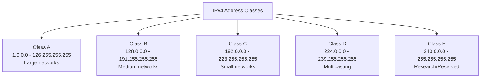
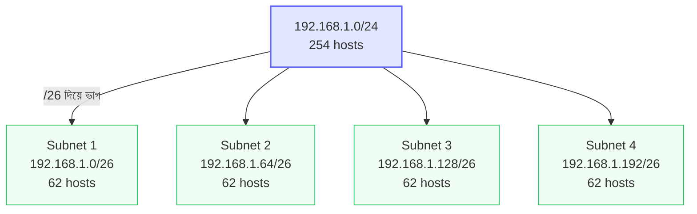
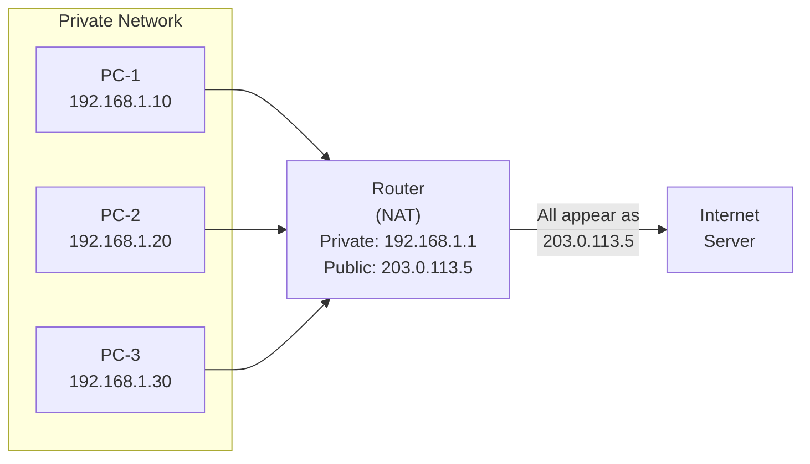

# Chapter 03 — IP Addressing & Subnetting — Computer Networking 🌐

> IPv4, subnetting, VLSM, IPv6, NAT/PAT।

---
# LEVEL 3: IP ADDRESSING & SUBNETTING (আইপি অ্যাড্রেসিং)

*চাকরি পরীক্ষায় Subnetting calculation সবচেয়ে বেশি আসে — এই level মনোযোগ দিয়ে পড়ুন*


---
---

# Topic 9: IPv4 Addressing

<div align="center">

*"প্রতিটি device এর network এ একটা unique address লাগে — সেটাই IP Address"*

</div>

---

## 📖 9.1 ধারণা (Concept)

**IP Address (Internet Protocol Address)** হলো network এ প্রতিটি device এর **unique logical address**। ঠিক যেমন আপনার বাড়ির ঠিকানা আছে — network device এরও ঠিকানা আছে।

### IPv4 Address Format

**IPv4** = **32-bit** address, **4 octet** এ ভাগ করা, dot দিয়ে আলাদা।

```
IPv4 Format:    192.168.1.100
                 │    │  │  │
                 │    │  │  └── 4th Octet (8 bits)
                 │    │  └───── 3rd Octet (8 bits)
                 │    └──────── 2nd Octet (8 bits)
                 └───────────── 1st Octet (8 bits)

Binary:    11000000.10101000.00000001.01100100
Decimal:      192   .  168   .   1    .  100

Total: 4 × 8 = 32 bits
```

**প্রতিটি Octet এর range: 0-255** (কারণ 8 bit এ max = 2⁸-1 = 255)

### IP Address এর দুটি অংশ

প্রতিটি IP address এ **দুটো অংশ** থাকে:

```
IP Address = Network Part + Host Part

Example: 192.168.1.100 / 255.255.255.0

Network Part: 192.168.1     → কোন network এ আছে (রাস্তার নাম)
Host Part:           .100   → network এর মধ্যে কোন device (বাড়ি নম্বর)
```

### IPv4 Address Classes



### Class Details — Master Table

| বৈশিষ্ট্য | Class A | Class B | Class C |
|-----------|---------|---------|---------|
| **1st Octet Range** | 1 - 126 | 128 - 191 | 192 - 223 |
| **1st Octet Binary** | 0xxxxxxx | 10xxxxxx | 110xxxxx |
| **Default Subnet Mask** | 255.0.0.0 (/8) | 255.255.0.0 (/16) | 255.255.255.0 (/24) |
| **Network Part** | 1st octet | 1st + 2nd octet | 1st + 2nd + 3rd octet |
| **Host Part** | Last 3 octets | Last 2 octets | Last 1 octet |
| **Networks সংখ্যা** | 126 | 16,384 | 2,097,152 |
| **Hosts per Network** | 16,777,214 | 65,534 | 254 |
| **Use Case** | Very large org (ISP) | Medium org | Small org / Home |

> **Host formula:** `2^n - 2` (n = host bits সংখ্যা, -2 কারণ Network ID ও Broadcast address বাদ)

### Special/Reserved IP Addresses

| Address | ব্যবহার |
|---------|--------|
| **0.0.0.0** | Default route / "this network" |
| **127.0.0.1** | **Loopback** (localhost) — নিজেকে test করা |
| **127.0.0.0/8** | পুরো 127.x.x.x range loopback এ reserved |
| **255.255.255.255** | Limited broadcast — same network এ সবাইকে |
| **169.254.x.x** | APIPA (Automatic Private IP) — DHCP না পেলে |

> ⚠️ **127.0.0.0 থেকে 127.255.255.255 পুরো range loopback এ reserved** — তাই Class A তে 1-126, 127 নেই!

### Private vs Public IP Address

**Private IP** — Internet এ directly accessible না, শুধু internal network এ ব্যবহৃত হয়।

| Class | Private IP Range | Commonly Used |
|-------|-----------------|---------------|
| A | 10.0.0.0 - 10.255.255.255 | Large corporate |
| B | 172.16.0.0 - 172.31.255.255 | Medium org |
| C | 192.168.0.0 - 192.168.255.255 | **Home/Small office** |

```
Public IP:  আপনার ISP দেয়, Internet এ unique
            Example: 103.145.50.200

Private IP: আপনার router/DHCP দেয়, local network এ
            Example: 192.168.1.100

Router NAT দিয়ে Private → Public convert করে Internet এ যায়
```

---

## ❓ 9.2 MCQ Problems

**Q1.** IPv4 address কত bit এর?

- (a) 16 bit
- (b) 32 bit ✅
- (c) 48 bit
- (d) 128 bit

> **ব্যাখ্যা:** IPv4 = **32 bit** (4 octet × 8 bit)। IPv6 = 128 bit। MAC address = 48 bit।

**Q2.** 172.16.5.10 কোন class এর IP?

- (a) Class A
- (b) Class B ✅
- (c) Class C
- (d) Class D

> **ব্যাখ্যা:** 1st octet = 172, যেটা **128-191** range এ — তাই **Class B**।

**Q3.** Class C এর default subnet mask কোনটি?

- (a) 255.0.0.0
- (b) 255.255.0.0
- (c) 255.255.255.0 ✅
- (d) 255.255.255.255

> **ব্যাখ্যা:** Class A = 255.0.0.0 (/8), Class B = 255.255.0.0 (/16), **Class C = 255.255.255.0 (/24)**।

**Q4.** 127.0.0.1 কিসের জন্য reserved?

- (a) Default Gateway
- (b) Broadcast
- (c) Loopback (localhost) ✅
- (d) DNS Server

> **ব্যাখ্যা:** **127.0.0.1** হলো **loopback address / localhost** — device নিজেকে test করতে ব্যবহার করে। `ping 127.0.0.1` করলে নিজের machine এ ping করে।

**Q5.** Class C network এ সর্বোচ্চ কতটি host থাকতে পারে?

- (a) 256
- (b) 255
- (c) 254 ✅
- (d) 252

> **ব্যাখ্যা:** Class C তে host bits = 8, তাই hosts = **2⁸ - 2 = 254**। (-2 কারণ Network ID ও Broadcast address বাদ)।

**Q6.** 192.168.1.0 কোন ধরনের IP?

- (a) Public IP
- (b) Private IP ✅
- (c) Loopback
- (d) Broadcast

> **ব্যাখ্যা:** **192.168.x.x** range হলো **Class C Private IP**। এটা Internet এ directly route হয় না, শুধু internal/local network এ ব্যবহৃত।

**Q7.** DHCP server থেকে IP না পেলে device কোন IP নেয়?

- (a) 0.0.0.0
- (b) 127.0.0.1
- (c) 169.254.x.x ✅
- (d) 255.255.255.255

> **ব্যাখ্যা:** **169.254.x.x (APIPA — Automatic Private IP Addressing)** — DHCP server না পেলে device নিজে এই range থেকে একটা IP assign করে। Internet access থাকবে না, তবে local communication সম্ভব।

---

## ⚠️ 9.3 Tricky Parts

> ⚠️ **Trap 1:** "Class A তে 0 ও 127 নেই কেন?" — **0.x.x.x** reserved for "this network", **127.x.x.x** reserved for loopback। তাই Class A range **1-126**।

> ⚠️ **Trap 2:** "Host per network calculate" — Formula: **2^n - 2** (n = host bits)। **-2 কেন?** প্রতি network এ 1st address = **Network ID** (host part সব 0), last address = **Broadcast** (host part সব 1) — এদুটো device কে assign করা যায় না।

> ⚠️ **Trap 3:** "MAC Address আর IP Address গুলিয়ে ফেলা" — **MAC = 48 bit, physical, Layer 2, hardware burned-in**। **IP = 32 bit (IPv4), logical, Layer 3, changeable**।

---

## 📝 9.4 Summary

- **IPv4 = 32 bit**, 4 octet, dotted decimal
- **Class A:** 1-126, /8, large network, **16M hosts**
- **Class B:** 128-191, /16, medium, **65K hosts**
- **Class C:** 192-223, /24, small, **254 hosts**
- **Class D:** 224-239, multicasting
- **Class E:** 240-255, research
- **127.0.0.1** = Loopback, **169.254.x.x** = APIPA
- **Private IP:** 10.x.x.x, 172.16-31.x.x, 192.168.x.x
- **Host formula:** `2^n - 2`

---
---

# Topic 10: Subnetting

<div align="center">

*"বড় network কে ছোট ছোট ভাগে ভাগ করা — পরীক্ষায় calculation সবচেয়ে বেশি আসে"*

</div>

---

## 📖 10.1 ধারণা (Concept)

**Subnetting** হলো একটা বড় network কে **ছোট ছোট sub-network (subnet)** এ ভাগ করার process। এতে IP address efficient ভাবে ব্যবহার হয় এবং network management সহজ হয়।

### Subnetting Visual Overview



### কেন Subnetting দরকার?

```
Without Subnetting:                  With Subnetting:
┌──────────────────────┐            ┌────────────┐
│   একটাই বড় Network  │            │ Subnet 1   │ HR Department
│   500 hosts          │    →       ├────────────┤
│   সব broadcast সবাই  │            │ Subnet 2   │ IT Department
│   পায় — slow!        │            ├────────────┤
└──────────────────────┘            │ Subnet 3   │ Sales
                                    └────────────┘
                                    প্রতিটিতে আলাদা broadcast domain
```

### Subnet Mask কী?

**Subnet Mask** নির্ধারণ করে IP address এর কতটুকু **Network part** আর কতটুকু **Host part**।

```
IP:          192.168.1.100
Subnet Mask: 255.255.255.0

Binary:
IP:     11000000.10101000.00000001.01100100
Mask:   11111111.11111111.11111111.00000000
        ├── Network (1s) ──────────┤├─Host─┤

1 = Network portion
0 = Host portion
```

### CIDR Notation

**CIDR (Classless Inter-Domain Routing)** — subnet mask কে সংক্ষেপে লেখার পদ্ধতি।

| Subnet Mask | CIDR | Network Bits | Host Bits | Usable Hosts |
|-------------|------|-------------|-----------|-------------|
| 255.0.0.0 | /8 | 8 | 24 | 16,777,214 |
| 255.255.0.0 | /16 | 16 | 16 | 65,534 |
| 255.255.255.0 | /24 | 24 | 8 | 254 |
| 255.255.255.128 | /25 | 25 | 7 | 126 |
| 255.255.255.192 | /26 | 26 | 6 | 62 |
| 255.255.255.224 | /27 | 27 | 5 | 30 |
| 255.255.255.240 | /28 | 28 | 4 | 14 |
| 255.255.255.248 | /29 | 29 | 3 | 6 |
| 255.255.255.252 | /30 | 30 | 2 | 2 |

### Subnetting Calculation — Step by Step

**Problem:** 192.168.1.0/26 network এর subnet details বের করুন।

**Step 1:** CIDR /26 মানে 26 bits network, বাকি 32-26 = **6 bits host**

**Step 2:** Usable hosts = 2⁶ - 2 = **62**

**Step 3:** Total addresses per subnet = 2⁶ = **64**

**Step 4:** Subnet mask = 255.255.255.**192** (কারণ 11000000 = 192)

**Step 5:** Subnets:

| Subnet | Network ID | First Usable | Last Usable | Broadcast |
|--------|-----------|-------------|------------|-----------|
| 1st | 192.168.1.0 | 192.168.1.1 | 192.168.1.62 | 192.168.1.63 |
| 2nd | 192.168.1.64 | 192.168.1.65 | 192.168.1.126 | 192.168.1.127 |
| 3rd | 192.168.1.128 | 192.168.1.129 | 192.168.1.190 | 192.168.1.191 |
| 4th | 192.168.1.192 | 192.168.1.193 | 192.168.1.254 | 192.168.1.255 |

**মূল formula:**
```
Block Size (increment) = 256 - subnet mask value of the interesting octet
/26 → mask = 192 → Block size = 256 - 192 = 64

Subnet 1: 0, 64, 128, 192 (starts at multiples of 64)
Network ID = start of block
Broadcast = next block start - 1
First usable = Network ID + 1
Last usable = Broadcast - 1
```

### Quick Subnetting Cheat Sheet

| CIDR | Mask | Block Size | Subnets (Class C) | Hosts/Subnet |
|------|------|-----------|-------------------|-------------|
| /24 | .0 | 256 | 1 | 254 |
| /25 | .128 | 128 | 2 | 126 |
| /26 | .192 | 64 | 4 | 62 |
| /27 | .224 | 32 | 8 | 30 |
| /28 | .240 | 16 | 16 | 14 |
| /29 | .248 | 8 | 32 | 6 |
| /30 | .252 | 4 | 64 | 2 |

---

## ❓ 10.2 MCQ Problems

**Q1.** 192.168.1.0/27 network এ কতটি usable host possible?

- (a) 32
- (b) 30 ✅
- (c) 28
- (d) 62

> **ব্যাখ্যা:** /27 মানে host bits = 32-27 = 5। Usable hosts = **2⁵ - 2 = 30**।

**Q2.** /26 subnet mask কত?

- (a) 255.255.255.128
- (b) 255.255.255.192 ✅
- (c) 255.255.255.224
- (d) 255.255.255.240

> **ব্যাখ্যা:** /26 = 26 ones + 6 zeros = 11111111.11111111.11111111.**11**000000 = 255.255.255.**192**।

**Q3.** 10.0.0.0/8 network এ কতটি host possible?

- (a) 254
- (b) 65,534
- (c) 16,777,214 ✅
- (d) 16,777,216

> **ব্যাখ্যা:** /8 = host bits 24, hosts = **2²⁴ - 2 = 16,777,214**। -2 কারণ Network ID ও Broadcast address বাদ।

**Q4.** 192.168.1.130/26 IP এর Network ID কত?

- (a) 192.168.1.0
- (b) 192.168.1.64
- (c) 192.168.1.128 ✅
- (d) 192.168.1.192

> **ব্যাখ্যা:** /26 = block size 64। 130 ÷ 64 = 2.03... → 2nd block start = 2×64 = **128**। তাই Network ID = **192.168.1.128**।

**Q5.** Subnet mask 255.255.255.240 এর CIDR notation কত?

- (a) /26
- (b) /27
- (c) /28 ✅
- (d) /29

> **ব্যাখ্যা:** 240 = **11110000** = 4 ones। পুরো mask এ ones = 24 + 4 = **/28**।

---

## ⚠️ 10.3 Tricky Parts

> ⚠️ **Trap 1:** "Host সংখ্যায় -2 করতে ভুলে যাওয়া" — **সবসময় 2^n - 2** করতে হবে। Network ID ও Broadcast address device কে assign করা যায় না।

> ⚠️ **Trap 2:** "Block size formula" — **256 - subnet mask** (interesting octet)। /26 = mask 192, block = 256-192 = **64**।

> ⚠️ **Trap 3:** "Network ID বের করা" — IP address কে block size দিয়ে ভাগ করে, ভাগফল × block size = **Network ID**।

---

## 📝 10.4 Summary

- **Subnetting** = বড় network কে ছোট subnet এ ভাগ করা
- **Subnet Mask** = কতটুকু network, কতটুকু host সেটা নির্ধারণ
- **CIDR /n** = n bits network, (32-n) bits host
- **Hosts = 2^(host bits) - 2**
- **Block Size = 256 - subnet mask value**
- **Network ID** = block এর 1st address, **Broadcast** = block এর last address

---
---

# Topic 11: VLSM & Supernetting

<div align="center">

*"VLSM = প্রতিটি subnet এ আলাদা size, Supernetting = ছোট network গুলো জোড়া লাগানো"*

</div>

---

## 📖 11.1 ধারণা (Concept)

### VLSM (Variable Length Subnet Mask)

সাধারণ subnetting এ সব subnet **সমান size** এর হয়। কিন্তু বাস্তবে প্রতিটি department এ **ভিন্ন সংখ্যক** host থাকে। **VLSM** এ প্রতিটি subnet এ **আলাদা আলাদা subnet mask** ব্যবহার করা যায়।

```
Fixed Subnetting (Waste):          VLSM (Efficient):
┌──────────────────┐               ┌──────────────────┐
│ Subnet 1: /26    │ 62 hosts      │ Subnet 1: /25    │ 126 hosts (IT: 100 জন)
│ IT: 100 জন ❌    │ কম পড়ে!      │                   │
├──────────────────┤               ├──────────────────┤
│ Subnet 2: /26    │ 62 hosts      │ Subnet 2: /27    │ 30 hosts (HR: 20 জন)
│ HR: 20 জন        │ 42 waste!     │                   │
├──────────────────┤               ├──────────────────┤
│ Subnet 3: /26    │ 62 hosts      │ Subnet 3: /30    │ 2 hosts (WAN link)
│ WAN: 2 জন        │ 60 waste!     │                   │
└──────────────────┘               └──────────────────┘
```

**VLSM Rule:** সবসময় **বড় subnet আগে** allocate করুন, তারপর ছোট গুলো।

### Supernetting (Route Summarization)

Subnetting এর **উল্টো** — একাধিক ছোট network কে **একটা বড় network** হিসেবে represent করা। Routing table ছোট রাখতে ব্যবহৃত।

```
Before Supernetting:                After Supernetting:
192.168.0.0/24  ─┐                 192.168.0.0/22  ← একটা entry
192.168.1.0/24   │ 4 routes        (4 টা network কে 1 টা
192.168.2.0/24   │                  entry তে summarize)
192.168.3.0/24  ─┘
```

---

## ❓ 11.2 MCQ Problems

**Q1.** VLSM এর পূর্ণরূপ কী?

- (a) Virtual LAN Subnet Mask
- (b) Variable Length Subnet Mask ✅
- (c) Very Large Subnet Mode
- (d) Virtual Length Subnet Method

**Q2.** Supernetting এ CIDR prefix কি বাড়ে না কমে?

- (a) বাড়ে (larger prefix)
- (b) কমে (smaller prefix) ✅

> **ব্যাখ্যা:** Supernetting এ একাধিক network merge হয়, তাই network bits **কমে** এবং host bits **বাড়ে**। যেমন: 4 টা /24 merge হলে /22 হয় (24 → 22, prefix কমলো)।

---

## 📝 11.3 Summary

- **VLSM** = প্রতিটি subnet এ **ভিন্ন subnet mask** — waste কমায়
- **Supernetting** = ছোট network গুলো **merge করে** বড় network — routing table ছোট রাখে
- VLSM এ **বড় subnet আগে** allocate করতে হয়
- Supernetting এ CIDR prefix **কমে** (/24 → /22)

---
---

# Topic 12: IPv6 Basics

<div align="center">

*"IPv4 এর address শেষ হয়ে যাচ্ছে — IPv6 হলো ভবিষ্যত"*

</div>

---

## 📖 12.1 ধারণা (Concept)

**IPv6 (Internet Protocol version 6)** হলো **128-bit** address system যেটা IPv4 এর **address exhaustion** সমস্যা সমাধান করতে তৈরি।

### কেন IPv6 দরকার?

```
IPv4: 2³² = ~4.3 billion addresses  ← শেষ হয়ে যাচ্ছে
IPv6: 2¹²⁸ = ~340 undecillion addresses ← পৃথিবীর প্রতিটি বালুকণায় ঠিকানা দেওয়া যায়
```

### IPv6 Format

```
IPv6:  2001:0db8:85a3:0000:0000:8a2e:0370:7334
       ├──┤:├──┤:├──┤:├──┤:├──┤:├──┤:├──┤:├──┤
       8 groups × 4 hex digits = 32 hex = 128 bits

Shortening Rules:
1. Leading zeros remove: 0db8 → db8, 0000 → 0
2. Consecutive all-zero groups → :: (once only)

Full:    2001:0db8:0000:0000:0000:0000:0000:0001
Short:   2001:db8::1
```

### IPv4 vs IPv6 Comparison

| বিষয় | IPv4 | IPv6 |
|-------|------|------|
| **Address Size** | 32-bit | 128-bit |
| **Format** | Decimal (192.168.1.1) | Hexadecimal (2001:db8::1) |
| **Address Space** | ~4.3 billion | ~340 undecillion |
| **Header** | Variable length, complex | Fixed 40 bytes, simplified |
| **Broadcast** | আছে | **নেই** (Multicast ও Anycast দিয়ে replace) |
| **NAT** | প্রয়োজন (address কম) | প্রয়োজন নেই (address অনেক) |
| **IPSec** | Optional | **Built-in** (mandatory) |
| **Configuration** | Manual / DHCP | Auto (SLAAC) / DHCPv6 |
| **Checksum** | Header এ আছে | Header এ **নেই** (efficiency বাড়াতে) |

### IPv6 Address Types

| Type | বিবরণ | Example |
|------|-------|---------|
| **Unicast** | একটা নির্দিষ্ট device | 2001:db8::1 |
| **Multicast** | একটা group এর সবাই (broadcast এর replacement) | ff02::1 |
| **Anycast** | Group এর সবচেয়ে কাছের device | Routing এ ব্যবহৃত |

> ⚠️ **IPv6 তে Broadcast নেই!** — Multicast দিয়ে replace হয়েছে।

---

## ❓ 12.2 MCQ Problems

**Q1.** IPv6 address কত bit এর?

- (a) 32
- (b) 64
- (c) 128 ✅
- (d) 256

**Q2.** IPv6 তে কোনটি নেই?

- (a) Unicast
- (b) Multicast
- (c) Broadcast ✅
- (d) Anycast

> **ব্যাখ্যা:** IPv6 তে **Broadcast নেই** — Multicast দিয়ে replace হয়েছে।

**Q3.** IPv6 address কোন number system এ লেখা হয়?

- (a) Binary
- (b) Decimal
- (c) Hexadecimal ✅
- (d) Octal

**Q4.** IPv6 এ IPSec কি optional?

- (a) হ্যাঁ
- (b) না, built-in/mandatory ✅

> **ব্যাখ্যা:** IPv6 তে **IPSec built-in** — security by design। IPv4 তে IPSec optional ছিল।

---

## 📝 12.3 Summary

- **IPv6 = 128-bit**, hexadecimal format, 8 groups of 4 hex digits
- IPv4 address শেষ হয়ে যাচ্ছে — IPv6 তে **340 undecillion** addresses
- **No Broadcast** in IPv6 — Multicast দিয়ে replace
- **IPSec built-in**, simplified header (fixed 40 bytes)
- **:: দিয়ে consecutive zeros** শূন্য শুধু **একবার** short করা যায়

---
---

# Topic 13: NAT & PAT

<div align="center">

*"Private IP দিয়ে কিভাবে Internet access করেন? — NAT এর কৃতিত্ব!"*

</div>

---

## 📖 13.1 ধারণা (Concept)

**NAT (Network Address Translation)** হলো এমন একটা technique যেটা **Private IP address কে Public IP address এ translate** করে, যাতে internal network এর device গুলো Internet access করতে পারে।



### NAT এর প্রকারভেদ

| Type | বিবরণ | Use Case |
|------|-------|----------|
| **Static NAT** | 1 Private = 1 Public (fixed mapping) | Web server host করা |
| **Dynamic NAT** | Private IP pool → Public IP pool (dynamic mapping) | Multiple public IPs থাকলে |
| **PAT / NAT Overload** | অনেক Private → **1 Public** (port দিয়ে আলাদা) | **Home/office — সবচেয়ে common** |

### PAT (Port Address Translation) — সবচেয়ে গুরুত্বপূর্ণ

**PAT** = অনেকগুলো private IP কে **একটাই public IP** দিয়ে Internet access — **port number** দিয়ে আলাদা করে।

```
PC-1 (192.168.1.10:5001) ──┐                    ┌── 203.0.113.5:10001
PC-2 (192.168.1.20:5002) ──┼── Router (PAT) ────┼── 203.0.113.5:10002
PC-3 (192.168.1.30:5003) ──┘                    └── 203.0.113.5:10003

সবাই একই Public IP (203.0.113.5) ব্যবহার করে
কিন্তু port number আলাদা — তাই router বুঝতে পারে কোন reply কার
```

### কেন NAT দরকার?

1. **IPv4 address সংকট** — public IP address সীমিত, NAT দিয়ে অনেক device একটা public IP share করে
2. **Security** — internal IP address বাইরে থেকে দেখা যায় না
3. **Flexibility** — ISP change করলে internal IP change করতে হয় না

---

## ❓ 13.2 MCQ Problems

**Q1.** আপনার বাসায় 5 টি device একটি router দিয়ে Internet ব্যবহার করে। Router কোন ধরনের NAT ব্যবহার করে?

- (a) Static NAT
- (b) Dynamic NAT
- (c) PAT (NAT Overload) ✅
- (d) No NAT

> **ব্যাখ্যা:** বাসায় ISP সাধারণত **একটাই public IP** দেয়। সেই একটা IP দিয়ে সব device Internet use করে — এটা **PAT/NAT Overload**।

**Q2.** NAT কোন device এ configure করা হয়?

- (a) Switch
- (b) Hub
- (c) Router ✅
- (d) Modem

**Q3.** Static NAT এ কতটি Private IP কতটি Public IP তে map হয়?

- (a) Many to Many
- (b) Many to One
- (c) One to One ✅
- (d) One to Many

---

## 📝 13.3 Summary

- **NAT** = Private → Public IP translation
- **Static NAT** = 1:1 mapping (server এর জন্য)
- **Dynamic NAT** = pool থেকে dynamic mapping
- **PAT** = Many:1 (port দিয়ে আলাদা) — **সবচেয়ে common, বাসায় এটাই ব্যবহৃত**
- NAT = **security** (internal IP hide) + **address conservation**

---

> **Level 3 সম্পূর্ণ!** 🎉 IPv4, Subnetting, VLSM, IPv6, NAT — IP addressing এর সব core concepts শেখা হয়ে গেছে।

---
---


---

## 🔗 Navigation

- 🏠 Back to [Computer Networking — Master Index](00-master-index.md)
- ⬅️ Previous: [Chapter 02 — OSI & TCP/IP Models](02-osi-tcp-ip-models.md)
- ➡️ Next: [Chapter 04 — Transport Layer Protocols](04-transport-layer.md)
