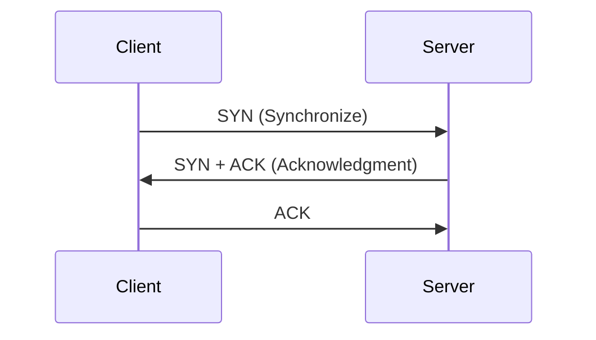
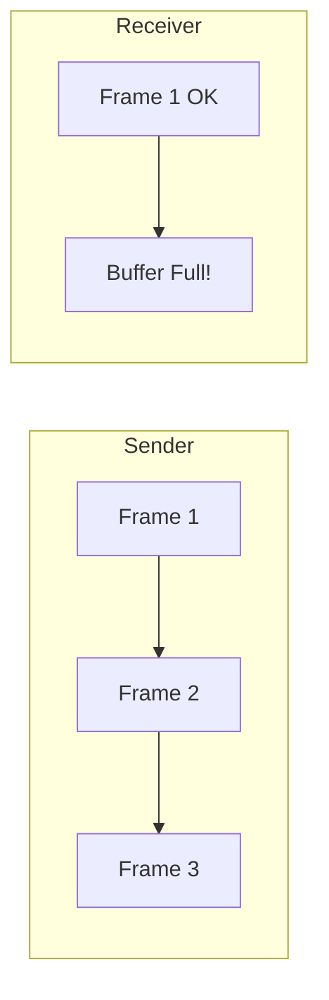

# Chapter 04 - Transport Layer - Computer Networking 🌐

*OSI Model-এর চতুর্থ লেয়ার, যা মূলত End-to-End communication নিশ্চিত করার জন্য দায়ী। এটি Process-to-Process delivery নিশ্চিত করে।*

---

# Topic 13: TCP vs UDP (The Core Protocols)
ট্রান্সপোর্ট লেয়ারে দুই ধরণের প্রধান প্রোটোকল কাজ করে: **TCP** এবং **UDP**।

### 13.1 TCP (Transmission Control Protocol)
- **Reliable:** প্রতিটি প্যাকেট রিসিভ হলে Acknowledgement পাঠানো হয়।
- **Ordered:** ডেটা সঠিক সিকোয়েন্সে পৌঁছায়।

### 13.2 UDP (User Datagram Protocol)
- **Unreliable:** ডেটা পৌঁছাল কি না তার কোনো গ্যারান্টি নেই (Best-effort)।
- **Uses:** Video Streaming, Online Games, DNS।

---

# Topic 14: TCP 3-Way Handshake

---

# Topic 15: Flow & Congestion Control
### 15.1 Flow Control (Sliding Window)
সেন্ডার যেন রিসিভারের ক্ষমতার চেয়ে বেশি স্পিডে ডেটা না পাঠায় তা নিশ্চিত করাই ফ্লো কন্ট্রোল।

### 15.2 Congestion Control
নেটওয়ার্কে জট বা জ্যাম কমাতে TCP দুটি প্রধান ফেজ ব্যবহার করে:
1. **Slow Start:** শুরুতে অল্প ডেটা পাঠিয়ে নেটওয়ার্ক চেক করা।
2. **Congestion Avoidance:** জ্যাম টের পেলে ডেটা পাঠানোর গতি কমিয়ে দেওয়া।

---

# Topic 16: Port Numbers Cheat Sheet
| Port | Protocol | Application |
| :---: | :--- | :--- |
| **80** | HTTP | Web Traffic |
| **443** | HTTPS | Secure Web |
| **53** | DNS | Domain Name System |

---

### 🧠 Practice Zone

#### MCQ Drill
1. TCP হ্যান্ডশেক কয়টি ধাপের হয়?
   - (ক) ২ (খ) ৩ (গ) ৪ (ঘ) ৫
   - **উত্তর: (খ) ৩**
2. Connectionless প্রোটোকল কোনটি?
   - (ক) TCP (খ) UDP (গ) HTTP (ঘ) FTP
   - **উত্তর: (খ) UDP**
3. DNS সাধারণত কোন প্রোটোকল ব্যবহার করে?
   - (ক) TCP (খ) UDP (গ) ICMP (ঘ) ARP
   - **উত্তর: (খ) UDP** (দ্রুত রেসপন্সের জন্য)
4. প্যাকেট লস হলে কোন প্রোটোকল সেটি পুনরায় পাঠায় (Retransmission)?
   - (ক) TCP (খ) UDP (গ) IP (ঘ) Ethernet
   - **উত্তর: (ক) TCP**
5. পোর্ট নম্বর ৮০ (Port 80) কোন সার্ভিসের জন্য সংরক্ষিত?
   - (ক) HTTPS (খ) HTTP (গ) DNS (ঘ) SSH
   - **উত্তর: (খ) HTTP**
6. ট্রান্সপোর্ট লেয়ারে ডেটার একক (PDU) কোনটি?
   - (ক) Segment (খ) Packet (গ) Frame (ঘ) Bits
   - **উত্তর: (ক) Segment**
7. ৩-ওয়ে হ্যান্ডশেক এ কিউমুলেティブ অ্যাকনলেজমেন্ট (ACK) পাঠানোর উদ্দেশ্য কী?
   - (ক) সিকিউরিটি বাড়ানো (খ) পরবর্তী প্যাকেট কোনটি হবে তা জানানো (গ) এরর চেক করা (ঘ) সেশন ক্লোজ করা
   - **উত্তর: (খ) পরবর্তী প্যাকেট কোনটি হবে তা জানানো**
8. বড় সাইজের ডেটাকে ছোট ছোট ভাগে ভাগ করাকে কী বলে?
   - (ক) Routing (খ) Segmentation (গ) Flow Control (ঘ) Encapsulation
   - **উত্তর: (খ) Segmentation**
9. নিরাপদ যোগাযোগের জন্য HTTPS কোন পোর্ট ব্যবহার করে?
   - (ক) ৮০ (খ) ২০ (গ) ৫৫ (ঘ) ৪৪৩
   - **উত্তর: (ঘ) ৪৪৩**
10. ভিডিও কলিং এর জন্য কোনটি বেশি উপযুক্ত?
    - (ক) TCP (খ) UDP (গ) ICMP (ঘ) IGMP
    - **উত্তর: (খ) UDP**

#### Written Challenge
1. TCP 3-way handshake এর প্রতিটি ধাপের গুরুত্ব ব্যাখ্যা করুন।
2. কেন UDP কে "Best-effort delivery" প্রোটোকল বলা হয়? এর ৩টি বাস্তব উদাহরণ দিন।
3. **TCP Flow Control এবং Congestion Control এর মধ্যে পার্থক্য কী?**
4. **Windowing কনসেপ্টটি কীভাবে নেটওয়ার্কের থ্রুপুট বাড়াতে সাহায্য করে?**
5. **Port Addressing এবং IP Addressing এর মধ্যে সম্পর্ক কী? সকেট (Socket) বলতে কী বোঝায়?**

---

### 🔥 Math Solve Zone (Step-by-Step)

**Problem: ক্যালকুলেট নেটওয়ার্ক ল্যাটেন্সি (Latency/Total Delay)**
একটি প্যাকেট ১০ মেগাবাইট (10 MB) সাইজের। ডাটা রেট (Bandwidth) হলো 10 Mbps। প্যাকেটটি সোর্স থেকে ডেস্টিনেশনে যেতে ১ সেকেন্ড সময় নেয় (Propagation Delay)। মোট কত সময় (Total Delay) লাগবে?

**সমাধান:**
মোট সময় = Transmission Delay + Propagation Delay

**ধাপ ১: Transmission Delay বের করা**
সূত্র: $\text{Transmission Delay} = \frac{\text{Data Size}}{\text{Bandwidth}}$
Data Size = $10 \text{ MB} = 10 \times 8 = 80 \text{ Mbits}$ (ব্যান্ডউইডথ যেহেতু বিটস এ থাকে)
Bandwidth = $10 \text{ Mbps}$
$\text{Transmission Delay} = \frac{80}{10} = 8 \text{ seconds}$

**ধাপ ২: মোট সময় (Total Delay)**
Total Delay = $8 \text{ s (Transmission)} + 1 \text{ s (Propagation)} = 9 \text{ seconds}$

**উত্তর: ৯ সেকেন্ড।**

---

### 🏛️ BPSC/Bank Job Pattern Analysis
- **ব্যাংক জব প্যাটার্ন:** ব্যাংক পরীক্ষায় প্রায়ই TCP এবং UDP এর পার্থক্য থেকে ৩-৫ নম্বরের লিখিত প্রশ্ন আসে। 
- **বিপিএসসি ফোকাস:** TCP ফ্লো কন্ট্রোল মেকানিজম (Stop-and-Wait বনাম Sliding Window) এর ওপর জোর দিন।
- **ইন্টারভিউ টিপস:** "Well-known Port" রেঞ্জটি (০-১০২৩) মুখস্থ কার্ডের মতো মনে রাখুন।

