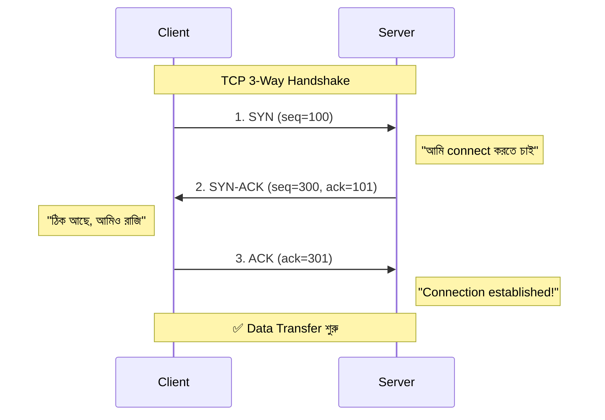
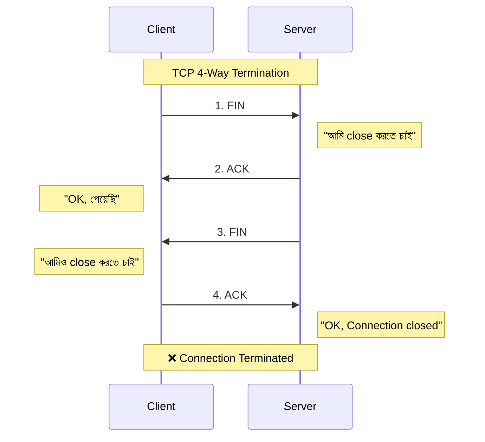
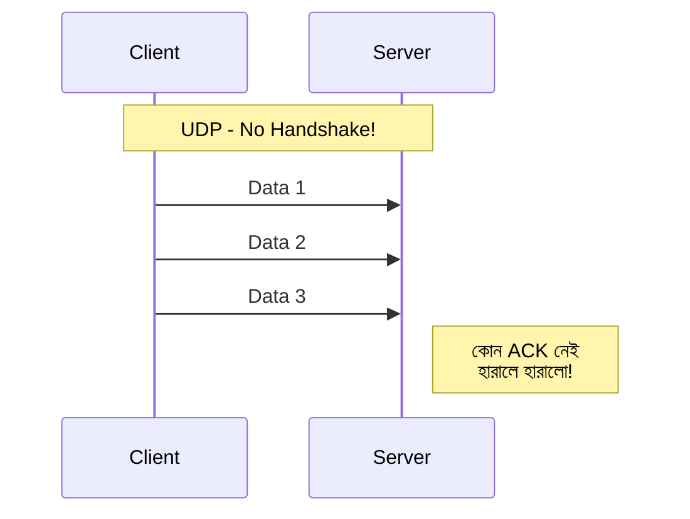
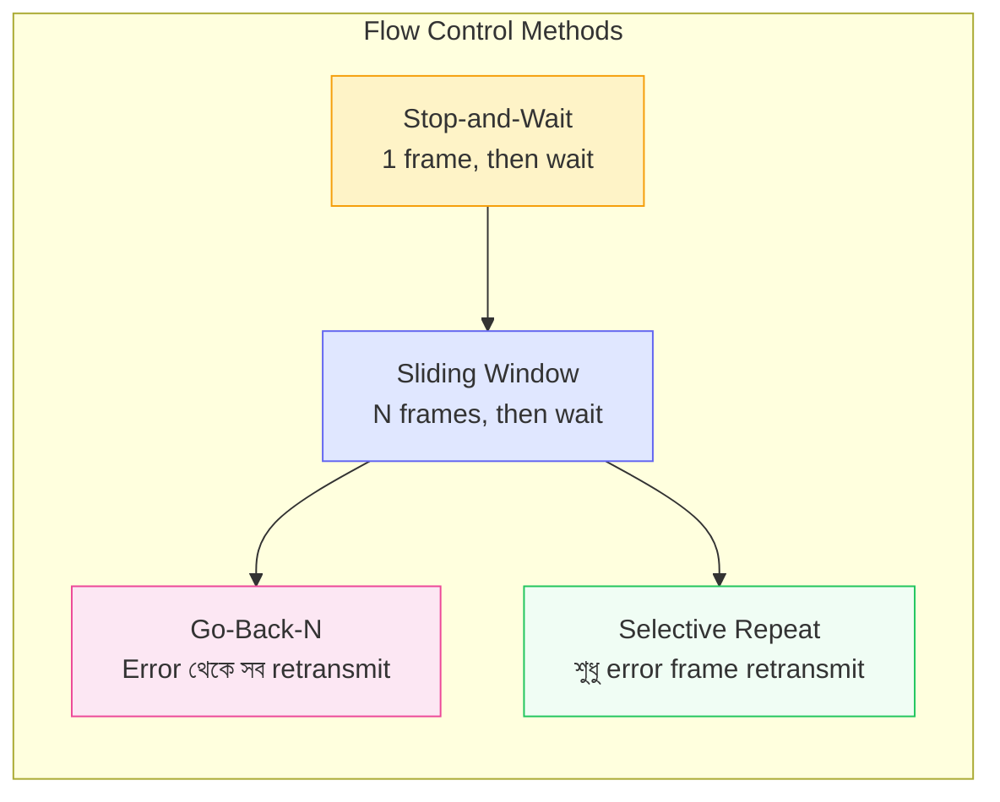

# Chapter 04 — Transport Layer Protocols — Computer Networking 🌐

> TCP, UDP, port numbers, sockets, flow & error control।

---
# LEVEL 4: TRANSPORT LAYER PROTOCOLS

*End-to-end data delivery — TCP ও UDP হলো Internet এর দুই মূল transport protocol*


---
---

# Topic 14: TCP (Transmission Control Protocol)

<div align="center">

*"TCP = Reliable delivery — data হারালে আবার পাঠাবে, order ঠিক রাখবে"*

</div>

---

## 📖 14.1 ধারণা (Concept)

**TCP (Transmission Control Protocol)** হলো **connection-oriented, reliable** transport protocol। Data পাঠানোর আগে connection establish করে এবং প্রতিটি data সঠিকভাবে পৌঁছেছে কিনা verify করে।

### TCP এর বৈশিষ্ট্য

| বৈশিষ্ট্য | বিবরণ |
|-----------|-------|
| **Connection** | Connection-oriented (আগে connection, পরে data) |
| **Reliability** | Reliable — acknowledgement ও retransmission |
| **Ordering** | Sequence number দিয়ে order maintain |
| **Flow Control** | Sliding Window protocol |
| **Error Control** | Checksum + retransmission |
| **Speed** | UDP এর চেয়ে ধীর (overhead বেশি) |
| **Header Size** | 20-60 bytes |
| **Use** | HTTP, FTP, SMTP, SSH — যেখানে data loss acceptable না |

### TCP 3-Way Handshake (Connection Establishment)

TCP connection establish করতে **3-way handshake** ব্যবহার হয়:



**মনে রাখুন: SYN → SYN-ACK → ACK**

### TCP 4-Way Termination (Connection Close)



### TCP Header গুরুত্বপূর্ণ Fields

| Field | Size | কাজ |
|-------|------|-----|
| **Source Port** | 16 bits | Sender এর port |
| **Destination Port** | 16 bits | Receiver এর port |
| **Sequence Number** | 32 bits | Data ordering |
| **Acknowledgement Number** | 32 bits | কোন data পর্যন্ত পেয়েছে |
| **Flags** | 6 bits | SYN, ACK, FIN, RST, PSH, URG |
| **Window Size** | 16 bits | Flow control (কত data পাঠাতে পারবে) |
| **Checksum** | 16 bits | Error detection |

### TCP Flags

| Flag | পূর্ণরূপ | কাজ |
|------|---------|-----|
| **SYN** | Synchronize | Connection শুরু |
| **ACK** | Acknowledgement | Data পেয়েছি confirm |
| **FIN** | Finish | Connection শেষ |
| **RST** | Reset | Connection force close |
| **PSH** | Push | Data immediately deliver করো |
| **URG** | Urgent | Urgent data আছে |

---

## ❓ 14.2 MCQ Problems

**Q1.** TCP 3-way handshake এর সঠিক sequence কোনটি?

- (a) ACK → SYN → SYN-ACK
- (b) SYN → SYN-ACK → ACK ✅
- (c) SYN → ACK → SYN-ACK
- (d) FIN → ACK → FIN-ACK

**Q2.** TCP কি connection-oriented?

- (a) হ্যাঁ ✅
- (b) না

> **ব্যাখ্যা:** TCP **connection-oriented** — data পাঠানোর আগে 3-way handshake দিয়ে connection establish করে। UDP হলো connectionless।

**Q3.** TCP connection terminate করতে কয়টি step লাগে?

- (a) 2
- (b) 3
- (c) 4 ✅
- (d) 5

> **ব্যাখ্যা:** TCP connection close করতে **4-way termination** (FIN → ACK → FIN → ACK) লাগে।

**Q4.** TCP header এর minimum size কত?

- (a) 8 bytes
- (b) 16 bytes
- (c) 20 bytes ✅
- (d) 32 bytes

> **ব্যাখ্যা:** TCP header minimum **20 bytes** (options ছাড়া), maximum 60 bytes (options সহ)।

**Q5.** TCP তে data ordering কিসের মাধ্যমে হয়?

- (a) Port Number
- (b) Sequence Number ✅
- (c) Checksum
- (d) Window Size

---

## ⚠️ 14.3 Tricky Parts

> ⚠️ **Trap 1:** "3-way handshake vs 4-way termination" — Connection **establish = 3 step**, connection **close = 4 step**। গুলিয়ে ফেলা common।

> ⚠️ **Trap 2:** "SYN-ACK একটা step না দুটা?" — **একটা step**। Server একসাথে SYN (নিজের) + ACK (client এর SYN এর response) পাঠায়।

---

## 📝 14.4 Summary

- **TCP = Connection-oriented, reliable, ordered delivery**
- **3-Way Handshake:** SYN → SYN-ACK → ACK
- **4-Way Termination:** FIN → ACK → FIN → ACK
- **Header:** Min 20 bytes, Sequence number, ACK number, flags, window size
- **Flags:** SYN, ACK, FIN, RST, PSH, URG
- **Use:** HTTP, FTP, SMTP, SSH — যেখানে **reliability** দরকার

---
---

# Topic 15: UDP (User Datagram Protocol)

<div align="center">

*"UDP = Fast but unreliable — data হারালে চিন্তা নেই, speed important"*

</div>

---

## 📖 15.1 ধারণা (Concept)

**UDP (User Datagram Protocol)** হলো **connectionless, unreliable** transport protocol। কোন connection establish করে না, কোন acknowledgement পাঠায় না — শুধু data পাঠিয়ে দেয়।



### TCP vs UDP — Master Comparison

| বৈশিষ্ট্য | TCP | UDP |
|-----------|-----|-----|
| **Connection** | Connection-oriented | Connectionless |
| **Reliability** | Reliable (ACK + retransmit) | Unreliable (no ACK) |
| **Ordering** | Ordered (sequence number) | Unordered |
| **Speed** | Slower | **Faster** |
| **Header Size** | 20-60 bytes | **8 bytes only** |
| **Flow Control** | Yes (sliding window) | No |
| **Error Control** | Yes (retransmission) | Optional checksum only |
| **Overhead** | High | Low |
| **Broadcasting** | No | Yes |
| **Use Case** | Web, Email, File transfer | **Streaming, Gaming, DNS, VoIP** |

### UDP Header (মাত্র 8 bytes!)

| Field | Size | কাজ |
|-------|------|-----|
| Source Port | 16 bits | Sender port |
| Destination Port | 16 bits | Receiver port |
| Length | 16 bits | Total datagram length |
| Checksum | 16 bits | Error detection (optional in IPv4) |

### কখন TCP, কখন UDP?

```
TCP ব্যবহার করুন:                    UDP ব্যবহার করুন:
✅ Web browsing (HTTP/HTTPS)          ✅ Video streaming (YouTube)
✅ Email (SMTP, POP3, IMAP)           ✅ Online gaming
✅ File transfer (FTP)                ✅ Voice/Video call (VoIP)
✅ SSH, Telnet                        ✅ DNS queries
✅ Database connections               ✅ DHCP
                                      ✅ Live broadcast
→ Data হারালে problem!                → কিছু data হারালেও চলে!
```

---

## ❓ 15.2 MCQ Problems

**Q1.** UDP header কত bytes?

- (a) 4 bytes
- (b) 8 bytes ✅
- (c) 20 bytes
- (d) 32 bytes

> **ব্যাখ্যা:** UDP header মাত্র **8 bytes** — Source Port (2) + Dest Port (2) + Length (2) + Checksum (2)। TCP header minimum 20 bytes।

**Q2.** Video streaming এ কোন protocol ব্যবহৃত হয়?

- (a) TCP
- (b) UDP ✅
- (c) ICMP
- (d) ARP

> **ব্যাখ্যা:** Video streaming এ **UDP** ব্যবহৃত কারণ — speed important, কিছু frame হারালে সামান্য glitch হয় কিন্তু video চলতে থাকে। TCP হলে buffering হতো।

**Q3.** DNS কোন protocol ব্যবহার করে?

- (a) শুধু TCP
- (b) শুধু UDP
- (c) সাধারণত UDP, বড় response হলে TCP ✅
- (d) কোনোটিই না

> **ব্যাখ্যা:** DNS সাধারণত **UDP port 53** ব্যবহার করে (fast)। কিন্তু response 512 bytes এর বেশি হলে বা zone transfer হলে **TCP** ব্যবহার করে।

---

## 📝 15.3 Summary

- **UDP = Connectionless, unreliable, fast, 8-byte header**
- **No handshake**, no ACK, no retransmission, no ordering
- **Use:** Streaming, gaming, VoIP, DNS, DHCP
- **TCP vs UDP:** Reliability vs Speed — choose based on application need
- **DNS** সাধারণত UDP, কিন্তু বড় data হলে TCP

---
---

# Topic 16: Port Numbers & Sockets

<div align="center">

*"IP address device চেনায়, Port number application চেনায়"*

</div>

---

## 📖 16.1 ধারণা (Concept)

**Port Number** হলো 16-bit number (0-65535) যেটা **কোন application/service** এর জন্য data এসেছে সেটা identify করে।

```
IP Address = কোন Device     (বাড়ির ঠিকানা)
Port Number = কোন Application (বাড়ির Room number)

Example: 192.168.1.100:80
         ├── IP ──────┤ ├Port┤
         Device         Web Server (HTTP)
```

### Port Number Ranges

| Range | নাম | বিবরণ |
|-------|-----|-------|
| **0 - 1023** | Well-Known Ports | Reserved for standard services (HTTP, FTP, SSH) |
| **1024 - 49151** | Registered Ports | Registered for specific applications |
| **49152 - 65535** | Dynamic/Private | Temporary/ephemeral ports, client side |

### Must-Know Port Numbers (পরীক্ষায় আসবেই)

| Port | Protocol | Service | TCP/UDP |
|------|----------|---------|---------|
| **20** | FTP Data | File transfer data | TCP |
| **21** | FTP Control | File transfer control | TCP |
| **22** | SSH | Secure remote login | TCP |
| **23** | Telnet | Remote login (insecure) | TCP |
| **25** | SMTP | Email send | TCP |
| **53** | DNS | Domain name resolution | TCP/UDP |
| **67/68** | DHCP | IP address assignment | UDP |
| **69** | TFTP | Trivial file transfer | UDP |
| **80** | HTTP | Web (unsecure) | TCP |
| **110** | POP3 | Email receive | TCP |
| **143** | IMAP | Email receive (advanced) | TCP |
| **161** | SNMP | Network monitoring | UDP |
| **443** | HTTPS | Web (secure) | TCP |
| **3306** | MySQL | Database | TCP |
| **3389** | RDP | Remote Desktop | TCP |

### Socket কী?

**Socket = IP Address + Port Number** — network communication এর endpoint।

```
Socket = 192.168.1.100 : 80
         ├── IP ──────┤   ├── Port
         
Client Socket: 192.168.1.10:50234 (ephemeral port)
Server Socket: 93.184.216.34:80    (well-known port)

একটা connection identify হয়:
(Source IP, Source Port, Dest IP, Dest Port, Protocol)
```

---

## ❓ 16.2 MCQ Problems

**Q1.** HTTP কোন port এ কাজ করে?

- (a) 21
- (b) 22
- (c) 80 ✅
- (d) 443

**Q2.** HTTPS এর port number কত?

- (a) 80
- (b) 8080
- (c) 443 ✅
- (d) 8443

**Q3.** SSH কোন port ব্যবহার করে?

- (a) 21
- (b) 22 ✅
- (c) 23
- (d) 25

**Q4.** Well-known port এর range কত?

- (a) 0-255
- (b) 0-1023 ✅
- (c) 0-49151
- (d) 1024-65535

**Q5.** Socket কী?

- (a) শুধু IP address
- (b) শুধু Port number
- (c) IP Address + Port Number ✅
- (d) MAC Address + IP Address

**Q6.** DNS কোন port ব্যবহার করে?

- (a) 25
- (b) 53 ✅
- (c) 80
- (d) 110

---

## ⚠️ 16.3 Tricky Parts

> ⚠️ **Trap 1:** "FTP এর port 20 না 21?" — **দুটোই!** Port 20 = **Data transfer**, Port 21 = **Control/Command**। Exam এ "FTP port" বললে সাধারণত **21** বলতে হয়।

> ⚠️ **Trap 2:** "HTTP vs HTTPS port" — HTTP = **80**, HTTPS = **443**। গুলিয়ে ফেলা common।

> ⚠️ **Trap 3:** "Telnet (23) vs SSH (22)" — দুটোই remote login, কিন্তু **Telnet insecure** (plain text), **SSH secure** (encrypted)।

---

## 📝 16.4 Summary

- **Port** = application identifier (0-65535)
- **Well-known:** 0-1023, **Registered:** 1024-49151, **Dynamic:** 49152-65535
- **Must remember:** HTTP=80, HTTPS=443, FTP=20/21, SSH=22, DNS=53, SMTP=25
- **Socket = IP + Port** — communication endpoint

---
---

# Topic 17: Flow Control & Error Control

<div align="center">

*"Sender যদি receiver এর চেয়ে দ্রুত data পাঠায় — তাহলে data হারাবে। Flow Control এটা সমাধান করে"*

</div>

---

## 📖 17.1 ধারণা (Concept)



### Flow Control

**Flow Control** = Sender এর data পাঠানোর speed কে receiver এর processing speed এর সাথে match করা — যাতে receiver **overwhelm** না হয়।

#### 1. Stop-and-Wait

সবচেয়ে সহজ method — **একটা frame পাঠাও, ACK এর জন্য অপেক্ষা করো, তারপর পরেরটা পাঠাও**।

```
Sender          Receiver
  │── Frame 1 ──→│
  │              │ Process
  │←── ACK 1 ───│
  │── Frame 2 ──→│
  │              │ Process
  │←── ACK 2 ───│
  
❌ Problem: প্রচুর idle time — ধীর!
```

#### 2. Sliding Window

**একসাথে multiple frame পাঠায়** ACK এর অপেক্ষা না করে — **window size** অনুযায়ী।

```
Window Size = 4

Sender          Receiver
  │── Frame 1 ──→│
  │── Frame 2 ──→│
  │── Frame 3 ──→│
  │── Frame 4 ──→│ (window full, wait)
  │←── ACK 1 ───│ (window slides)
  │── Frame 5 ──→│
  
✅ Much faster — less idle time
```

**Sliding Window এর দুটি variant:**

| Method | কিভাবে কাজ করে | Efficiency |
|--------|----------------|-----------|
| **Go-Back-N** | Error হলে error point থেকে **সব** frame আবার পাঠায় | Less efficient |
| **Selective Repeat** | শুধু **error হওয়া frame** আবার পাঠায় | More efficient |

### Error Control

**Error Detection Methods:**

| Method | কিভাবে কাজ করে | কোথায় ব্যবহৃত |
|--------|----------------|---------------|
| **Parity Bit** | Single bit যোগ করে odd/even check | Simple serial comm |
| **Checksum** | Data এর sum calculate করে | TCP, UDP, IP |
| **CRC (Cyclic Redundancy Check)** | Polynomial division এ remainder check | **Ethernet (FCS)**, disk |

---

## ❓ 17.2 MCQ Problems

**Q1.** Sliding Window protocol এ window size 4 হলে, ACK ছাড়া সর্বোচ্চ কতটি frame পাঠানো যায়?

- (a) 1
- (b) 3
- (c) 4 ✅
- (d) 8

**Q2.** Go-Back-N ও Selective Repeat এর মধ্যে কোনটি বেশি efficient?

- (a) Go-Back-N
- (b) Selective Repeat ✅

> **ব্যাখ্যা:** **Selective Repeat** বেশি efficient কারণ শুধু error হওয়া frame retransmit করে। Go-Back-N সব frame error point থেকে আবার পাঠায়।

**Q3.** Ethernet frame এ error detection এ কোন method ব্যবহৃত হয়?

- (a) Parity
- (b) Checksum
- (c) CRC ✅
- (d) Hamming Code

> **ব্যাখ্যা:** Ethernet **CRC (Cyclic Redundancy Check)** ব্যবহার করে — Frame Check Sequence (FCS) field এ CRC value থাকে।

---

## 📝 17.4 Summary

- **Flow Control** = sender speed কে receiver capacity এর সাথে match করা
- **Stop-and-Wait** = একটা পাঠাও, ACK এর জন্য অপেক্ষা করো — ধীর
- **Sliding Window** = একসাথে n টা frame পাঠাও — দ্রুত
- **Go-Back-N** = error থেকে সব retransmit, **Selective Repeat** = শুধু error frame retransmit
- **Error Detection:** Parity < Checksum < **CRC** (সবচেয়ে reliable)

---

> **Level 4 সম্পূর্ণ!** 🎉 TCP, UDP, Ports, Flow/Error Control — Transport Layer এর সব concept শেখা হয়ে গেছে।

---
---


---

## 🔗 Navigation

- 🏠 Back to [Computer Networking — Master Index](00-master-index.md)
- ⬅️ Previous: [Chapter 03 — IP Addressing & Subnetting](03-ip-addressing-subnetting.md)
- ➡️ Next: [Chapter 05 — Application Layer Protocols](05-application-layer.md)
