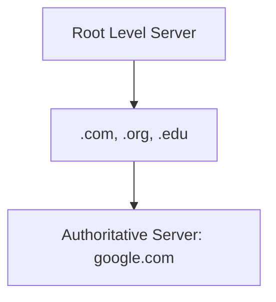

# Chapter 05 — Application Layer — Computer Networking 🌐

# Topic 17: DNS (The Phonebook of Internet)
DNS মানুষের পড়াযোগ্য নামকে আইপিতে রূপান্তর করে।

### 17.1 DNS Hierarchy

### 17.2 Recursive vs Iterative Query
- **Recursive:** DNS সার্ভার নিজেই সব তথ্য খুঁজে এনে দেয়।
- **Iterative:** DNS সার্ভার শুধু বলে দেয় "আমি জানি না, অমুক সার্ভারকে জিজ্ঞেস করো"।

---

# Topic 18: HTTP Status Codes
- **200 OK:** সাকসেস।
- **404 Not Found:** পেজ নেই।
- **500 Server Error:** সার্ভারে সমস্যা।

---

### 🧠 Practice Zone
1. ইমেইল পাঠানোর প্রোটোকল কোনটি? (SMTP)
2. DNS Hierarchy তে সবার ওপরে কোন সার্ভার থাকে? (Root Server)
