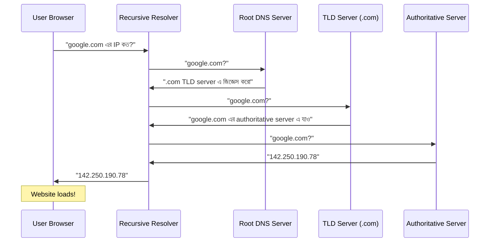
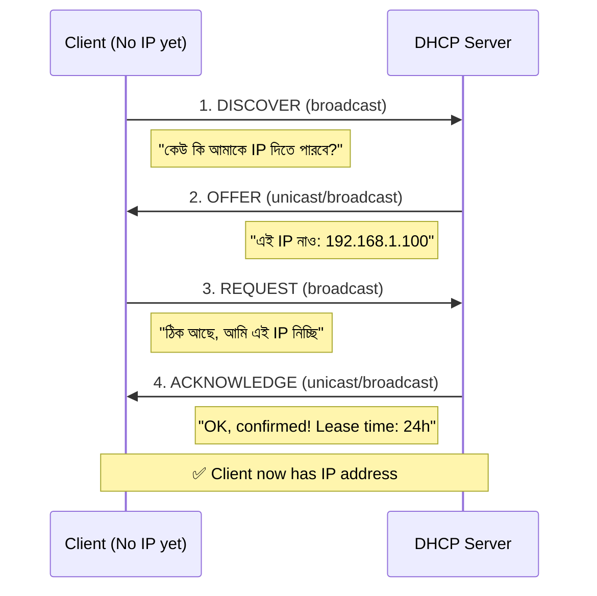
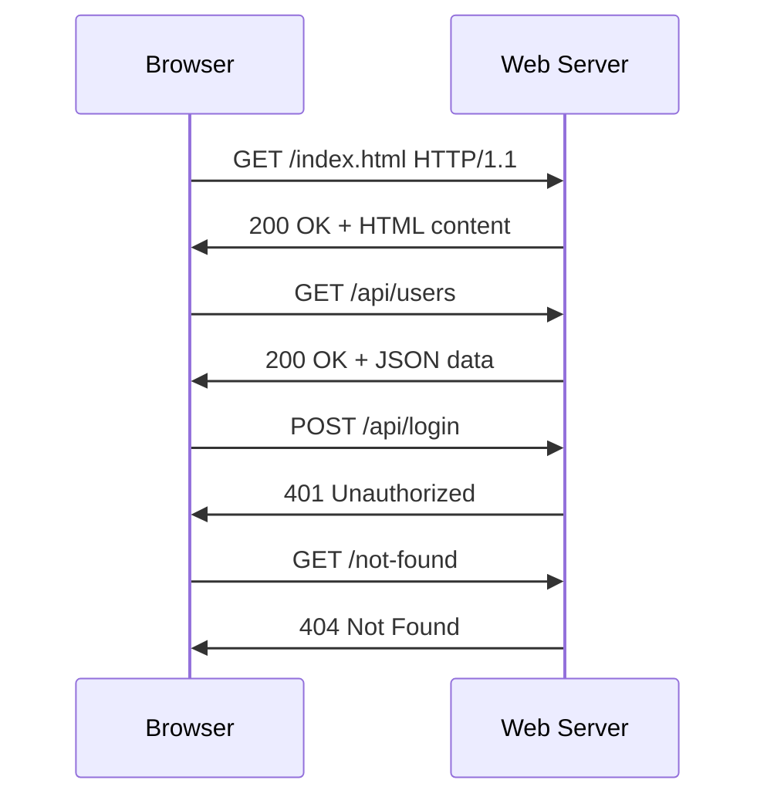
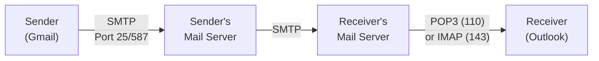
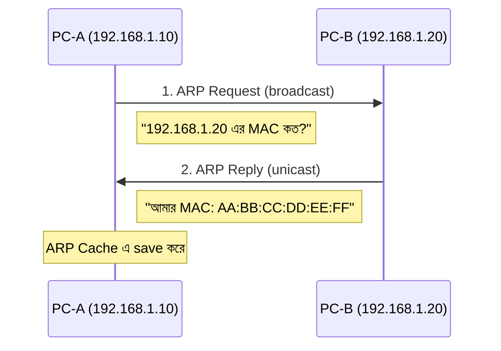

# Chapter 05 — Application Layer Protocols — Computer Networking 🌐

> DNS, DHCP, HTTP/HTTPS, email protocols, FTP, ARP/ICMP।

---
# LEVEL 5: APPLICATION LAYER PROTOCOLS

*আমরা প্রতিদিন যেসব protocol ব্যবহার করি — DNS, HTTP, Email — সব এখানে*


---
---

# Topic 18: DNS (Domain Name System)

<div align="center">

*"DNS = Internet এর phonebook — নাম বললে number দেয়"*

</div>

---

## 📖 18.1 ধারণা (Concept)

**DNS (Domain Name System)** হলো **domain name কে IP address এ translate** করার system। মানুষ domain name মনে রাখে (google.com), কিন্তু computer IP address বোঝে (142.250.190.78)।



### DNS Hierarchy

```
                    . (Root)
                   / | \
               .com .org .net .bd    ← TLD (Top Level Domain)
              / |
        google  facebook             ← Second Level Domain
          |
         www                         ← Subdomain
         
FQDN: www.google.com.
       │    │      │  │
       │    │      │  └── Root (.)
       │    │      └───── TLD
       │    └──────────── Second Level Domain
       └───────────────── Subdomain
```

### DNS Record Types (পরীক্ষায় আসবেই)

| Record | পূর্ণরূপ | কাজ | Example |
|--------|---------|-----|---------|
| **A** | Address | Domain → **IPv4** address | google.com → 142.250.190.78 |
| **AAAA** | - | Domain → **IPv6** address | google.com → 2607:f8b0::200e |
| **CNAME** | Canonical Name | Domain → **another domain** (alias) | www.google.com → google.com |
| **MX** | Mail Exchange | Domain → **mail server** | gmail.com → smtp.google.com |
| **NS** | Name Server | Domain → **authoritative DNS server** | google.com → ns1.google.com |
| **PTR** | Pointer | **IP → Domain** (reverse DNS) | 142.250.190.78 → google.com |
| **SOA** | Start of Authority | Zone এর primary info | Serial, refresh, retry |
| **TXT** | Text | Arbitrary text (SPF, DKIM verification) | v=spf1 include:... |

### Recursive vs Iterative Query

| বিষয় | Recursive | Iterative |
|-------|-----------|-----------|
| **কে করে** | Client → Resolver | Resolver → DNS servers |
| **কিভাবে** | Resolver পুরো answer বের করে দেয় | প্রতিটি server "আমি জানি না, ওকে জিজ্ঞেস করো" বলে |
| **কাজ কার বেশি** | Resolver এর | Client/Resolver এর |

---

## ❓ 18.2 MCQ Problems

**Q1.** DNS কোন port এ কাজ করে?

- (a) 80
- (b) 25
- (c) 53 ✅
- (d) 443

**Q2.** A record কী করে?

- (a) Domain কে IPv6 address এ map করে
- (b) Domain কে IPv4 address এ map করে ✅
- (c) IP কে Domain এ map করে
- (d) Domain কে mail server এ map করে

**Q3.** Reverse DNS lookup কোন record ব্যবহার করে?

- (a) A
- (b) AAAA
- (c) CNAME
- (d) PTR ✅

> **ব্যাখ্যা:** **PTR (Pointer)** record = IP → Domain name resolve করে — এটা **reverse DNS lookup**।

**Q4.** MX record কিসের জন্য?

- (a) Web server
- (b) Mail server ✅
- (c) FTP server
- (d) DNS server

**Q5.** DNS সাধারণত কোন transport protocol ব্যবহার করে?

- (a) TCP
- (b) UDP ✅
- (c) ICMP
- (d) ARP

---

## 📝 18.3 Summary

- **DNS** = Domain → IP translation, **port 53**
- **Hierarchy:** Root → TLD → Second Level → Subdomain
- **A record** = Domain → IPv4, **AAAA** = Domain → IPv6
- **CNAME** = alias, **MX** = mail server, **PTR** = reverse DNS
- **NS** = authoritative DNS server, **TXT** = SPF/DKIM
- সাধারণত **UDP**, বড় response হলে **TCP**

---
---

# Topic 19: DHCP (Dynamic Host Configuration)

<div align="center">

*"Device plug-in করলেই automatically IP পায় — এটাই DHCP এর কাজ"*

</div>

---

## 📖 19.1 ধারণা (Concept)

**DHCP (Dynamic Host Configuration Protocol)** automatically network device কে **IP address, subnet mask, default gateway, DNS server** assign করে। Manual configuration এর দরকার হয় না।

### DORA Process (DHCP 4-Step)



**মনে রাখুন: DORA = Discover → Offer → Request → Acknowledge**

### DHCP কী কী তথ্য দেয়?

| তথ্য | উদাহরণ |
|------|--------|
| **IP Address** | 192.168.1.100 |
| **Subnet Mask** | 255.255.255.0 |
| **Default Gateway** | 192.168.1.1 |
| **DNS Server** | 8.8.8.8 |
| **Lease Time** | 24 hours |

### DHCP Port Numbers

| | Port |
|--|------|
| **DHCP Server** | UDP **67** |
| **DHCP Client** | UDP **68** |

---

## ❓ 19.2 MCQ Problems

**Q1.** DHCP DORA process এর সঠিক sequence কোনটি?

- (a) Discover → Acknowledge → Request → Offer
- (b) Discover → Offer → Request → Acknowledge ✅
- (c) Request → Discover → Offer → Acknowledge
- (d) Offer → Discover → Acknowledge → Request

**Q2.** DHCP server কোন port ব্যবহার করে?

- (a) UDP 53
- (b) TCP 67
- (c) UDP 67 ✅
- (d) UDP 68

**Q3.** DHCP server না পেলে Windows কোন IP assign করে?

- (a) 0.0.0.0
- (b) 127.0.0.1
- (c) 169.254.x.x (APIPA) ✅
- (d) 255.255.255.255

---

## 📝 19.3 Summary

- **DHCP** = Automatic IP assignment, UDP port **67** (server) / **68** (client)
- **DORA:** Discover → Offer → Request → Acknowledge
- IP, Subnet Mask, Gateway, DNS, Lease Time — সব auto assign হয়
- DHCP না পেলে → **APIPA (169.254.x.x)**

---
---

# Topic 20: HTTP/HTTPS

<div align="center">

*"Web এর ভিত্তি — HTTP দিয়েই আপনি এই page পড়ছেন"*

</div>

---

## 📖 20.1 ধারণা (Concept)

**HTTP (HyperText Transfer Protocol)** হলো **web communication** এর protocol — browser ও web server এর মধ্যে data আদান-প্রদান করে।

**HTTPS = HTTP + TLS/SSL** (encrypted, secure)



### HTTP Methods

| Method | কাজ | Example |
|--------|-----|---------|
| **GET** | Data **চাওয়া** (read) | Web page load করা |
| **POST** | Data **পাঠানো** (create) | Form submit, login |
| **PUT** | Data **পুরো update** করা | Profile update |
| **PATCH** | Data **আংশিক update** | শুধু name change |
| **DELETE** | Data **মুছে ফেলা** | Account delete |
| **HEAD** | শুধু header চাওয়া (body ছাড়া) | File size check |
| **OPTIONS** | Server কোন methods support করে | CORS preflight |

### HTTP Status Codes (পরীক্ষায় আসবেই)

| Code Range | Category | Common Codes |
|-----------|----------|-------------|
| **1xx** | Informational | 100 Continue |
| **2xx** | **Success** | **200 OK**, 201 Created, 204 No Content |
| **3xx** | **Redirection** | **301 Moved Permanently**, 302 Found, 304 Not Modified |
| **4xx** | **Client Error** | **400 Bad Request**, **401 Unauthorized**, **403 Forbidden**, **404 Not Found**, 405 Method Not Allowed |
| **5xx** | **Server Error** | **500 Internal Server Error**, **502 Bad Gateway**, **503 Service Unavailable** |

### HTTP Version Comparison

| বৈশিষ্ট্য | HTTP/1.1 | HTTP/2 | HTTP/3 |
|-----------|---------|--------|--------|
| **Year** | 1997 | 2015 | 2022 |
| **Connection** | Multiple TCP connections | Single TCP, multiplexing | **QUIC (UDP-based)** |
| **Header** | Text | Binary + compression | Binary + compression |
| **Server Push** | No | Yes | Yes |
| **Performance** | Slowest | Fast | **Fastest** |

### HTTP vs HTTPS

| বিষয় | HTTP | HTTPS |
|-------|------|-------|
| **Port** | 80 | 443 |
| **Security** | No encryption | TLS/SSL encrypted |
| **URL** | http:// | https:// |
| **Certificate** | না | SSL/TLS Certificate দরকার |
| **SEO** | Lower ranking | Google prefers HTTPS |

---

## ❓ 20.2 MCQ Problems

**Q1.** HTTP 404 error মানে কী?

- (a) Server error
- (b) Unauthorized
- (c) Page Not Found ✅
- (d) Bad Request

**Q2.** HTTPS কোন port ব্যবহার করে?

- (a) 80
- (b) 8080
- (c) 443 ✅
- (d) 22

**Q3.** HTTP/3 কোন transport protocol ব্যবহার করে?

- (a) TCP
- (b) UDP (QUIC) ✅
- (c) ICMP
- (d) SCTP

> **ব্যাখ্যা:** HTTP/3 **QUIC** protocol ব্যবহার করে যেটা **UDP-based** — TCP এর overhead এড়িয়ে faster connection।

**Q4.** কোন HTTP method data create করে?

- (a) GET
- (b) POST ✅
- (c) DELETE
- (d) HEAD

**Q5.** HTTP 500 কোন ধরনের error?

- (a) Client Error
- (b) Server Error ✅
- (c) Redirection
- (d) Success

---

## 📝 20.3 Summary

- **HTTP** = Web communication protocol, **port 80**
- **HTTPS** = HTTP + TLS/SSL, **port 443**, encrypted
- **Methods:** GET (read), POST (create), PUT (update), DELETE (remove)
- **Status:** 2xx = Success, 3xx = Redirect, 4xx = Client error, 5xx = Server error
- **HTTP/3** = QUIC (UDP-based) — fastest

---
---

# Topic 21: Email Protocols (SMTP, POP3, IMAP)

<div align="center">

*"Email পাঠাতে SMTP, receive করতে POP3 বা IMAP"*

</div>

---

## 📖 21.1 ধারণা (Concept)



### তিনটি Email Protocol

| Protocol | Port | কাজ | Direction |
|----------|------|-----|-----------|
| **SMTP** | 25 (587 secure) | Email **পাঠানো** | Client → Server, Server → Server |
| **POP3** | 110 (995 secure) | Email **receive** করা | Server → Client |
| **IMAP** | 143 (993 secure) | Email **receive** করা (advanced) | Server → Client |

### POP3 vs IMAP

| বিষয় | POP3 | IMAP |
|-------|------|------|
| **Download** | Server থেকে download করে **delete** করে | Server এ **রেখে দেয়** |
| **Multiple Device** | ❌ একটা device থেকেই access | ✅ একাধিক device |
| **Storage** | Local device এ | Server এ (cloud) |
| **Offline** | হ্যাঁ (download করা থাকে) | সীমিত |
| **Use** | পুরনো, কম ব্যবহৃত | **আধুনিক, বেশি ব্যবহৃত** |

---

## ❓ 21.2 MCQ Problems

**Q1.** Email পাঠাতে কোন protocol ব্যবহৃত হয়?

- (a) POP3
- (b) IMAP
- (c) SMTP ✅
- (d) HTTP

**Q2.** IMAP কোন port ব্যবহার করে?

- (a) 25
- (b) 110
- (c) 143 ✅
- (d) 993

> **ব্যাখ্যা:** IMAP = **143** (unsecure), **993** (secure/SSL)। POP3 = 110/995।

**Q3.** Multiple device এ email sync রাখতে কোন protocol ভালো?

- (a) SMTP
- (b) POP3
- (c) IMAP ✅
- (d) FTP

---

## 📝 21.3 Summary

- **SMTP** = Email send, port **25/587**
- **POP3** = Email receive + download + delete from server, port **110/995**
- **IMAP** = Email receive + keep on server + multi-device sync, port **143/993**
- **IMAP** আধুনিক ও বেশি ব্যবহৃত

---
---

# Topic 22: FTP, SFTP, TFTP

<div align="center">

*"File transfer এর তিনটি protocol — কোনটা কখন ব্যবহার হয়?"*

</div>

---

## 📖 22.1 ধারণা (Concept)

| Protocol | Port | Security | Connection | Speed | Use |
|----------|------|----------|-----------|-------|-----|
| **FTP** | 20 (data), 21 (control) | ❌ Insecure (plain text) | TCP | Medium | Traditional file transfer |
| **SFTP** | 22 | ✅ Secure (SSH encrypted) | TCP | Slower | Secure file transfer |
| **TFTP** | 69 | ❌ Insecure | **UDP** | Fast | Firmware upload, PXE boot |

### FTP Active vs Passive Mode

| Mode | কিভাবে কাজ করে | Firewall |
|------|----------------|----------|
| **Active** | Server client এর কাছে data connection initiate করে | Firewall block করতে পারে |
| **Passive** | Client server এর কাছে data connection initiate করে | Firewall-friendly |

---

## ❓ 22.2 MCQ Problems

**Q1.** SFTP কোন port ব্যবহার করে?

- (a) 20
- (b) 21
- (c) 22 ✅
- (d) 69

> **ব্যাখ্যা:** **SFTP** = SSH File Transfer Protocol — SSH এর port **22** ব্যবহার করে।

**Q2.** TFTP কোন transport protocol ব্যবহার করে?

- (a) TCP
- (b) UDP ✅

**Q3.** কোনটি সবচেয়ে secure file transfer protocol?

- (a) FTP
- (b) SFTP ✅
- (c) TFTP
- (d) সবই সমান

---

## 📝 22.3 Summary

- **FTP** = Port 20/21, TCP, insecure — traditional
- **SFTP** = Port 22, TCP, **SSH encrypted** — secure
- **TFTP** = Port 69, **UDP**, insecure — fast, simple (firmware)

---
---

# Topic 23: ARP, RARP, ICMP

<div align="center">

*"ARP = IP থেকে MAC বের করে, ICMP = ping/traceroute"*

</div>

---

## 📖 23.1 ধারণা (Concept)

### ARP (Address Resolution Protocol)

**IP address → MAC address** resolve করে। Network Layer (IP) জানে destination IP, কিন্তু Data Link Layer (Ethernet) MAC address চায় — ARP এই gap fill করে।



**ARP Table/Cache:** device তার জানা IP-MAC mapping গুলো cache এ রাখে — বারবার ARP request না করতে হয়।

### RARP (Reverse ARP)

**MAC address → IP address** resolve করে (ARP এর উল্টো)। পুরনো — এখন **DHCP** দিয়ে replace হয়েছে।

### ICMP (Internet Control Message Protocol)

**Error reporting ও diagnostic** — network সমস্যা জানাতে ব্যবহৃত হয়।

| ICMP Tool | কাজ |
|-----------|-----|
| **ping** | Destination reachable কিনা check করে (Echo Request/Reply) |
| **traceroute/tracert** | Source → Destination পথে কোন কোন router আছে দেখায় |

**ICMP Message Types:**

| Type | Name | কখন |
|------|------|------|
| 0 | Echo Reply | ping reply |
| 3 | Destination Unreachable | destination পৌঁছানো যাচ্ছে না |
| 5 | Redirect | better route আছে |
| 8 | Echo Request | ping request |
| 11 | Time Exceeded | TTL expired (traceroute এ ব্যবহৃত) |

---

## ❓ 23.2 MCQ Problems

**Q1.** ARP কী করে?

- (a) IP → MAC ✅
- (b) MAC → IP
- (c) Domain → IP
- (d) IP → Domain

**Q2.** ping command কোন protocol ব্যবহার করে?

- (a) TCP
- (b) UDP
- (c) ICMP ✅
- (d) ARP

**Q3.** ARP Request কোন ধরনের?

- (a) Unicast
- (b) Broadcast ✅
- (c) Multicast
- (d) Anycast

> **ব্যাখ্যা:** ARP Request হলো **broadcast** — "কার IP 192.168.1.20?" সবাইকে জিজ্ঞেস করে। Reply হলো **unicast** — শুধু requester কে answer পাঠায়।

**Q4.** RARP এর replacement কোনটি?

- (a) ARP
- (b) DNS
- (c) DHCP ✅
- (d) ICMP

---

## 📝 23.3 Summary

- **ARP** = IP → MAC address, request = broadcast, reply = unicast
- **RARP** = MAC → IP (obsolete, replaced by **DHCP**)
- **ICMP** = Error reporting ও diagnostics
- **ping** = ICMP Echo Request/Reply (reachability check)
- **traceroute** = ICMP Time Exceeded (path discovery)

---

> **Level 5 সম্পূর্ণ!** 🎉 DNS, DHCP, HTTP, Email, FTP, ARP/ICMP — Application Layer এর সব commonly used protocols শেখা হয়ে গেছে।

---
---


---

## 🔗 Navigation

- 🏠 Back to [Computer Networking — Master Index](00-master-index.md)
- ⬅️ Previous: [Chapter 04 — Transport Layer Protocols](04-transport-layer.md)
- ➡️ Next: [Chapter 06 — Routing & Switching](06-routing-switching.md)
