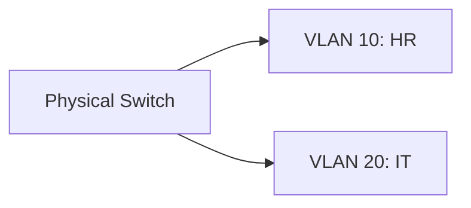

# Chapter 06 — Routing & Switching — Computer Networking 🌐

# Topic 20: Routing Protocols (RIP vs OSPF vs BGP)
| Feature | RIP | OSPF | BGP |
| :--- | :--- | :--- | :--- |
| **Metric** | Hop Count | Link Cost (Dijkstra) | Path Vector |
| **Speed** | Slow Convergence | Fast | Standard |
| **Usage** | Small Network | Large/Intranet | Internet (ISP) |

---

# Topic 21: VLAN (Virtual LAN)
একটি ফিজিক্যাল সুইচকে একাধিক লজিক্যাল ভাগে ভাগ করাকে VLAN বলে।

---

### 🧠 Practice Zone
1. ১৫টির বেশি হপ (Hop) হলে কোন প্রোটোকল কাজ করে না? (RIP)
2. ইন্টারনেটের ব্যাকবোন প্রোটোকল কোনটি? (BGP)
