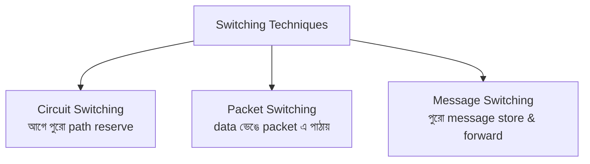
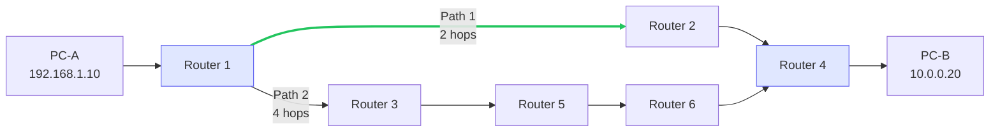
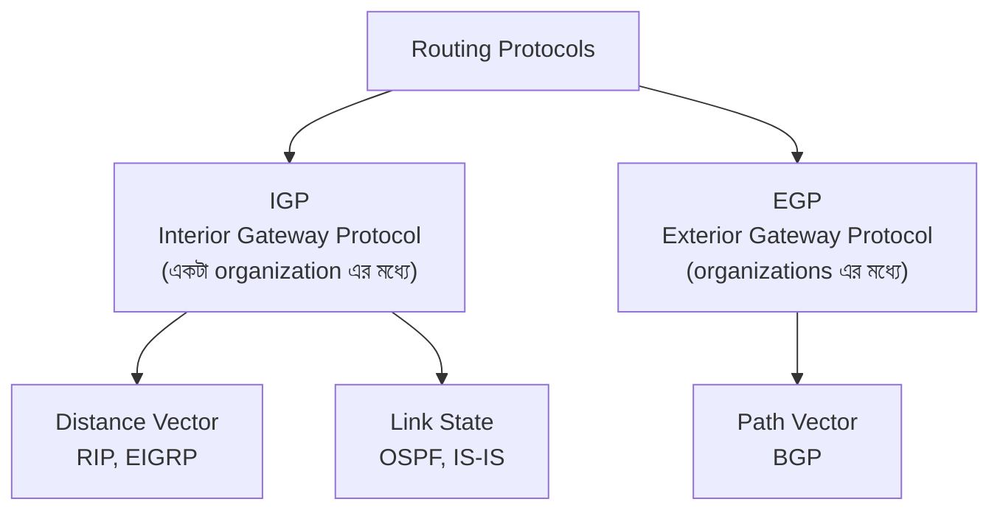

# Chapter 06 — Routing & Switching — Computer Networking 🌐

> Switching, routing basics, routing protocols, VLAN, STP।

---
# LEVEL 6: ROUTING & SWITCHING

*Data network এর মধ্যে কিভাবে চলাচল করে — Switching ও Routing এর core concepts*


---
---

# Topic 24: Switching Concepts

<div align="center">

*"Data এক point থেকে অন্য point এ কিভাবে পৌঁছায় — তিনটি switching technique"*

</div>

---

## 📖 24.1 ধারণা (Concept)

**Switching** হলো network এ data কে source থেকে destination পর্যন্ত পৌঁছানোর technique।



### তিন ধরনের Switching

| বৈশিষ্ট্য | Circuit Switching | Packet Switching | Message Switching |
|-----------|------------------|-----------------|-------------------|
| **কিভাবে** | পুরো path আগে reserve করে | Data ভেঙে packet এ, আলাদা path এ যেতে পারে | পুরো message store করে forward |
| **Path** | Dedicated, fixed | Dynamic, packet ভিন্ন path নিতে পারে | Store-and-forward |
| **Bandwidth** | Reserved (waste হতে পারে) | Shared (efficient) | Shared |
| **Delay** | Connection setup এ delay | কম delay | বেশি delay |
| **Reliability** | High | Medium | Low |
| **Example** | **Telephone call** | **Internet (IP)** | **Email (old)** |
| **Real-time** | ✅ ভালো | Medium | ❌ খারাপ |

### Packet Switching এর দুটি Type

| Type | কিভাবে কাজ করে | Protocol |
|------|----------------|----------|
| **Datagram** | প্রতিটি packet স্বাধীন, ভিন্ন path নিতে পারে, unordered আসতে পারে | **IP** |
| **Virtual Circuit** | আগে virtual path setup, সব packet same path এ, ordered | **ATM, MPLS** |

---

## ❓ 24.2 MCQ Problems

**Q1.** Telephone call কোন switching ব্যবহার করে?

- (a) Packet Switching
- (b) Circuit Switching ✅
- (c) Message Switching
- (d) Cell Switching

> **ব্যাখ্যা:** Traditional telephone call **Circuit Switching** ব্যবহার করে — call এর সময় পুরো path dedicated থাকে।

**Q2.** Internet কোন switching technique ব্যবহার করে?

- (a) Circuit Switching
- (b) Packet Switching ✅
- (c) Message Switching
- (d) Manual Switching

**Q3.** কোন switching এ bandwidth সবচেয়ে efficiently ব্যবহৃত হয়?

- (a) Circuit Switching
- (b) Packet Switching ✅
- (c) Message Switching
- (d) সবই সমান

> **ব্যাখ্যা:** **Packet Switching** এ bandwidth shared — data না পাঠালে bandwidth অন্যরা ব্যবহার করতে পারে। Circuit Switching এ reserved থাকে, ব্যবহার না হলেও waste হয়।

---

## 📝 24.3 Summary

- **Circuit Switching** = dedicated path, telephone call, bandwidth waste
- **Packet Switching** = data ভেঙে packet, **Internet**, efficient bandwidth
- **Message Switching** = store-and-forward, old email, বেশি delay
- Packet Switching > Circuit Switching (efficiency তে)

---
---

# Topic 25: Routing Basics

<div align="center">

*"Router কিভাবে decide করে data কোন পথে পাঠাবে?"*

</div>

---

## 📖 25.1 ধারণা (Concept)



**Routing** হলো **source থেকে destination পর্যন্ত best path select** করার process। Router **routing table** দেখে decide করে কোন interface দিয়ে packet forward করবে।

### Routing Table

```
Destination Network    Subnet Mask        Next Hop         Interface    Metric
192.168.1.0           255.255.255.0      0.0.0.0          eth0         0
10.0.0.0              255.0.0.0          192.168.1.1      eth0         1
0.0.0.0               0.0.0.0           192.168.1.1      eth0         10
(default route)
```

### Static vs Dynamic Routing

| বিষয় | Static Routing | Dynamic Routing |
|-------|---------------|-----------------|
| **Configuration** | Admin manually করে | Router নিজে শেখে |
| **Update** | Manual change | Automatic update |
| **Scalability** | ❌ বড় network এ কঠিন | ✅ বড় network এ ভালো |
| **Bandwidth** | Routing traffic নেই | Routing protocol traffic আছে |
| **CPU Usage** | কম | বেশি |
| **Security** | বেশি (admin control) | কম (routing attacks possible) |
| **Use** | ছোট network, stub network | বড় network, enterprise |
| **Convergence** | Instant (manual) | Time লাগে |

### Routing Metrics

| Metric | কী measure করে |
|--------|----------------|
| **Hop Count** | কতটি router পার করতে হবে (RIP) |
| **Bandwidth** | Link এর speed (OSPF) |
| **Delay** | Data পৌঁছাতে কত সময় লাগে |
| **Load** | Link কতটুকু busy |
| **Reliability** | Link কতটুকু reliable |
| **Cost** | Administrative cost |

---

## ❓ 25.2 MCQ Problems

**Q1.** Static routing এ route কে configure করে?

- (a) Router নিজে
- (b) Network administrator ✅
- (c) DHCP server
- (d) DNS server

**Q2.** Default route এর destination কত?

- (a) 127.0.0.1
- (b) 255.255.255.255
- (c) 0.0.0.0 ✅
- (d) 192.168.1.1

> **ব্যাখ্যা:** **0.0.0.0/0** হলো **default route** — routing table এ specific match না পেলে এই route ব্যবহার হয়।

**Q3.** RIP কোন metric ব্যবহার করে?

- (a) Bandwidth
- (b) Delay
- (c) Hop Count ✅
- (d) Cost

---

## 📝 25.3 Summary

- **Routing** = best path selection, **routing table** ব্যবহার করে
- **Static** = manual, ছোট network, **Dynamic** = automatic, বড় network
- **Default route** = 0.0.0.0/0 (catch-all)
- **Metrics:** Hop count (RIP), bandwidth (OSPF), delay, cost

---
---

# Topic 26: Routing Protocols

<div align="center">

*"RIP, OSPF, BGP — প্রতিটি protocol ভিন্ন ভাবে best path বের করে"*

</div>

---

## 📖 26.1 ধারণা (Concept)

### Routing Protocol Categories



### প্রধান Routing Protocols

| Protocol | Type | Algorithm | Metric | Max Hop | Use |
|----------|------|-----------|--------|---------|-----|
| **RIP** | Distance Vector | Bellman-Ford | Hop Count | 15 | ছোট network |
| **RIPv2** | Distance Vector | Bellman-Ford | Hop Count | 15 | ছোট network + VLSM |
| **OSPF** | Link State | Dijkstra (SPF) | Cost (bandwidth) | No limit | **Enterprise — সবচেয়ে বেশি ব্যবহৃত IGP** |
| **EIGRP** | Hybrid/Advanced DV | DUAL | Composite | 255 | Cisco proprietary |
| **BGP** | Path Vector | Best Path | Path attributes | No limit | **Internet — ISP গুলোর মধ্যে** |

### Distance Vector vs Link State

| বিষয় | Distance Vector (RIP) | Link State (OSPF) |
|-------|----------------------|-------------------|
| **জানে** | শুধু neighbors এর info | পুরো network এর map |
| **Update** | পুরো routing table পাঠায় | শুধু change পাঠায় |
| **Timer** | Periodic (30 sec) | Event-driven (change হলে) |
| **Convergence** | ধীর | দ্রুত |
| **Bandwidth Usage** | বেশি | কম |
| **CPU/Memory** | কম | বেশি |
| **Loop Prevention** | Split Horizon, Route Poisoning | SPF algorithm |
| **Scalability** | ❌ Limited | ✅ Excellent |
| **Analogy** | "রাস্তায় পথচারীকে জিজ্ঞেস করা" | "Google Maps এ পুরো map দেখা" |

### RIP (Routing Information Protocol)

| বৈশিষ্ট্য | বিবরণ |
|-----------|-------|
| **Type** | Distance Vector |
| **Metric** | Hop Count (max **15**, 16 = unreachable) |
| **Update Timer** | 30 seconds |
| **Transport** | UDP port 520 |
| **Algorithm** | Bellman-Ford |
| **Problem** | Slow convergence, routing loops |

### OSPF (Open Shortest Path First)

| বৈশিষ্ট্য | বিবরণ |
|-----------|-------|
| **Type** | Link State |
| **Metric** | Cost (based on bandwidth) — `Cost = 10⁸ / Bandwidth` |
| **Update** | Event-driven (change হলেই) |
| **Transport** | IP Protocol 89 |
| **Algorithm** | Dijkstra's SPF (Shortest Path First) |
| **Areas** | Area 0 = backbone, hierarchical design |
| **Advantage** | Fast convergence, scalable, no hop limit |

### BGP (Border Gateway Protocol)

| বৈশিষ্ট্য | বিবরণ |
|-----------|-------|
| **Type** | Path Vector |
| **Use** | **Internet backbone** — ISP গুলোর মধ্যে routing |
| **Transport** | TCP port **179** |
| **Metric** | Path attributes (AS path, weight, local pref) |
| **Nickname** | "Protocol of the Internet" |

---

## ❓ 26.2 MCQ Problems

**Q1.** RIP এর maximum hop count কত?

- (a) 10
- (b) 15 ✅
- (c) 30
- (d) 255

> **ব্যাখ্যা:** RIP এ max hop count **15**। 16 মানে **unreachable/infinity**। তাই RIP বড় network এ ব্যবহার করা যায় না।

**Q2.** OSPF কোন algorithm ব্যবহার করে?

- (a) Bellman-Ford
- (b) Dijkstra (SPF) ✅
- (c) DUAL
- (d) Floyd-Warshall

**Q3.** Internet এ ISP গুলো কোন routing protocol ব্যবহার করে?

- (a) RIP
- (b) OSPF
- (c) BGP ✅
- (d) EIGRP

**Q4.** কোনটি Link State routing protocol?

- (a) RIP
- (b) BGP
- (c) OSPF ✅
- (d) EIGRP

**Q5.** OSPF cost calculation formula কোনটি?

- (a) 10⁶ / Bandwidth
- (b) 10⁸ / Bandwidth ✅
- (c) Bandwidth / 10⁸
- (d) Hop Count

**Q6.** BGP কোন port ব্যবহার করে?

- (a) UDP 520
- (b) TCP 179 ✅
- (c) TCP 80
- (d) UDP 53

---

## ⚠️ 26.3 Tricky Parts

> ⚠️ **Trap 1:** "RIP কি বড় network এ ব্যবহৃত হয়?" — **না**, max 15 hop limit। বড় network এ **OSPF** ব্যবহৃত হয়।

> ⚠️ **Trap 2:** "EIGRP কি open standard?" — **না**, EIGRP **Cisco proprietary** (though partially opened later)। OSPF হলো **open standard**।

> ⚠️ **Trap 3:** "BGP কি IGP?" — **না**, BGP হলো **EGP (Exterior Gateway Protocol)** — different autonomous systems (ISPs) এর মধ্যে routing করে।

---

## 📝 26.4 Summary

- **RIP** = Distance Vector, hop count (max 15), ছোট network, ধীর
- **OSPF** = Link State, Dijkstra, cost (bandwidth), **enterprise standard**, দ্রুত
- **BGP** = Path Vector, TCP 179, **Internet backbone**, ISP-to-ISP
- **Distance Vector** = neighbors থেকে শেখে, **Link State** = পুরো map জানে
- **IGP** = organization এর মধ্যে (RIP, OSPF), **EGP** = organization এর বাইরে (BGP)

---
---

# Topic 27: VLAN & Inter-VLAN Routing

<div align="center">

*"একটাই physical switch, কিন্তু logically আলাদা আলাদা network — এটাই VLAN"*

</div>

---

## 📖 27.1 ধারণা (Concept)

**VLAN (Virtual LAN)** হলো একটা physical switch কে **logically আলাদা আলাদা network (broadcast domain)** এ ভাগ করা।

```
Without VLAN:                      With VLAN:
┌──────────────────────┐          ┌──────────────────────┐
│      One Switch      │          │      One Switch      │
│ All 24 ports = 1     │          │ VLAN 10: Port 1-8    │ HR
│ broadcast domain     │          │ VLAN 20: Port 9-16   │ IT
│ (সবাই সবার broadcast │          │ VLAN 30: Port 17-24  │ Sales
│  পায় — slow, unsafe) │          │ (আলাদা broadcast)    │
└──────────────────────┘          └──────────────────────┘
```

### কেন VLAN দরকার?

| সুবিধা | বিবরণ |
|--------|-------|
| **Security** | HR এর data IT department দেখতে পারবে না |
| **Performance** | Broadcast domain ছোট = কম broadcast traffic |
| **Flexibility** | Physical location change না করেই VLAN change করা যায় |
| **Cost** | আলাদা switch না কিনে একটা switch এই কাজ হয় |

### VLAN Port Types

| Port Type | কাজ |
|-----------|-----|
| **Access Port** | একটা VLAN এ belong করে, end device connected (PC, printer) |
| **Trunk Port** | **Multiple VLAN** এর traffic carry করে (switch-to-switch connection) |

### Trunk এ VLAN Tagging (802.1Q)

Trunk port এ data যাওয়ার সময় frame এ **VLAN tag** যোগ হয় — যাতে অন্য switch বুঝতে পারে এই frame কোন VLAN এর।

```
Normal Frame:  [MAC Header][Data][FCS]
Tagged Frame:  [MAC Header][802.1Q Tag (VLAN ID)][Data][FCS]
                            ├── 4 bytes ──┤
                            VLAN ID = 12 bits (1-4094)
```

### Inter-VLAN Routing

VLAN গুলো আলাদা broadcast domain — তাই **একটা VLAN থেকে অন্য VLAN এ যেতে Router দরকার**।

**পদ্ধতি:**
1. **Router-on-a-Stick** — একটা router interface এ sub-interfaces তৈরি করে trunk port দিয়ে connect
2. **Layer 3 Switch** — Switch নিজেই routing করে (SVI — Switch Virtual Interface)

---

## ❓ 27.2 MCQ Problems

**Q1.** VLAN কী করে?

- (a) Speed বাড়ায়
- (b) Broadcast domain ভাগ করে ✅
- (c) IP address assign করে
- (d) Encryption করে

**Q2.** Trunk port কিসের জন্য ব্যবহৃত হয়?

- (a) একটাই VLAN এর traffic carry করতে
- (b) Multiple VLAN এর traffic carry করতে ✅
- (c) Internet connection এর জন্য
- (d) Wireless device connect করতে

**Q3.** 802.1Q কী?

- (a) WiFi standard
- (b) VLAN tagging protocol ✅
- (c) Routing protocol
- (d) Encryption standard

**Q4.** দুটি VLAN এর মধ্যে communication করতে কোন device দরকার?

- (a) Hub
- (b) Switch (Layer 2)
- (c) Router বা Layer 3 Switch ✅
- (d) Repeater

---

## 📝 27.3 Summary

- **VLAN** = logical network division, broadcast domain আলাদা করে
- **Access Port** = একটা VLAN, **Trunk Port** = multiple VLAN traffic
- **802.1Q** = VLAN tagging standard, frame এ VLAN ID যোগ করে
- **Inter-VLAN Routing** = Router বা Layer 3 Switch দিয়ে VLAN গুলোর মধ্যে communication

---
---

# Topic 28: STP (Spanning Tree Protocol)

<div align="center">

*"Switch network এ loop হলে network crash করে — STP loop prevent করে"*

</div>

---

## 📖 28.1 ধারণা (Concept)

**STP (Spanning Tree Protocol — IEEE 802.1D)** হলো Layer 2 protocol যেটা switch network এ **loop prevent** করে redundant links কে logically block করে।

### কেন Loop সমস্যা?

```
Without STP:
Switch A ←──→ Switch B
  ↑              ↑
  └──────────────┘   ← Redundant link = LOOP!

Loop হলে কী হয়?
1. Broadcast Storm — broadcast packet অনন্তকাল ঘুরতে থাকে
2. MAC Table Instability — MAC address table ক্রমাগত change হয়
3. Network Crash — bandwidth 100% consumed
```

### STP কিভাবে কাজ করে

1. **Root Bridge Election** — সবচেয়ে কম **Bridge ID** (Priority + MAC) যার, সে root
2. **Root Port Selection** — প্রতিটি non-root switch এ root এর কাছে যাওয়ার shortest path এর port
3. **Designated Port** — প্রতিটি segment এ একটা port designated (forwarding)
4. **Blocked Port** — বাকি redundant port গুলো blocked (no forwarding)

### STP Port States

| State | কী করে | Duration |
|-------|--------|----------|
| **Blocking** | Data forward করে না, BPDU শোনে | - |
| **Listening** | BPDU পাঠায়/শোনে, data forward করে না | 15 sec |
| **Learning** | MAC address শেখে, data forward করে না | 15 sec |
| **Forwarding** | Data forward করে — **normal operation** | - |
| **Disabled** | Port বন্ধ | - |

> **Total convergence time: ~30-50 seconds** (STP এর বড় সমস্যা — ধীর)

### RSTP (Rapid STP — 802.1w)

STP এর faster version — convergence time **1-2 seconds**।

---

## ❓ 28.2 MCQ Problems

**Q1.** STP এর main purpose কী?

- (a) Routing
- (b) VLAN তৈরি
- (c) Loop prevention ✅
- (d) Encryption

**Q2.** STP Root Bridge কিভাবে elect হয়?

- (a) সবচেয়ে বেশি MAC address
- (b) সবচেয়ে কম Bridge ID ✅
- (c) সবচেয়ে বেশি port
- (d) Random

**Q3.** STP convergence time প্রায় কত?

- (a) 1-2 seconds
- (b) 5-10 seconds
- (c) 30-50 seconds ✅
- (d) 2-3 minutes

> **ব্যাখ্যা:** STP (802.1D) convergence **30-50 seconds**। RSTP (802.1w) অনেক দ্রুত — **1-2 seconds**।

---

## 📝 28.3 Summary

- **STP (802.1D)** = Loop prevention in Layer 2 switch networks
- **Loop হলে:** Broadcast storm, MAC instability, network crash
- **Root Bridge** = lowest Bridge ID (Priority + MAC)
- **Port States:** Blocking → Listening → Learning → **Forwarding**
- **Convergence:** STP = 30-50 sec (slow), **RSTP = 1-2 sec** (fast)

---

> **Level 6 সম্পূর্ণ!** 🎉 Switching, Routing, Routing Protocols, VLAN, STP — network infrastructure এর core concepts শেখা হয়ে গেছে।

---
---


---

## 🔗 Navigation

- 🏠 Back to [Computer Networking — Master Index](00-master-index.md)
- ⬅️ Previous: [Chapter 05 — Application Layer Protocols](05-application-layer.md)
- ➡️ Next: [Chapter 07 — Network Security](07-network-security.md)
