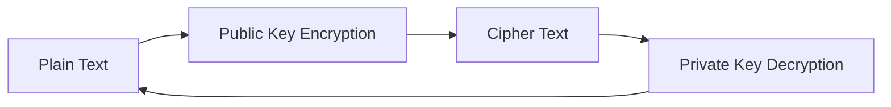

# Chapter 07 — Network Security — Computer Networking 🌐

# Topic 23: Encryption (Symmetric vs Asymmetric)
### 23.1 Symmetric
সেন্ডার এবং রিসিভার একই গোপন কি (Key) ব্যবহার করে।
### 23.2 Asymmetric
দুটি আলাদা কি থাকে: **Public Key** (সবার জন্য) এবং **Private Key** (গোপন)।

---

# Topic 24: SSL/TLS Handshake
HTTPS কানেকশন তৈরির সময় ব্রাউজার এবং সার্ভারের মধ্যে এনক্রিপশন কি এক্সচেঞ্জ হয়। এটাই SSL/TLS হ্যান্ডশেক।

---

### 🧠 Practice Zone

#### MCQ Drill
1. CIA ট্রায়াডের ৩টি স্তম্ভ কী কী?
   - (ক) Confidentiality, Integrity, Access
   - (খ) Confidentiality, Integrity, Availability
   - (গ) Control, Integrity, Availability
   - (ঘ) Confidentiality, Identity, Availability
   - **উত্তর: (খ) Confidentiality, Integrity, Availability**
2. ডিজিটাল সিগনেচারে কোন ধরণের এনক্রিপশন ব্যবহৃত হয়?
   - (ক) Symmetric (খ) Asymmetric (গ) Hash (ঘ) None
   - **উত্তর: (খ) Asymmetric**
3. নিচের কোনটি পাসওয়ার্ড সুরক্ষার জন্য ব্যবহৃত হয়?
   - (ক) SSH (খ) Hashing (গ) FTP (ঘ) Telnet
   - **উত্তর: (খ) Hashing**
4. HTTPS প্রোটোকলে ডেটা সুরক্ষিত করতে কোনটি ব্যবহৃত হয়?
   - (ক) SSL/TLS (খ) SHA (গ) MD5 (ঘ) AES
   - **উত্তর: (ক) SSL/TLS**
5. ফায়ারওয়াল (Firewall) নেটওয়ার্কের কোন লেয়ারে কাজ করতে পারে?
   - (ক) Layer 3 & 4 (খ) Layer 1 only (গ) Layer 2 only (ঘ) None
   - **উত্তর: (ক) Layer 3 & 4 (আরও উন্নত ফায়ারওয়াল লেয়ার ৭ এও কাজ করে)**
6. এক বা একাধিক ইউজারের জন্য "Denial of Service (DoS)" অ্যাটাক মানে কী?
   - (ক) ডেটা চুরি (খ) সার্ভিস বন্ধ করে দেওয়া (গ) পাসওয়ার্ড হ্যাক (ঘ) ভাইরাস ছড়ানো
   - **উত্তর: (খ) সার্ভিস বন্ধ করে দেওয়া**
7. সিমেট্রিক এনক্রিপশনে (Symmetric Encryption) কয়টি কি (Key) থাকে?
   - (ক) ১টি (খ) ২টি (গ) ৩টি (ঘ) অসংখ্য
   - **উত্তর: (ক) ১টি**
8. নিচের কোনটি আনসিকিউর প্রোটোকল?
   - (ক) SSH (খ) HTTPS (গ) Telnet (ঘ) SFTP
   - **উত্তর: (গ) Telnet** (এটি প্লেইন টেক্সটে ডেটা পাঠায়)
9. পাবলিক কি (Public Key) দিয়ে এনক্রিপ্ট করলে ডিক্রিপ্ট করতে কোনটি দরকার?
   - (ক) সেম পাবলিক কি (খ) প্রাইভেট কি (গ) ডিজিটাল সিগনেচার (ঘ) হ্যাশ
   - **উত্তর: (খ) প্রাইভেট কি**
10. ইমেইল স্পুফিং (Email Spoofing) মূলত কোন ধরণের হামলা?
    - (ক) ফিজিক্যাল (খ) সোশ্যাল ইঞ্জিনিয়ারিং (গ) ব্রুট ফোর্স (ঘ) ডস
    - **উত্তর: (খ) সোশ্যাল ইঞ্জিনিয়ারিং**

#### Written Challenge
1. CIA Triad এর ৩টি স্তম্ভ বর্ণনা করুন।
2. Symmetric এবং Asymmetric এনক্রিপশনের মধ্যে ৩টি পার্থক্য বিস্তারিত আলোচনা করুন।
3. **Firewall কী? এটি কীভাবে একটি প্রাইভেট নেটওয়ার্ককে সুরক্ষিত রাখে?**
4. **Digital Signature কীভাবে ডেটার Integrity নিশ্চিত করে?**
5. **SSL/TLS হ্যান্ডশেক প্রসেসটি সহজভাবে ব্যাখ্যা করুন।**

---

### 🔥 Security Concept Analysis (Step-by-Step)

**Problem: ডিজিটাল সিগনেচার মেকানিজম**
ডিজিটাল সিগনেচার কীভাবে কাজ করে?

**ধাপ ১: হ্যাশিং (Hashing)**
সেন্ডার প্রথমে মূল মেসেজটিকে একটি হ্যাশ ফাংশনের মাধ্যমে একটি নির্দিষ্ট লেংথের কোডে (Hash Value) রূপান্তর করে।

**ধাপ ২: এনক্রিপশন (Encryption)**
সেন্ডার তার নিজের **Private Key** দিয়ে ওই হ্যাশ ভ্যালুটিকে এনক্রিপ্ট করে। এটাই হলো "Digital Signature"।

**ধাপ ৩: ভেরিফিকেশন (Verification)**
রিসিভার মেসেজটি পাওয়ার পর সেন্ডারের **Public Key** দিয়ে সিগনেচারটি ডিক্রিপ্ট করে মূল হ্যাশ ভ্যালুটি পায়। এরপর রিসিভার নিজে মেসেজটির নতুন হ্যাশ বের করে এবং দুটি হ্যাশ তুলনা করে দেখে। যদি মিলে যায়, তবে বোঝা যায় মেসেজটি মাঝপথে কেউ পরিবর্তন করেনি (Integrity)।

---

### 🏛️ BPSC/Bank Job Pattern Analysis
- **ব্যাংক জব টিপস:** ব্যাংকিং সিকিউরিটির জন্য RSA এবং SHA অ্যালগরিদম সম্পর্কে বেসিক ধারণা রাখা জরুরি।
- **বিপিএসসি প্রশ্ন:** ওএসআই মডেলের ৭টি লেয়ারের নিরাপত্তা নিশ্চিত করতে কী কী ব্যবস্থা নেওয়া হয়, তা মাঝে মাঝে লিখিত পরীক্ষায় আসে।
- **সাধারণ জ্ঞান:** ফিশিং (Phishing) এবং ভিশিং (Vishing) এর মধ্যে পার্থক্য জেনে রাখুন।

