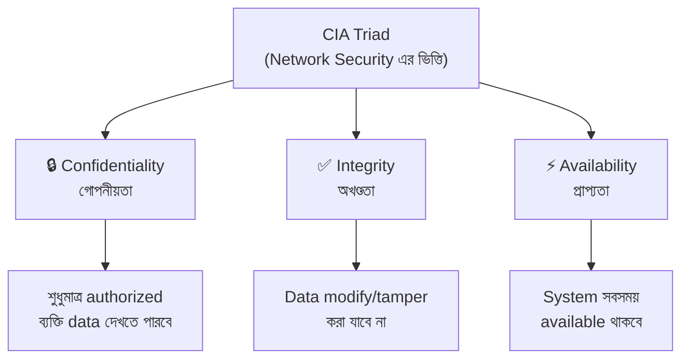
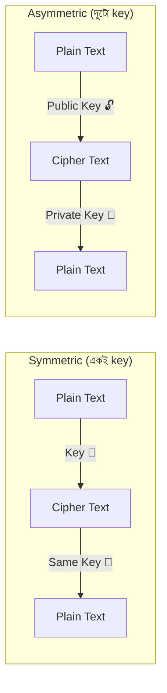
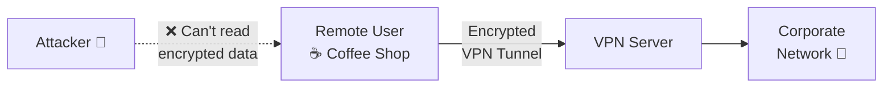

# Chapter 07 — Network Security — Computer Networking 🌐

> Security basics, firewall, IDS/IPS, cryptography, VPN, SSL/TLS, attacks।

---
# LEVEL 7: NETWORK SECURITY

*Network কে attacks থেকে রক্ষা করার concepts ও techniques*


---
---

# Topic 29: Network Security Basics

<div align="center">

*"CIA Triad — network security এর তিনটি মূল স্তম্ভ"*

</div>

---

## 📖 29.1 ধারণা (Concept)

### CIA Triad



| Principle | মানে | Attack Example | Protection |
|-----------|------|---------------|------------|
| **Confidentiality** | Data শুধু authorized user দেখবে | Eavesdropping, data theft | Encryption, access control |
| **Integrity** | Data modify করা হয়নি guarantee | MITM, data tampering | Hashing, digital signatures |
| **Availability** | System সবসময় চালু ও accessible | DoS/DDoS attack | Redundancy, load balancing |

### Common Security Threats

| Threat Type | বিবরণ |
|-------------|-------|
| **Malware** | Virus, Worm, Trojan, Ransomware |
| **Phishing** | ভুয়া email/website দিয়ে তথ্য চুরি |
| **DoS/DDoS** | Server কে overwhelm করে down করা |
| **MITM** | দুই পক্ষের মাঝখানে বসে data চুরি/modify |
| **Social Engineering** | মানুষকে manipulate করে info বের করা |
| **Zero-Day** | Unknown vulnerability exploit |

### AAA Framework

| Component | কাজ | Example |
|-----------|-----|---------|
| **Authentication** | আপনি কে? (identity verify) | Username/Password, Biometric |
| **Authorization** | আপনি কী করতে পারবেন? (permission) | Admin vs User roles |
| **Accounting** | আপনি কী করলেন? (logging) | Audit logs, session tracking |

---

## ❓ 29.2 MCQ Problems

**Q1.** CIA Triad এর "I" কী বোঝায়?

- (a) Intelligence
- (b) Integrity ✅
- (c) Internet
- (d) Infrastructure

**Q2.** DDoS attack কোন CIA principle violate করে?

- (a) Confidentiality
- (b) Integrity
- (c) Availability ✅
- (d) Authentication

> **ব্যাখ্যা:** DDoS attack server কে **unavailable** করে — তাই **Availability** violate হয়।

**Q3.** AAA তে প্রথম "A" কী?

- (a) Authorization
- (b) Authentication ✅
- (c) Accounting
- (d) Availability

---

## 📝 29.3 Summary

- **CIA Triad:** Confidentiality (গোপনীয়তা), Integrity (অখণ্ডতা), Availability (প্রাপ্যতা)
- **AAA:** Authentication → Authorization → Accounting
- **Common Threats:** Malware, Phishing, DoS/DDoS, MITM, Social Engineering

---
---

# Topic 30: Firewall & IDS/IPS

<div align="center">

*"Firewall = দরজায় guard, IDS = CCTV camera, IPS = armed guard"*

</div>

---

## 📖 30.1 ধারণা (Concept)

### Firewall

**Firewall** হলো network security device যেটা **incoming ও outgoing traffic filter** করে predefined rules অনুযায়ী। Trusted (internal) ও untrusted (external/internet) network এর মাঝে বসে।

### Firewall Types

| Type | কিভাবে কাজ করে | Layer | Pros | Cons |
|------|----------------|-------|------|------|
| **Packet Filter** | Header (IP, port) দেখে allow/deny | L3-L4 | Fast, simple | Content দেখে না |
| **Stateful Inspection** | Connection state track করে | L3-L4 | Better security | Slower |
| **Proxy/Application** | Application level traffic inspect | L7 | Deep inspection | Slowest |
| **NGFW** | All of above + DPI, IPS, malware detect | L3-L7 | **Best security** | Expensive |

### IDS vs IPS

| বিষয় | IDS | IPS |
|-------|-----|-----|
| **Full Form** | Intrusion Detection System | Intrusion Prevention System |
| **Action** | **Detect** করে ও **alert** দেয় | **Detect** করে ও **block** করে |
| **Placement** | Network tap (passive) | Inline (active) |
| **Analogy** | CCTV camera — দেখে জানায় | Armed guard — দেখে থামায় |
| **Impact on traffic** | None | Slight latency |

```
Network Traffic Flow:

With IDS (passive):
Traffic ──→ Switch ──→ Destination
                 └──→ IDS (monitor & alert)

With IPS (inline):
Traffic ──→ IPS ──→ Switch ──→ Destination
            │
            └── Block malicious traffic ❌
```

---

## ❓ 30.2 MCQ Problems

**Q1.** কোন firewall application layer এ কাজ করে?

- (a) Packet Filter
- (b) Stateful
- (c) Proxy/Application Firewall ✅
- (d) Hub

**Q2.** IDS ও IPS এর মূল পার্থক্য কী?

- (a) IDS বেশি expensive
- (b) IPS traffic block করতে পারে, IDS শুধু alert দেয় ✅
- (c) IDS faster
- (d) কোন পার্থক্য নেই

**Q3.** NGFW এর পূর্ণরূপ কী?

- (a) Network Gateway Firewall
- (b) Next Generation Firewall ✅
- (c) New Global Firewall
- (d) Network Guard Firewall

---

## 📝 30.3 Summary

- **Firewall** = traffic filter by rules (allow/deny)
- **Types:** Packet Filter < Stateful < Proxy < **NGFW** (best)
- **IDS** = detect + alert (passive), **IPS** = detect + **block** (active)

---
---

# Topic 31: Cryptography Basics

<div align="center">

*"Data কে unreadable করা encryption, readable করা decryption"*

</div>

---

## 📖 31.1 ধারণা (Concept)

**Cryptography** হলো data কে **encrypt (unreadable)** করে **secure** করার বিজ্ঞান।

### Symmetric vs Asymmetric Encryption



| বিষয় | Symmetric | Asymmetric |
|-------|-----------|-----------|
| **Key** | একটাই key (shared secret) | দুটো key (public + private) |
| **Speed** | **Fast** | Slow |
| **Key Distribution** | কঠিন (key share করতে হয়) | সহজ (public key সবাইকে দেওয়া যায়) |
| **Use** | Bulk data encryption | Key exchange, digital signatures |
| **Examples** | AES, DES, 3DES, Blowfish | **RSA**, ECC, Diffie-Hellman |

### Hashing

**Hashing** = data কে fixed-length **hash value** তে convert করা — **one-way** (decrypt করা যায় না)।

| Algorithm | Output Size | Use |
|-----------|-------------|-----|
| **MD5** | 128-bit | ❌ Broken, use not recommended |
| **SHA-1** | 160-bit | ❌ Deprecated |
| **SHA-256** | 256-bit | ✅ Password storage, SSL certificates |
| **SHA-512** | 512-bit | ✅ High security |

### Digital Signature

**Sender** তার **private key** দিয়ে message sign করে, **receiver** sender এর **public key** দিয়ে verify করে।

```
Sender:   Hash(Message) + Encrypt(Hash, Private Key) = Digital Signature
Receiver: Decrypt(Signature, Public Key) → Hash → Compare with Hash(Message)
Match = ✅ Authentic    No match = ❌ Tampered
```

---

## ❓ 31.2 MCQ Problems

**Q1.** AES কোন ধরনের encryption?

- (a) Asymmetric
- (b) Symmetric ✅
- (c) Hashing
- (d) Digital Signature

**Q2.** RSA কোন ধরনের encryption?

- (a) Symmetric
- (b) Asymmetric ✅
- (c) Hashing
- (d) Encoding

**Q3.** SHA-256 কত bit output দেয়?

- (a) 128
- (b) 160
- (c) 256 ✅
- (d) 512

**Q4.** Digital Signature কিসের guarantee দেয়?

- (a) শুধু Confidentiality
- (b) Authentication ও Integrity ✅
- (c) শুধু Availability
- (d) শুধু Speed

---

## 📝 31.3 Summary

- **Symmetric** = একটা key, fast (AES, DES)
- **Asymmetric** = public + private key, slow (RSA, ECC)
- **Hashing** = one-way, fixed output (SHA-256)
- **Digital Signature** = private key দিয়ে sign, public key দিয়ে verify

---
---

# Topic 32: VPN (Virtual Private Network)

<div align="center">

*"Public network (Internet) এর উপর secure, private tunnel — এটাই VPN"*

</div>

---

## 📖 32.1 ধারণা (Concept)

**VPN** = Public network (Internet) এর উপর দিয়ে **encrypted tunnel** তৈরি করে private network এ securely connect করা।



### VPN Types

| Type | বিবরণ | Use |
|------|-------|-----|
| **Site-to-Site** | দুটো office network permanently connected | Branch offices |
| **Remote Access** | Individual user remote এ office network এ connect | Work from home |
| **Client-to-Site** | Same as Remote Access | Employee VPN |

### VPN Protocols

| Protocol | Security | Speed | Port | Use |
|----------|----------|-------|------|-----|
| **IPSec** | Very High | Medium | UDP 500/4500 | Corporate VPN |
| **OpenVPN** | High | Medium | UDP 1194 / TCP 443 | Most versatile |
| **WireGuard** | High | **Fast** | UDP 51820 | Modern, simple |
| **L2TP/IPSec** | High | Slow | UDP 1701 | Legacy |
| **PPTP** | ❌ Weak | Fast | TCP 1723 | ❌ Deprecated |

---

## ❓ 32.2 MCQ Problems

**Q1.** VPN কী করে?

- (a) Internet speed বাড়ায়
- (b) Public network এ encrypted private tunnel তৈরি করে ✅
- (c) Virus remove করে
- (d) WiFi signal বাড়ায়

**Q2.** কোন VPN protocol সবচেয়ে আধুনিক ও দ্রুত?

- (a) PPTP
- (b) L2TP
- (c) OpenVPN
- (d) WireGuard ✅

**Q3.** Site-to-Site VPN কিসের জন্য?

- (a) একজন ব্যক্তি remote access
- (b) দুটো office network permanently connect ✅
- (c) WiFi security
- (d) Email encryption

---

## 📝 32.3 Summary

- **VPN** = encrypted tunnel over public Internet
- **Site-to-Site** = office-to-office, **Remote Access** = user-to-office
- **IPSec** = corporate, **OpenVPN** = versatile, **WireGuard** = modern & fast
- **PPTP** = ❌ deprecated, insecure

---
---

# Topic 33: SSL/TLS & HTTPS

<div align="center">

*"Quick recap — বিস্তারিত জানতে [SSL/TLS Guide](ssl-tls.md) পড়ুন"*

</div>

---

## 📖 33.1 Quick Summary

| বিষয় | বিবরণ |
|-------|-------|
| **SSL** | Secure Sockets Layer — **deprecated** |
| **TLS** | Transport Layer Security — SSL এর successor, **বর্তমানে ব্যবহৃত** |
| **HTTPS** | HTTP + TLS = encrypted web communication |
| **Port** | 443 |
| **Certificate** | CA (Certificate Authority) থেকে issue হয় |

### TLS Handshake (Simplified)

```
Client ──→ ClientHello (supported ciphers) ──→ Server
Client ←── ServerHello + Certificate ←────── Server
Client ──→ Key Exchange (Pre-Master Secret) ──→ Server
Both compute Session Key
Client ──→ Finished (encrypted) ──→ Server
Client ←── Finished (encrypted) ←── Server
✅ Secure connection established
```

> 📖 **বিস্তারিত পড়ুন:** [SSL/TLS Complete Guide](ssl-tls.md)

---

## ❓ 33.2 MCQ Problems

**Q1.** TLS কোন layer এ কাজ করে?

- (a) Network Layer
- (b) Transport Layer
- (c) Between Transport ও Application Layer ✅
- (d) Physical Layer

**Q2.** HTTPS এ "S" মানে কী?

- (a) Simple
- (b) Secure ✅
- (c) Standard
- (d) Server

---
---

# Topic 34: Common Network Attacks

<div align="center">

*"পরীক্ষায় প্রায়ই জিজ্ঞেস করে — কোন attack কিভাবে কাজ করে?"*

</div>

---

## 📖 34.1 ধারণা (Concept)

### Attack Types Master Table

| Attack | কিভাবে কাজ করে | Target (CIA) | Prevention |
|--------|----------------|-------------|-----------|
| **DoS** | Server কে excessive request দিয়ে overwhelm | Availability | Rate limiting, firewall |
| **DDoS** | অনেক machine (botnet) থেকে DoS | Availability | CDN, DDoS mitigation |
| **MITM** | দুই পক্ষের মাঝে বসে data intercept/modify | Confidentiality, Integrity | HTTPS, VPN, certificate pinning |
| **Phishing** | ভুয়া email/website দিয়ে credential চুরি | Confidentiality | User awareness, email filters |
| **DNS Spoofing** | DNS response জাল করে fake site এ redirect | Integrity | DNSSEC |
| **ARP Poisoning** | ভুয়া ARP reply দিয়ে traffic redirect | Confidentiality | Static ARP, DAI |
| **SQL Injection** | Malicious SQL query inject করে database hack | Confidentiality, Integrity | Parameterized queries, input validation |
| **XSS** | Malicious script inject করে user browser এ | Confidentiality | Input sanitization, CSP |
| **Brute Force** | সব সম্ভাব্য password try করে | Confidentiality | Account lockout, MFA, strong passwords |
| **Spoofing** | নিজের identity ভুয়া দেখানো (IP, MAC, Email) | Integrity | Authentication, filtering |

### DoS vs DDoS

```
DoS:                              DDoS:
  Attacker ──→ Server              Bot1 ──┐
  (1 machine)                      Bot2 ──┼──→ Server
                                   Bot3 ──┤
                                   Bot4 ──┘
                                   (Botnet = thousands of machines)
```

---

## ❓ 34.2 MCQ Problems

**Q1.** DDoS attack এ কী ব্যবহৃত হয়?

- (a) Firewall
- (b) Botnet ✅
- (c) VPN
- (d) Antivirus

**Q2.** MITM attack কিসের মাঝখানে বসে?

- (a) Two routers
- (b) Two communicating parties ✅
- (c) Two switches
- (d) Two firewalls

**Q3.** ARP Poisoning কোন layer এ attack?

- (a) Layer 1
- (b) Layer 2 ✅
- (c) Layer 3
- (d) Layer 7

**Q4.** SQL Injection prevent করার সবচেয়ে ভালো উপায় কী?

- (a) Firewall
- (b) Antivirus
- (c) Parameterized queries / Prepared statements ✅
- (d) VPN

---

## 📝 34.3 Summary

- **DoS/DDoS** = server overwhelm করে unavailable করা (Availability attack)
- **MITM** = মাঝখানে বসে data intercept (Confidentiality + Integrity)
- **Phishing** = fake site/email দিয়ে credential চুরি
- **ARP Poisoning** = fake ARP reply, Layer 2 attack
- **SQL Injection** = malicious query দিয়ে database hack
- **Prevention:** Encryption, Firewall, IDS/IPS, MFA, Input validation

---

> **Level 7 সম্পূর্ণ!** 🎉 CIA Triad, Firewall, IDS/IPS, Cryptography, VPN, SSL/TLS, Common Attacks — Network Security এর core concepts শেখা হয়ে গেছে।

---
---


---

## 🔗 Navigation

- 🏠 Back to [Computer Networking — Master Index](00-master-index.md)
- ⬅️ Previous: [Chapter 06 — Routing & Switching](06-routing-switching.md)
- ➡️ Next: [Chapter 08 — Advanced & Practical](08-advanced-practical.md)
