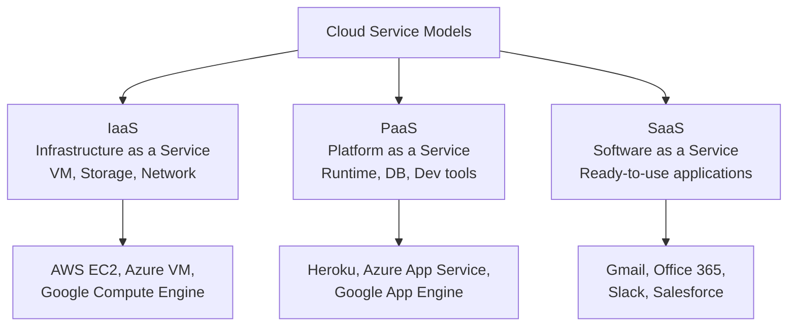
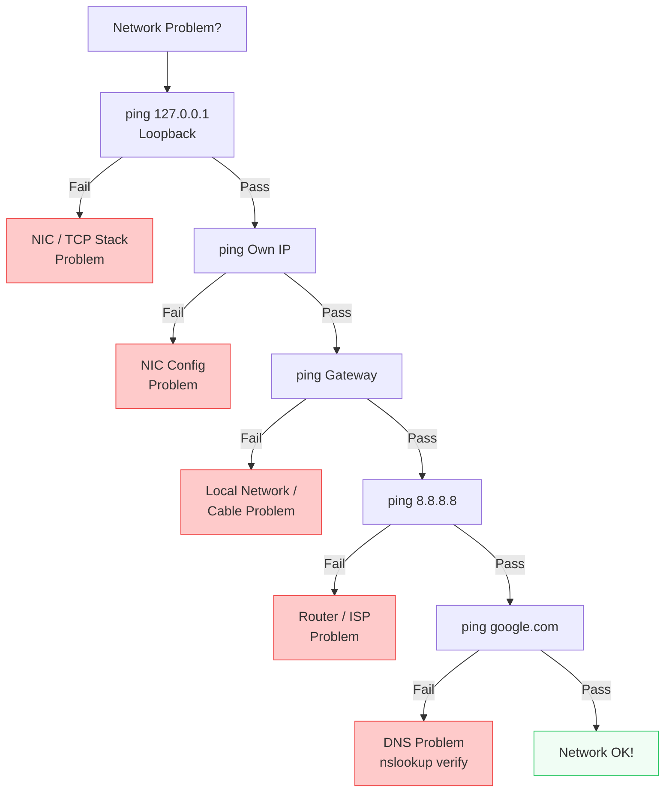

# Chapter 08 — Advanced & Practical — Computer Networking 🌐

> Wireless, cloud, troubleshooting commands, design, emerging tech।

---
# LEVEL 8: ADVANCED & PRACTICAL

*আধুনিক networking, troubleshooting, এবং software engineer দের জন্য practical concepts*


---
---

# Topic 35: Wireless Networking

<div align="center">

*"WiFi = IEEE 802.11 — তারবিহীন networking এর standard"*

</div>

---

## 📖 35.1 ধারণা (Concept)

### WiFi Standards (IEEE 802.11)

| Standard | Name | Frequency | Max Speed | Year |
|----------|------|-----------|-----------|------|
| 802.11a | WiFi 1 | 5 GHz | 54 Mbps | 1999 |
| 802.11b | WiFi 2 | 2.4 GHz | 11 Mbps | 1999 |
| 802.11g | WiFi 3 | 2.4 GHz | 54 Mbps | 2003 |
| **802.11n** | **WiFi 4** | 2.4/5 GHz | **600 Mbps** | 2009 |
| **802.11ac** | **WiFi 5** | 5 GHz | **6.9 Gbps** | 2013 |
| **802.11ax** | **WiFi 6** | 2.4/5/6 GHz | **9.6 Gbps** | 2019 |

### WiFi Security Protocols

| Protocol | Security Level | Encryption | Status |
|----------|---------------|------------|--------|
| **WEP** | ❌ Very Weak | RC4 | ❌ Deprecated, easily cracked |
| **WPA** | ⚠️ Moderate | TKIP | ⚠️ Legacy |
| **WPA2** | ✅ Good | **AES** | ✅ Current standard |
| **WPA3** | ✅✅ Best | AES-256 | ✅ Latest, most secure |

### Key Terms

| Term | বিবরণ |
|------|-------|
| **SSID** | Network name (যেটা WiFi list এ দেখা যায়) |
| **BSSID** | Access Point এর MAC address |
| **Channel** | Radio frequency band (2.4 GHz: channels 1-14) |
| **Access Point (AP)** | Wireless device কে wired network এ connect করে |

---

## ❓ 35.2 MCQ Problems

**Q1.** WiFi 6 এর IEEE standard কোনটি?

- (a) 802.11n
- (b) 802.11ac
- (c) 802.11ax ✅
- (d) 802.11g

**Q2.** WPA2 কোন encryption ব্যবহার করে?

- (a) RC4
- (b) TKIP
- (c) AES ✅
- (d) DES

**Q3.** কোন WiFi security protocol সবচেয়ে দুর্বল?

- (a) WPA3
- (b) WPA2
- (c) WPA
- (d) WEP ✅

---

## 📝 35.3 Summary

- **WiFi = IEEE 802.11**, latest = **802.11ax (WiFi 6)**
- **Security:** WEP (broken) → WPA (legacy) → **WPA2 (AES)** → **WPA3** (best)
- **SSID** = network name, **AP** = wireless ↔ wired bridge

---
---

# Topic 36: Cloud Networking Basics

<div align="center">

*"Software Engineer হিসেবে cloud networking জানা অত্যাবশ্যক"*

</div>

---

## 📖 36.1 ধারণা (Concept)

### Cloud Service Models



| আপনি manage করেন | IaaS | PaaS | SaaS |
|------------------|------|------|------|
| Application | ✅ | ✅ | ❌ |
| Data | ✅ | ✅ | ❌ |
| Runtime | ✅ | ❌ | ❌ |
| OS | ✅ | ❌ | ❌ |
| Networking | ✅ | ❌ | ❌ |
| Storage | ✅ | ❌ | ❌ |
| Server | ❌ | ❌ | ❌ |

### Cloud Networking Components

| Component | কাজ |
|-----------|-----|
| **VPC (Virtual Private Cloud)** | Cloud এ isolated private network |
| **Load Balancer** | Traffic multiple servers এ distribute করে |
| **CDN (Content Delivery Network)** | Content কে user এর কাছের server থেকে serve |
| **API Gateway** | API traffic manage, rate limiting, auth |
| **DNS (Route 53, Cloud DNS)** | Cloud-based DNS service |

---

## ❓ 36.2 MCQ Problems

**Q1.** Gmail কোন cloud model?

- (a) IaaS
- (b) PaaS
- (c) SaaS ✅
- (d) FaaS

**Q2.** AWS EC2 কোন cloud model?

- (a) IaaS ✅
- (b) PaaS
- (c) SaaS
- (d) DaaS

**Q3.** CDN কী করে?

- (a) Data encrypt করে
- (b) Content user এর কাছের server থেকে serve করে ✅
- (c) Virus scan করে
- (d) Database manage করে

---

## 📝 36.3 Summary

- **IaaS** = VM, storage (AWS EC2) — আপনি সব manage করেন
- **PaaS** = platform ready (Heroku) — শুধু code deploy
- **SaaS** = ready app (Gmail) — শুধু ব্যবহার
- **VPC** = cloud private network, **CDN** = fast content delivery, **Load Balancer** = traffic distribution

---
---

# Topic 37: Network Troubleshooting Commands

<div align="center">

*"Network সমস্যা হলে এই commands দিয়ে debug করুন — পরীক্ষায়ও আসে"*

</div>

---

## 📖 37.1 Commands Master Table

| Command | কাজ | Example | Protocol |
|---------|-----|---------|----------|
| **ping** | Destination reachable কিনা check | `ping google.com` | ICMP |
| **tracert / traceroute** | Source → Destination পথের routers দেখায় | `tracert google.com` | ICMP |
| **nslookup** | DNS query — domain → IP | `nslookup google.com` | DNS |
| **ipconfig / ifconfig** | নিজের IP, subnet, gateway দেখায় | `ipconfig /all` | - |
| **netstat** | Active connections ও listening ports | `netstat -an` | - |
| **arp -a** | ARP cache (IP → MAC mapping) দেখায় | `arp -a` | ARP |
| **telnet** | Port open কিনা check | `telnet server 80` | TCP |
| **curl** | HTTP request পাঠায় | `curl https://api.example.com` | HTTP |
| **nmap** | Port scan ও network discovery | `nmap 192.168.1.0/24` | TCP/UDP |
| **dig** | Advanced DNS query | `dig google.com A` | DNS |
| **route print** | Routing table দেখায় | `route print` | - |
| **pathping** | ping + tracert combined (Windows) | `pathping google.com` | ICMP |

### Troubleshooting Flowchart



---

## ❓ 37.2 MCQ Problems

**Q1.** Domain name এর IP বের করতে কোন command ব্যবহৃত হয়?

- (a) ping
- (b) tracert
- (c) nslookup ✅
- (d) netstat

**Q2.** ping command কোন protocol ব্যবহার করে?

- (a) TCP
- (b) UDP
- (c) ICMP ✅
- (d) ARP

**Q3.** Active network connections দেখতে কোন command?

- (a) ipconfig
- (b) netstat ✅
- (c) nslookup
- (d) tracert

**Q4.** ARP cache দেখতে কোন command?

- (a) arp -a ✅
- (b) arp -d
- (c) ipconfig /all
- (d) netstat -a

---

## 📝 37.3 Summary

- **ping** = reachability check (ICMP), **tracert** = path trace
- **nslookup/dig** = DNS query, **ipconfig** = own network info
- **netstat** = connections & ports, **arp -a** = ARP cache
- **Troubleshooting order:** Loopback → Self → Gateway → External IP → DNS

---
---

# Topic 38: Network Design & Best Practices

<div align="center">

*"ভালো network design = reliable, scalable, secure"*

</div>

---

## 📖 38.1 ধারণা (Concept)

### Three-Tier Architecture (Enterprise Standard)

```
┌─────────────────────────────────────────┐
│           CORE Layer                     │  High-speed backbone
│     (Core Switches/Routers)              │  Redundant links
├─────────────────────────────────────────┤
│       DISTRIBUTION Layer                 │  Routing, VLAN, ACL
│    (Distribution Switches)               │  Policy enforcement
├─────────────────────────────────────────┤
│         ACCESS Layer                     │  End devices connect
│      (Access Switches, APs)              │  Port security
└─────────────────────────────────────────┘
```

### Best Practices

| Practice | বিবরণ |
|----------|-------|
| **Redundancy** | Single point of failure avoid করুন — dual links, dual switches |
| **VLAN** | Department-wise VLAN — security ও performance |
| **Documentation** | Network diagram, IP scheme, device inventory |
| **Monitoring** | SNMP, Nagios, Zabbix — 24/7 monitoring |
| **Backup** | Config backup, automated |
| **Security** | Firewall, ACL, port security, 802.1X |
| **Scalability** | ভবিষ্যতে growth এর জন্য plan |

---

## 📝 38.2 Summary

- **Three-Tier:** Core (speed) → Distribution (policy) → Access (users)
- **Redundancy** = no single point of failure
- **VLAN, Firewall, ACL** = security layers
- **Monitor + Document + Backup** = operational excellence

---
---

# Topic 39: Emerging Technologies

<div align="center">

*"Networking এর ভবিষ্যত — SDN, IoT, 5G, Zero Trust"*

</div>

---

## 📖 39.1 ধারণা (Concept)

### SDN (Software-Defined Networking)

**Traditional:** প্রতিটি switch/router নিজে decide করে (control plane + data plane একসাথে)
**SDN:** একটা **central controller** সব decision নেয়, switch/router শুধু execute করে

| বিষয় | Traditional | SDN |
|-------|------------|-----|
| **Control** | Distributed (প্রতিটি device এ) | **Centralized** (controller) |
| **Configuration** | Device by device | Programmatically, API দিয়ে |
| **Flexibility** | কম | অনেক বেশি |
| **Example** | Cisco IOS | OpenFlow, Cisco ACI, VMware NSX |

### IoT Networking

**IoT (Internet of Things)** = everyday devices (AC, ফ্রিজ, light) Internet এ connected।

| Challenge | সমাধান |
|-----------|--------|
| Billions of devices | IPv6, LPWAN |
| Low power | Zigbee, LoRa, BLE |
| Security | Network segmentation, firmware update |

### 5G

| বৈশিষ্ট্য | 4G | 5G |
|-----------|----|----|
| **Speed** | ~100 Mbps | **~10 Gbps** |
| **Latency** | ~50 ms | **~1 ms** |
| **Devices/km²** | ~100K | **~1M** |
| **Use** | Mobile, streaming | IoT, autonomous cars, AR/VR |

### Zero Trust Architecture

**Traditional:** "Network এর ভেতরে সবাইকে trust করো"
**Zero Trust:** **"কাউকেই trust করো না, সবসময় verify করো"**

```
Principles:
1. Never trust, always verify
2. Least privilege access
3. Assume breach
4. Micro-segmentation
5. Continuous monitoring
```

---

## ❓ 39.2 MCQ Problems

**Q1.** SDN এ control plane কোথায় থাকে?

- (a) প্রতিটি switch এ
- (b) Centralized controller এ ✅
- (c) Cloud এ
- (d) Firewall এ

**Q2.** 5G এর theoretical max speed কত?

- (a) 1 Gbps
- (b) 5 Gbps
- (c) 10 Gbps ✅
- (d) 100 Gbps

**Q3.** Zero Trust এর মূল নীতি কী?

- (a) Internal users কে trust করো
- (b) Never trust, always verify ✅
- (c) Firewall enough
- (d) VPN ব্যবহার করো

---

## 📝 39.3 Summary

- **SDN** = centralized control, programmable networking
- **IoT** = billions of smart devices networked, needs IPv6
- **5G** = 10 Gbps, 1ms latency, massive IoT support
- **Zero Trust** = never trust anyone, always verify, least privilege

---
---

# Topic 40: Networking for Software Engineers

<div align="center">

*"Developer হিসেবে এই networking concepts প্রতিদিন কাজে লাগে"*

</div>

---

## 📖 40.1 ধারণা (Concept)

### REST API Networking

```
Client ──HTTP Request──→ Server
        GET /api/users
        Host: api.example.com
        Authorization: Bearer token123

Server ──HTTP Response──→ Client
        200 OK
        Content-Type: application/json
        {"users": [...]}
```

### WebSocket vs HTTP

| বিষয় | HTTP | WebSocket |
|-------|------|-----------|
| **Connection** | Request-Response (close হয়ে যায়) | Persistent (open থাকে) |
| **Direction** | Client → Server (one way per request) | Bidirectional (দুদিকে) |
| **Use Case** | REST API, web pages | Real-time chat, live updates, gaming |
| **Overhead** | প্রতি request এ header | একবার handshake, পরে minimal |
| **Protocol** | HTTP/HTTPS | ws:// / wss:// |

### gRPC vs REST

| বিষয় | REST | gRPC |
|-------|------|------|
| **Format** | JSON (text) | Protocol Buffers (binary) |
| **Speed** | Slower | **Much faster** |
| **Streaming** | Limited | Bidirectional streaming |
| **Contract** | OpenAPI/Swagger | .proto files (strict) |
| **Transport** | HTTP/1.1 mainly | HTTP/2 |
| **Use** | Public APIs, web | **Microservices**, internal APIs |

### CORS (Cross-Origin Resource Sharing)

```
Browser (localhost:3000) ──→ API (api.example.com:8080)
                              ↑
                     Different origin!
                     Browser blocks by default.

Solution: Server adds header:
Access-Control-Allow-Origin: http://localhost:3000
```

### DNS for Developers

```
Your app uses DNS constantly:
1. Database connection: db.internal.company.com → 10.0.1.50
2. API calls: api.stripe.com → 52.xx.xx.xx
3. Service discovery: user-service.k8s.local → cluster IP
4. CDN: assets.yourapp.com → CDN edge server IP

DNS caching can cause issues:
- TTL too high → DNS change slow to propagate
- TTL too low → more DNS queries, slower
- Recommended: 300 seconds (5 min) for most services
```

### Developer's Must-Know Network Concepts

| Concept | কেন জানা দরকার |
|---------|----------------|
| **HTTP Status Codes** | API response handle করতে |
| **TCP vs UDP** | কোন protocol কখন ব্যবহার করবেন |
| **DNS** | Domain management, service discovery |
| **TLS/HTTPS** | Secure API communication |
| **WebSocket** | Real-time features build করতে |
| **CORS** | Frontend-backend communication |
| **Load Balancing** | High availability design |
| **CDN** | Static asset delivery optimize |
| **Rate Limiting** | API abuse prevention |
| **Connection Pooling** | Database performance optimization |

---

## ❓ 40.2 MCQ Problems

**Q1.** WebSocket কোন ধরনের connection?

- (a) Request-Response
- (b) Persistent, bidirectional ✅
- (c) UDP-based
- (d) One-way only

**Q2.** gRPC কোন format এ data serialize করে?

- (a) JSON
- (b) XML
- (c) Protocol Buffers ✅
- (d) YAML

**Q3.** CORS কী?

- (a) A type of attack
- (b) Cross-Origin Resource Sharing ✅
- (c) A routing protocol
- (d) A type of DNS record

**Q4.** REST API সাধারণত কোন data format ব্যবহার করে?

- (a) XML
- (b) JSON ✅
- (c) Protocol Buffers
- (d) CSV

---

## 📝 40.3 Summary

- **REST** = HTTP-based, JSON, simple, public APIs
- **gRPC** = HTTP/2, Protocol Buffers, fast, **microservices**
- **WebSocket** = persistent, bidirectional, **real-time apps**
- **CORS** = browser security for cross-origin requests
- **DNS** = service discovery, caching — affects app performance
- Developer must know: HTTP codes, TCP/UDP, DNS, TLS, WebSocket, CORS

---

> **Level 8 সম্পূর্ণ!** 🎉 WiFi, Cloud, Troubleshooting, Network Design, SDN, IoT, 5G, এবং Developer-focused networking — সব advanced topics শেখা হয়ে গেছে।

---
---

<div align="center">

# 🎯 BONUS SECTION

</div>

---
---

# BONUS: 150 Interview Questions & Answers

<div align="center">

*Basic → Advanced — চাকরি interview এ সবচেয়ে বেশি জিজ্ঞেস করা প্রশ্ন ও উত্তর*

</div>

---

## 🟢 Basic Level (Q1-50)

**Q1. Computer Network কী?**
দুই বা ততোধিক computing device এর সংযোগ যেখানে তারা data, resource share করতে পারে।

**Q2. LAN ও WAN এর পার্থক্য কী?**
LAN = ছোট এলাকা (office), high speed, low cost। WAN = বিশ্বব্যাপী (Internet), lower speed, high cost।

**Q3. OSI Model কী? কয়টি layer?**
ISO কর্তৃক তৈরি 7-layer reference model — networking কিভাবে কাজ করে সেটার theoretical framework।

**Q4. TCP/IP Model কী? কয়টি layer?**
DoD/DARPA তৈরি 4-layer practical model — Internet এর foundation। Application, Transport, Internet, Network Access।

**Q5. IP Address কী?**
Network এ প্রতিটি device এর unique logical address। IPv4 = 32 bit, IPv6 = 128 bit।

**Q6. MAC Address কী?**
Network Interface Card (NIC) এর unique physical address। 48 bit, hexadecimal format (AA:BB:CC:DD:EE:FF)।

**Q7. IP Address ও MAC Address এর পার্থক্য?**
IP = logical, Layer 3, changeable, 32/128 bit। MAC = physical, Layer 2, hardware burned-in, 48 bit।

**Q8. Hub ও Switch এর পার্থক্য?**
Hub = Layer 1, broadcast to all ports, dumb। Switch = Layer 2, MAC table দেখে specific port এ unicast, smart।

**Q9. Router কী করে?**
Layer 3 device — IP address দেখে different networks এর মধ্যে packet route করে, best path নির্বাচন করে।

**Q10. TCP ও UDP এর পার্থক্য?**
TCP = connection-oriented, reliable, slow (HTTP, FTP)। UDP = connectionless, unreliable, fast (streaming, DNS)।

**Q11. HTTP ও HTTPS এর পার্থক্য?**
HTTP = port 80, unencrypted। HTTPS = port 443, TLS/SSL encrypted, secure।

**Q12. DNS কী?**
Domain Name System — domain name (google.com) কে IP address (142.250.190.78) এ translate করে।

**Q13. DHCP কী?**
Dynamic Host Configuration Protocol — automatically IP address, subnet mask, gateway, DNS assign করে।

**Q14. Firewall কী?**
Network security device — rules অনুযায়ী incoming/outgoing traffic filter (allow/deny) করে।

**Q15. VPN কী?**
Virtual Private Network — public Internet এর উপর encrypted tunnel তৈরি করে private communication।

**Q16. Subnet Mask কী?**
IP address এর Network part ও Host part আলাদা করে। Example: 255.255.255.0 = /24।

**Q17. Default Gateway কী?**
Local network এর বাইরে data পাঠাতে যে router ব্যবহৃত হয়। সাধারণত router এর IP address।

**Q18. Ping command কী করে?**
ICMP Echo Request/Reply দিয়ে destination device reachable কিনা check করে।

**Q19. Bandwidth ও Throughput এর পার্থক্য?**
Bandwidth = theoretical maximum capacity (100 Mbps link)। Throughput = actual data transfer rate (80 Mbps received)।

**Q20. Latency কী?**
Data source থেকে destination পর্যন্ত পৌঁছাতে যে সময় লাগে। কম latency = better performance।

**Q21. Protocol কী?**
Network communication এর rules/standards এর set। Example: HTTP, TCP, IP।

**Q22. Port Number কী?**
16-bit number (0-65535) — কোন application/service এর জন্য data এসেছে সেটা identify করে।

**Q23. Well-known ports এর range কত?**
0-1023। Example: HTTP=80, HTTPS=443, FTP=21, SSH=22, DNS=53।

**Q24. ARP কী?**
Address Resolution Protocol — IP address থেকে MAC address resolve করে।

**Q25. Broadcast ও Unicast এর পার্থক্য?**
Broadcast = সব device কে পাঠায়। Unicast = specific একটা device কে পাঠায়।

**Q26. Full-Duplex ও Half-Duplex এর পার্থক্য?**
Full-Duplex = একসাথে দুদিকে data (telephone)। Half-Duplex = পালাক্রমে দুদিকে (walkie-talkie)।

**Q27. Star Topology কেন সবচেয়ে জনপ্রিয়?**
Easy troubleshooting, easy to add/remove devices, one device fail হলে বাকিরা চলে।

**Q28. Fiber Optic কেন সবচেয়ে ভালো media?**
Fastest (100+ Gbps), longest distance (100+ km), EMI immune, most secure (hard to tap)।

**Q29. NAT কেন দরকার?**
IPv4 address সীমিত। NAT দিয়ে অনেক private IP device একটা public IP share করে Internet access করে।

**Q30. 127.0.0.1 কী?**
Loopback address / localhost — device নিজেকে test করতে ব্যবহার করে।

**Q31. APIPA কী?**
Automatic Private IP Addressing — DHCP server না পেলে device নিজে 169.254.x.x range থেকে IP নেয়।

**Q32. Class A, B, C এর 1st octet range কত?**
A = 1-126, B = 128-191, C = 192-223।

**Q33. Private IP range কী কী?**
10.0.0.0/8, 172.16.0.0/12, 192.168.0.0/16।

**Q34. OSI Layer 4 এর PDU কী?**
Segment (TCP) / Datagram (UDP)।

**Q35. Encapsulation কী?**
Data এক layer থেকে নিচের layer এ যাওয়ার সময় header যোগ হওয়ার process।

**Q36. Circuit Switching ও Packet Switching এর পার্থক্য?**
Circuit = dedicated path (telephone)। Packet = data ভেঙে packet, shared path (Internet)।

**Q37. SMTP কী?**
Simple Mail Transfer Protocol — email পাঠানোর protocol, port 25/587।

**Q38. POP3 ও IMAP এর পার্থক্য?**
POP3 = download & delete from server, single device। IMAP = keep on server, multi-device sync।

**Q39. FTP ও SFTP এর পার্থক্য?**
FTP = port 20/21, insecure (plain text)। SFTP = port 22, SSH encrypted, secure।

**Q40. Collision Domain ও Broadcast Domain কী?**
Collision domain = যেখানে data collide হতে পারে (hub)। Broadcast domain = broadcast যেখানে পৌঁছায় (VLAN/router boundary)।

**Q41. Switch collision domain আলাদা করে কেন?**
প্রতিটি port আলাদা collision domain — একসাথে multiple port এ data যেতে পারে collision ছাড়া।

**Q42. Router broadcast domain আলাদা করে কেন?**
Router broadcast traffic forward করে না — তাই প্রতিটি interface আলাদা broadcast domain।

**Q43. Subnetting কেন করা হয়?**
Broadcast domain ছোট করা, IP address efficient ব্যবহার, security improve, management সহজ।

**Q44. CIDR কী?**
Classless Inter-Domain Routing — subnet mask কে /n notation এ লেখা। Example: /24 = 255.255.255.0।

**Q45. TCP 3-way handshake এর steps কী?**
SYN → SYN-ACK → ACK। Connection establish করতে ব্যবহৃত।

**Q46. DNS A Record কী?**
Domain name কে IPv4 address এ map করে। Example: google.com → 142.250.190.78।

**Q47. DHCP DORA process কী?**
Discover → Offer → Request → Acknowledge — client automatically IP পাওয়ার 4 steps।

**Q48. Traceroute কী করে?**
Source থেকে destination পর্যন্ত path এ কোন কোন router আছে তা দেখায়। ICMP Time Exceeded ব্যবহার করে।

**Q49. Socket কী?**
IP Address + Port Number = Socket। Network communication এর endpoint।

**Q50. IPv4 ও IPv6 এর মূল পার্থক্য?**
IPv4 = 32-bit, ~4.3 billion addresses। IPv6 = 128-bit, virtually unlimited addresses, no broadcast, IPSec built-in।

---

## 🟡 Intermediate Level (Q51-100)

**Q51. OSI Model এর প্রতিটি layer এ কোন device কাজ করে?**
L1=Hub/Repeater, L2=Switch/Bridge, L3=Router, L4+=Firewall, L7=Gateway/Proxy।

**Q52. RIP ও OSPF এর পার্থক্য?**
RIP = Distance Vector, hop count (max 15), slow convergence। OSPF = Link State, Dijkstra, cost (bandwidth), fast convergence, scalable।

**Q53. BGP কী ও কোথায় ব্যবহৃত?**
Border Gateway Protocol — Internet backbone এ ISP গুলোর মধ্যে routing। Path Vector, TCP 179।

**Q54. VLAN কেন ব্যবহার করা হয়?**
Logical network separation — security (isolation), performance (smaller broadcast domain), flexibility।

**Q55. STP কেন দরকার?**
Switch network এ redundant links থাকলে loop হয় → broadcast storm → network crash। STP loop prevent করে।

**Q56. Sliding Window protocol কী?**
Flow control mechanism — sender একসাথে window size অনুযায়ী multiple frames পাঠায় ACK ছাড়াই।

**Q57. Go-Back-N ও Selective Repeat এর পার্থক্য?**
Go-Back-N = error point থেকে সব retransmit। Selective Repeat = শুধু error frame retransmit (more efficient)।

**Q58. CRC কী?**
Cyclic Redundancy Check — error detection method। Ethernet Frame Check Sequence (FCS) এ ব্যবহৃত।

**Q59. Symmetric ও Asymmetric Encryption এর পার্থক্য?**
Symmetric = একটা key, fast (AES)। Asymmetric = public+private key, slow (RSA)।

**Q60. Digital Signature কিভাবে কাজ করে?**
Sender private key দিয়ে hash sign করে। Receiver sender এর public key দিয়ে verify করে। Authentication + Integrity guarantee।

**Q61. IDS ও IPS এর পার্থক্য?**
IDS = detect + alert (passive)। IPS = detect + block (active, inline)।

**Q62. DDoS attack কিভাবে কাজ করে?**
Attacker botnet (হাজারো compromised machine) দিয়ে target server এ massive traffic পাঠায় — server overwhelm হয়ে unavailable হয়।

**Q63. ARP Poisoning কী?**
Attacker fake ARP reply পাঠিয়ে নিজের MAC কে gateway এর IP এর সাথে associate করায় — সব traffic attacker এর কাছে আসে (MITM)।

**Q64. WPA2 ও WPA3 এর পার্থক্য?**
WPA2 = AES encryption, vulnerable to KRACK। WPA3 = stronger encryption (AES-256), SAE handshake, forward secrecy।

**Q65. SDN কী?**
Software-Defined Networking — control plane centralized, network programmable via API, flexible।

**Q66. Load Balancer কী করে?**
Incoming traffic কে multiple servers এ distribute করে — availability ও performance বাড়ায়।

**Q67. CDN কিভাবে কাজ করে?**
Content (images, JS, CSS) কে worldwide edge servers এ cache করে — user এর সবচেয়ে কাছের server থেকে serve।

**Q68. WebSocket কেন ব্যবহার হয়?**
Persistent bidirectional connection — real-time chat, live updates, gaming এর জন্য। HTTP এর মতো request-response না।

**Q69. REST vs gRPC কী?**
REST = HTTP/JSON, simple, public APIs। gRPC = HTTP/2, Protocol Buffers (binary), faster, microservices।

**Q70. CORS কী?**
Cross-Origin Resource Sharing — browser security mechanism। Different origin থেকে API call করতে server এর permission লাগে।

**Q71. TTL কী?**
Time To Live — packet কতটি router পার করতে পারবে। প্রতি hop এ 1 কমে, 0 হলে discard হয়। Routing loop prevention।

**Q72. MTU কী?**
Maximum Transmission Unit — network link এ একবারে সর্বোচ্চ কত size data পাঠানো যায়। Ethernet = 1500 bytes।

**Q73. Fragmentation কী?**
Packet MTU এর চেয়ে বড় হলে ছোট ছোট ভাগে ভাগ করা হয়। Receiver end এ reassemble হয়।

**Q74. Proxy Server কী?**
Client ও server এর মাঝে intermediary — content caching, filtering, anonymity provide করে।

**Q75. Reverse Proxy কী?**
Server side proxy — client থেকে request receive করে backend servers এ distribute করে। Example: Nginx, HAProxy।

**Q76. DNS Caching কেন গুরুত্বপূর্ণ?**
Same domain বারবার resolve না করে cache থেকে answer — faster response, less DNS traffic।

**Q77. 802.1Q কী?**
VLAN tagging standard — trunk link এ frame এ VLAN ID tag যোগ করে identify করতে।

**Q78. Trunk Port ও Access Port এর পার্থক্য?**
Access = একটা VLAN, end device connect। Trunk = multiple VLAN traffic carry, switch-to-switch।

**Q79. ICMP কোন layer এ কাজ করে?**
Network Layer (Layer 3) — error reporting ও diagnostics (ping, traceroute)।

**Q80. Multicast কী?**
Data একটা group এর সবাইকে পাঠানো (broadcast = everyone, unicast = one, multicast = group)।

**Q81. IaaS, PaaS, SaaS এর পার্থক্য?**
IaaS = infrastructure (VM, storage)। PaaS = platform (runtime, DB)। SaaS = ready software (Gmail)।

**Q82. VPC কী?**
Virtual Private Cloud — cloud এ isolated private network তৈরি করা। AWS VPC, Azure VNet।

**Q83. Network Address Translation (NAT) এর types কী?**
Static NAT (1:1), Dynamic NAT (pool), PAT/NAT Overload (many:1, port দিয়ে আলাদা)।

**Q84. Zero Trust Architecture কী?**
"Never trust, always verify" — network এর ভেতরে হলেও সবাইকে authenticate ও authorize করতে হবে।

**Q85. 5G ও 4G এর মূল পার্থক্য?**
5G = ~10 Gbps speed (100× faster), ~1ms latency, 1M devices/km²। AR/VR, IoT, autonomous vehicles।

**Q86. TCP Window Size কী?**
Flow control — receiver কত data receive করতে পারবে (buffer size) সেটা sender কে জানায়।

**Q87. TCP Congestion Control কী?**
Network congestion হলে sender data পাঠানোর rate কমায়। Algorithms: Slow Start, Congestion Avoidance।

**Q88. DNS Zone Transfer কী?**
Primary DNS server থেকে secondary server এ DNS records copy করা। TCP port 53 ব্যবহার করে।

**Q89. DNSSEC কী?**
DNS Security Extensions — DNS response authenticate করে DNS spoofing prevent করতে। Digital signature ব্যবহার করে।

**Q90. HTTP/2 এর মূল improvement কী?**
Multiplexing (একটা TCP connection এ multiple request), header compression, server push, binary protocol।

**Q91. QUIC protocol কী?**
Google এর UDP-based transport protocol — HTTP/3 এর foundation। TCP+TLS এর কাজ একসাথে, faster connection।

**Q92. BGP Hijacking কী?**
Attacker ভুল BGP route announce করে traffic নিজের দিকে redirect করে — Internet-scale attack।

**Q93. Network Segmentation কেন important?**
Attack blast radius limit করে। একটা segment compromise হলে পুরো network affected হয় না।

**Q94. 802.1X কী?**
Port-based Network Access Control — network এ connect করার আগে authenticate করতে হয়। RADIUS server ব্যবহার করে।

**Q95. SNMP কী?**
Simple Network Management Protocol — network devices monitor ও manage করার standard। Port 161 (UDP)।

**Q96. Syslog কী?**
Network devices থেকে log messages centrally collect করার protocol। Troubleshooting ও security audit এ ব্যবহৃত।

**Q97. QoS (Quality of Service) কী?**
Network traffic prioritize করা — voice/video কে higher priority, download কে lower। Bandwidth management।

**Q98. MPLS কী?**
Multi-Protocol Label Switching — packet এ label দিয়ে faster forwarding। IP lookup না করে label দেখে route করে।

**Q99. Anycast কী?**
একটা IP address একাধিক server এ assign — request সবচেয়ে কাছের server এ যায়। DNS root servers ও CDN এ ব্যবহৃত।

**Q100. Network Jitter কী?**
Packet arrival time এর variation। High jitter = VoIP/video call এ quality খারাপ হয়। QoS দিয়ে manage করা যায়।

---

## 🔴 Advanced Level (Q101-150)

**Q101. TCP Fast Open কী?**
TLS handshake এ data পাঠানো শুরু করে — connection setup time কমায়। Cookie-based।

**Q102. Anycast ও Multicast এর পার্থক্য?**
Anycast = group এর সবচেয়ে কাছের একজনকে। Multicast = group এর সবাইকে।

**Q103. eBPF networking এ কিভাবে ব্যবহৃত হয়?**
Linux kernel এ programmable packet processing — XDP, tc। High-performance load balancing, filtering। Cilium ব্যবহার করে।

**Q104. Service Mesh কী?**
Microservice architecture এ service-to-service communication manage করার dedicated infrastructure layer। Example: Istio, Linkerd।

**Q105. Kubernetes Networking কিভাবে কাজ করে?**
Pod-to-Pod communication, Services (ClusterIP, NodePort, LoadBalancer), Ingress controller, CNI plugins (Calico, Flannel)।

**Q106. TCP BBR কী?**
Google এর congestion control algorithm — bandwidth ও RTT measure করে optimal rate বের করে। Traditional loss-based এর চেয়ে better।

**Q107. DPDK কী?**
Data Plane Development Kit — kernel bypass করে userspace এ high-performance packet processing। ~10x faster than kernel networking।

**Q108. BGP Route Reflector কেন দরকার?**
Full mesh iBGP scalable না (n² connections)। Route Reflector central point হিসেবে routes reflect করে — কম connections লাগে।

**Q109. ECMP কী?**
Equal-Cost Multi-Path — same destination এ multiple equal-cost paths থাকলে traffic distribute করে। Load balancing।

**Q110. Segment Routing কী?**
Source routing — packet header এ পুরো path encode করা থাকে। MPLS/IPv6 extension। SDN-friendly।

**Q111. Network Function Virtualization (NFV) কী?**
Network functions (firewall, load balancer, router) কে dedicated hardware এর বদলে VMs/containers এ run করা।

**Q112. VXLAN কী?**
Virtual Extensible LAN — Layer 2 overlay over Layer 3 network। Data center networking, cloud multi-tenancy।

**Q113. GRE Tunnel কী?**
Generic Routing Encapsulation — one protocol এর packet কে another protocol এ encapsulate করে tunnel দিয়ে পাঠায়।

**Q114. IPSec Tunnel ও Transport Mode এর পার্থক্য?**
Tunnel = পুরো IP packet encrypt + new IP header। Transport = শুধু payload encrypt, original IP header রাখে।

**Q115. mTLS কী?**
Mutual TLS — client ও server দুজনেই certificate verify করে। Zero Trust, microservices এ ব্যবহৃত।

**Q116. DNS over HTTPS (DoH) কী?**
DNS queries HTTPS এর মধ্য দিয়ে পাঠায় — privacy improve, ISP DNS query দেখতে পারে না।

**Q117. TCP SYN Flood attack কী?**
Attacker অনেক SYN packet পাঠায় কিন্তু ACK দেয় না — server এর connection table full হয়ে যায়। DoS attack।

**Q118. Rate Limiting কিভাবে implement করা হয়?**
Token Bucket বা Leaky Bucket algorithm — per IP/user request limit set করে। API abuse prevention।

**Q119. Connection Pooling কেন দরকার?**
প্রতি request এ নতুন TCP connection (3-way handshake) expensive। Pool এ connections reuse করে — database ও HTTP connection এ ব্যবহৃত।

**Q120. HTTP Keep-Alive কী?**
একটা TCP connection multiple HTTP request/response এ reuse করে — connection overhead কমে।

**Q121. Graceful Degradation networking এ কী?**
Service এর কিছু part fail হলেও বাকি service চালু থাকা। Example: CDN fail হলে origin server থেকে serve।

**Q122. Circuit Breaker pattern networking এ কী?**
Downstream service fail হলে further requests block করে — cascading failure prevent। States: Closed, Open, Half-Open।

**Q123. Network Namespace কী?**
Linux feature — isolated network stack (interfaces, routing table, iptables)। Containers (Docker) এটা ব্যবহার করে।

**Q124. Overlay vs Underlay Network কী?**
Underlay = physical network infrastructure। Overlay = underlay এর উপর virtual network (VXLAN, GRE)।

**Q125. Spine-Leaf Architecture কী?**
Modern data center topology — every leaf switch connects to every spine switch। Predictable latency, scalable।

**Q126. ARP Spoofing prevent করার উপায় কী?**
Dynamic ARP Inspection (DAI), static ARP entries, port security, 802.1X।

**Q127. TCP TIME_WAIT state কেন থাকে?**
Connection close হওয়ার পর 2×MSL সময় wait করে — delayed segments handle করতে এবং last ACK lost হলে retransmit করতে।

**Q128. Nagle's Algorithm কী?**
ছোট ছোট TCP segment buffer করে একটা বড় segment এ পাঠায় — bandwidth efficient। কিন্তু latency বাড়ে (real-time app এ disable করা হয়)।

**Q129. TCP_NODELAY কী?**
Nagle's algorithm disable করে — প্রতিটি write() immediately send হয়। Low-latency apps (gaming, trading) এ ব্যবহৃত।

**Q130. Jumbo Frames কী?**
MTU 1500 bytes এর বদলে 9000 bytes — data center internal traffic এ throughput বাড়ায়, header overhead কমায়।

**Q131. LACP কী?**
Link Aggregation Control Protocol — multiple physical links কে একটা logical link এ bundle করে। Bandwidth বাড়ে + redundancy।

**Q132. Gratuitous ARP কী?**
Device নিজের IP এর জন্য ARP request পাঠায় — IP conflict detection এবং অন্যদের ARP cache update করতে।

**Q133. DHCP Snooping কী?**
Switch level DHCP security — unauthorized DHCP server block করে। Rogue DHCP attack prevention।

**Q134. Port Security কী?**
Switch port এ allowed MAC address limit করা — unauthorized device connect করতে পারে না।

**Q135. ACL (Access Control List) কী?**
Router/firewall এ rules — specific IP, port, protocol based traffic allow/deny। Standard ACL (source IP only), Extended ACL (source+dest IP+port)।

**Q136. NAT64 কী?**
IPv6 device কে IPv4 resource access করতে দেয় — IPv6 → IPv4 translation। Transition mechanism।

**Q137. Dual Stack কী?**
Device একসাথে IPv4 ও IPv6 দুটোই support করে। সবচেয়ে common IPv4→IPv6 transition strategy।

**Q138. Multipath TCP (MPTCP) কী?**
একটা TCP connection multiple paths (WiFi + cellular) দিয়ে একসাথে data পাঠায় — bandwidth aggregation + resilience।

**Q139. TCP Selective ACK (SACK) কী?**
Receiver specifically বলে কোন segments পেয়েছে, কোনটা missing — sender শুধু missing segments retransmit করে। Efficient।

**Q140. SRv6 কী?**
Segment Routing over IPv6 — IPv6 extension headers এ routing instructions encode করে। SDN ও programmable networking এ।

**Q141. Intent-Based Networking কী?**
Admin "what" বলে (intent), system "how" নিজে বের করে। AI/ML driven network automation। Cisco DNA Center।

**Q142. Network Telemetry কী?**
Real-time network data collection — streaming telemetry (gNMI, gRPC) traditional polling (SNMP) এর চেয়ে better।

**Q143. P4 Programming কী?**
Protocol-Independent Packet Processor programming language — switch/router এর data plane programmable করে। Custom protocols define করা যায়।

**Q144. SmartNIC কী?**
Network card with programmable processor — network functions (encryption, filtering) NIC level এ offload করে। CPU load কমায়।

**Q145. Network Slicing কী?**
5G concept — একটা physical network কে multiple virtual networks (slices) এ ভাগ করা, প্রতিটির আলাদা QoS।

**Q146. Time-Sensitive Networking (TSN) কী?**
IEEE 802.1 standards — deterministic, low-latency Ethernet। Industrial automation, automotive networking।

**Q147. SASE কী?**
Secure Access Service Edge — networking (SD-WAN) + security (firewall, CASB, ZTNA) কে cloud-delivered service হিসেবে combine করা।

**Q148. XDP (eXpress Data Path) কী?**
Linux kernel এ eBPF-based programmable packet processing — NIC driver level এ, kernel stack এর আগেই। Ultra-fast filtering, DDoS mitigation।

**Q149. Network Digital Twin কী?**
Physical network এর virtual replica — "what-if" scenarios simulate করা, change এর impact test করা production এ apply করার আগে।

**Q150. Quantum Networking কী?**
Quantum entanglement ও quantum key distribution (QKD) ব্যবহার করে theoretically unhackable communication। Research stage।

---
---

# BONUS: 50 Most Repeated Exam MCQs

<div align="center">

*বিগত পরীক্ষাগুলোতে সবচেয়ে বেশি বার এসেছে এমন MCQ — Explanation সহ*

</div>

---

**1.** OSI Model এ কতটি layer আছে?
**Answer:** 7 ✅

**2.** TCP/IP Model এ কতটি layer আছে?
**Answer:** 4 ✅

**3.** Router কোন layer এ কাজ করে?
**Answer:** Layer 3 (Network) ✅

**4.** Switch কোন layer এ কাজ করে?
**Answer:** Layer 2 (Data Link) ✅

**5.** Hub কোন layer এ কাজ করে?
**Answer:** Layer 1 (Physical) ✅

**6.** IPv4 address কত bit?
**Answer:** 32 bit ✅

**7.** IPv6 address কত bit?
**Answer:** 128 bit ✅

**8.** MAC address কত bit?
**Answer:** 48 bit ✅

**9.** HTTP কোন port?
**Answer:** 80 ✅

**10.** HTTPS কোন port?
**Answer:** 443 ✅

**11.** FTP কোন port?
**Answer:** 20 (data), 21 (control) ✅

**12.** SSH কোন port?
**Answer:** 22 ✅

**13.** DNS কোন port?
**Answer:** 53 ✅

**14.** SMTP কোন port?
**Answer:** 25 ✅

**15.** Telnet কোন port?
**Answer:** 23 ✅

**16.** Class A IP এর range?
**Answer:** 1-126 ✅ (127 loopback)

**17.** Class B IP এর range?
**Answer:** 128-191 ✅

**18.** Class C IP এর range?
**Answer:** 192-223 ✅

**19.** 127.0.0.1 কী?
**Answer:** Loopback / localhost ✅

**20.** TCP কি connection-oriented?
**Answer:** হ্যাঁ ✅

**21.** UDP কি connection-oriented?
**Answer:** না, connectionless ✅

**22.** TCP 3-way handshake?
**Answer:** SYN → SYN-ACK → ACK ✅

**23.** DNS কী করে?
**Answer:** Domain name → IP address resolve ✅

**24.** DHCP কী করে?
**Answer:** Automatically IP address assign ✅

**25.** ARP কী করে?
**Answer:** IP → MAC address resolve ✅

**26.** ping কোন protocol ব্যবহার করে?
**Answer:** ICMP ✅

**27.** Firewall কী করে?
**Answer:** Network traffic filter (allow/deny) ✅

**28.** VPN কী?
**Answer:** Public network এ encrypted private tunnel ✅

**29.** NAT কী করে?
**Answer:** Private IP → Public IP translate ✅

**30.** Subnet mask 255.255.255.0 এর CIDR?
**Answer:** /24 ✅

**31.** /26 subnet mask কত?
**Answer:** 255.255.255.192 ✅

**32.** Class C network এ max hosts?
**Answer:** 254 (2⁸ - 2) ✅

**33.** OSI Layer 3 এর PDU?
**Answer:** Packet ✅

**34.** OSI Layer 2 এর PDU?
**Answer:** Frame ✅

**35.** OSI Layer 4 এর PDU?
**Answer:** Segment ✅

**36.** RIP এর max hop count?
**Answer:** 15 ✅

**37.** OSPF কোন algorithm?
**Answer:** Dijkstra (SPF) ✅

**38.** BGP কোন port?
**Answer:** TCP 179 ✅

**39.** VLAN কী করে?
**Answer:** Broadcast domain logically ভাগ করে ✅

**40.** Star topology তে central device fail হলে?
**Answer:** পুরো network down ✅

**41.** Mesh topology তে n device এ cable সংখ্যা?
**Answer:** n(n-1)/2 ✅

**42.** Fiber Optic এ কিসের মাধ্যমে data যায়?
**Answer:** Light (আলো) ✅

**43.** CIA Triad এর C কী?
**Answer:** Confidentiality ✅

**44.** DDoS attack কিসে আঘাত করে?
**Answer:** Availability ✅

**45.** WPA2 কোন encryption?
**Answer:** AES ✅

**46.** IDS ও IPS এর পার্থক্য?
**Answer:** IDS = detect + alert, IPS = detect + block ✅

**47.** Full-duplex example?
**Answer:** Telephone call ✅

**48.** Half-duplex example?
**Answer:** Walkie-talkie ✅

**49.** Simplex example?
**Answer:** Keyboard → CPU, TV broadcast ✅

**50.** Internet কোন ধরনের network?
**Answer:** WAN (Wide Area Network) ✅

---
---

<div align="center">

---

**🎉 Congratulations! আপনি Computer Networking Handbook সম্পূর্ণ করেছেন! 🎉**

**40 Topics** | **300+ MCQ** | **150+ Written Problems** | **150 Interview Q&A** | **40+ Diagrams**

---

*Made with ❤️ for Bangladeshi Software Engineers, IT Job Seekers & Assistant Programmer Candidates*

</div>

---

## 🔗 Navigation

- 🏠 Back to [Computer Networking — Master Index](00-master-index.md)
- ⬅️ Previous: [Chapter 07 — Network Security](07-network-security.md)
