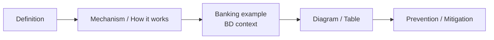
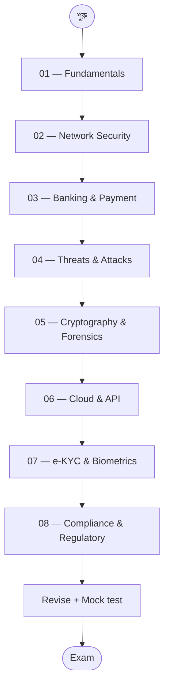

# Cyber Security for Bangladesh Bank IT Exam — Master Index 🛡️

> Bangladesh Bank-এর IT Officer / Assistant Director (IT) written exam-এর জন্য complete cyber security study material।
> এই document টা **entry point** — এখান থেকে ৮টা chapter-এ navigate করা যাবে।

---

## 🎯 এই Course কেন?

বাংলাদেশ ব্যাংক, NBFI, এবং অন্যান্য commercial bank-এর **IT Officer** ও **AD (IT)** exam-এ cyber security অংশটা প্রতি বছরই written paper-এ আসছে। 2016 সালের SWIFT heist-এর পর থেকে regulator-রা এই বিষয়টাকে আরও বেশি গুরুত্ব দিচ্ছে। 2026 সালে Bangladesh Bank নতুন **Cybersecurity Framework v1.0** introduce করেছে — তাই syllabus-ও আপডেট হয়ে যাচ্ছে।

এই course-টা সাজানো হয়েছে Gemini-এর সাথে real Q&A session থেকে — মোট **28টা question + bonus topics**, যেগুলো written exam-এ regularly আসে।

---

## 📋 Exam Pattern at a Glance

| বিষয় | Details |
|------|---------|
| **Exam name** | Bangladesh Bank Officer (IT) / AD (IT) |
| **Cyber security weight** | প্রায় 20-30% of written paper |
| **Question style** | Concept + Diagram + Prevention/Mitigation |
| **Mark range per Q** | 2 / 5 / 10 marks |
| **Recommended answer length** | 5 mark = 1 page, with diagram |
| **Language** | English (technical answer), Bangla allowed |

### 5-mark answer-এর golden structure

প্রতিটা attack-related question-এ শেষে অবশ্যই 2-3 point **Prevention / Mitigation** section রাখবেন — এতে full marks পাওয়া যায়।

---

## 📚 Chapter Map

| # | Chapter | Topics covered | Q# from transcript |
|---|---------|----------------|--------------------|
| 01 | [Fundamentals & Frameworks](01-fundamentals.md) | CIA Triad, Threat/Vulnerability/Risk, Defense in Depth | Q1, Q2, Q3 |
| 02 | [Network & Infrastructure Security](02-network-security.md) | Firewall vs IDS vs IPS, Zero Trust, SSL/TLS Handshake + Certificate Validation, DMZ, Network Segmentation | Q4, Q5, Q6, Q16, Q23 |
| 03 | [Banking & Payment Security](03-banking-payment.md) | Tokenization, MFA, SWIFT/CSP, Blockchain in Banking | Q7, Q8, Q9, Q10 |
| 04 | [Threats & Attacks](04-threats-attacks.md) | Ransomware vs Spyware, Zero-Click, AI Phishing, SQL Injection, DDoS, Social Engineering | Q11, Q12, Q14, Q17, Q21, Q22 |
| 05 | [Cryptography & Forensics](05-cryptography-forensics.md) | Digital Forensics & Chain of Custody, Digital Signatures & Non-repudiation, Hashing vs Encryption | Q19, Q24, Q25 |
| 06 | [Cloud & API Security](06-cloud-api-security.md) | Shared Responsibility Model, OAuth 2.0 / OIDC / mTLS | Q20, Q28 |
| 07 | [e-KYC & Biometrics](07-ekyc-biometrics.md) | Traditional KYC vs e-KYC, Liveness Detection | Q26, Q27 |
| 08 | [Compliance & Regulatory](08-compliance-regulatory.md) | Cyber Security Act 2023, BB Cybersecurity Framework v1.0 (2026), VAPT, 3-2-1 Backup, CBS Security | Q13, Q15, Q18, Bonus |

---

## 🛣️ Recommended Study Path

প্রথম দুইটা chapter foundation — এগুলো ভালো করে বুঝলে বাকি chapter সহজ লাগবে। Chapter 8 (Compliance) সবার শেষে — কারণ এটা মুখস্থ-নির্ভর, exam-এর কাছাকাছি সময়ে revise করা ভালো।

---

## 🧠 Preparation Strategy

### 1. Diagram আঁকতে শিখুন

Written exam-এ প্রায় প্রতিটা cyber security question-এ একটা diagram আঁকলে extra marks পাওয়া যায়। নিচের diagram গুলো অবশ্যই hand-practice করবেন:

- **Defense in Depth** — concentric layers (Physical → Network → App → Data)
- **SSL/TLS Handshake** — sequence diagram (Client Hello → Server Hello → Key Exchange)
- **DMZ Architecture** — dual firewall topology
- **OAuth 2.0 Flow** — Client / Resource Owner / Auth Server / Resource Server
- **Chain of Custody** — Identification → Preservation → Analysis → Reporting
- **BB Framework Lifecycle** — Identify / Protect / Detect / Respond / Recover / Report

### 2. "Prevention" section মুখস্থ রাখুন

প্রতিটা attack-এর জন্য 2-3 point mitigation মুখস্থ রাখুন। যেমন:

- **Phishing** → DMARC/SPF, Awareness training, AI fraud detection
- **DDoS** → Anycast/CDN, Rate limiting, WAF
- **SQL Injection** → Parameterized queries, Input validation, Least privilege
- **Ransomware** → Offline/Immutable backups, Micro-segmentation, EDR

### 3. Key terms list — exam-এ ব্যবহার করলে marks বাড়ে

এই technical keyword গুলো answer-এ ছড়িয়ে দিন:

| Category | Keywords |
|----------|----------|
| **Encryption** | AES-256, RSA, PKI, Asymmetric, Symmetric |
| **Hashing** | SHA-256, MD5, Hash collision |
| **Network** | DMZ, Micro-segmentation, Air-gap, Lateral movement |
| **Auth** | MFA, OTP, Biometric, OAuth 2.0, OIDC, mTLS |
| **Defense** | WAF, IDS/IPS, EDR, Sandboxing, Load Balancer |
| **Bangladesh** | BB Cybersecurity Framework v1.0, CSA 2023, BFIU, CII |
| **Compliance** | ICT Security Guidelines, VAPT, 3-2-1 Backup, SWIFT CSP |

### 4. Bangladesh-context examples রাখুন

প্রতিটা answer-এ একটা local example দিলে examiner বুঝবেন আপনি প্রস্তুত:

- **2016 BB Heist** → SWIFT security, social engineering entry point
- **bKash / Nagad** → Tokenization, MFS security
- **e-KYC 2026 deadline** → BFIU guideline, Liveness detection
- **NID database** → e-KYC OCR + verification
- **Agent Banking** → Biometric MFA, financial inclusion

---

## ⚠️ Top Mistakes to Avoid

1. **শুধু definition লেখা** — মোটেও যথেষ্ট না। Mechanism + example + mitigation চাই।
2. **Diagram বাদ দেওয়া** — visual element examiner-কে impress করে।
3. **Bangladesh context ভুলে যাওয়া** — শুধু "globally" বললে marks কম। Local angle জরুরি।
4. **Outdated regulation উল্লেখ করা** — 2023-এ DSA → CSA হয়েছে, 2026-এ নতুন Framework এসেছে। পুরাতন রেফারেন্স দিলে negative impression।
5. **Acronym expand না করা** — প্রথম use-এ full form, পরে acronym। ("SWIFT — Society for Worldwide Interbank Financial Telecommunication")

---

## 📖 কিভাবে এই material ব্যবহার করবেন

1. **প্রথমে 01 → 02 → 03** — foundation strong করুন
2. প্রতিটা chapter-এ Q&A আছে verbatim — প্রথমে নিজে answer লেখার চেষ্টা করুন, তারপর মিলান
3. **Diagram practice** — প্রতিটা important diagram অন্তত 3 বার আঁকুন
4. **Comparison table** মুখস্থ করুন — Firewall vs IDS vs IPS, Hashing vs Encryption, OAuth vs OIDC ইত্যাদি
5. **Written Exam Tip** sections (প্রতিটা chapter-এর শেষে) revise করুন বারবার

---

## 🔗 External References

- **Bangladesh Bank ICT Security Guidelines** — [bb.org.bd](https://www.bb.org.bd)
- **SWIFT Customer Security Programme (CSP)** — [swift.com/csp](https://www.swift.com)
- **Cyber Security Act 2023 (Bangladesh)** — official gazette
- **NIST Cybersecurity Framework** — [nist.gov](https://www.nist.gov/cyberframework)
- **OWASP Top 10** — [owasp.org/Top10](https://owasp.org/Top10)

---

**শেষ কথা:** Cyber security একটা evolving field — পরীক্ষার জন্য foundation শক্ত করুন, current regulation-গুলো জানুন, আর diagram আঁকার practice করুন। এই 8 chapter-এর material পুরোপুরি cover করলে written exam-এ confident answer লেখা সম্ভব।

> ✨ **Best of luck for your Bank IT exam!** ✨
