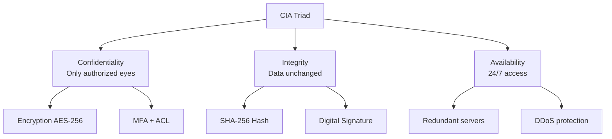
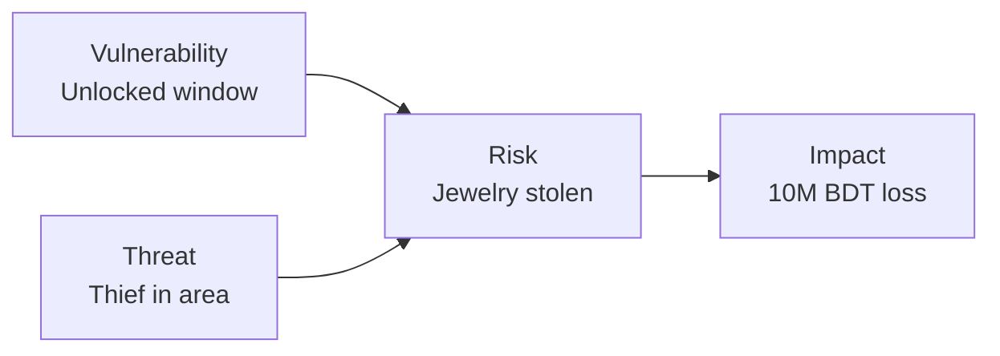
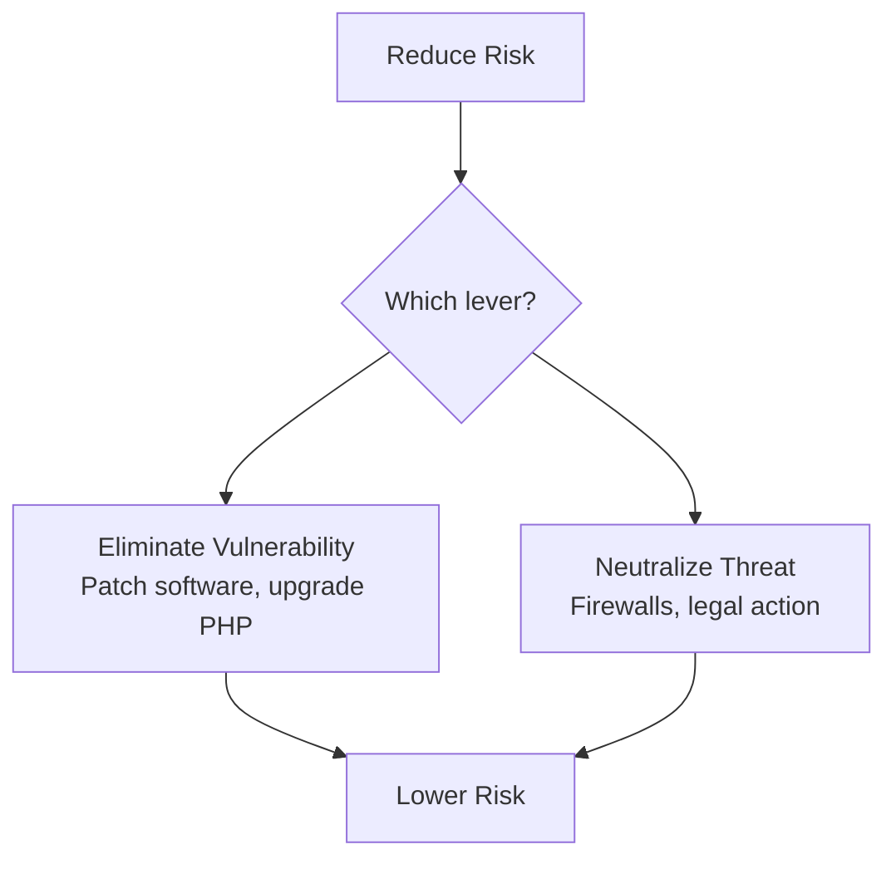
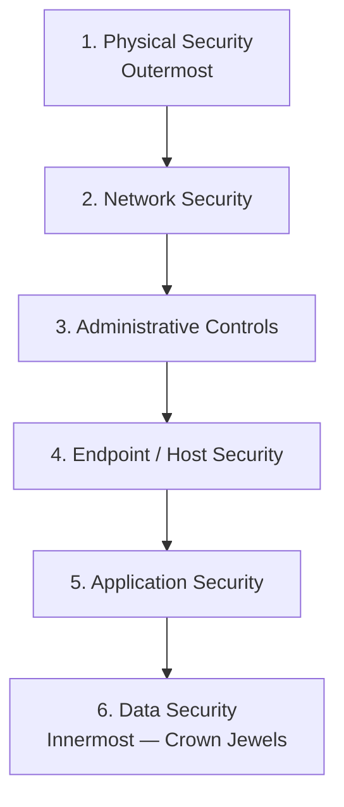
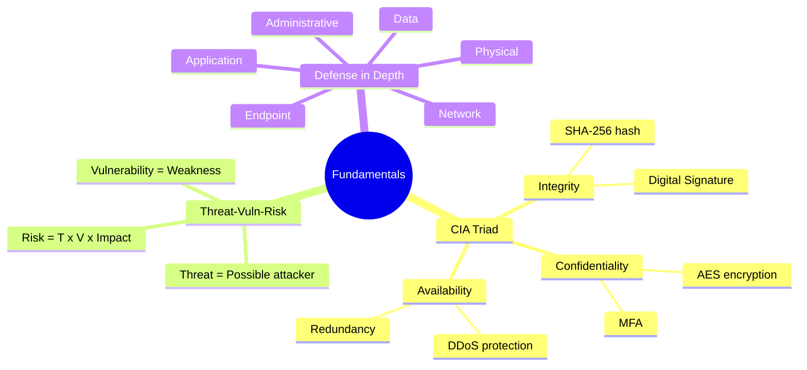

# Chapter 01 — Fundamentals & Frameworks 🏛️

> CIA Triad, Threat vs Vulnerability vs Risk, এবং Defense in Depth — cyber security-এর তিনটা foundational concept যেগুলো প্রায় প্রতিটা Bank IT exam paper-এ থাকে।

---

## 📚 What you will learn

এই chapter-এর শেষে আপনি পারবেন:

1. **CIA Triad** কী এবং কেন এটা banking system-এর core
2. **Threat, Vulnerability, Risk** — তিনটা term-এর difference একটা real banking example দিয়ে
3. **Defense in Depth** strategy — bank-এর IT system-এ multi-layer security কীভাবে design করা হয়

প্রতিটা topic আগে Bangla intro দিয়ে framing, তারপর Gemini-র verbatim answer (English), শেষে comparison table / mermaid diagram।

---

## 🎯 Question 1 — CIA Triad

### কেন এটা important?

Cyber security-এর সবচেয়ে fundamental model। যেকোনো security policy design করতে গেলে আগে CIA Triad-এর তিনটা pillar মাথায় রাখতে হয়। Bank exam-এ প্রায় গ্যারান্টি যে এটা আসবে — সাধারণত 5 marks-এর জন্য।

> **Q1: Explain the CIA Triad and its importance in the context of a centralized banking system.**

The CIA Triad is the foundational model designed to guide policies for information security within an organization. For a bank, it ensures that financial data is **safe, accurate, and accessible**.

### 1. Confidentiality

- **Definition:** Ensuring that sensitive information is accessed only by authorized people.
- **Banking Context:** A customer's account balance or transaction history should not be visible to other customers or unauthorized staff.
- **Implementation:** Encryption (AES), Multi-Factor Authentication (MFA), and strict Access Control Lists (ACLs).

### 2. Integrity

- **Definition:** Ensuring that data is accurate, complete, and has not been tampered with by unauthorized parties.
- **Banking Context:** If you transfer 5,000 BDT, the database must reflect exactly 5,000 BDT. A hacker should not be able to change that value to 50,000 BDT during transit.
- **Implementation:** Digital Signatures, Hashing (SHA-256), and Checksums.

### 3. Availability

- **Definition:** Ensuring that systems and data are available to authorized users when needed.
- **Banking Context:** Customers must be able to use ATM services or mobile banking apps 24/7. If the server is down due to a DoS attack, "Availability" is compromised.
- **Implementation:** Redundant servers (High Availability), regular backups, and DDoS protection.

### Visual Mnemonic

### Why each pillar matters for Bangladesh Bank exams

| Pillar lost | Real-world consequence |
|-------------|------------------------|
| Confidentiality | Data Breach / Privacy Lawsuit |
| Integrity | Financial Fraud / Incorrect Ledgers |
| Availability | Operational Paralysis / Bank Run |

> **Written Exam Tip:** Always end the answer with — "A failure in any one of these leads to a loss of public trust and financial stability."

---

## 🎯 Question 2 — Threat vs Vulnerability vs Risk

### কেন এটা important?

এই তিনটা term general conversation-এ interchangeably use হয়, কিন্তু cyber security-এ এদের specific মানে আছে। Examiner দেখতে চায় আপনি difference বুঝেন কি না।

> **Q2: Differentiate between Threat, Vulnerability, and Risk with an example related to online banking.**

In Cyber Security, Threat, Vulnerability, and Risk have very specific meanings. Let's break them down.

### 1. Vulnerability

- **Definition:** A weakness or flaw in a system, process, or internal control that could be exploited by a threat.
- **Banking Example:** An outdated web server running an old version of PHP, or a banking app that doesn't require a strong password. It is a "hole" in the defense.

### 2. Threat

- **Definition:** Any potential occurrence (either malicious or accidental) that can cause harm to an asset by exploiting a vulnerability.
- **Banking Example:** A hacker group attempting to steal credentials, a malicious insider, or even a natural disaster like a flood damaging the data center.

### 3. Risk

- **Definition:** The potential for loss or damage when a Threat exploits a Vulnerability. It is often calculated as:

$$\text{Risk} = \text{Threat} \times \text{Vulnerability} \times \text{Impact}$$

- **Banking Example:** The "Risk" is the actual financial loss or data breach that happens if a hacker (Threat) uses an outdated server (Vulnerability) to steal 10 million BDT (Impact).

### The "Window and Thief" Analogy

| Term | Analogy |
|------|---------|
| **Vulnerability** | A window is left unlocked |
| **Threat** | A thief is walking through the neighborhood |
| **Risk** | The possibility that the thief sees the unlocked window and steals your jewelry |

### Risk Reduction Strategy

> **Written Exam Tip:** Since we cannot always control threats (a hacker on the internet is beyond our control), security teams focus on **patching vulnerabilities**.

---

## 🎯 Question 3 — Defense in Depth

### কেন এটা important?

Single security measure-এর উপর নির্ভর করা bank-এর জন্য suicide। যদি একটাই password layer থাকে আর সেটা breach হয়, পুরো system gone। Defense in Depth এই problem-এর solution।

> **Q3: What is "Defense in Depth"? Explain how a bank can implement multiple layers of security.**

In a banking environment, relying on a single security measure (like just a password) is dangerous. **Defense in Depth (DiD)** is a strategy that uses multiple layers of security controls to protect data. If one layer fails, others are in place to stop the threat.

Think of it like a high-security bank vault: you have a boundary wall, armed guards, CCTV, a locked door, and finally, the safe itself.

### The 6 Layers of Defense in a Bank's IT System

#### Layer 1 — Physical Security (Outermost)

- Protecting the actual servers and data centers.
- **Examples:** Biometric access to server rooms, CCTV, security guards, fire suppression systems.

#### Layer 2 — Network Security

- Protecting the flow of data into and out of the bank.
- **Examples:** Firewalls to block unauthorized traffic, IDS/IPS (Intrusion Detection / Prevention Systems), VPNs for secure remote access by bank staff.

#### Layer 3 — Administrative Controls

- The rules and policies set by management.
- **Examples:** Security awareness training for employees (to prevent phishing), background checks for IT staff, the Bangladesh Bank ICT Security Guidelines.

#### Layer 4 — Endpoint / Host Security

- Protecting individual devices like PCs, Laptops, ATMs.
- **Examples:** Antivirus software, disabling USB ports on bank terminals, regular OS patching.

#### Layer 5 — Application Security

- Securing the software used for banking.
- **Examples:** Multi-Factor Authentication (MFA), session timeouts, input validation to prevent SQL injection.

#### Layer 6 — Data Security (Innermost — "Crown Jewels")

- Protecting the actual information.
- **Examples:** Encryption (making data unreadable without a key) and regular backups stored in an off-site location.

### Quick Reference Table

| Layer | Tool / Control | Threat it stops |
|-------|---------------|-----------------|
| Physical | Biometric, CCTV | Physical intrusion |
| Network | Firewall, IDS/IPS, VPN | External hackers |
| Administrative | Training, ICT Policy | Insider negligence |
| Endpoint | Antivirus, USB block | Malware on PC |
| Application | MFA, Input validation | Web exploits, SQLi |
| Data | AES Encryption, Backups | Data theft, ransomware |

> **Written Exam Tip:** Emphasize that **redundancy is the key**. Use this phrase: "The goal of Defense in Depth is to provide a 'delaying' mechanism to buy time for the IT team to respond to a breach."

---

## 📝 Chapter Summary

এই chapter-এ আমরা cyber security-এর তিনটা foundation cover করলাম:

1. **CIA Triad** — Confidentiality + Integrity + Availability — যেকোনো security policy-র base।
2. **Threat / Vulnerability / Risk** — তিনটা ভিন্ন concept; Risk = Threat × Vulnerability × Impact। Vulnerability patching-ই সবচেয়ে controllable lever।
3. **Defense in Depth** — 6 layer (Physical → Network → Admin → Endpoint → App → Data) — single point of failure এড়ানোর strategy।

---

## 🎓 Written Exam Tips Recap

- **CIA failure-এর consequence** — Loss of public trust + financial stability।
- **Risk reduction** — Threat control করা কঠিন, তাই Vulnerability patch করুন।
- **Defense in Depth** — "Delaying mechanism to buy response time" phrase-টা use করুন।
- প্রতিটা answer-এ অন্তত একটা Bangladesh-specific example দিন (BDT amount, Bangladesh Bank ICT Guidelines, etc.)।

---

[← Master Index](00-master-index.md) · [Next: Network Security →](02-network-security.md)
