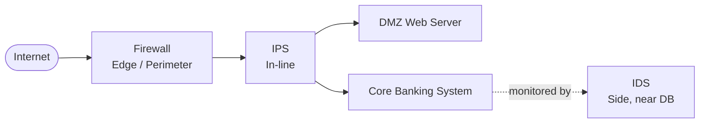
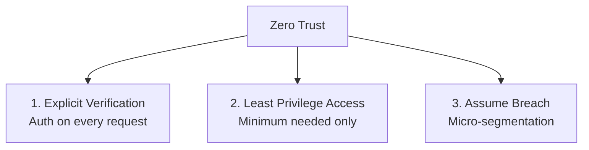
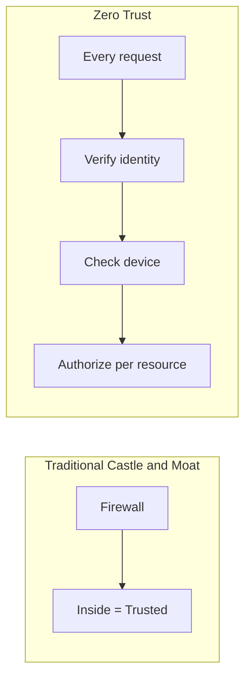
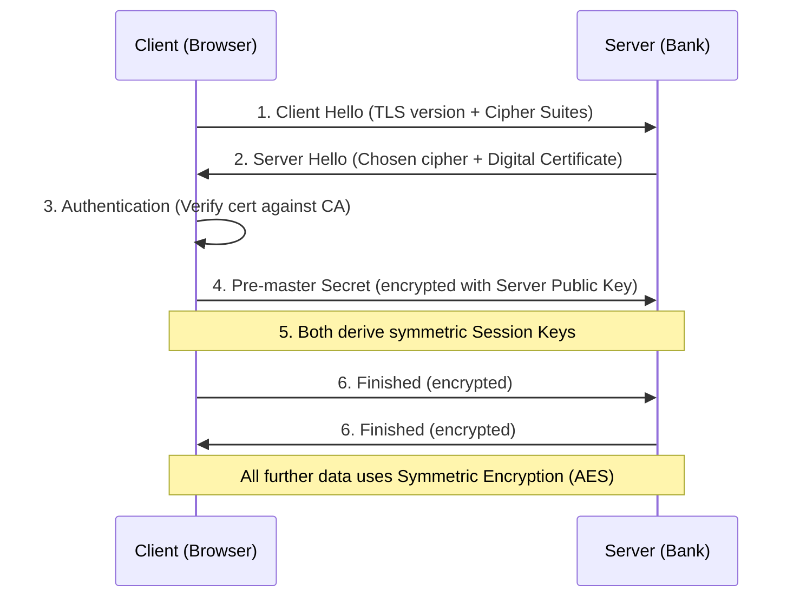
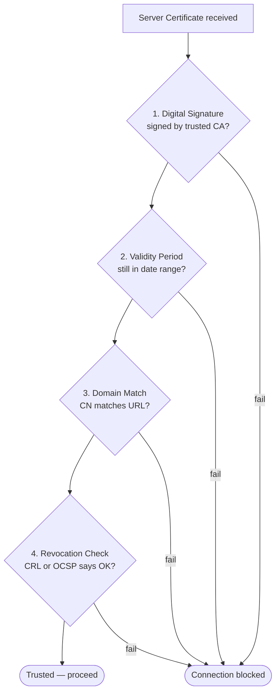
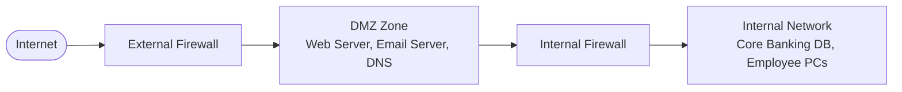
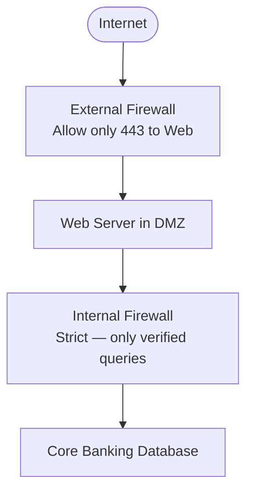
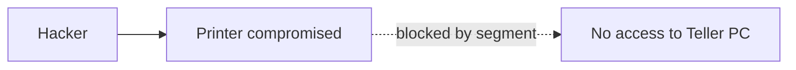
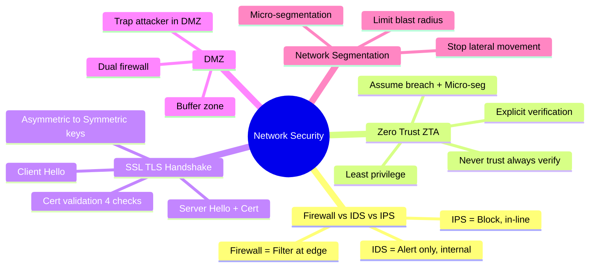

# Chapter 02 — Network & Infrastructure Security 🌐

> Firewall vs IDS vs IPS, Zero Trust Architecture, SSL/TLS Handshake (with Certificate Validation deep dive), DMZ, এবং Network Segmentation। Bank-এর network design-এর সবচেয়ে গুরুত্বপূর্ণ পাঁচটা topic।

---

## 📚 What you will learn

- **Firewall, IDS, IPS** — তিনটার কাজ ও placement একটা bank network-এ
- **Zero Trust Architecture (ZTA)** — "Never Trust, Always Verify" model
- **SSL/TLS Handshake** — step-by-step process এবং certificate validation deep dive
- **DMZ basics** — public web server vs internal database isolation
- **Network Segmentation** — lateral movement prevent করা

---

## 🎯 Question 4 — Firewall vs IDS vs IPS

### কেন এটা important?

এই তিনটা tool bank network-এর "digital border guards"। Comparison-style question — high probability।

> **Q4: Firewall vs. IDS vs. IPS — Explain the functional differences and their placement in a bank's network.**

In a banking network, these three tools act as the "digital border guards." While they all monitor traffic, their methods and actions differ significantly.

### 1. Firewall (The Gatekeeper)

- **Function:** Acts as a barrier between a trusted network (the bank's internal LAN) and an untrusted network (the Internet). It allows or blocks traffic based on a set of pre-defined security rules (e.g., Block all traffic from Port 80, Allow Port 443).
- **Analogy:** A security guard at a gate who only lets people in if their name is on the guest list.

### 2. IDS — Intrusion Detection System (The Security Camera)

- **Function:** Monitors network traffic for suspicious activity or known threats. When it finds something, it only sends an alert to the IT Administrator. **It does not stop the attack itself.**
- **Analogy:** A security camera or burglar alarm that rings when someone breaks in but doesn't grab the thief.

### 3. IPS — Intrusion Prevention System (The Active Guard)

- **Function:** More advanced than an IDS. It monitors traffic, detects a threat, and **automatically takes action to block it** (e.g., dropping malicious packets or resetting the connection).
- **Analogy:** A guard who spots an intruder and immediately tackles them to prevent entry.

### Comparison Table (Quick Reference)

| Feature | Firewall | IDS | IPS |
|---------|----------|-----|-----|
| **Primary Goal** | Access Control (Filter) | Monitoring & Alerting | Detection & Prevention |
| **Action** | Blocks based on Rules | Logs and Alerts only | Blocks Malicious Traffic |
| **Placement** | Edge of the network | Inside the network (side) | In-line (direct path) |
| **Intelligence** | Static (Rules) | Dynamic (Patterns) | Dynamic (Real-time) |

### Placement in a Bank's Network

- **Firewall:** At the very edge (Perimeter) — filter external traffic.
- **IPS:** In-line, right behind the firewall — catch attacks the firewall might miss.
- **IDS:** Near the Database / Core Banking System (CBS) — monitor internal traffic for insider threats.

> **Written Exam Tip:** Always mention placement in a bank-specific diagram. "IDS near the CBS detects insider threats — this is where the 2016 BB Heist could have been caught earlier."

---

## 🎯 Question 5 — Zero Trust Architecture (ZTA)

### কেন এটা important?

2026 BB Cybersecurity Framework-এ ZTA mandatory করা হয়েছে। Modern security paradigm।

> **Q5: What is Zero Trust Architecture (ZTA)? Why is the "Never Trust, Always Verify" model becoming essential for financial institutions?**

In traditional security, we used the **"Castle and Moat"** approach — once someone was inside the bank's network (behind the firewall), they were trusted. **Zero Trust flips this logic.**

### 1. The Core Concept

Zero Trust is a security framework based on the principle that **no user or device, whether inside or outside the network, should be trusted by default**. Every single request for access must be authenticated, authorized, and continuously validated.

### 2. The Three Main Pillars of Zero Trust

- **Explicit Verification:** Always authenticate based on all available data points (user identity, location, device health, service or workload).
- **Least Privilege Access:** Users are given only the minimum level of access they need to do their job (e.g., a teller doesn't need access to the core database server).
- **Assume Breach:** Operate as if a hacker is already inside the network. This leads to **Micro-segmentation** (breaking the network into small, isolated zones) to prevent a hacker from moving "laterally" from one system to another.

### 3. Why is it essential for Bangladesh Bank / Commercial Banks?

| Driver | Why ZTA helps |
|--------|---------------|
| **Rise of Remote Work** | Employees access banking systems from home/mobile — perimeter Firewall is no longer enough |
| **Insider Threats** | Many banking frauds are committed by people with internal access — ZTA limits what an insider can do |
| **Sophisticated Ransomware** | If a single PC gets infected, ZTA prevents virus spreading to CBS via micro-segmentation |
| **Cloud Adoption** | As banks move to AWS / Cloudflare, data is no longer in one "physical building" — identity-based security is necessary |

### Castle-and-Moat vs Zero Trust

> **Key Phrase for the Exam:** *"Zero Trust moves the focus from Network-centric security to Identity-centric security."*

---

## 🎯 Question 6 — SSL/TLS Handshake

### কেন এটা important?

প্রতিটা internet banking session এই handshake দিয়ে শুরু হয়। 2016 heist-এর পর থেকে এটা key technical question।

> **Q6: SSL/TLS Handshake — Describe the process of establishing a secure connection between a client and a banking server.**

When you type `https://www.bangladesh-bank.org.bd` into your browser, a complex "handshake" occurs in milliseconds. This process ensures that your data is encrypted and that you are actually talking to the bank's real server, not a fake one.

### Step-by-Step Process

1. **Client Hello:** The user's browser sends a message to the bank's server. It includes the SSL/TLS version it supports and a list of "Cipher Suites" (encryption algorithms) it can use.
2. **Server Hello:** The server responds by choosing the best encryption method from the list and sends its **Digital Certificate** (which contains the server's Public Key).
3. **Authentication:** The browser checks the certificate against a trusted Certificate Authority (CA). This confirms: "Yes, this is definitely the official bank server."
4. **Key Exchange (The Secret):** The browser creates a "Pre-master Secret" (a random string of data), encrypts it with the bank's Public Key, and sends it back. Only the bank's Private Key can decrypt this.
5. **Session Keys Created:** Both the browser and server now use that secret to create **Symmetric Session Keys**.
6. **Finished / Encrypted:** Both sides send a "Finished" message. From this point forward, all data (your password, balance, etc.) is encrypted using the shared Session Keys.

### Why it matters for Banking Security

- **Encryption:** Even if a hacker intercepts the traffic (Man-in-the-Middle attack), they will only see gibberish text.
- **Trust:** The Digital Certificate prevents a hacker from creating a fake website that looks like the bank.

> **Written Exam Tip:** If the question asks about Symmetric vs. Asymmetric encryption in this context:
> - **Asymmetric (Public/Private Key):** Used during the handshake to securely share the secret.
> - **Symmetric (Session Key):** Used for the actual data transfer because it is much faster and requires less processing power.

---

## 🎯 Question 6+ — Certificate Validation (Deep Dive)

### কেন এটা important?

Q6-এর extension question। Examiner চাইবে আপনি validation চারটা step বিস্তারিত বলুন।

> **Deep Dive: How does the browser actually trust a bank's certificate?**

### 1. The Handshake Flow (Technical Steps)

- **Client Hello:** The browser sends its supported TLS versions and "Cipher Suites" (a list of encryption mathematical formulas it knows).
- **Server Hello:** The Bank's server picks the strongest Cipher Suite they both support.
- **Certificate Transfer:** The server sends its Digital Certificate to the browser. This certificate contains the server's Public Key.

### 2. Detailed Certificate Validation (The "Trust" Part)

This is where the browser decides if it should trust the bank's website. It performs these four checks:

- **Digital Signature Check:** The certificate is signed by a Certificate Authority (CA) (like DigiCert or GlobalSign). The browser uses the CA's public key (already built into your Windows / Chrome / Mac) to verify that the signature is authentic.
- **Validity Period:** It checks the "Valid From" and "Valid To" dates. If the certificate is expired, you get that "Your connection is not private" error.
- **Domain Matching:** It checks if the domain name on the certificate matches the URL you typed (e.g., `bangladesh-bank.org.bd`).
- **Revocation Check (CRL / OCSP):** It checks if the certificate has been "revoked" (cancelled) by the bank before its expiry date (due to a leak or hack).

### 3. The Key Exchange (Asymmetric to Symmetric)

This is the most "clever" part of the process:

| Phase | Type | Why |
|-------|------|-----|
| Pre-Master Secret transfer | Asymmetric (slow but secure) | Only Bank's Private Key can decrypt the Pre-Master Secret encrypted with its Public Key |
| Bulk data after handshake | Symmetric (fast) | Both sides derived the same Session Key — AES-256 is fast enough for large data |

### Summary for Written Exam

Use these technical terms to score higher:

- **Public Key Infrastructure (PKI):** The system that manages the certificates.
- **Certificate Authority (CA):** The trusted third party that signs the certificate.
- **Asymmetric Encryption:** Used for the handshake (Authentication).
- **Symmetric Encryption:** Used for the data transfer (Confidentiality).

---

## 🎯 Question 16 — DMZ (Demilitarized Zone)

### কেন এটা important?

Bank-কে internet banking দিতে হলে public internet-এর সাথে connect করতেই হয় — কিন্তু core database direct expose করা যাবে না। DMZ এই problem-এর solution।

> **Q16: DMZ (Demilitarized Zone) — Explain its role in protecting a bank's internal network.**

For a bank to offer Internet Banking, it must be connected to the public internet. However, connecting the "Core Database" directly to the internet is suicide. A DMZ solves this.

### 1. Definition

A **DMZ** is a physical or logical sub-network that contains and exposes an organization's external-facing services (like Web Servers or Email Servers) to an untrusted network (the Internet), while keeping the rest of the internal network protected behind a firewall.

### 2. How it protects the Bank — Dual Firewalls

- **External Firewall:** Allows the public to access the web server in the DMZ.
- **Internal Firewall:** Sits between the DMZ and the bank's internal network (where the money is).

### 3. Containment Principle

If a hacker successfully compromises the Bank's website, they are **"trapped" in the DMZ**. They still have to hack through a second, even stricter internal firewall to reach the actual customer account database.

> **Written Exam Tip:** Emphasize that "the DMZ acts as a buffer zone. Even a successful breach of the public-facing web server does not give the attacker access to the Core Banking System."

---

## 🎯 Question 23 — Network Segmentation (Deep Dive)

### কেন এটা important?

Q16-এর extension। Lateral movement prevent করার technique। 2026 BB Framework-এ "Micro-segmentation" mandatory।

> **Q23: Network Segmentation and the DMZ — Explain how they isolate banking assets to prevent "Lateral Movement."**

In a high-security environment like a bank, you cannot treat the entire network as one big room. If a hacker gets into one computer, they shouldn't be able to "walk" into the database server.

### 1. What is Network Segmentation?

Network Segmentation is the practice of splitting a computer network into smaller, isolated sub-networks (segments). Each segment acts as its own "security zone" with its own set of rules.

**Why it's vital for banks:** If a malware infection occurs on a teller's workstation (Segment A), segmentation prevents that malware from spreading to the Core Banking System (Segment B).

### 2. The DMZ Recap

The DMZ is a specific type of segment that sits between the Public Internet and the Private Internal Network. It acts as a "buffer zone."

- **External-Facing Services:** Web Server (Internet Banking), Email Server, DNS.
- **The Internal Network:** Core Banking Database, Employee PCs, Financial Records — never directly accessible from the internet.

### 3. The Dual-Firewall Three-Tier Architecture

- **External Firewall:** Sits between the Internet and the DMZ. It only allows traffic to the Web Server (Port 443 / HTTPS).
- **Internal Firewall:** Sits between the DMZ and the Internal Network. It is much stricter. It only allows the Web Server to talk to the Database for specific, verified requests.

### 4. Preventing "Lateral Movement"

"Lateral Movement" is a technique used by hackers to move deeper into a network after an initial breach.

| Scenario | Without Segmentation | With Segmentation |
|----------|---------------------|-------------------|
| Hacker compromises a printer | → accesses teller PC → admin PC → DB | → **Blocked.** Printer is in isolated IoT segment with no permission to talk to PCs or servers |

> **Written Exam Tip:** Use the term **"Air-Gap"** (extreme isolation, no network at all) or **"Micro-segmentation"** (modern software-defined networks) when writing about DMZ. Explain that the goal is to limit the **"Blast Radius"** of a cyberattack.

---

## 📝 Chapter Summary

---

## 🎓 Written Exam Tips Recap

- **Firewall / IDS / IPS placement diagram** আঁকতে শিখুন — Edge / In-line / Side।
- **Zero Trust** — "Network-centric → Identity-centric" key phrase।
- **TLS Handshake** sequence diagram — 6 steps মনে রাখুন।
- **Certificate validation** — 4টা check (Signature / Validity / Domain / Revocation)।
- **DMZ** — "Dual firewall trap" + "Blast radius" terminology।
- **Asymmetric vs Symmetric** — handshake-এ asymmetric, data transfer-এ symmetric।

---

[← Previous: Fundamentals](01-fundamentals.md) · [Master Index](00-master-index.md) · [Next: Banking & Payment →](03-banking-payment.md)
