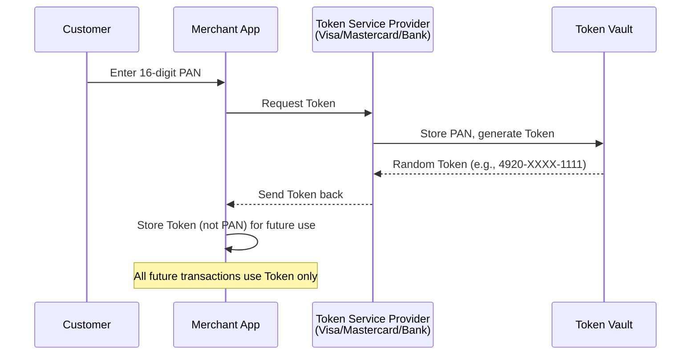
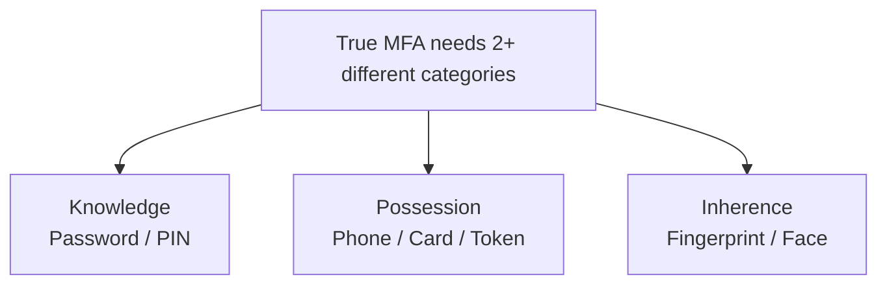
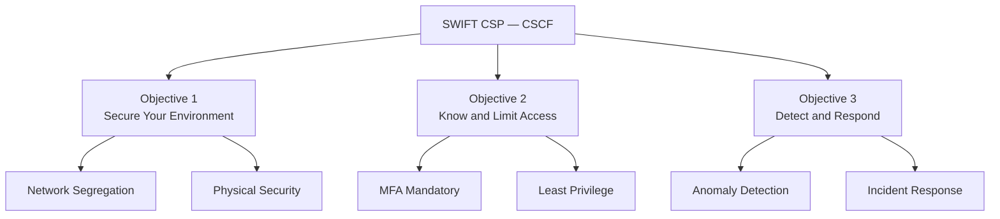
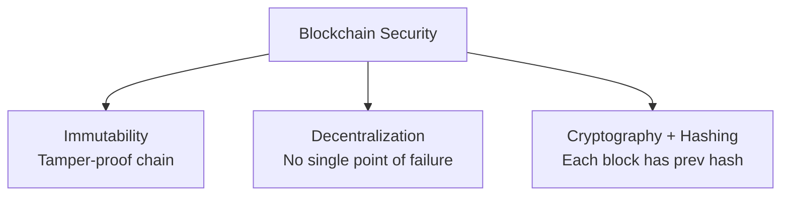
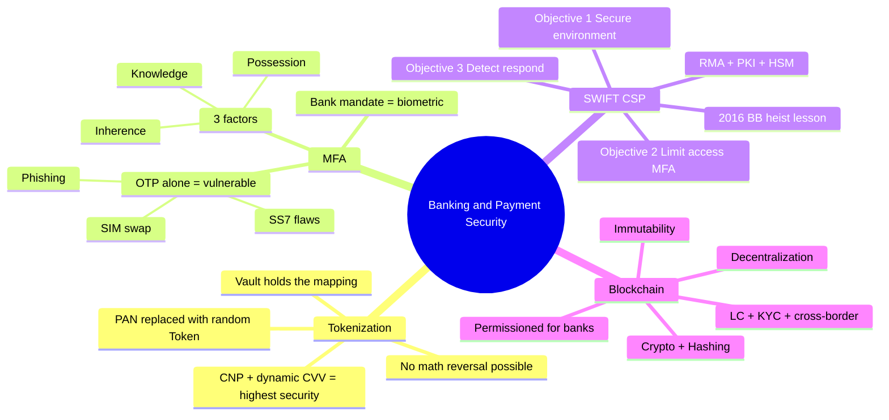

# Chapter 03 — Banking & Payment Security 💳

> Tokenization, Multi-Factor Authentication, SWIFT Customer Security Programme, এবং Blockchain in Banking — এই চারটা টপিক bank-specific cyber security exam-এ সবচেয়ে বেশি আসে। 2016 SWIFT heist-এর জন্য SWIFT অংশটা compulsory পড়তে হবে।

---

## 📚 What you will learn

- **Tokenization** — কীভাবে CNP transaction-এ card data secure হয়
- **MFA** — তিন factor (Knowledge / Possession / Inherence) এবং কেন OTP alone যথেষ্ট না
- **SWIFT CSP** — 2016 BB heist-এর পর implemented framework
- **Blockchain in Banking** — Distributed Ledger-এর security advantage

---

## 🎯 Question 7 — Tokenization

### কেন এটা important?

bKash, Nagad, Visa, Mastercard সবাই use করে। CNP (Card Not Present) — অর্থাৎ online shopping — এ card fraud-এর সবচেয়ে বড় defense।

> **Q7: What is Tokenization? Explain how it secures card-not-present (CNP) transactions.**

In modern digital banking and e-wallets (like bKash or Nagad), Tokenization is a key security measure used to protect sensitive cardholder data.

### 1. Definition

**Tokenization** is the process of replacing a sensitive data element (like a 16-digit Credit/Debit Card Number) with a non-sensitive equivalent, called a **Token**. This token has no extrinsic or exploitable value; it is simply a reference (a surrogate value).

### 2. How it works (Step-by-Step)

1. **Input:** A customer enters their 16-digit Primary Account Number (PAN) into a merchant's app.
2. **Request:** Instead of storing the real card number, the merchant's system sends a request to a Token Service Provider (like Visa, Mastercard, or the bank).
3. **Generation:** The provider generates a unique, random string of numbers (the Token) that maps back to the real card number in a secure vault.
4. **Transaction:** The token is sent back to the merchant. For all future transactions, only this token is used.

### 3. Why it is important for Banking Security

- **Data Breach Protection:** If a hacker breaches a merchant's database (e.g., an e-commerce site), they only find "Tokens." Since the hacker doesn't have the "Vault" to de-tokenize them, the stolen data is useless.
- **PCI DSS Compliance:** Banks and merchants can reduce their compliance burden because they are no longer storing "live" credit card numbers.
- **Device Binding:** Tokens can be restricted to a specific device (e.g., a token that only works on your specific smartphone), making it harder for attackers to use stolen tokens elsewhere.

### Tokenization vs Encryption

| Aspect | Tokenization | Encryption |
|--------|--------------|------------|
| **Method** | Mapping (random replacement) | Mathematical algorithm |
| **Reversibility** | No math-based reversal — must access Vault | Yes, with the Key |
| **What hacker steals** | Useless tokens | Ciphertext (still risk if Key leaks) |
| **Use case** | Card numbers, PII | Files, communications |

> **Written Exam Tip:** When discussing CNP (Card-Not-Present) transactions, mention that **tokenization combined with a dynamic CVV or OTP** provides the highest level of security for online shopping in Bangladesh.

---

## 🎯 Question 8 — Multi-Factor Authentication (MFA)

### কেন এটা important?

Single password আজকের যুগে fully insecure। 2026 BB Framework MFA-কে mandatory করেছে। Examiner দেখতে চায় আপনি "factor" বুঝেন।

> **Q8: Multi-Factor Authentication (MFA) — List three types of authentication factors and explain why MFA is more secure than OTP alone.**

MFA is a security system that requires more than one distinct method of verification to prove a user's identity. In the banking sector, relying on a single factor (like a password) is no longer considered safe.

### 1. The Three Categories of Authentication Factors

To be considered "True MFA," the factors must come from **different categories**. Using two passwords is just "two-step verification," not true MFA.

| Factor | Meaning | Examples |
|--------|---------|----------|
| **Knowledge** | Something you **know** | Password, PIN, security question answer |
| **Possession** | Something you **have** | ATM card, hardware token, OTP on registered mobile, digital certificate |
| **Inherence** | Something you **are** | Fingerprint, facial recognition, iris scan, voice pattern |

### 2. Why MFA is more secure than OTP alone

While an OTP (One-Time Password) is a strong security measure, relying on it alone has vulnerabilities:

- **SIM Swapping:** A hacker can trick a mobile operator into porting your phone number to their SIM card, allowing them to intercept your OTP.
- **Phishing:** A hacker can create a fake login page that asks for your OTP immediately after you enter your password.
- **SS7 Vulnerabilities:** The global telecom network (SS7) has flaws that allow sophisticated attackers to intercept SMS messages in transit.

**MFA adds a "Third Layer" (usually Biometrics):**
By combining a Password (Knowledge) + OTP (Possession) + Fingerprint (Inherence), you create a defense where even if a hacker steals your password and intercepts your SMS, they still cannot access your account without your physical presence (biometrics).

### 3. Bangladesh Bank Context

Bangladesh Bank has specific guidelines for **Agent Banking** and **e-KYC** that mandate **biometric verification** (fingerprint) for transactions. This is a form of high-security MFA that protects rural and unbanked populations from fraud.

### Strength Comparison

| Authentication | Description | Strength |
|---------------|-------------|----------|
| **Single Factor** | Password only | Weakest |
| **2FA** | Password + OTP | Good |
| **MFA** | Password + OTP + Biometric | Strongest |

> **Written Exam Tip:** Always say "True MFA = factors from different categories." Two passwords is NOT MFA — it's just 2-step verification.

---

## 🎯 Question 9 — SWIFT Security & CSP

### কেন এটা important?

2016 Bangladesh Bank heist — $81 million stolen — এই topic-এর importance double করেছে। Bangladesh-এর exam-এ SWIFT CSP প্রায় guaranteed question।

> **Q9: SWIFT Security — Briefly discuss the security measures required for international inter-bank fund transfers (mentioning the SWIFT CSP).**

This is a high-priority topic for any Bangladesh Bank IT exam because of the historic 2016 Bangladesh Bank heist.

### 1. What is SWIFT?

**SWIFT** (Society for Worldwide Interbank Financial Telecommunication) does **not** actually move money; it sends **secure payment instructions** between banks. Because these messages are as good as cash, their security is critical.

### 2. The SWIFT Customer Security Programme (CSP)

After the 2016 incident, SWIFT launched the CSP to force all member banks to improve their local security. It revolves around the **Customer Security Controls Framework (CSCF)**, which has three main objectives:

#### Objective 1 — Secure Your Environment

- **Network Segregation:** The SWIFT terminal must be **isolated** from the bank's general internet/IT network to prevent malware from spreading.
- **Physical Security:** The physical room where the SWIFT terminal is kept must have restricted access.

#### Objective 2 — Know and Limit Access

- **MFA:** Mandatory for all users accessing the SWIFT infrastructure.
- **Least Privilege:** Users should only have the minimum access needed (e.g., an operator can create a message, but a different manager must authorize it).

#### Objective 3 — Detect and Respond

- **Anomaly Detection:** Constant monitoring for "unusual" transaction patterns (e.g., large transfers at 3:00 AM).
- **Incident Response:** Banks must have a plan to report and react if they suspect a breach.

### 3. Key Technical Security Measures

| Measure | What it does |
|---------|--------------|
| **RMA — Relationship Management Application** | A filter that allows a bank to define which other banks it is willing to receive messages from. Blocks unauthorized senders |
| **PKI — Public Key Infrastructure** | Every SWIFT message is digitally signed and encrypted, ensuring it cannot be altered during transit (Integrity) |
| **HSM — Hardware Security Module** | A physical device used to store the digital keys for signing messages, making them almost impossible to steal remotely |

### 4. Bangladesh Bank Context

Bangladesh Bank now uses **highly isolated networks** for SWIFT and has implemented **Real-Time Fraud Monitoring** as per SWIFT's mandatory controls.

> **Written Exam Tip:** If the question is about the **"Lessons learned from the 2016 Heist,"** emphasize that the vulnerability **wasn't in the SWIFT network itself, but in the local bank's environment** (lack of firewalls, weak passwords, no MFA, no network segregation between SWIFT terminal and general LAN).

---

## 🎯 Question 10 — Blockchain in Banking

### কেন এটা important?

Bangladesh Bank-এর "National Blockchain Strategy" আছে। Future-of-banking question।

> **Q10: Blockchain in Banking — Discuss the security advantages of using Distributed Ledger Technology (DLT) for financial records.**

In recent years, Bangladesh Bank has explored the "National Blockchain Strategy." For the exam, you need to explain why a decentralized system is often more secure than a centralized one for banking.

### 1. Core Security Features of Blockchain

- **Immutability (Tamper-proof):** Once a transaction is recorded in a "block" and added to the "chain," it cannot be changed or deleted. To change one record, a hacker would have to change every subsequent block across thousands of computers simultaneously, which is computationally impossible.
- **Decentralization (No Single Point of Failure):** Traditional banks use a central database. If that database is hacked or destroyed, the bank stops. In a blockchain, the ledger is distributed across many "nodes." If one node goes down, the others keep the system running.
- **Cryptography & Hashing:** Each block contains a unique "Hash" (digital fingerprint) of the previous block. If even one character in a transaction is altered, the Hash changes, the chain breaks, and the network immediately rejects the fraudulent block.

### 2. Practical Banking Use-Cases

| Use case | How blockchain helps |
|----------|---------------------|
| **Smart Contracts** | Self-executing contracts. Example — a Letter of Credit (LC) automatically releases payment to an exporter only when shipping documents are digitally verified |
| **KYC Sharing** | Banks can share a single, secure, blockchain-based KYC record. Once one bank verifies a customer, others can trust that record without repeating |
| **Cross-Border Payments** | Currently international transfers take days through correspondent banks. Blockchain (Ripple, JPM Coin) allows near-instant peer-to-peer transfers with full transparency |

### 3. Challenges for Bangladesh (Critical Analysis)

- **Scalability:** Blockchains can be slower at processing thousands of transactions per second compared to traditional systems.
- **Regulatory Uncertainty:** Bangladesh Bank is **cautious about private cryptocurrencies** (like Bitcoin), though it is very interested in the underlying Blockchain technology for official use.
- **Integration:** It is difficult to connect modern blockchain systems with 20-year-old "Legacy" core banking software.

### Public vs Permissioned Blockchain

| Aspect | Public Blockchain | Permissioned / Private Blockchain |
|--------|------------------|----------------------------------|
| **Examples** | Bitcoin, Ethereum | Hyperledger Fabric, R3 Corda |
| **Who can join** | Anyone | Only invited / authorized members |
| **Banking use** | ❌ Not used | ✅ Always preferred for banks |
| **Reason** | Privacy + Speed + Regulation | Controlled access, faster consensus |

> **Written Exam Tip:** Always distinguish between **Public Blockchains** (anyone can join) and **Permissioned / Private Blockchains** (banks use). Banks will always use **Permissioned Blockchains** for security and privacy.

---

## 📝 Chapter Summary

---

## 🎓 Written Exam Tips Recap

- **Tokenization** — "No math reversal, only Vault lookup" + dynamic CVV combo।
- **MFA** — Different category factors, biometric mandatory in Bangladesh agent banking।
- **SWIFT CSP** — 3 objectives + RMA/PKI/HSM trio + 2016 lesson local environment-এর fault।
- **Blockchain** — Permissioned for banks, smart contracts for LC, BB is cautious about crypto but loves DLT।
- প্রতিটা answer-এ "PCI DSS", "ICT Security Guidelines", "BFIU" — এই keyword গুলো ছড়িয়ে দিন।

---

[← Previous: Network Security](02-network-security.md) · [Master Index](00-master-index.md) · [Next: Threats & Attacks →](04-threats-attacks.md)
