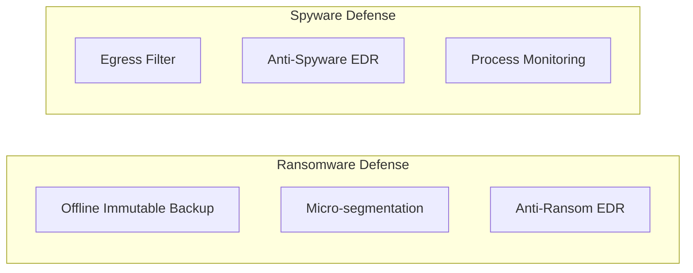
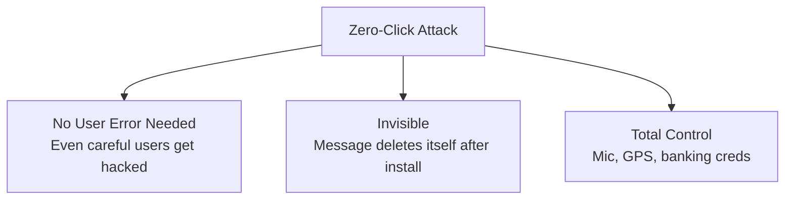
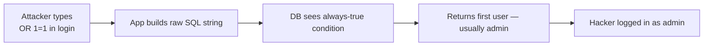
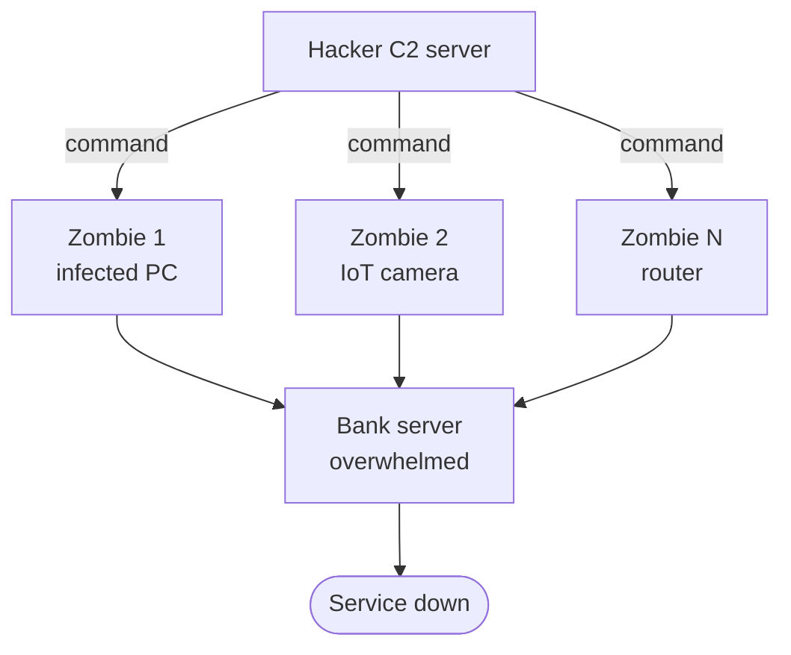
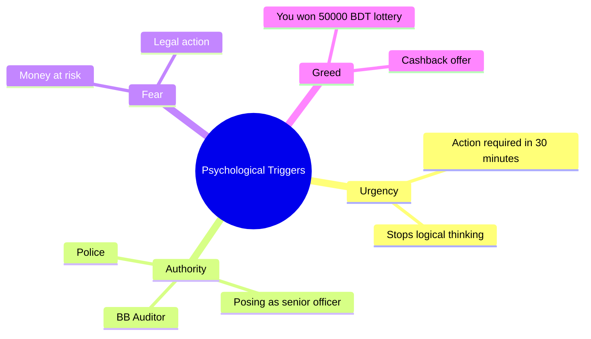
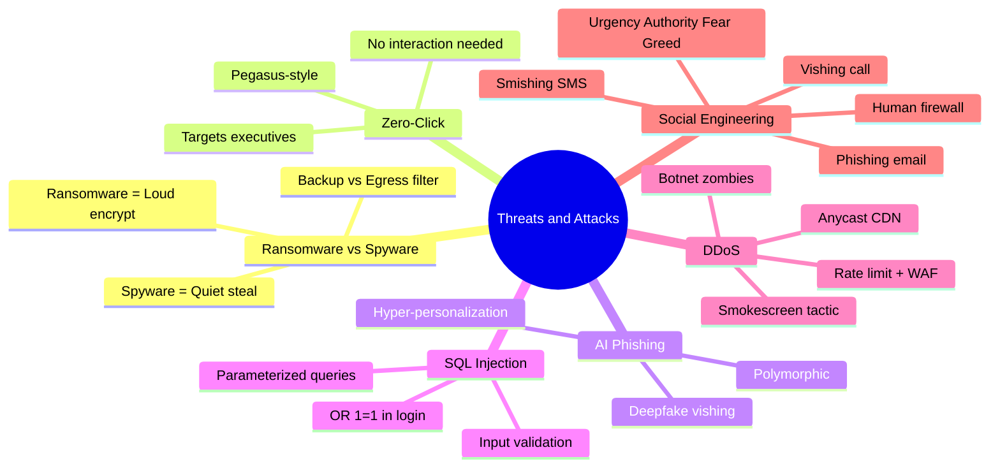

# Chapter 04 — Threats & Attacks 🦠

> Ransomware vs Spyware, Zero-Click attacks, AI-Powered Phishing, SQL Injection, DDoS, এবং Social Engineering — bank-এর জন্য সবচেয়ে dangerous attack vectors। প্রতিটাতে অবশ্যই **Prevention / Mitigation** section লিখতে হবে।

---

## 📚 What you will learn

- **Ransomware vs Spyware** — দুইটার behavior + আলাদা mitigation
- **Zero-Click Attacks** — কেন user-error ছাড়াও hack হয়
- **AI-Powered Phishing** — 2026-এর threat landscape
- **SQL Injection** — মূল mechanism এবং Parameterized Queries দিয়ে prevention
- **DDoS** — Botnet mechanism + 3টা mitigation technique
- **Social Engineering** — Phishing / Vishing / Smishing — "Human Firewall"

---

## 🎯 Question 11 — Ransomware vs Spyware

### কেন এটা important?

Classic "Distinguish" question। দুইটাই malware কিন্তু intent আর mitigation আলাদা।

> **Q11: Ransomware vs. Spyware — Define both and explain the primary mitigation strategies for a large organization.**

### 1. Ransomware (The Extortionist)

- **Definition:** Malicious software that encrypts a victim's files. The attacker then demands a "ransom" (usually in cryptocurrency) to provide the decryption key.
- **Behavior:** It is **"loud."** It wants you to know it is there so you will pay.
- **Impact on Banks:** Can halt all operations (ATMs, Mobile Apps, Branch transactions) because the database becomes unreadable.

### 2. Spyware (The Silent Observer)

- **Definition:** Malicious software designed to enter a computer, gather data about the user, and forward it to a third party without consent.
- **Behavior:** It is **"quiet" and "stealthy."** It wants to stay hidden for as long as possible to steal as much data as it can.
- **Examples:** Keyloggers (record everything you type, including passwords) and Trojan horses.

### 3. Mitigation Strategies (Comparison Table)

| Strategy | Ransomware Defense | Spyware Defense |
|----------|-------------------|-----------------|
| **Backup** | Offline / Immutable Backups are the **only way** to recover without paying | Backups help, but the priority is stopping the data leak |
| **Network** | Micro-segmentation to prevent the virus from spreading | Egress Filtering to block stolen data from being sent out to the hacker's server |
| **Endpoint** | Anti-Ransomware tools that detect mass encryption behavior | Anti-Spyware / EDR tools that detect unauthorized background processes |



> **Written Exam Tip:** "Ransomware = Encrypt and Demand. Spyware = Observe and Steal." For banks, the **3-2-1 Backup Rule** is the ultimate ransomware defense (covered in Chapter 8).

---

## 🎯 Question 12 — Zero-Click Attacks

### কেন এটা important?

Modern threat — high-profile bank officials targeted। NSO Pegasus-style attack।

> **Q12: Explain "Zero-Click Attacks" and why they are considered highly dangerous for high-profile banking officials.**

In traditional hacking, you have to click a link or download a file. A **Zero-Click Attack** is the next evolution of cyber threats.

### 1. What is it?

It is a cyberattack that requires **no interaction from the victim**. The malware is delivered via a hidden message (like a specifically crafted WhatsApp image or a silent SMS) that exploits a vulnerability in the device's software the moment it is received.

### 2. Why is it dangerous?



- **No User Error Needed:** You don't have to be "fooled" by a phishing email. You can be the most careful person in the world and still get hacked.
- **Invisible:** The message often deletes itself after the malware is installed, leaving no trace.
- **Total Control:** Once inside, it can turn on the microphone, track GPS, and steal banking credentials.

> **Why dangerous for bank officials:** A CEO or CISO targeted with a zero-click attack can leak SWIFT keys, board meeting recordings, and customer data — all without their knowledge.

---

## 🎯 Question 14 — AI-Powered Phishing

### কেন এটা important?

2026-এর "hot" topic। AI এসে phishing-এর rules বদলে দিয়েছে।

> **Q14: AI-Powered Phishing — How is Artificial Intelligence changing the threat landscape in 2026?**

Traditional phishing relied on "quantity" (sending millions of generic emails and hoping one person clicks). In 2026, AI has shifted the focus to **"Quality and Personalization"** at an industrial scale.

### 1. Hyper-Personalization (Spear Phishing at Scale)

- **Mechanism:** Attackers use AI to scrape data from LinkedIn, news reports, and even previous data breaches to build a "dossier" on a bank employee.
- **Impact:** The AI then drafts an email that mentions your specific department, a project you actually worked on last month, and mimics the exact writing style of your supervisor.
- **The Result:** The traditional "red flags" (bad grammar, generic greetings like "Dear Customer") are gone. The email is professionally written and contextually perfect.

### 2. Deepfake Vishing (Voice Phishing)

- **Mechanism:** Using just **30 seconds** of audio from a public speech or YouTube video, AI can clone a person's voice.
- **Banking Example:** A branch manager receives a phone call that sounds exactly like the CEO, authorizing an "urgent" emergency fund transfer. Because the voice and tone are identical, the manager is much more likely to bypass standard protocols.

### 3. Polymorphic Phishing

- **Mechanism:** AI can generate thousands of versions of the same phishing email, changing the wording, subject line, and sender address for every single recipient.
- **Impact:** Traditional email filters look for "patterns." Since every email is unique (Polymorphic), the filter doesn't recognize them as a mass attack, allowing them to land in your inbox.

### Comparison — Old vs AI-Powered Phishing

| Aspect | Traditional Phishing | AI-Powered Phishing (2026) |
|--------|---------------------|---------------------------|
| Volume | Millions of generic emails | Personalized, mid-volume |
| Grammar | Bad grammar, typos | Perfect, professional |
| Greeting | "Dear Customer" | "Dear Mr. Karim, regarding the LC project last month..." |
| Voice attack | Robocall scripts | Deepfake voice clone of CEO |
| Filter evasion | Pattern-based filters catch them | Polymorphic — unique per recipient |

> **Written Exam Tip:** Use the term **"Spear Phishing at Scale"** — AI removes the historical trade-off between targeting and volume.

---

## 🎯 Question 17 — SQL Injection (SQLi)

### কেন এটা important?

OWASP Top 10 — যুগ যুগ ধরে #1 vulnerability। Login form, search box যেকোনো input field via attack হয়।

> **Q17: SQL Injection (SQLi) and How to Prevent It in Banking Apps.**

SQL Injection is one of the oldest and most dangerous web vulnerabilities. In a banking context, it can lead to unauthorized data access, deleted records, or even total database takeover.

### 1. Definition

SQL Injection is a vulnerability where an attacker "injects" malicious SQL code into an input field (like a login box or a search bar). If the application doesn't sanitize this input, it sends the malicious code to the database as a legitimate command.

### 2. How it Works (The Banking Example)

Imagine a login query:

```sql
SELECT * FROM users WHERE username = 'input_user' AND password = 'input_password';
```

If an attacker enters `' OR '1'='1` in the username field, the query becomes:

```sql
SELECT * FROM users WHERE username = '' OR '1'='1' AND password = '...';
```

Since `'1'='1'` is always true, the database may log the attacker in as the first user in the table (usually the Admin) **without a valid password**.



### 3. Prevention Strategies (Crucial for Developers)

| Defense | How it works |
|---------|--------------|
| **Prepared Statements (Parameterized Queries)** | The #1 defense. SQL code is defined first, user input is treated strictly as data, never as executable code |
| **Input Validation** | Use "Allow-lists" to ensure input matches expected formats (e.g., Account Number should only contain digits) |
| **Stored Procedures** | Similar to prepared statements — prevent raw SQL from being sent from the application layer |
| **Principle of Least Privilege** | The database user used by the web app should not have permission to DROP tables or access system configurations |

#### Example — Parameterized Query (Java)

```java
// Vulnerable (string concat)
String sql = "SELECT * FROM users WHERE username = '" + user + "'";

// Safe (parameterized)
PreparedStatement ps = conn.prepareStatement(
    "SELECT * FROM users WHERE username = ? AND password = ?"
);
ps.setString(1, user);
ps.setString(2, password);
```

> **Written Exam Tip:** Always mention "Parameterized Queries" by name. If you can write the safe vs unsafe code snippet, you score full marks.

---

## 🎯 Question 21 — DDoS Attacks

### কেন এটা important?

Bank-এর Availability target করে। 2024-25-এ Bangladesh-এর several bank-এ DDoS hit হয়েছে।

> **Q21: DDoS Attacks — Explain how a Distributed Denial of Service attack works and suggest three mitigation techniques for a bank.**

In the banking sector, **Availability** is just as important as Confidentiality. A DDoS attack targets the availability of services, aiming to crash the bank's website or mobile app.

### 1. What is a DDoS Attack?

- A **Denial of Service (DoS)** attack occurs when an attacker sends more traffic to a server than it can handle, causing it to slow down or crash.
- A **Distributed (DDoS)** attack is more dangerous because the traffic comes from **thousands of different sources** (a "Botnet" of compromised computers or IoT devices), making it impossible to stop by just blocking a single IP address.

### 2. How it works (The Mechanism)



- **The Botnet:** The attacker infects thousands of unprotected devices (PCs, cameras, routers) with malware. These devices become "zombies."
- **The Command:** The attacker sends a command to the botnet to all visit a specific URL (e.g., the bank's login page) at the exact same time.
- **The Crash:** The bank's server becomes overwhelmed by millions of requests per second and can no longer distinguish between a real customer and a bot, eventually shutting down.

### 3. Mitigation Techniques for Banks

| Technique | How it helps |
|-----------|--------------|
| **Anycast Network & CDN (e.g., Cloudflare)** | A global network that **absorbs** the massive traffic by spreading it across hundreds of servers worldwide instead of hitting the bank's main server directly |
| **Rate Limiting** | Setting a limit on how many requests a single IP address or user can make per second. If a user tries to refresh 500 times in a minute, they are auto-blocked |
| **WAF (Web Application Firewall)** | Looks at the **behavior** of the traffic. Distinguishes between humans (click + scroll) and bots (raw packets) and blocks bots at the network edge |

> **Written Exam Tip:** A DDoS attack is often used as a **"Smokescreen."** While the IT team is busy bringing the website back online, hackers might silently try to steal data through a different back-door.

---

## 🎯 Question 22 — Social Engineering (Phishing / Vishing / Smishing)

### কেন এটা important?

"User is the weakest link" — এই উক্তি social engineering-এর কারণে। 2016 BB heist-ও phishing email দিয়ে শুরু।

> **Q22: Social Engineering — Explain the psychological tactics of Phishing, Vishing, and Smishing, and why they are the biggest threat to banking security.**

In technical security, we often say: **"User is the weakest link."** A bank can have a $1 million firewall, but it is useless if an employee or customer simply gives away their password. This is the essence of Social Engineering.

### 1. The Three Common Forms

| Type | Channel | Example Script |
|------|---------|----------------|
| **Phishing** | Email | Fraudulent emails appearing to be from BB / HR / e-commerce, with malicious links or keylogger attachments |
| **Vishing** | Voice call | "Your account has been compromised. To secure it, please tell me the 6-digit OTP you just received." |
| **Smishing** | SMS | "Your bKash / Bank account will be blocked in 2 hours. Click here to update KYC: `http://fake-bank-login.com`" |

### 2. The Psychological Tactics (Why it works)

Social engineering doesn't hack the computer; it hacks the **human mind** using these triggers:



- **Sense of Urgency:** "Action required within 30 minutes!" (stops logical thinking)
- **Authority:** Posing as a high-ranking officer, BB Auditor, or Police. Most people hesitate to question authority figures.
- **Fear:** "Your money is at risk" or "Legal action will be taken."
- **Greed / Lust for Reward:** "You have won a 50,000 BDT lottery" or "Cashback offer."

### 3. Why it is the "Biggest Threat" to Banks

- **Bypasses Technical Controls:** MFA can be defeated if the attacker tricks the user into "approving" a push notification or reading the OTP over the phone.
- **Low Cost, High Reward:** A hacker doesn't need to be a coding genius; they just need to be a good "actor" or "liar."
- **Difficulty to Trace:** Since the user voluntarily gives access, it often looks like a legitimate login to the bank's security system.

### 4. Prevention — The "Human Firewall"

| Defense | Description |
|---------|-------------|
| **Security Awareness Training** | Teach employees and customers to **Stop, Think, and Verify** |
| **No-Share Policy** | Constantly remind users — "No bank official will ever ask for your Password, PIN, or OTP" |
| **Out-of-Band Verification** | If you get a suspicious call from "the bank," hang up and call the official number listed on the bank's website |
| **DMARC / SPF / DKIM** | Email authenticity records — block spoofed email domains |
| **AI Fraud Detection** | Behavioral analytics to catch unusual login patterns |

> **Written Exam Tip:** Mention that Social Engineering is often the **initial entry point** for much larger attacks, like the **2016 SWIFT heist** (which began with a phishing email to a bank employee).

---

## 📝 Chapter Summary



---

## 🎓 Written Exam Tips Recap

- **প্রতিটা attack-এর জন্য 3-point Mitigation সেকশন অবশ্যই লিখুন।**
- **Ransomware** — "Offline immutable backup is the only path to recovery without paying ransom।"
- **Zero-Click** — "Even the most careful user can be hacked — defense = device patching, not user training।"
- **AI Phishing** — "Spear phishing at scale" phrase। Old red flags useless now।
- **SQL Injection** — Parameterized Query code snippet draw করতে পারলে full marks।
- **DDoS** — Anycast / Rate Limit / WAF — তিনটাই উল্লেখ করুন। Smokescreen angle bonus।
- **Social Engineering** — 4 psychological triggers + 2016 BB heist example।

---

[← Previous: Banking & Payment](03-banking-payment.md) · [Master Index](00-master-index.md) · [Next: Cryptography & Forensics →](05-cryptography-forensics.md)
