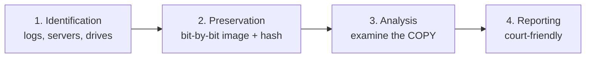
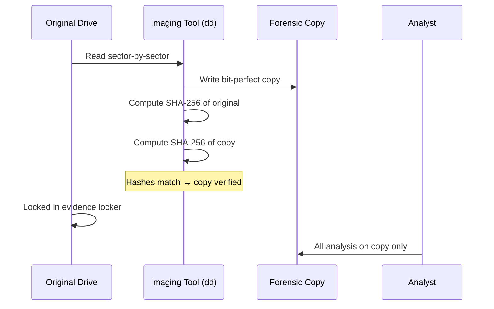
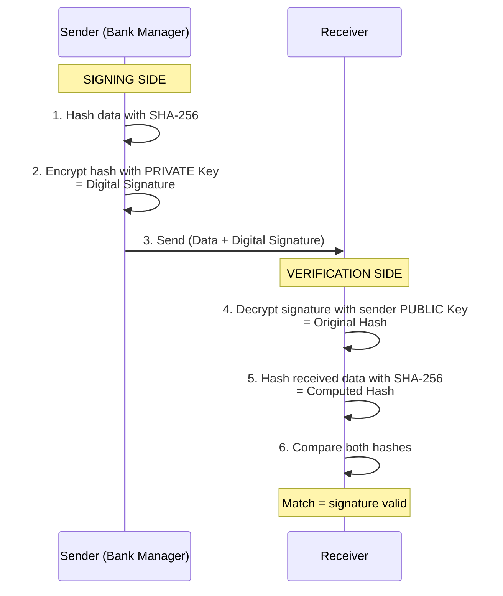
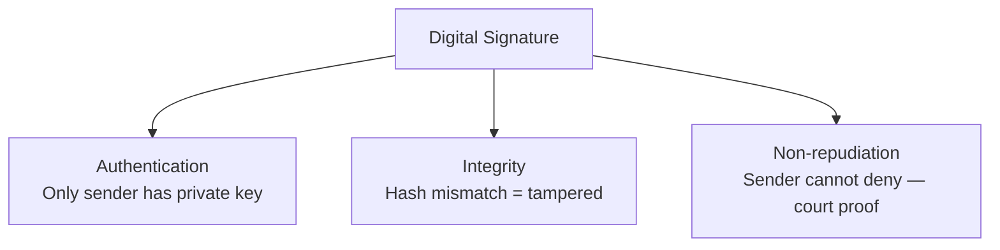
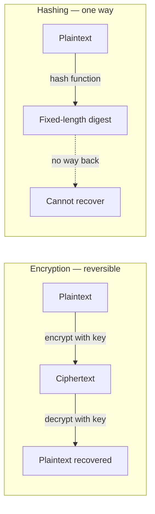
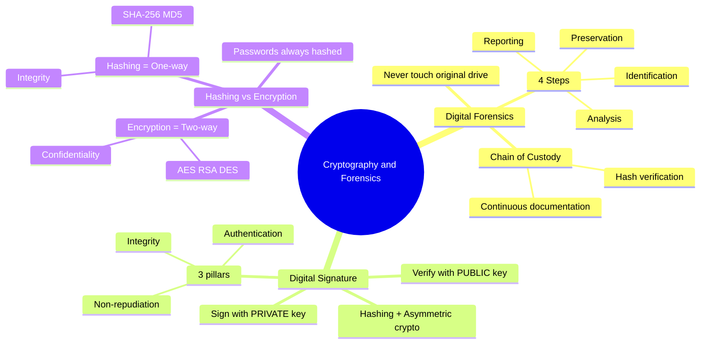

# Chapter 05 — Cryptography & Forensics 🔐

> Digital Forensics ও Chain of Custody, Digital Signatures + Non-repudiation, এবং Hashing vs Encryption — তিনটাই Bank IT exam-এর "high-yield" technical topic। Digital signature মাঝে মাঝে 10 marks-এর full question হিসেবে আসে।

---

## 📚 What you will learn

- **Digital Forensics** — bank fraud investigation-এ evidence handling
- **Chain of Custody** — কেন এটা court-এ admissible evidence-এর জন্য জরুরি
- **Digital Signature** — process এবং Authentication / Integrity / Non-repudiation কীভাবে provide করে
- **Hashing vs Encryption** — দুইটার purpose এবং algorithm-এর difference

---

## 🎯 Question 19 — Digital Forensics & Chain of Custody

### কেন এটা important?

যেকোনো bank fraud investigation-এ evidence-এর integrity proof করতে হয়, না হলে court evidence reject করবে। 2016 BB heist-এর forensic investigation-এ FireEye-এর report এই process-ই follow করেছিল।

> **Q19: Digital Forensics — Explain the "Chain of Custody" in the context of a bank fraud investigation.**

If a cybercrime occurs (like a fraudulent wire transfer), the evidence must be handled carefully so it is **admissible in a court of law** in Bangladesh.

### 1. What is the Chain of Custody?

It is a **chronological documentation or paper trail** that records the sequence of custody, control, transfer, and analysis of physical or electronic evidence.

### 2. Why is it important?

If a bank captures a hard drive containing evidence of a crime but **cannot prove who held that drive every second** from the crime scene to the courtroom, the evidence may be dismissed.

### 3. Steps in a Forensic Investigation

| Step | Action | Key technique |
|------|--------|---------------|
| **1. Identification** | Pinpoint where the evidence is — logs, servers, hard drives | Asset inventory, log review |
| **2. Preservation** | Image the drive (bit-by-bit copy) so the original is **never touched**. Hashing (MD5 / SHA) is used to prove the copy is identical to the original | `dd` imaging, SHA-256 hash |
| **3. Analysis** | Examine the **copy** for hidden files or deleted logs | Forensic toolkits (EnCase, FTK, Autopsy) |
| **4. Reporting** | Present findings in a way that a non-technical judge can understand | Plain-English report + diagrams |

### Why the original drive must never be touched

Every read operation can change file timestamps. If you analyze the original, defense lawyers will argue the evidence has been tampered with. **Always work on the bit-by-bit image, and prove with a hash that the image matches the original.**

> **Written Exam Tip:** Always mention the **two pillars** of Chain of Custody — (a) **continuous documentation** of who handled the evidence when, and (b) **hash verification** to prove the digital copy is unaltered.

---

## 🎯 Question 24 — Digital Signatures & Non-repudiation

### কেন এটা important?

Digital banking-এ encrypt করা যথেষ্ট না — sender কে, এবং তিনি পরে অস্বীকার করতে পারবেন কি না — সেটাও prove করতে হয়। Court-এ এটা legal evidence।

> **Q24: Digital Signatures and Non-repudiation — How do they ensure the authenticity of financial transactions?**

In digital banking, it's not enough to just encrypt data. The bank must also prove **who sent the message** and ensure that the sender cannot later claim they didn't send it. This is achieved through **Digital Signatures**.

### 1. What is a Digital Signature?

A digital signature is a mathematical technique used to validate the **authenticity and integrity** of a digital document or message. It is the electronic equivalent of a handwritten signature but much more secure.

### 2. How it Works (The Process)

The process relies on **Asymmetric Cryptography** (Public and Private keys) and **Hashing**:

1. **Hashing:** The sender (e.g., a Bank Manager) takes the transaction data and runs it through a hash function (like SHA-256) to create a unique **"Hash Value"** (a fixed-length string of characters).
2. **Signing:** The sender encrypts that Hash Value using their **Private Key**. This encrypted hash is the **Digital Signature**.
3. **Transmission:** The transaction data and the Digital Signature are sent to the receiver.
4. **Verification:**
   - The receiver decrypts the signature using the sender's **Public Key** to get the original Hash Value.
   - The receiver then hashes the transaction data themselves.
   - If the two hashes match, the signature is valid.

### 3. The Three Security Pillars Provided

| Pillar | What it proves |
|--------|---------------|
| **Authentication** | Proves the message was created by the known sender (since only they have the Private Key) |
| **Integrity** | Proves the message has not been altered in transit (if even one bit changed, the hashes won't match) |
| **Non-repudiation** | The sender **cannot deny** having sent the message, as the digital signature is unique to their private key. In a court of law, this is used as proof of a transaction |

> **Why Non-repudiation matters for banks:** If a corporate customer authorizes a 10 crore BDT transfer with their digital signature, they cannot later claim "I didn't send it." This is the legal foundation of online banking.

---

## 🎯 Question 25 — Hashing vs Encryption

### কেন এটা important?

2-5 marks-এর very common question। এই দুইটা confuse করলে marks-এ direct loss।

> **Q25: Difference between Hashing and Encryption.**

This is a very common 2-5 mark question. Examiners want to see if you understand that these serve **two different purposes**.

### Comparison Table

| Feature | Encryption | Hashing |
|---------|-----------|---------|
| **Type** | **Two-way** function (reversible) | **One-way** function (irreversible) |
| **Purpose** | To protect data **Confidentiality** | To ensure data **Integrity** |
| **Output** | Can be decrypted back to plain text using a key | Cannot be "reversed" to find the original input |
| **Example Use** | Sending a secure email or stored password | Verifying a downloaded file or a Digital Signature |
| **Common Algorithms** | AES, RSA, DES | SHA-256, MD5, SHA-1 |

### Visual Difference

### When to use which

| Banking scenario | Use | Why |
|-----------------|-----|-----|
| Sending account number over network | **Encryption (AES-256)** | Need to read it on the other end |
| Storing user passwords in DB | **Hashing (bcrypt / SHA-256 + salt)** | Never need original — only need to verify match |
| Verifying SWIFT message integrity | **Hash + Signature** | Detect any tampering |
| Encrypting files at rest | **Encryption (AES)** | Need to recover later with key |

### A Common Trap — Why are passwords hashed, not encrypted?

If a hacker steals an encrypted password DB and finds the key (which is often nearby), they recover all passwords. With hashing, even if the hacker steals the hash DB, they cannot reverse it — they would need to **brute-force** each hash, which takes years for strong passwords.

> **Written Exam Tip:** When discussing Digital Signatures, mention **PKI (Public Key Infrastructure)**. PKI is the entire system (certificates, authorities, and keys) that allows digital signatures to work securely on a national or global scale.

---

## 📝 Chapter Summary

---

## 🎓 Written Exam Tips Recap

- **Chain of Custody** — Two pillars (continuous documentation + hash verification)। কখনই original touch করবেন না।
- **Digital Signature** — "Sign with private, verify with public" + 3 pillars (Auth / Int / Non-repudiation)।
- **Non-repudiation** — Court-এ proof; legal foundation of online banking।
- **Hashing vs Encryption** — Two-way vs One-way; Confidentiality vs Integrity; AES vs SHA।
- **Passwords are hashed, not encrypted** — এই trap question-এ সঠিক answer দিলে full marks।
- PKI term বার বার use করুন — examiner বুঝবেন আপনি ecosystem-level জানেন।

---

[← Previous: Threats & Attacks](04-threats-attacks.md) · [Master Index](00-master-index.md) · [Next: Cloud & API Security →](06-cloud-api-security.md)
