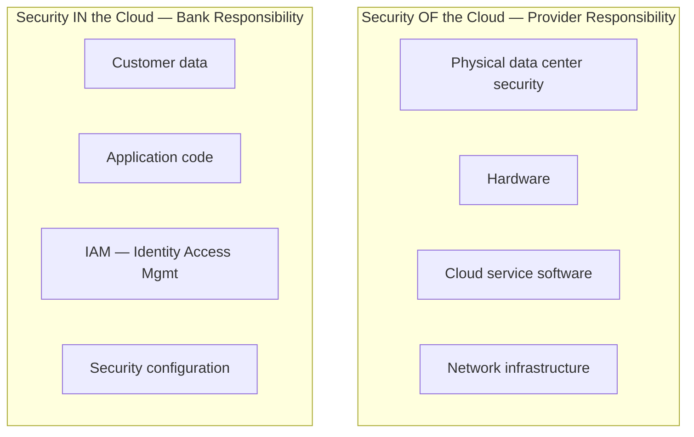
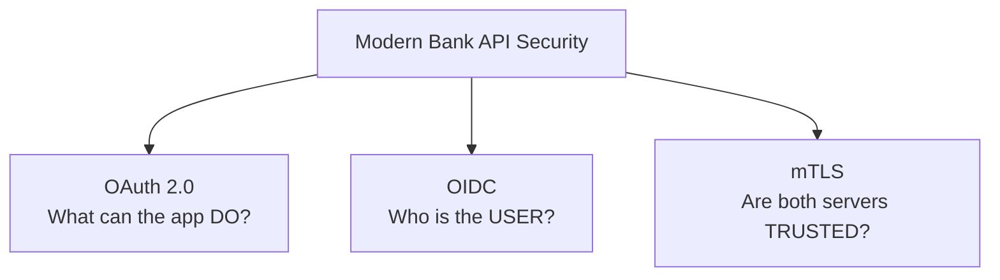
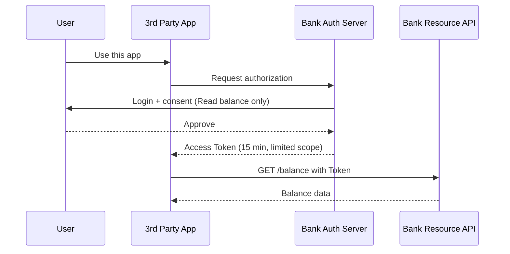
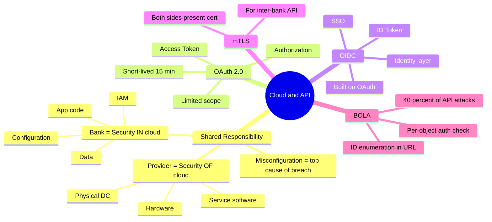

# Chapter 06 — Cloud & API Security ☁️

> Bangladesh-এর bank গুলো cloud-এ migrate হচ্ছে এবং Open Banking API-এর দিকে যাচ্ছে। এই chapter-এ Shared Responsibility Model এবং OAuth 2.0 / OIDC / mTLS — দুইটা future-critical topic।

---

## 📚 What you will learn

- **Cloud Shared Responsibility Model** — কে কোন security-এর জন্য responsible (Provider vs Bank)
- **API Security** — কেন 2026-এ API #1 attack target
- **OAuth 2.0** — authorization framework
- **OIDC (OpenID Connect)** — identity layer on top of OAuth
- **mTLS** — mutual certificate-based authentication

---

## 🎯 Question 20 — Cloud Shared Responsibility Model

### কেন এটা important?

Capital One breach, Accenture breach — globally সবচেয়ে বড় cloud-related leak গুলো হয়েছে এই model misunderstand করার কারণে। Bangladesh-এর bank গুলো cloud (Cloudflare, AWS, Azure) adopt করছে।

> **Q20: Cloud Security — Explain the "Shared Responsibility Model" and why it is critical for banks using Cloud services.**

As banks in Bangladesh move toward cloud-based solutions (like using **Cloudflare** for web security or **AWS / Azure** for hosting), understanding **who is responsible for what** is the most important security concept.

### 1. What is the Shared Responsibility Model?

In a traditional **on-premise** data center (the bank's own building), the bank is responsible for **everything** — from the physical locks on the door to the encryption of the data.

In the **Cloud**, responsibility is split between the **Cloud Service Provider (CSP)** and the **Customer (the Bank)**.

### 2. The Division of Duties

#### Security OF the Cloud (Provider's Responsibility)

The CSP (e.g., Cloudflare or AWS) is responsible for the **physical security** of the data centers, the hardware, and the software that runs the cloud services.

- **Example:** Ensuring a hacker doesn't physically walk into their server room.

#### Security IN the Cloud (Bank's Responsibility)

The Bank is responsible for everything they put inside the cloud. This includes:

- **The data** itself
- **The application code**
- Managing user access (**Identity & Access Management — IAM**)
- Configuring the security settings correctly

- **Example:** If a bank developer leaves an S3 bucket or a database **open to the public** without a password, that is the **Bank's fault**, not the Cloud provider's.

### 3. Quick Reference Table

| Layer | On-premise (Bank) | IaaS (e.g., EC2) | PaaS (e.g., RDS) | SaaS (e.g., Office 365) |
|-------|------------------|------------------|------------------|-----------------------|
| Data | Bank | Bank | Bank | Bank |
| Application | Bank | Bank | Bank | Provider |
| OS | Bank | Bank | Provider | Provider |
| Hypervisor | Bank | Provider | Provider | Provider |
| Hardware | Bank | Provider | Provider | Provider |
| Physical DC | Bank | Provider | Provider | Provider |

**Pattern:** As you move from IaaS → PaaS → SaaS, the Provider takes on more, the Bank takes on less. But **data** and **identity / access management** **always** stay with the Bank.

### 4. Why is it critical for Banking IT Exams?

Many major banking data breaches globally have happened because the bank assumed the cloud provider was handling everything. **Misconfiguration** (like weak access keys or open S3 buckets) is the **leading cause** of cloud-based breaches.

> **Written Exam Tip:** Use the phrase: *"The Cloud Provider protects the infrastructure; the Bank protects the data."* Mention that **misconfiguration is the leading cause** of cloud-based breaches.

---

## 🎯 Question 28 — API Security in Banking

### কেন এটা important?

Open Banking, Embedded Finance — bank এখন আর "closed island" না। API-গুলো 2026-এ #1 hacker target। 40% API attack-এর কারণ BOLA।

> **Q28: API Security in Banking — How are APIs secured in 2026, and what are the roles of OAuth 2.0 and OIDC?**

With the rise of **"Open Banking"** and **"Embedded Finance,"** banks are no longer closed islands. They now use APIs (Application Programming Interfaces) to talk to apps like bKash, food delivery platforms, and other banks. However, APIs are the **#1 target for hackers in 2026**.

### 1. Why is API Security Different?

- Traditional security protects "pages" (HTML). API security must protect **"Data Endpoints"** (JSON / XML).
- **The Problem:** A single logic flaw in an API can expose **millions of customer records at once**.
- **Top Threat — BOLA (Broken Object Level Authorization):** Accounts for ~40% of API attacks. In this attack, a hacker changes an ID in the URL (e.g., from `/api/account/1234` to `/api/account/1235`) to see another person's bank balance.

### 2. The Defense Trio — OAuth 2.0, OIDC, and mTLS

#### OAuth 2.0 — The Authorization Framework

- **Role:** Answers — *"What is this app allowed to do?"*
- **Mechanism:** Instead of giving your bank password to a 3rd party app, the bank gives that app a **"Token"** (like a temporary keycard). This token only allows the app to perform specific actions (e.g., "Read Balance" but not "Transfer Money").

#### OIDC (OpenID Connect) — The Identity Layer

- **Role:** Answers — *"Who is the user?"*
- **Mechanism:** Built on top of OAuth 2.0, OIDC provides an **ID Token** that contains the user's profile information. This allows for **Single Sign-On (SSO)**.

#### mTLS (Mutual TLS)

- **Role:** Ensures the connection is between **two trusted servers**.
- **Mechanism:** Both the Client (e.g., a Fintech app) and the Server (the Bank) must present a valid Digital Certificate to each other before any data is exchanged.

In normal TLS only the server proves identity. In mTLS **both sides** prove identity — much stronger for B2B / inter-bank API calls.

### 3. API Security Checklist for 2026 (Bangladesh Bank Guidelines)

As per the Cybersecurity Framework Version 1.0 (2026), banks must implement:

| Control | Purpose |
|---------|---------|
| **Rate Limiting** | Prevents Brute Force or DDoS by limiting how many requests a client can make per second |
| **Schema Validation** | The API Gateway should automatically reject any request that doesn't perfectly match the expected format (e.g., if a "Mobile Number" field contains letters) |
| **Token Rotation** | Access tokens must be **short-lived** (e.g., 15 minutes) and rotated frequently to minimize impact if one is stolen |
| **mTLS for inter-bank** | All bank-to-bank API calls must use mutual TLS |
| **Authorization checks per object** | Defeat BOLA — verify the user actually owns the resource before returning it |

### Quick Comparison — OAuth 2.0 vs OIDC

| Aspect | OAuth 2.0 | OIDC (OpenID Connect) |
|--------|-----------|---------------------|
| **Primary Goal** | **Authorization** (Access to resources) | **Authentication** (Identity of the user) |
| **Key Issued** | Access Token | ID Token (and Access Token) |
| **Built on** | Standalone protocol | Layer on top of OAuth 2.0 |
| **Analogy** | A keycard that opens a specific hotel room | A passport that proves who you are |

### Why both are needed

OAuth alone tells the API "this app may read balance." But it doesn't say "for which user." OIDC fills that gap with the ID Token — so the API knows which user's balance to return.

> **Written Exam Tip:** If asked about **"Open Banking security,"** mention **PKCE (Proof Key for Code Exchange)**. It is a security extension for OAuth 2.0 that prevents hackers from intercepting authorization codes, which is **mandatory for mobile banking apps in 2026**.

---

## 📝 Chapter Summary

---

## 🎓 Written Exam Tips Recap

- **Shared Responsibility** — *"Provider protects infrastructure, Bank protects data"* + misconfiguration is #1 cause।
- **IaaS / PaaS / SaaS** layer-wise responsibility table মুখস্থ রাখুন।
- **OAuth 2.0** = Authorization (what), **OIDC** = Authentication (who), **mTLS** = mutual server trust।
- **BOLA** mention করলে current threat landscape-এর knowledge প্রকাশ পায়।
- **PKCE** + **Token Rotation** + **Schema Validation** — 2026 framework keyword।
- **Open Banking** context আনলে modern angle তৈরি হয়।

---

[← Previous: Cryptography & Forensics](05-cryptography-forensics.md) · [Master Index](00-master-index.md) · [Next: e-KYC & Biometrics →](07-ekyc-biometrics.md)
