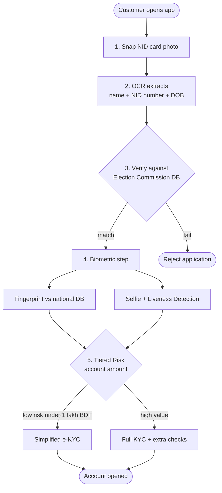
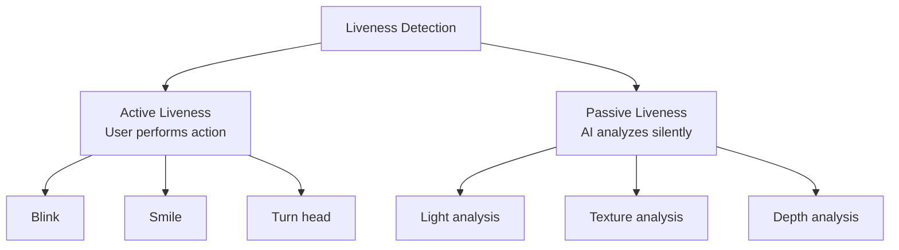
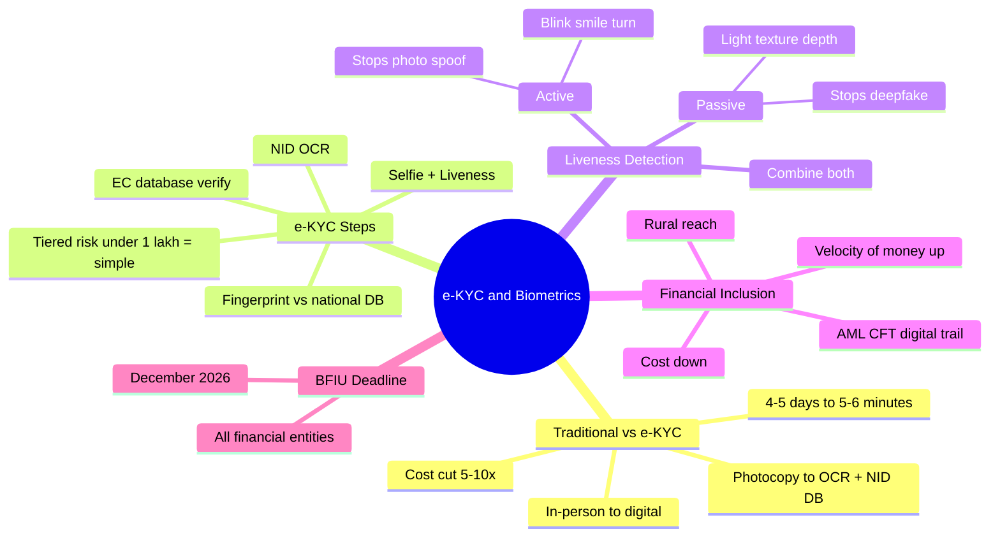

# Chapter 07 — e-KYC & Biometrics 👤

> Bangladesh-এ 2026 December-এর মধ্যে সব financial entity-কে e-KYC-এ migrate হতে হবে — BFIU mandate। এই chapter-এ Traditional KYC vs e-KYC এবং biometric system-এর মূল technique "Liveness Detection"।

---

## 📚 What you will learn

- **Traditional KYC vs e-KYC** — comparison এবং Bangladesh-এ transition timeline
- **e-KYC mechanism** — NID integration, OCR, Tiered Risk Approach
- **Liveness Detection** — Active vs Passive
- **Financial inclusion impact** — rural population, cost reduction, AML/CFT

---

## 🎯 Question 26 — e-KYC and Biometrics

### কেন এটা important?

2026-এর highest-priority regulatory topic। **BFIU (Bangladesh Financial Intelligence Unit)** has set a strict deadline of **December 31, 2026** for all financial entities (including insurance and capital market intermediaries) to fully implement the new e-KYC guidelines।

> **Q26: e-KYC and Biometrics — Explain the transition from traditional KYC to e-KYC in Bangladesh and its impact on financial inclusion.**

### 1. Traditional KYC vs e-KYC

For the exam, you should be able to compare these two methods clearly:

| Feature | Traditional KYC | e-KYC (Electronic) |
|---------|----------------|-------------------|
| **Verification** | In-person, physical presence | Remote or Digital (Face / Fingerprint) |
| **Documentation** | Physical photocopies of NID / Passport | Digital extraction from NID database (OCR) |
| **Timeframe** | 4 to 5 days | 5 to 6 minutes |
| **Security** | Prone to human error and forgery | Biometric liveness check + AI matching |
| **Cost per onboarding** | High (manual labor) | 5-10× cheaper |
| **Geographic reach** | Branch-only | Anywhere via smartphone / agent |

### 2. How e-KYC Works in Bangladesh

The process typically follows these technical steps:

#### Step-by-step

1. **NID Integration:** The system uses **OCR (Optical Character Recognition)** to read the data from a customer's NID card.
2. **Database Matching:** It connects to the **Election Commission's NID database** to verify if the information is legitimate.
3. **Biometric Verification:**
   - **Fingerprint:** Verified against the data stored in the national database.
   - **Facial Recognition:** A "selfie" is taken, and AI performs **Liveness Detection** to ensure it's a real person, not a photo or a deepfake.
4. **Tiered Risk Approach:** Under the 2026 guidelines, **simplified e-KYC** is used for low-risk accounts (e.g., deposits up to **100,000 BDT per month**), while high-value accounts still require more rigorous checks.

### 3. Impact on Financial Inclusion

| Impact | Explanation |
|--------|-------------|
| **Rural Reach** | People in remote villages can now open bank accounts through Agent Banking or smartphone — no travel to city branch |
| **Cost Reduction** | For banks, the cost of onboarding a customer is reduced by **5 to 10 times** compared to paper-based methods |
| **Velocity of Money** | Faster onboarding allows "dead capital" (cash stored at home) to enter the formal banking system more quickly, boosting the economy |
| **AML / CFT** | Digital audit trail — much harder to manipulate than paper records |

### Why this matters for Bangladesh

Bangladesh has ~50 million unbanked adults. e-KYC + Agent Banking + MFS (bKash, Nagad) is the primary path to financial inclusion. The 2026 BFIU mandate is specifically aimed at closing this gap.

---

## 🎯 Question 27 — Liveness Detection

### কেন এটা important?

e-KYC-এর সবচেয়ে important technical sub-question। Photo, video, mask দিয়ে কেউ যেন আরেকজনের আকাউন্ট না খুলতে পারে — তার জন্য liveness check।

> **Q27: What is "Liveness Detection" in the context of e-KYC?**

This is a specific technical sub-question that often appears.

### Definition

A security feature used in biometric systems to **distinguish between a "live" person and a spoof** (like a photograph, video, or a silicone mask).

### Two Types

| Type | How it works | Example |
|------|-------------|---------|
| **Active Liveness** | The app asks the user to perform an action | "Blink twice", "Smile", "Turn your head left then right" |
| **Passive Liveness** | The AI analyzes the **light, texture, and depth** of the image in the background **without requiring user action** | Subtle micro-movements, skin reflectance, 3D depth from selfie camera |

### Why both matter

- **Active** is more secure against simple photo spoofs but slower and more annoying for the user.
- **Passive** is faster and user-friendly but requires more advanced AI to detect deepfakes.
- Modern e-KYC systems use **both in combination** — passive runs continuously while one active challenge confirms.

### Spoofs that Liveness Detection defeats

| Spoof method | Defeated by |
|-------------|-------------|
| Printed photo | Active (no blink) + Passive (flat texture) |
| Video replay | Active (random challenge) |
| 3D silicone mask | Passive (skin reflectance + depth) |
| Deepfake video | Passive AI detects synthetic artifacts |

> **Written Exam Tip:** If the question mentions **"AML / CFT"** (Anti-Money Laundering / Combating the Financing of Terrorism), explain that **e-KYC is a powerful tool for these because it creates a digital audit trail that is much harder to manipulate than paper records.**

---

## 📝 Chapter Summary

---

## 🎓 Written Exam Tips Recap

- **e-KYC vs Traditional KYC table** মুখস্থ রাখুন — 5টা row enough।
- **December 2026 BFIU deadline** mention করলে current regulation knowledge প্রকাশ পায়।
- **Tiered Risk Approach** — 1 lakh BDT cap এর number-টা মনে রাখুন।
- **Liveness Detection** — Active + Passive দুইটাই উল্লেখ করুন, with one example each।
- **AML / CFT** + **digital audit trail** — combine করে answer-এর end-এ লিখুন।
- **Financial Inclusion impact** — rural reach + cost + velocity of money + AML — চারটা angle।

---

[← Previous: Cloud & API Security](06-cloud-api-security.md) · [Master Index](00-master-index.md) · [Next: Compliance & Regulatory →](08-compliance-regulatory.md)
