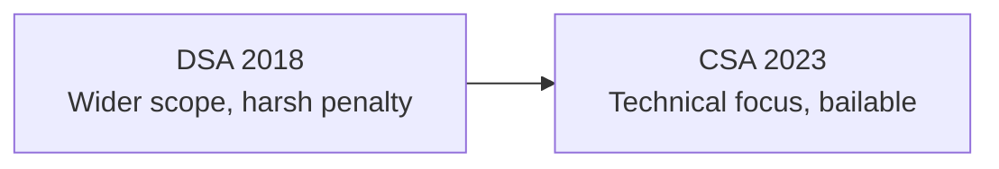
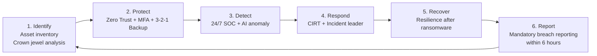
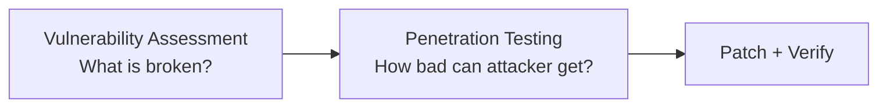
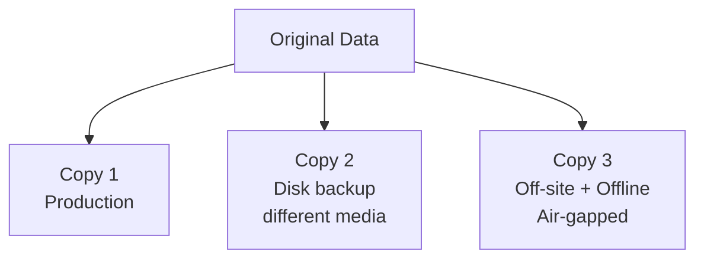
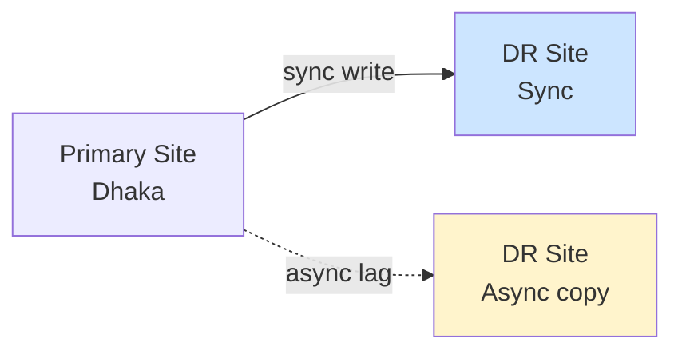
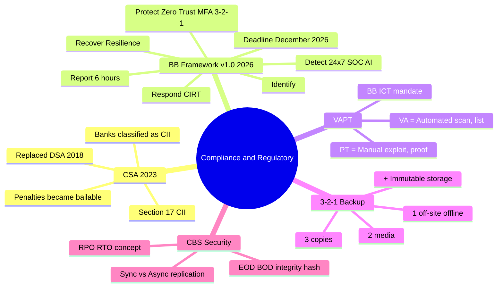

# Chapter 08 — Compliance & Regulatory 📜

> Cyber Security Act 2023, Bangladesh Bank Cybersecurity Framework v1.0 (2026), VAPT mandate, এবং Operational Resilience topics (3-2-1 Backup Rule, Core Banking System Security)। এই chapter-এ marks-এর সবচেয়ে বড় source — কারণ এগুলো **memorization-নির্ভর** এবং BB exam-এ Bangladesh-specific question।

---

## 📚 What you will learn

- **Cyber Security Act (CSA) 2023** — DSA-এর সাথে compare, Section 17, CII concept
- **BB Cybersecurity Framework v1.0 (2026)** — 6 pillar lifecycle, mandatory timeline
- **VAPT** — Vulnerability Assessment vs Penetration Testing
- **3-2-1 Backup Rule** — ransomware defense
- **Core Banking System (CBS) Security** — EOD/BOD, real-time replication
- **Cross-reference:** Zero Trust (covered in [Chapter 02](02-network-security.md))

---

## 🎯 Question 13 — Cyber Security Act (CSA) 2023 vs DSA

### কেন এটা important?

Bangladesh-এর local legal framework। 2023-এ DSA replace করে CSA এসেছে — পুরাতন reference দিলে marks কাটা যাবে।

> **Q13: The Cyber Security Act (CSA) 2023 of Bangladesh — What are its core objectives compared to the previous DSA?**

In a Bangladesh Bank written exam, you must show you are aware of the local legal framework.

### 1. Transition from DSA to CSA

The **Cyber Security Act (CSA) 2023** replaced the **Digital Security Act (DSA) 2018**. While much of the technical framework remains, there are key shifts:

| Aspect | DSA 2018 | CSA 2023 |
|--------|----------|----------|
| **Penalties** | Many offenses non-bailable, harsh | Many became **bailable**, fines adjusted |
| **Focus** | Broader speech/content offenses (controversial) | Heavier emphasis on **technical offenses** |
| **Public reception** | Criticized by media / civil society | Toned-down version |

### 2. Focus on Technical Offenses

The CSA places heavy emphasis on crimes like:

- **Hacking**
- **Identity Theft**
- **Damaging Critical Information Infrastructure (CII)**

### 3. Importance for IT Officers

As an IT Officer, you must understand that **banks are classified as Critical Information Infrastructure (CII).**

#### Section 17 — CII Offenses

Section 17 deals with offenses against CII. **If someone hacks the central bank's system, the punishment is much higher** because it affects national security.

> **Preparation Tip:** If you can mention **"Section 17"** or the term **"Critical Information Infrastructure"**, you will stand out to the examiner as someone who has actually read the regulations.

---

## 🎯 Question 15 — BB Cybersecurity Framework v1.0 (2026)

### কেন এটা important?

This is the **most critical regulatory question** you might face। 2026-এর মধ্যে সব scheduled bank, NBFI, MFS-কে compliant হতে হবে।

> **Q15: Bangladesh Bank Cybersecurity Framework Version 1.0 (2026) — What are the key pillars of this new mandatory guideline?**

Introduced recently, this framework marks a shift from **"Compliance-based"** security to **"Risk-based"** resilience.

### 1. The Mandatory Timeline

**All scheduled banks, NBFIs, and Mobile Financial Service (MFS) providers** in Bangladesh are mandated to **fully comply with this framework by the end of December 2026**.

### 2. The Core Pillars (Aligned with NIST)

The framework is built on a **continuous lifecycle** that you should memorize:

| # | Pillar | Mandatory Controls |
|---|--------|-------------------|
| **1** | **Identify** | Real-time inventory of all digital assets; **"Crown Jewel Analysis"** to identify critical systems like the Core Banking System |
| **2** | **Protect** | Zero Trust, MFA, **3-2-1 Backup Rule** (3 copies, 2 different media, 1 off-site) |
| **3** | **Detect** | **24/7 Security Operations Centers (SOC)** using AI to detect anomalies in real-time |
| **4** | **Respond** | Dedicated **Cyber Incident Response Team (CIRT)** with clearly defined roles for a "Cyber Incident Management Leader" |
| **5** | **Recover** | Focus on **Resilience** — how fast can the bank restore services after a total ransomware shutdown? |
| **6** | **Report** | Mandatory **breach reporting within 6 hours** to Bangladesh Bank |

### 3. Critical Information Infrastructure (CII)

The framework explicitly treats the banking sector as **CII**. This means:

- Any security failure is seen as a **threat to national economic stability**
- Increases the **legal accountability** of the **Board of Directors** and the **CISO (Chief Information Security Officer)**

### Cross-reference — Zero Trust

Zero Trust Architecture is one of the mandatory **Protect**-pillar controls under this framework. See **[Chapter 02 — Network Security](02-network-security.md#question-5--zero-trust-architecture-zta)** for the full ZTA explanation (3 pillars: Explicit Verification + Least Privilege + Assume Breach).

> **Written Exam Tip:** Memorize all **6 pillars in order** (Identify → Protect → Detect → Respond → Recover → Report). The "6-hour breach reporting" requirement is unique to BD framework — examiners love this detail.

---

## 🎯 Question 18 — Vulnerability Assessment vs Penetration Testing (VAPT)

### কেন এটা important?

Bangladesh Bank mandates regular VAPT for all scheduled banks — ICT Security Guidelines-এর part।

> **Q18: Vulnerability Assessment vs. Penetration Testing (VAPT)**

Bangladesh Bank mandates regular VAPT for all scheduled banks. In the exam, you may be asked to explain the difference between the two components.

### 1. Vulnerability Assessment (VA) — The "Scanning"

- **Nature:** Passive, **automated** search for known security holes.
- **Goal:** To create a **list** of vulnerabilities and rank them by severity.
- **Analogy:** A person walking around a house **checking** if any windows or doors are unlocked.

### 2. Penetration Testing (PT) — The "Attack"

- **Nature:** Active, **manual** process where a security expert (Ethical Hacker) actually tries to **exploit** the vulnerabilities found.
- **Goal:** To see how deep an attacker can get and what data they can actually steal.
- **Analogy:** A person actually **trying to climb through** the unlocked window to see if they can reach the safe in the bedroom.

### Comparison

| Feature | Vulnerability Assessment | Penetration Testing |
|---------|-------------------------|--------------------|
| **Approach** | Automated scan | Manual exploit |
| **Output** | List of weaknesses | Proof of impact |
| **Skill needed** | Low-medium | Expert (Ethical Hacker) |
| **Duration** | Hours | Days to weeks |
| **Frequency** | Frequent (monthly) | Annual / after major change |
| **Tools** | Nessus, OpenVAS | Manual + Burp, Metasploit |

### 3. Why it's Mandated by Bangladesh Bank

| Reason | Explanation |
|--------|-------------|
| **Compliance** | Required by ICT Security Guidelines |
| **Risk Management** | Helps banks fix "holes" before real hackers find them |
| **Trust** | Provides assurance to customers and regulators that the bank's digital perimeter is solid |

> **Written Exam Tip:** "VA finds the holes. PT proves they can be exploited. Both are needed — VA alone gives a false sense of security."

---

## 🎯 Bonus Topic 1 — The 3-2-1 Backup Rule & Immutable Storage

### কেন এটা important?

Ransomware attack-এর rise-এর কারণে এটা 2026 BB Framework-এর "Protect" pillar-এ mandatory। Written exam-এ favorite।

> **Bonus Q: The "3-2-1" Backup Rule and Immutable Storage**

Given the rise in ransomware attacks on local banks, this is a favorite for written exams.

### The Rule

| Number | What it means |
|--------|---------------|
| **3** | **3 copies** of your data |
| **2** | **2 different types of media** (e.g., Disk and Cloud) |
| **1** | **1 copy must be Off-site and Offline** (Air-gapped) |

### Immutable Storage

Data that **cannot be changed or deleted** for a set period (e.g., 30 days), providing a **"clean" recovery point** if the bank's main database is encrypted by ransomware.

#### Why Immutable matters

Modern ransomware first **deletes backups** before encrypting production data. If your backup can be deleted, the attacker wins. Immutable storage (S3 Object Lock, Tape WORM) means even an admin cannot delete the backup during the lock window.

> **Written Exam Tip:** Always pair "3-2-1" with "Immutable Storage" — this combo is the gold standard for ransomware resilience.

---

## 🎯 Bonus Topic 2 — Core Banking System (CBS) Security

### কেন এটা important?

CBS is the **"Heart"** of the bank। Examiners often ask about it in 5-10 mark questions।

> **Bonus Q: Core Banking System (CBS) Security**

You should know:

### End-of-Day (EOD) vs Beginning-of-Day (BOD)

The security and **integrity checks** performed during these cycles.

| Cycle | When | What happens |
|-------|------|--------------|
| **EOD (End-of-Day)** | After branch hours close | Reconciliation, ledger close, integrity hash, backup snapshot, day-end interest accrual |
| **BOD (Beginning-of-Day)** | Before branches open | Re-open ledgers, validate integrity hash from EOD snapshot, sync with DR site |

If the EOD hash and BOD hash don't match, **someone tampered with the ledger overnight** — investigation triggered.

### Real-time Replication

How the **Disaster Recovery (DR) site** stays in sync with the **primary site**:

| Mode | Description | Tradeoff |
|------|-------------|----------|
| **Synchronous** | Every write committed to both primary AND DR before confirming | Zero data loss, but slower |
| **Asynchronous** | Write to primary first, replicate to DR with small lag | Faster, but possible loss of last few seconds |

Most banks use **synchronous replication for the same city** (low latency) and **asynchronous for cross-city DR** (Dhaka to Chattogram).

> **Written Exam Tip:** Mention **"RPO (Recovery Point Objective)"** and **"RTO (Recovery Time Objective)"** — sync = RPO 0, async = RPO few seconds.

---

## 📝 Top 3 "Exam-Ready" Topics for 2026 (Examiner Favorites)

According to current trends, these are the **"heavy hitters"**:

### 1. Zero Trust Architecture (ZTA)

- **Concept:** "Never Trust, Always Verify"
- **Key Question:** How does ZTA differ from traditional Perimeter Security?
- **Focus:** Identity-based access (instead of IP-based) + Micro-segmentation
- **Full coverage:** [Chapter 02 — Network Security, Question 5](02-network-security.md#question-5--zero-trust-architecture-zta)

### 2. The 3-2-1 Backup Rule & Immutable Storage

- Covered in this chapter (Bonus Topic 1)

### 3. BB Cybersecurity Framework v1.0 (2026)

- Covered in this chapter (Question 15)
- Memorize all **6 pillars** + **6-hour breach reporting**

---

## 📝 Chapter Summary

---

## 🎓 Written Exam Tips Recap

- **CSA 2023 replaced DSA 2018** — কখনই "DSA" current law হিসেবে লিখবেন না।
- **Section 17 + CII** — banks are CII; mention এই দুইটা term।
- **6 pillars of BB Framework v1.0 (2026)** — মুখস্থ থাকতে হবে। **December 2026 deadline** + **6-hour reporting** highlight করুন।
- **VAPT** — VA এর পরে PT, দুইটাই দরকার। One alone false sense of security দেয়।
- **3-2-1 Rule** — 3 copies, 2 media, 1 off-site offline + **Immutable** storage।
- **CBS** — EOD/BOD hash check + Sync/Async replication + RPO/RTO terminology।
- **Zero Trust** for "Top 3 Important" question — Chapter 02 reference করুন।

---

## 📚 Course Conclusion

এই 8-chapter cyber security course-এ আমরা cover করলাম:

| Chapter | Topics | Q count |
|---------|--------|---------|
| 01 | Fundamentals (CIA, T-V-R, DiD) | 3 |
| 02 | Network Security (Firewall/IDS/IPS, ZTA, TLS, DMZ, Segmentation) | 5 |
| 03 | Banking & Payment (Tokenization, MFA, SWIFT, Blockchain) | 4 |
| 04 | Threats & Attacks (Ransomware, Zero-Click, AI Phishing, SQLi, DDoS, Social Eng) | 6 |
| 05 | Cryptography & Forensics (Forensics, Digital Signature, Hash vs Encryption) | 3 |
| 06 | Cloud & API (Shared Responsibility, OAuth/OIDC/mTLS) | 2 |
| 07 | e-KYC & Biometrics (Traditional vs e-KYC, Liveness) | 2 |
| 08 | Compliance (CSA, BB Framework, VAPT, Bonus topics) | 3 + Bonus |

**Total: 28 main questions + Bonus topics**

### Final preparation checklist

- [ ] CIA Triad + Defense in Depth diagram আঁকতে পারি
- [ ] SSL/TLS Handshake sequence diagram + 4 certificate validation checks
- [ ] DMZ dual-firewall topology
- [ ] OAuth 2.0 vs OIDC comparison table
- [ ] Hashing vs Encryption comparison table
- [ ] BB Framework 6 pillars verbatim
- [ ] 3-2-1 Backup Rule
- [ ] CSA 2023 + Section 17 + CII
- [ ] December 2026 deadline (BFIU e-KYC + BB Framework)
- [ ] 2016 SWIFT Heist context for relevant questions

---

[← Previous: e-KYC & Biometrics](07-ekyc-biometrics.md) · [Master Index](00-master-index.md)

> ✨ **Best of luck for your Bangladesh Bank IT exam!** ✨
