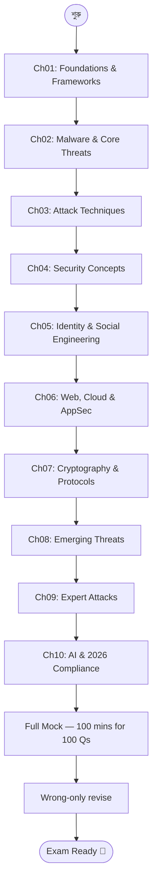

# Cyber Security MCQ Practice — Master Index 🔐

> ১০০টা high-quality Cyber Security MCQ — Bangla-তে explanation, English technical terms সহ। Bangladesh Bank IT Officer / AD (IT), BCS Computer, NTRCA Computer/IT, এবং অন্যান্য bank IT exam-এর জন্য fast revision।

---

## 🎯 এই Practice Set কেন?

Cyber Security-র theory পড়ার পর প্রায় সবাই same challenge-এ পড়ে — **question দেখলে সঠিক option বাছাই করতে পারি না।** কারণটা হলো পড়াশোনাটা passive ছিল। এই 100-question set সেই gap পূরণ করে।

প্রতিটা MCQ-এ:
- ✅ Correct option marked
- 🇧🇩 Bangla-তে concept ব্যাখ্যা
- 💡 Exam tip / trap warning
- 🔁 Banking context-specific note

---

## 📋 Exam-এ কাজে লাগবে কোথায়

| Exam | Cyber Security Weight | Coverage |
|------|----------------------|----------|
| **Bangladesh Bank Officer (IT) / AD (IT)** | 20-30% | Full — BB Framework, SWIFT, MFA, ZTA সহ |
| **BCS Computer (Technical)** | 8-12 MCQ | ৫০-৬০% directly applicable |
| **NTRCA Computer/IT** | Cyber Security chapter | Cryptography + Attacks পুরোটা |
| **Commercial Bank IT Officer** | varies | Foundation + Advanced সব |

---

## 📚 Chapter Map

১০০টা MCQ topic অনুযায়ী ১০টা chapter-এ ভাগ করা।

| # | Chapter | Topics | Q count |
|---|---------|--------|---------|
| 01 | [Foundations & Frameworks](01-foundations-frameworks.md) | ZTA, DMZ, e-KYC Liveness, OAuth/OIDC, 3-2-1 Backup, Zero-Click, Hashing, MFA, BB Framework 2026, Non-repudiation | 10 |
| 02 | [Malware, SWIFT & Core Threats](02-malware-swift-threats.md) | Ransomware, RMA/SWIFT, Tokenization vs Encryption, DDoS, Phishing psychology, PoLP, Data Integrity, Vishing, BB Detect pillar, Digital Forensics | 10 |
| 03 | [Attack Techniques & Network Defense](03-attack-techniques-network.md) | MitM, Brute Force, Watering Hole, Egress Filtering, HoneyPot, XSS, HSM, Whaling, Sandboxing, Blast Radius | 10 |
| 04 | [Security Concepts & Physical Threats](04-security-concepts-physical.md) | Salting, Sybil Attack, Clickjacking, Attack Surface, Pharming, Physical threats, EDR, Penetration Testing, Data at Rest, DDoS vs CIA | 10 |
| 05 | [Identity, Access & Social Engineering](05-identity-access-social.md) | CIA Triad, AI Deepfake/Vishing, Credential Stuffing, BB CIRT, Logic Bomb, Keylogging, Biometric Spoofing, Air-Gapping, Typosquatting, SIEM | 10 |
| 06 | [Web, Cloud & Application Security](06-web-cloud-appsec.md) | SQLi, WAF, Shared Responsibility Model, Ethical Hacking, Preventative controls, Buffer Overflow, Digital Forensics, Behavioral Biometrics, Zero-Day, BCP | 10 |
| 07 | [Cryptography & Advanced Protocols](07-cryptography-protocols.md) | Replay Attack/Nonce, Perfect Forward Secrecy, BOLA, BB Heist 2016, Homomorphic Encryption, TOCTOU, Side-Channel, PKCE, Salted Pepper, Micro-segmentation | 10 |
| 08 | [Emerging Threats & Expert Protocols](08-emerging-threats-protocols.md) | OAuth Scopes, Byzantine Generals, DNSSEC, Bluesnarfing, Degaussing, Deepfake eKYC, IRM, Evil Twin, Wormable Malware, Key Escrow | 10 |
| 09 | [Expert Attacks & Forensics](09-expert-attacks-forensics.md) | Race Condition/ATM, Steganography, Quantum-Resistant Crypto, Smurf Attack, Cold Boot, Rainbow Table, Blind SQLi, IOC, Fuzzing, Polymorphic Malware | 10 |
| 10 | [AI Security & 2026 Compliance](10-ai-security-compliance.md) | Prompt Injection, ABAC/Metadata, AI Washing, BB Guidelines frequency, Wiper Malware, DORA, Egress Exfiltration, Lattice-based Crypto, CSPM, Machine Identity | 10 |

মোট প্রশ্ন: **100**

---

## 🛣️ Recommended Practice Sequence

---

## 🧠 Key Patterns Bangladesh Bank Examiners ভালোবাসেন

### 1. Framework & Pillar Questions
> "BB Cybersecurity Framework 2026-এ কয়টা pillar?" → **6 pillars: Identify, Protect, Detect, Respond, Recover, Report**

### 2. "Difference" Comparisons
> "Hashing vs Encryption", "IDS vs IPS vs Firewall", "Tokenization vs Encryption", "Ransomware vs Spyware"

প্রতিটার জন্য একটা punchline মুখস্থ রাখুন।

### 3. MFA Factor Classification
> "OTP কোন factor?" → **Something you have**
> "Fingerprint কোন factor?" → **Something you are**

### 4. Placement Questions
> "Web server কোথায় রাখবে?" → **DMZ**
> "IDS কোথায় রাখবে?" → **Internal network (near CBS)**

### 5. Bangladesh-Specific Context
> SWIFT RMA, BB 2016 heist, BB Framework 2026, e-KYC liveness detection — এগুলো directly exam-এ আসে।

---

## 🔑 Quick Reference Cheat Sheet

### BB Cybersecurity Framework 2026 — 6 Pillars
| Pillar | কী করে |
|--------|---------|
| **Identify** | Asset inventory — কোন asset কতটা sensitive |
| **Protect** | Security controls implement করা |
| **Detect** | SOC + SIEM দিয়ে 24/7 monitor |
| **Respond** | Incident response + CIRT activation |
| **Recover** | Business continuity + DR site |
| **Report** | Breach হলে 6 ঘণ্টার মধ্যে Bangladesh Bank-কে notify |

### MFA Authentication Factors
| Factor | Example |
|--------|---------|
| Something you **know** | Password, PIN |
| Something you **have** | OTP, Hardware token, Smart card |
| Something you **are** | Fingerprint, Face scan, Iris |
| Something you **do** | Typing rhythm, Behavioral biometrics |

### Key Cryptography Comparisons
| | Hashing | Encryption | Tokenization |
|-|---------|------------|--------------|
| **Direction** | One-way (irreversible) | Two-way (reversible) | Mapping (no math) |
| **Key needed?** | No | Yes | Vault lookup |
| **Use case** | Password storage, integrity | Data privacy | Card numbers |

### Attack Classification
| Attack type | Example |
|-------------|---------|
| **Social Engineering** | Phishing, Vishing, Smishing, Whaling |
| **Network** | DDoS, MitM, Smurf, Evil Twin |
| **Injection** | SQLi, Blind SQLi, XSS, Buffer Overflow |
| **Malware** | Ransomware, Spyware, Logic Bomb, Wiper |
| **Zero-User-Interaction** | Zero-Click Attack |
| **Physical** | Cold Boot, Degaussing, Air-Gap bypass |

---

## ⚠️ Common Exam Traps

1. **ZTA vs Perimeter Security** — ZTA = "Never Trust, Always Verify" (identity-centric), Perimeter = Castle & Moat (network-centric)।

2. **OTP কোন MFA factor?** — "Something you **have**" (phone), NOT "something you know" (password)।

3. **Tokenization vs Encryption** — Token-কে mathematically decrypt করা যায় না; Encryption-কে key দিয়ে decrypt করা যায়।

4. **IDS vs IPS** — IDS = alert পাঠায়, block করে না। IPS = automatically block করে।

5. **3-2-1 Rule-এ off-site কতটা?** — শুধু **1টা** copy off-site, মোট **3টা** copy।

6. **Whaling vs Phishing vs Spear Phishing** — Phishing = mass; Spear = targeted; Whaling = C-suite executives targeted।

7. **Ransomware vs Wiper** — Ransomware = encrypt + ransom demand; Wiper = permanently delete, কোনো ransom নেই।

8. **Zero-Click vs Zero-Day** — Zero-Click = user interaction দরকার নেই; Zero-Day = vendor-এর কাছে patch নেই।

---

## 📖 কীভাবে ব্যবহার করবেন

### Round 1 — Solve Cold
প্রতিটা chapter-এ প্রশ্ন দেখে নিজে answer pick করুন (paper-এ), তারপর correct match করুন।

### Round 2 — Wrong-Only Revise
শুধু ভুল হওয়া প্রশ্নগুলোর explanation পড়ুন।

### Round 3 — Mock Test (Timed)
১০০টা MCQ এক বসায় ১০০ মিনিটে (per Q ১ মিনিট)। ৭৫+ = exam-ready।

### Round 4 — Written Prep Bridge
MCQ-এ weak topic পেলে existing **Cyber Security Written Course** পড়ুন: [Cyber Security (BB IT Exam)](/sections/cyber-security-bd-bank)।

---

**শেষ কথা:** Cyber security exam-এ সবচেয়ে বড় challenge হলো **terminology** — অনেক term দেখতে একই কিন্তু আলাদা মানে। ১০০টা MCQ solve করলেই এই terminology-গুলো brain-এ lock হয়ে যাবে। প্রতিটা ভুল answer একটা শিক্ষা — exam-এ সেই mistake repeat হবে না।

> ✨ **Best of luck for your Bangladesh Bank IT / BCS / NTRCA exam!** ✨
