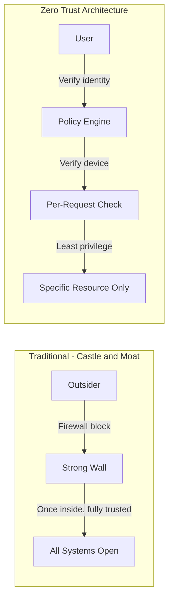
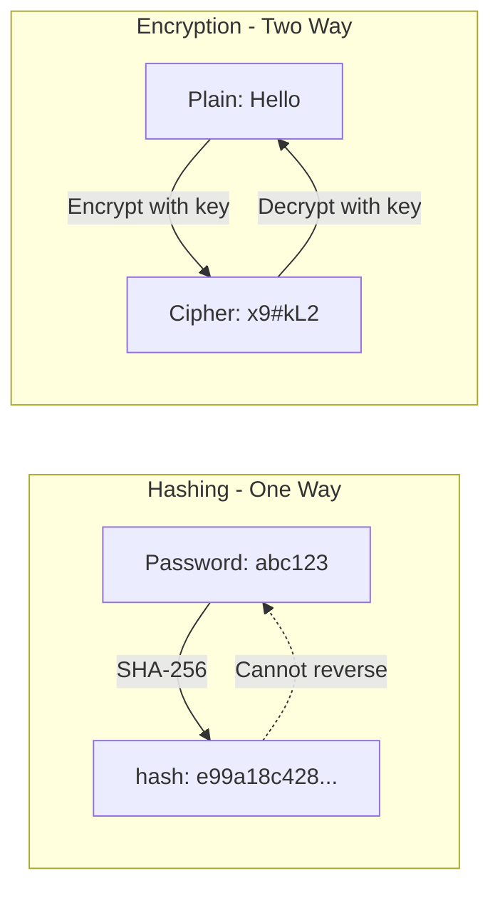
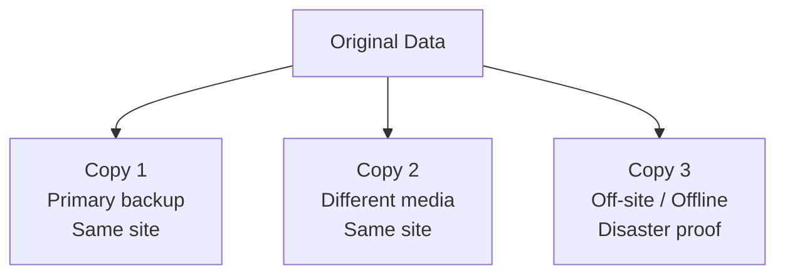
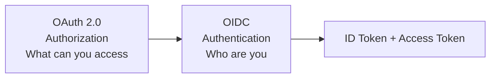

# Chapter 01 — Foundations & Frameworks 🛡️

> Zero Trust Architecture, DMZ placement, e-KYC Liveness Detection, OAuth 2.0 / OIDC, 3-2-1 Backup Rule, Zero-Click Attack, Hashing vs Encryption, MFA factors, BB Cybersecurity Framework 2026 (6 pillars), Non-repudiation — ১০টা foundational MCQ।

---

## 📚 Concept Refresher (পড়ুন আগে)

### Zero Trust Architecture (ZTA) vs Traditional Perimeter Security

**ZTA-র মূলমন্ত্র:** *"Never Trust, Always Verify"* — অর্থাৎ network-এর ভেতরে থাকলেও কাউকে by-default trust করা যাবে না। প্রতিটা request explicitly verify করতে হবে।

| Aspect | Traditional Perimeter | Zero Trust |
|--------|----------------------|------------|
| Trust model | "Inside = trusted" | "Never trust, always verify" |
| Assumption | Network is safe | Network already compromised |
| Verification | Once at the gate | Every request, every time |
| Access scope | Broad (full LAN) | Minimum (per-resource) |

### MFA — তিনটা Factor

**Multi-Factor Authentication** মানে কমপক্ষে দুইটা ভিন্ন category থেকে proof দিতে হবে।

| Factor | Category | Banking Example |
|--------|----------|-----------------|
| **Something you Know** | Knowledge | Password, PIN, security question |
| **Something you Have** | Possession | OTP via SMS, hardware token, mobile app |
| **Something you Are** | Inherence | Fingerprint, Face ID, iris scan |

> Note: একই category থেকে দুইটা proof দিলে সেটা MFA না (যেমন password + PIN — দুটোই Know)।

### Hashing vs Encryption

| | Hashing | Encryption |
|--|---------|------------|
| Direction | One-way (irreversible) | Two-way (reversible) |
| Purpose | Integrity, password storage | Confidentiality |
| Output size | Fixed (e.g., 256 bits) | Varies with input |
| Examples | SHA-256, MD5, bcrypt | AES, RSA, ChaCha20 |

### 3-2-1 Backup Rule

- **3** — মোট copies রাখুন (১ original + ২ backup)
- **2** — দুই ধরনের media-তে (যেমন disk + tape)
- **1** — অন্তত একটা copy off-site / offline (ransomware এবং fire থেকে বাঁচার জন্য)

### Bangladesh Bank Cybersecurity Framework 2026 — 6 Pillars

| # | Pillar | Goal |
|---|--------|------|
| 1 | **Identify** | Risk এবং asset discovery — কী protect করতে হবে চিনুন |
| 2 | **Protect** | Preventive controls (firewall, encryption, access control) |
| 3 | **Detect** | Continuous monitoring (SOC, SIEM, anomaly detection) |
| 4 | **Respond** | Incident response — breach হলে কী করবেন |
| 5 | **Recover** | Restore service, backups, lessons learned |
| 6 | **Report** | Regulatory + stakeholder communication |

### OAuth 2.0 vs OIDC

OAuth 2.0 = **Authorization** (resource access permission)। OIDC = OAuth 2.0-র উপরে পাতলা একটা **Authentication** layer যেটা ID Token issue করে।

---

## 🎯 Question 1: Zero Trust-এর মূলমন্ত্র

> **Question:** The "Never Trust, Always Verify" principle is the core of:

- A) Perimeter Security
- B) Zero Trust Architecture ✅
- C) SSL/TLS Handshake
- D) SWIFT Security

**Solution: B) Zero Trust Architecture**

**ব্যাখ্যা:** Zero Trust Architecture একটা security framework যেটা ধরে নেয় network আগেই compromised হয়ে আছে। Traditional perimeter security যেখানে office-এর ভেতরের সবাইকে trust করে, ZTA সেখানে প্রতিটা user এবং device-কে — location-এ যেখানেই থাকুক — explicitly verify করে।

> **Note:** Zero Trust is a security framework that assumes the network is already compromised. Unlike traditional perimeter security which trusts anyone inside the office, Zero Trust requires explicit verification of every user and device, regardless of their location.

---

## 🎯 Question 2: Web Server-এর Logical Placement

> **Question:** Where should a bank's Web Server (Internet-facing) be logically placed?

- A) Core Database Zone
- B) Internal Employee Network
- C) DMZ (Demilitarized Zone) ✅
- D) Outside the Firewall

**Solution: C) DMZ (Demilitarized Zone)**

**ব্যাখ্যা:** DMZ public internet এবং bank-এর private internal network-এর মাঝে একটা **buffer zone** হিসেবে কাজ করে। Web server এখানে রাখলে server hack হলেও attacker একটা second, stricter internal firewall দ্বারা core database থেকে আলাদা থাকে।

> **Note:** The DMZ acts as a "buffer zone" between the public internet and the bank's private internal network. By placing the web server here, the bank ensures that if the server is hacked, the attacker is still separated from the core database by a second, stricter internal firewall.

---

## 🎯 Question 3: e-KYC-এ Liveness Detection

> **Question:** "Liveness Detection" in e-KYC is primarily designed to prevent:

- A) SQL Injection
- B) DDoS Attacks
- C) Spoofing (using photos/videos of a person) ✅
- D) Social Engineering

**Solution: C) Spoofing (using photos/videos of a person)**

**ব্যাখ্যা:** Digital onboarding-এর সময় attacker NID owner-এর high-resolution photo বা video ধরে camera-র সামনে দেখাতে পারে। Liveness detection (active বা passive) verify করে ব্যক্তি সত্যিই **live human** কিনা — blink, head movement, smile ইত্যাদি check করে।

> **Note:** During digital onboarding, attackers might try to hold up a high-resolution photo or a video of the NID owner. Liveness detection (active or passive) ensures the person is a "live" human by asking them to blink, move, or smile.

---

## 🎯 Question 4: OAuth 2.0-র উপরে Identity Layer

> **Question:** Which protocol provides the Identity layer (Authentication) on top of OAuth 2.0?

- A) mTLS
- B) OIDC (OpenID Connect) ✅
- C) SHA-256
- D) HTTP/3

**Solution: B) OIDC (OpenID Connect)**

**ব্যাখ্যা:** OAuth 2.0 শুধু **Authorization**-এর জন্য design করা (data access-এর permission দেওয়া)। OIDC হলো এর উপরে পাতলা একটা layer যেটা **Authentication** handle করে (user কে সেটা prove করে)। এটা একটা **ID Token** issue করে যেখানে user-এর profile information থাকে।

> **Note:** While OAuth 2.0 is designed for Authorization (granting permission to access data), OIDC is the thin layer on top that handles Authentication (proving who the user is). It issues an "ID Token" which contains the user's profile information.

---

## 🎯 Question 5: 3-2-1 Backup Rule

> **Question:** Under the "3-2-1 Backup Rule," how many copies of data should be kept "Off-site"?

- A) 3
- B) 2
- C) 1 ✅
- D) 0

**Solution: C) 1**

**ব্যাখ্যা:** Rule অনুসারে আপনার data-র total **3 copies** থাকতে হবে, **2 different types of media**-তে, এবং **1 copy** off-site (ideally offline) রাখতে হবে — যাতে fire, theft, বা ransomware-র মতো local disaster থেকে protection পাওয়া যায়।

> **Note:** The rule states you should have 3 total copies of your data, on 2 different types of media, and 1 copy must be stored off-site (and ideally offline) to protect against local disasters like fire, theft, or ransomware.

---

## 🎯 Question 6: Zero-Click Attack

> **Question:** Which type of attack requires NO interaction (no clicking) from the victim?

- A) Phishing
- B) Zero-Click Attack ✅
- C) Vishing
- D) Smishing

**Solution: B) Zero-Click Attack**

**ব্যাখ্যা:** Traditional phishing-এ user-কে link click করতে বা file open করতে হয়। **Zero-Click attack** device-এর data processing-এর vulnerability exploit করে (যেমন একটা text message বা missed call) — user কিছু না করেই phone infect হয়ে যায়। উদাহরণ: Pegasus spyware।

> **Note:** Traditional phishing requires a user to click a link or open a file. A Zero-Click attack exploits vulnerabilities in the way a device processes data (like a text message or a missed call) to infect the phone without the user ever knowing.

---

## 🎯 Question 7: Hashing vs Encryption

> **Question:** Hashing is a ________ function, while Encryption is a ________ function.

- A) Two-way | One-way
- B) One-way | Two-way ✅
- C) Reversible | Permanent
- D) Fast | Slow

**Solution: B) One-way | Two-way**

**ব্যাখ্যা:** Hashing **irreversible** — একটা hash থেকে original data আর recover করা যায় না। Encryption একটা **two-way street** — secret key দিয়ে scramble (encrypt) করা যায় এবং আবার unscramble (decrypt) করা যায়।

> **Note:** Hashing is irreversible; you cannot take a hash and "un-hash" it to see the original data. Encryption is a two-way street—it is designed to be scrambled (encrypted) and then unscrambled (decrypted) using a secret key.

---

## 🎯 Question 8: OTP কোন MFA Factor

> **Question:** Which factor of MFA is a "One-Time Password (OTP)"?

- A) Something you know
- B) Something you are
- C) Something you have ✅
- D) Something you do

**Solution: C) Something you have**

**ব্যাখ্যা:** MFA-র তিনটা category — **Something you know** (password), **something you are** (fingerprint), **something you have** (OTP receive করার phone বা physical security token)। OTP receive করার জন্য phone থাকতে হয়, তাই এটা "have" category-তে পড়ে।

> **Note:** MFA categories include: Something you know (password), something you are (fingerprint), and something you have (a phone to receive an OTP or a physical security token).

---

## 🎯 Question 9: BB Cybersecurity Framework 2026

> **Question:** The Bangladesh Bank Cybersecurity Framework (2026) is based on how many pillars?

- A) 3
- B) 5
- C) 6 ✅
- D) 10

**Solution: C) 6**

**ব্যাখ্যা:** নতুন framework ছয়টা critical pillar-এর উপর গঠিত: **Identify, Protect, Detect, Respond, Recover, এবং Report**। এটা prevention থেকে recovery পর্যন্ত security-র full lifecycle ensure করে।

> **Note:** The new framework is built on six critical pillars: Identify, Protect, Detect, Respond, Recover, and Report. This ensures a full lifecycle of security from prevention to recovery.

---

## 🎯 Question 10: Non-repudiation কী

> **Question:** What is "Non-repudiation" in digital signatures?

- A) The ability to hide the sender's identity
- B) The inability of a sender to deny they sent a message ✅
- C) The speed of the transaction
- D) The encryption of the message body

**Solution: B) The inability of a sender to deny they sent a message**

**ব্যাখ্যা:** Digital signature sender-এর unique **Private Key** দিয়ে তৈরি হয়, তাই sender পরে court-এ এসে claim করতে পারে না যে তিনি transaction authorize করেননি। এটা digital banking-এর জন্য **legal certainty** দেয়।

> **Note:** Because a digital signature is created using the sender's unique Private Key, they cannot later claim in court that they didn't authorize the transaction. This provides legal certainty for digital banking.

---

## 📋 Quick Recap Table

| Concept | Key fact |
|---------|----------|
| Zero Trust Architecture | "Never trust, always verify" — verify every request |
| DMZ placement | Web server (Internet-facing) goes here, separated from core DB |
| Liveness Detection | Prevents photo/video spoofing in e-KYC |
| OAuth 2.0 | Authorization (what you can access) |
| OIDC | Authentication layer on top of OAuth 2.0 (who you are) |
| 3-2-1 Backup Rule | 3 copies, 2 media types, 1 off-site |
| Zero-Click Attack | No user interaction needed; exploits message/call processing |
| Hashing | One-way (irreversible) — for integrity & password storage |
| Encryption | Two-way (reversible with key) — for confidentiality |
| OTP factor | "Something you have" (possession) |
| BB Framework 2026 | 6 pillars: Identify, Protect, Detect, Respond, Recover, Report |
| Non-repudiation | Sender cannot deny — guaranteed by Private Key signature |

---

## 🔁 Next Chapter

পরের chapter-এ **Malware, SWIFT & Core Threats** — Ransomware, RMA, Tokenization vs Encryption, DDoS, Phishing psychology, Principle of Least Privilege, Vishing, এবং Digital Forensics-এর Chain of Custody।

→ [Chapter 02: Malware, SWIFT & Core Threats](02-malware-swift-threats.md)
