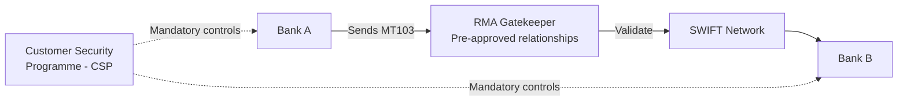
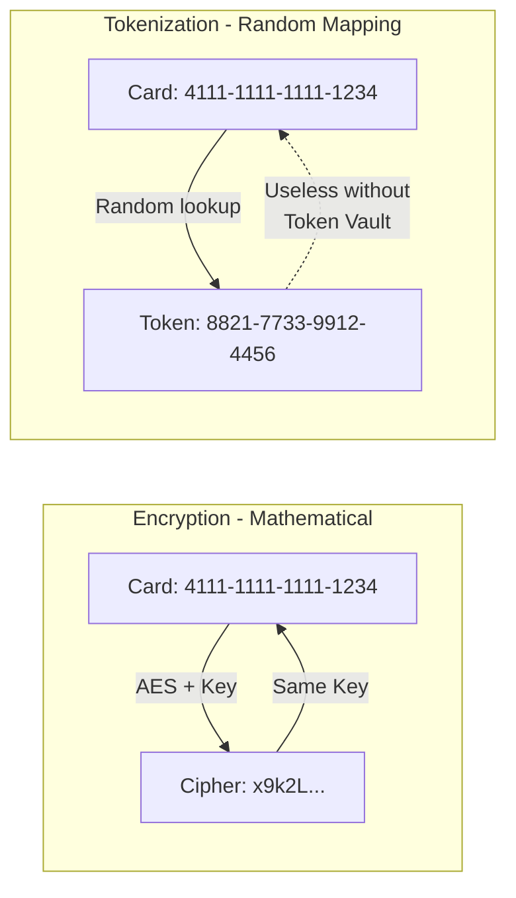
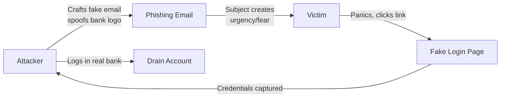
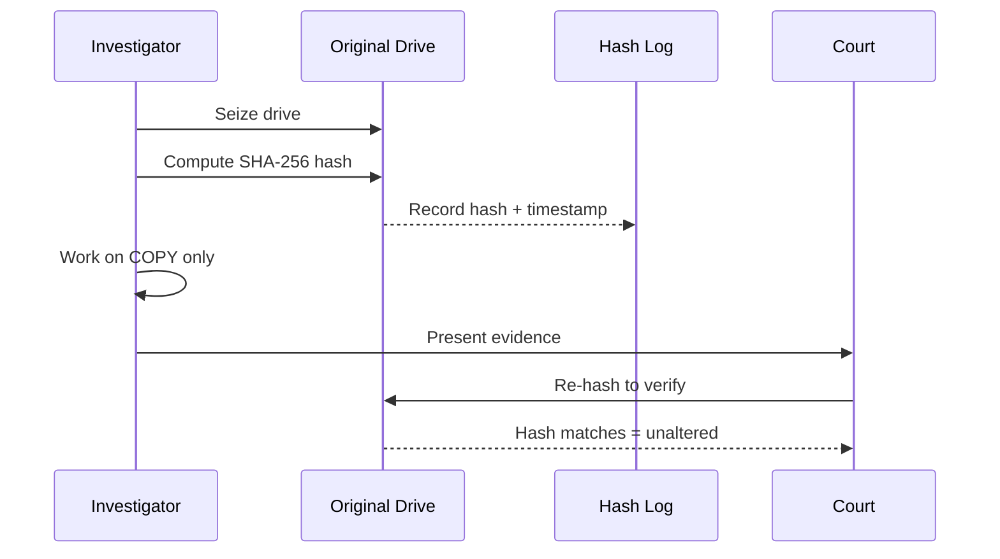

# Chapter 02 — Malware, SWIFT & Core Threats 🦠

> Ransomware, SWIFT RMA, Tokenization vs Encryption, DDoS protocol attack, Phishing psychology, Principle of Least Privilege (PoLP), Data Integrity via Hashing, Vishing, BB Framework Detect pillar, Digital Forensics Chain of Custody — ১০টা banking threat MCQ।

---

## 📚 Concept Refresher (পড়ুন আগে)

### Malware Types — Comparison

| Malware | Goal | Behavior | Bank Impact |
|---------|------|----------|-------------|
| **Ransomware** | Extortion | Encrypts files, demands payment | Core banking offline; e.g., Bangladesh Bank-style heist scenarios |
| **Spyware** | Steal data silently | Logs keystrokes, screenshots | Credentials theft |
| **Rootkit** | Hide other malware | Embeds in OS kernel; invisible | Persistent backdoor |
| **Adware** | Revenue from ads | Pops up ads | Mostly nuisance, but vector for worse |
| **Worm** | Self-propagation | Copies across network | Spreads laterally — branch network risk |
| **Trojan** | Disguise | Looks legit, acts malicious | Initial access vector |

### SWIFT Security — Core Components

| Component | Purpose |
|-----------|---------|
| **RMA (Relationship Management Application)** | Bank A বনাম Bank B-র মধ্যে pre-approved messaging relationship — gatekeeper |
| **CSP (Customer Security Programme)** | Mandatory security controls SWIFT-এর সব member bank-এর জন্য |
| **MT/MX Messages** | Standardized payment instruction format |
| **HSM (Hardware Security Module)** | Private key safekeeping |

### Tokenization vs Encryption

| | Encryption | Tokenization |
|--|------------|--------------|
| Method | Mathematical algorithm + key | Random mapping in vault |
| Reversible by key? | Yes | No (vault required) |
| Stolen ciphertext value | Crackable if key leaks | Useless without vault access |
| Use case | Data in transit, files | PCI DSS card data, mobile wallets |

### Phishing Attack Flow

### Principle of Least Privilege (PoLP)

প্রতিটা user / process-কে তার কাজ করার জন্য **minimum** permission দিন — তার বেশি কখনোই না। Teller-কে admin access দিলে credential leak হলে পুরো core banking ঝুঁকিতে পড়ে।

### Chain of Custody — Digital Forensics

---

## 🎯 Question 11: Ransomware Identification

> **Question:** Which type of malware is specifically designed to encrypt a bank's database and demand payment for the decryption key?

- A) Spyware
- B) Ransomware ✅
- C) Rootkit
- D) Adware

**Solution: B) Ransomware**

**ব্যাখ্যা:** Ransomware হলো একটা **extortion** form। Spyware যেখানে চুপচাপ data দেখে, Ransomware সেখানে নিজেকে announce করে — system lock করে দিয়ে। প্রধান defense হলো **3-2-1 backup rule** যাতে hacker-কে payment না দিয়েও recover করা যায়।

> **Note:** Ransomware is a form of extortion. Unlike Spyware, which silently watches your data, Ransomware makes itself known by locking you out of your systems. The primary defense is the 3-2-1 backup rule to ensure you can recover without paying the hacker.

---

## 🎯 Question 12: SWIFT-এর RMA

> **Question:** In the context of SWIFT security, what does "RMA" stand for?

- A) Remote Management Access
- B) Relationship Management Application ✅
- C) Risk Mitigation Authorization
- D) Real-time Monitoring Agent

**Solution: B) Relationship Management Application**

**ব্যাখ্যা:** RMA হলো SWIFT-এর একটা service যেটা financial institution-গুলোকে control দেয় — তারা কোন bank-এর সাথে message exchange করবে সেটা manage করতে পারে। এটা একটা **gatekeeper** হিসেবে কাজ করে — unauthorized bank যাতে fraudulent payment instruction পাঠাতে না পারে।

> **Note:** RMA is a service provided by SWIFT that allows financial institutions to manage which other banks they want to exchange messages with. It acts as a gatekeeper to prevent unauthorized banks from sending fraudulent payment instructions.

---

## 🎯 Question 13: Tokenization vs Encryption

> **Question:** What is the main security benefit of "Tokenization" over "Encryption" in card processing?

- A) Tokenization is faster to compute.
- B) Tokens cannot be "decrypted" even if the hacker has a key. ✅
- C) Tokens are longer than the original card number.
- D) Tokenization requires no database.

**Solution: B) Tokens cannot be "decrypted" even if the hacker has a key**

**ব্যাখ্যা:** Encryption একটা mathematical process যেটা key দিয়ে reverse করা যায়। Tokenization একটা **random mapping** — token-এর সাথে আসল card number-এর কোনো mathematical relationship নেই। Hacker token-এর database চুরি করলেও সেগুলো secure **Token Vault**-এ access ছাড়া useless।

> **Note:** Encryption is a mathematical process that can be reversed with a key. Tokenization is a random mapping; the "token" has no mathematical relationship to the real card number. If a hacker steals a database of tokens, they are useless without access to the secure "Token Vault".

---

## 🎯 Question 14: Protocol-level Server Attack

> **Question:** Which of the following is a "Protocol-level" attack used to crash bank servers by overwhelming them with traffic?

- A) SQL Injection
- B) DDoS (Distributed Denial of Service) ✅
- C) Cross-Site Scripting (XSS)
- D) Man-in-the-Middle (MitM)

**Solution: B) DDoS (Distributed Denial of Service)**

**ব্যাখ্যা:** DDoS attack-এ একটা **Botnet** (infected device-এর network) ব্যবহার করে server-এর handle করার ক্ষমতার চেয়ে বেশি request পাঠানো হয়। Bank-গুলো এই malicious traffic edge-এ filter করতে **Cloudflare** বা specialized **WAF** ব্যবহার করে।

> **Note:** DDoS attacks use a "Botnet" (a network of infected devices) to flood a server with more requests than it can handle. Banks use Cloudflare or specialized WAFs to filter this malicious traffic at the edge.

---

## 🎯 Question 15: Phishing-এর Psychology

> **Question:** In a "Phishing" attack, what is the attacker's primary psychological tool?

- A) Technical expertise
- B) Complexity of code
- C) Creating a sense of Urgency or Fear ✅
- D) Brute force guessing

**Solution: C) Creating a sense of Urgency or Fear**

**ব্যাখ্যা:** Social engineering মানুষের mind hack করে। *"Your account will be blocked in 30 minutes"* বললে attacker একটা **panic response** trigger করে — victim safety warning ignore করে দ্রুত malicious link click করে।

> **Note:** Social engineering hacks the human mind. By saying "Your account will be blocked in 30 minutes," the attacker triggers a panic response that makes the victim ignore safety warnings and click a malicious link.

---

## 🎯 Question 16: Principle of Least Privilege

> **Question:** What does the "Principle of Least Privilege" (PoLP) mean in a banking environment?

- A) Employees should have access to all systems for efficiency.
- B) Only managers should have passwords.
- C) Users are given the minimum access necessary to perform their specific job. ✅
- D) No one is allowed to use the internet at work.

**Solution: C) Users are given the minimum access necessary to perform their specific job**

**ব্যাখ্যা:** এটা **Zero Trust**-এর একটা core pillar। Bank teller-এর account compromised হলে hacker-এর শুধু teller-level data দেখার permission থাকা উচিত — পুরো core banking database বা admin setting-এ না।

> **Note:** This is a core pillar of Zero Trust. If a bank teller's account is compromised, the hacker should only be able to see teller-level data, not the entire core banking database or administrative settings.

---

## 🎯 Question 17: Data Integrity Mechanism

> **Question:** Which security measure ensures that a data packet has not been altered while traveling between a branch and the head office?

- A) Redundancy
- B) Integrity (using Hashing) ✅
- C) Confidentiality
- D) Availability

**Solution: B) Integrity (using Hashing)**

**ব্যাখ্যা:** Integrity ensure করে *"যা পাঠানো হয়েছে তাই received হয়েছে"*। শুরুতে এবং শেষে একটা hash value (যেমন **SHA-256**) calculate করা হয়; perfectly match না করলে bank বুঝতে পারে data tamper হয়েছে।

> **Note:** Integrity ensures that "what was sent is what was received". A hash value (like SHA-256) is calculated at the start and end; if they don't match perfectly, the bank knows the data was tampered with.

---

## 🎯 Question 18: Vishing কী

> **Question:** What is "Vishing"?

- A) Phishing via video calls
- B) Phishing via voice calls or phone scams ✅
- C) Phishing via viral social media posts
- D) Hacking into a bank's voicemail system

**Solution: B) Phishing via voice calls or phone scams**

**ব্যাখ্যা:** **Vishing (Voice Phishing)** হলো attacker victim-কে call করে bank official সেজে কথা বলে। তারা প্রায়ই **AI দিয়ে voice clone** করে বা **fake caller ID** ব্যবহার করে user-কে OTP বা PIN reveal করতে fool করে।

> **Note:** Vishing (Voice Phishing) involves an attacker calling a victim and posing as a bank official. They often use AI to clone voices or fake caller IDs to trick the user into revealing their OTP or PIN.

---

## 🎯 Question 19: SOC এবং BB Framework Pillar

> **Question:** Which pillar of the 2026 BB Cybersecurity Framework involves having a "SOC" (Security Operations Center) to watch for threats 24/7?

- A) Identify
- B) Protect
- C) Detect ✅
- D) Recover

**Solution: C) Detect**

**ব্যাখ্যা:** **Detect** pillar continuous monitoring-এর জন্য। এটা bank-গুলোকে **SIEM tools** এবং **SOC teams** ব্যবহার করতে বাধ্য করে — যাতে real-time-এ anomaly বা unauthorized access attempt damage হওয়ার আগেই identify করা যায়।

> **Note:** The "Detect" pillar is about continuous monitoring. It requires banks to use SIEM tools and SOC teams to identify anomalies or unauthorized access attempts in real-time before they cause damage.

---

## 🎯 Question 20: Forensics Hashing-এর উদ্দেশ্য

> **Question:** In Digital Forensics, what is the purpose of "Hashing" an original hard drive before analysis?

- A) To encrypt the drive so hackers can't see it.
- B) To make a copy of the drive faster.
- C) To prove that the evidence has not been changed during the investigation. ✅
- D) To fix any errors on the drive.

**Solution: C) To prove that the evidence has not been changed during the investigation**

**ব্যাখ্যা:** এটা **Chain of Custody**-র অংশ। Drive hash করে investigator একটা digital **fingerprint** তৈরি করে। Court-এ চ্যালেঞ্জ হলে তিনি দেখাতে পারেন যে আজকের hash seizure-এর দিনের hash-এর সাথে match করছে — অর্থাৎ evidence authentic এবং untampered।

> **Note:** This is part of the Chain of Custody. By hashing the drive, the investigator creates a digital "fingerprint". If they are challenged in court, they can show that the hash today matches the hash from the day it was seized, proving the evidence is authentic.

---

## 📋 Quick Recap Table

| Concept | Key fact |
|---------|----------|
| Ransomware | Encrypts data, demands payment; defense = 3-2-1 backup |
| Spyware | Silent data theft (keystrokes, credentials) |
| Rootkit | Hides other malware in OS kernel |
| RMA | Relationship Management Application — SWIFT gatekeeper |
| CSP | Customer Security Programme — mandatory SWIFT controls |
| Tokenization | Random mapping; token useless without vault |
| Encryption | Mathematical, reversible with key |
| DDoS | Botnet floods server; mitigated by Cloudflare/WAF |
| Phishing tool | Urgency / fear (panic response) |
| PoLP | Minimum access to do the job (Zero Trust pillar) |
| Integrity | Verified by hashing (SHA-256) |
| Vishing | Voice phishing — fake calls, AI voice clone |
| BB "Detect" pillar | SOC + SIEM, 24/7 monitoring |
| Forensic hashing | Chain of custody — proves evidence unaltered |

---

## 🔁 Next Chapter

পরের chapter-এ **Attack Techniques & Network Defense** — SQL Injection, XSS, MitM, Firewall types, IDS/IPS, VPN protocols, এবং network segmentation strategies।

→ [Chapter 03: Attack Techniques & Network Defense](03-attack-techniques-network.md)
