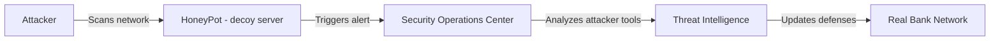
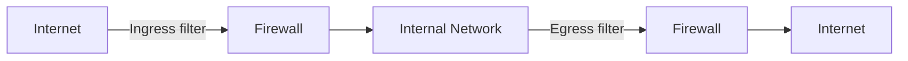
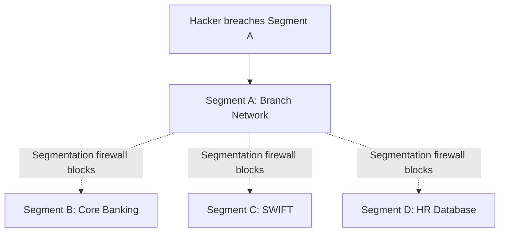

# Chapter 03 — Attack Techniques & Network Defense 🎯

> Man-in-the-Middle (MitM), Brute Force, Watering Hole, Egress Filtering, HoneyPot, Cross-Site Scripting (XSS), HSM, Whaling, Sandboxing, Blast Radius — ১০টা attack-technique এবং network-defense MCQ যা banking IT exam-এ frequently আসে।

---

## 📚 Concept Refresher (পড়ুন আগে)

### Major Attack Types — এক নজরে তুলনা

| Attack | Target | Mechanism | Primary Defense |
|--------|--------|-----------|-----------------|
| **MitM** | Communication channel | Intercepts traffic between two parties | TLS, Certificate Pinning, mTLS |
| **Brute Force** | Authentication | Tries every password combination | Account Lockout, Rate Limiting, MFA |
| **Watering Hole** | Group of users | Infects a website the target group visits | EDR, web filtering, browser sandboxing |
| **Whaling** | High-level executives (CEO/CFO) | Highly customized phishing | Executive awareness training, email DMARC |

### HoneyPot — কীভাবে কাজ করে

**HoneyPot** = একটা **decoy system** (সাজানো ফাঁদ) যা দেখতে একদম vulnerable bank server-এর মতো, কিন্তু আসলে heavily monitored। হ্যাকার আক্রমণ করলে তার tools, techniques সব record হয়ে যায় — কোনো real data risk-এ পড়ে না।

### Web & Application Attack Categories

| Attack | Category | Mechanism | Defense |
|--------|----------|-----------|---------|
| **XSS (Cross-Site Scripting)** | Client-side script injection | Malicious JS runs in victim's browser | Input sanitization, CSP header, HTTPOnly cookies |
| **SQL Injection** | Server-side query injection | Malicious SQL via input fields | Parameterized queries, ORM, WAF |
| **Buffer Overflow** | Memory corruption | Writes data beyond buffer bounds | Safe languages (Rust, Go), ASLR, DEP |
| **DDoS** | Availability | Flood of traffic from many sources | Rate limit, CDN, scrubbing service |

### Egress vs Ingress Filtering

- **Ingress filtering** — বাইরে থেকে ভিতরে আসা traffic check (incoming threats block)।
- **Egress filtering** — ভিতর থেকে বাইরে যাওয়া traffic check (data exfiltration ও malware "call-home" block)।

### Blast Radius & Network Segmentation

**Blast Radius** = একটা breach কতটুকু damage ছড়াতে পারে। **Network Segmentation** breach-কে এক segment-এ আটকে রাখে — অন্যান্য systems-এ "blast" পৌঁছায় না।

---

## 🎯 Question 21: Man-in-the-Middle (MitM) Attack

> **Question:** What is a "Man-in-the-Middle" (MitM) attack in mobile banking?

- A) When an attacker physically steals a user's phone.
- B) When an attacker intercepts the communication between the bank's server and the user's app. ✅
- C) When a bank employee accesses a customer's account without permission.
- D) When a user enters the wrong password too many times.

**Solution: B) When an attacker intercepts the communication between the bank's server and the user's app**

**ব্যাখ্যা:** MitM attack-এ হ্যাকার client (mobile banking app) আর server-এর মাঝখানে বসে গোপনে communication intercept বা modify করে। Banking context-এ এটা সাধারণত unsecured **public Wi-Fi**-তে ঘটে — হ্যাকার rogue access point বানিয়ে user-এর traffic capture করে। Banks এই attack প্রতিরোধ করে **Certificate Pinning** (app শুধু bank-এর pinned certificate-ই accept করে) এবং **mTLS (Mutual TLS)** দিয়ে — যেখানে client-server দু'পক্ষই একে অপরকে certificate দিয়ে verify করে।

> **Note:** MitM-এর শিকার হলে user-এর কোনো warning দেখায় না সাধারণত। তাই সবসময় bank-এর official app ব্যবহার করুন এবং public Wi-Fi-তে banking transaction এড়িয়ে চলুন।

---

## 🎯 Question 22: Brute Force Attack

> **Question:** Which of the following describes "Brute Force" attacking?

- A) Using a hammer to destroy a server.
- B) Using software to systematically try every possible password combination until one works. ✅
- C) Tricking a user into giving their password via a fake email.
- D) Infecting a computer with a virus that deletes files.

**Solution: B) Using software to systematically try every possible password combination until one works**

**ব্যাখ্যা:** Brute Force হলো একটা **trial-and-error** method যেখানে automated software (যেমন Hydra, John the Ripper) এক এক করে সব possible password try করতে থাকে যতক্ষণ না সঠিকটা পাওয়া যায়। Banks এই attack প্রতিরোধ করতে **Account Lockout Policy** (যেমন ৩ বার ভুল হলে account lock), **Rate Limiting** (per-second attempt restrict), **CAPTCHA**, এবং **MFA** ব্যবহার করে।

> **Note:** Variant: **Dictionary Attack** (common password list থেকে try) এবং **Credential Stuffing** (অন্য site থেকে leaked password reuse করা) — এই দুটোই brute force family-র অংশ।

---

## 🎯 Question 23: Watering Hole Attack

> **Question:** In a "Watering Hole" attack, the hacker targets:

- A) The bank's main database directly.
- B) A specific individual's personal email account.
- C) A website frequently visited by bank employees to infect their computers. ✅
- D) The bank's physical water supply.

**Solution: C) A website frequently visited by bank employees to infect their computers**

**ব্যাখ্যা:** Watering Hole attack-এ হ্যাকার সরাসরি bank-কে আক্রমণ না করে এমন একটা **third-party website** (যেমন local news site, professional forum, industry blog) compromise করে যেটা bank employees নিয়মিত visit করে। সেই compromised site visit করার সময় browser-এ silently malware download হয়ে যায় (drive-by download) — এর মাধ্যমে হ্যাকার bank-এর internal network-এ access পায়। নাম "watering hole" এসেছে শিকারীর strategy থেকে — যেখানে শিকার পানি খেতে আসে সেখানেই ফাঁদ পাতা।

> **Note:** Defense: browser **sandboxing**, **EDR** on all endpoints, regular patching, এবং employees-দের জন্য **least-privilege browsing** (admin rights ছাড়া)।

---

## 🎯 Question 24: Egress Filtering

> **Question:** What is "Egress Filtering" in bank network security?

- A) Monitoring incoming traffic from the internet.
- B) Monitoring and restricting data leaving the internal network to the internet. ✅
- C) Encrypting data stored on hard drives.
- D) Checking the physical ID of employees entering the building.

**Solution: B) Monitoring and restricting data leaving the internal network to the internet**

**ব্যাখ্যা:** **Egress** মানে "exit" বা বের হওয়া। **Egress Filtering** হলো internal network থেকে বাইরে (internet) যাওয়া traffic monitor ও restrict করার practice। এটা **Spyware** এবং **Data Exfiltration** বন্ধ করতে critical — কোনো server malware-এ infected হলে সেটা attacker-এর Command & Control (C2) server-এ "call home" করতে চাইবে; egress filter সেই unauthorized outbound connection block করে দেয়।

> **Note:** এর উল্টোটা হলো **Ingress Filtering** (বাইরে থেকে ভিতরে আসা traffic check)। শক্তিশালী security-র জন্য দুটোই দরকার, তবে অনেক প্রতিষ্ঠান শুধু ingress-এ মনোযোগ দেয় — egress-এ দুর্বলতা থাকলে breach detect করা কঠিন হয়।

---

## 🎯 Question 25: HoneyPot

> **Question:** What is a "HoneyPot" in a cybersecurity strategy?

- A) A server used to store the bank's backup data.
- B) A decoy system designed to lure hackers and study their methods. ✅
- C) A high-speed server for VIP customers.
- D) A type of encryption that is "sweet" and easy to use.

**Solution: B) A decoy system designed to lure hackers and study their methods**

**ব্যাখ্যা:** **HoneyPot** হলো একটা **decoy system** যা ইচ্ছাকৃতভাবে vulnerable দেখানো হয় হ্যাকারদেরকে আকর্ষণ করার জন্য। দেখতে মনে হবে এটা bank-এর কোনো test database বা poorly-secured server, কিন্তু আসলে এটা heavily monitored — এখানে কোনো real customer data থাকে না। হ্যাকার যখন এটা attack করে, security team **SOC (Security Operations Center)** থেকে real-time alert পায় এবং attacker-এর tools, techniques, IP address সব analyze করতে পারে — এই intelligence দিয়ে real network-এর defense আরও শক্তিশালী করা যায়।

> **Note:** বড় network-এ অনেকগুলো honeypot একসাথে চালালে সেটাকে **HoneyNet** বলে। আরেকটা variant **HoneyToken** — fake credentials/files যা ব্যবহার করলেই alert trigger হয়।

---

## 🎯 Question 26: Cross-Site Scripting (XSS)

> **Question:** Which vulnerability allows an attacker to execute malicious scripts in another user's browser?

- A) SQL Injection
- B) Cross-Site Scripting (XSS) ✅
- C) DDoS
- D) Buffer Overflow

**Solution: B) Cross-Site Scripting (XSS)**

**ব্যাখ্যা:** **XSS** attack-এ হ্যাকার একটা legitimate website-এ malicious JavaScript inject করে দেয় (যেমন comment box বা search field-এর মাধ্যমে)। যখন অন্য customer সেই page visit করে, script তার browser-এ run হয় এবং তার **Session Cookie** চুরি করে নিতে পারে — এর মাধ্যমে হ্যাকার সেই customer-এর active banking session **hijack** করতে পারে।

| XSS Type | কোথায় script থাকে |
|----------|-------------------|
| **Stored** | Database-এ permanently saved (যেমন comment), সব visitor-এর জন্য trigger |
| **Reflected** | URL parameter-এ, victim-কে malicious link click করানো লাগে |
| **DOM-based** | Client-side JavaScript-এ, server-এ যায়ই না |

> **Note:** Defense: **input sanitization**, **output encoding**, **Content Security Policy (CSP)** header, এবং cookies-এ `HttpOnly` + `Secure` flag set করা।

---

## 🎯 Question 27: HSM (Hardware Security Module)

> **Question:** What is the primary purpose of an HSM (Hardware Security Module) in a bank?

- A) To provide faster internet for staff.
- B) To securely store and manage cryptographic keys. ✅
- C) To serve as a backup generator for the building.
- D) To scan employee fingerprints.

**Solution: B) To securely store and manage cryptographic keys**

**ব্যাখ্যা:** **HSM** হলো একটা specialized **physical device** (tamper-resistant hardware) যা cryptographic keys নিরাপদে generate, store, এবং ব্যবহার করে। সবচেয়ে গুরুত্বপূর্ণ ব্যাপার — **key কখনো HSM থেকে বের হয় না**; cryptographic operation HSM-এর ভিতরেই হয়। ফলে হ্যাকার যদি bank-এর software-এ admin access-ও পায়, তবুও HSM থেকে keys extract করতে পারবে না। **SWIFT message signing**, **EMV card transactions**, এবং **PIN block encryption**-এর জন্য HSM mandatory।

> **Note:** HSM tamper-resistant — কেউ physically খোলার চেষ্টা করলে নিজে নিজে keys destroy করে দেয়। PCI-DSS এবং SWIFT CSP compliance-এর জন্য HSM বাধ্যতামূলক।

---

## 🎯 Question 28: Whaling Attack

> **Question:** "Whaling" is a specific type of Phishing that targets:

- A) Low-level employees.
- B) Large groups of random people.
- C) High-level executives like the CEO or CFO. ✅
- D) People who work in the fishing industry.

**Solution: C) High-level executives like the CEO or CFO**

**ব্যাখ্যা:** **Whaling** = Phishing-এর একটা highly targeted variant যেখানে শিকার হলো **C-level executives** (CEO, CFO, CTO) — কারণ তাদের access সবচেয়ে বেশি। এদের "big fish" (whales) বলা হয়। সফল whaling attack-এ হ্যাকার এক্সিকিউটিভকে নকল করে urgent **wire transfer** করিয়ে নিতে পারে (CEO Fraud / Business Email Compromise - BEC), অথবা strategic plans চুরি করতে পারে। এই attacks অত্যন্ত personalized হয় — LinkedIn থেকে role, recent meetings, signature style সব research করা হয়।

| Phishing Type | Target |
|---------------|--------|
| **Phishing** | Mass / random users |
| **Spear Phishing** | Specific individual or small group |
| **Whaling** | Top executives |
| **Vishing** | Voice call-based |
| **Smishing** | SMS-based |

> **Note:** Defense: executives-দের জন্য বিশেষ awareness training, email-এ **DMARC/DKIM/SPF** configure করা, এবং বড় transfer-এর জন্য **out-of-band verification** (যেমন phone call দিয়ে confirm)।

---

## 🎯 Question 29: Sandboxing

> **Question:** What does "Sandboxing" mean in mobile app security?

- A) Designing apps that only work in children's play areas.
- B) Running an application in an isolated environment so it cannot access other parts of the system. ✅
- C) Backing up the app's code to a cloud server.
- D) Testing the app for bugs before it is released.

**Solution: B) Running an application in an isolated environment so it cannot access other parts of the system**

**ব্যাখ্যা:** **Sandboxing** = প্রতিটা app-কে আলাদা একটা **isolated environment**-এ চালানো যাতে সে অন্য app-এর data বা system resources access করতে না পারে। Modern mobile OS (Android, iOS) প্রতিটা app-কে আলাদা UID দিয়ে আলাদা sandbox-এ run করে — ফলে কোনো malicious app আপনার banking app-এর data, contacts, বা messages পড়তে পারে না। App-কে কোনো resource (camera, location, contacts) access করতে হলে user-এর explicit **permission** নিতে হয়।

> **Note:** Browser-এও sandboxing হয় — প্রতিটা tab আলাদা process-এ run হয় যাতে এক tab-এর malicious script অন্য tab-কে compromise না করতে পারে। এটাই Chrome-এর core security model।

---

## 🎯 Question 30: Blast Radius

> **Question:** What is the "Blast Radius" in the context of a cyber breach?

- A) The physical distance an explosion travels.
- B) The extent of damage or the number of systems affected by a single security incident. ✅
- C) The speed at which a virus spreads over the internet.
- D) The time it takes for the IT team to respond to an alarm.

**Solution: B) The extent of damage or the number of systems affected by a single security incident**

**ব্যাখ্যা:** **Blast Radius** একটা metaphor — যেমন bomb blast-এর একটা impact area থাকে, তেমনি একটা breach-ও একটা নির্দিষ্ট পরিমাণ damage করতে পারে। Bank-এর goal হলো **"Reduce the Blast Radius"** — অর্থাৎ breach হলেও damage যতটা সম্ভব small রাখা। এটা করার মূল উপায় **Network Segmentation** (network-কে ছোট ছোট zone-এ ভাগ করা, প্রতিটার মাঝে firewall) এবং **Least Privilege Access** (যাকে যতটুকু দরকার ঠিক ততটুকু permission)। Hacker এক segment break করলেও সেখানেই আটকে থাকবে — core banking, SWIFT, HR DB অলাদা থাকবে।

> **Note:** Cloud-এ blast radius reduce করার জন্য **VPC isolation**, **separate accounts/projects**, এবং **IAM role per service** ব্যবহার করা হয়। এটাই Zero Trust architecture-এর core principle-এর সাথে align করে।

---

## 📋 Quick Recap Table

| Concept | One-line answer |
|---------|-----------------|
| **MitM** | Communication intercepted between two parties; defense — TLS, Cert Pinning, mTLS |
| **Brute Force** | Try every password; defense — Lockout, Rate Limit, MFA |
| **Watering Hole** | Infect a site the target group visits |
| **Egress Filtering** | Restrict data **leaving** the internal network |
| **HoneyPot** | Decoy system that lures attackers to study them |
| **XSS** | Inject malicious JS into a legitimate site to steal session cookies |
| **HSM** | Physical device that stores cryptographic keys; keys never leave |
| **Whaling** | Targeted phishing of C-level executives (big fish) |
| **Sandboxing** | App runs isolated; cannot touch other apps/system |
| **Blast Radius** | Damage extent of a breach; reduce via Network Segmentation |

---

## 🔁 Next Chapter

পরের chapter-এ **Security Concepts & Physical Threats** — Salting, Sybil Attack, Clickjacking, Attack Surface, Pharming, Shoulder Surfing, EDR, Penetration Testing, Data States (At Rest / In Motion / In Use), এবং CIA Triad-এর Availability target করে এমন threats।

→ [Chapter 04: Security Concepts & Physical Threats](04-security-concepts-physical.md)
