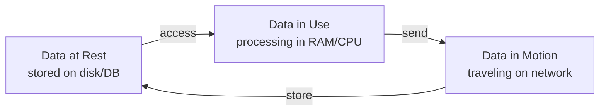
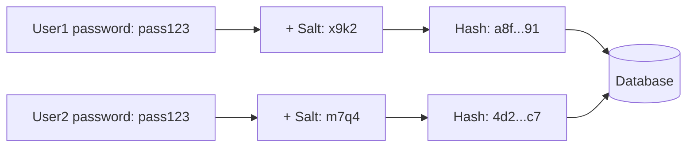

# Chapter 04 — Security Concepts & Physical Threats 🔐

> Salting, Sybil Attack, Clickjacking, Attack Surface, Pharming, Shoulder Surfing, EDR, Penetration Testing, Data at Rest, এবং CIA Triad-এর Availability — ১০টা MCQ যা security fundamentals ও physical-layer threats cover করে।

---

## 📚 Concept Refresher (পড়ুন আগে)

### Security Control Types — তিনটা Category

| Type | কখন কাজ করে | উদাহরণ |
|------|-------------|--------|
| **Preventative** | Incident-এর **আগে** — ঠেকায় | Firewall, MFA, Encryption, Access Control |
| **Detective** | Incident-এর **সময়/পরে** — ধরে ফেলে | IDS, SIEM, EDR, Log Monitoring, CCTV |
| **Corrective** | Incident-এর **পরে** — recover করে | Backup restore, patch, Incident Response plan |

### Three States of Data

| State | Threat | Protection |
|-------|--------|------------|
| **At Rest** | Disk theft, unauthorized DB access | Disk encryption (AES), TDE, file permissions |
| **In Motion** | Eavesdropping, MitM | TLS/HTTPS, VPN, IPsec |
| **In Use** | Memory dump, side-channel attack | Secure enclaves (Intel SGX), TEE, memory encryption |

### Salting — কীভাবে কাজ করে

**মূল কথা:** একই password হলেও **different salt** যোগ করায় database-এ stored hash সম্পূর্ণ আলাদা দেখাবে। ফলে precomputed **Rainbow Table** কাজ করে না — hacker-কে প্রতিটা user-এর জন্য আলাদা করে crack করতে হবে।

### CIA Triad এবং কোন threat কাকে target করে

| CIA Property | কী protect করে | Common threat |
|--------------|-----------------|---------------|
| **Confidentiality** | তথ্য গোপন রাখা | Phishing, Spyware, Eavesdropping |
| **Integrity** | তথ্য অপরিবর্তিত রাখা | Tampering, MitM modification, Data Breach |
| **Availability** | service চালু রাখা | **DDoS**, Ransomware, Hardware failure |

### Pharming vs Phishing

| | Phishing | Pharming |
|--|----------|----------|
| Attack vector | Fake link / email | Poisoned DNS / hosts file |
| User must click? | হ্যাঁ | না — সঠিক URL টাইপ করলেও fake site-এ যায় |
| Visible clue | Sometimes URL looks weird | URL দেখতে perfect, খুব কঠিন detect |

---

## 🎯 Question 31: Salting

> **Question:** What is "Salting" in the context of password hashing?

- A) Increasing the physical temperature of the server.
- B) Adding random data to a password before hashing it to protect against Rainbow Table attacks. ✅
- C) Sharing a password with multiple users.
- D) Deleting passwords after 30 days.

**Solution: B) Adding random data to a password before hashing it to protect against Rainbow Table attacks**

**ব্যাখ্যা:** **Salt** = প্রতিটা password-এর সাথে যোগ করা একটা **unique random string**। Database-এ store হয় `hash(password + salt)`। দুজন user-ও যদি একই password (যেমন "Password123") দেয়, তাদের salt আলাদা হওয়ায় hash সম্পূর্ণ আলাদা দেখাবে। এতে **Rainbow Table attack** (precomputed hash list দিয়ে quick crack) কাজ করে না — hacker-কে প্রতিটা user-এর জন্য আলাদাভাবে brute-force করতে হবে, যা practically impossible।

> **Note:** Modern best practice — `bcrypt`, `scrypt`, বা `Argon2` ব্যবহার করুন; এগুলো automatically salt generate করে এবং deliberately slow (work factor) — যাতে brute force attack কঠিন হয়। শুধু SHA-256 password hash-এর জন্য যথেষ্ট না।

---

## 🎯 Question 32: Sybil Attack

> **Question:** A "Sybil Attack" in a banking network primarily targets:

- A) The physical security of the bank vault.
- B) The reputation system by creating a large number of pseudonymous identities. ✅
- C) The air conditioning system of the data center.
- D) The bank's social media followers.

**Solution: B) The reputation system by creating a large number of pseudonymous identities**

**ব্যাখ্যা:** **Sybil Attack**-এ একজন attacker অনেকগুলো **fake identity** তৈরি করে একটা decentralized বা reputation-based system-কে manipulate করে। Banking এবং fintech context-এ এটা ঘটতে পারে — যেমন peer-to-peer lending platform-এ fake reviewer account দিয়ে rating manipulate করা, blockchain network-এ অনেক fake node দিয়ে consensus subvert করা, অথবা fraud detection system-কে confuse করা। নাম এসেছে "Sybil" নামক একজন patient-এর Multiple Personality Disorder-এর গল্প থেকে।

> **Note:** Defense: **strong identity verification (KYC)**, **proof-of-work / proof-of-stake** (blockchain), এবং **device fingerprinting** — একই device থেকে multiple account create করলেই detect করা।

---

## 🎯 Question 33: Clickjacking

> **Question:** What is "Clickjacking"?

- A) Stealing a user's physical mouse.
- B) A technique that tricks a user into clicking something different from what they perceive. ✅
- C) Clicking an ad too many times.
- D) Hacking into a computer using only a mouse.

**Solution: B) A technique that tricks a user into clicking something different from what they perceive**

**ব্যাখ্যা:** **Clickjacking** (UI Redress Attack)-এ attacker একটা legitimate page-এর উপর invisible **iframe** layer বসিয়ে দেয়। User মনে করে সে video-র "Play" button click করছে, কিন্তু আসলে নিচের hidden banking page-এর "Confirm Transfer" button click করে ফেলছে। User-এর session ইতিমধ্যে authenticated থাকলে transaction success হয়ে যাবে।

> **Note:** Defense: server-এ `X-Frame-Options: DENY` বা `Content-Security-Policy: frame-ancestors 'none'` header set করুন — এতে আপনার page-কে কোনো iframe-এ load করা যাবে না।

---

## 🎯 Question 34: Attack Surface

> **Question:** In Cybersecurity, what is the "Attack Surface"?

- A) The physical screen of a monitor.
- B) The total sum of all possible points where an unauthorized user can enter or extract data. ✅
- C) The speed at which a hacker types.
- D) The area of the bank building.

**Solution: B) The total sum of all possible points where an unauthorized user can enter or extract data**

**ব্যাখ্যা:** **Attack Surface** = একটা system-এর সব potential **entry/exit points**-এর সমষ্টি — যেগুলোর মাধ্যমে attacker ঢুকতে বা data বের করতে পারে। Bank-এর ক্ষেত্রে এর মধ্যে আছে: প্রতিটা public API endpoint, open network port, employee email account, mobile/web app feature, even physical entry point (যেমন USB port)। Security team-এর core principle হলো **"Minimize the Attack Surface"** — অপ্রয়োজনীয় service বন্ধ, unused account delete, default credential change করে attack surface যতটা possible ছোট রাখা।

| Surface Type | উদাহরণ |
|--------------|--------|
| **Digital** | API, port, web app, cloud storage |
| **Physical** | USB port, server room access, ATM |
| **Human / Social** | Employee susceptibility to phishing |

> **Note:** Tools যেমন **ASM (Attack Surface Management)** platforms (Cortex Xpanse, Microsoft Defender EASM) automatically organization-এর external attack surface scan ও map করে।

---

## 🎯 Question 35: Pharming

> **Question:** What is "Pharming"?

- A) Growing crops to fund hacking.
- B) Redirecting website traffic to a fake version of the site, even if the user types the correct URL. ✅
- C) Sending thousands of emails at once.
- D) Stealing agricultural data.

**Solution: B) Redirecting website traffic to a fake version of the site, even if the user types the correct URL**

**ব্যাখ্যা:** **Pharming** Phishing-এর চেয়ে বেশি sneaky — এতে user-কে fake link click করানো লাগে না। Attacker **DNS server poison** করে অথবা user-এর computer-এর **hosts file** modify করে দেয়, যাতে user "https://bank.com" type করলেও DNS resolve করে attacker-এর fake server-এর IP-তে নিয়ে যায়। URL bar-এ সঠিক address দেখা যায়, কিন্তু আসলে fake site-এ আছে — তাই detect করা অনেক কঠিন।

> **Note:** Defense: **DNSSEC** (DNS responses cryptographically signed), HTTPS এবং valid TLS certificate check (fake site valid cert পাবে না, browser warning দেবে), এবং **DNS over HTTPS (DoH)** ব্যবহার।

---

## 🎯 Question 36: Shoulder Surfing

> **Question:** Which of the following is a "Physical" layer security threat?

- A) SQL Injection.
- B) Shoulder Surfing. ✅
- C) Cross-Site Scripting.
- D) Brute Force.

**Solution: B) Shoulder Surfing**

**ব্যাখ্যা:** **Shoulder Surfing** = simply কারো কাঁধের উপর দিয়ে দেখে তার PIN, password, বা sensitive তথ্য চুরি করা। ATM-এ PIN type করার সময়, branch counter-এ password দেওয়ার সময়, বা public place-এ phone-এ banking app ব্যবহার করার সময় এটা সবচেয়ে বেশি ঘটে। অন্য option-গুলো (SQLi, XSS, Brute Force) সবই **digital/network layer** attack — শুধু shoulder surfing-ই **physical observation**-based threat।

> **Note:** Defense: **Privacy Screen filter** (পাশ থেকে দেখলে screen কালো দেখায়), ATM-এ PIN টাইপ করার সময় হাত দিয়ে keypad ঢাকা, এবং public place-এ sensitive transaction এড়ানো।

---

## 🎯 Question 37: Endpoint Detection and Response (EDR)

> **Question:** What is "Endpoint Detection and Response" (EDR)?

- A) A tool that monitors and secures end-user devices like laptops and mobiles. ✅
- B) A way to fix broken internet cables.
- C) A system for counting customers in a branch.
- D) A method for encrypting core databases.

**Solution: A) A tool that monitors and secures end-user devices like laptops and mobiles**

**ব্যাখ্যা:** **EDR** traditional Antivirus-এর next generation। শুধু signature-based virus detect করে না — এটা continuously প্রতিটা endpoint-এ (laptop, mobile, server) সব activity (process creation, file change, network connection, registry change) record করে এবং **AI/ML behavior analysis** দিয়ে suspicious pattern detect করে। যেমন Excel file হঠাৎ PowerShell চালালে EDR সেটাকে suspicious বলবে — এমন behavior কোনো known signature-এ না থাকলেও।

| | Traditional Antivirus | EDR |
|--|----------------------|-----|
| Detection | Known signature-based | Behavior-based + AI |
| Response | File quarantine | Process kill, network isolate, forensics |
| Visibility | File scan only | Full activity timeline |
| Examples | Avast, Norton (basic) | CrowdStrike, SentinelOne, Microsoft Defender for Endpoint |

> **Note:** Next evolution: **XDR (Extended Detection and Response)** — endpoint, network, email, cloud সব data একসাথে correlate করে আরও broader detection দেয়।

---

## 🎯 Question 38: Penetration Testing

> **Question:** What does "Penetration Testing" (Ethical Hacking) aim to achieve?

- A) To steal money to test the bank's insurance.
- B) To find and exploit vulnerabilities in a controlled way to improve security. ✅
- C) To train employees on how to type faster.
- D) To install new software on all computers.

**Solution: B) To find and exploit vulnerabilities in a controlled way to improve security**

**ব্যাখ্যা:** **Pen Test** হলো **proactive / offensive security** — bank ইচ্ছাকৃতভাবে authorized **"White Hat" hackers**-দের ভাড়া করে যারা real attacker-দের technique ব্যবহার করে bank-এর system break করার চেষ্টা করে। যা যা vulnerability পায়, সেগুলো একটা detailed report-এ document করে বলা হয় কীভাবে fix করতে হবে। এটা **Vulnerability Assessment**-এর চেয়ে গভীর — VA শুধু vulnerability list দেয়, Pen Test সেগুলো actually exploit করে impact দেখায়।

| Test Type | Knowledge given to tester |
|-----------|---------------------------|
| **Black Box** | কিছুই না — outsider attacker simulation |
| **Grey Box** | কিছু info (যেমন user account) — insider/limited knowledge |
| **White Box** | পুরা source code + architecture |

> **Note:** PCI-DSS compliance অনুযায়ী bank-কে বছরে অন্তত একবার pen test করতে হয়। **Red Team** = attacker simulation, **Blue Team** = defender, **Purple Team** = দু'পক্ষ একসাথে কাজ করে।

---

## 🎯 Question 39: Data at Rest

> **Question:** What is "Data at Rest"?

- A) Data that is currently being emailed.
- B) Data that is inactive and stored physically on a disk or drive. ✅
- C) Data that has been deleted.
- D) A computer that is turned off.

**Solution: B) Data that is inactive and stored physically on a disk or drive**

**ব্যাখ্যা:** Data-র তিনটা **state** — At Rest, In Motion, In Use। **Data at Rest** = inactive data যা storage-এ রাখা আছে (hard drive, SSD, database file, backup tape, USB stick)। এটা encrypt করা critical — কারণ physical theft (laptop চুরি, decommissioned drive ভুলভাবে dispose) হলে data পড়া যাবে না।

| State | উদাহরণ | Defense |
|-------|--------|---------|
| **At Rest** | DB file, backup tape | AES-256 disk encryption, TDE |
| **In Motion** | Email, API call | TLS, VPN |
| **In Use** | RAM-এ processing data | TEE, Intel SGX, memory encryption |

> **Note:** Bangladesh Bank cybersecurity guideline-এ all sensitive customer data **at rest** এবং **in motion** দুই অবস্থাতেই encrypt করা mandatory। **Transparent Data Encryption (TDE)** — application-কে কিছু change না করে database-এর underlying file encrypt করার technique।

---

## 🎯 Question 40: DDoS targets Availability

> **Question:** Which cyber threat specifically targets the "Availability" of the CIA Triad?

- A) Spyware.
- B) DDoS. ✅
- C) Phishing.
- D) Data Breach.

**Solution: B) DDoS**

**ব্যাখ্যা:** **CIA Triad**-এ প্রতিটা threat আলাদা property target করে:

| Threat | CIA target | কেন |
|--------|------------|-----|
| **Phishing** | Confidentiality | Credentials/sensitive data steal |
| **Spyware** | Confidentiality | Quietly data exfiltrate |
| **Data Breach** | Integrity / Confidentiality | Data tamper বা leak |
| **DDoS** | **Availability** | Service unreachable for legitimate users |

**DDoS (Distributed Denial of Service)** attack-এ অনেক compromised devices-এর botnet থেকে একসাথে massive traffic পাঠিয়ে bank-এর website/API overwhelm করা হয় — legitimate customers service-এ access করতে পারে না। কোনো data steal বা modify হয় না, কিন্তু service down — এটাই Availability target।

> **Note:** Defense: **CDN** (Cloudflare, Akamai), **rate limiting**, **traffic scrubbing service**, এবং **anycast network** যা attack traffic-কে বহু data center-এ ছড়িয়ে absorb করে।

---

## 📋 Quick Recap Table

| Concept | One-line answer |
|---------|-----------------|
| **Salting** | Random data added to password before hash; defeats Rainbow Tables |
| **Sybil Attack** | One attacker creates many fake identities to manipulate reputation/consensus |
| **Clickjacking** | Invisible iframe overlay tricks user into clicking hidden button |
| **Attack Surface** | Sum of all possible entry/exit points; goal — minimize it |
| **Pharming** | DNS/hosts poison redirects correct URL to fake site |
| **Shoulder Surfing** | Physical-layer threat: watching someone type PIN/password |
| **EDR** | Behavior-based endpoint security, beyond signature antivirus |
| **Penetration Testing** | Authorized ethical hacking to find & fix vulnerabilities |
| **Data at Rest** | Stored data on disk; protect with encryption (AES, TDE) |
| **DDoS → CIA** | Targets **Availability** (service unreachable) |

---

## 🔁 Next Chapter

পরের chapter-এ **Identity, Access & Social Engineering** — IAM, Privileged Access Management, Tailgating, Pretexting, Baiting, এবং authentication-এর গভীর concepts।

→ [Chapter 05: Identity, Access & Social Engineering](05-identity-access-social.md)
