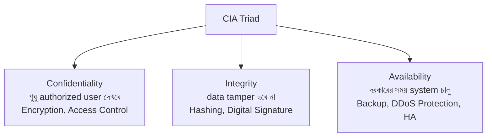
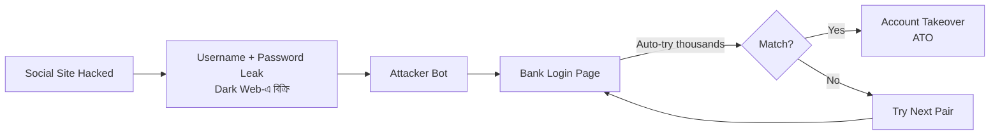
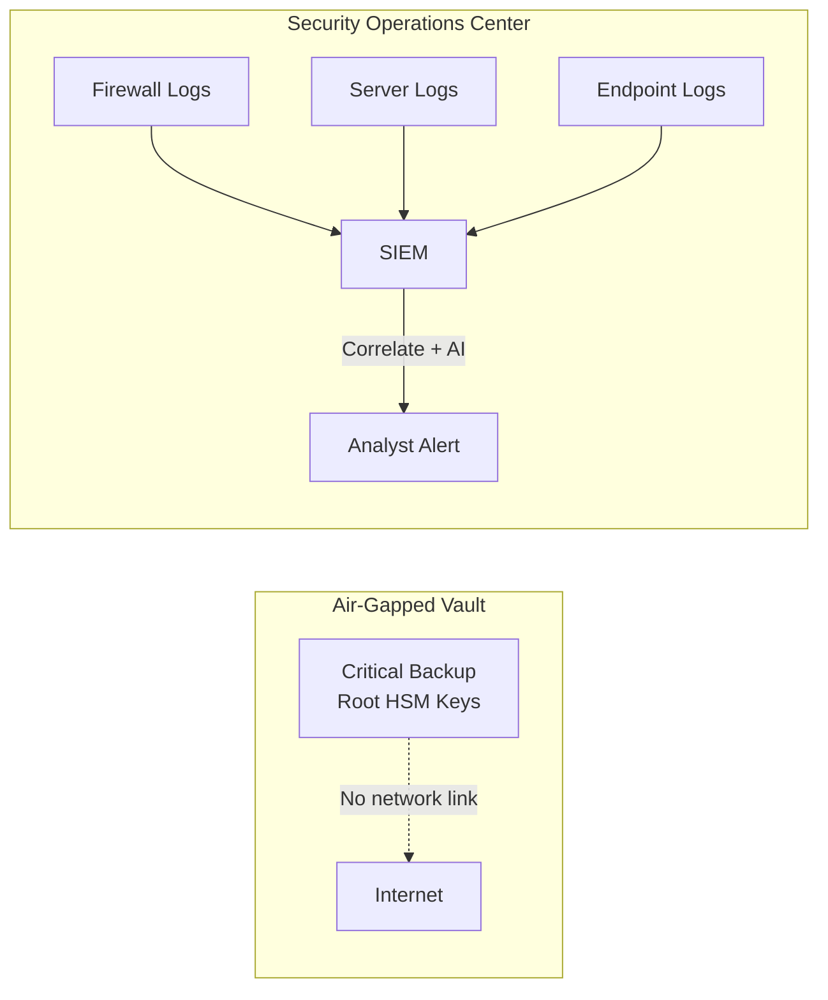
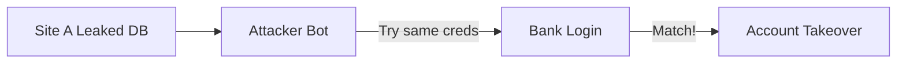
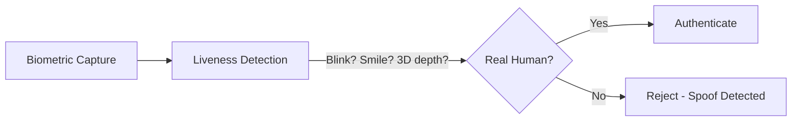
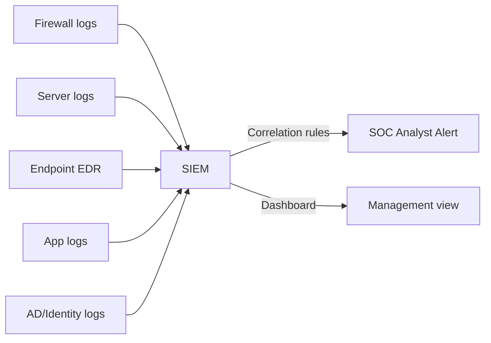

# Chapter 05 — Identity, Access & Social Engineering 🎭

> CIA Triad, AI-powered Vishing (Deepfake), Credential Stuffing, BB Framework "Respond" pillar (CIRT), Logic Bomb, Keylogging, Biometric Spoofing, Air-Gapping, Typosquatting, SIEM — ১০টা identity, access ও social engineering MCQ।

---

## 📚 Concept Refresher (পড়ুন আগে)

### CIA Triad — Information Security-র ভিত্তি

**CIA Triad** = সব security policy-র foundation। যেকোনো control design করার সময় এই তিনটার যেকোনো একটাকে protect করা হচ্ছে।



| Letter | Property | Banking Example | Defense |
|--------|----------|-----------------|---------|
| **C** | Confidentiality | Customer balance leak হতে পারবে না | Encryption (AES), RBAC |
| **I** | Integrity | Transaction amount tamper হবে না | SHA-256 hash, Digital Signature |
| **A** | Availability | ATM/Online Banking সবসময় up | Redundancy, BCP, DDoS shield |

### Social Engineering Attacks — Comparison

মানুষকে manipulate করে credentials বা টাকা হাতিয়ে নেওয়াই social engineering-এর মূল লক্ষ্য।

| Attack | Medium | Target | Defense |
|--------|--------|--------|---------|
| **Phishing** | Email | Mass / generic users | Email filter, awareness training |
| **Spear Phishing** | Email (targeted) | Specific person/role | Verify sender, callback policy |
| **Vishing** | Voice call | Anyone (especially elderly) | Never share OTP, callback official no. |
| **Smishing** | SMS | Mobile users | Don't click SMS links, verify URL |
| **Whaling** | Email/Call | C-level executives (CEO/CFO) | Out-of-band verification |
| **AI-Vishing** | Deepfake voice call | Employees of target org | Voice challenge, dual approval |
| **Typosquatting** | Fake domain | Anyone mistyping URL | Browser bookmarks, DNS filter |

### Credential Stuffing — Attack Flow

Password reuse-এর কারণে এক site-এর leaked credential অন্য site-এ try করা হয়।



**Defense:** MFA, CAPTCHA, IP rate-limiting, breach password check (HaveIBeenPwned API)।

### Destructive Malware — Logic Bomb vs Ransomware vs Wiper

| Type | Trigger | Motive | Reversible? | Defense |
|------|---------|--------|-------------|---------|
| **Logic Bomb** | Specific condition (date, event, user-deletion) | Sabotage / revenge | Sometimes (if backup) | Code review, separation of duties |
| **Ransomware** | Execution → encrypts files | Money (ransom demand) | Only with key/backup | Offline backup, EDR, patch |
| **Wiper** | Execution → destroys data | Pure destruction (state-sponsored) | No (unless backup) | Air-gapped backup, segmentation |

### Air-Gapping & SIEM — Two Pillars of Bank SOC



**SIEM = Security Information and Event Management** — SOC-র "brain" যা সব log একসাথে correlate করে hidden attack pattern detect করে।

---

## 🎯 Question 41: CIA Triad কী?

> **Question:** Banking Information Security context-এ "CIA Triad" বলতে কী বোঝায়?

- A) Central Intelligence Agency
- B) Confidentiality, Integrity, and Availability ✅
- C) Control, Inspection, and Audit
- D) Cloud, Internet, and Applications

**Solution: B) Confidentiality, Integrity, and Availability**

**ব্যাখ্যা:** **CIA Triad** হলো information security-র সবচেয়ে foundational model। সব security policy এই তিনটা property-র যেকোনো একটাকে protect করার জন্যই বানানো হয়।

- **Confidentiality** → শুধু authorized user data দেখবে (encryption, access control দিয়ে enforce)
- **Integrity** → data unauthorized way-তে change হবে না (hashing, digital signature দিয়ে detect)
- **Availability** → system দরকারের সময় up থাকবে (backup, redundancy, DDoS protection দিয়ে ensure)

> **Note:** এটা সব security policy-র foundational model। Confidentiality ensure করে শুধু authorized user-রাই data দেখছে; Integrity ensure করে data tamper হয়নি; Availability ensure করে দরকারের সময় system চালু আছে।

---

## 🎯 Question 42: Deepfake Voice Attack

> **Question:** কোন attack-এ "Deepfake" technology ব্যবহার করে high-ranking official-এর কণ্ঠ impersonate করা হয়?

- A) Smishing
- B) Pharming
- C) AI-powered Vishing ✅
- D) SQL Injection

**Solution: C) AI-powered Vishing**

**ব্যাখ্যা:** **AI-powered Vishing** এখন banking sector-এর অন্যতম বড় threat। Attacker AI দিয়ে CEO বা Manager-এর voice clone করে এবং Vishing (Voice phishing) call দিয়ে কোনো junior employee-কে urgent fraudulent wire transfer authorize করতে বলে।

- **Vishing** = Voice + Phishing
- **Deepfake** = AI-generated synthetic voice/video
- **Psychological trigger:** "Authority" — boss-এর কথা শুনলে কেউ প্রশ্ন করতে চায় না

> **Note:** Attacker-রা CEO বা Manager-এর voice AI দিয়ে clone করে। তারপর employee-কে call (Vishing) দিয়ে urgent, fraudulent wire transfer authorize করতে বলে — "Authority" psychological trigger ব্যবহার করে। **Defense:** dual approval, callback to official number, voice challenge phrase।

---

## 🎯 Question 43: Credential Stuffing

> **Question:** "Credential Stuffing" বলতে কী বোঝায়?

- A) Database-এর storage size বাড়ানো।
- B) এক site থেকে leaked username-password list ব্যবহার করে অন্য site-এ (যেমন bank) login চেষ্টা করা। ✅
- C) Password কাগজে লিখে রাখা।
- D) Login credentials encrypt করা।

**Solution: B) এক site থেকে leaked username-password list ব্যবহার করে অন্য site-এ login চেষ্টা করা**

**ব্যাখ্যা:** **Credential Stuffing**-এর foundation হলো **password reuse**। বেশিরভাগ মানুষ একই password multiple site-এ ব্যবহার করে। Social media site hack হলে attacker সেই credential-গুলো bank login page-এ automated bot দিয়ে "stuff" করে দেখে কোনটা match হয়।



**Defense:**
- **MFA** — password match হলেও second factor ছাড়া access নাই
- **Breach detection** — HaveIBeenPwned-এর মতো API দিয়ে leaked password block
- **Rate limiting + CAPTCHA** — bot slow করে দেওয়া

> **Note:** এই attack-এর মূল কারণ password reuse। তাই unique password + MFA = defense।

---

## 🎯 Question 44: BB Framework — Respond Pillar

> **Question:** 2026 BB Cybersecurity Framework-এ কোন pillar "CIRT" (Computer Incident Response Team)-এর উপর focus করে?

- A) Identify
- B) Protect
- C) Respond ✅
- D) Recover

**Solution: C) Respond**

**ব্যাখ্যা:** BB 2026 Framework-এর **Respond** pillar-এ ব্যাংকগুলোকে একটা dedicated **CIRT (Computer Incident Response Team)** রাখতে হয়, যাদের কাজ:

| Step | Action |
|------|--------|
| 1 | Threat detected হলে দ্রুত triage |
| 2 | Infected system **isolate** করা (quarantine) |
| 3 | Malware spread আটকানো |
| 4 | Evidence preserve করা (forensics) |
| 5 | Stakeholder + BB-কে notify |

**6 Pillars (NIST-aligned):** Identify → Protect → Detect → **Respond** → Recover → (BB adds: Govern)

> **Note:** Respond pillar-এ ব্যাংকগুলোকে dedicated team (CIRT) এবং clear plan রাখতে হয় — threat detect হওয়ার পর কীভাবে contain করবে। এর মধ্যে infected system isolate করা থাকে যাতে malware আর spread না করতে পারে।

---

## 🎯 Question 45: Logic Bomb

> **Question:** "Logic Bomb" বলতে কী বোঝায়?

- A) খুব কঠিন একটা math problem।
- B) এমন malicious code যা specific condition (date বা specific transaction) পূরণ হলে trigger হয়। ✅
- C) Server-এ ব্যবহৃত physical explosive।
- D) সহজে guess করা যায় এমন password।

**Solution: B) এমন malicious code যা specific condition পূরণ হলে trigger হয়**

**ব্যাখ্যা:** **Logic Bomb** হলো একটা dormant (ঘুমন্ত) malicious code যা একটা specific trigger condition পূরণ না হওয়া পর্যন্ত কিছুই করে না। এটা সাধারণত disgruntled (অসন্তুষ্ট) employee plant করে।

**Classic Banking Scenario:**

```
IF (employee_id NOT IN payroll_table) THEN
    DROP TABLE customer_accounts;
    DELETE FROM transactions;
END IF;
```

— মানে যেদিন employee-কে চাকরি থেকে বাদ দেওয়া হবে, সেদিনই database মুছে যাবে।

**Defense:**
- Code review (4-eyes principle)
- Separation of duties
- Privileged access monitoring
- Air-gapped backup

> **Note:** Logic bomb disgruntled employee plant করতে পারে। এটা dormant এবং undetected থাকে যতক্ষণ না certain event ঘটে — যেমন employee-কে payroll system থেকে delete করা — তখন সে malicious payload (database delete) execute করে।

---

## 🎯 Question 46: Keylogging

> **Question:** "Keylogging" বলতে কী বোঝায়?

- A) Physical key-এর ওজন মাপা।
- B) Software বা hardware যা user-এর প্রতিটা keystroke record করে password চুরি করে। ✅
- C) File organize করার একটা method।
- D) Digital key-এর backup তৈরি করা।

**Solution: B) Software বা hardware যা user-এর প্রতিটা keystroke record করে password চুরি করে**

**ব্যাখ্যা:** **Keylogger** দুই type:

| Type | How | Detection |
|------|-----|-----------|
| **Software keylogger** | Trojan/phishing attachment দিয়ে install | Antivirus, EDR |
| **Hardware keylogger** | USB device PC-এর সাথে physically lagano | Physical inspection |

Keylogger যা যা type করেন সব record করে — bank URL, username, password, OTP — সব attacker-এর server-এ পাঠিয়ে দেয়।

**Defense:**
- **Virtual keyboard** (mouse click দিয়ে type) — এজন্যই online banking-এ দেওয়া থাকে
- **Anti-keylogger software**
- **MFA** — password চুরি হলেও second factor ছাড়া login হবে না
- Phishing attachment open না করা

> **Note:** Keylogger সাধারণত phishing attachment দিয়ে deliver হয়। User যা যা type করে — bank URL, username, password — সব capture করে attacker-এর কাছে পাঠায়।

---

## 🎯 Question 47: Biometric Spoofing

> **Question:** নিচের কোনটি "Biometric Spoofing"-এর উদাহরণ?

- A) Password ভুলে যাওয়া।
- B) High-resolution photo বা 3D mask ব্যবহার করে facial recognition bypass করা। ✅
- C) অন্যের credit card ব্যবহার করা।
- D) Brute force attack দিয়ে server hack করা।

**Solution: B) High-resolution photo বা 3D mask ব্যবহার করে facial recognition bypass করা**

**ব্যাখ্যা:** **Biometric Spoofing** = বৈধ user-এর biometric (face, fingerprint, voice) fake বা reproduce করে authentication bypass করা।

**Common Spoofing Techniques:**

| Biometric | Spoof method |
|-----------|--------------|
| Face | High-res photo, video replay, 3D printed mask |
| Fingerprint | Silicone/gelatin mold from latent print |
| Voice | AI deepfake clone |
| Iris | Contact lens with iris pattern |

**Defense — Liveness Detection:**



> **Note:** এই কারণেই 2026 e-KYC guideline-এ **Liveness Detection** mandatory। এটা ensure করে biometric data live human থেকে আসছে — static image বা synthetic reproduction থেকে না।

---

## 🎯 Question 48: Air-Gapping

> **Question:** "Air-Gapping" বলতে কী বোঝায়?

- A) Server room ঠান্ডা করার জন্য fan ব্যবহার করা।
- B) এমন security measure যেখানে computer/network কে internet ও unsecured network থেকে physically isolated রাখা হয়। ✅
- C) Wireless connection-এর speed বাড়ানো।
- D) Satellite দিয়ে data পাঠানো।

**Solution: B) এমন security measure যেখানে computer/network কে internet থেকে physically isolated রাখা হয়**

**ব্যাখ্যা:** **Air-Gap** মানে system আর internet-এর মধ্যে কোনো wire বা wireless path নাই — মাঝে শুধু "বাতাস" (air)। ফলে remote attack প্রায় impossible।

**Banking Use Cases:**

| What | Why air-gapped |
|------|----------------|
| **Critical backup** | Ransomware-ও পৌঁছাতে পারবে না |
| **HSM root keys** | Master cryptographic keys |
| **Core banking offline copy** | Disaster recovery |
| **SCADA-like control system** | Highest assurance |

**Limitation:** Air-gap break হতে পারে USB drive বা insider threat দিয়ে (Stuxnet-এর মতো)।

> **Note:** Banks-রা সবচেয়ে critical backup বা root cryptographic key manage করার system air-gap করে রাখে। যেহেতু কোনো wire বা wireless path নেই, remote hack প্রায় impossible।

---

## 🎯 Question 49: Typosquatting

> **Question:** "Typosquatting" বলতে কী বোঝায়?

- A) Bank building-এর ভেতরে squatting করা।
- B) Popular website-এর common misspelling-এর domain register করা (যেমন bankofbangladseh.com)। ✅
- C) Keyboard-এ খুব দ্রুত type করা।
- D) Type করতে গিয়ে ভুলে file delete করা।

**Solution: B) Popular website-এর common misspelling-এর domain register করা**

**ব্যাখ্যা:** **Typosquatting** (URL hijacking) হলো এক ধরনের social engineering attack যেখানে attacker original domain-এর কাছাকাছি misspelled domain কিনে রাখে।

**Examples:**

| Real | Typosquat |
|------|-----------|
| bankofbangladesh.com | bankofbangladseh.com |
| dbbl.com.bd | dbbI.com.bd (lowercase L এর জায়গায় capital i) |
| google.com | gooogle.com |
| paypal.com | paypa1.com (l এর জায়গায় 1) |

User যদি URL type করতে গিয়ে ভুল করে, সে fake site-এ চলে যায় যেটা real bank-এর মতো দেখতে — তারপর login credential enter করে দিয়ে credentials হারায়।

**Defense:**
- **Browser bookmark** ব্যবহার করুন, type করবেন না
- **DNS filtering** (corporate)
- **Brand monitoring** — bank-রা suspicious lookalike domain track করে
- **TLS certificate verify** করুন (lock icon)

> **Note:** এটা social engineering-এর একটা form। User URL type করতে গিয়ে typo করলে attacker-এর fake site-এ পৌঁছে যায়, যা real bank-এর মতোই দেখতে — অজান্তে login credentials enter করে ফেলে।

---

## 🎯 Question 50: SIEM in Banking SOC

> **Question:** Banking SOC-এ "SIEM"-এর full form কী?

- A) System for Internal Electronic Mail
- B) Security Information and Event Management ✅
- C) Secure Internet and Encryption Method
- D) Standard Intelligence for Electronic Money

**Solution: B) Security Information and Event Management**

**ব্যাখ্যা:** **SIEM** হলো banking SOC (Security Operations Center)-এর "brain"। এটা bank-এর সব network component (firewall, server, endpoint, application) থেকে log aggregate করে এবং AI/correlation rule দিয়ে attack pattern detect করে।



**SIEM-এর Core Functions:**

| Function | Description |
|----------|-------------|
| **Aggregation** | সব source থেকে log একসাথে |
| **Normalization** | Different formats → common schema |
| **Correlation** | একাধিক event মিলিয়ে real attack detect |
| **Alerting** | Real-time analyst notification |
| **Forensics** | Historical search after incident |

**Examples:** Splunk, IBM QRadar, ArcSight, Elastic SIEM, Wazuh।

> **Note:** SIEM software bank network-এর সব অংশ (firewall, server, PC) থেকে log aggregate করে এবং AI দিয়ে cyberattack চলছে এমন pattern খুঁজে বের করে। এটাই SOC-র "brain"।

---

## 📋 Quick Recap Table

| Concept | Key fact |
|---------|----------|
| CIA Triad | Confidentiality + Integrity + Availability — security-র foundation |
| AI-powered Vishing | Deepfake voice দিয়ে CEO impersonate করে fraudulent transfer |
| Credential Stuffing | এক site-এর leaked password অন্য site-এ try (password reuse) |
| BB Respond pillar | CIRT — incident detect হলে contain করা |
| Logic Bomb | Specific condition পূরণ হলে trigger হওয়া dormant malware |
| Keylogger | Keystroke record করে password চুরি (software/hardware) |
| Biometric Spoofing | Photo/3D mask দিয়ে face recognition bypass — defense: Liveness Detection |
| Air-Gap | Internet থেকে physically isolated system — critical backup-এ ব্যবহৃত |
| Typosquatting | Misspelled domain register করে user-কে ফাঁদে ফেলা |
| SIEM | Security Information and Event Management — SOC-র brain |

---

## 🔁 Next Chapter

পরের chapter-এ **Web, Cloud & Application Security** — SQL Injection, WAF, Cloud Shared Responsibility Model, Penetration Testing, Buffer Overflow, Zero-Day, এবং BCP।

→ [Chapter 06: Web, Cloud & Application Security](06-web-cloud-appsec.md)
