# Chapter 06 — Web, Cloud & Application Security 🌐

> SQL Injection, Web Application Firewall (WAF), Cloud Shared Responsibility Model, Penetration Testing (Ethical Hacking), Preventative vs Detective Controls, Buffer Overflow, Digital Forensics, Behavioral Biometrics, Zero-Day Vulnerability, Business Continuity Planning (BCP) — ১০টা web, cloud ও application security MCQ।

---

## 📚 Concept Refresher (পড়ুন আগে)

### WAF vs Traditional Firewall

দুটোই "firewall" নাম, কিন্তু কাজ আর OSI layer আলাদা।

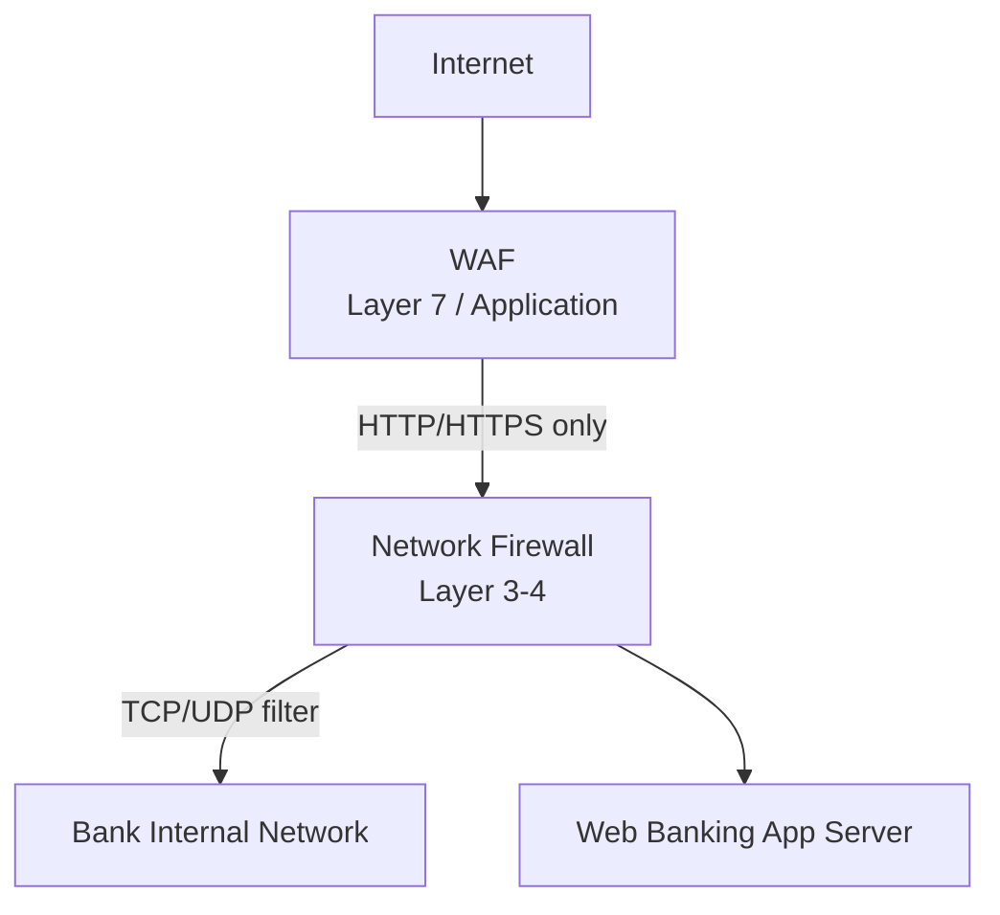

| Aspect | Network Firewall | Web Application Firewall (WAF) |
|--------|------------------|-------------------------------|
| OSI Layer | Layer 3-4 (Network/Transport) | Layer 7 (Application) |
| Filters by | IP, port, protocol | HTTP/HTTPS payload, URL, headers |
| Blocks | Unauthorized IP, port scan | SQLi, XSS, CSRF, bot traffic |
| Placement | Network perimeter | In front of web server |
| Example | Cisco ASA, Palo Alto | Cloudflare WAF, AWS WAF, ModSecurity |

### Cloud Shared Responsibility Model

Cloud-এ security কেউ একা handle করে না — provider আর customer দু'জনের ভাগাভাগি দায়িত্ব।

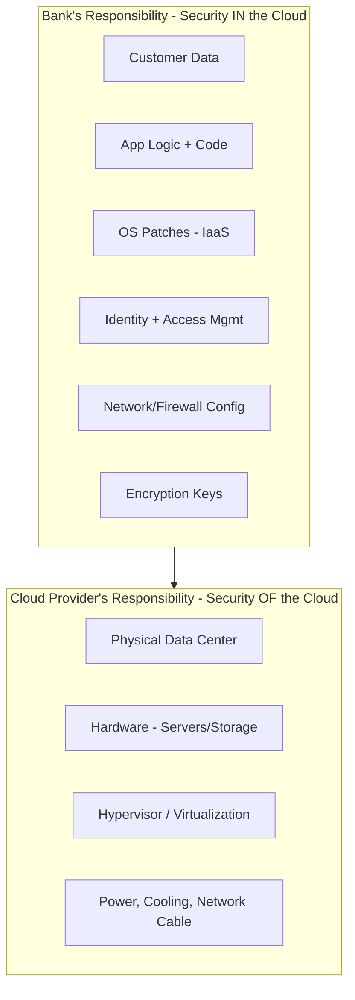

| Layer | IaaS (EC2) | PaaS (App Engine) | SaaS (Office 365) |
|-------|-----------|-------------------|-------------------|
| Data + Access | **Customer** | **Customer** | **Customer** |
| Application | **Customer** | Shared | Provider |
| OS / Runtime | **Customer** | Provider | Provider |
| Hardware / DC | Provider | Provider | Provider |

### Security Control Types — Preventative / Detective / Corrective

| Type | Goal | Banking Examples |
|------|------|------------------|
| **Preventative** | আক্রমণ আটকানো | Firewall, WAF, MFA, encryption, access control |
| **Detective** | আক্রমণ ধরা | CCTV, IDS, SIEM alert, audit log review |
| **Corrective** | আক্রমণের পর recover | Backup restore, patching, incident response, BCP/DR |
| **Deterrent** | ভয় দেখিয়ে আটকানো | Warning banner, security guard, legal notice |
| **Compensating** | মূল control না থাকলে alternative | MFA না থাকলে strong password + monitoring |

### BCP vs DR — দুটো কে কী করে?

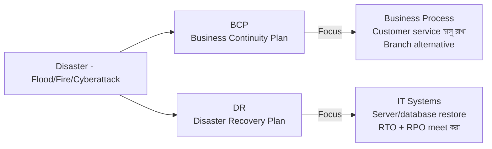

| | BCP | DR |
|--|-----|-----|
| Focus | Business operation চালু রাখা | IT system restore করা |
| Example | Flood হলে অন্য branch থেকে service | Primary DC down হলে DR site activate |
| Scope | Whole organization | Mainly IT |
| Metric | Service continuity | RTO (Recovery Time), RPO (Recovery Point) |

---

## 🎯 Question 51: SQL Injection (SQLi)

> **Question:** Web banking application-এ "SQL Injection" (SQLi) কী?

- A) Database server-এর hardware-এর উপর physical attack।
- B) Input field-এ malicious SQL code inject করে backend database manipulate করা। ✅
- C) Database-কে অনেক বেশি legitimate request দিয়ে overwhelm করা।
- D) Unauthorized access আটকাতে database encrypt করা।

**Solution: B) Input field-এ malicious SQL code inject করে backend database manipulate করা**

**ব্যাখ্যা:** **SQLi** হলো OWASP Top 10-এর একটা classic attack। Attacker login form, search box-এর মতো input field-এ SQL syntax inject করে backend query-র logic পাল্টে দেয়।

**Classic Example — Login Bypass:**

```sql
-- Vulnerable code
SELECT * FROM users WHERE username='$user' AND password='$pass';

-- Attacker enters: username = admin'-- , password = anything
SELECT * FROM users WHERE username='admin'-- ' AND password='anything';
-- '--' এর পরের সব কিছু comment হয়ে যায় → password check skip
```

**Possible Damage:**
- Authentication bypass (admin login without password)
- Customer PII data leak
- Entire `accounts` table drop
- Privilege escalation

**Defense (must-know):**

| Defense | How it works |
|---------|--------------|
| **Parameterized Queries** (Prepared Statements) | User input কখনো SQL syntax হিসেবে treat হয় না |
| **Input Validation** | Whitelist (allow known good) > Blacklist |
| **Stored Procedures** | Properly written ones |
| **Least Privilege DB User** | App user-এর DROP permission না দেওয়া |
| **WAF** | SQLi pattern detect করে block |

> **Note:** SQLi দিয়ে attacker authentication bypass, sensitive customer data দেখা, এমনকি পুরো database table delete করতে পারে। Banks এটা prevent করে **Parameterized Queries (Prepared Statements)** এবং strict input validation দিয়ে।

---

## 🎯 Question 52: Web Application Firewall (WAF)

> **Question:** "Web Application Firewall" (WAF)-এর primary function কী?

- A) Customer-এর জন্য internet connection দ্রুত করা।
- B) Web application-এর HTTP/HTTPS traffic filter, monitor এবং block করা। ✅
- C) Data center-এর চারপাশে physical wall দেওয়া।
- D) Office-এ hidden camera scan করা।

**Solution: B) Web application-এর HTTP/HTTPS traffic filter, monitor এবং block করা**

**ব্যাখ্যা:** **WAF** কাজ করে **Layer 7 (Application Layer)**-এ — মানে HTTP/HTTPS traffic-এর actual content (URL, headers, body, cookies) inspect করে।

**WAF যে যে attack ধরে:**

| Attack | WAF কীভাবে ধরে |
|--------|----------------|
| **SQL Injection** | `' OR 1=1`, `UNION SELECT` pattern detect |
| **XSS (Cross-Site Scripting)** | `<script>`, `javascript:` payload block |
| **CSRF** | Origin/Referer header check |
| **Path Traversal** | `../` pattern block |
| **Bot/DDoS** | Rate limit, CAPTCHA, fingerprint |
| **Zero-day signatures** | Vendor managed rule update |

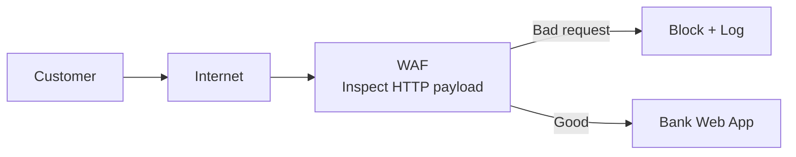

**Difference vs Network Firewall:**
- **Network FW** → IP/port filter (Layer 3-4)
- **WAF** → HTTP request body inspect (Layer 7)

**Examples:** Cloudflare WAF, AWS WAF, F5 BIG-IP, ModSecurity (open-source)।

> **Note:** Traditional firewall network protect করে, কিন্তু WAF specifically "Layer 7" (Application Layer) attack যেমন SQL Injection ও Cross-Site Scripting (XSS) খোঁজে। এটা web app আর internet-এর মাঝে shield হিসেবে কাজ করে।

---

## 🎯 Question 53: Cloud Shared Responsibility

> **Question:** Cloud computing-এর "Shared Responsibility Model"-এ physical data center-এর security-র দায়িত্ব কার?

- A) Bank (Customer)।
- B) Cloud Service Provider (যেমন AWS, Cloudflare)। ✅
- C) Bangladesh Bank IT department।
- D) Local police।

**Solution: B) Cloud Service Provider (যেমন AWS, Cloudflare)**

**ব্যাখ্যা:** Cloud-এ একটা golden rule আছে — **"Provider secures the cloud, Customer secures IN the cloud"**:

| Layer | কে দায়ী |
|-------|---------|
| Physical building, locks, guards | **Provider** |
| Servers, racks, cooling, power | **Provider** |
| Hypervisor, base virtualization | **Provider** |
| Network cables, backbone | **Provider** |
| **OS patches** (IaaS) | Customer |
| **App code, business logic** | **Customer** |
| **Data + encryption keys** | **Customer** |
| **IAM (who has access)** | **Customer** |
| **Firewall/Security group config** | **Customer** |

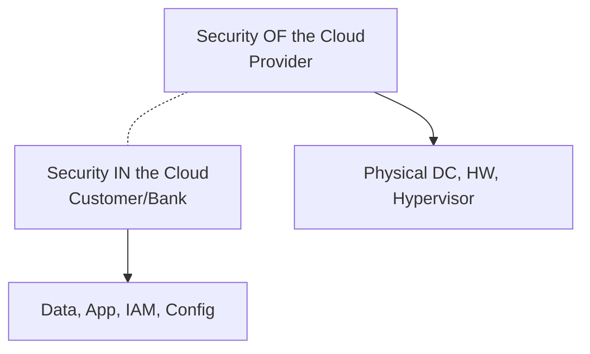

**Common Bank Mistakes (Customer Side):**
- S3 bucket public করে রাখা → customer data leak
- Weak IAM password → credential compromise
- Misconfigured security group (0.0.0.0/0 SSH) → server hack

> **Note:** Cloud Provider responsible **OF the cloud** (hardware, power, physical cooling)। Bank responsible **IN the cloud** (যে data upload করছে, যে password set করছে, software কীভাবে configure করছে)।

---

## 🎯 Question 54: Penetration Testing

> **Question:** "Penetration Testing" (Pentesting)-কে আরো কী নামে ডাকা হয়?

- A) Social Engineering।
- B) Vulnerability Scanning।
- C) Ethical Hacking। ✅
- D) Data Forensics।

**Solution: C) Ethical Hacking**

**ব্যাখ্যা:** **Pentesting = Ethical Hacking** = bank-এর লিখিত অনুমতি নিয়ে real attacker-এর মতো করে system break করার চেষ্টা — যাতে real attacker আসার আগেই weakness বের হয়ে যায়।

**Pentest vs Vulnerability Assessment (VA):**

| Aspect | Vulnerability Assessment | Penetration Test |
|--------|-------------------------|------------------|
| Method | Automated scan | Manual + automated, real exploit |
| Goal | List of known bugs | Actually break in |
| Tool example | Nessus, Qualys | Metasploit, Burp Suite, manual |
| Output | Long bug list (many false positive) | Few but verified, deep findings |
| Cost | Cheaper, regular | Expensive, periodic (yearly) |

**Pentest Types:**

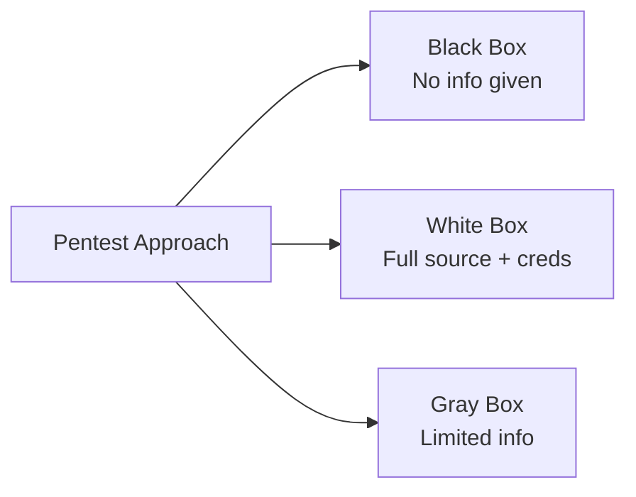

**Banking PCI-DSS Requirement:** Annual external + internal pentest mandatory।

> **Note:** Pentest হলো bank-এর system-এ active break-in attempt — real hacker আসার আগে weakness খুঁজে বের করার জন্য। এটা "Vulnerability Assessment"-এর থেকে আলাদা, যেটা সাধারণত known bug-এর automated scan।

---

## 🎯 Question 55: Preventative Control

> **Question:** নিচের কোনটি "Preventative" security control?

- A) Breach-এর পর বাজানো alarm।
- B) Theft record করা CCTV camera।
- C) Unauthorized traffic block করা Firewall। ✅
- D) Attack-এর পর লেখা forensic report।

**Solution: C) Unauthorized traffic block করা Firewall**

**ব্যাখ্যা:** **Preventative control** = attack ঘটার **আগেই** আটকে দেওয়া।

| Option | Type | Why |
|--------|------|-----|
| A) Alarm after breach | Detective | Event-এর পর notify করছে |
| B) CCTV recording | Detective | Event capture করছে, prevent না |
| C) Firewall blocking | **Preventative** ✅ | Attack ঘটতেই দিচ্ছে না |
| D) Forensic report | Corrective/Investigative | Event-এর পর analysis |

**Banking Preventative Controls:**

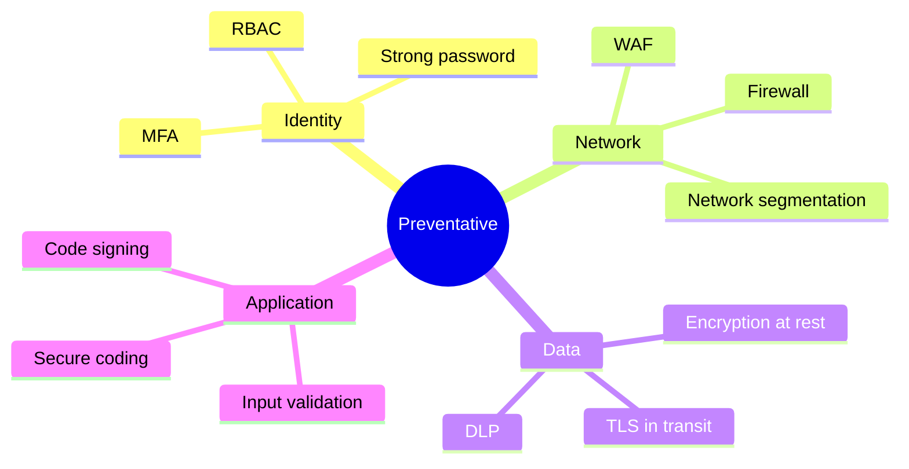

> **Note:** Preventative controls attack ঘটার আগেই আটকানোর জন্য design করা। CCTV আর Alarm "Detective" controls কারণ এগুলো বলে attack হচ্ছে বা হয়ে গেছে — আটকায় না।

---

## 🎯 Question 56: Buffer Overflow

> **Question:** "Buffer Overflow" বলতে কী বোঝায়?

- A) Bank-এর lobby-তে অনেক বেশি মানুষ ভিড় হওয়া।
- B) যখন একটা program memory block-এর capacity-র বেশি data write করে — যা system crash বা code execution-এর কারণ হয়। ✅
- C) Internet speed router-এর জন্য বেশি হয়ে যাওয়া।
- D) Database তার storage limit-এ পৌঁছানো।

**Solution: B) যখন একটা program memory block-এর capacity-র বেশি data write করে**

**ব্যাখ্যা:** **Buffer Overflow** হলো একটা classic memory corruption vulnerability, বিশেষ করে C/C++ application-এ যেখানে memory bounds check নেই।

**Visual Concept:**

```
Allocated Buffer (10 bytes):  [_|_|_|_|_|_|_|_|_|_]
User input (15 bytes):         "AAAAAAAAAAAAAA\xeb\xfe"
                                        ↓
After overflow:               [A|A|A|A|A|A|A|A|A|A] [A|A|A|A|\xeb|\xfe]
                              ↑ buffer ↑              ↑ adjacent memory
                                                     (return address overwritten)
```

Attacker carefully craft করে input দেয় যাতে **return address overwrite** হয় এবং program-এর execution flow attacker-এর shellcode-এ jump করে — full server takeover।

**Famous Examples:**
- Morris Worm (1988)
- Code Red (2001) — IIS buffer overflow
- Heartbleed (2014) — OpenSSL buffer over-read

**Defenses:**

| Defense | Description |
|---------|-------------|
| **Bounds checking** | `strncpy` instead of `strcpy` |
| **ASLR** | Address Space Layout Randomization |
| **DEP/NX bit** | Data Execution Prevention |
| **Stack canaries** | Compiler-inserted guard value |
| **Memory-safe languages** | Rust, Go, Java, C# |

> **Note:** যদি attacker buffer overflow করতে পারে, সে computer-এর memory নিজের malicious instruction দিয়ে overwrite করতে পারে — potentially server-এর full control নিয়ে নেয়।

---

## 🎯 Question 57: Digital Forensics

> **Question:** "Digital Forensics" বলতে কী বোঝায়?

- A) Digital banking-এর ভবিষ্যৎ predict করা।
- B) Court of law-এ ব্যবহারের জন্য electronic data uncover এবং interpret করার process। ✅
- C) Banking app-এর জন্য নতুন graphics design করা।
- D) Branch-এ computer-এর সংখ্যা গণনা করা।

**Solution: B) Court of law-এ ব্যবহারের জন্য electronic data uncover এবং interpret করার process**

**ব্যাখ্যা:** **Digital Forensics** = digital evidence-কে এমনভাবে collect, preserve, analyze, এবং present করা যাতে সেটা court-এ admissible হয়।

**Key Process — Chain of Custody:**

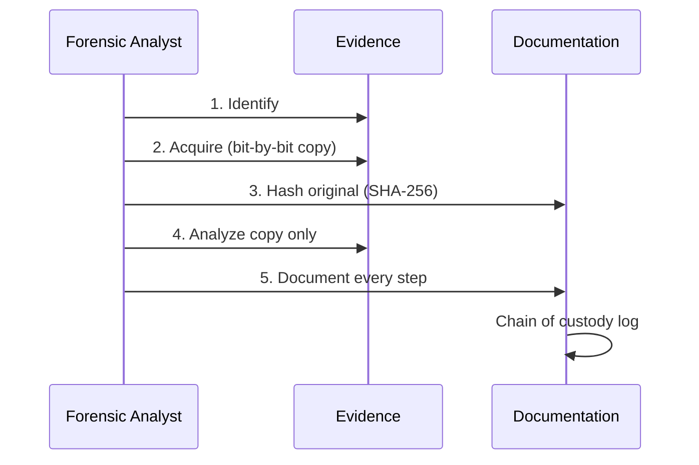

**Banking Forensics Use Cases:**

| Scenario | Forensic Goal |
|----------|---------------|
| Insider fraud | কে কখন কোন record access করেছে |
| ATM skimming | Malware sample, attacker IP trace |
| Account takeover | Login pattern, IP geolocation |
| Data breach | Exfiltration path, scope of leak |

**Critical Rules:**
- **Never work on original** — always bit-level forensic image
- **Hash before & after** — prove no tampering
- **Document everything** — who, what, when, where, why

> **Note:** Banking-এ forensics ব্যবহৃত হয় heist বা breach-এর পর attacker-এর path trace করতে, stolen data identify করতে, এবং strict Chain of Custody দিয়ে evidence preserve করতে।

---

## 🎯 Question 58: Behavioral Biometrics

> **Question:** কোনটি "Behavioral" biometric factor?

- A) Fingerprint scan।
- B) Retinal scan।
- C) Keystroke dynamics (কত দ্রুত/জোরে type করছেন)। ✅
- D) Facial recognition।

**Solution: C) Keystroke dynamics (কত দ্রুত/জোরে type করছেন)**

**ব্যাখ্যা:** Biometrics দুই category:

| Type | What it measures | Examples |
|------|------------------|----------|
| **Physical (Static)** | শরীরের feature | Fingerprint, Face, Iris, Retina, DNA, Palm vein |
| **Behavioral (Dynamic)** | Action-এর pattern | Keystroke dynamics, Mouse movement, Gait, Voice rhythm, Signature pressure |

**Behavioral Biometrics in Banking:**

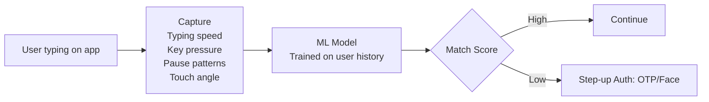

**Why banks love it:**
- **Continuous authentication** — শুধু login-এ না, পুরো session-এ verify
- **Frictionless** — user notice করে না
- **Hard to spoof** — fingerprint copy সহজ, কিন্তু typing rhythm copy কঠিন
- **Detects ATO** — credentials চুরি হলেও typing pattern মিলবে না

> **Note:** Physical biometrics (A, B, D) শরীরের feature ব্যবহার করে। Behavioral biometrics action-এর pattern ব্যবহার করে — typing speed, gait, phone কীভাবে ধরছেন — identity verify করতে।

---

## 🎯 Question 59: Zero-Day Vulnerability

> **Question:** "Zero-Day Vulnerability" বলতে কী বোঝায়?

- A) এমন bug যা শূন্য দিন ধরে জানা।
- B) এমন vulnerability যা software vendor জানে কিন্তু এখনো patch হয়নি। ✅
- C) এমন vulnerability যা শূন্য damage করে।
- D) এমন security flaw যা শুধু মাসের প্রথম দিনে কাজ করে।

**Solution: B) এমন vulnerability যা software vendor জানে কিন্তু এখনো patch হয়নি**

**ব্যাখ্যা:** **Zero-Day** নাম এসেছে কারণ vendor-এর হাতে fix করার জন্য **"০ দিন"** আছে — মানে বের হওয়ার সাথে সাথেই attacker exploit শুরু করে।

**Vulnerability Lifecycle:**

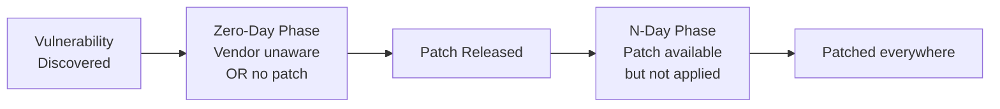

| Term | Meaning |
|------|---------|
| **0-Day** | Patch available নাই, attack-ই hidden থাকে |
| **N-Day / 1-Day** | Patch released, কিন্তু সবাই apply করেনি |
| **Forever-Day** | Vendor patch দেবে না (EOL software) |

**Why Zero-Days are dangerous for banks:**
- Traditional **signature-based AV** এদের ধরতে পারে না
- **No CVE patch** available
- Attacker **highest value** targets-এ ব্যবহার করে

**Famous Zero-Days:**
- Stuxnet (2010) — multiple Windows zero-days
- EternalBlue (2017) — leaked NSA exploit → WannaCry
- Log4Shell (2021) — Apache Log4j

**Defense:**
- Behavior-based EDR (anomaly detection)
- Application sandboxing
- Network segmentation
- WAF with virtual patching
- Defense in depth

> **Note:** "Zero-Day" বলা হয় কারণ vendor-এর হাতে এটা fix করার জন্য "শূন্য দিন" আছে। Hacker-দের কাছে এগুলো very valuable কারণ traditional antivirus সাধারণত এই flaw exploit করা attack detect করতে পারে না।

---

## 🎯 Question 60: Business Continuity Planning (BCP)

> **Question:** "Business Continuity Planning" (BCP)-এর main goal কী?

- A) Bank-এর profit বাড়ানো।
- B) Disaster চলাকালীন এবং পরবর্তীতে bank operate করতে পারা ensure করা। ✅
- C) আরো employee hire করা।
- D) সব operation cloud-এ transition করা।

**Solution: B) Disaster চলাকালীন এবং পরবর্তীতে bank operate করতে পারা ensure করা**

**ব্যাখ্যা:** **BCP** focus করে **business operation continue রাখা**-র উপর — শুধু IT system না, পুরো organization কীভাবে চলবে তার plan।

**BCP vs DR — সবচেয়ে গুরুত্বপূর্ণ পার্থক্য:**

| Aspect | BCP | DR |
|--------|-----|-----|
| Scope | পুরো business | শুধু IT systems |
| Question | "How do we keep serving customers?" | "How do we restore servers?" |
| Example | Main branch flood হলে অন্য branch থেকে service | Primary data center down হলে DR site activate |
| Owner | Business + Risk team | IT/CISO team |
| Metric | Service Level | RTO, RPO |
| Includes | Communication, staff, supply chain | Backup, replication, failover |

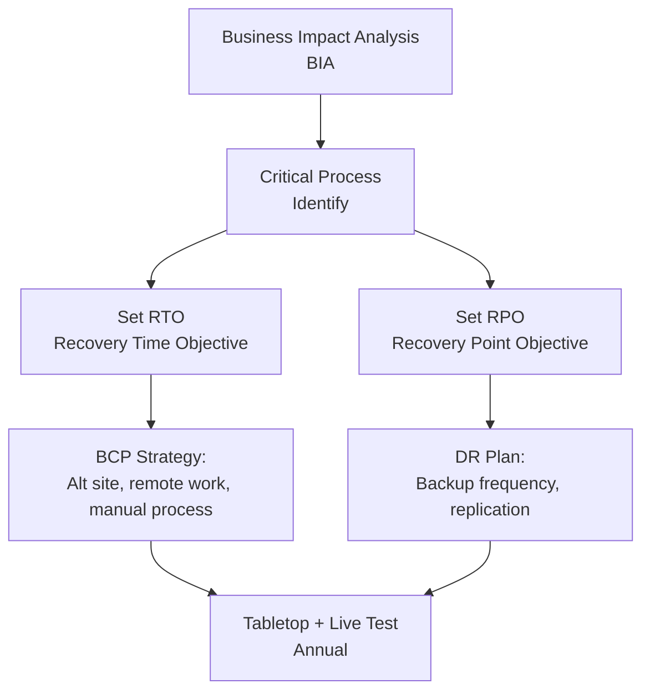

**Banking BCP Examples:**

| Disaster | BCP Action |
|----------|-----------|
| Main branch flood | Customer-কে nearby branch-এ redirect, mobile banking promote |
| Cyberattack on core banking | Manual ledger + offline transaction record |
| Pandemic (COVID-19) | Work from home enable, branch capacity reduce |
| Power grid failure | Diesel generator + UPS, satellite link |

**Key Metrics:**

| Metric | Meaning | Bank target |
|--------|---------|-------------|
| **RTO** (Recovery Time Objective) | কত সময়ে service restore | < 4 hours |
| **RPO** (Recovery Point Objective) | কত data loss tolerable | < 15 minutes |
| **MTD** (Maximum Tolerable Downtime) | এর বেশি down থাকলে bankrupt | 24 hours |

> **Note:** BCP business process-এর উপর focus করে (যেমন main branch flood হলে কীভাবে customer serve করব)। এটা "Disaster Recovery" (DR) থেকে আলাদা, যা IT system restore-এর technical দিকে focus করে।

---

## 📋 Quick Recap Table

| Concept | Key fact |
|---------|----------|
| SQL Injection | Input field-এ malicious SQL inject — defense: Parameterized Queries |
| WAF | Layer 7 firewall — SQLi, XSS, CSRF block করে |
| Cloud Shared Responsibility | Provider = security OF cloud; Customer = security IN cloud |
| Penetration Testing | = Ethical Hacking — active break-in attempt with permission |
| Preventative Control | Attack-এর আগে আটকায় (Firewall, MFA, encryption) |
| Detective Control | Attack-এর সময়/পরে detect করে (CCTV, IDS, SIEM) |
| Buffer Overflow | Memory bound অতিক্রম করলে adjacent memory overwrite — RCE possible |
| Digital Forensics | Court-ready electronic evidence — Chain of Custody critical |
| Behavioral Biometrics | Action pattern (typing, gait) — physical না |
| Zero-Day | Vendor patch নাই — AV সাধারণত ধরে না |
| BCP vs DR | BCP = business process; DR = IT systems restore |

---

## 🔁 Next Chapter

পরের chapter-এ **Cryptography & Advanced Protocols** — Symmetric vs Asymmetric Encryption, Digital Signature, PKI, TLS Handshake, HSM, এবং Quantum-resistant cryptography।

→ [Chapter 07: Cryptography & Advanced Protocols](07-cryptography-protocols.md)
