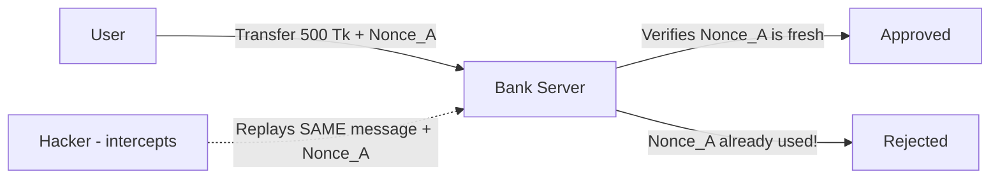
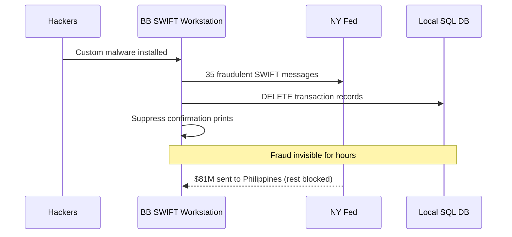

# Chapter 07 — Cryptography & Advanced Protocols 🔐

> Replay Attack, Nonce, Perfect Forward Secrecy (PFS), BOLA (API Security), SWIFT Malware-Informed Fraud, Homomorphic Encryption, Race Condition (TOCTOU), Side-Channel Attack, PKCE, Salted Pepper Hashing, Micro-segmentation — ১০টা advanced cryptography ও banking-protocol MCQ (Q61–Q70)।

---

## 📚 Concept Refresher (পড়ুন আগে)

### Replay Attack এবং Nonce — কীভাবে আটকানো হয়

**Replay Attack** = হ্যাকার একটা valid transaction message intercept করে এবং সেটা **আবার আবার পাঠায়** যেন legitimate user-এর মতো দেখায়। **Nonce (Number used once)** = প্রতিটি transaction-এ unique random value, যা একবার use হলে server reject করে দেয়।

### Cryptography Concepts — এক টেবিলে

| Concept | কী problem solve করে | Banking use case |
|---------|---------------------|------------------|
| **PFS (Perfect Forward Secrecy)** | Long-term private key compromise হলেও past sessions safe | TLS 1.3-এ ephemeral session key |
| **Homomorphic Encryption** | Encrypted data-র উপর computation, decrypt না করেই | Cloud-এ interest calculation, fraud analytics |
| **Salted Pepper Hashing** | Password DB leak হলেও offline brute-force কঠিন | Internet Banking password storage |
| **PKCE (Proof Key for Code Exchange)** | Mobile OAuth flow-এ authorization code চুরি ঠেকানো | bKash / Nagad app login via OAuth 2.0 |
| **Nonce** | Replay attack ঠেকানো | Per-transaction integrity |
| **Micro-segmentation** | Lateral movement আটকানো | Data center east-west traffic control |

### 2016 Bangladesh Bank Heist — Malware-Informed Fraud Steps

| Step | কী হয়েছিল |
|------|------------|
| 1. Initial Access | Phishing email → Bank network-এ malware install |
| 2. Reconnaissance | SWIFT Alliance Access workstation locate |
| 3. Credential Theft | Operator credentials সংগ্রহ |
| 4. Fraudulent Transfers | $951M-এর fake SWIFT messages NY Fed-এ পাঠানো |
| 5. Evidence Tampering | Local SQL DB থেকে records delete + print confirmation suppress |
| 6. Detection Delay | Weekend timing + printer manipulation = ৩ দিন পর ধরা পড়ে |

### TOCTOU (Race Condition) — সহজে

**Time-of-Check to Time-of-Use** = balance check করার সময় আর actual deduction-এর সময়ের মাঝে gap থাকলে, attacker সেই gap-এ multiple parallel withdrawal trigger করে balance-এর চেয়ে বেশি টাকা তুলে নেয়।

---

## 🎯 Question 61: Replay Attack এবং Nonce

> **Question:** "Replay Attack" বলতে কী বোঝায় এবং banks কীভাবে "Nonces" দিয়ে এটা prevent করে?

- A) Server-কে অতিরিক্ত traffic দিয়ে overwhelm করা
- B) একটা valid data transmission intercept করে original sender-এর মতো সেটা re-send করা ✅
- C) Dictionary দিয়ে password crack করা
- D) Physical hardware token চুরি করা

**Solution: B) একটা valid data transmission intercept করে original sender-এর মতো সেটা re-send করা**

**ব্যাখ্যা:** Banking-এ একজন hacker হয়তো "Transfer $500" message intercept করে সেটা ১০ বার replay করতে পারে। **Nonce (Number used once)** হলো প্রতিটি transaction-এ যোগ করা একটা unique, random value। Bank যদি এমন একটা Nonce-ওয়ালা transaction পায় যেটা ইতিমধ্যে process করা হয়েছে, সেটাকে replay হিসেবে reject করে দেয়।

> **Note:** Nonce একবার-ব্যবহারযোগ্য token হিসেবে কাজ করে। সাথে timestamp থাকলে আরও strong — purano message reuse কঠিন হয়ে যায়।

---

## 🎯 Question 62: Perfect Forward Secrecy (PFS)

> **Question:** কোন cryptographic concept ensure করে যে server-এর long-term Private Key compromise হলেও past session keys secure থাকবে?

- A) Symmetric Encryption
- B) Perfect Forward Secrecy (PFS) ✅
- C) Public Key Infrastructure (PKI)
- D) Hashing

**Solution: B) Perfect Forward Secrecy (PFS)**

**ব্যাখ্যা:** **PFS** প্রতিটি connection-এর জন্য আলাদা **unique session key** generate করে (সাধারণত Ephemeral Diffie-Hellman দিয়ে)। যেহেতু এই session keys server-এর master private key থেকে derive করা হয় না, একজন hacker যদি আজ master key চুরি করে, সে গত মাসের record-করা traffic decrypt করতে পারবে না।

> **Note:** TLS 1.3-এ PFS **mandatory**। Cipher suite-এ `ECDHE` থাকলে PFS active — `RSA key exchange` cipher PFS দেয় না।

---

## 🎯 Question 63: BOLA — API Security

> **Question:** API security-র #1 risk হিসেবে পরিচিত "BOLA" (Broken Object Level Authorization) কী?

- A) Data center-এ physical breach
- B) Attacker একটা API request-এর resource ID manipulate করে এমন data access করে যেটা তার নয় ✅
- C) Admin password-এ brute force attack
- D) Database object delete করা virus

**Solution: B) Attacker একটা API request-এর resource ID manipulate করে এমন data access করে যেটা তার নয়**

**ব্যাখ্যা:** API URL যদি হয় `bank.com/api/account/1001`, attacker সেটা change করে `1002` করতে পারে। Server যদি check না করে user আসলে account 1002-এর owner কিনা, সেটাই **BOLA vulnerability**। OWASP API Security Top 10-এ এটা #1 — কারণ developers সাধারণত authentication implement করে কিন্তু per-object authorization ভুলে যায়।

> **Note:** Defense = প্রতিটি API request-এ "ownership check" — `WHERE account_id = :id AND user_id = :current_user`। Indirect Object Reference / UUID ব্যবহার করলে guessing কঠিন হয়, কিন্তু authorization check-ই asol সমাধান।

---

## 🎯 Question 64: SWIFT Malware-Informed Fraud (BB Heist 2016)

> **Question:** ২০১৬ সালের Bangladesh Bank heist-এর context-এ SWIFT Alliance Access-এর "Malware-Informed Fraud" কী?

- A) সব bank customer-কে virus পাঠানো
- B) Local database modify করে fraudulent transaction messages লুকিয়ে রাখার জন্য malware ব্যবহার ✅
- C) Physical SWIFT terminals চুরি করা
- D) SWIFT network-এ DDoS attack

**Solution: B) Local database modify করে fraudulent transaction messages লুকিয়ে রাখার জন্য malware ব্যবহার**

**ব্যাখ্যা:** Hackers custom-built malware (`evtdiag.exe`) ব্যবহার করে bank-এর local SQL database থেকে record entries **delete** করেছিল এবং confirmation receipts-এর print commands **intercept** করেছিল। ফলে fraud কয়েক ঘণ্টা পর্যন্ত bank staff-এর কাছে invisible ছিল — আর সেটাই ছিল Heist-এর সবচেয়ে চতুর অংশ।

> **Note:** এই attack জানিয়েছে যে SWIFT terminal-কেও **air-gapped + integrity-monitored** রাখতে হবে। File integrity monitoring (FIM) থাকলে malware-এর modification ধরা পড়ত।

---

## 🎯 Question 65: Homomorphic Encryption

> **Question:** "Homomorphic Encryption" কী এবং কেন এটাকে Cloud Banking-এর future বলা হয়?

- A) প্রতি ঘণ্টায় key change করা encryption
- B) Encrypted data-এর উপর mathematical operations perform করার system, প্রথমে decrypt না করেই ✅
- C) শুধু home banking apps-এ ব্যবহৃত encryption
- D) Image-এর ভেতরে data hide করার method

**Solution: B) Encrypted data-এর উপর mathematical operations perform করার system, প্রথমে decrypt না করেই**

**ব্যাখ্যা:** এটা allow করে — bank cloud provider-কে encrypted data পাঠাবে analysis-এর জন্য (যেমন "Total interest calculate করো")। Cloud সেই scrambled data-র উপর math করে encrypted result return করে। ফলে cloud provider customer-এর raw numbers কখনোই দেখে না — **privacy + utility একসাথে**।

> **Note:** Real schemes — **Paillier** (additive), **BGV/BFV/CKKS** (fully homomorphic)। এখনো computationally expensive, কিন্তু regulated banking + cloud combine করতে গেলে এটাই ভবিষ্যৎ।

---

## 🎯 Question 66: TOCTOU — Race Condition

> **Question:** কোন attack "Time-of-Check to Time-of-Use" (TOCTOU) exploit করে?

- A) Phishing
- B) Race Condition ✅
- C) SQL Injection
- D) Social Engineering

**Solution: B) Race Condition**

**ব্যাখ্যা:** Banking-এ attacker দুইটা withdrawal এত দ্রুত একসাথে initiate করে যে system প্রথমটার balance check করার পর কিন্তু deduct করার আগেই দ্বিতীয়টার check ও পেয়ে যায়। ফলে দু'টোই approved হয়ে balance-এর চেয়ে বেশি টাকা তোলা সম্ভব হয়।

> **Note:** Defense = **atomic transactions + row-level locks** (`SELECT ... FOR UPDATE`)। বা **idempotency keys** + database-level constraints — যাতে check ও deduct একই atomic operation-এ থাকে।

---

## 🎯 Question 67: Side-Channel Attack (HSM)

> **Question:** HSM-এর context-এ "Side-Channel Attack" কী?

- A) Bank-এর social media channels attack করা
- B) Power consumption, heat, বা electromagnetic leak-এর মতো physical outputs measure করে information চুরি করা ✅
- C) Side door দিয়ে bank hack করা
- D) IT department-কে fake email পাঠানো

**Solution: B) Power consumption, heat, বা electromagnetic leak-এর মতো physical outputs measure করে information চুরি করা**

**ব্যাখ্যা:** Hackers কখনো cryptographic key "see" করতে পারে — math operation চলাকালীন processor কতটা electricity ব্যবহার করছে সেটা measure করে। উদাহরণ: **DPA (Differential Power Analysis)**, **timing attack**, **EM emanation analysis**। High-end **HSM (Hardware Security Module)** এজন্য shielded ও power-noise-injected থাকে যাতে এই leaks prevent হয়।

> **Note:** FIPS 140-2 Level 3/4 certification মূলত side-channel resistance + physical tamper detection guarantee করে — banking HSM কেনার সময় এটাই check করতে হয়।

---

## 🎯 Question 68: PKCE — Mobile Banking OAuth

> **Question:** "PKCE" (Proof Key for Code Exchange) কী এবং কেন mobile banking-এ এটা mandatory?

- A) এটা password-এর replacement
- B) OAuth 2.0-এর একটা security extension যা mobile apps-এ authorization code interception prevent করে ✅
- C) Phone-এ plug করা physical key
- D) Phone storage encrypt করার উপায়

**Solution: B) OAuth 2.0-এর একটা security extension যা mobile apps-এ authorization code interception prevent করে**

**ব্যাখ্যা:** Mobile devices-এ malicious apps মাঝে মাঝে অন্য app-এর জন্য intended URLs "sniff" করতে পারে (custom URL scheme hijacking)। PKCE নিশ্চিত করে — যে app login process **শুরু** করেছে শুধু সেই app **শেষ** করতে পারবে, এজন্য সে on-the-fly একটা unique secret (`code_verifier` + `code_challenge`) তৈরি করে।

> **Note:** Flow: app `code_challenge = SHA256(code_verifier)` পাঠায় auth request-এ। Token exchange-এ original `code_verifier` পাঠাতে হয়। মাঝপথে কেউ auth code চুরি করলেও verifier ছাড়া token পাবে না।

---

## 🎯 Question 69: Salted Pepper Hashing

> **Question:** "Salted Pepper" Hashing কী?

- A) Bank cafeteria food-এর recipe
- B) Password hash করার আগে একটা "Salt" (DB-তে stored) এবং একটা "Pepper" (code/HSM-এ stored) যোগ করা ✅
- C) Database-কে দুইটা key দিয়ে encrypt করা
- D) Hashing দ্রুত করার একটা উপায়

**Solution: B) Password hash করার আগে একটা "Salt" (DB-তে stored) এবং একটা "Pepper" (code/HSM-এ stored) যোগ করা**

**ব্যাখ্যা:**
- **Salt** = প্রতিটি user-এর জন্য unique random value, password-এর সাথে DB-তে store হয় → rainbow table attack prevent।
- **Pepper** = একটা **global secret**, application code বা HSM-এ store হয়, **DB-তে নয়** → DB leak হলেও hacker pepper পাবে না।

Hacker যদি database চুরি করে, সে salts পাবে কিন্তু **Pepper পাবে না**। Pepper ছাড়া passwords-এর উপর offline brute-force attack চালানো প্রায় অসম্ভব।

> **Note:** Modern formula — `bcrypt(password + pepper, salt)` বা `argon2id(password, salt, secret=pepper)`। Pepper rotation strategy + HSM storage = bank-grade password security।

---

## 🎯 Question 70: Micro-segmentation

> **Question:** Data Center-এ "Micro-segmentation"-এর primary goal কী?

- A) Servers-কে আকারে ছোট করা
- B) Individual workloads-এ security policies apply করে "Lateral Movement" সীমিত করা ✅
- C) Office-কে ছোট ছোট cubicles-এ ভাগ করা
- D) Routers-এর সংখ্যা বাড়ানো

**Solution: B) Individual workloads-এ security policies apply করে "Lateral Movement" সীমিত করা**

**ব্যাখ্যা:** Traditional network-এ একবার "in" হলে সব দেখা যায় (flat east-west traffic)। **Micro-segmentation**-এর সাথে, attacker যদি Web Server hack ও করে, তবু সে Database Server-এ পৌঁছাতে পারবে না — কারণ একটা policy বলে দেবে "Web Server শুধু Database-এ Port 1433-এ talk করতে পারবে, আর কিছু না"।

> **Note:** এটাই **Zero Trust**-এর core principle। Tools — VMware NSX, Cisco ACI, Illumio, Cloud-native (AWS Security Groups + NACL combination)। WannaCry-র মতো wormable attacks-এর সবচেয়ে ভালো defense।

---

## 📋 Quick Recap Table

| Concept | Key fact |
|---------|----------|
| Replay Attack | Valid message intercept করে re-send |
| Nonce | একবার-ব্যবহারযোগ্য random value, replay block |
| Perfect Forward Secrecy | Past sessions safe, even if master key leaks |
| BOLA | API resource ID manipulation = #1 API risk |
| BB Heist Malware | Local SQL DB modify + print command suppress |
| Homomorphic Encryption | Encrypted data-র উপর computation |
| Race Condition / TOCTOU | Check ও use-এর মাঝে timing gap exploit |
| Side-Channel Attack | Power / heat / EM leak থেকে key চুরি |
| PKCE | Mobile OAuth code interception prevent |
| Salted Pepper | Salt (DB) + Pepper (HSM) — DB leak-এও safe |
| Micro-segmentation | Lateral movement block, Zero Trust core |

---

## 🔁 Next Chapter

পরের chapter-এ **Emerging Threats & Expert Protocols** — OAuth Scopes, Byzantine Generals Problem (Blockchain), DNSSEC, Bluesnarfing, Degaussing, Synthetic Identity / Deepfake e-KYC, IRM, Evil Twin, Wormable Malware, Key Escrow।

→ [Chapter 08: Emerging Threats & Expert Protocols](08-emerging-threats-protocols.md)
