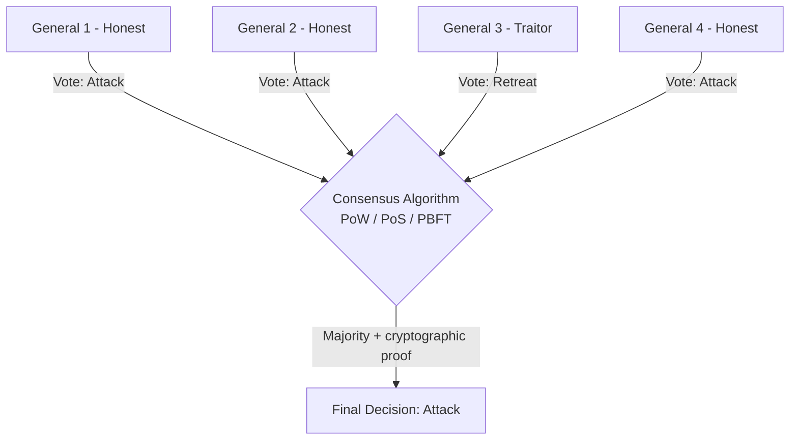
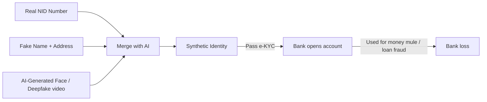

# Chapter 08 — Emerging Threats & Expert Protocols 🛡️

> OAuth 2.0 Scopes, Byzantine Generals Problem (Blockchain consensus), DNSSEC, Bluesnarfing, Degaussing, Synthetic / Deepfake Identity (e-KYC 2026), Information Rights Management (IRM), Evil Twin Wi-Fi, Wormable Malware, Key Escrow — ১০টা emerging-threat ও expert-protocol MCQ (Q71–Q80)।

---

## 📚 Concept Refresher (পড়ুন আগে)

### Wireless ও Endpoint Attack Types — তুলনা

| Attack | Medium | কীভাবে কাজ করে | Primary Defense |
|--------|--------|-----------------|------------------|
| **Bluesnarfing** | Bluetooth | Discoverable Bluetooth device থেকে contacts/messages চুরি | Bluetooth off / non-discoverable, latest patches |
| **Evil Twin** | Wi-Fi | একই SSID-এর fake AP তৈরি করে credential intercept | VPN, certificate-based EAP-TLS, user awareness |
| **Wormable Malware** | Network (SMB/RDP) | এক computer থেকে আরেকটায় auto-spread, কোনো user click লাগে না | Patching, **Micro-segmentation**, EDR |
| **Bluejacking** | Bluetooth | Unsolicited messages পাঠানো (mostly nuisance) | Visibility off |

### Byzantine Generals Problem — Blockchain Consensus

**Problem:** কয়েকটা generals (nodes) আলাদা জায়গায় বসে আছে। কেউ honest, কেউ traitor (malicious)। সবাই কীভাবে একই decision-এ আসবে?

**Blockchain-এ solution** = **consensus algorithms** (Proof of Work, Proof of Stake, PBFT) — যাতে কয়েকটা node cheat করলেও ledger accurate থাকে। Banking blockchain (Hyperledger Fabric, R3 Corda) এই principle-এর উপর দাঁড়িয়ে আছে।

### Key Management & Data Integrity Concepts

| Concept | Purpose | Banking use case |
|---------|---------|------------------|
| **Key Escrow** | Cryptographic keys একটা trusted third party-র কাছে রাখা যাতে দরকারে recover করা যায় | Master backup-key recovery, regulatory subpoena response |
| **IRM (Information Rights Management)** | File-এর ভেতরেই access control embed করা — file যেখানেই যাক, control থাকবে | Confidential audit reports — wrong recipient হলেও open হবে না |
| **DNSSEC** | DNS records-এ digital signature যোগ করে authenticity guarantee করা | `bangladesh-bank.org.bd` IP spoof / cache poisoning prevent |
| **Degaussing** | Strong magnetic field দিয়ে magnetic media থেকে data fully erase | Decommissioned bank server hard drive disposal |

### Synthetic Identity Fraud (2026 e-KYC) — কেন এটা দ্রুত বাড়ছে

---

## 🎯 Question 71: OAuth 2.0 Scopes

> **Question:** "OAuth 2.0 Scopes" কী?

- A) Security cameras-এ ব্যবহৃত lens
- B) একটা mechanism যা একটা application-এর user account access সীমিত করে (যেমন "Read-only" vs "Write") ✅
- C) Wi-Fi signal-এর physical range
- D) Code errors দেখার tool

**Solution: B) একটা mechanism যা একটা application-এর user account access সীমিত করে**

**ব্যাখ্যা:** **Scopes** prevent করে যে একটা app বেশি কিছু করতে পারবে। যেমন একটা "Balance Checker" app-এর শুধু `balance.read` scope থাকা উচিত, **কখনোই** `payment.write` না। User consent screen-এ "এই app আপনার balance দেখতে চাইছে" — এই text-ই আসছে scopes থেকে।

> **Note:** Principle of **Least Privilege** OAuth-এ scopes দিয়েই enforce হয়। Open Banking (PSD2, Bangladesh Bank Open API guidelines) scopes-কে mandatory করেছে — যাতে third-party apps শুধু necessary data পায়।

---

## 🎯 Question 72: Byzantine Generals Problem

> **Question:** Blockchain-based banking-এ "Byzantine Generals Problem" কী?

- A) একটা historical war strategy
- B) একটা distributed system-এ consensus reach করার challenge যখন কিছু nodes unreliable বা malicious হয় ✅
- C) Military-তে ব্যবহৃত একটা encryption type
- D) Slow internet speed-এর problem

**Solution: B) একটা distributed system-এ consensus reach করার challenge যখন কিছু nodes unreliable বা malicious হয়**

**ব্যাখ্যা:** Blockchain এই problem solve করে **consensus algorithms** দিয়ে — Proof of Work (PoW), Proof of Stake (PoS), PBFT — যাতে ledger accurate থাকে এমনকি যদি কিছু servers (nodes) cheat করার চেষ্টা করে। মূলত: যতক্ষণ পর্যন্ত malicious nodes < ১/৩ (PBFT-এ) বা < ৫১% hash power (PoW-এ), system safe।

> **Note:** Banking consortium blockchain-এ (Hyperledger Fabric, R3 Corda) সাধারণত **PBFT / Raft** ব্যবহার হয় — কারণ permissioned network-এ identity known, energy-hungry PoW দরকার নাই।

---

## 🎯 Question 73: DNSSEC

> **Question:** "DNSSEC" কী?

- A) Internet-এ দ্রুত search করার উপায়
- B) DNS-এ একটা security layer যোগ করা protocols যা "DNS Cache Poisoning" prevent করে ✅
- C) এক ধরনের firewall
- D) নতুন domain register করার উপায়

**Solution: B) DNS-এ security layer যোগ করা protocols যা DNS Cache Poisoning prevent করে**

**ব্যাখ্যা:** **DNSSEC** digital signatures (RRSIG records) ব্যবহার করে prove করে যে DNS record (যেমন `bangladesh-bank.org.bd`-এর IP address) **authentic** এবং কোনো **Pharming attacker** tamper করেনি। Resolver record receive করার পর signature verify করে — mismatch হলে reject।

> **Note:** Chain of trust — root → TLD → domain — প্রতিটি level signed। Banking domains DNSSEC enable করা mandatory হয়ে যাচ্ছে regulator-দের কাছ থেকে, কারণ pharming attack URL দেখতে identical থাকে।

---

## 🎯 Question 74: Bluesnarfing

> **Question:** "Bluesnarfing" কী?

- A) একটা cartoon character
- B) Bluetooth connection-এর মাধ্যমে wireless device থেকে unauthorized information access করা ✅
- C) এক ধরনের SQL Injection
- D) Networking-এ blue-colored cables ব্যবহার করা

**Solution: B) Bluetooth connection-এর মাধ্যমে wireless device থেকে unauthorized information access করা**

**ব্যাখ্যা:** Attackers contacts, messages, calendar entries এমনকি private files চুরি করতে পারে যদি bank branch-এর মতো public জায়গায় কারো Bluetooth "discoverable" mode-এ থাকে। OBEX protocol-এর পুরোনো vulnerabilities ব্যবহার করা হয়।

> **Note:** Defense — Bluetooth **Non-Discoverable** mode, regular firmware updates, এবং unknown pairing requests-কে reject। Bluesnarfing < Bluejacking severity-এ (Bluejacking just sends spam messages, Bluesnarfing actually steals data)।

---

## 🎯 Question 75: Degaussing

> **Question:** "Degaussing" কী?

- A) Server racks paint করার method
- B) Strong magnetic field ব্যবহার করে hard drives এবং magnetic tapes থেকে data সম্পূর্ণ erase করা ✅
- C) CPU-র power বাড়ানো
- D) Hidden microphones detect করার উপায়

**Solution: B) Strong magnetic field ব্যবহার করে hard drives এবং magnetic tapes থেকে data সম্পূর্ণ erase করা**

**ব্যাখ্যা:** Banking forensics এবং data disposal-এ degaussing ব্যবহৃত হয় ensure করতে যে discard করার আগে old hardware থেকে sensitive customer data **recover করা সম্ভব হবে না**। Degausser একটা powerful electromagnet — magnetic domains randomize করে দেয়, ফলে data unrecoverable।

> **Note:** **SSD-এর জন্য degaussing কাজ করে না** (no magnetic media)! SSD-এর জন্য **cryptographic erase** বা **physical shredding** দরকার। NIST SP 800-88-এ acceptable methods listed আছে।

---

## 🎯 Question 76: Synthetic / Deepfake Identity (2026 e-KYC)

> **Question:** ২০২৬-এর e-KYC landscape-এ "Synthesized" বা "Deepfake" identity কী?

- A) AI ব্যবহার করে real এবং fake data merge করে তৈরি একটা identity ✅
- B) কাগজের তৈরি একটা fake passport
- C) যমজ ভাইয়ের NID ব্যবহার করা
- D) Robot দিয়ে account খোলা

**Solution: A) AI ব্যবহার করে real এবং fake data merge করে তৈরি একটা identity**

**ব্যাখ্যা:** **Synthetic identity theft** এখন সবচেয়ে দ্রুত বাড়তে থাকা fraud type। Attackers একটা **real NID number** + একটা **fake name** + একটা **AI-generated face** combine করে একটা "Frankenstein" identity তৈরি করে যেটা credit bureaus নতুন legitimate customer হিসেবে accept করে নিতে পারে।

> **Note:** Defense — **liveness detection** (blink, head turn, depth sensing), **NID database real-time crosscheck**, **device fingerprinting**, এবং **behavioral biometrics**। শুধু video selfie + NID OCR যথেষ্ট নয় ২০২৬ সালে।

---

## 🎯 Question 77: Information Rights Management (IRM)

> **Question:** "Information Rights Management" (IRM) কী?

- A) প্রত্যেক নাগরিকের internet পাওয়ার অধিকার
- B) একটা technology যা file-এর ভেতরেই security embed করে sensitive information-কে unauthorized access থেকে protect করে ✅
- C) Public data-র উপর একটা আইন
- D) Bank documents organize করার উপায়

**Solution: B) একটা technology যা file-এর ভেতরেই security embed করে sensitive information-কে protect করে**

**ব্যাখ্যা:** এমনকি যদি একজন bank employee accidentally একটা confidential file ভুল ব্যক্তিকে email করে দেয়, **IRM** সেই ব্যক্তিকে file open, print, copy বা forward করতে দেবে না। Permissions file-এর সাথে travel করে — file যেখানেই যাক, control থাকবে। Microsoft Purview / Azure RMS, Adobe LiveCycle Rights Management — popular IRM solutions।

> **Note:** Time-based expiry (যেমন "file ৭ দিন পর auto-lock") এবং **revoke** (file already পাঠানো হয়ে গেলেও পরে access remove করা যায়) — IRM-এর সবচেয়ে powerful features।

---

## 🎯 Question 78: Evil Twin Attack

> **Question:** "Evil Twin" attack-এ attacker কী করছে?

- A) Bank manager-কে impersonate করছে
- B) একটা legitimate Wi-Fi access point-এর সাথে একই নামে fake Wi-Fi access point setup করে data চুরি করছে ✅
- C) User-এর biometric data চুরি করছে
- D) গোপনে দ্বিতীয় bank account তৈরি করছে

**Solution: B) একটা legitimate Wi-Fi access point-এর সাথে একই নামে fake Wi-Fi access point setup করে data চুরি করছে**

**ব্যাখ্যা:** যদি একটা bank branch-এ দুইটা "Bank_Guest_WiFi" network দেখা যায়, একটা হতে পারে **Evil Twin** যেটা signal strength বেশি দিয়ে users-দের attract করছে — connect করলেই **Man-in-the-Middle** attack-এর মাধ্যমে login credentials, OTP, session tokens সব intercept হবে।

> **Note:** Defense — **VPN always** when on public Wi-Fi, **certificate pinning** in mobile banking app, এবং user awareness ("Bank-এর Wi-Fi কখনো guest mode-এ confidential কাজ করবেন না")। Enterprise networks-এ **EAP-TLS + 802.1X** Evil Twin প্রায় impossible করে দেয়।

---

## 🎯 Question 79: Wormable Malware

> **Question:** "Wormable" Malware কী?

- A) Garden soil infect করে এমন malware
- B) Human intervention ছাড়াই এক computer থেকে আরেক computer-এ auto-spread করতে পারে এমন malware ✅
- C) শুধু slow computers-এ কাজ করে এমন malware
- D) ২৪ ঘণ্টা পর self-delete হয় এমন virus

**Solution: B) Human intervention ছাড়াই এক computer থেকে আরেক computer-এ auto-spread করতে পারে এমন malware**

**ব্যাখ্যা:** **WannaCry**-র মতো examples wormable vulnerabilities (EternalBlue / SMBv1 exploit) ব্যবহার করে কয়েক মিনিটের মধ্যে বিশ্বের হাজার হাজার bank computer infect করেছিল। কোনো click লাগে না, কোনো email open লাগে না — শুধু network-এ connected থাকলেই enough। **Micro-segmentation** এর বিরুদ্ধে best defense, কারণ এটা lateral spreading আটকায়।

> **Note:** Layered defense — (১) **Patch immediately** (WannaCry-র patch attack-এর ২ মাস আগেই available ছিল), (২) **disable legacy protocols** (SMBv1), (৩) **micro-segmentation**, (৪) **EDR with behavior-based detection**।

---

## 🎯 Question 80: Key Escrow

> **Question:** "Key Escrow" কী?

- A) একটা box-এ physical keys রাখা
- B) একটা arrangement যেখানে cryptographic keys একটা third party-র কাছে রাখা হয় যাতে দরকারে recover করা যায় ✅
- C) Keys দ্রুত generate করার উপায়
- D) একবার ব্যবহার-এর পর keys delete করা

**Solution: B) একটা arrangement যেখানে cryptographic keys একটা third party-র কাছে রাখা হয় যাতে দরকারে recover করা যায়**

**ব্যাখ্যা:** Large banks-এ যদি একজন admin backup system-এর master key হারিয়ে ফেলে, bank **Key Escrow service** (বা একটা **multi-signature vault** যেমন Shamir's Secret Sharing) ব্যবহার করে access recover করতে পারে। Regulator subpoena করলেও lawful access provide করা যায় escrow থেকে।

> **Note:** Trade-off — Key Escrow recovery দেয়, কিন্তু "third party trust" require করে। Modern alternative — **M-of-N threshold cryptography** (যেমন 3-of-5 board members একসাথে হলেই key reconstruct হবে), যাতে কোনো single party-কে trust করতে হয় না।

---

## 📋 Quick Recap Table

| Concept | Key fact |
|---------|----------|
| OAuth 2.0 Scopes | App-এর access সীমিত করার mechanism (read vs write) |
| Byzantine Generals Problem | Distributed consensus with malicious nodes — solved by PoW/PoS/PBFT |
| DNSSEC | DNS records-এ digital signature, cache poisoning prevent |
| Bluesnarfing | Bluetooth দিয়ে unauthorized data access |
| Degaussing | Magnetic erase — HDD/tape, **SSD-এ কাজ করে না** |
| Synthetic Identity | Real NID + Fake name + AI face = e-KYC bypass |
| IRM | File-এ embedded security, যেখানেই যাক control থাকে |
| Evil Twin | একই SSID-এর fake Wi-Fi AP, MitM attack |
| Wormable Malware | Auto-spread, no human click — WannaCry example |
| Key Escrow | Third-party key holding for recovery |

---

## 🔁 Next Chapter

পরের chapter-এ **Expert Attacks & Forensics** — advanced exploit techniques, digital forensics workflow, incident response, এবং banking-specific incident case studies।

→ [Chapter 09: Expert Attacks & Forensics](09-expert-attacks-forensics.md)
