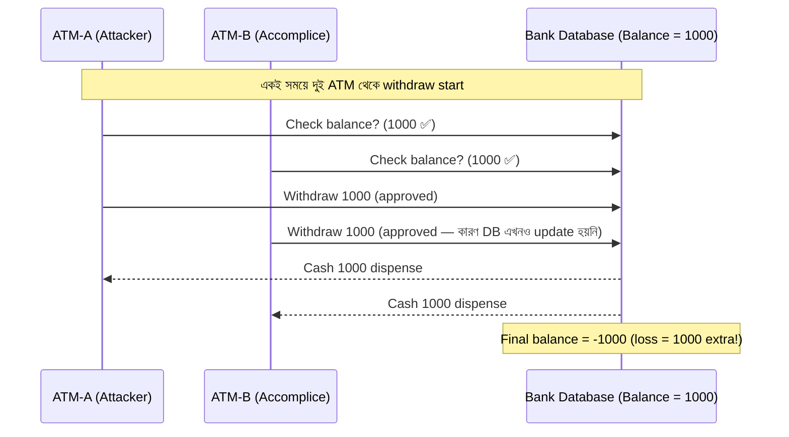
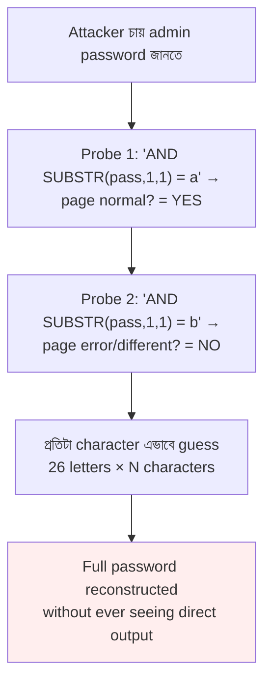
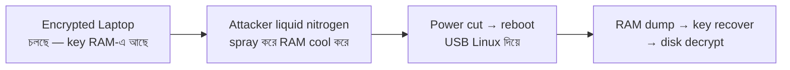

# Chapter 09 — Expert Attacks & Forensics 🕵️

> Race Condition, Steganography, Quantum-Resistant Crypto, Smurf Attack, Cold Boot Attack, Rainbow Table, Blind SQLi, IOC, Fuzzing, Polymorphic Malware — ১০টা advanced-level attack ও forensics MCQ।

---

## 📚 Concept Refresher (পড়ুন আগে)

### Race Condition — ATM-এ কীভাবে double withdrawal হয়

মূল সমস্যা = **Time-of-Check vs Time-of-Use (TOCTOU)** gap। দুই transaction একসাথে check পেরিয়ে যায়, কেউ তখনও balance update করেনি।

**Defense:** Database-এ **Atomic Transaction + Row-level Lock**, অথবা **Pessimistic Locking** — balance check ও deduct একই lock-এর মধ্যে হবে।

### Advanced Attack Cheat Table

| Attack | Mechanism | Defense |
|--------|-----------|---------|
| **Rainbow Table** | Pre-computed hash → password lookup | **Salting** + slow hash (bcrypt/Argon2) |
| **Cold Boot Attack** | RAM cool করে dump → encryption key recover | Full-disk encryption with TPM, RAM scrubbing on shutdown |
| **Steganography** | Image/audio-এর ভেতর hidden file embed | DLP with deep content inspection, entropy analysis |
| **Fuzzing** | Random/malformed input → crash খোঁজা | Input validation, ASLR, DEP, sandboxing |
| **Polymorphic Malware** | প্রতি copy-তে code mutation → signature mismatch | Behavior-based EDR, heuristic AV, sandbox detonation |
| **Blind SQLi** | True/False probe → bit-by-bit data leak | Parameterized queries, generic error pages, WAF |
| **Smurf Attack** | Spoofed ICMP → broadcast → amplified flood | Disable directed broadcast, ingress filtering (BCP38) |

### Blind SQL Injection — Bit-by-bit data extraction

Server কোনো data **return করে না**, কিন্তু response-এর **পার্থক্য** (load time, status code, page length) থেকে attacker bit-by-bit সব বের করে আনে।

### Cold Boot Attack — RAM-এর memory remanence

RAM-এর data power cut-এর পরেও কয়েক সেকেন্ড থেকে কয়েক মিনিট থাকে। ঠান্ডা করলে আরও বেশি সময় থাকে।

---

## 🎯 Question 81: ATM-এ Race Condition

> **Question:** Automated Teller Machine (ATM) withdrawal-এর context-এ "Race Condition" বলতে কী বোঝায়?

- A) দুই user একই ATM booth-এর জন্য প্রতিযোগিতা করছে
- B) Attacker একসাথে একাধিক near-simultaneous transaction শুরু করে available balance-এর চেয়ে বেশি টাকা তোলে — system update হওয়ার আগেই ✅
- C) Hardware failure-এ টাকা dispenser-এ আটকে যায়
- D) Network speed database-এর process speed-এর চেয়ে বেশি

**Solution: B) Attacker একসাথে একাধিক near-simultaneous transaction শুরু করে available balance-এর চেয়ে বেশি টাকা তোলে — system update হওয়ার আগেই**

**ব্যাখ্যা:** এটা একটা classic **TOCTOU (Time-of-Check to Time-of-Use)** vulnerability। Account-এ ১০০০ টাকা আছে। Attacker দুই ATM থেকে একই সময়ে withdraw চালায় — দুটোই balance check পার করে (কারণ database এখনও কোনোটা deduct করেনি), দুটোই ১০০০ করে dispense করে। মোট ২০০০ টাকা গেলো, balance হলো -১০০০।

> **Note:** Banking software-এ developer-কে অবশ্যই **Atomic Transaction** বা **Row-level Lock** ব্যবহার করতে হবে — যাতে একবার balance check শুরু হলে সেই লেনদেন complete না হওয়া পর্যন্ত একই account-এ অন্য কোনো transaction শুরু না হয়।

---

## 🎯 Question 82: Steganography আর Data Exfiltration

> **Question:** "Steganography" কী এবং data exfiltration-এ এটা কীভাবে ব্যবহৃত হয়?

- A) Hard drive-কে physically destroy করার method
- B) একটা secret message বা file-কে অন্য একটা innocent file (image বা audio)-এর ভেতর hide করার practice ✅
- C) একটা type-এর firewall যা specific port block করে
- D) Corrupted disk থেকে deleted file recover করার process

**Solution: B) একটা secret message বা file-কে অন্য একটা innocent file (image বা audio)-এর ভেতর hide করার practice**

**ব্যাখ্যা:** Steganography মানে = "covered writing"। Hacker একটা সাধারণ `holiday.jpg`-এর pixel-এর LSB (Least Significant Bit)-গুলোতে customer database-এর data embed করে দেয়। বাইরে থেকে দেখলে normal ছবি, কিন্তু ভেতরে হাজারো record লুকানো।

> **Note:** Bank-এ hacker steganography ব্যবহার করে **DLP (Data Loss Prevention)** system bypass করে। DLP দেখে — "এটা তো শুধু একটা ছবি email করছে", তাই block করে না। কিন্তু সেই ছবির ভেতর কাস্টমার লিস্ট পুরো পাচার হয়ে গেছে। Defense: entropy analysis ও deep content inspection।

---

## 🎯 Question 83: Quantum-Resistant Cryptography

> **Question:** "Quantum-Resistant Cryptography" (Post-Quantum Cryptography) বলতে কী বোঝায়?

- A) যে cryptography very small numbers ব্যবহার করে
- B) Future quantum computer-এর processing power-এর বিরুদ্ধে secure থাকার জন্য design করা algorithm ✅
- C) Mobile phone-এ data encrypt করার একটা faster way
- D) যে encryption-এ একটা special physical key লাগে

**Solution: B) Future quantum computer-এর processing power-এর বিরুদ্ধে secure থাকার জন্য design করা algorithm**

**ব্যাখ্যা:** বর্তমানের RSA, ECC encryption-এর security নির্ভর করে — large number factor করা বা discrete logarithm solve করা classical computer-এর জন্য practically impossible। কিন্তু **Shor's Algorithm** চালালে একটা quantum computer এই math গুলো সেকেন্ডের মধ্যে solve করে ফেলবে।

> **Note:** Bank-গুলো এখন **Lattice-based** (CRYSTALS-Kyber, Dilithium), **Code-based** (McEliece), বা **Hash-based** signature নিয়ে গবেষণা করছে। NIST 2024-এ post-quantum standard publish করেছে; ২০৩০-এর মধ্যে পুরো banking infrastructure migrate করার plan আছে।

---

## 🎯 Question 84: Smurf Attack

> **Question:** "Smurf Attack" কী?

- A) ছোট অনেক device দিয়ে চালানো attack
- B) একটা DDoS attack যেখানে hacker spoofed source IP দিয়ে network-এর broadcast address-এ অনেক ICMP echo request (ping) পাঠায় ✅
- C) অনেক account থেকে অল্প অল্প করে টাকা চুরি
- D) Bank-এর internal chat system hack করা

**Solution: B) একটা DDoS attack যেখানে hacker spoofed source IP দিয়ে network-এর broadcast address-এ অনেক ICMP echo request (ping) পাঠায়**

**ব্যাখ্যা:** Spoofed source IP = victim-এর IP। Attacker `255.255.255.255` (broadcast)-এ ping পাঠালে network-এর সব device সেই victim-কে reply দেয়। ১টা request → ২৫৫টা reply → **amplification ratio = ২৫৫:১**। Victim-এর bandwidth instantly শেষ।

> **Note:** এটা একটা **Amplification + Reflection** attack। Defense — RFC 2644 অনুযায়ী directed broadcast disable করা, এবং BCP38 ingress filtering করে spoofed source IP block করা। আজকাল Smurf rare, কিন্তু DNS amplification, NTP amplification এই principle-এই চলে।

---

## 🎯 Question 85: Cold Boot Attack

> **Question:** "Cold Boot Attack" কী?

- A) শীতের সময় server-এ attack চালানো
- B) Computer-এর RAM physically cool করে এবং reboot করে cryptographic key retrieve করা ✅
- C) যে virus computer চালু হওয়ার সাথে সাথে কাজ শুরু করে
- D) Bank-এর cooling system-এ একটা physical attack

**Solution: B) Computer-এর RAM physically cool করে এবং reboot করে cryptographic key retrieve করা**

**ব্যাখ্যা:** RAM-এর data power off হলেই সাথে সাথে মুছে যায় না — কয়েক সেকেন্ড ধরে fade হয় (memory remanence)। Liquid nitrogen বা compressed air দিয়ে RAM chip ঠান্ডা করলে fade time কয়েক মিনিট পর্যন্ত যায়। তখন RAM খুলে অন্য machine-এ লাগিয়ে BitLocker / FileVault-এর encryption key dump করা যায়।

> **Note:** Defense — TPM-এ key store করা (RAM-এ pure form-এ থাকবে না), system shutdown-এ RAM scrub করা, এবং bank laptop-এ unattended রেখে চলে যাওয়া বন্ধ করা। যেকোনো physical access = cold boot risk।

---

## 🎯 Question 86: Rainbow Table

> **Question:** "Rainbow Table" কী?

- A) Bank performance দেখানোর একটা colorful chart
- B) Cryptographic hash function reverse করার pre-computed table — সাধারণত password hash crack করতে ✅
- C) Authorized IP address-এর list
- D) Database table organize করার একটা method

**Solution: B) Cryptographic hash function reverse করার pre-computed table — সাধারণত password hash crack করতে**

**ব্যাখ্যা:** Hash function one-way — password → hash সহজ, কিন্তু hash → password reverse করা কঠিন। Rainbow table-এ আগে থেকেই কোটি কোটি common password-এর hash calculate করে রাখা থাকে। Hacker একটা leaked hash পেলে শুধু table-এ lookup করে instant password পেয়ে যায়।

> **Note:** তাই **Salting** mandatory — প্রতিটা user-এর password-এর সাথে random unique string mix করে hash করা হয়। তখন একই password-এর জন্যও আলাদা আলাদা hash তৈরি হয় → pre-computed rainbow table পুরোপুরি useless হয়ে যায়। আধুনিক bank-এ bcrypt/Argon2 ব্যবহার হয় যা slow + auto-salted।

---

## 🎯 Question 87: Blind SQL Injection

> **Question:** "Blind SQL Injection" কী?

- A) Visual impairment আছে এমন কেউ যে attack চালায়
- B) এমন SQLi attack যেখানে server সরাসরি data return করে না, তাই attacker "True/False" question করে data বিট-বাই-বিট extract করে ✅
- C) Database-এ একটা DDoS attack
- D) Type করার সময় ভুলে database table delete করা

**Solution: B) এমন SQLi attack যেখানে server সরাসরি data return করে না, তাই attacker "True/False" question করে data বিট-বাই-বিট extract করে**

**ব্যাখ্যা:** Classic SQLi-তে server `UNION SELECT` করলে data সরাসরি page-এ দেখা যায়। Blind SQLi-তে error suppress করা থাকে। Attacker probe পাঠায় — *"Does the admin password's first character = 'a'?"* — page normally load হলে = YES, error/different হলে = NO। এভাবে এক character এক character বের করে।

> **Note:** Time-based variant-ও আছে — `IF (condition, SLEEP(5), 0)` দিয়ে response time-এর পার্থক্য দেখে answer infer করা হয়। Defense সবসময় = **Parameterized queries / Prepared statements**, কখনো user input SQL string-এ concatenate না করা।

---

## 🎯 Question 88: IOC (Indicator of Compromise)

> **Question:** Cybersecurity-এ "IOC" (Indicator of Compromise) মানে কী?

- A) Internal Operating System
- B) Digital evidence (specific IP, file hash, domain) যা নির্দেশ করে যে একটা system compromised হয়েছে ✅
- C) International Office of Cybersecurity
- D) Input-Output Controller

**Solution: B) Digital evidence (specific IP, file hash, domain) যা নির্দেশ করে যে একটা system compromised হয়েছে**

**ব্যাখ্যা:** IOC = "forensic breadcrumb"। Common IOC-এর examples — malicious file-এর MD5/SHA256 hash, attacker C2 server-এর IP, suspicious domain name, abnormal registry key, unusual outbound port।

> **Note:** Bangladesh Bank-এর FinCERT এবং globally সব SOC team নিজেদের মধ্যে IOC share করে — STIX/TAXII protocol-এ। একটা bank attacked হলে সেই attacker-এর IP/hash সব bank-কে instant জানানো হয় → বাকিরা সাথে সাথে block করে। Threat intelligence sharing-এর মূল শক্তি এটাই।

---

## 🎯 Question 89: Fuzzing (Fuzz Testing)

> **Question:** "Fuzzing" (Fuzz Testing) কী?

- A) Server থেকে ধুলো পরিষ্কার করা
- B) একটা automated software testing technique — invalid, unexpected, বা random data input হিসেবে দিয়ে দেখা ✅
- C) Wireless signal encrypt করার method
- D) Phone call দিয়ে user-এর কাছ থেকে password নেওয়া

**Solution: B) একটা automated software testing technique — invalid, unexpected, বা random data input হিসেবে দিয়ে দেখা**

**ব্যাখ্যা:** Fuzzer (যেমন AFL, libFuzzer) automatically হাজার হাজার weird input তৈরি করে — `AAAA...` ১০০০০ বার, negative number, null byte, Unicode garbage — সব দিয়ে দেখে application কোথায় crash করে। Crash মানে = সেখানে হয়তো **Buffer Overflow** বা **Memory Corruption** আছে যেটা hacker exploit করতে পারে।

> **Note:** Bank-এর internal API ও mobile banking app deploy-এর আগে অবশ্যই fuzz test হওয়া উচিত। Heartbleed (OpenSSL bug) fuzz testing দিয়েই ধরা পড়েছিল। DevSecOps pipeline-এ continuous fuzzing এখন standard practice।

---

## 🎯 Question 90: Polymorphic Malware

> **Question:** "Polymorphic Malware" কী?

- A) এমন malware যা multiple OS-এ infect করে
- B) এমন malware যা প্রতিবার নিজের code (signature) change করে — যাতে traditional antivirus detect করতে না পারে ✅
- C) এমন malware যা শুধু দিনের বেলা কাজ করে
- D) এমন virus যা specific patch দিয়ে cure করা যায়

**Solution: B) এমন malware যা প্রতিবার নিজের code (signature) change করে — যাতে traditional antivirus detect করতে না পারে**

**ব্যাখ্যা:** Polymorphic malware-এ একটা **mutation engine** থাকে — প্রতিবার যখন এটা নতুন একটা machine-এ replicate হয়, তখন নিজের binary-র encryption key + decryption stub পাল্টে ফেলে। Functionality একই, কিন্তু hash সম্পূর্ণ আলাদা। **Signature-based AV** যা fixed "fingerprint" খোঁজে — এর কাছে এটা সম্পূর্ণ নতুন file মনে হয়।

> **Note:** তাই bank-এ আজকাল **EDR (Endpoint Detection and Response)** ও **Behavioral / Heuristic detection** ব্যবহার হয় — file-এর "look" না দেখে "behavior" দেখে। যদি কোনো process registry modify করে, persistence install করে, C2 server-এ connect করে — block করা হয়, code যা-ই হোক। Metamorphic malware আরও advanced — পুরো logic-ই rewrite করে।

---

## 📋 Quick Recap Table

| Concept | Key fact |
|---------|----------|
| Race Condition (ATM) | TOCTOU gap → atomic txn + row lock দিয়ে fix |
| Steganography | Image/audio-এর ভেতর hidden data → DLP bypass |
| Post-Quantum Crypto | Lattice/Code-based — quantum computer-এও secure |
| Smurf Attack | Spoofed ICMP → broadcast → amplified DDoS |
| Cold Boot Attack | RAM cool করে memory remanence exploit |
| Rainbow Table | Pre-computed hash lookup → defense = Salting |
| Blind SQLi | True/False probe → bit-by-bit data leak |
| IOC | IP/hash/domain — compromise-এর evidence, share via STIX/TAXII |
| Fuzzing | Random input → crash hunt → buffer overflow detect |
| Polymorphic Malware | Self-mutating signature → behavioral EDR দিয়ে detect |

---

## 🔁 Next Chapter

পরের chapter-এ **AI Security & 2026 Compliance** — Prompt Injection, ABAC, AI Washing, BB Guidelines, Wiper Malware, DORA, Egress Exfiltration, Lattice Crypto, CSPM, Machine Identity Management।

→ [Chapter 10: AI Security & 2026 Compliance](10-ai-security-compliance.md)
