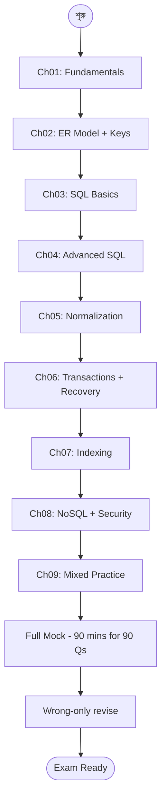

# DBMS MCQ Practice — Master Index 🗄️

> ৯০টা high-quality DBMS MCQ — Bangla-তে question, English/Bangla mix-এ option, Bangla-তে explanation। Bank IT, BCS Computer, NTRCA Computer/IT, university viva, GATE — যেকোনো IT exam-এর জন্য fast revision।

---

## 🎯 এই Practice Set কেন?

DBMS theory পড়ে শেষ করার পর প্রায় সবাই same problem-এ পড়ে — **প্রশ্ন দেখলে সঠিক answer বাছাই করতে পারি না।** কারণ পড়াশোনাটা passive ছিল — পড়েছি, কিন্তু "এই concept-টা কীভাবে question-এ আসবে" সেটা train করিনি।

এই 90-question set Gemini-র সাথে interactive Q&A session থেকে scrape করা — প্রতিটা প্রশ্ন **previous year exam pattern**-এর সাথে মিলিয়ে structured। প্রতিটা MCQ-এর সাথে:

- ✅ Correct option marked
- 🇧🇩 Bangla-তে concept-এর ব্যাখ্যা
- 💡 Hint (যেখানে available)
- 🔁 Topic-relevant note

---

## 📋 Exam-এ এই MCQ গুলো কোথায় কাজে লাগবে

| Exam | DBMS Weight | Coverage from this set |
|------|-------------|------------------------|
| **Bangladesh Bank Officer (IT) / AD (IT)** | 15-25% | Concurrency, SQL, Normalization full |
| **BCS Computer (Technical)** | প্রায় ১৫টা MCQ | ৬০-৭০% directly applicable |
| **NTRCA Computer/IT** | DBMS chapter | SQL + ER + Normalization পুরোটা |
| **University Final / Viva** | textbook chapter | Concept verification |
| **GATE CS / Online IT Job** | numerical + concept | Indexing + ACID + Recovery |

---

## 📚 Chapter Map

৯০টা MCQ topic অনুযায়ী ৯টা chapter-এ ভাগ করা — existing dbms course-এর সাথে parallel।

| # | Chapter | Topics | Q count |
|---|---------|--------|---------|
| 01 | [Fundamentals & Architecture](01-fundamentals-architecture.md) | DBMS definition, Schema vs Instance, Metadata, ACID basics, Relational Calculus, 2PC, Star/Snowflake Schema | 8 |
| 02 | [ER Model & Relational Concepts](02-er-relational-model.md) | Entity, Attribute, Relationship, Cardinality, Primary/Foreign/Candidate/Super/Composite Key | 20 |
| 03 | [SQL Basics — DDL, DML, DQL](03-sql-basics.md) | SELECT, INSERT, UPDATE, DELETE, WHERE, ORDER BY, DISTINCT, NULL handling, wildcards | 11 |
| 04 | [Advanced SQL — Joins, Aggregates, Subqueries](04-sql-advanced.md) | JOIN types, GROUP BY, HAVING, COUNT/SUM/AVG, subquery, VIEW, trigger | 10 |
| 05 | [Normalization & Functional Dependencies](05-normalization.md) | 1NF / 2NF / 3NF / BCNF, FD, transitive dependency, anomalies | 4 |
| 06 | [Transactions, Concurrency & Recovery](06-transactions-concurrency-recovery.md) | ACID, 2PL, Strict 2PL, deadlock, isolation levels, schedule, log, checkpoint, ARIES | 16 |
| 07 | [Indexing & Storage](07-indexing-storage.md) | B-tree, B+ tree, primary/secondary index, dense/sparse, hash, file org | 6 |
| 08 | [NoSQL, Distributed & Security](08-nosql-security.md) | CAP theorem, NoSQL types, sharding, GRANT/REVOKE, SQL injection | 3 |
| 09 | [Mixed Practice — Misc & Tricky](09-mixed-practice.md) | OLAP vs OLTP, data warehouse, BI, miscellaneous traps | 12 |

মোট প্রশ্ন: **90**

---

## 🛣️ Recommended Practice Sequence

---

## 🧠 Key Patterns Examiner-রা ভালোবাসেন

### 1. "Difference" comparison

> "WHERE clause এবং HAVING clause-এর মধ্যে প্রধান পার্থক্য কী?"

মুখস্থ punchline চাই: **"WHERE row-এর উপর কাজ করে (group আগে), HAVING group-এর উপর কাজ করে (group পরে)।"**

### 2. Acronym-expansion

> "DBMS-এর full form কোনটি?" → Database Management System
> "ACID-এর I-এ কী?" → Isolation
> "FK / PK / UK-এর difference?"

প্রতিটা acronym-এর full form + 1-line meaning মুখস্থ।

### 3. Numerical / Logical evaluation

> "একটি table-এর primary key যদি 5টি column-এর combination হয়, তাহলে কী বলা হয়?" → Composite Key

বা scheduling type — "এই schedule serializable হবে কি না?"

### 4. Concept-trap

> "B-tree এবং B+ tree-এর primary difference?" — leaf-এ data থাকে কোথায়?

দেখতে একই, কিন্তু internal structure আলাদা।

### 5. Standard SQL syntax

> "INSERT INTO Table VALUES (...)"

মুখস্থ syntax — প্রায়ই trap থাকে wrong syntax option হিসেবে।

---

## 🔑 Quick Reference Cheat Sheet

### ACID Properties

| Letter | Property | Mechanism |
|--------|----------|-----------|
| **A** | Atomicity | All-or-nothing (commit/rollback) |
| **C** | Consistency | DB state valid before + after txn |
| **I** | Isolation | Concurrent txns don't see each other's intermediate |
| **D** | Durability | Committed data persists (log + disk) |

### Key Types

| Key | কী |
|-----|-----|
| **Primary** | Unique + NOT NULL, only one per table |
| **Foreign** | References primary key of another table |
| **Candidate** | All columns that could be primary |
| **Super** | Any superset that uniquely identifies |
| **Composite** | Primary made of 2+ columns |
| **Alternate** | Candidate keys not chosen as primary |
| **Unique** | Unique but can be NULL |

### Normalization Forms

| Form | Removes |
|------|---------|
| **1NF** | Atomic values only (no multivalued) |
| **2NF** | Partial dependency on composite PK |
| **3NF** | Transitive dependency |
| **BCNF** | Every determinant must be a superkey |

### SQL Clauses Order (logical evaluation)

1. **FROM** — pick tables
2. **WHERE** — filter rows
3. **GROUP BY** — aggregate
4. **HAVING** — filter groups
5. **SELECT** — pick columns
6. **DISTINCT** — dedupe
7. **ORDER BY** — sort
8. **LIMIT** — cut

### Transaction Isolation Levels (lowest → highest)

| Level | Allowed Anomalies |
|-------|-------------------|
| Read Uncommitted | dirty + non-repeatable + phantom |
| Read Committed | non-repeatable + phantom |
| Repeatable Read | phantom |
| Serializable | none |

---

## ⚠️ Common Mistakes / Traps

1. **WHERE vs HAVING confusion** — group-এর আগে vs পরে। মনে রাখুন: **HAVING needs GROUP BY**।

2. **Primary Key vs Unique Key** — Primary one per table + NOT NULL; Unique multiple + NULL allowed।

3. **B-tree vs B+ tree** — B+ tree-তে সব data শুধু **leaf-এ** থাকে; B-tree-তে internal node-ও থাকে।

4. **3NF vs BCNF** — 3NF allows non-prime → super; BCNF strict — every determinant superkey।

5. **2PL doesn't prevent deadlock** — শুধু serializability ensure করে। Strict 2PL cascadeless দেয় কিন্তু deadlock-free না।

6. **Star vs Snowflake** — Star = denormalized (faster query); Snowflake = normalized (less space)।

7. **DELETE vs TRUNCATE vs DROP** — DELETE row-by-row + log; TRUNCATE all rows fast no-log; DROP entire table gone।

8. **`SELECT *` vs explicit columns** — `*` slow + brittle। Explicit always better in production।

---

## 📖 কীভাবে এই material ব্যবহার করবেন

### Round 1 — Solve cold

প্রতিটা chapter-এ যান, MCQ দেখে নিজে answer pick করুন (paper-এ লিখুন), তারপর correct match করুন। যেগুলো ভুল করেছেন highlight করুন।

### Round 2 — Wrong-only revise

শুধু আপনার ভুল হওয়া MCQ গুলো-র explanation আবার পড়ুন। এতে weak topic বেরিয়ে আসবে।

### Round 3 — Mock test (timed)

৯০টা MCQ এক বসায় ৯০ মিনিটে solve করুন (per Q ১ মিনিট)। ৭০+ মার্ক = exam-ready।

### Round 4 — Topic drill

যেই topic-এ সবচেয়ে বেশি ভুল করেছেন (যেমন Ch 02 ER, বা Ch 06 Transactions), সেই chapter-এর existing **dbms course chapter**-ও পড়ুন: [DBMS Course](/sections/dbms)।

---

## 🔗 External References

- **Database System Concepts** by Silberschatz, Korth, Sudarshan — bible textbook
- **Fundamentals of Database Systems** by Elmasri, Navathe — alternate
- **GeeksforGeeks DBMS section** — extra examples
- This site-এর full DBMS course: [DBMS (gated section)](/sections/dbms) — full theory chapter সহ

---

**শেষ কথা:** DBMS-এ সবচেয়ে বড় challenge হলো terminology + SQL syntax। ৯০টা MCQ একবার solve করলেই terminology-র সাথে mental relation তৈরি হবে। প্রতিটা ভুল answer একটা mental hook — সেই hook-গুলোই exam-এ correct উত্তর দিতে সাহায্য করবে।

> ✨ **Best of luck for your IT/Bank/BCS exam!** ✨
