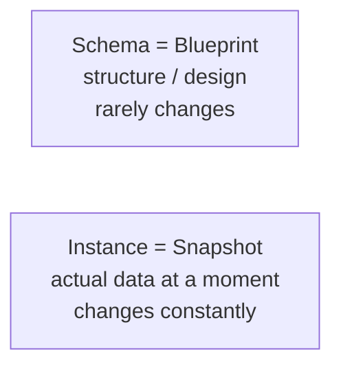
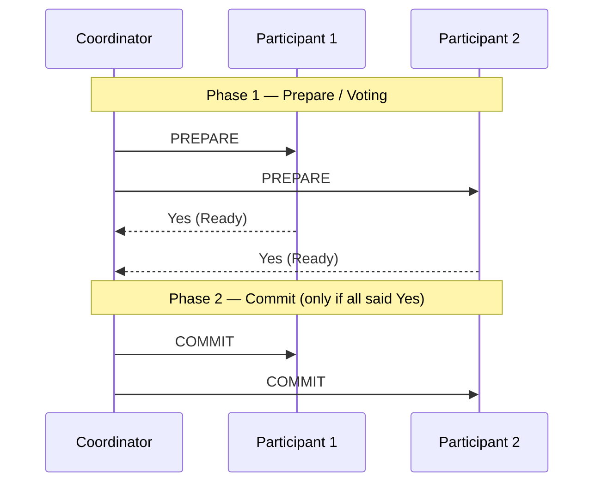
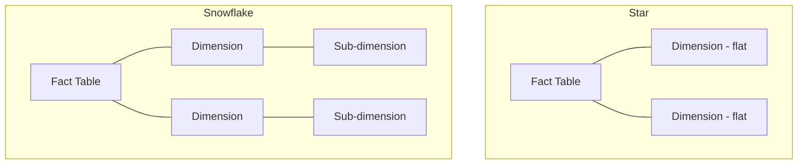

# Chapter 01 — DBMS Fundamentals & Architecture 🏛️

> DBMS-এর full form, Schema vs Instance, Metadata, Relational Calculus, ACID Isolation, Two-Phase Commit (2PC), Star/Snowflake Schema — ৮টা foundational MCQ।

---

## 📚 Concept Refresher (পড়ুন আগে)

### DBMS — কী এবং কেন

**DBMS (Database Management System)** = ডাটাবেজ create, manage, control করার একটা software system। উদাহরণ: MySQL, PostgreSQL, Oracle, MongoDB।

### Schema vs Instance



| | Schema | Instance |
|--|--------|----------|
| What | Logical structure (column names, types, constraints) | Actual rows at a given time |
| Changes | Rarely (DDL — ALTER) | Constantly (DML — INSERT/UPDATE/DELETE) |
| Analogy | Class definition | Object in memory |

### ACID Properties (revision)

| Letter | Property | Banking example |
|--------|----------|-----------------|
| **A** | Atomicity | Transfer = debit + credit, both succeed OR both fail |
| **C** | Consistency | Total balance unchanged across accounts |
| **I** | Isolation | Concurrent transfers don't see partial state |
| **D** | Durability | Once committed, survives crash/power loss |

### Relational Calculus vs Algebra

| | Relational Algebra | Relational Calculus |
|--|--------------------|---------------------|
| Type | **Procedural** (HOW to get data) | **Declarative** (WHAT data) |
| Operations | σ, π, ⋈, ∪, ∩, − | Logic predicates |
| SQL closer to | Algebra | Calculus |

### Two-Phase Commit (2PC) for Distributed Txns



যদি **কেউ একজন "No" বলে**, coordinator GLOBAL ABORT পাঠায় — পুরো txn rollback।

### Star vs Snowflake Schema (Data Warehouse)



| | Star | Snowflake |
|--|------|-----------|
| Dimension | **Denormalized** | **Normalized** |
| Storage | বেশি (redundancy) | কম |
| Query speed | Fast (less join) | Slower (more join) |
| Best for | OLAP, BI dashboards | Storage-constrained warehouse |

---

## 🎯 Question 1: ACID-এ Isolation কীভাবে ensure হয়?

> **Question:** ACID প্রপার্টির মধ্যে 'Isolation' নিশ্চিত করার জন্য DBMS মূলত কী ব্যবহার করে?

- A) Logging
- B) Locking ✅
- C) Normalization
- D) Indexing

**Solution: B) Locking**

**ব্যাখ্যা:** DBMS concurrent transaction-গুলোর মধ্যে isolation বজায় রাখতে বিভিন্ন **locking mechanism** (Shared lock, Exclusive lock, Two-Phase Locking ইত্যাদি) ব্যবহার করে।

> **Note:** Logging দরকার Durability এবং Recovery-র জন্য (separate concern)। Indexing speed-এর জন্য, Normalization data integrity-র জন্য — এগুলো Isolation-এর mechanism না।

---

## 🎯 Question 2: DBMS-এর full form

> **Question:** DBMS-এর পূর্ণরূপ কোনটি?

- A) Data Business Management System
- B) Data Backup Management System
- C) Database Model System
- D) Database Management System ✅

**Solution: D) Database Management System**

**ব্যাখ্যা:** DBMS হলো database তৈরি, পরিচালনা, এবং নিয়ন্ত্রণের একটি software system। উদাহরণ: MySQL, PostgreSQL, Oracle, SQL Server, MongoDB।

> **Easy mark question** — exam-এ দিলে বাঁচতে দেবেন না, এই ১ মার্ক certain।

---

## 🎯 Question 3: Logical structure কাকে বলে?

> **Question:** নিচের কোনটি ডাটাবেজের logical structure-কে নির্দেশ করে?

- A) Instance
- B) Query
- C) Data
- D) Schema ✅

**Solution: D) Schema**

**ব্যাখ্যা:** Database **Schema** হলো database-এর সম্পূর্ণ logical design বা **blueprint** — column names, types, constraints, relationships। সাধারণত এটা একবার design হলে rarely change হয়।

> **Trap:** "Instance" হলো একটা specific moment-এর actual data (changes constantly)। **Schema = static blueprint, Instance = dynamic data**।

---

## 🎯 Question 4: Metadata মানে কী?

> **Question:** একটি ডাটাবেজে Metadata বলতে কী বোঝায়?

- A) ভুল ডাটা বা ত্রুটিপূর্ণ ডাটা
- B) ডাটাবেজে রাখা অডিও ফাইল
- C) ইউজারের ব্যক্তিগত তথ্য
- D) Data about data ✅

**Solution: D) Data about data**

**ব্যাখ্যা:** **Metadata** = "data about data" — অর্থাৎ database-এর structure, properties, এবং constraints বর্ণনা করে। যেমন একটা table-এ কয়টা column, প্রতিটার type, primary key কোনটা, indexes কোনগুলো — সব metadata।

> **Where stored:** System catalog / Data dictionary (যেমন PostgreSQL-এর `information_schema`)।

---

## 🎯 Question 5: Database-এর Skeleton কী?

> **Question:** কোনটিকে ডাটাবেজের 'Skeleton' বলা হয়?

- A) Query
- B) Schema ✅
- C) Data
- D) Instance

**Solution: B) Schema**

**ব্যাখ্যা:** Schema = database-এর **structural skeleton** যা easily change হয় না। শরীরের skeleton যেমন body-র shape define করে, schema তেমন database-এর shape define করে।

> **Q3 আর Q5 প্রায় একই concept-এর variation** — exam-এ এমন rephrasing করে multiple times আসতে পারে। Schema = blueprint = skeleton।

---

## 🎯 Question 6: Relational Calculus type

> **Question:** Relational Calculus মূলত কী ধরনের language?

- A) Procedural
- B) Declarative / Non-procedural ✅
- C) Low Level
- D) Object Oriented

**Solution: B) Declarative / Non-procedural**

**ব্যাখ্যা:** Relational Calculus-এ আপনি বলেন **কী data চাই** (declarative), কিন্তু **কীভাবে get করবেন** সেই step-by-step procedure বলেন না।

| | Relational Algebra | Relational Calculus |
|--|--------------------|---------------------|
| Style | Procedural (HOW) | Declarative (WHAT) |
| Example | σ_age>18(Student) | {t \| t ∈ Student ∧ t.age > 18} |

> **SQL closer to:** Calculus (declarative) — আপনি বলেন `SELECT * FROM Student WHERE age > 18`, query optimizer ঠিক করে কীভাবে get করবে।

---

## 🎯 Question 7: 2PC-র Commit phase কখন শুরু?

> **Question:** Distributed Database-এ 'Two-Phase Commit' (2PC) প্রোটোকলের 'Commit' phase কখন শুরু হয়?

- A) যখন network connection বিচ্ছিন্ন হয়
- B) যখন অন্তত একজন participant 'No' vote দেয়
- C) যখন সকল participant 'Ready' বা 'Yes' vote দেয় ✅
- D) Transaction শুরু হওয়ার সাথে সাথেই

**Solution: C) যখন সকল participant 'Ready' বা 'Yes' vote দেয়**

**ব্যাখ্যা:** 2PC-তে দুইটা phase:

1. **Prepare phase** — coordinator সব participant-কে জিজ্ঞেস করে: "Ready to commit?"
2. **Commit phase** — শুরু হয় **শুধু যখন সব participant "Yes" বলে**

```
সবাই Yes → Coordinator GLOBAL COMMIT পাঠায়
কেউ No  → Coordinator GLOBAL ABORT পাঠায়
```

> **Note:** এটাই distributed transaction-এর atomicity guarantee দেয়। সবাই একমত না হলে কেউ commit করবে না।

---

## 🎯 Question 8: Star vs Snowflake Schema

> **Question:** Data Warehouse-এ 'Star Schema' এবং 'Snowflake Schema'-র মূল পার্থক্য কী?

- A) Snowflake schema-তে dimension table-গুলো **normalized** থাকে ✅
- B) Star schema-তে কোনো fact table থাকে না
- C) Snowflake schema-তে dimension table-গুলো normal হয় না
- D) উভয় schema একই রকম

**Solution: A) Snowflake schema-তে dimension table-গুলো normalized থাকে**

**ব্যাখ্যা:** Star schema **denormalized** থাকে performance-এর জন্য (কম join, fast query)। Snowflake schema **normalized** থাকে storage save করার জন্য (কিন্তু query slower)।

| Aspect | Star | Snowflake |
|--------|------|-----------|
| Dimension structure | Flat (denormalized) | Normalized (sub-dimension) |
| Storage | বেশি | কম |
| Join complexity | Low (1-level) | High (multi-level) |
| Query speed | **Fast** | Slower |
| Best for | OLAP dashboard, BI tools | Storage-constrained warehouse |

> **Memory hook:** Star = "মোটা পেট, fast" (denormalized, fast); Snowflake = "ছিকছাক, slim" (normalized, neat but slow)।

---

## 📋 Quick Recap Table

| Concept | Key fact |
|---------|----------|
| DBMS | Database Management System — software for managing DB |
| Schema | Logical blueprint, rarely changes |
| Instance | Actual data at a moment, changes often |
| Metadata | Data about data (catalog) |
| Relational Calculus | Declarative (WHAT) |
| Relational Algebra | Procedural (HOW) |
| ACID Isolation mechanism | **Locking** |
| ACID Atomicity mechanism | Logging + commit/rollback |
| ACID Durability mechanism | Write-ahead log + disk persistence |
| 2PC commit phase trigger | All participants vote Yes |
| Star schema | Denormalized — fast query |
| Snowflake schema | Normalized — less storage |

---

## 🔁 Next Chapter

পরের chapter-এ **ER Model & Relational Concepts** — Entity, Attribute, Cardinality, এবং সব ধরনের Key (Primary, Foreign, Candidate, Super, Composite, Alternate, Unique)।

→ [Chapter 02: ER Model & Relational Concepts](02-er-relational-model.md)
