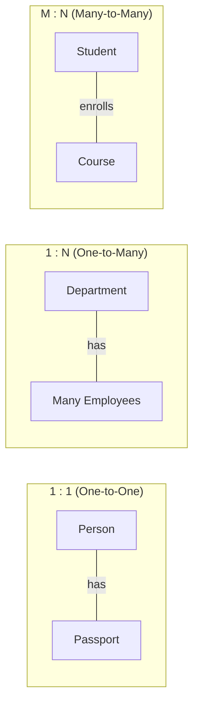
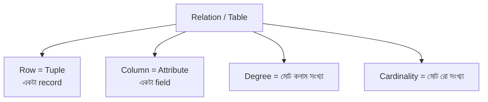
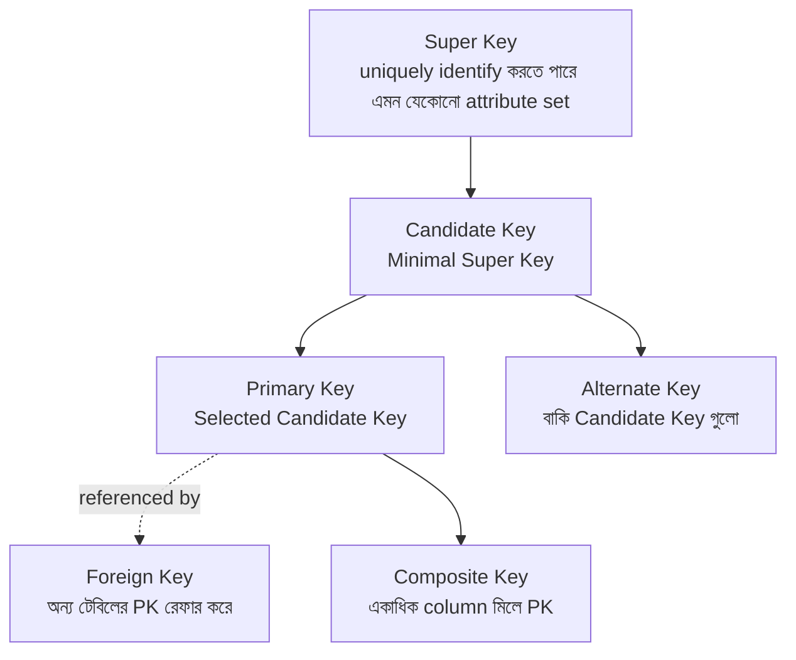

# Chapter 02 — ER Model & Relational Concepts 🗂️

> Entity, Attribute, Tuple, Cardinality, Degree আর সব ধরনের Key (Primary / Foreign / Candidate / Super / Composite) — সাথে Relational Algebra-র σ, π, ⋈, ÷, − অপারেশন। মোট ২০টা MCQ।

---

## 📚 Concept Refresher (পড়ুন আগে)

### ER Model — কী এবং কেন

**ER Model (Entity-Relationship Model)** = real-world object আর তাদের সম্পর্ককে diagram আকারে express করার একটা conceptual model। Database design-এর একদম প্রথম step।

| ER Element | Diagram Shape | Meaning |
|------------|---------------|---------|
| Strong Entity | Rectangle | নিজস্ব primary key আছে এমন object (Student, Book) |
| Weak Entity | Double Rectangle | নিজস্ব PK নেই, owner entity-র উপর নির্ভরশীল |
| Attribute | Ellipse / Oval | Entity-র বৈশিষ্ট্য (name, age) |
| Multivalued Attribute | Double Ellipse | একাধিক value নিতে পারে (phone numbers) |
| Derived Attribute | Dashed Ellipse | অন্য attribute থেকে compute হয় (age from DOB) |
| Key Attribute | Underlined Ellipse | Primary key |
| Relationship | Diamond | দুই entity-র সম্পর্ক (Enrolls, Owns) |
| Identifying Relationship | Double Diamond | Weak entity-কে strong entity-র সাথে যুক্ত করে |

### Cardinality — Relationship-এর Mapping



| Cardinality | Example | Implementation |
|-------------|---------|----------------|
| 1 : 1 | Person ↔ Passport | FK in any one table (with UNIQUE) |
| 1 : N | Department → Employees | FK in "many" side (Employee.dept_id) |
| M : N | Student ↔ Course | আলাদা **junction table** লাগে (Enrollment) |

### Tuple, Attribute, Degree, Cardinality — এক চার্টে



| Term | Relational Term | Plain English |
|------|-----------------|---------------|
| Row | Tuple | একটা record বা entry |
| Column | Attribute | একটা field |
| Number of columns | **Degree** | Width of table |
| Number of rows | **Cardinality** | Height of table |
| Set of allowed values | Domain | Data type + constraint |

### 🔑 Key Types Cheat Sheet



| Key Type | Definition | Uniqueness | NULL allowed? |
|----------|------------|------------|---------------|
| **Super Key** | Tuple-কে unique identify করতে পারে এমন যেকোনো attribute combination | ✅ Yes | ✅ Yes (অংশে) |
| **Candidate Key** | Minimal Super Key (কোনো attribute বাদ দিলে uniqueness ভাঙে) | ✅ Yes | ❌ No |
| **Primary Key (PK)** | Selected Candidate Key — main identifier | ✅ Yes | ❌ Never |
| **Alternate Key** | যেসব Candidate Key PK হিসেবে select হয়নি | ✅ Yes | ❌ No |
| **Foreign Key (FK)** | অন্য table-এর PK reference করে | ❌ No | ✅ Yes (সাধারণত) |
| **Composite Key** | একাধিক column মিলে গঠিত key | ✅ Yes (combined) | ❌ No |
| **Surrogate Key** | System-generated (auto-increment ID) | ✅ Yes | ❌ No |
| **Unique Key (UK)** | Unique constraint দেয়া column | ✅ Yes | ✅ Yes (একটা allow) |

### PK vs UK vs FK — Quick Compare

| Property | Primary Key | Unique Key | Foreign Key |
|----------|-------------|------------|-------------|
| Uniqueness | ✅ Always | ✅ Always | ❌ Can repeat |
| NULL allowed | ❌ Never | ✅ One NULL | ✅ Yes |
| Per table count | **Only 1** | Multiple | Multiple |
| Auto index | ✅ Clustered | ✅ Non-clustered | ❌ Not auto |
| Purpose | Main identifier | Business uniqueness | Cross-table link |

### Relational Algebra — Quick Reference

| Symbol | Operation | কাজ |
|--------|-----------|-----|
| **σ (sigma)** | Selection | নির্দিষ্ট condition-এ row filter |
| **π (pi)** | Projection | নির্দিষ্ট column বেছে নেয়া |
| **⋈** | Natural Join | Common attribute-এর উপর join |
| **⋈θ** | Theta Join | যেকোনো condition-এ join |
| **∪** | Union | দুই table merge (Union Compatible দরকার) |
| **−** | Set Difference | A-তে আছে কিন্তু B-তে নেই |
| **÷** | Division | "for ALL" / "for EVERY" type query |
| **×** | Cartesian Product | প্রতিটি row × প্রতিটি row |

---

## 🎯 Question 3: Tuple মানে কী?

> **Question:** একটি রিলেশনাল ডাটাবেজ মডেলে 'Tuple' বলতে কী বোঝায়?

- A) প্রাইমারি কি এর মান
- B) একটি টেবিলের রো (Row) ✅
- C) একটি টেবিলের কলাম
- D) টেবিলের মোট সংখ্যা

**Solution: B) একটি টেবিলের রো (Row)**

**ব্যাখ্যা:** রিলেশনাল মডেলে প্রতিটি সিঙ্গেল রেকর্ড বা রো-কে একটি 'Tuple' বলা হয়।

> **Memory hook:** Tuple = রো, Attribute = কলাম। `Tuple` শব্দটা mathematics-এর "ordered pair / triple"-এর generalization — একটা row-তে যত column আছে, সেটা একটা n-tuple।

---

## 🎯 Question 4: DCL command-এর উদাহরণ

> **Question:** নিচের কোনটি 'DCL' (Data Control Language) কমান্ডের উদাহরণ?

- A) INSERT এবং UPDATE
- B) COMMIT এবং ROLLBACK
- C) CREATE এবং ALTER
- D) GRANT এবং REVOKE ✅

**Solution: D) GRANT এবং REVOKE**

**ব্যাখ্যা:** এই কমান্ডগুলো ইউজার পারমিশন কন্ট্রোল করার জন্য ব্যবহৃত হয় যা DCL-এর অংশ।

> **Trap:** চার ধরনের SQL command মুখস্ত রাখুন:
>
> | Type | Full | Examples |
> |------|------|----------|
> | DDL | Data Definition | CREATE, ALTER, DROP, TRUNCATE |
> | DML | Data Manipulation | INSERT, UPDATE, DELETE, SELECT |
> | DCL | Data Control | **GRANT, REVOKE** |
> | TCL | Transaction Control | COMMIT, ROLLBACK, SAVEPOINT |

---

## 🎯 Question 5: Super Key vs Candidate Key

> **Question:** সুপার কি (Super Key) এবং ক্যান্ডিডেট কি (Candidate Key)-এর মধ্যে সম্পর্ক কী?

- A) উভয়ই সবসময় একই কলাম ধারণ করে।
- B) তাদের মধ্যে কোনো সম্পর্ক নেই।
- C) সব ক্যান্ডিডেট কি-ই সুপার কি। ✅
- D) সব সুপার কি-ই ক্যান্ডিডেট কি।

**Solution: C) সব ক্যান্ডিডেট কি-ই সুপার কি।**

**ব্যাখ্যা:** ক্যান্ডিডেট কি হলো একটি মিনিমাল সুপার কি, তাই এটি অবশ্যই একটি সুপার কি হিসেবে গণ্য হয়।

> **Set relationship:** Candidate Key ⊆ Super Key। যেমন Student(roll, email, name) — Super Key হতে পারে {roll}, {email}, {roll, name}, {roll, email}; কিন্তু Candidate Key শুধু {roll} আর {email} (minimal)।

---

## 🎯 Question 9: Composite Key

> **Question:** একটি টেবিলে একাধিক কলাম মিলে যদি প্রাইমারি কি গঠিত হয়, তাকে কী বলে?

- A) Composite Key ✅
- B) Secondary Key
- C) Foreign Key
- D) Surrogate Key

**Solution: A) Composite Key**

**ব্যাখ্যা:** যখন একের অধিক কলাম মিলে একটি ইউনিক আইডেন্টিফায়ার বা প্রাইমারি কি তৈরি হয়, তাকে কম্পোজিট কি বলা হয়।

> **Real example:** Enrollment(student_id, course_id, semester) টেবিলে একা `student_id` বা একা `course_id` unique না — কিন্তু `(student_id, course_id, semester)` মিলে একটা enrollment unique। এটাই Composite Key।

---

## 🎯 Question 11: কলামের technical নাম

> **Question:** ডাটাবেজের টেবিলের একটি কলামকে টেকনিক্যাল ভাষায় কী বলা হয়?

- A) Entity
- B) Attribute ✅
- C) Tuple
- D) Domain

**Solution: B) Attribute**

**ব্যাখ্যা:** রিলেশনাল ডাটাবেজ মডেলে টেবিলের প্রতিটি কলাম বা ফিল্ডকে অ্যাট্রিবিউট বলা হয়।

> **Quick map:**
>
> | Plain | Relational |
> |-------|------------|
> | Table | Relation |
> | Row | Tuple |
> | Column | **Attribute** |
> | Data type | Domain |
> | Object/thing | Entity |

---

## 🎯 Question 13: Primary Key-এর বৈশিষ্ট্য

> **Question:** প্রাইমারি কি (Primary Key) এর প্রধান বৈশিষ্ট্য কোনটি?

- A) এটি ডুপ্লিকেট ভ্যালু গ্রহণ করে।
- B) একটি টেবিলে একাধিক প্রাইমারি কি থাকতে পারে।
- C) এটি শুধুমাত্র সংখ্যা হতে হবে।
- D) এটি ইউনিক হতে হবে এবং NULL হতে পারবে না। ✅

**Solution: D) এটি ইউনিক হতে হবে এবং NULL হতে পারবে না।**

**ব্যাখ্যা:** প্রাইমারি কি-এর প্রতিটি ভ্যালু অনন্য হতে হয় এবং এতে কোনো ফাঁকা বা আননোন ভ্যালু থাকা নিষেধ।

> **PK rules (মুখস্ত):**
>
> 1. **Unique** — কোনো দুই row-তে একই PK value থাকতে পারে না
> 2. **NOT NULL** — কখনো NULL হতে পারবে না
> 3. **Only one PK per table** — কিন্তু সেটা composite হতে পারে
> 4. **Immutable** (recommended) — value change না করাই ভালো

---

## 🎯 Question 18: Data মুছবেন কিন্তু table রাখবেন?

> **Question:** একটি টেবিলের সব ডাটা মুছে ফেলতে কিন্তু টেবিলটি বজায় রাখতে কোনটি ব্যবহৃত হয়?

- A) REMOVE
- B) DROP
- C) ALTER
- D) TRUNCATE ✅

**Solution: D) TRUNCATE**

**ব্যাখ্যা:** TRUNCATE কমান্ড টেবিলের সব রেকর্ড মুছে ফেলে কিন্তু টেবিলের স্ট্রাকচার অক্ষুণ্ণ রাখে।

> **Trap — DELETE vs TRUNCATE vs DROP:**
>
> | Command | Removes data? | Removes structure? | Rollback possible? | Speed |
> |---------|---------------|---------------------|--------------------|-------|
> | DELETE | ✅ (row by row, with WHERE) | ❌ | ✅ Yes | Slow |
> | TRUNCATE | ✅ (all rows) | ❌ | ❌ (usually) | **Fast** |
> | DROP | ✅ | ✅ (table gone) | ❌ | Fast |

---

## 🎯 Question 19: Sort করার clause

> **Question:** SQL-এ ডাটা সর্ট (Sort) করার জন্য কোন ক্লজ ব্যবহৃত হয়?

- A) GROUP BY
- B) SORT BY
- C) ARRANGE BY
- D) ORDER BY ✅

**Solution: D) ORDER BY**

**ব্যাখ্যা:** ORDER BY ক্লজ ব্যবহার করে ডাটাকে আরোহী (ASC) বা অবরোহী (DESC) ক্রমে সাজানো হয়।

> **Syntax:** `SELECT * FROM Student ORDER BY name ASC, roll DESC;` — একাধিক column-এ একসাথে sort করা যায়। Default `ASC` (ascending)।

---

## 🎯 Question 21: ER diagram-এ Attribute চিহ্ন

> **Question:** E-R মডেলে 'Attribute' প্রকাশের জন্য কোন জ্যামিতিক আকৃতি ব্যবহার করা হয়?

- A) Line
- B) Rectangle
- C) Diamond
- D) Ellipse/Oval ✅

**Solution: D) Ellipse/Oval**

**ব্যাখ্যা:** ওভাল বা ডিম্বাকৃতি চিহ্ন দিয়ে এনটিটির বৈশিষ্ট্য বা অ্যাট্রিবিউট প্রকাশ করা হয়।

> **ER shapes মুখস্ত (exam frequent):**
>
> | Shape | Element |
> |-------|---------|
> | Rectangle | Entity |
> | Double Rectangle | Weak Entity |
> | Ellipse | Attribute |
> | Double Ellipse | Multivalued Attribute |
> | Dashed Ellipse | Derived Attribute |
> | Diamond | Relationship |
> | Double Diamond | Identifying Relationship |
> | Underlined Ellipse | Key Attribute |

---

## 🎯 Question 22: Foreign Key-এর উদ্দেশ্য

> **Question:** ডাটাবেজে 'Foreign Key' কেন ব্যবহার করা হয়?

- A) দুটি টেবিলের মধ্যে সম্পর্ক তৈরি করার জন্য। ✅
- B) টেবিল লক করার জন্য।
- C) ডাটা ডিলিট করার স্পিড বাড়াতে।
- D) ডাটা এনক্রিপশন করার জন্য।

**Solution: A) দুটি টেবিলের মধ্যে সম্পর্ক তৈরি করার জন্য।**

**ব্যাখ্যা:** ফরেন কি ব্যবহার করে এক টেবিলের সাথে অন্য টেবিলের লজিক্যাল লিঙ্ক তৈরি করা হয়।

> **Real example:** `Order(order_id, customer_id, ...)` টেবিলে `customer_id` হলো FK যা `Customer(customer_id, ...)` টেবিলের PK reference করে। এতে **Referential Integrity** নিশ্চিত হয় — invalid customer_id দিয়ে order create করা যায় না।

---

## 🎯 Question 34: Deadlock detection graph

> **Question:** ডেডলক (Deadlock) শনাক্ত করার জন্য কোন গ্রাফ ব্যবহৃত হয়?

- A) Scatter Plot
- B) Pie Chart
- C) Wait-for Graph ✅
- D) Bar Chart

**Solution: C) Wait-for Graph**

**ব্যাখ্যা:** Wait-for গ্রাফের সাইকেল দেখে বোঝা যায় যে ডেডলক হয়েছে।

> **কীভাবে কাজ করে:** প্রতিটি transaction একটা node, আর "T1 waits for T2" সম্পর্ক একটা directed edge। যদি graph-এ **cycle** থাকে — সেটাই deadlock। Cycle না থাকলে deadlock নেই।

---

## 🎯 Question 41: Cardinality কী?

> **Question:** ডাটাবেজ রিলেশনে 'Cardinality' কী?

- A) ডাটাবেজের সাইজ
- B) প্রাইমারি কি এর সংখ্যা
- C) টেবিলের সারির সংখ্যা ✅
- D) কলামের সংখ্যা

**Solution: C) টেবিলের সারির সংখ্যা**

**ব্যাখ্যা:** একটি রিলেশনে মোট সারির বা রো-এর সংখ্যা হলো কার্ডিনালিটি।

> **Pair সাথে মুখস্ত করুন:**
>
> - **Cardinality** = Row count (height)
> - **Degree** = Column count (width)
>
> দুইটা যেন উল্টো না হয়! ER context-এ "cardinality" আবার অন্য মানে — relationship-এর mapping (1:1, 1:N, M:N)। Context বুঝে answer দিন।

---

## 🎯 Question 46: Degree মানে কী?

> **Question:** ডাটাবেজ রিলেশনের ক্ষেত্রে 'Degree' বলতে কী বোঝায়?

- A) ভ্যালুর সংখ্যা
- B) কলাম বা অ্যাট্রিবিউটের সংখ্যা ✅
- C) রো-এর সংখ্যা
- D) টেবিলের সংখ্যা

**Solution: B) কলাম বা অ্যাট্রিবিউটের সংখ্যা**

**ব্যাখ্যা:** একটি রিলেশনে মোট কলামের সংখ্যাকে Degree বলে।

> **Example:** `Student(roll, name, dept, cgpa)` — এই relation-এর Degree = 4 (চারটা attribute)। যদি ১০০ জন student থাকে, Cardinality = 100।

---

## 🎯 Question 49: HAVING clause-এর position

> **Question:** SQL-এ 'HAVING' ক্লজ সাধারণত কোথায় বসে?

- A) GROUP BY এর পরে ✅
- B) SELECT এর আগে
- C) ORDER BY এর পরে
- D) WHERE এর পরে

**Solution: A) GROUP BY এর পরে**

**ব্যাখ্যা:** গ্রুপিং এর পর রেজাল্ট ফিল্টার করার জন্য এটি GROUP BY এর পরেই বসে।

> **Full SQL clause order মুখস্ত রাখুন:**
>
> ```sql
> SELECT    column_list
> FROM      table
> WHERE     row_condition       -- before grouping
> GROUP BY  column
> HAVING    group_condition     -- after grouping
> ORDER BY  column
> LIMIT     n;
> ```
>
> **WHERE filters rows, HAVING filters groups** — এটাই key পার্থক্য।

---

## 🎯 Question 54: σ (Sigma) কী প্রকাশ করে?

> **Question:** Relational Algebra-তে σ (Sigma) চিহ্নটি কী প্রকাশ করে?

- A) Join (টেবিল সংযোগ)
- B) Projection (কলাম নির্বাচন)
- C) Selection (রো নির্বাচন) ✅
- D) Union (একত্রীকরণ)

**Solution: C) Selection (রো নির্বাচন)**

**ব্যাখ্যা:** সিগমা অপারেশন নির্দিষ্ট শর্ত অনুযায়ী টাপল বা রো ফিল্টার করতে ব্যবহৃত হয়।

> **σ vs π মুখস্ত:**
>
> | Symbol | Operation | SQL equivalent |
> |--------|-----------|----------------|
> | **σ (sigma)** | **Selection** (rows) | WHERE clause |
> | **π (pi)** | **Projection** (columns) | SELECT column list |
>
> Example: σ_{cgpa>3.5}(Student) ≡ `SELECT * FROM Student WHERE cgpa > 3.5`

---

## 🎯 Question 66: Weak Entity Set প্রকাশ

> **Question:** Weak Entity Set-কে ই-আর ডায়াগ্রামে কীভাবে প্রকাশ করা হয়?

- A) Double Rectangle ✅
- B) Single Rectangle
- C) Dashed Ellipse
- D) Double Ellipse

**Solution: A) Double Rectangle**

**ব্যাখ্যা:** উইক এনটিটি সেট (যার নিজস্ব প্রাইমারি কি নেই) ডাবল আউটলাইন রেকট্যাঙ্গেল দিয়ে বোঝানো হয়।

> **Weak Entity বুঝবেন কীভাবে:** যদি একটা entity-র নিজের কোনো PK না থাকে এবং সে অন্য (strong) entity-র সাথে identifying relationship-এ যুক্ত হয়ে নিজেকে identify করে — সেটাই Weak Entity। উদাহরণ: `Dependent(name, age)` entity যে `Employee`-র উপর নির্ভরশীল। `name` একা unique না, কিন্তু `(employee_id, name)` মিলে unique।

---

## 🎯 Question 71: Division (÷) অপারেশন কখন?

> **Question:** Relational Algebra-তে 'Division' (÷) অপারেশনটি সাধারণত কোন ধরনের কুয়েরি সমাধানে ব্যবহৃত হয়?

- A) শুধুমাত্র নাল ভ্যালু বের করার জন্য
- B) দুটি টেবিলের যোগফল বের করতে
- C) যেখানে 'ALL' বা 'FOR EVERY' এর মতো শর্ত থাকে ✅
- D) যেখানে 'OR' কন্ডিশন থাকে

**Solution: C) যেখানে 'ALL' বা 'FOR EVERY' এর মতো শর্ত থাকে**

**ব্যাখ্যা:** ডিভিশন অপারেশন এমন টাপল খুঁজে বের করে যা দ্বিতীয় টেবিলের সকল টাপলের সাথে সম্পর্কিত।

> **Classic example:** "যেসব student **সব** course-এ enrolled" — `Enrollment ÷ Course`। SQL-এ এটা সাধারণত `NOT EXISTS (... NOT EXISTS ...)` দিয়ে express করা হয় — একটু কঠিন পেঁচ। Division operator-এর কাজ এই pattern সরাসরি capture করা।

---

## 🎯 Question 74: Natural Join-এর শর্ত

> **Question:** Relational Algebra-তে 'Natural Join' (⋈) করার জন্য অপরিহার্য শর্ত কোনটি?

- A) টেবিল দুটির রো সংখ্যা সমান হতে হবে
- B) উভয় টেবিলের নাম এক হতে হবে
- C) কোনো প্রাইমারি কি থাকা যাবে না
- D) অন্তত একটি কমন অ্যাট্রিবিউট বা কলাম থাকতে হবে ✅

**Solution: D) অন্তত একটি কমন অ্যাট্রিবিউট বা কলাম থাকতে হবে**

**ব্যাখ্যা:** ন্যাচারাল জয়েন স্বয়ংক্রিয়ভাবে কমন কলামের ওপর ভিত্তি করে ম্যাচিং ডাটা খুঁজে বের করে।

> **Note:** Natural Join automatically common attribute খুঁজে নেয় (একই নামের column)। যদি কোনো common attribute না থাকে, তাহলে Natural Join → **Cartesian Product**-এ পরিণত হয় (সব row × সব row)। তাই naming convention important।

---

## 🎯 Question 85: Set Difference (−) -এর শর্ত

> **Question:** Relational Algebra-তে 'Set Difference' (−) ব্যবহারের শর্ত কী?

- A) দুটি টেবিলে অন্তত একটি রো থাকতে হবে
- B) টেবিল দুটির নাম এক হতে হবে
- C) শুধুমাত্র প্রাইমারি কি থাকতে হবে
- D) টেবিল দুটি 'Union Compatible' হতে হবে ✅

**Solution: D) টেবিল দুটি 'Union Compatible' হতে হবে**

**ব্যাখ্যা:** উভয় টেবিলের কলাম সংখ্যা এবং তাদের ডোমেইন (ডাটা টাইপ) একই হতে হয়।

> **Union Compatible মানে কী:**
>
> 1. দুই relation-এর **Degree** (column count) সমান হতে হবে
> 2. প্রতিটি corresponding column-এর **Domain** (data type) match করতে হবে
>
> এই শর্ত শুধু `−` না — `∪ (Union)` আর `∩ (Intersection)` সবার জন্য লাগে।

---

## 🎯 Question 90: Theta Join-এ θ মানে কী?

> **Question:** Relational Algebra-তে 'Theta Join' (⋈θ) এর ক্ষেত্রে θ কী নির্দেশ করে?

- A) টেবিলের মোট সংখ্যা
- B) একটি নির্দিষ্ট কলামের নাম
- C) যেকোনো একটি শর্ত (যেমন: A&lt;B বা C=D) ✅
- D) একটি বিশেষ ডাটা টাইপ

**Solution: C) যেকোনো একটি শর্ত (যেমন: A&lt;B বা C=D)**

**ব্যাখ্যা:** থিটা জয়েন কেবল সমান নয়, বরং যেকোনো তুলনা বা শর্তের ভিত্তিতে জয়েন করতে পারে।

> **Join family হায়রার্কি:**
>
> | Join | Condition |
> |------|-----------|
> | **Theta Join (⋈θ)** | যেকোনো comparison: =, <, >, ≤, ≥, ≠ |
> | **Equi Join** | শুধু `=` (Theta Join-এর special case) |
> | **Natural Join (⋈)** | Common attribute-এ Equi Join, একই কলাম একবারই থাকে |
>
> অর্থাৎ: Natural ⊂ Equi ⊂ Theta।

---

## 📋 Quick Recap Table

| Concept | Key fact |
|---------|----------|
| Tuple | Row / record একটা |
| Attribute | Column / field একটা |
| Cardinality | মোট row সংখ্যা |
| Degree | মোট column সংখ্যা |
| Domain | কোনো attribute-এর allowed value set |
| Super Key | Unique identify করতে পারে এমন যেকোনো attribute set |
| Candidate Key | Minimal Super Key |
| Primary Key | Selected Candidate Key, Unique + NOT NULL |
| Alternate Key | বাকি Candidate Key গুলো |
| Foreign Key | অন্য table-এর PK reference |
| Composite Key | একাধিক column মিলে গঠিত PK |
| ER Entity | Rectangle |
| ER Weak Entity | Double Rectangle |
| ER Attribute | Ellipse/Oval |
| ER Relationship | Diamond |
| DCL commands | GRANT, REVOKE |
| TCL commands | COMMIT, ROLLBACK, SAVEPOINT |
| TRUNCATE | Data মুছে, structure থাকে |
| DROP | Data + structure দুটোই মুছে |
| ORDER BY | SQL-এ sort clause |
| HAVING | GROUP BY-এর পর, group filter |
| WHERE | Row filter (grouping-এর আগে) |
| σ (Sigma) | Selection — row filter |
| π (Pi) | Projection — column select |
| ⋈ Natural Join | Common attribute দরকার |
| ⋈θ Theta Join | যেকোনো condition-এ join |
| ÷ Division | "for ALL" / "for EVERY" pattern |
| − Set Difference | Union Compatible দরকার |
| Wait-for Graph | Deadlock detect |

---

## 🔁 Next Chapter

পরের chapter-এ **SQL Basics** — SELECT, INSERT, UPDATE, DELETE, JOIN types, aggregate functions, এবং practical query writing।

→ [Chapter 03: SQL Basics](03-sql-basics.md)
