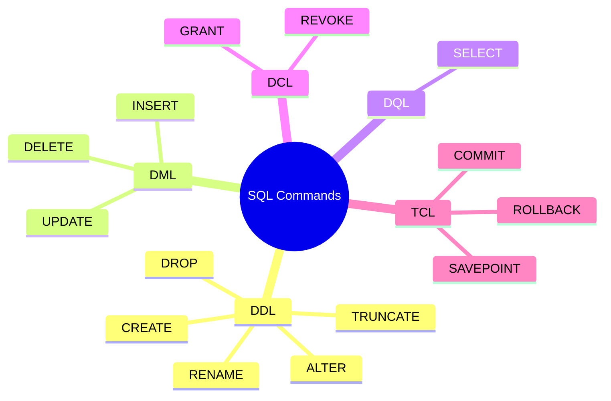
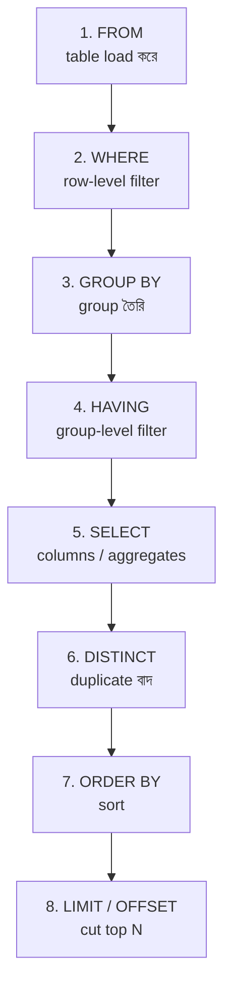
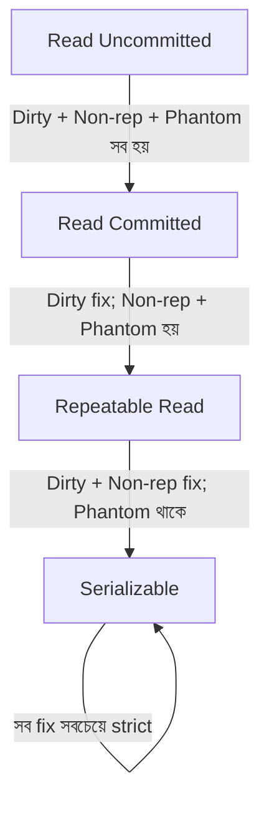

# Chapter 03 — SQL Basics: DDL, DML, DQL 📝

> SELECT, INSERT, DDL/DML category, WHERE clause, NULL handling, DISTINCT, LIKE pattern matching, UNIQUE constraint, Isolation level — Bank IT / BCS / NTRCA exam-এ SQL syntax-এর ১১টা must-know MCQ।

---

## 📚 Concept Refresher (পড়ুন আগে)

### SQL Command Categories — পাঁচটা ভাগ মনে রাখুন

SQL-এর প্রতিটা command এই পাঁচটা category-র কোনো একটায় পড়ে। Exam-এ "নিচের কোনটি DDL?" type প্রশ্ন প্রায়ই আসে — তাই এটা মুখস্থ করতেই হবে।



| Category | Full form | কী করে | Example commands |
|----------|-----------|---------|------------------|
| **DDL** | Data **Definition** Language | Schema/structure define / change | `CREATE`, `ALTER`, `DROP`, `TRUNCATE`, `RENAME` |
| **DML** | Data **Manipulation** Language | Row-level data add/edit/remove | `INSERT`, `UPDATE`, `DELETE` |
| **DQL** | Data **Query** Language | Data পড়া (read) | `SELECT` |
| **DCL** | Data **Control** Language | Permission control | `GRANT`, `REVOKE` |
| **TCL** | Transaction **Control** Language | Txn boundary control | `COMMIT`, `ROLLBACK`, `SAVEPOINT` |

> **Memory hook:** "**D**efine = **D**DL, **M**anipulate = **D**ML, **Q**uery = **D**QL"। অনেক বইয়ে SELECT-কেও DML-এর মধ্যে দেখানো হয় (combined view), কিন্তু standard separation হলো DQL = SELECT।

### Basic SQL Syntax — সব command একটা করে দেখে নিন

```sql
-- DDL: structure তৈরি
CREATE TABLE students (
    id INT PRIMARY KEY,
    name VARCHAR(100) NOT NULL,
    email VARCHAR(150) UNIQUE,
    age INT CHECK (age > 0)
);

-- DML: data ঢোকানো / বদলানো
INSERT INTO students VALUES (1, 'Rahim', 'rahim@x.com', 22);
UPDATE students SET age = 23 WHERE id = 1;
DELETE FROM students WHERE id = 1;

-- DQL: data পড়া
SELECT * FROM students WHERE age > 18;
SELECT DISTINCT name FROM students;
SELECT * FROM students WHERE email IS NULL;
SELECT * FROM students WHERE name LIKE 'R%';

-- DCL: permission
GRANT SELECT ON students TO user1;
REVOKE SELECT ON students FROM user1;

-- TCL: transaction control
BEGIN;
UPDATE accounts SET balance = balance - 1000 WHERE id = 1;
UPDATE accounts SET balance = balance + 1000 WHERE id = 2;
COMMIT;  -- বা ROLLBACK;
```

### Logical Query Execution Order

আপনি SQL লেখেন `SELECT ... FROM ... WHERE ...` order-এ, কিন্তু DBMS execute করে **সম্পূর্ণ ভিন্ন order**-এ। এই order বুঝলে WHERE vs HAVING, alias-এর scope সব clear হয়ে যায়।



> **কেন এটা গুরুত্বপূর্ণ:** WHERE চলে GROUP BY-এর **আগে**, তাই WHERE-এ aggregate function (`SUM`, `AVG`) ব্যবহার করা যায় না। HAVING চলে GROUP BY-এর **পরে**, তাই সেখানে aggregate filter করা যায়।

### DELETE vs TRUNCATE vs DROP — exam-এ confuse করানোর favorite topic

| Aspect | `DELETE` | `TRUNCATE` | `DROP` |
|--------|----------|------------|--------|
| Category | **DML** | **DDL** | **DDL** |
| কী remove হয় | নির্দিষ্ট row(s) | সব row, structure থাকে | পুরো table (structure সহ) |
| `WHERE` clause | ✅ যায় | ❌ যায় না (সব mucche) | ❌ যায় না |
| Rollback (transaction-এ) | ✅ সম্ভব | ⚠️ সাধারণত না (auto-commit) | ⚠️ সাধারণত না |
| Speed | Slow (row-by-row + log) | Fast (page deallocation) | Fastest |
| Triggers fire? | ✅ হ্যাঁ | ❌ না | ❌ না |
| Auto-increment reset? | ❌ না | ✅ হ্যাঁ | N/A |

```sql
DELETE FROM students WHERE age < 18;  -- কিছু row বাদ, structure unchanged
TRUNCATE TABLE students;              -- সব row বাদ, structure unchanged
DROP TABLE students;                  -- পুরো table-ই নেই
```

> **One-line rule:** "DELETE এক এক row, TRUNCATE সব row, DROP পুরো table।"

### Common Constraints (revision)

| Constraint | কী guarantee করে |
|------------|-------------------|
| `PRIMARY KEY` | Unique + NOT NULL — row-এর identity |
| `FOREIGN KEY` | অন্য table-এর key-কে reference |
| `UNIQUE` | কোনো duplicate value না (NULL allowed) |
| `NOT NULL` | NULL allow না |
| `CHECK` | নির্দিষ্ট condition (যেমন `age > 0`) |
| `DEFAULT` | কোনো value না দিলে এই default বসবে |

---

## 🎯 Question 2: WHERE vs HAVING — প্রধান পার্থক্য

> **Question:** SQL-এ 'HAVING' ক্লজ এবং 'WHERE' ক্লজ এর মধ্যে প্রধান পার্থক্য কী?

- A) HAVING শুধুমাত্র SELECT স্টেটমেন্টে ব্যবহার করা যায় না।
- B) WHERE অ্যাগ্রিগেট ফাংশনের সাথে ব্যবহৃত হয়, HAVING সাধারণ কন্ডিশনে।
- C) উভয়ই সবসময় একই রেজাল্ট দেয়।
- D) HAVING গ্রুপ করার পর রেজাল্ট ফিল্টার করে, আর WHERE গ্রুপ করার আগে রো ফিল্টার করে। ✅

**Solution: D) HAVING গ্রুপ করার পর রেজাল্ট ফিল্টার করে, আর WHERE গ্রুপ করার আগে রো ফিল্টার করে।**

**ব্যাখ্যা:** WHERE ক্লজ প্রতিটি ইনডিভিজুয়াল রো চেক করে এবং HAVING ক্লজ GROUP BY এর রেজাল্ট সেটে কাজ করে।

```sql
-- WHERE → row filter (group-এর আগে)
-- HAVING → group filter (group-এর পরে)
SELECT department, AVG(salary)
FROM employees
WHERE salary > 20000          -- প্রতিটা row check
GROUP BY department
HAVING AVG(salary) > 50000;   -- প্রতিটা group check
```

> **Note:** WHERE-এ aggregate function (SUM, AVG, COUNT) ব্যবহার করা যায় **না** — কারণ WHERE চলে GROUP BY-এর আগে, তখন aggregate value এখনো calculate হয়নি। HAVING-এ aggregate ব্যবহার করতেই হয়।

---

## 🎯 Question 6: NULL check করার operator

> **Question:** SQL-এ কোনো ভ্যালু 'NULL' কি না তা চেক করার জন্য কোন অপারেটর ব্যবহার করা হয়?

- A) LIKE NULL
- B) IN NULL
- C) = NULL
- D) IS NULL ✅

**Solution: D) IS NULL**

**ব্যাখ্যা:** SQL-এ NULL ভ্যালু চেক করার জন্য স্ট্যান্ডার্ড পদ্ধতি হলো 'IS NULL' বা 'IS NOT NULL' ব্যবহার করা।

```sql
-- ✅ সঠিক
SELECT * FROM students WHERE email IS NULL;
SELECT * FROM students WHERE email IS NOT NULL;

-- ❌ ভুল — কোনো result আসবে না
SELECT * FROM students WHERE email = NULL;
```

> **Trap:** NULL মানে "unknown / undefined"। `NULL = NULL` SQL-এ `TRUE` দেয় না, দেয় `UNKNOWN` (three-valued logic)। তাই `= NULL` লিখলে কখনোই row match হবে না — এই ভুল exam-এ এবং production-এ দুজায়গায়ই common।

---

## 🎯 Question 12: Database থেকে data পড়ার command

> **Question:** নিচের কোনটি ডাটাবেজ থেকে ডাটা পড়ার জন্য ব্যবহৃত হয়?

- A) INSERT
- B) UPDATE
- C) SELECT ✅
- D) DELETE

**Solution: C) SELECT**

**ব্যাখ্যা:** SELECT স্টেটমেন্ট ব্যবহার করে ডাটাবেজ থেকে নির্দিষ্ট ডাটা রিট্রিভ বা পড়া হয়।

```sql
SELECT name, email FROM students WHERE age >= 18;
```

> **Note:** SELECT হলো **DQL** (Data Query Language)-এর একমাত্র command। বাকি INSERT/UPDATE/DELETE = DML (data বদলায়)। "**পড়ার জন্য SELECT, বদলানোর জন্য বাকিগুলো**" — এই separation মনে রাখুন।

---

## 🎯 Question 14: সব column select করার symbol

> **Question:** SQL-এ সব কলাম সিলেক্ট করার জন্য কোন চিহ্ন ব্যবহার করা হয়?

- A) @
- B) * ✅
- C) #
- D) %

**Solution: B) ***

**ব্যাখ্যা:** * (asterisk/star) চিহ্ন SQL-এ সব কলাম সিলেক্ট করতে ব্যবহৃত হয় — যেমন SELECT * FROM users;

```sql
SELECT * FROM students;            -- সব column
SELECT name, email FROM students;  -- নির্দিষ্ট column
```

> **Production tip:** Real code-এ `SELECT *` avoid করার পরামর্শ দেয়া হয় — কারণ table-এ নতুন column যোগ হলে app code break করতে পারে, এবং extra column transfer-এ network/memory খরচ বাড়ে। কিন্তু **exam-এ syntax প্রশ্নে উত্তর সবসময় `*`**।

---

## 🎯 Question 16: DDL এর উদাহরণ

> **Question:** নিচের কোনটি DDL (Data Definition Language) এর উদাহরণ?

- A) SELECT
- B) INSERT
- C) UPDATE
- D) CREATE ✅

**Solution: D) CREATE**

**ব্যাখ্যা:** CREATE কমান্ড টেবিল বা ডাটাবেজের স্ট্রাকচার তৈরি করতে ব্যবহৃত হয়, যা DDL-এর অংশ।

| Command | Category |
|---------|----------|
| `CREATE` | **DDL** ✅ |
| `INSERT` | DML |
| `UPDATE` | DML |
| `SELECT` | DQL |

> **Memory hook:** DDL = "**C**reate, **A**lter, **D**rop, **T**runcate" — মুখস্থ করুন **CADT**। এগুলো **structure** বদলায়, data না।

---

## 🎯 Question 23: Unique record-এর জন্য keyword

> **Question:** SQL-এ ইউনিক রেকর্ড পাওয়ার জন্য কোন কীওয়ার্ড ব্যবহার করা হয়?

- A) DIFFERENT
- B) UNIQUE
- C) DISTINCT ✅
- D) SINGLE

**Solution: C) DISTINCT**

**ব্যাখ্যা:** SELECT DISTINCT কমান্ড ব্যবহার করে আউটপুট থেকে সব ডুপ্লিকেট রো বাদ দিয়ে ইউনিক ডাটা দেখা যায়।

```sql
-- duplicate department বাদ দিয়ে শুধু unique value
SELECT DISTINCT department FROM employees;

-- multiple column-এর combination unique
SELECT DISTINCT department, designation FROM employees;
```

> **Trap:** **`UNIQUE`** এবং **`DISTINCT`** দুটো ভিন্ন জিনিস:
> - `UNIQUE` = column-level **constraint** (table create-এ লাগে — duplicate ঢুকতে দেয় না)
> - `DISTINCT` = SELECT-এ **keyword** (output থেকে duplicate বাদ)
>
> Exam-এ option-এ দুটোই থাকে — সাবধান!

---

## 🎯 Question 24: একাধিক condition-এর logical operator

> **Question:** একাধিক শর্ত চেক করার জন্য 'WHERE' ক্লজ-এ কোন লজিক্যাল অপারেটর ব্যবহার করা হয়?

- A) ALSO
- B) WITH
- C) AND ✅
- D) PLUS

**Solution: C) AND**

**ব্যাখ্যা:** AND অপারেটর ব্যবহার করে যখন সব শর্ত সত্য হয় তখনই ডাটা ফিল্টার করা হয়।

```sql
SELECT * FROM students
WHERE age >= 18 AND department = 'CSE' AND cgpa > 3.5;
```

| Operator | কখন true |
|----------|----------|
| `AND` | সব condition true হলে |
| `OR` | যেকোনো একটি true হলে |
| `NOT` | Condition উল্টো করে |

> **Note:** `BETWEEN`, `IN`, `LIKE` — এগুলোও WHERE clause-এ logical filter, কিন্তু "একাধিক শর্ত combine" করার জন্য standard answer **AND / OR**।

---

## 🎯 Question 27: INSERT-এর সঠিক syntax

> **Question:** SQL-এ নতুন রেকর্ড ইনসার্ট করার সঠিক সিনট্যাক্স কোনটি?

- A) INSERT INTO Table VALUES (...) ✅
- B) ADD TO Table VALUES (...)
- C) SAVE INTO Table VALUES (...)
- D) PUT INTO Table VALUES (...)

**Solution: A) INSERT INTO Table VALUES (...)**

**ব্যাখ্যা:** এটি SQL-এর স্ট্যান্ডার্ড সিনট্যাক্স যা নতুন ডাটা যোগ করতে ব্যবহৃত হয়।

```sql
-- সব column-এ value (column order মেনে)
INSERT INTO students VALUES (1, 'Karim', 22);

-- নির্দিষ্ট column-এ value (recommended — safer)
INSERT INTO students (id, name, age) VALUES (2, 'Rahim', 25);

-- multiple row একসাথে
INSERT INTO students (id, name) VALUES (3, 'A'), (4, 'B'), (5, 'C');
```

> **Tip:** ADD / SAVE / PUT — এগুলো natural English-এ logical লাগলেও SQL standard-এ **INSERT INTO**-ই একমাত্র valid। নাম মুখস্থ রাখুন।

---

## 🎯 Question 30: Pattern matching operator

> **Question:** SQL-এ কোনো প্যাটার্ন ম্যাচ করার জন্য কোন অপারেটরটি ব্যবহৃত হয়?

- A) MATCH
- B) CONTAINS
- C) LIKE ✅
- D) EQUAL

**Solution: C) LIKE**

**ব্যাখ্যা:** LIKE অপারেটর ওয়াইল্ডকার্ড (% এবং _) ব্যবহার করে নির্দিষ্ট প্যাটার্ন অনুযায়ী ডাটা খুঁজে পেতে সাহায্য করে।

```sql
SELECT * FROM students WHERE name LIKE 'R%';      -- 'R' দিয়ে শুরু
SELECT * FROM students WHERE name LIKE '%han';    -- 'han' দিয়ে শেষ
SELECT * FROM students WHERE name LIKE '%im%';    -- মাঝে 'im'
SELECT * FROM students WHERE name LIKE '_arim';   -- ১ char + 'arim' (Karim, Sarim)
```

| Wildcard | Match করে |
|----------|-----------|
| `%` | শূন্য বা একাধিক character |
| `_` | ঠিক একটা character |

> **Note:** Case-sensitive আচরণ DB-ভেদে আলাদা — MySQL default case-**insensitive**, PostgreSQL case-**sensitive** (case-insensitive চাইলে `ILIKE` ব্যবহার করুন)।

---

## 🎯 Question 50: Duplicate value আটকানোর constraint

> **Question:** ডাটাবেজ রিলেশনের কোন কনস্ট্রেইন্ট নিশ্চিত করে যে একটি কলামে ডুপ্লিকেট মান থাকতে পারবে না?

- A) CHECK
- B) DEFAULT
- C) NOT NULL
- D) UNIQUE ✅

**Solution: D) UNIQUE**

**ব্যাখ্যা:** UNIQUE কনস্ট্রেইন্ট নিশ্চিত করে যে কলামের প্রতিটি মান আলাদা হতে হবে।

```sql
CREATE TABLE users (
    id INT PRIMARY KEY,
    email VARCHAR(150) UNIQUE,    -- duplicate email allowed না
    phone VARCHAR(15) UNIQUE
);

-- error দেবে যদি email আগে থেকেই থাকে
INSERT INTO users VALUES (1, 'a@x.com', '01700000001');
INSERT INTO users VALUES (2, 'a@x.com', '01700000002');  -- ❌ duplicate
```

| Constraint | কী করে |
|------------|--------|
| `UNIQUE` | Duplicate value blocked (NULL allowed) |
| `PRIMARY KEY` | UNIQUE + NOT NULL (NULL allowed না) |
| `NOT NULL` | NULL blocked, but duplicate allowed |
| `CHECK` | Custom condition (e.g., `age > 0`) |
| `DEFAULT` | Value না দিলে এটা বসবে |

> **Trap:** PRIMARY KEY আর UNIQUE-এর পার্থক্য জানতে হবে। PRIMARY KEY = UNIQUE + NOT NULL। Table-এ **শুধু একটা PRIMARY KEY**, কিন্তু **একাধিক UNIQUE column** থাকতে পারে।

---

## 🎯 Question 86: Repeatable Read-এ কোন সমস্যা থাকে

> **Question:** Transaction Isolation-এর 'Repeatable Read' লেভেলে কোন সমস্যাটি সমাধান হয় না?

- A) Dirty Read
- B) Phantom Read ✅
- C) Non-repeatable Read
- D) Lost Update

**Solution: B) Phantom Read**

**ব্যাখ্যা:** এখানে বিদ্যমান রোগুলো লক করা থাকে কিন্তু নতুন রো ইনসার্ট হওয়া ঠেকানো যায় না।



| Isolation Level | Dirty Read | Non-repeatable Read | Phantom Read |
|-----------------|:----------:|:-------------------:|:------------:|
| Read Uncommitted | ❌ হয় | ❌ হয় | ❌ হয় |
| Read Committed | ✅ ঠিক | ❌ হয় | ❌ হয় |
| **Repeatable Read** | ✅ ঠিক | ✅ ঠিক | **❌ এখনো হয়** |
| Serializable | ✅ ঠিক | ✅ ঠিক | ✅ ঠিক |

> **Trap:** Phantom Read হয় যখন আপনি একই query দ্বিতীয়বার চালান কিন্তু এর মধ্যে অন্য transaction **নতুন row INSERT** করেছে। Repeatable Read আগের row-গুলো lock করে রাখে, কিন্তু নতুন row insert আটকায় না — তাই Phantom থেকে যায়। **Serializable** হলো একমাত্র level যা phantom-ও ঠেকায়।

---

## 📋 Quick Recap Table

| Concept | Key fact |
|---------|----------|
| DDL | CREATE, ALTER, DROP, TRUNCATE — structure |
| DML | INSERT, UPDATE, DELETE — data |
| DQL | SELECT — read |
| DCL | GRANT, REVOKE — permission |
| TCL | COMMIT, ROLLBACK — transaction |
| WHERE vs HAVING | WHERE → row (before group), HAVING → group (after group) |
| NULL check | `IS NULL` / `IS NOT NULL` (never `= NULL`) |
| Read all columns | `SELECT *` |
| All columns wildcard | `*` (asterisk) |
| Insert syntax | `INSERT INTO table VALUES (...)` |
| Pattern matching | `LIKE` with `%` (any) and `_` (one char) |
| Duplicate filter (output) | `DISTINCT` keyword |
| Duplicate prevent (column) | `UNIQUE` constraint |
| Logical AND | `AND` operator |
| Repeatable Read fails to prevent | **Phantom Read** |
| Only Serializable prevents | All three (Dirty, Non-rep, Phantom) |
| DELETE vs TRUNCATE | DELETE = DML + WHERE; TRUNCATE = DDL, all rows |
| DROP | পুরো table গায়েব (structure সহ) |

---

## 🔁 Next Chapter

পরের chapter-এ **Advanced SQL** — Joins (INNER, LEFT, RIGHT, FULL OUTER, CROSS), Aggregate functions, Subqueries (correlated vs non-correlated), View, এবং Relational Algebra-র operators।

→ [Chapter 04: Advanced SQL — Joins, Aggregates, Subqueries](04-sql-advanced.md)
