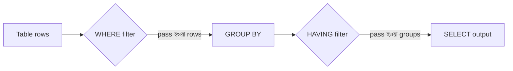
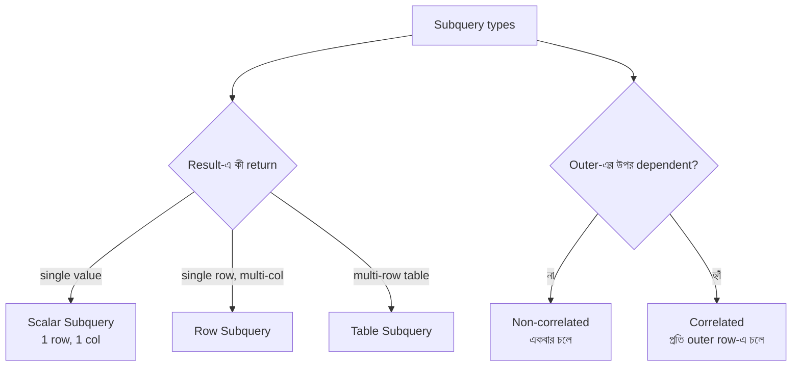
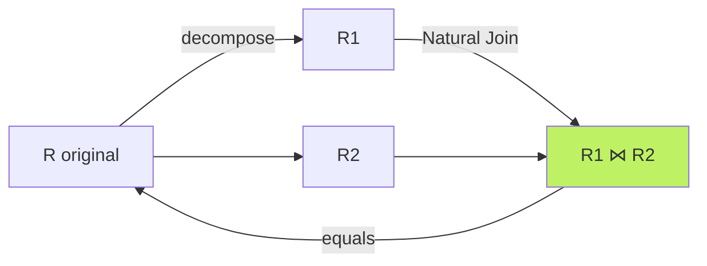
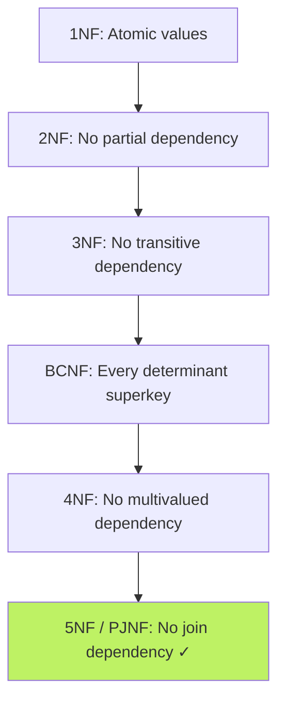

# Chapter 04 — Advanced SQL: Joins, Aggregates, Subqueries 🔗

> Natural Join, CROSS JOIN, Binary operators, Updatable Views, Correlated Subquery, Lossless Join, View Serializability, Data Mining, 4NF/5NF — Bank IT / BCS / NTRCA-র জন্য advanced SQL এবং relational concept-এর ১০টা MCQ।

---

## 📚 Concept Refresher (পড়ুন আগে)

### JOIN — দুটো table-কে একসাথে আনার উপায়

JOIN ছাড়া SQL শেখা অসম্পূর্ণ। প্রতিটা JOIN type কী রকম output দেয় সেটা চিত্রসহ দেখুন।

```mermaid
flowchart TB
    subgraph INNER["INNER JOIN — দুদিকে match থাকলে শুধু"]
        I1[A only] -.-x I2[A ∩ B] -.-x I3[B only]
        style I2 fill:#fde68a
    end
    subgraph LEFT["LEFT JOIN — A-এর সব + B-র match"]
        L1[A only] --- L2[A ∩ B]
        style L1 fill:#fde68a
        style L2 fill:#fde68a
    end
    subgraph RIGHT["RIGHT JOIN — B-এর সব + A-র match"]
        R2[A ∩ B] --- R3[B only]
        style R2 fill:#fde68a
        style R3 fill:#fde68a
    end
    subgraph FULL["FULL OUTER JOIN — সব দুই পাশের"]
        F1[A only] --- F2[A ∩ B] --- F3[B only]
        style F1 fill:#fde68a
        style F2 fill:#fde68a
        style F3 fill:#fde68a
    end
    subgraph CROSS["CROSS JOIN — Cartesian product (every × every)"]
        C1[A x B = m * n rows]
        style C1 fill:#fde68a
    end
```



```sql
-- Sample tables: students(id, name, dept_id), departments(id, name)

-- INNER JOIN: শুধু match হওয়া row
SELECT s.name, d.name
FROM students s
INNER JOIN departments d ON s.dept_id = d.id;

-- LEFT JOIN: students-এর সব row + match থাকলে dept
SELECT s.name, d.name
FROM students s
LEFT JOIN departments d ON s.dept_id = d.id;

-- RIGHT JOIN: departments-এর সব row + match থাকলে student
SELECT s.name, d.name
FROM students s
RIGHT JOIN departments d ON s.dept_id = d.id;

-- FULL OUTER JOIN: দুপাশের সব
SELECT s.name, d.name
FROM students s
FULL OUTER JOIN departments d ON s.dept_id = d.id;

-- CROSS JOIN: Cartesian product (no condition)
SELECT s.name, d.name FROM students s CROSS JOIN departments d;

-- NATURAL JOIN: একই নামের column-এ auto match
SELECT * FROM students NATURAL JOIN departments;
```

| JOIN Type | Result rows |
|-----------|-------------|
| `INNER JOIN` | শুধু matching rows |
| `LEFT JOIN` | Left-এর সব + matching right (no match → NULL) |
| `RIGHT JOIN` | Right-এর সব + matching left (no match → NULL) |
| `FULL OUTER JOIN` | দুদিকের সব (no match → NULL) |
| `CROSS JOIN` | Cartesian product = m × n rows |
| `NATURAL JOIN` | Common column-এ auto INNER JOIN |
| `SELF JOIN` | একই table নিজের সাথে |

> **Memory hook:** "**LEFT** keeps left, **RIGHT** keeps right, **FULL** keeps both, **INNER** keeps middle, **CROSS** keeps everything multiplied।"

### WHERE vs HAVING — DBMS interview-এর সবচেয়ে favorite প্রশ্ন



| Aspect | `WHERE` | `HAVING` |
|--------|---------|----------|
| Filter কী-তে | প্রতিটি **row** | প্রতিটি **group** (GROUP BY-এর পর) |
| কখন চলে | GROUP BY-এর **আগে** | GROUP BY-এর **পরে** |
| Aggregate function (`SUM`, `AVG`, `COUNT`) | ❌ ব্যবহার করা যায় না | ✅ ব্যবহার করা যায় |
| GROUP BY ছাড়া ব্যবহার | ✅ যায় | ⚠️ যায় কিন্তু rare |

```sql
SELECT department, AVG(salary) AS avg_sal
FROM employees
WHERE join_year >= 2020       -- row-level: ২০২০-এর আগে join করা বাদ
GROUP BY department
HAVING AVG(salary) > 60000;   -- group-level: গড় ৬০K-এর কম এমন dept বাদ
```

> **One-line rule:** WHERE = "এই row রাখব?", HAVING = "এই group রাখব?"।

### Aggregate Functions — single value summary

| Function | কী return করে |
|----------|----------------|
| `COUNT(*)` | মোট row সংখ্যা (NULL সহ) |
| `COUNT(col)` | NULL ছাড়া col-এর non-null count |
| `SUM(col)` | সব value-র যোগফল |
| `AVG(col)` | গড় = `SUM/COUNT` |
| `MIN(col)` | সর্বনিম্ন value |
| `MAX(col)` | সর্বোচ্চ value |

```sql
SELECT COUNT(*), AVG(salary), MAX(salary), MIN(salary), SUM(salary)
FROM employees
WHERE department = 'CSE';
```

> **Note:** Aggregate-গুলো **NULL ignore করে** (COUNT(*) ছাড়া)। তাই `AVG(salary)` calculate-এ NULL salary-গুলো বাদ পড়ে।

### Subquery — query-এর ভিতরে query



| Subquery type | Returns | Example |
|---------------|---------|---------|
| **Scalar** | 1 row, 1 column | `WHERE salary > (SELECT AVG(salary) FROM emp)` |
| **Row** | 1 row, multi-column | `WHERE (a, b) = (SELECT x, y FROM t)` |
| **Table** | multi-row table | `WHERE id IN (SELECT id FROM t WHERE ...)` |
| **Non-correlated** | Outer-এর data লাগে না | একবার চলে, result cache হয় |
| **Correlated** | Outer-এর প্রতিটি row-এর জন্য চলে | Slower, কিন্তু row-by-row logic possible |

```sql
-- Non-correlated: subquery একবার চলে
SELECT name FROM employees
WHERE salary > (SELECT AVG(salary) FROM employees);

-- Correlated: subquery প্রতি outer row-এ চলে
SELECT e.name FROM employees e
WHERE salary > (
    SELECT AVG(salary) FROM employees
    WHERE department = e.department  -- e = outer reference
);
```

### View — virtual table

```sql
CREATE VIEW high_paid_emp AS
SELECT name, salary FROM employees WHERE salary > 100000;

SELECT * FROM high_paid_emp;  -- table-এর মতই use
```

| View type | Updatable? |
|-----------|-----------|
| Simple (single table, no aggregate) | ✅ সাধারণত হ্যাঁ |
| Complex (JOIN, GROUP BY, DISTINCT, aggregate) | ❌ সাধারণত না |

---

## 🎯 Question 10: Cartesian product থেকে matching row filter

> **Question:** কোন রিলেশনাল অ্যালজেব্রা অপারেশনটি দুটি টেবিলের কার্টিসিয়ান প্রোডাক্ট (Cartesian Product) থেকে শুধুমাত্র ম্যাচিং রোগুলো ফিল্টার করে?

- A) Difference
- B) Natural Join ✅
- C) Union
- D) Projection

**Solution: B) Natural Join**

**ব্যাখ্যা:** Natural Join মূলত কার্টিসিয়ান প্রোডাক্ট করে কমন অ্যাট্রিবিউটের ওপর ভিত্তি করে ম্যাচিং ডাটা ফিল্টার করে।

```sql
-- Internally: Cartesian product (m × n) → common column-এ filter
SELECT * FROM students NATURAL JOIN departments;

-- Equivalent to (যদি common column = dept_id):
SELECT * FROM students s, departments d
WHERE s.dept_id = d.dept_id;
```

> **Note:** Relational algebra-তে Natural Join (`⋈`) = Cartesian Product (`×`) + Selection (`σ`) + Projection (duplicate column বাদ)। Cross Join Cartesian করে কিন্তু **filter করে না** — সব combination রাখে।

---

## 🎯 Question 43: View কি সবসময় update করা যায়

> **Question:** একটি ভিউ (View) কি সব সময় আপডেট করা যায়?

- A) হ্যাঁ, সবসময়
- B) না, কিছু বিশেষ শর্ত পূরণ হলে আপডেট করা যায় ✅
- C) শুধু ডিলিট করা যায়
- D) না, কখনোই না

**Solution: B) না, কিছু বিশেষ শর্ত পূরণ হলে আপডেট করা যায়**

**ব্যাখ্যা:** সিম্পল ভিউ আপডেট করা গেলেও কমপ্লেক্স ভিউ (জয়েন, গ্রুপ বাই) আপডেট করা কঠিন।

```sql
-- ✅ Updatable: simple view, single table
CREATE VIEW active_emp AS
SELECT id, name, salary FROM employees WHERE active = TRUE;

UPDATE active_emp SET salary = salary * 1.1;  -- works!

-- ❌ Generally NOT updatable: aggregate / GROUP BY
CREATE VIEW dept_avg AS
SELECT dept, AVG(salary) FROM employees GROUP BY dept;

UPDATE dept_avg SET dept = 'X';  -- error
```

| Updatable view condition | কেন |
|--------------------------|------|
| Single base table only | একাধিক table-এ bridge ambiguous |
| No `DISTINCT`, `GROUP BY`, aggregate | aggregate undo সম্ভব না |
| No `JOIN` (সাধারণত) | কোন base row update হবে unclear |
| No subquery referring to base | infinite recursion risk |

> **Trap:** "View" এর update-যোগ্যতা **DBMS implementation-ভেদে আলাদা**। SQL standard একটা rule দেয়, কিন্তু MySQL/Oracle/PostgreSQL নিজস্ব relaxation আছে। তাই uniform "সবসময় update যায়" বলা যায় না।

---

## 🎯 Question 47: CROSS JOIN কী করে

> **Question:** SQL Join-এ 'CROSS JOIN' কী করে?

- A) ম্যাচিং ডাটা দেয়
- B) সব নাল ভ্যালু বাদ দেয়
- C) কার্টিসিয়ান প্রোডাক্ট তৈরি করে ✅
- D) ডুপ্লিকেট রো দেয় না

**Solution: C) কার্টিসিয়ান প্রোডাক্ট তৈরি করে**

**ব্যাখ্যা:** প্রথম টেবিলের প্রতিটি রো দ্বিতীয় টেবিলের প্রতিটি রোয়ের সাথে সংযুক্ত হয়।

```sql
-- A-তে 3 row, B-তে 4 row → CROSS JOIN-এ 3 × 4 = 12 row
SELECT * FROM colors CROSS JOIN sizes;

-- output:
-- red, S | red, M | red, L | red, XL
-- blue, S | blue, M | blue, L | blue, XL
-- green, S | green, M | green, L | green, XL
```

| | INNER JOIN | CROSS JOIN |
|--|-----------|-----------|
| Condition | ON clause দরকার | কোনো condition না |
| Result size | match অনুযায়ী | m × n (always) |
| Use case | Real data linking | All combination generation (e.g., date × product) |

> **Note:** যদি `m = 1000`, `n = 1000` হয়, তাহলে CROSS JOIN = 10,00,000 row! Production-এ accidentally CROSS করলে database hang হতে পারে। তাই **সবসময় ON clause** দিন (অথবা explicitly `CROSS JOIN` লিখুন যদি actually চান)।

---

## 🎯 Question 53: 4NF কোন dependency সরায়

> **Question:** 4NF (Fourth Normal Form) মূলত কোন ধরনের ডিপেন্ডেন্সি দূর করার জন্য ব্যবহৃত হয়?

- A) Partial Dependency
- B) Join Dependency
- C) Multivalued Dependency (MVD) ✅
- D) Transitive Dependency

**Solution: C) Multivalued Dependency (MVD)**

**ব্যাখ্যা:** যখন একটি টেবিলে একাধিক স্বাধীন মাল্টি-ভ্যালুড ফ্যাক্ট থাকে, তখন 4NF ব্যবহার করে তা আলাদা করা হয়।

| Normal Form | কী dependency সরায় |
|-------------|----------------------|
| 1NF | Atomic value (no multi-value in cell) |
| 2NF | **Partial** Dependency (composite key-এর part-এর উপর depend) |
| 3NF | **Transitive** Dependency (non-key → non-key) |
| BCNF | All non-trivial FD-তে LHS = superkey |
| **4NF** | **Multivalued Dependency (MVD)** ✅ |
| 5NF | **Join Dependency** |

```text
Example MVD: Student(name, hobby, language)
"Karim"  "Cricket"   "Bangla"
"Karim"  "Cricket"   "English"
"Karim"  "Reading"   "Bangla"
"Karim"  "Reading"   "English"

→ hobby এবং language দুইটাই Karim-এর স্বাধীন multi-value
→ 4NF-এ ভাঙুন: Student_Hobby + Student_Language
```

> **Memory hook:** "**1**NF atomic, **2**NF **P**artial, **3**NF **T**ransitive, **4**NF **M**VD, **5**NF **J**oin"। অর্ডার মুখস্থ করুন।

---

## 🎯 Question 57: View Serializability check করার পদ্ধতি

> **Question:** View সিরিয়ালাইজেবিলিটি চেক করার জন্য কোন পদ্ধতিটি ব্যবহৃত হয়?

- A) Wait-for Graph
- B) Precedence Graph
- C) B-Tree
- D) Polygraph ✅

**Solution: D) Polygraph**

**ব্যাখ্যা:** ভিউ সিরিয়ালাইজেবিলিটি নির্ধারণ করা একটি NP-Complete সমস্যা এবং এটি পলিগ্রাফ দিয়ে মডেল করা হয়।

| Graph technique | কোন কাজে |
|-----------------|----------|
| **Precedence Graph** | **Conflict** Serializability check (polynomial time) |
| **Polygraph** | **View** Serializability check (NP-complete) |
| **Wait-for Graph** | Deadlock detection |
| **B-Tree** | Indexing — totally unrelated |

> **Trap:** এই MCQ-তে confusion-এর source হলো **"Precedence Graph"** option। Precedence Graph দিয়ে **Conflict Serializability** check হয়, **View Serializability নয়**। View serializability-র জন্য **Polygraph** লাগে।

---

## 🎯 Question 58: কোনটি Binary Operator

> **Question:** নিচের কোন রিলেশনাল অ্যালজেব্রা অপারেশনটি একটি 'Binary Operator'?

- A) Projection
- B) Selection
- C) Rename
- D) Natural Join ✅

**Solution: D) Natural Join**

**ব্যাখ্যা:** জয়েন অপারেশনের জন্য অন্তত দুটি রিলেশন বা টেবিল প্রয়োজন হয়, তাই এটি বাইনারি অপারেটর।

| Operator | Type | Symbol | কয়টা input |
|----------|------|--------|------------|
| Selection (σ) | Unary | `σ` | **১টা relation** |
| Projection (π) | Unary | `π` | **১টা relation** |
| Rename (ρ) | Unary | `ρ` | **১টা relation** |
| Union (∪) | Binary | `∪` | ২টা relation |
| Intersection (∩) | Binary | `∩` | ২টা relation |
| Difference (−) | Binary | `−` | ২টা relation |
| Cartesian Product (×) | Binary | `×` | ২টা relation |
| **Natural Join (⋈)** | **Binary** | `⋈` | **২টা relation** ✅ |

> **Memory hook:** "**S**election, **P**rojection, **R**ename = **SPR** = Single relation = **Unary**"। বাকি সব binary।

---

## 🎯 Question 59: Lossless Join Decomposition

> **Question:** Lossless Join Decomposition বলতে কী বোঝায়?

- A) টেবিল আর জয়েন করা যাবে না
- B) টেবিল ভাগ করলে ডাটা হারিয়ে যায়
- C) ভাগ করা টেবিলগুলোকে ন্যাচারাল জয়েন করলে মূল টেবিলটি ফিরে পাওয়া যায় ✅
- D) শুধুমাত্র প্রাইমারি কি সংরক্ষিত থাকে

**Solution: C) ভাগ করা টেবিলগুলোকে ন্যাচারাল জয়েন করলে মূল টেবিলটি ফিরে পাওয়া যায়**

**ব্যাখ্যা:** লসল্যাস জয়েন নিশ্চিত করে যে টেবিল ভাঙার পর কোনো তথ্য হারাবে না বা বাড়তি কোনো 'Spurious' টাপল আসবে না।



**Mathematical condition (lossless guarantee):**

$$R_1 \cap R_2 \rightarrow R_1 \quad \text{or} \quad R_1 \cap R_2 \rightarrow R_2$$

অর্থাৎ যে column দিয়ে ভাঙা হচ্ছে সেটা অন্তত একটা sub-table-এর **superkey** হতে হবে।

> **Trap:** **Lossy decomposition**-এ join করলে original-এর চেয়ে **বেশি** row আসে (spurious tuples), কম না। নাম "lossy" শুনে data হারানো ভাবা ভুল — আসলে false data যোগ হয়।

---

## 🎯 Question 62: বিশাল data-তে pattern খোঁজা

> **Question:** বিশাল পরিমাণ ডাটার মধ্যে প্যাটার্ন খুঁজে বের করার প্রক্রিয়াকে কী বলা হয়?

- A) Data Mining ✅
- B) Data Migration
- C) Data Warehousing
- D) Data Normalization

**Solution: A) Data Mining**

**ব্যাখ্যা:** বিশাল ডাটাবেজ থেকে লুকানো ট্রেন্ড বা প্যাটার্ন খুঁজে বের করার টেকনিক হলো ডাটা মাইনিং।

| Term | কী বোঝায় |
|------|-----------|
| **Data Mining** | Big data থেকে hidden pattern, trend, correlation discover ✅ |
| Data Warehousing | বিভিন্ন source থেকে data এক জায়গায় store করা (analytics-এর জন্য) |
| Data Migration | এক system থেকে আরেক system-এ data স্থানান্তর |
| Data Normalization | Redundancy কমানোর জন্য table design (1NF, 2NF...) |

```text
Real example:
- Bkash transaction → "যারা সকাল ৯টায় Mobile recharge করে, তারা ৭০% chance-এ
  সন্ধ্যায় Send Money করে" → এই hidden pattern = Data Mining-এর result
```

> **Note:** Data Mining-এর techniques: Classification, Clustering, Association Rule Mining (Apriori), Regression। Data Warehouse এই mining-এর source হিসেবে কাজ করে — দুটো **আলাদা** concept।

---

## 🎯 Question 64: Correlated Subquery কী

> **Question:** SQL-এ Correlated Subquery বলতে কী বোঝায়?

- A) যা ডাটা ডিলিট করতে পারে না
- B) যা শুধুমাত্র জয়েন অপারেশনে ব্যবহৃত হয়
- C) যা একবারই চলে এবং মেইন কুয়েরিতে রেজাল্ট দেয়
- D) যা আউটার কুয়েরির প্রতিটি রোর জন্য বারবার চলে ✅

**Solution: D) যা আউটার কুয়েরির প্রতিটি রোর জন্য বারবার চলে**

**ব্যাখ্যা:** কোরিলেটেড সাবকুয়েরি তার ভ্যালুর জন্য আউটার কুয়েরির ওপর নির্ভর করে।

```sql
-- Correlated: প্রতি outer row-এ সেই row-র department দিয়ে subquery চলে
SELECT e.name, e.salary
FROM employees e
WHERE e.salary > (
    SELECT AVG(salary)
    FROM employees
    WHERE department = e.department    -- e = outer reference!
);

-- Non-correlated: subquery একবার চলে, result cache
SELECT name FROM employees
WHERE salary > (SELECT AVG(salary) FROM employees);
```

| Type | Outer-এর reference | কতবার চলে | Performance |
|------|--------------------|------------|-------------|
| **Non-correlated** | না | **১ বার** (cache হয়) | Fast |
| **Correlated** | হ্যাঁ | **প্রতি outer row-এ** | Slow (n × subquery cost) |

> **Performance trap:** Correlated subquery-তে যদি outer-এ ১০ লাখ row থাকে, তাহলে subquery ১০ লাখ বার চলবে। সম্ভব হলে JOIN বা window function দিয়ে rewrite করুন — অনেক faster।

---

## 🎯 Question 73: 5NF কোন সমস্যা সমাধান করে

> **Question:** 5NF (Fifth Normal Form) মূলত কোন সমস্যার সমাধান করে?

- A) Multivalued Dependency
- B) Join Dependency ✅
- C) Transitive Dependency
- D) Partial Dependency

**Solution: B) Join Dependency**

**ব্যাখ্যা:** 5NF নিশ্চিত করে যে একটি টেবিলকে এমনভাবে ভাঙা যাবে না যা পুনরায় জয়েন করলে অতিরিক্ত ডাটা তৈরি করে।



| Normal Form | সরায় | Discoverer / Year |
|-------------|------|-------------------|
| 1NF | Non-atomic value | Codd, 1970 |
| 2NF | Partial Dependency | Codd, 1971 |
| 3NF | Transitive Dependency | Codd, 1971 |
| BCNF | Anomaly থেকে stronger 3NF | Boyce-Codd, 1974 |
| 4NF | Multivalued Dependency (MVD) | Fagin, 1977 |
| **5NF (PJNF)** | **Join Dependency (JD)** ✅ | Fagin, 1979 |
| 6NF | Temporal / time-varying data | Date, 2003 |

> **Note:** 5NF-কে **PJNF (Project-Join Normal Form)**-ও বলা হয়। Practice-এ 3NF বা BCNF-ই enough — 4NF/5NF মূলত theoretical, exam-এ definition জানলেই হবে।

> **Easy memory:** "**4** = **M**ulti-value, **5** = **J**oin"। দুটো confuse করানো MCQ-র common চাল।

---

## 📋 Quick Recap Table

| Concept | Key fact |
|---------|----------|
| INNER JOIN | শুধু match হওয়া rows |
| LEFT JOIN | Left-এর সব + matching right (no match → NULL) |
| RIGHT JOIN | Right-এর সব + matching left |
| FULL OUTER JOIN | দুদিকের সব row |
| CROSS JOIN | Cartesian product = m × n rows |
| NATURAL JOIN | Common column-এ auto INNER JOIN |
| Cartesian + match filter | **Natural Join** |
| Binary operators | Union, Intersection, Difference, Cartesian, **Natural Join** |
| Unary operators | Selection (σ), Projection (π), Rename (ρ) |
| WHERE | Row-level filter (before GROUP BY) |
| HAVING | Group-level filter (after GROUP BY) |
| Aggregate functions | COUNT, SUM, AVG, MIN, MAX |
| Scalar subquery | 1 row, 1 column |
| Correlated subquery | Outer-এর প্রতিটি row-এ চলে |
| Non-correlated subquery | একবারই চলে |
| Updatable view | Simple view (single table, no aggregate) |
| Lossless Join | Decompose → Natural Join → original ফেরত |
| 4NF | Multivalued Dependency (MVD) সরায় |
| 5NF (PJNF) | Join Dependency (JD) সরায় |
| View Serializability | Polygraph (NP-complete) |
| Conflict Serializability | Precedence Graph (polynomial) |
| Data Mining | Big data থেকে hidden pattern discovery |

---

## 🔁 Next Chapter

পরের chapter-এ **Normalization** — Functional Dependency, 1NF/2NF/3NF/BCNF নিয়মাবলি, Anomaly (Insert/Update/Delete), Decomposition, এবং কেন high normal form সবসময় best না।

→ [Chapter 05: Normalization & Functional Dependencies](05-normalization.md)
