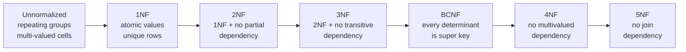
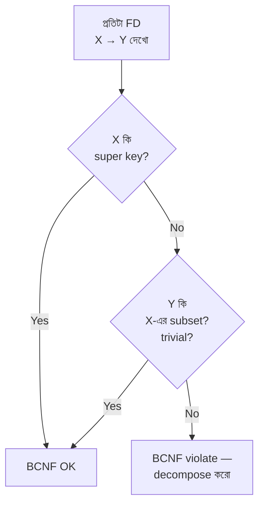
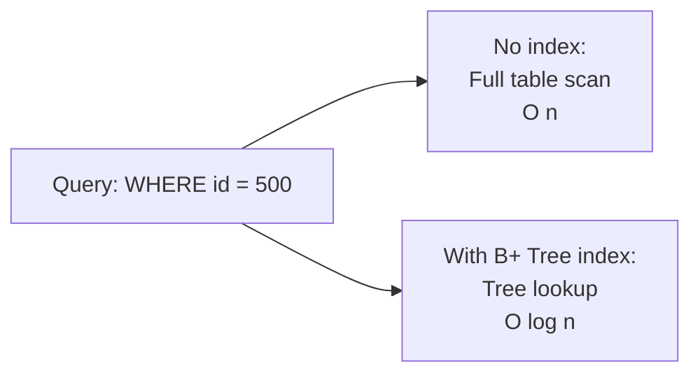
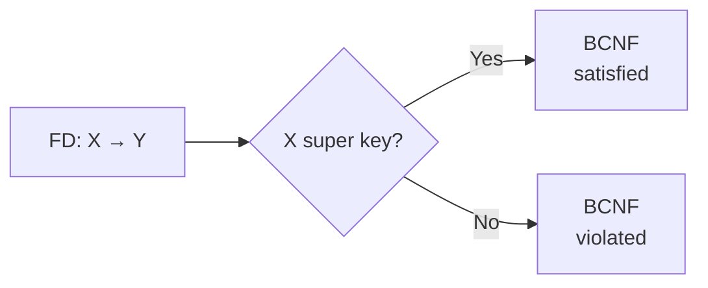
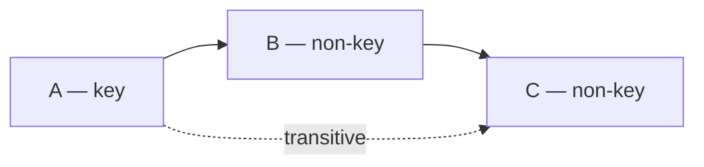
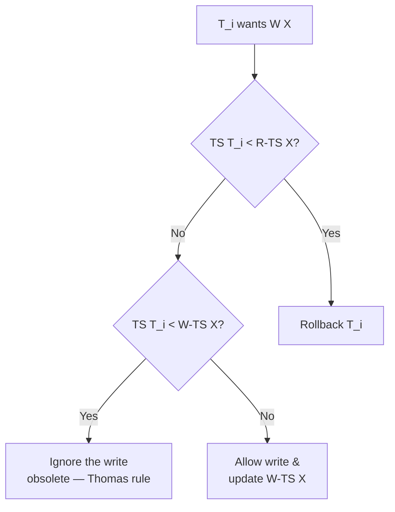

# Chapter 05 — Normalization & Functional Dependencies 🧹

> Functional Dependency (FD), Transitive Dependency, BCNF condition, এবং Indexing-related — Bank IT / BCS / NTRCA exam-এর জন্য ৪টা concept-heavy MCQ। Refresher-এ পুরো 1NF → 5NF journey।

---

## 📚 Concept Refresher (পড়ুন আগে)

### Normalization — কী এবং কেন

**Normalization** হলো একটা step-by-step process যা একটা বড় messy table-কে ছোট ছোট well-organized table-এ ভাগ করে। উদ্দেশ্য:

1. **Redundancy কমানো** — একই data বারবার store না করা
2. **Anomaly দূর করা** — Insert / Update / Delete-এর সময় inconsistency
3. **Data integrity বাড়ানো** — relationship গুলো সঠিক রাখা

### Anomaly Types (কেন normalize দরকার)

| Anomaly | কী হয় | উদাহরণ |
|---------|--------|---------|
| **Insertion Anomaly** | নতুন data ঢোকাতে গেলে অপ্রাসঙ্গিক column null দিতে হয় | নতুন department যোগ করতে চাই কিন্তু কোনো employee না থাকলে row-ই বানানো যায় না |
| **Update Anomaly** | একই value বহু জায়গায় থাকায় কোনো এক জায়গায় update missed হলে inconsistency | Employee-এর department name ১০টা row-তে আছে, ৯টা update হলো, ১টা miss — data inconsistent |
| **Deletion Anomaly** | একটা row delete করতে গেলে অন্য জরুরি info-ও হারিয়ে যায় | শেষ employee delete করলে পুরো department info-ই গায়েব |

### Functional Dependency (FD) — Notation

**X → Y** মানে: যদি X-এর value জানি, তাহলে Y-এর value uniquely determine করা যায়।

> **পড়ার ভাষায়:** "X determines Y" বা "Y is functionally dependent on X"।

উদাহরণ:
- `StudentID → Name` — student ID দিলে name unique
- `RollNo → Name, Department` — RollNo দিলে name আর department দুটোই determine হয়

#### FD-এর ধরন

| Type | মানে | উদাহরণ |
|------|------|---------|
| **Trivial** | Y ⊆ X (নিজেই নিজের subset) | `{A, B} → A` |
| **Non-trivial** | Y X-এর subset না | `StudentID → Name` |
| **Partial** | Y composite key-এর part-এর উপর depend করে | `(StudentID, CourseID) → StudentName` (StudentName শুধু StudentID-এর উপরে) |
| **Transitive** | A → B এবং B → C, তাই A → C (indirect) | `StudentID → DeptID → DeptName` |
| **Multivalued** | একটা value বহু independent value-কে imply করে | `Student →→ Hobby` |

### Normalization Progression



### প্রতিটা Normal Form — কী দূর করে

| Normal Form | Removes | এক লাইন উদাহরণ |
|-------------|---------|-----------------|
| **1NF** | Multi-valued / repeating groups | "Phones: 0171, 0181" এক cell-এ → আলাদা row বা table |
| **2NF** | Partial dependency (composite key-এর অংশ থেকে) | `(StudentID, CourseID) → StudentName` — StudentName শুধু StudentID-এর উপর depend, তাই Student আলাদা table-এ |
| **3NF** | Transitive dependency (non-key → non-key) | `StudentID → DeptID → DeptName` — DeptName-কে আলাদা Department table-এ সরাও |
| **BCNF** | যেকোনো FD যেখানে left side super key না | `Course → Instructor` — যদি Course super key না হয় তাহলে violate |
| **4NF** | Multivalued dependency (MVD) | Student-এর Hobby এবং Language independent — আলাদা করো |
| **5NF (PJNF)** | Join dependency | Lossless decomposition নিশ্চিত করা |

### BCNF — সবচেয়ে strict 3NF variant



> **3NF বনাম BCNF:** 3NF allow করে যদি Y prime attribute হয় (candidate key-এর part)। BCNF সেটা allow করে না — left side অবশ্যই super key হতে হবে।

### Indexing (bonus — Q29 কেন এখানে)

**Index** = একটা data structure (B-Tree, B+ Tree, Hash) যা table-এর কোনো column-এর উপর বানানো হয়, যাতে search / retrieve fast হয়। বইয়ের পেছনের index-এর মতো — পুরো বই না পড়ে directly page নম্বর জানা যায়।



> Indexing normalization-এর part না, কিন্তু performance optimization-এর জন্য জরুরি — তাই Bank IT / BCS exam-এ এক ঘরে পড়ে।

---

## 🎯 Question 29: ডাটা Retrieval-এর Mechanism

> **Question:** একটি ডাটাবেজ ফাইল থেকে দ্রুত ডাটা রিট্রিভ করার মেকানিজমকে কী বলা হয়?

- A) Normalizing
- B) Filtering
- C) Indexing ✅
- D) Hashing

**Solution: C) Indexing**

**ব্যাখ্যা:** ইনডেক্সিং হলো ডাটাবেজের এমন একটি স্ট্রাকচার যা কুয়েরি পারফরম্যান্স এবং সার্চিং স্পিড বহুগুণ বাড়িয়ে দেয়।

> **Note:** Hashing একটা special indexing technique (equality search-এ best), কিন্তু "ডাটা retrieval-এর general mechanism" হিসেবে answer **Indexing**। Normalization redundancy কমায়, retrieval speed না। Filtering = WHERE clause-এর কাজ, structure না।

**Memory hook:** বইয়ের পেছনের index দেখলে যেমন directly page নম্বর জানা যায়, database-এর index-ও exactly সেই কাজ করে। B-Tree, B+ Tree, Hash Index — সব এই category-তে।

---

## 🎯 Question 31: BCNF-এর প্রধান শর্ত

> **Question:** BCNF (Boyce-Codd Normal Form) হওয়ার প্রধান শর্ত কী?

- A) টেবিলে কোনো প্রাইমারি কি থাকা যাবে না
- B) প্রতিটি ফাংশনাল ডিপেন্ডেন্সি X → Y এর জন্য, X অবশ্যই একটি সুপার কি হতে হবে ✅
- C) ডাটা শুধুমাত্র টেক্সট হতে হবে
- D) টেবিলটি অবশ্যই 1NF এ থাকতে হবে

**Solution: B) প্রতিটি functional dependency X → Y এর জন্য, X অবশ্যই super key হতে হবে**

**ব্যাখ্যা:** BCNF-এ প্রতিটি ডিপেন্ডেন্সির ডিটারমিন্যান্টকে অবশ্যই একটি সুপার কি হতে হয়।

#### Formal definition

> একটি relation R **BCNF**-এ আছে যদি এর প্রতিটা non-trivial FD $X \rightarrow Y$ এর জন্য $X$ একটা **super key** হয়।



#### উদাহরণ

ধরুন একটা table — `Enrollment(StudentID, Course, Instructor)` যেখানে:
- `(StudentID, Course) → Instructor` (composite key → instructor)
- `Instructor → Course` (এক instructor একটাই course পড়ান)

দ্বিতীয় FD-তে `Instructor` super key না — তাই BCNF **violate**। সমাধান: `(Instructor, Course)` আর `(StudentID, Instructor)` — দুই table-এ ভাগ করো।

> **Trap:** Option D ("1NF-এ থাকতে হবে") আংশিক সত্য — BCNF হতে গেলে অবশ্যই 1NF হতে হবে, কিন্তু এটাই BCNF-এর **প্রধান শর্ত** না। Main condition হলো "every determinant is a super key"।

> **3NF বনাম BCNF মনে রাখার trick:** 3NF বলে "X super key **অথবা** Y prime attribute"। BCNF strict — শুধু "X super key"। তাই BCNF ⊂ 3NF (every BCNF table is also 3NF, but not vice versa)।

---

## 🎯 Question 51: Transitive Dependency

> **Question:** একটি রিলেশন R(A,B,C,D) তে যদি Functional Dependencies A→B এবং B→C থাকে, তবে A→C হওয়াকে কী বলা হয়?

- A) Trivial Dependency
- B) Transitive Dependency ✅
- C) Multivalued Dependency
- D) Partial Dependency

**Solution: B) Transitive Dependency**

**ব্যাখ্যা:** যদি একটি নন-কি অ্যাট্রিবিউট অন্য একটি নন-কি অ্যাট্রিবিউটের ওপর নির্ভর করে, তবে তাকে ট্রানজিটিভ ডিপেন্ডেন্সি বলে।

#### Visual



#### Real-world example

`Student(StudentID, DeptID, DeptName)` —
- `StudentID → DeptID` (direct)
- `DeptID → DeptName` (direct)
- তাহলে `StudentID → DeptName` **transitively** holds

এটা **3NF violate** করে। সমাধান: `Department(DeptID, DeptName)` কে আলাদা table-এ সরিয়ে নাও — Student table-এ শুধু `DeptID` foreign key রাখো।

#### সব dependency type-এর তুলনা

| Dependency | Pattern | Removed in |
|------------|---------|-----------|
| **Trivial** | $X \rightarrow Y$ যেখানে $Y \subseteq X$ | কখনো remove হয় না (always holds) |
| **Partial** | Composite key-এর part থেকে non-key | **2NF** |
| **Transitive** | Non-key → non-key (chain) | **3NF** |
| **Multivalued** | $X \twoheadrightarrow Y$ (independent multi-values) | **4NF** |

> **Note:** Armstrong-এর axiom-এ এটাকে **Transitivity rule** বলে — যদি $X \rightarrow Y$ এবং $Y \rightarrow Z$, তাহলে $X \rightarrow Z$।

---

## 🎯 Question 63: Thomas Write Rule

> **Question:** Thomas Write Rule নিচের কোনটির ওপর ভিত্তি করে কাজ করে?

- A) Normalization
- B) Timestamp Ordering ✅
- C) Locking
- D) Multi-versioning

**Solution: B) Timestamp Ordering**

**ব্যাখ্যা:** এটি টাইমস্ট্যাম্প অর্ডারিং প্রোটোকলের একটি মডিফিকেশন যা অপ্রয়োজনীয় রাইট অপারেশন এড়িয়ে চলে।

#### কী এই rule

Basic Timestamp Ordering Protocol-এ যদি একটা transaction $T_i$ একটা write করতে চায় কিন্তু তার timestamp `TS(T_i)` < `W-TS(X)` (অর্থাৎ পরের কেউ ইতিমধ্যে write করে ফেলেছে), তাহলে $T_i$ rollback হয়।

**Thomas Write Rule** smart twist করে — সে বলে: ঐ obsolete write-টা **ignore** করো (rollback লাগবে না), কারণ পরের write-ই তো final value।



#### Comparison: Basic TO vs Thomas Write Rule

| Scenario | Basic TO | Thomas Write Rule |
|----------|----------|-------------------|
| Late write (already overwritten) | **Rollback** | **Ignore** (no harm done) |
| Late read | Rollback | Rollback (same) |
| View serializability | শুধু conflict-serializable | View-serializable schedules-ও allow করে |

> **Trap:** Thomas Write Rule "Locking" না — এটা purely timestamp-based। Locking-এর সাথে গুলিয়ে ফেললে ভুল answer। Multi-versioning (MVCC) আলাদা concept যেখানে multiple version save করা হয়।

> **Memory hook:** "Thomas" — older write-কে **থামাস না**, ignore করো। নাম মনে রাখার trick।

---

## 📋 Quick Recap Table

| Concept | Key fact |
|---------|----------|
| Indexing | Data retrieval speed-এর mechanism (B-Tree, Hash) |
| 1NF | Atomic values, no repeating groups |
| 2NF | 1NF + no partial dependency |
| 3NF | 2NF + no transitive dependency |
| **BCNF** | Every FD-র determinant অবশ্যই super key |
| 4NF | No multivalued dependency |
| 5NF | No join dependency |
| Trivial FD | $Y \subseteq X$ |
| Transitive FD | $A \rightarrow B$ এবং $B \rightarrow C$ ⇒ $A \rightarrow C$ |
| Partial FD | Composite key-এর অংশ থেকে dependency |
| Multivalued FD | $X \twoheadrightarrow Y$ (independent) |
| Insertion anomaly | নতুন entry add করতে অপ্রাসঙ্গিক null লাগে |
| Update anomaly | Redundant copy update miss → inconsistency |
| Deletion anomaly | Row delete করলে অন্য info-ও যায় |
| Thomas Write Rule | Timestamp Ordering-এর modification (obsolete write ignore) |
| Armstrong's axioms | Reflexivity, Augmentation, Transitivity |

### BCNF decomposition mini-cheat

```text
Step 1: সব FD list করো
Step 2: প্রতিটার left side super key কিনা check করো
Step 3: না হলে সেই FD অনুযায়ী decompose:
        R → R1(X, Y)  + R2(X, R - Y)
Step 4: সব sub-relation-ই BCNF কিনা recheck করো
```

---

## 🔁 Next Chapter

পরের chapter-এ **Transactions, Concurrency Control & Recovery** — সবচেয়ে বড় chapter (১৬টা MCQ)। ACID detail, 2PL phases, Isolation levels, Deadlock prevention (Wait-Die / Wound-Wait), Log-based recovery, Checkpoint, MVCC — সব cover।

→ [Chapter 06: Transactions, Concurrency & Recovery](06-transactions-concurrency-recovery.md)
