# Chapter 06 — Transactions, Concurrency & Recovery 🔄

> ACID, Two-Phase Locking, Isolation levels, Deadlock prevention (Wait-Die / Wound-Wait), Timestamp Ordering, Log-based Recovery, Checkpoint, Shadow Paging, MVCC, BASE — Bank IT / BCS / NTRCA exam-এর সবচেয়ে dense topic। ১৬টা MCQ এই এক chapter-এ।

---

## 📚 Concept Refresher (পড়ুন আগে — এই chapter-এর foundation)

### Transaction — কী এবং কেন

**Transaction** = একগুচ্ছ database operation যা একটা logical unit হিসেবে execute হয়। হয় **পুরোটা succeed হবে**, নয়তো **কিছুই হবে না** — মাঝামাঝি অবস্থা allowed না।

**Classic example — Bank transfer:**

```text
BEGIN TRANSACTION
  UPDATE A SET balance = balance - 1000
  UPDATE B SET balance = balance + 1000
COMMIT
```

দুটো update একসাথে succeed হবে, নয়তো দুটোই rollback।

### ACID Properties — Banking Examples সহ

| Letter | Property | মানে | Banking example |
|--------|----------|------|-----------------|
| **A** | **Atomicity** | All or nothing | Debit হয়ে credit fail হলে debit-ও rollback |
| **C** | **Consistency** | Valid state থেকে valid state | মোট টাকা একই থাকবে — শুধু A থেকে B-তে move |
| **I** | **Isolation** | Concurrent txn একে অপরকে disturb করবে না | দুটো ATM একসাথে withdraw করলেও race condition হবে না |
| **D** | **Durability** | Commit হলে স্থায়ী | Power cut হলেও committed transfer থাকবে |

#### কে কোন mechanism use করে

| Property | Implementation mechanism |
|----------|--------------------------|
| Atomicity | Undo log + commit / rollback |
| Consistency | Constraints (PK, FK, CHECK) + triggers |
| **Isolation** | **Locking** (2PL) / Timestamp / MVCC |
| Durability | Write-Ahead Log (WAL) + flush to disk |

### Transaction States (lifecycle diagram)

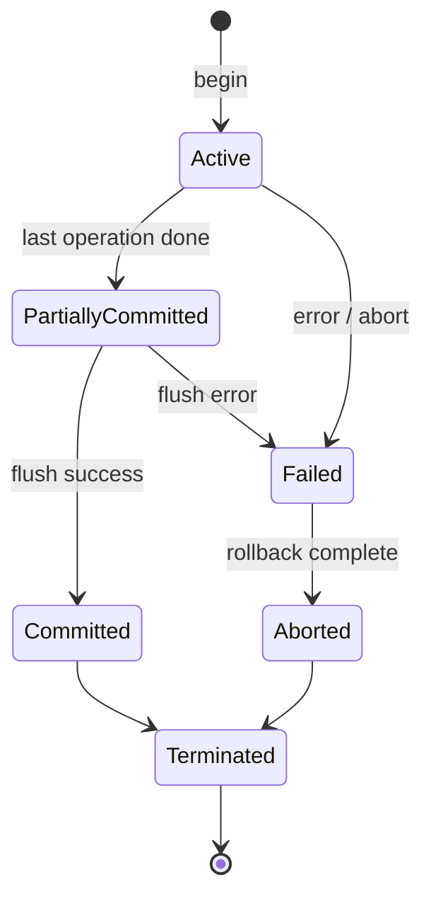

| State | কী হয় |
|-------|--------|
| **Active** | Transaction চলছে, operation execute হচ্ছে |
| **Partially Committed** | শেষ operation শেষ, কিন্তু এখনো disk-এ flush হয়নি |
| **Committed** | Successful — change permanent |
| **Failed** | কোনো error — আর এগোনো যাবে না |
| **Aborted** | Rollback সম্পন্ন — original state-এ ফিরেছে |
| **Terminated** | শেষ — committed বা aborted |

### Schedule Types

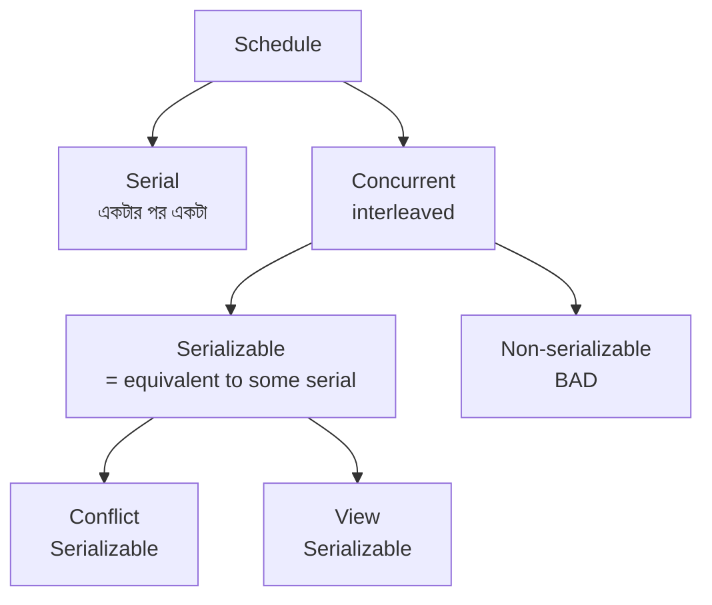

| Schedule type | বৈশিষ্ট্য |
|---------------|----------|
| **Serial** | Txn একটা শেষ হয়ে অন্যটা শুরু — slow but always correct |
| **Concurrent** | Operation interleaved — fast, কিন্তু safety check দরকার |
| **Conflict-Serializable** | Conflicting operation swap করে কোনো serial schedule বানানো যায় |
| **View-Serializable** | Final read/write outcome কোনো serial schedule-এর সমান (looser) |
| **Cascadeless** | Uncommitted txn-এর data অন্য txn read করে না |
| **Recoverable** | Txn $T_j$ যদি $T_i$-এর data পড়ে, তাহলে $T_i$ আগে commit হবে |

### Conflict Serializability — Precedence Graph

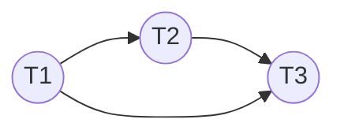

> **Rule:** Precedence graph-এ **cycle থাকলে** schedule conflict-serializable **না**। Cycle না থাকলে topological sort করে সমান serial order পাওয়া যায়।

### Two-Phase Locking (2PL) — Phases

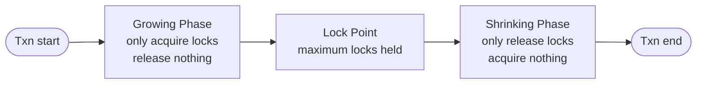

| Phase | কী allowed | কী allowed না |
|-------|------------|---------------|
| **Growing** | নতুন lock নেওয়া | কোনো lock release না |
| **Shrinking** | Lock release করা | নতুন lock না |

#### 2PL Variants

| Variant | বৈশিষ্ট্য | Cascading rollback prevent? |
|---------|----------|------------------------------|
| **Basic 2PL** | Growing + shrinking, lock যেকোনো সময় release | না |
| **Strict 2PL** | **Exclusive (X) lock** commit/abort পর্যন্ত hold | **হ্যাঁ** |
| **Rigorous 2PL** | **সব lock** (S + X) commit/abort পর্যন্ত hold | হ্যাঁ + serializable order = commit order |
| **Conservative 2PL** | শুরুতেই সব lock নেয় (predeclare) | Deadlock free |

> Conflict serializability **নিশ্চিত** করে — কিন্তু deadlock prevent করে **না** (Conservative ছাড়া)।

### Isolation Levels (SQL Standard)


| Level | Dirty Read | Non-repeatable Read | Phantom Read |
|-------|------------|---------------------|---------------|
| **Read Uncommitted** | ✅ ঘটে | ✅ ঘটে | ✅ ঘটে |
| **Read Committed** | ❌ prevent | ✅ ঘটে | ✅ ঘটে |
| **Repeatable Read** | ❌ prevent | ❌ prevent | ✅ ঘটে |
| **Serializable** | ❌ prevent | ❌ prevent | ❌ prevent |

| Anomaly | কী হয় | এক লাইন example |
|---------|--------|------------------|
| **Dirty Read** | Uncommitted data পড়া | T1 update করে commit করেনি, T2 সেই value পড়ল |
| **Non-repeatable Read** | একই row পরে read করলে value আলাদা | T1 row পড়ল, মাঝে T2 update commit করল, T1 আবার পড়লে নতুন value |
| **Phantom Read** | একই query-তে নতুন rows আসে | T1 `WHERE age>20` পড়ল, T2 row insert করল, T1 আবার করলে phantom |

### Deadlock — Detection / Prevention / Avoidance

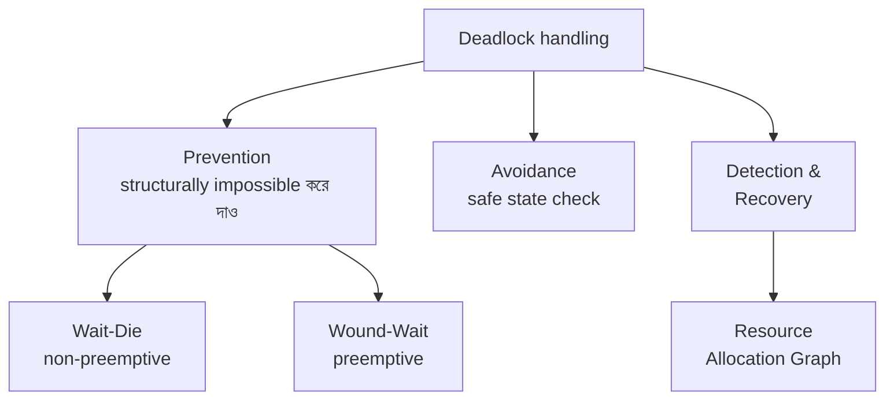

#### Wait-Die vs Wound-Wait (Timestamp-based prevention)

ধরুন $T_i$ একটা resource চায় যা $T_j$ hold করে আছে।

| Scheme | $T_i$ older ($TS_i < TS_j$) | $T_i$ younger ($TS_i > TS_j$) | Type |
|--------|------------------------------|--------------------------------|------|
| **Wait-Die** | $T_i$ wait করে | $T_i$ **die** (rollback) | Non-preemptive |
| **Wound-Wait** | $T_i$ **wound** $T_j$ (rollback করায়) | $T_i$ wait করে | Preemptive |

> **Memory hook:** **পুরনো শক্তিশালী**। Wait-Die-এ পুরনো wait করে (gentle), নতুন die করে। Wound-Wait-এ পুরনো wound করে নতুনকে (aggressive), নতুন wait করে।

#### Detection — Resource Allocation Graph (RAG)

- **Single-instance resource** → cycle = guaranteed deadlock
- **Multi-instance resource** → cycle = possible deadlock (need further check)

### Recovery — Log-Based + Checkpoint + ARIES

#### Log Record Structure

```text
<T_i, START>
<T_i, X, old_value, new_value>
<T_i, COMMIT>
<T_i, ABORT>
<CHECKPOINT, list_of_active_txns>
```

#### Recovery Operations

| Operation | কী করে | কখন |
|-----------|--------|------|
| **Undo** | Old value-তে ফিরিয়ে নিয়ে যায় | Crash-এ uncommitted txn |
| **Redo** | New value-তে আবার apply করে | Committed txn-এর change disk-এ পৌঁছায়নি |

#### Checkpoint — দরকার কেন

```mermaid
sequenceDiagram
    participant L as Log
    participant D as Disk
    Note over L,D: Without checkpoint → পুরো log scan লাগে
    Note over L,D: With checkpoint → শুধু checkpoint-এর পর scan
    L->>D: Flush all dirty pages
    L->>L: Write &lt;CHECKPOINT&gt; record
```

#### ARIES (Algorithm for Recovery and Isolation Exploiting Semantics)

ARIES তিন phase-এ কাজ করে:

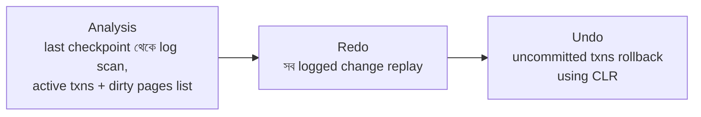

| Phase | কী হয় |
|-------|--------|
| **Analysis** | Last checkpoint থেকে log scan — কোন txn active, কোন pages dirty |
| **Redo** | Logged operation replay — disk-এ সব change apply |
| **Undo** | Uncommitted txn rollback (CLR — Compensation Log Records use করে) |

ARIES key features:
- **WAL (Write-Ahead Logging)** — disk-এ data write-এর আগে log write
- **Repeating history** during redo
- **Logging changes during undo** (CLR) — re-crash safe

### Concurrency Control Family (overview)

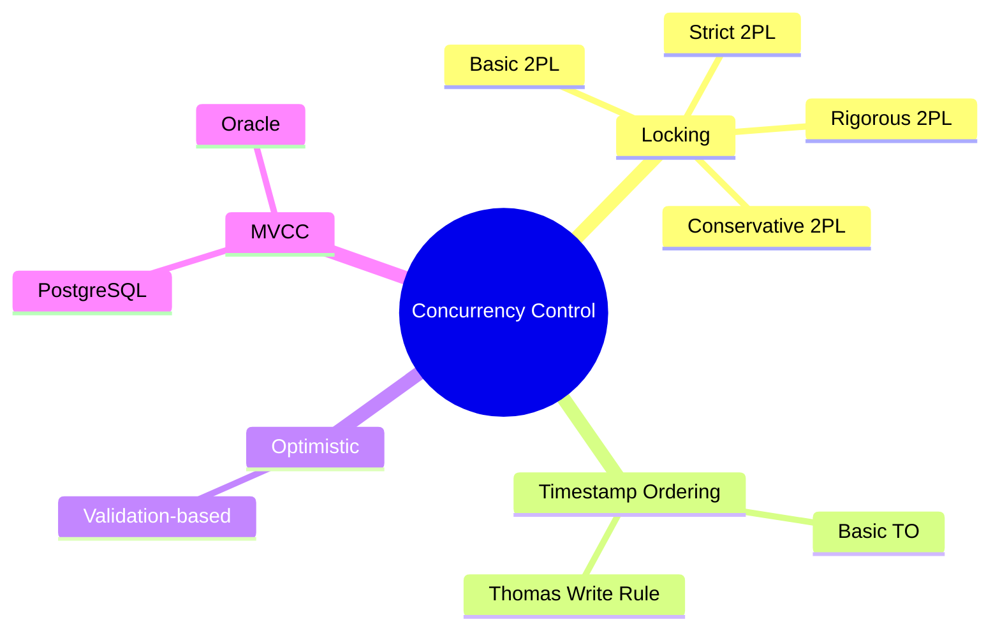

### BASE (NoSQL alternative to ACID)

| Letter | Meaning |
|--------|---------|
| **BA** | Basically Available |
| **S** | Soft state (state can change without input) |
| **E** | Eventually consistent |

ACID strict consistency vs BASE eventual consistency — distributed system-এ availability-র জন্য trade-off (CAP theorem)।

---

## 🎯 Question 1: Serializability + Deadlock Prevention Protocol

> **Question:** কোন কনকারেন্সি প্রোটোকল নিশ্চিত করে যে ট্রানজ্যাকশনগুলো সবসময় 'Serializable' হবে এবং ডেডলক প্রতিরোধ করবে?

- A) Strict 2PL
- B) Validation Based Protocol
- C) Two-Phase Locking (2PL)
- D) Timestamp Ordering Protocol ✅

**Solution: D) Timestamp Ordering Protocol**

**ব্যাখ্যা:** এটি ট্রানজ্যাকশন শুরুর সময়ের ওপর ভিত্তি করে অর্ডার নির্ধারণ করে যা ডেডলক প্রতিরোধ করে এবং সিরিয়ালাইজেশন নিশ্চিত করে।

> **Hint:** এমন একটি প্রোটোকল চিন্তা করুন যা ট্রানজ্যাকশনের সময় বা ঘড়ির কাটার ওপর নির্ভর করে।

#### কেন timestamp-based deadlock-free

প্রত্যেক transaction-কে শুরুতে একটা unique timestamp দেওয়া হয়। সব conflict timestamp order অনুযায়ী resolve হয় — তাই **circular wait** সম্ভব না (deadlock-এর প্রয়োজনীয় শর্ত)।

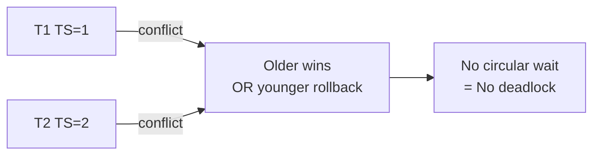

> **Trap:** 2PL (option C) serializability guarantee দেয় কিন্তু **deadlock prevent করে না**। Strict 2PL cascading rollback prevent করে কিন্তু deadlock-এর জন্যও solution না।

---

## 🎯 Question 25: Durability Property

> **Question:** ডাটাবেজ ট্রানজ্যাকশনের স্থায়িত্ব নিশ্চিত করে নিচের কোন প্রপার্টি?

- A) Consistency
- B) Atomicity
- C) Durability ✅
- D) Isolation

**Solution: C) Durability**

**ব্যাখ্যা:** ডিউরাবিলিটি নিশ্চিত করে যে একবার ট্রানজ্যাকশন সফল হলে ডাটাবেজে তার পরিবর্তন স্থায়ী হবে, এমনকি সিস্টেম ক্র্যাশ করলেও।

#### Durability কীভাবে implement হয়

```mermaid
sequenceDiagram
    participant T as Transaction
    participant L as Write-Ahead Log disk
    participant D as Data files disk
    T->>L: Write log record FIRST
    T->>L: COMMIT record
    Note over T,L: Now durable &mdash; survives crash
    L->>D: Flush dirty pages later (async OK)
```

**Write-Ahead Logging (WAL):** Data file-এ change লেখার **আগেই** log-এ change লেখা হয়। তাই crash হলে log থেকে redo করে data recover করা যায়।

> **Bangla mnemonic:** "Durability = **D**isk-এ **D**hara hoye ase" — disk-এ পাকাপাকি ভাবে আছে।

> **Trap:** Atomicity (B) "all or nothing" — durability না। Consistency (A) integrity rules। Isolation (D) concurrent txn-এর independence।

---

## 🎯 Question 38: Dirty Read হয় কোন Isolation Level-এ

> **Question:** ট্রানজ্যাকশনের কোন আইসোলেশন লেভেলে 'Dirty Read' হতে পারে?

- A) Repeatable Read
- B) Serializable
- C) Read Committed
- D) Read Uncommitted ✅

**Solution: D) Read Uncommitted**

**ব্যাখ্যা:** সবচেয়ে শিথিল লেভেল যেখানে ডার্টি রিড সম্ভব।

#### Dirty Read — exact scenario

```mermaid
sequenceDiagram
    participant T1
    participant DB
    participant T2
    T1->>DB: UPDATE balance = 5000 (uncommitted)
    T2->>DB: SELECT balance &rarr; reads 5000 (dirty!)
    T1->>DB: ROLLBACK
    Note over T2: T2 holds wrong value 5000
```

T1 commit-ই করল না, কিন্তু T2 ইতিমধ্যে সেই uncommitted value নিয়ে কাজ শুরু করেছে — disastrous।

#### Isolation Level Recap

| Level | Dirty Read | Performance |
|-------|------------|-------------|
| Read Uncommitted | ✅ allowed | দ্রুততম |
| Read Committed | ❌ blocked | Fast |
| Repeatable Read | ❌ blocked | Medium |
| Serializable | ❌ blocked | Slowest |

> **Note:** Read Uncommitted production-এ rarely use হয় — শুধু dirty / approximate reporting-এ যেখানে accuracy critical না।

---

## 🎯 Question 39: Log File-এর গুরুত্ব

> **Question:** ডাটাবেজ রিকভারির সময় 'Log' ফাইল কেন জরুরি?

- A) ট্রানজ্যাকশনের রেকর্ড রেখে সিস্টেম ক্র্যাশের পর রিকভার করার জন্য ✅
- B) ইউজারের পাসওয়ার্ড সেভ রাখার জন্য
- C) ডাটা কমপ্রেশন করার জন্য
- D) ইনডেক্সিং করার জন্য

**Solution: A) Transaction-এর record রেখে system crash-এর পর recover করার জন্য**

**ব্যাখ্যা:** লগ ফাইলে ডাটাবেজের সকল পরিবর্তনের রেকর্ড থাকে।

#### Log entry-এর সাধারণ structure

```text
<T1, START>
<T1, accountA, 10000, 9000>      // <txn, item, old_value, new_value>
<T1, accountB, 5000, 6000>
<T1, COMMIT>
```

Crash হলে recovery system এই log scan করে:
- **Committed txn** → Redo (যদি disk-এ flush না হয়)
- **Uncommitted txn** → Undo (rollback)

> **WAL principle:** "Log first, data later" — তাই log না থাকলে recovery অসম্ভব।

> **Note:** Password storage authentication system-এর কাজ, log-এর না। Compression / Indexing সম্পূর্ণ আলাদা concern।

---

## 🎯 Question 52: 2PL-এর Shrinking Phase

> **Question:** Two-Phase Locking (2PL) প্রোটোকলে 'Shrinking Phase' বলতে কী বোঝায়?

- A) ডাটাবেজের সাইজ কমানো হয়
- B) বিদ্যমান লকগুলো ছেড়ে দেওয়া হয় কিন্তু নতুন লক নেওয়া যায় না ✅
- C) ট্রানজ্যাকশনটি রোলব্যাক করা হয়
- D) নতুন লক গ্রহণ করা হয়

**Solution: B) বিদ্যমান lock গুলো release করা হয় কিন্তু নতুন lock নেওয়া যায় না**

**ব্যাখ্যা:** শ্রিনকিং ফেজ শুরু হলে ট্রানজ্যাকশন কেবল লক রিলিজ করতে পারে, নতুন কোনো লক রিকোয়েস্ট করতে পারে না।

#### 2PL-এর দুই phase visualize


```text
Lock count
   ▲
   │       ╱╲
   │      ╱  ╲     ← Lock Point (peak)
   │     ╱    ╲
   │    ╱      ╲
   │   ╱        ╲
   │__╱__________╲___▶ time
   Growing      Shrinking
```

#### কেন এই rule

যদি একটা txn lock release করে আবার নতুন lock নিতে পারত, তাহলে মাঝখানে অন্য txn data read/write করে inconsistency বানাতে পারত — **conflict serializability** ভেঙে যেত।

> **Trap:** "Database size কমানো" — সম্পূর্ণ অপ্রাসঙ্গিক option, "shrinking" শব্দটা শুনে confuse হলে ভুল হবে।

> **Note:** 2PL conflict serializability নিশ্চিত করে কিন্তু **deadlock-free না**। Conservative 2PL deadlock-free (একসাথে সব lock predeclare)।

---

## 🎯 Question 55: Deadlock Definition

> **Question:** একটি ট্রানজ্যাকশন $T_i$ যদি অন্য ট্রানজ্যাকশন $T_j$ এর লক করা ডাটার জন্য অপেক্ষা করে এবং $T_j$ আবার $T_i$ এর জন্য অপেক্ষা করে, তবে তাকে কী বলে?

- A) Deadlock ✅
- B) Isolation Failure
- C) Consistency Leak
- D) Starvation

**Solution: A) Deadlock**

**ব্যাখ্যা:** যখন দুই বা ততোধিক ট্রানজ্যাকশন একে অপরের রিসোর্সের জন্য বৃত্তাকারভাবে অপেক্ষা করে, তখন ডেডলক সৃষ্টি হয়।

#### Visual

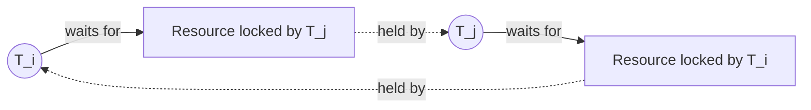

#### Deadlock-এর ৪টা শর্ত (Coffman conditions)

| # | Condition | মানে |
|---|-----------|------|
| 1 | **Mutual Exclusion** | Resource একসাথে এক txn-ই hold করে |
| 2 | **Hold and Wait** | একটা hold করে আরেকটার জন্য অপেক্ষা |
| 3 | **No Preemption** | জোর করে কেড়ে নেওয়া যায় না |
| 4 | **Circular Wait** | T1→T2→...→Tn→T1 |

চারটার মধ্যে একটা ভাঙলেও deadlock হবে না।

> **Trap:** **Starvation** ≠ deadlock। Starvation মানে একটা txn অনেকবার rollback হওয়ায় কখনোই succeed করতে পারছে না। Deadlock-এ সবাই stuck, starvation-এ একজন stuck।

> **Note:** Deadlock detection → Wait-for graph / RAG-এ cycle। Prevention → Wait-Die / Wound-Wait scheme।

---

## 🎯 Question 56: Redo Operation

> **Question:** Log-based Recovery তে 'Redo' অপারেশনের কাজ কী?

- A) নতুন ইউজার তৈরি করা
- B) পুরো ডাটাবেজ ডিলিট করা
- C) কমিটেড ট্রানজ্যাকশনের পরিবর্তনগুলো পুনরায় প্রয়োগ করা ✅
- D) অসম্পূর্ণ ট্রানজ্যাকশন বাতিল করা

**Solution: C) Committed transaction-এর change গুলো পুনরায় apply করা**

**ব্যাখ্যা:** যদি কোনো ট্রানজ্যাকশন কমিট হয় কিন্তু ডাটা ডিস্কে রাইট না হয়, তবে Redo সেটি নিশ্চিত করে।

#### Redo vs Undo — পার্থক্য

| | Redo | Undo |
|--|------|------|
| Target | **Committed** txn | **Uncommitted** txn |
| Action | New value আবার apply | Old value ফিরিয়ে আনা |
| Why | Commit হলেও disk-এ flush হয়নি | Crash-এর সময় চলছিল |

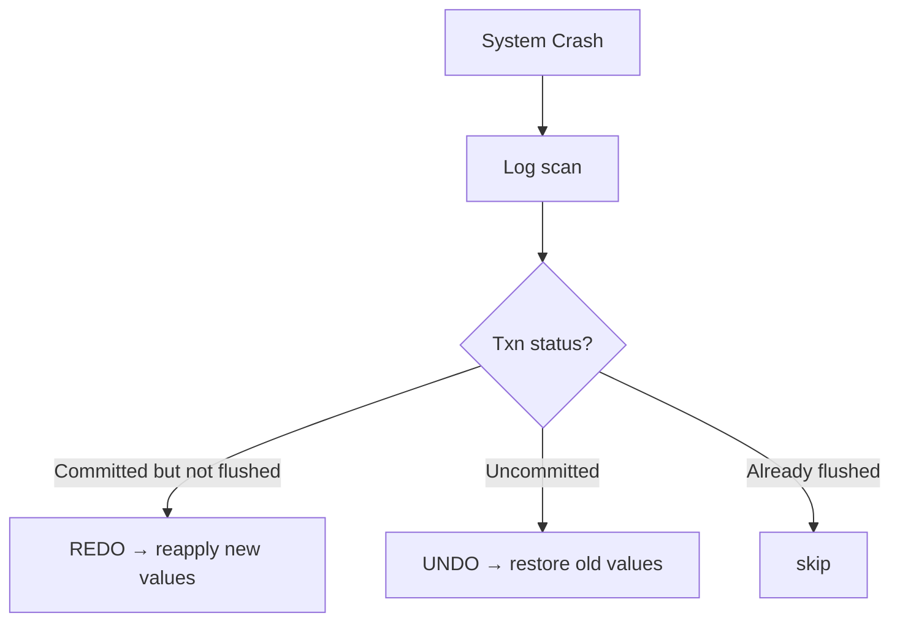

#### কখন Redo লাগবে — exact scenario

1. T1 successfully `COMMIT` করল
2. কিন্তু dirty page এখনো disk-এ flush হয়নি (memory-তে আছে)
3. System crash
4. Recovery: log-এ `<T1, COMMIT>` আছে, কিন্তু disk-এ change নেই → **Redo apply করতে হবে**

> **Trap:** D ("incomplete txn cancel") = Undo-র কাজ। Redo এর উল্টো — committed change reapply।

> **Memory hook:** **Re-do = আবার করা** = committed কাজ আবার apply। **Un-do = বাতিল** = uncommitted কাজ বাতিল।

---

## 🎯 Question 61: Strict 2PL-এর সুবিধা

> **Question:** Strict Two-Phase Locking (Strict 2PL) এর প্রধান সুবিধা কী?

- A) এটি কুয়েরি দ্রুত চালায়
- B) এটি 'Cascading Rollbacks' প্রতিরোধ করে ✅
- C) এটি ডেডলক মুক্ত
- D) এটি কোনো লক ব্যবহার করে না

**Solution: B) এটি Cascading Rollback prevent করে**

**ব্যাখ্যা:** ট্রানজ্যাকশন শেষ না হওয়া পর্যন্ত এক্সক্লুসিভ লক ধরে রাখায় অন্য কেউ ডাটা পড়তে পারে না, ফলে ক্যাসকেডিং এরর হয় না।

#### Cascading Rollback — কী জিনিস

```mermaid
sequenceDiagram
    participant T1
    participant T2
    participant T3
    T1->>T1: write X (uncommitted)
    T2->>T1: read X (dirty)
    T2->>T2: write Y
    T3->>T2: read Y
    T1->>T1: ROLLBACK
    Note over T2: T2 must rollback too
    Note over T3: T3 must rollback as well &mdash; cascade!
```

T1 fail হলে T2 ও T3-ও rollback করতে হবে — এটা **cascading rollback**, performance-killer।

#### Strict 2PL কীভাবে এটা ঠেকায়

```text
Strict 2PL Rule: সব EXCLUSIVE (X) lock commit/abort পর্যন্ত hold করতে হবে
```

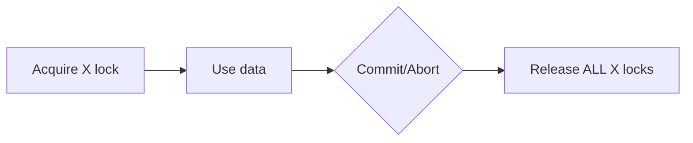

T1 commit না হওয়া পর্যন্ত T2 X-এ lock পাবে না → T2 dirty data পড়তে পারবে না → cascade impossible।

| 2PL variant | Cascading rollback prevents? | Deadlock-free? |
|-------------|------------------------------|----------------|
| Basic 2PL | ❌ | ❌ |
| **Strict 2PL** | **✅** | ❌ |
| Rigorous 2PL | ✅ | ❌ |
| Conservative 2PL | ✅ | ✅ |

> **Trap:** Option C ("deadlock free") ভুল — Strict 2PL deadlock prone। Conservative 2PL deadlock-free, কিন্তু Strict 2PL না।

---

## 🎯 Question 67: Phantom Read এবং Property

> **Question:** Phantom Read সমস্যাটি কোন প্রপার্টির অভাবের কারণে ঘটে?

- A) Atomicity
- B) Isolation ✅
- C) Durability
- D) Consistency

**Solution: B) Isolation**

**ব্যাখ্যা:** আইসোলেশন লেভেল পর্যাপ্ত না হলে এক ট্রানজ্যাকশনের ডাটা ইনসারশন অন্য ট্রানজ্যাকশনে ফ্যান্টম রো তৈরি করে।

#### Phantom Read — exact scenario

```mermaid
sequenceDiagram
    participant T1
    participant DB
    participant T2
    T1->>DB: SELECT * WHERE age > 20  &rarr; 5 rows
    T2->>DB: INSERT new row age=25
    T2->>DB: COMMIT
    T1->>DB: SELECT * WHERE age > 20  &rarr; 6 rows!
    Note over T1: Phantom row appeared
```

T1 একই query দু-বার করল, প্রথমবার ৫ rows পেল, দ্বিতীয়বার ৬ — মাঝে T2 নতুন row insert করেছিল। সেই extra row-কে **phantom** বলে।

#### Phantom Read prevent কীভাবে

| Isolation Level | Phantom Read |
|-----------------|--------------|
| Read Uncommitted | ✅ ঘটে |
| Read Committed | ✅ ঘটে |
| Repeatable Read | ✅ ঘটে (MySQL ব্যতিক্রম — RR-ই block করে) |
| **Serializable** | ❌ block |

**Range lock** বা **predicate lock** use করে serializable level phantom prevent করে।

> **Trap:** Atomicity all-or-nothing, durability persistence — phantom read-এর সাথে এদের সম্পর্ক নেই। Isolation যথেষ্ট না হলে concurrent insert visible হয়, তাই answer Isolation।

---

## 🎯 Question 69: Shadow Paging-এর সমস্যা

> **Question:** Shadow Paging রিকভারি টেকনিকের প্রধান সমস্যা কোনটি?

- A) এটি ডাটা রিকভার করতে পারে না
- B) এটি অনেক দ্রুত
- C) লগ ফাইলের সাইজ বেড়ে যায়
- D) Data Fragmentation ✅

**Solution: D) Data Fragmentation**

**ব্যাখ্যা:** শ্যালো পেজিংয়ে ডাটা ডিস্কের বিভিন্ন জায়গায় ছড়িয়ে যায়, ফলে ফ্র্যাগমেন্টেশন বেড়ে যায়।

#### Shadow Paging — কীভাবে কাজ করে

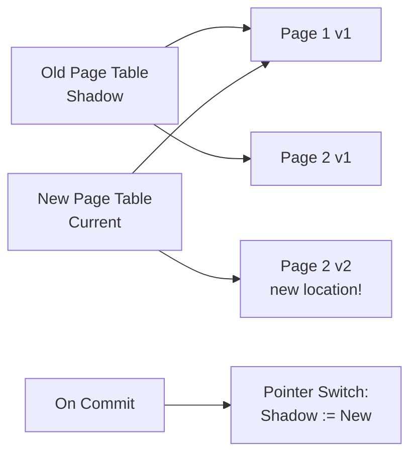

Updated page **নতুন location**-এ লেখা হয়, পুরনোটা untouched (shadow)। Commit হলে pointer switch — atomic operation। Crash হলে shadow page table-ই active থাকে → automatic recovery।

#### সুবিধা এবং অসুবিধা

| ✅ Pros | ❌ Cons |
|---------|---------|
| No undo / redo log লাগে | **Fragmentation** — page গুলো ছড়িয়ে যায় |
| Recovery fast (just pointer switch) | Garbage collection দরকার |
| No log overhead | Concurrent transaction-এ extend করা কঠিন |

> **Trap:** "Log file size বেড়ে যায়" (option C) — Shadow Paging-এ তো log-ই থাকে না! তাই এটা ভুল। মূল সমস্যা **disk fragmentation**।

> **Why fragmentation:** নতুন version আলাদা location-এ লেখার ফলে original-এর পাশে contiguous space ব্যবহার হয় না — disk-এ scattered data → sequential read slow।

---

## 🎯 Question 72: Wait-Die Scheme

> **Question:** ট্রানজ্যাকশন ম্যানেজমেন্টে 'Wait-Die' স্কিম ডেডলক প্রতিরোধে কীভাবে কাজ করে?

- A) তরুণ ট্রানজ্যাকশনটি বয়স্ক ট্রানজ্যাকশনের জন্য অপেক্ষা করে
- B) উভয়ই অনির্দিষ্টকাল অপেক্ষা করে
- C) সবসময় পুরনো ট্রানজ্যাকশনটি বাতিল হয়
- D) বয়স্ক ট্রানজ্যাকশন অপেক্ষা করে, কিন্তু তরুণ ট্রানজ্যাকশনটি রোলব্যাক (Die) হয়ে যায় ✅

**Solution: D) বয়স্ক wait করে, কিন্তু তরুণ rollback (Die) হয়ে যায়**

**ব্যাখ্যা:** Wait-Die একটি নন-প্রিম্পটিভ স্কিম যেখানে পুরনো ট্রানজ্যাকশন অপেক্ষা করার অনুমতি পায় কিন্তু নতুনটি মারা যায়।

#### Rule (memorize এই table)

ধরুন $T_i$ resource চায় যা $T_j$ hold করে আছে।

| Scheme | $TS(T_i) < TS(T_j)$ (Ti older) | $TS(T_i) > TS(T_j)$ (Ti younger) |
|--------|-------------------------------|----------------------------------|
| **Wait-Die** | $T_i$ waits | $T_i$ **dies** (rollback) |
| **Wound-Wait** | $T_i$ wounds $T_j$ | $T_i$ waits |

#### Visual

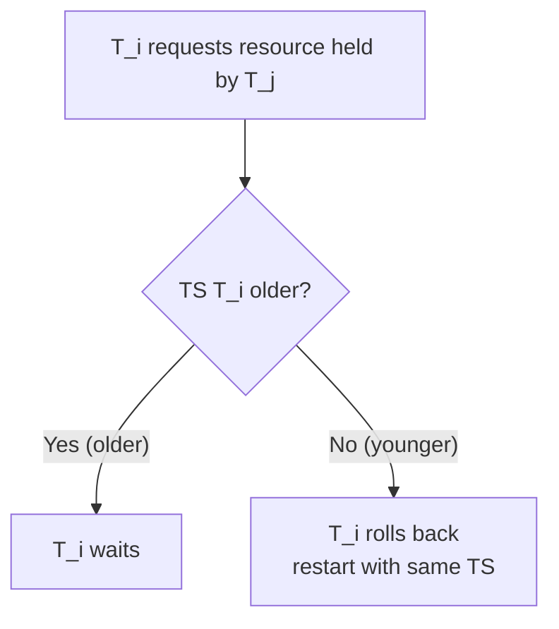

#### কেন starvation হয় না

Rolled-back transaction একই **original timestamp** নিয়ে restart হয় — সময়ের সাথে সাথে সে older হতে থাকে, eventually wait privilege পাবে। তাই permanent starvation impossible।

#### Wait-Die vs Wound-Wait — কোনটা কখন বেশি rollback করে

| Wait-Die | Wound-Wait |
|----------|-----------|
| Younger txn rollback (অনেক বার) | Younger txn waits (less rollback) |
| Non-preemptive | Preemptive (force kill older holder's victim) |
| বেশি rollback overhead | কম rollback, কিন্তু বেশি interruption |

> **Memory hook:** **Wait-Die** মানে — older "wait" করে, younger "die" করে। Wound-Wait উল্টো — older "wound" করে, younger "wait" করে। দুটোই **older = privileged**।

> **Trap:** Option A বলে "তরুণ wait করে" — উল্টো। Option C বলে "পুরনো বাতিল" — উল্টো। সঠিক: পুরনো বাঁচে, নতুন মরে (কারণ পুরনো restart করলে আবার younger হয়ে আবার die হবে — fairness নেই)।

---

## 🎯 Question 76: Precedence Graph-এ Cycle

> **Question:** SQL-এ 'Conflict Serializability' চেক করার জন্য প্রেসিডেন্স গ্রাফে (Precedence Graph) সাইকেল থাকলে কী বোঝায়?

- A) শিডিউলটি সিরিয়ালাইজেবল
- B) ডেডলক হয়েছে
- C) শিডিউলটি সিরিয়ালাইজেবল নয় ✅
- D) ডাটাবেজ ক্র্যাশ করেছে

**Solution: C) Schedule-টি serializable নয়**

**ব্যাখ্যা:** গ্রাফে সাইকেল থাকা মানে ট্রানজ্যাকশনগুলোর মধ্যে কনফ্লিক্টিং অপারেশনের লুপ তৈরি হওয়া।

#### Precedence Graph — কীভাবে বানাবো

1. Vertex = প্রতিটা transaction
2. Edge $T_i \rightarrow T_j$ = $T_i$-এর কোনো operation $T_j$-এর conflicting operation-এর **আগে** এসেছে (একই data item-এ এবং অন্তত একটা write)

#### Conflicting operation pairs (একই item-এ)

| Op1 | Op2 | Conflict? |
|-----|-----|-----------|
| Read | Read | ❌ |
| Read | Write | ✅ |
| Write | Read | ✅ |
| Write | Write | ✅ |

#### Cycle = Non-serializable

```mermaid
flowchart LR
    T1((T1)) --> T2((T2))
    T2 --> T3((T3))
    T3 --> T1
```

T1 → T2 → T3 → T1 — cycle। মানে T1 must come before T1 (নিজের আগে নিজে!) — impossible serial order। তাই **conflict-serializable না**।

#### Cycle না থাকলে

DAG → topological sort → equivalent serial order পাওয়া যায়। যেমন T1 → T2 → T3 sort করলে serial order: T1, T2, T3।

> **Trap:** "Deadlock" (option B) আলাদা concept — deadlock detection-এ **Wait-for graph** use হয়, **Precedence graph** না।

> **Note:** Conflict serializability ⊂ View serializability। যদি conflict-serializable হয়, তাহলে অবশ্যই view-serializable। উল্টোটা সবসময় না।

---

## 🎯 Question 78: Checkpoint-এর উদ্দেশ্য

> **Question:** Recovery Management-এ 'Checkpoint' কেন ব্যবহার করা হয়?

- A) নতুন ডাটা ইনসার্ট করতে
- B) ইন্ডেক্স আপডেট করতে
- C) রিকভারির সময় পুরো লগ ফাইল স্ক্যান করার প্রয়োজন কমানোর জন্য ✅
- D) পাসওয়ার্ড রিসেট করতে

**Solution: C) Recovery-র সময় পুরো log file scan করার দরকার কমানোর জন্য**

**ব্যাখ্যা:** চেকপয়েন্ট পর্যন্ত ডাটা নিরাপদ থাকে, তাই এর আগের লগ পড়ার দরকার পড়ে না।

#### Checkpoint কীভাবে কাজ করে

```mermaid
sequenceDiagram
    participant Memory
    participant Log
    participant Disk
    Note over Memory,Disk: Periodic checkpoint
    Memory->>Disk: Flush all dirty pages
    Memory->>Log: Write &lt;CHECKPOINT, active_txns&gt; record
    Note over Log: Now &mdash; safe boundary
```

#### Recovery efficiency

```text
Without checkpoint:
  Crash → scan ENTIRE log from beginning (could be GB)

With checkpoint at time T:
  Crash → scan log only AFTER T (much smaller)
```

```mermaid
flowchart LR
    Start([Log start]) --> CP1[Checkpoint t=100]
    CP1 --> CP2[Checkpoint t=500]
    CP2 --> CR[Crash t=520]
    CR -. recovery scans only this .-> CP2
```

#### Recovery procedure with checkpoint

1. Log-এ সর্বশেষ `<CHECKPOINT>` record খুঁজে বের করো
2. সেই checkpoint-এ active txn list পড়ো
3. শুধু checkpoint-এর পর থেকে log scan করো:
   - Committed → Redo
   - Uncommitted → Undo

> **Note:** Fuzzy checkpoint = system busy থাকা অবস্থায়ও checkpoint নেওয়া যায় (no need to halt all txns)। ARIES এই fuzzy checkpoint use করে।

> **Trap:** Checkpoint-এর সাথে indexing / password / data insertion-এর কোনো সম্পর্ক নেই। সম্পূর্ণ recovery optimization-এর জন্য।

---

## 🎯 Question 79: BASE Property-এ 'S'

> **Question:** NoSQL ডাটাবেজের 'BASE' প্রপার্টিতে 'S' দিয়ে কী বোঝায়?

- A) Strict Consistency
- B) Soft State ✅
- C) Secure Socket
- D) Static Storage

**Solution: B) Soft State**

**ব্যাখ্যা:** এর অর্থ হলো ডাটাবেজের স্টেট ইনপুট ছাড়াও নেটওয়ার্ক আপডেটের মাধ্যমে সময়ের সাথে পরিবর্তিত হতে পারে।

#### BASE — full breakdown

| Letter | Meaning | মানে |
|--------|---------|------|
| **BA** | **Basically Available** | সবসময় available থাকবে (কিছু operation fail হতে পারে কিন্তু whole system down হবে না) |
| **S** | **Soft state** | State input ছাড়াও বদলাতে পারে (replication / convergence-এর কারণে) |
| **E** | **Eventually consistent** | কিছু সময় পর সব replica একই value-তে converge হবে |

#### ACID vs BASE

```mermaid
flowchart LR
    A[ACID<br/>Strong consistency<br/>RDBMS] --- T[Trade-off]
    T --- B[BASE<br/>Eventual consistency<br/>NoSQL distributed]
```

| Aspect | ACID | BASE |
|--------|------|------|
| Consistency | Strong, immediate | Eventual |
| Availability | May sacrifice | High priority |
| Partition tolerance | Limited | Designed for it |
| Use case | Bank, finance | Social media, analytics, web scale |

#### CAP Theorem — কেন BASE দরকার

> **CAP:** Consistency, Availability, Partition tolerance — তিনটার মধ্যে একসাথে দুটোই পেতে পারো (network partition হলে)।

- ACID = CP (consistency over availability)
- BASE = AP (availability over strict consistency)

> **Trap:** "Strict Consistency" (option A) — BASE-এর exact বিপরীত। "Secure Socket" (SSL) আলাদা concept।

> **Real example:** DNS, social media feed, Cassandra, DynamoDB — সব eventually consistent। তুমি Facebook-এ post করার পর সেটা সবার feed-এ একই মুহূর্তে show না-ও হতে পারে — কিছু সেকেন্ড পর সবাই দেখবে। এটাই BASE।

---

## 🎯 Question 81: MVCC-এর মূল সুবিধা

> **Question:** Multiversion Concurrency Control (MVCC) এর মূল সুবিধা কোনটি?

- A) রিডাররা রাইটারদের ব্লক করে না এবং রাইটাররা রিডারদের ব্লক করে না ✅
- B) এটি অটোমেটিক টেবিল ডিলিট করে
- C) এটি লক প্রোটোকলের চেয়ে সহজ
- D) এটি মেমোরি কম ব্যবহার করে

**Solution: A) Reader-রা writer-কে block করে না এবং writer-রা reader-কে block করে না**

**ব্যাখ্যা:** প্রতিটি ট্রানজ্যাকশন ডাটার একটি স্ন্যাপশট দেখে, ফলে রিড এবং রাইট একই সাথে চলতে পারে।

#### MVCC কীভাবে কাজ করে

```mermaid
flowchart LR
    Wr[Writer T1<br/>creates new version v2]
    Old[v1 - committed<br/>visible to old readers]
    New[v2 - new]

    Wr --> New
    Old -. T2, T3 reading old snapshot .-> Reader1((T2))
    Old -.-> Reader2((T3))
```

প্রতিটা transaction শুরুতে একটা **snapshot timestamp** পায়। সে শুধু সেই snapshot-এর অনুসারে committed version-ই দেখে। Writer যখন update করে, সে নতুন version বানায় — পুরনোটা untouched।

#### Lock-based vs MVCC

| Aspect | Lock-based (2PL) | MVCC |
|--------|------------------|------|
| Reader blocks writer? | ✅ Yes (S blocks X) | ❌ No |
| Writer blocks reader? | ✅ Yes | ❌ No |
| Writer blocks writer? | ✅ Yes | ✅ Yes (one version at a time) |
| Read consistency | Strong | Snapshot consistency |
| Storage overhead | Less | More (multiple versions) |

#### Real DBMS using MVCC

| Database | MVCC implementation |
|----------|---------------------|
| **PostgreSQL** | Tuple visibility via xmin/xmax |
| **Oracle** | Undo segments |
| **MySQL InnoDB** | Hidden columns + undo log |
| **SQL Server** | Snapshot Isolation level |

#### সুবিধা সারমর্ম

- Read-heavy workload-এ massively faster
- Long-running analytics query other writes block করে না
- Snapshot isolation দেয় without lock contention

> **Trap:** Option D ("less memory") ভুল — MVCC বরং multiple version রাখায় **বেশি** memory লাগে। Option C ("simpler") ভুল — MVCC actually লক protocol-এর চেয়ে complex (version cleanup, vacuum দরকার)।

> **Note:** Writer-Writer conflict MVCC-তেও থাকে — দুজন একই row update করতে চাইলে একজন wait করবে বা rollback হবে।

---

## 🎯 Question 87: Resource Allocation Graph-এ Cycle

> **Question:** Deadlock Detection পদ্ধতিতে 'Resource Allocation Graph' এ সাইকেল থাকার মানে কী?

- A) মেমোরি ফুল হয়ে গেছে
- B) সিস্টেমটি নিরাপদ
- C) ডেডলক হওয়ার সম্ভাবনা বা অস্তিত্ব আছে ✅
- D) সব ট্রানজ্যাকশন শেষ হয়েছে

**Solution: C) Deadlock হওয়ার সম্ভাবনা বা অস্তিত্ব আছে**

**ব্যাখ্যা:** সিঙ্গেল ইউনিট রিসোর্স হলে সাইকেল মানেই ডেডলক, মাল্টিপল হলে এটি ডেডলকের সম্ভাবনা।

#### RAG — কী জিনিস

Vertex দু-ধরনের:
- **Process / Transaction** — circle ⭕
- **Resource** — square ⬛

Edge দু-ধরনের:
- **Request edge** — Process → Resource (চাইছে)
- **Assignment edge** — Resource → Process (allocate করা আছে)

#### Single-instance vs Multi-instance

```mermaid
flowchart LR
    T1((T1)) --> R1[R1] --> T2((T2)) --> R2[R2] --> T1
```

**Single-instance** (প্রতিটা resource-এ একটাই copy): Cycle = **guaranteed deadlock**

**Multi-instance** (resource-এ multiple copy): Cycle = **possible deadlock** (দরকার আরও check)

| Resource type | Cycle exists | Deadlock? |
|---------------|--------------|-----------|
| Single-instance | ✅ | Definitely deadlock |
| Multi-instance | ✅ | Possibly deadlock (Banker's algorithm দিয়ে verify) |
| Either | ❌ | No deadlock |

#### Real DBMS — Wait-for Graph (simplified RAG)

DBMS-এ সাধারণত resource node বাদ দিয়ে শুধু txn-এর মধ্যে edge রাখা হয় — **Wait-for graph**।

```mermaid
flowchart LR
    T1((T1)) -- waits for --> T2((T2))
    T2 -- waits for --> T3((T3))
    T3 -- waits for --> T1
```

Cycle থাকলে → deadlock detected → একজন victim choose করে rollback।

#### Victim selection criteria

| Factor | Choose this txn |
|--------|------------------|
| Smallest cost | Least work done |
| Newest | Younger ones (less invested) |
| Holds fewest locks | Less impact to release |
| Already rolled back many times | Avoid (starvation প্রতিরোধ) |

> **Trap:** "System safe" (B) — উল্টো! Cycle থাকলে unsafe। "All txns finished" (D) — সম্পূর্ণ অপ্রাসঙ্গিক।

> **Note:** **Single-instance resource = lock**। DBMS-এ প্রতিটা data item lock single-instance — তাই RAG-এ cycle = guaranteed deadlock। তাই DBMS detection always strict।

---

## 📋 Quick Recap Table

| Concept | Key fact |
|---------|----------|
| **ACID** | Atomicity, Consistency, Isolation, Durability |
| Atomicity mechanism | Undo log + commit/rollback |
| Isolation mechanism | Locking / Timestamp / MVCC |
| Durability mechanism | WAL + flush to disk |
| Transaction states | Active → Partially Committed → Committed/Failed → Aborted → Terminated |
| **2PL phases** | Growing (acquire only) → Lock point → Shrinking (release only) |
| Strict 2PL | X locks held until commit/abort — prevents cascading rollback |
| Rigorous 2PL | All locks until commit — strongest |
| Conservative 2PL | Predeclare all locks — only deadlock-free 2PL |
| Timestamp Ordering | Deadlock-free, ensures serializability |
| Thomas Write Rule | TO modification — ignore obsolete writes |
| **MVCC** | Readers don't block writers and vice versa (snapshots) |
| **Wait-Die** | Older waits, younger dies (non-preemptive) |
| **Wound-Wait** | Older wounds younger, younger waits (preemptive) |
| Deadlock 4 conditions | Mutual exclusion, Hold-and-wait, No preemption, Circular wait |
| Read Uncommitted | Dirty Read possible |
| Read Committed | No dirty read, but non-repeatable + phantom |
| Repeatable Read | No dirty + non-repeatable, but phantom possible |
| Serializable | All 3 anomalies blocked |
| **Phantom Read** | Caused by insufficient Isolation |
| **Precedence graph cycle** | Schedule **NOT** conflict-serializable |
| **RAG cycle** | Possible/guaranteed deadlock (depends on instance count) |
| **Log file** | Redo + Undo for crash recovery |
| **Redo** | Reapply committed changes (not yet flushed) |
| **Undo** | Restore old values for uncommitted txns |
| **Checkpoint** | Reduces log scan during recovery |
| **Shadow Paging** | No log, but causes fragmentation |
| ARIES | Analysis → Redo → Undo (with WAL + CLR) |
| **BASE** | Basically Available, Soft state, Eventually consistent (NoSQL) |
| CAP theorem | C + A + P — pick any 2 |

### Decision Cheat Sheet

```text
Deadlock-free + serializable?    → Timestamp Ordering / Conservative 2PL
Cascading rollback prevention?   → Strict 2PL / Rigorous 2PL
Best for read-heavy workload?    → MVCC
Phantom read prevention?          → Serializable isolation
Crash with committed changes?    → Redo
Crash with uncommitted changes?  → Undo
Reduce recovery time?             → Checkpoint
Older priority for prevention?   → Wait-Die / Wound-Wait
```

### One-Page Mindmap

```mermaid
mindmap
  root((Transactions))
    ACID
      Atomicity
      Consistency
      Isolation
      Durability
    Concurrency Control
      Locking
        2PL
        Strict 2PL
        Rigorous
        Conservative
      Timestamp
        Basic TO
        Thomas Rule
      MVCC
      Optimistic
    Isolation Levels
      Read Uncommitted
      Read Committed
      Repeatable Read
      Serializable
    Deadlock
      Prevention
        Wait-Die
        Wound-Wait
      Detection
        RAG cycle
        Wait-for graph
    Recovery
      Log-based
        Undo
        Redo
      Checkpoint
      Shadow Paging
      ARIES
    NoSQL
      BASE
      CAP
```

---

## 🔁 Next Chapter

পরের chapter-এ **Indexing & Storage** — B-Tree, B+ Tree, Hash Index, Clustered vs Non-clustered, Storage hierarchy, RAID — Bank IT exam-এ দ্বিতীয় বড় টপিক।

→ [Chapter 07: Indexing & Storage](07-indexing-storage.md)
