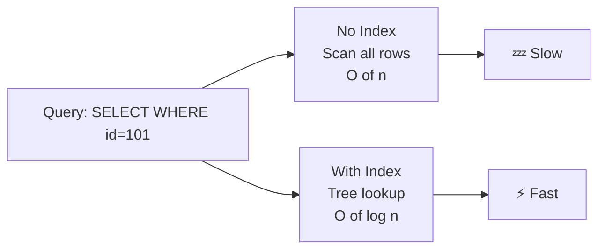
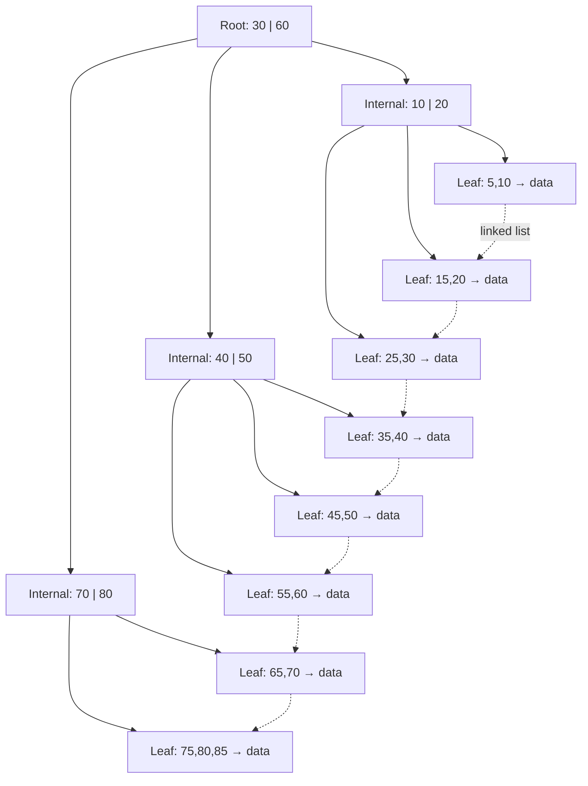
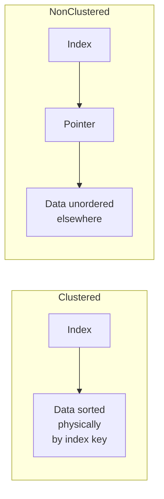
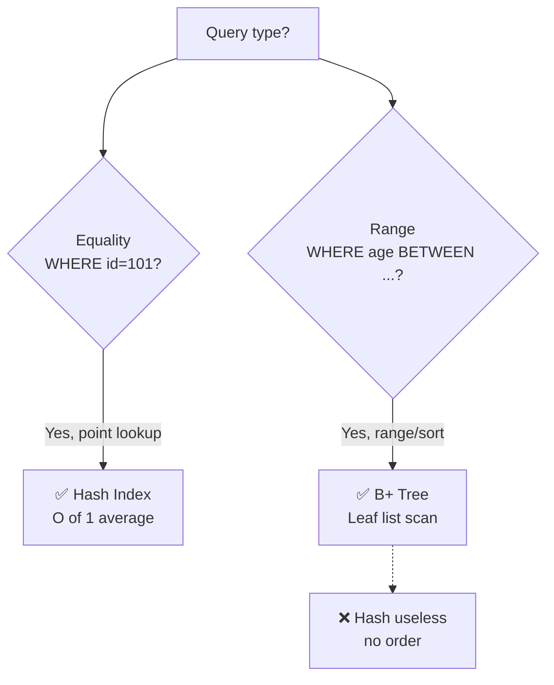
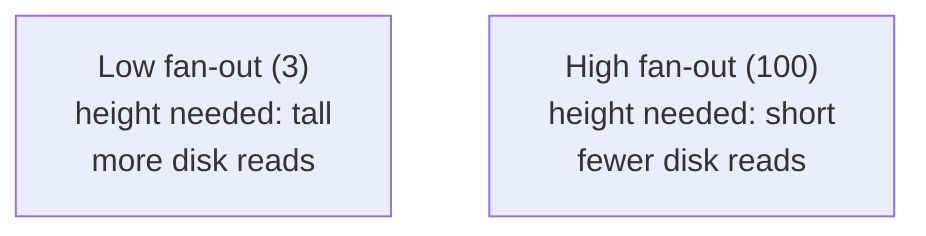

# Chapter 07 — Indexing & Storage 🌳

> B-tree vs B+ tree, Clustered/Non-clustered Index, Primary/Secondary Index, Dense/Sparse, Hash Index, Fan-out, Window Functions — ৬টা storage-layer MCQ।

---

## 📚 Concept Refresher (পড়ুন আগে)

### Indexing — মূল idea

Database-এ ডাটা বেশি হলে full table scan অনেক slow হয়ে যায়। **Index** হলো একটা auxiliary data structure যেটা book-এর "index page"-এর মতো কাজ করে — কোন record disk-এর কোথায় আছে সেটা দ্রুত বলে দেয়।



### B-tree vs B+ tree — সবচেয়ে বড় trap

দেখতে প্রায় একই, কিন্তু **data কোথায় থাকে** সেখানেই পার্থক্য।

| Aspect | **B-tree** | **B+ tree** |
|--------|------------|-------------|
| Data location | Internal + Leaf — সব node-এ data থাকে | **শুধু Leaf node-এ** data/pointer |
| Internal node | Key + Data + Pointer | শুধু Key + Pointer (router) |
| Leaf node link | Independent | **Linked list** (sequential traverse) |
| Range query | Slow (tree walk multiple times) | **Fast** (leaf list scan) |
| Sequential access | Difficult | Built-in via leaf links |
| DBMS choice | Older systems | **Almost all modern DBMS** (MySQL InnoDB, PostgreSQL) |

### B+ Tree Structure (visualize করুন)



লক্ষ করুন: **Internal node-এ শুধু key (router)**, **Leaf-এ actual data/pointer + horizontal linked list**। ফলে `BETWEEN 25 AND 60` query করলে — শুধু একবার tree walk → leaf থেকে linked list ধরে scan।

### Index Types — Multi-axis classification

ইন্ডেক্স ক্লাসিফাই হয় তিন ভাবে — physical ordering, key uniqueness, density। নিচের তিনটা table এক সাথে মাথায় রাখুন।

#### 1. Primary vs Secondary Index

| | **Primary Index** | **Secondary Index** |
|--|-------------------|---------------------|
| Built on | Primary key column | Non-key column |
| File ordered? | **হ্যাঁ** — file already sorted on this key | না — file অন্য order-এ |
| Count per table | মাত্র ১টা | একাধিক |
| Density | সাধারণত sparse | সাধারণত dense |

#### 2. Clustered vs Non-clustered Index



| | **Clustered** | **Non-clustered** |
|--|---------------|-------------------|
| Physical order | ডাটা ফিজিক্যালি ইনডেক্স অনুযায়ী সর্ট করা | ডাটা arbitrary order-এ |
| Per table | মাত্র ১টা | একাধিক |
| Range scan | অনেক fast | slower (random I/O) |
| Example | MySQL InnoDB primary key | Most secondary indexes |

#### 3. Dense vs Sparse Index

| | **Dense Index** | **Sparse Index** |
|--|-----------------|------------------|
| Entry per | প্রতিটা record-এর জন্য একটা entry | প্রতি **block**-এর জন্য একটা entry (first record) |
| Size | বড় | ছোট |
| Search | Direct lookup | Block locate → scan within |
| Use case | Secondary index | Primary index (file sorted already) |

### Hash Index vs B+ tree — কখন কোনটা?



| | **Hash Index** | **B+ Tree Index** |
|--|----------------|-------------------|
| Best for | **Equality** (`id = 101`) | **Range** (`BETWEEN`, `>`, `<`, `ORDER BY`) |
| Lookup time | O(1) average | O(log n) |
| Sort/order maintained | ❌ | ✅ |
| Partial match (prefix) | ❌ | ✅ |
| Default in MySQL/PG | InnoDB uses B+ tree | — |

### Index Trade-offs — free lunch নাই

| Pro (read) | Con (write/storage) |
|------------|---------------------|
| ⚡ SELECT/lookup অনেক fast | 🐌 INSERT/UPDATE/DELETE-এ extra cost — index update করতে হয় |
| Range/sort fast (B+ tree) | 💾 Disk space lage |
| JOIN performance ভালো | 🔧 Maintenance overhead (rebuild, fragmentation) |

**Rule of thumb:** read-heavy column-এ index দিন; বহুবার update হয় এমন column-এ index avoid করুন।

### Fan-out — শুধু height কমানোর trick

**Fan-out** = একটা internal node থেকে যতগুলো child branch বের হতে পারে।

$$\text{Tree height} \approx \log_{\text{fan-out}}(N)$$

Fan-out 100 হলে 1 million record-এর জন্য height মাত্র $\log_{100}(10^6) = 3$ — তিনটা disk read-এই যেকোনো record পেয়ে যাবেন। তাই DBMS B+ tree-র node size = disk block size রাখে যাতে fan-out maximum হয়।

### Window Function — RANK vs DENSE_RANK quick

```sql
-- Marks: 90, 85, 85, 70
-- RANK():       1, 2, 2, 4   ← gap (no 3)
-- DENSE_RANK(): 1, 2, 2, 3   ← no gap
-- ROW_NUMBER(): 1, 2, 3, 4   ← always unique
```

---

## 🎯 Question 7: B+ Tree-তে data কোথায় থাকে?

> **Question:** B+ Tree ইনডেক্সে সব ডাটা রেকর্ড বা পয়েন্টার কোথায় থাকে?

- A) লিফ নোডে (Leaf Node) ✅
- B) রুট নোডে (Root Node)
- C) ইন্টারনাল নোডে (Internal Node)
- D) সবগুলো নোডেই ডাটা থাকে

**Solution: A) লিফ নোডে (Leaf Node)**

**ব্যাখ্যা:** B+ Tree-তে সব আসল ডাটা বা পয়েন্টার শুধুমাত্র লিফ লেভেলে সংরক্ষিত থাকে।

Internal node-গুলোতে শুধু **key + child pointer** (router হিসেবে) থাকে — actual data বা record pointer থাকে না। সব leaf node আবার একটা **doubly linked list**-এ যুক্ত থাকে যাতে range scan / sequential read fast হয়।

> **Trap:** B-tree (B+ ছাড়া) আর B+ tree গুলিয়ে ফেলবেন না। B-tree-তে data সব node-এই থাকতে পারে; B+ tree-তে শুধু leaf-এ। **Almost all modern DBMS (MySQL InnoDB, PostgreSQL, Oracle) B+ tree ব্যবহার করে** — leaf linked list এর কারণে।

---

## 🎯 Question 35: RANK vs DENSE_RANK পার্থক্য

> **Question:** SQL উইন্ডো ফাংশন RANK() এবং DENSE_RANK()-এর মধ্যে পার্থক্য কী?

- A) উভয়ই সবসময় একই রেজাল্ট দেয়
- B) RANK() শুধুমাত্র স্ট্রিং ডাটার জন্য কাজ করে
- C) DENSE_RANK() সমান ভ্যালুর জন্য একই র‍্যাংক দেয় এবং পরের র‍্যাংকে জাম্প দেয় না ✅
- D) RANK() খালি জায়গা রাখে না, DENSE_RANK() রাখে

**Solution: C) DENSE_RANK() সমান ভ্যালুর জন্য একই র‍্যাংক দেয় এবং পরের র‍্যাংকে জাম্প দেয় না**

**ব্যাখ্যা:** DENSE_RANK() র‍্যাংকে কোনো গ্যাপ রাখে না।

উদাহরণ — Marks: `90, 85, 85, 70`

| Function | Output |
|----------|--------|
| `RANK()` | 1, 2, **2, 4** ← rank 3 skip (gap) |
| `DENSE_RANK()` | 1, 2, **2, 3** ← কোনো gap নেই |
| `ROW_NUMBER()` | 1, 2, 3, 4 ← tie-break arbitrary |

```sql
SELECT name, marks,
       RANK()       OVER (ORDER BY marks DESC) AS r,
       DENSE_RANK() OVER (ORDER BY marks DESC) AS dr,
       ROW_NUMBER() OVER (ORDER BY marks DESC) AS rn
FROM students;
```

> **Note:** Option D-তে "RANK() খালি জায়গা রাখে না" — উল্টো হয়েছে। আসলে **RANK()-ই gap রাখে**, DENSE_RANK() রাখে না।

---

## 🎯 Question 36: Physical ordering মেনে চলে কোন index?

> **Question:** কোন ধরনের ইনডেক্সে ডাটা টেবিলের ফিজিক্যাল অর্ডারের সাথে মিল রেখে সাজানো থাকে?

- A) Clustered Index ✅
- B) Non-Clustered Index
- C) Hash Index
- D) Bitmap Index

**Solution: A) Clustered Index**

**ব্যাখ্যা:** ক্লাস্টারড ইনডেক্স টেবিলের ডাটাগুলোকে ফিজিক্যালি সর্ট করে রাখে।

| Index type | Physical order? |
|------------|-----------------|
| **Clustered** | ✅ ডাটা ফিজিক্যালি index অনুযায়ী sorted |
| Non-Clustered | ❌ Index আলাদা; data unordered থাকে; pointer দিয়ে jump |
| Hash | ❌ Bucket-এ random; কোনো order নেই |
| Bitmap | ❌ প্রতিটা value-এর জন্য bit array — order irrelevant |

**Important constraint:** যেহেতু ডাটা একটাই physical order-এ থাকতে পারে, তাই **প্রতি table-এ মাত্র একটা clustered index** allowed। সাধারণত primary key-এর উপর হয়।

> **Real-world:** MySQL InnoDB-তে primary key **always clustered** — table ফাইলটাই আসলে B+ tree। PostgreSQL-এ explicit `CLUSTER` command দিতে হয়।

---

## 🎯 Question 65: B+ Tree না Hash — কখন কোনটা?

> **Question:** B+ Tree-এর তুলনায় Hash Index কখন বেশি কার্যকর?

- A) সব সময় B+ Tree-ই সেরা
- B) ডাটা সর্ট করার সময়
- C) Range Query (যেমন: Salary BETWEEN 10 and 20) এর সময়
- D) Equality Search (যেমন: ID = 101) এর সময় ✅

**Solution: D) Equality Search (যেমন: ID = 101) এর সময়**

**ব্যাখ্যা:** হ্যাশ ইনডেক্স সরাসরি নির্দিষ্ট মান খুঁজে বের করতে O(1) সময় নেয় যা পয়েন্ট কুয়েরির জন্য সেরা।


| Query type | Hash | B+ Tree |
|------------|------|---------|
| `WHERE id = 101` | ✅ O(1) | O(log n) |
| `WHERE id BETWEEN 100 AND 200` | ❌ Useless (no order) | ✅ Leaf scan |
| `ORDER BY id` | ❌ | ✅ |
| `WHERE name LIKE 'a%'` | ❌ | ✅ |

> **Trap:** Option C ফাঁদ — Range query-এ Hash কোনো কাজ করে না, কারণ hash-এ keys-এর মধ্যে কোনো order নেই। B+ tree-ই range-এ winner।

---

## 🎯 Question 70: Primary Index কখন তৈরি হয়?

> **Question:** প্রাইমারি ইনডেক্স (Primary Index) কখন তৈরি করা হয়?

- A) যখন ডাটা ফাইলটি প্রাইমারি কি-এর ওপর ফিজিক্যালি সর্ট করা থাকে ✅
- B) যখন ডাটা ফাইলটি নন-কি কলামে সর্ট করা থাকে
- C) যখন ফাইলটি আন-অর্ডারড থাকে
- D) যখন কোনো সর্টিং থাকে না

**Solution: A) যখন ডাটা ফাইলটি প্রাইমারি কি-এর ওপর ফিজিক্যালি সর্ট করা থাকে**

**ব্যাখ্যা:** অর্ডারড ফাইলে প্রাইমারি কি-এর ওপর ভিত্তি করে তৈরি ইনডেক্সই হলো প্রাইমারি ইনডেক্স।

| Index | File order | Key |
|-------|------------|-----|
| **Primary index** | File sorted on PK | PK |
| **Clustering index** | File sorted on non-key | Non-key (e.g., dept_id) |
| **Secondary index** | File NOT sorted on this column | Any column |

Primary index সাধারণত **sparse** হয় — প্রতিটা data block-এর জন্য একটা entry। কারণ block-এর first record locate হলে block-এর ভিতরে sequential scan-এ বাকিগুলো পাওয়া যায়।

> **Memory hook:** Primary index = "file already sorted on PK, just point to first of each block"। Secondary index = "file unordered, dense entries needed"।

---

## 🎯 Question 77: Fan-out মানে কী?

> **Question:** B+ Tree ইনডেক্সে 'Fan-out' বলতে কী বোঝায়?

- A) কতগুলো লিফ নোড আছে
- B) একটি ইন্টারনাল নোড থেকে সর্বোচ্চ কতটি চাইল্ড নোড বের হতে পারে ✅
- C) ট্রি-এর উচ্চতা বা হাইট
- D) ডাটা ডিলিট করার গতি

**Solution: B) একটি ইন্টারনাল নোড থেকে সর্বোচ্চ কতটি চাইল্ড নোড বের হতে পারে**

**ব্যাখ্যা:** ফ্যান-আউট বেশি হলে ট্রি-এর গভীরতা কমে এবং সার্চ দ্রুত হয়।



Math দিয়ে দেখুন — N records, fan-out f হলে:

$$\text{height} \approx \lceil \log_f N \rceil$$

| N records | Fan-out 4 | Fan-out 100 |
|-----------|-----------|-------------|
| 10,000 | ~7 levels | ~2 levels |
| 1,000,000 | ~10 levels | ~3 levels |
| 1,000,000,000 | ~15 levels | ~5 levels |

**Implication:** প্রতিটা level = 1 disk I/O। তাই fan-out যত বেশি, disk read তত কম, query তত fast। এজন্যই B+ tree-র node size = disk block size (4KB / 8KB) করে DBMS — যাতে fan-out maximum হয়।

> **Note:** Option A (লিফ count) আর Option C (height) — দুটোই related metric, কিন্তু **fan-out** specifically branching factor-কে বোঝায়।

---

## 📋 Quick Recap Table

| Concept | Key fact |
|---------|----------|
| B+ Tree data | শুধু **leaf node**-এ; internal node = router |
| Leaf node link | Linked list (range scan-এর জন্য) |
| B-tree vs B+ tree | B-tree-তে সব node-এ data; B+ tree শুধু leaf |
| Clustered index | ডাটা physically sorted by index; **per table 1টা** |
| Non-clustered | ডাটা unordered; index-এ pointer; multiple allowed |
| Primary index | File **already sorted on PK** |
| Secondary index | File NOT sorted on that column |
| Dense index | প্রতিটা record-এর জন্য entry |
| Sparse index | প্রতিটা block-এর জন্য entry |
| Hash index best | **Equality** lookup (`id = 101`), O(1) |
| B+ tree best | **Range** + sort + prefix |
| RANK() | Tie-তে gap রাখে (1, 2, 2, 4) |
| DENSE_RANK() | Gap নেই (1, 2, 2, 3) |
| Fan-out | Internal node থেকে max child count |
| Higher fan-out | কম height, কম disk I/O, fast search |
| Index trade-off | Read fast, কিন্তু write slow + storage বাড়ে |

---

## 🔁 Next Chapter

পরের chapter-এ **NoSQL, Distributed & Security** — CAP theorem, NoSQL types (Redis/Mongo/Cassandra/Neo4j), Sharding, GRANT/REVOKE, এবং SQL Injection prevention।

→ [Chapter 08: NoSQL, Distributed & Security](08-nosql-security.md)
