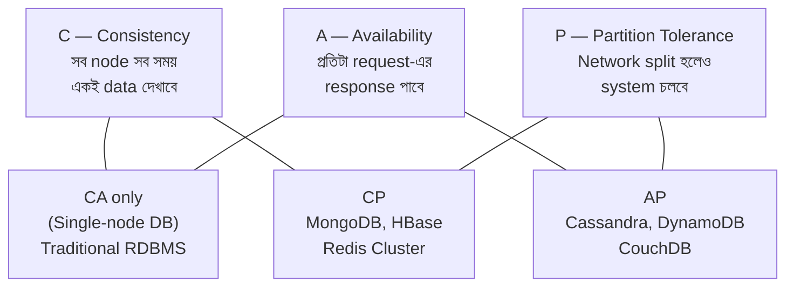
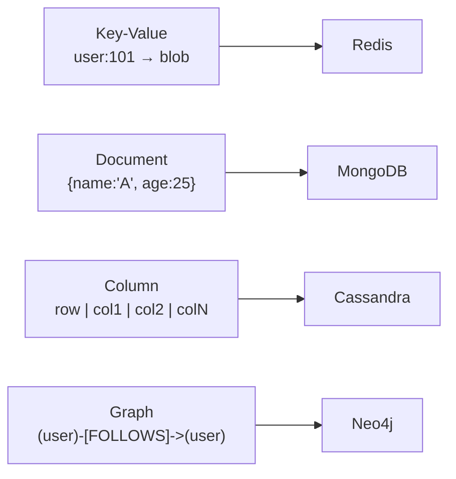
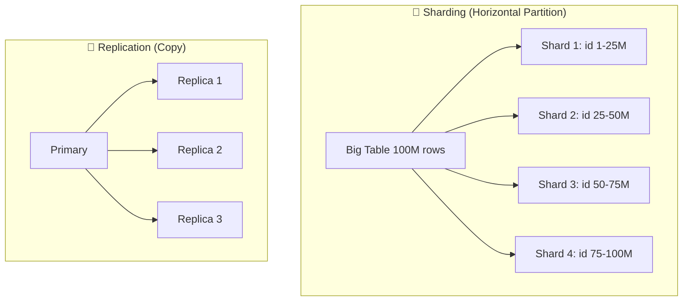
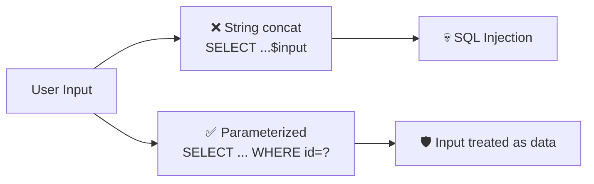
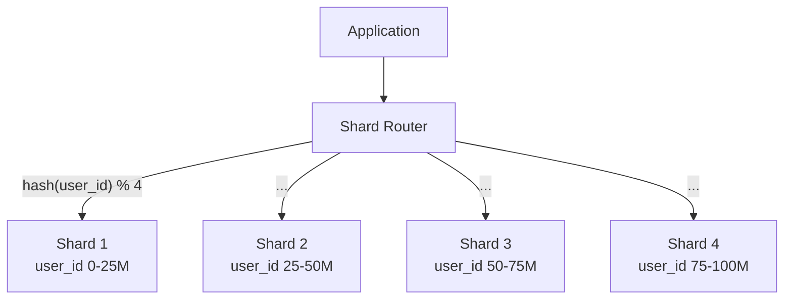
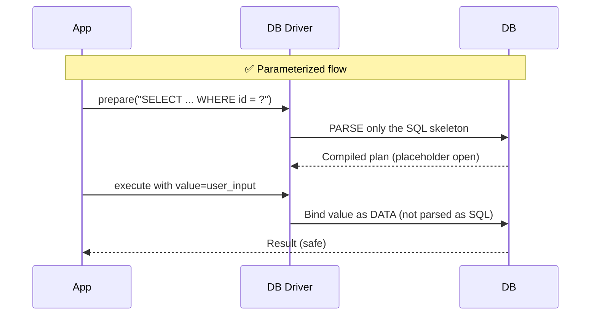

# Chapter 08 — NoSQL, Distributed & Security 🔐

> CAP theorem, NoSQL families (Key-Value / Document / Column / Graph), Sharding & Replication, ACID vs BASE, GRANT/REVOKE, SQL Injection prevention — ৩টা প্রশ্ন কিন্তু concept-coverage অনেক বড়।

---

## 📚 Concept Refresher (পড়ুন আগে — দীর্ঘ কিন্তু গুরুত্বপূর্ণ)

### CAP Theorem — Distributed system-এর Iron Triangle

Eric Brewer-এর CAP theorem বলে: একটা distributed database **তিনটার মধ্যে যেকোনো দুটো** guarantee করতে পারে — সব তিনটা একসাথে impossible।



| Combination | Sacrifice | Real-world example |
|-------------|-----------|--------------------|
| **CA** | Partition tolerance | Single-node SQL (network split হলে dead) |
| **CP** | Availability | MongoDB (split হলে minority partition refuses writes) |
| **AP** | Consistency (eventual instead) | Cassandra, DynamoDB (always answers, may be stale) |

**Practical truth:** Distributed system-এ network partition unavoidable, তাই realistic choice হলো **CP vs AP**।

### NoSQL — চারটা family

| Type | Structure | Example | Best for |
|------|-----------|---------|----------|
| **Key-Value** | `key → value` (opaque blob) | Redis, DynamoDB, Memcached | Caching, session, leaderboard |
| **Document** | JSON / BSON document | MongoDB, CouchDB | Content management, catalog, user profile |
| **Column-family** | Wide rows, column groups | Cassandra, HBase, Bigtable | Time-series, analytics, write-heavy |
| **Graph** | Nodes + edges + properties | Neo4j, ArangoDB | Social network, fraud detection, recommendation |



### ACID vs BASE — relational vs NoSQL philosophy

| | **ACID** (RDBMS) | **BASE** (NoSQL) |
|--|------------------|------------------|
| **A** | Atomicity | **Basically Available** |
| **C** | Consistency | **Soft state** |
| **I** | Isolation | **Eventual consistency** |
| **D** | Durability | — |
| Guarantee | Strong, immediate | Eventual (data converges over time) |
| Trade-off | Slower, less scalable | Highly scalable, may show stale data |
| Use case | Banking, inventory | Social feed, product catalog, analytics |

**Memory hook:** ACID = "acid-শক্তিশালী, কঠোর"; BASE = "নরম, ক্ষারধর্মী"। Bank lekken ACID; Facebook timeline-এ BASE — কয়েক second পরে post সব place-এ পৌঁছালেও চলবে।

### Sharding vs Replication — দুটোই scale-এর tool, ভিন্ন কাজ



| | **Sharding** | **Replication** |
|--|--------------|-----------------|
| What | বড় ডাটা **ভাগ করে** আলাদা node-এ | একই ডাটার **copy** একাধিক node-এ |
| Goal | Scale write + storage | Scale read + HA + fault tolerance |
| Each node has | Subset of data | Full copy |
| Hash বা range-এ ভাগ | shard key (e.g., `user_id % 4`) | — |

**সাধারণত একসাথে use হয়:** প্রতিটা shard-এর আবার ২-৩টা replica থাকে — **scale + safety দুটোই**।

### Database Security — GRANT / REVOKE

DBMS-এ user-এর permission control করা হয় DCL (Data Control Language) দিয়ে:

```sql
-- Permission দিতে
GRANT SELECT, INSERT ON employees TO 'analyst'@'%';

-- Permission বাতিল করতে
REVOKE INSERT ON employees FROM 'analyst'@'%';

-- পুরো database-এর সব permission
GRANT ALL PRIVILEGES ON company.* TO 'admin'@'localhost';

-- Permission চেইন allow করতে
GRANT SELECT ON sales TO 'manager' WITH GRANT OPTION;
```

| Command | কাজ |
|---------|-----|
| `GRANT` | Permission দেওয়া |
| `REVOKE` | Permission বাতিল করা |
| `DENY` | (SQL Server only) explicit deny — GRANT-কেও override করে |

> ❌ **Trap:** `REMOVE` বা `DELETE PERMISSION` কোনো standard SQL command না। Permission সরাতে **REVOKE**-ই answer।

### SQL Injection — কী এবং কীভাবে আটকাবো

**Attack:** User input-কে raw concat করে SQL build করলে attacker malicious code ঢোকাতে পারে।

```python
# ❌ VULNERABLE
user_id = request.GET['id']  # attacker দেয়: "1 OR 1=1"
query = f"SELECT * FROM users WHERE id = {user_id}"
# Final: SELECT * FROM users WHERE id = 1 OR 1=1  → পুরো table return!

# ❌ আরও বিপদ
name = "'; DROP TABLE users; --"
query = f"SELECT * FROM users WHERE name = '{name}'"
# → users table-ই উড়ে গেল
```

**Defense — Parameterized Query (Prepared Statement):**

```python
# ✅ SAFE — driver input-কে data হিসেবে treat করে, code না
cursor.execute("SELECT * FROM users WHERE id = %s", (user_id,))

# ✅ Java JDBC
PreparedStatement ps = conn.prepareStatement(
    "SELECT * FROM users WHERE id = ?");
ps.setInt(1, userId);
```

**Defense layers (defense-in-depth):**

1. ✅ **Parameterized queries** (primary defense — সবচেয়ে কার্যকর)
2. ✅ Input validation + whitelist
3. ✅ ORM (auto-parameterizes — Django ORM, SQLAlchemy, Hibernate)
4. ✅ Least-privilege DB user (read-only user-এর `DROP` privilege নেই)
5. ✅ WAF / Web Application Firewall



---

## 🎯 Question 28: Permission সরানোর command

> **Question:** নিচের কোনটি ডাটাবেজ ইউজারের এক্সেস পারমিশন সরিয়ে নিতে ব্যবহৃত হয়?

- A) REMOVE
- B) GRANT
- C) REVOKE ✅
- D) DENY

**Solution: C) REVOKE**

**ব্যাখ্যা:** REVOKE কমান্ড ব্যবহার করে পূর্বে দেওয়া কোনো পারমিশন বাতিল বা সরিয়ে নেওয়া হয়।

```sql
-- Step 1: Permission দেওয়া
GRANT SELECT, UPDATE ON employees TO 'hr_user';

-- Step 2: Permission সরানো
REVOKE UPDATE ON employees FROM 'hr_user';
-- এখন hr_user শুধু SELECT করতে পারবে, UPDATE আর না
```

| Option | কাজ / সঠিকতা |
|--------|---------------|
| A) REMOVE | ❌ Standard SQL-এ এই keyword নেই |
| B) GRANT | ❌ এটা permission **দেয়**, সরায় না |
| **C) REVOKE** | ✅ Permission **withdraw** করার standard command |
| D) DENY | ⚠️ শুধু SQL Server-এ exists; standard SQL-এ নেই |

> **Note:** **GRANT ↔ REVOKE** — DCL (Data Control Language)-এর জোড়া command। Acronym মনে রাখুন: **DCL = GRANT + REVOKE**।

---

## 🎯 Question 37: Sharding কেন?

> **Question:** ডাটাবেজ শার্ডিং (Sharding) কেন করা হয়?

- A) সিকিউরিটি বাড়ানোর জন্য
- B) ডাটার সাইজ কমানোর জন্য
- C) ডাটাবেজের স্কেলেবিলিটি এবং পারফরম্যান্স বাড়ানোর জন্য ✅
- D) টেবিল ডিলিট করার জন্য

**Solution: C) ডাটাবেজের স্কেলেবিলিটি এবং পারফরম্যান্স বাড়ানোর জন্য**

**ব্যাখ্যা:** লার্জ স্কেল ডাটাবেজের লোড ভাগ করে দেওয়ার জন্য শার্ডিং করা হয়।

**Sharding** = বিশাল table-কে **horizontally** ভাগ করে আলাদা আলাদা machine-এ রাখা। প্রতিটা shard একটা subset হ্যান্ডেল করে — ফলে:

- ⚡ **Parallel queries** — চারটা shard-এ একসাথে query চলে
- 💾 **Storage scale** — single machine-এর disk limit cross করা যায়
- 🚀 **Write throughput** — load distribute হয়



**Sharding strategies:**

| Strategy | কীভাবে | উদাহরণ |
|----------|--------|---------|
| **Range-based** | Key range অনুযায়ী | user_id 1–1000 → shard 1 |
| **Hash-based** | Hash function দিয়ে evenly | `hash(id) % N` |
| **Geo-based** | Region অনুযায়ী | US users → shard US |

> **Trap:** Option B "ডাটার সাইজ কমানো" ভুল — sharding ডাটা কমায় না, বরং **ভাগ করে** distribute করে। মোট size একই থাকে।

---

## 🎯 Question 42: SQL Injection আটকানোর সবচেয়ে কার্যকর উপায়

> **Question:** SQL Injection প্রতিরোধের সবচেয়ে কার্যকর উপায় কোনটি?

- A) ডাটাবেজ ব্যাকআপ নেওয়া
- B) সব ডাটা মুছে ফেলা
- C) ইউজারকে ব্লক করা
- D) Parameterized Queries (Prepared Statements) ব্যবহার করা ✅

**Solution: D) Parameterized Queries (Prepared Statements) ব্যবহার করা**

**ব্যাখ্যা:** এটি ইউজার ইনপুটকে ডাটা হিসেবে ট্রিট করে, কোড হিসেবে নয়।

**কীভাবে কাজ করে:**

```python
# ❌ Concatenation — UNSAFE
query = "SELECT * FROM users WHERE name = '" + user_input + "'"
# user_input = "' OR '1'='1"
# → SELECT * FROM users WHERE name = '' OR '1'='1'  (returns all)

# ✅ Parameterized — SAFE
cursor.execute("SELECT * FROM users WHERE name = %s", (user_input,))
# Driver পুরো input string-কে literal value হিসেবে bind করে।
# attacker যাই দিক, সব single string হয়ে যায় — কোনো SQL keyword নয়।
```



| Option | Why right/wrong |
|--------|-----------------|
| A) Backup নেওয়া | ❌ Backup hacker-কে আটকায় না; শুধু recovery-তে কাজে আসে |
| B) সব ডাটা মুছে ফেলা | ❌ Absurd — তাহলে app-ই কাজ করবে না |
| C) ইউজারকে ব্লক করা | ❌ Reactive; প্রতিটা attacker-কে identify করে block — impossible |
| **D) Parameterized Queries** | ✅ Proactive, structural defense — input কে data-as-data হিসেবে bind করে |

**Defense-in-depth (real-world):**

1. **Parameterized queries** (must-have)
2. **ORM** (Django, SQLAlchemy, Hibernate) — সব auto-parameterized
3. **Input validation** (whitelist + length check)
4. **Least-privilege DB user** (web app user-এর `DROP` permission নেই)
5. **WAF** rule

> **Bonus knowledge:** `mysql_real_escape_string()` বা manual escape character — এগুলো old-school + bug-prone। Parameterized query-ই modern standard।

---

## 📋 Quick Recap Table

| Concept | Key fact |
|---------|----------|
| CAP Theorem | C, A, P — যেকোনো **২টা** মাত্র চাইতে পারেন |
| Practical CAP | Network partition unavoidable → choose CP or AP |
| Key-Value DB | Redis, DynamoDB — caching, session |
| Document DB | MongoDB — JSON-like flexible schema |
| Column-family DB | Cassandra, HBase — write-heavy, time-series |
| Graph DB | Neo4j — social network, recommendation |
| ACID | RDBMS — strong, immediate guarantee |
| BASE | NoSQL — basically available, eventually consistent |
| Sharding | Horizontal split → scale + performance |
| Replication | Copy data → HA + read scaling |
| GRANT | Permission **দেয়** |
| REVOKE | Permission **সরায়** ← exam-এ এটাই |
| SQL Injection defense | **Parameterized queries** (Prepared statements) |
| Why parameterized works | Input bound as data, not parsed as code |

---

## 🔁 Next Chapter

পরের chapter-এ **Mixed Practice — Misc & Tricky** — OLTP vs OLAP, COALESCE, Query Optimization, ARMSTRONG'S AXIOMS, EXPLAIN — ১২টা mixed-bag MCQ এবং কোর্সের শেষ self-assessment।

→ [Chapter 09: Mixed Practice](09-mixed-practice.md)
