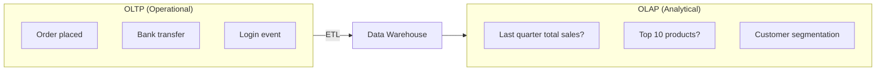
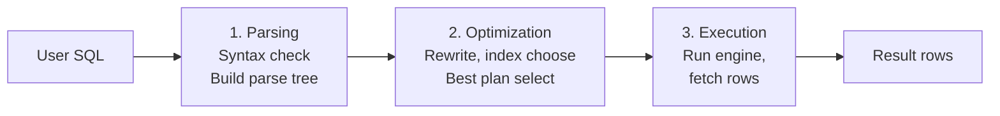
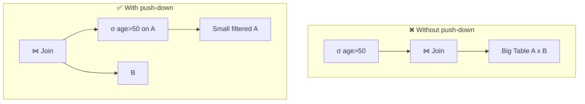
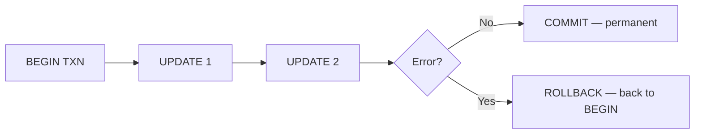
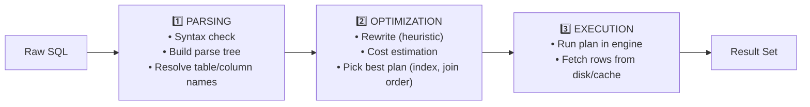
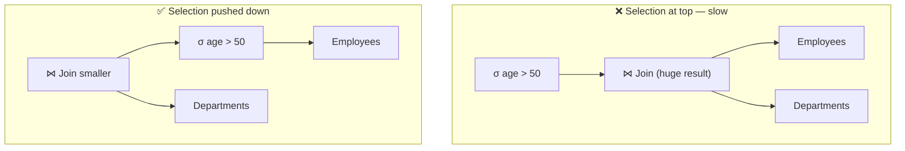
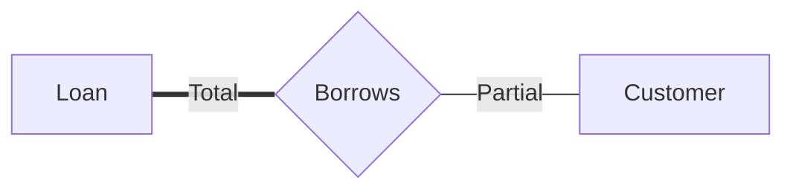
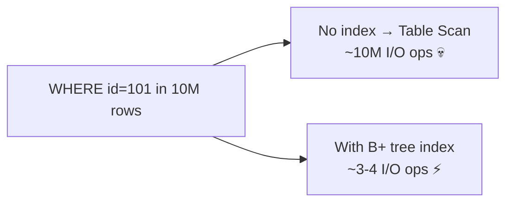
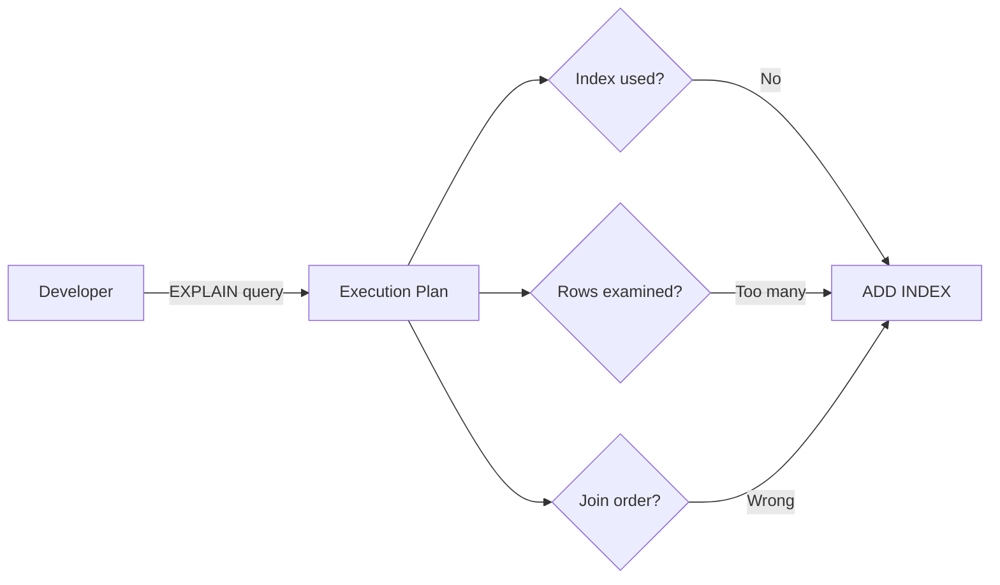

# Chapter 09 — Mixed Practice (Misc & Tricky) 🎲

> Redundancy, RDBMS examples, CTE (WITH), OLTP vs OLAP, ROLLBACK, COALESCE, Query Processing, Heuristic Optimization, Total Participation, Table Scan, Armstrong's Axioms, EXPLAIN — ১২টা mixed-bag MCQ। কোর্সের শেষ chapter।

---

## 📚 Concept Refresher

এই chapter-এ একই topic-এর সব MCQ নেই — আগের chapter-গুলোর leftover concept + tricky one-liners। নিচে প্রতিটা প্রশ্নের topic একনজরে।

### 🗂️ এই chapter-এর Topic Map

| qNum | Topic | Concept area |
|------|-------|--------------|
| 15 | Redundancy | Normalization basics |
| 20 | RDBMS examples | Software identification |
| 32 | WITH / CTE | Advanced SQL |
| 33 | OLTP vs OLAP | Data warehouse / analytics |
| 44 | ROLLBACK | Transaction control |
| 45 | COALESCE() | NULL handling |
| 60 | Query Processing steps | DBMS internals |
| 80 | Heuristic Optimization | Query planning |
| 82 | Total Participation | ER Model notation |
| 83 | Table Scan | Indexing implication |
| 84 | Armstrong's Augmentation | Functional Dependency |
| 89 | EXPLAIN | Query plan inspection |

### 🏬 OLTP vs OLAP — দুই dunia



| Aspect | **OLTP** | **OLAP** |
|--------|----------|----------|
| Purpose | Day-to-day transactions | Decision-making, analytics |
| Operation type | Many small writes (INSERT/UPDATE) | Few large reads (aggregation) |
| Schema | Normalized (3NF/BCNF) | Denormalized (Star/Snowflake) |
| Query speed | ms (single record) | seconds–minutes (aggregate millions) |
| User count | Many concurrent users | Few analysts |
| Example | MySQL behind e-commerce | Snowflake, BigQuery, Redshift |

### 🏢 Data Warehouse + Data Mining (quick reminder)

| Term | One-line meaning |
|------|------------------|
| **Data Warehouse** | Subject-oriented, integrated, time-variant, non-volatile data store (for OLAP) |
| **Data Mart** | Smaller subject-specific slice of the warehouse |
| **Data Lake** | Raw, unstructured + structured data dump (cheap storage) |
| **ETL** | Extract → Transform → Load — pipeline that feeds the warehouse |
| **Data Mining** | Pattern discovery from large dataset (clustering, classification, association) |
| **OLAP cube** | Multi-dimensional aggregation (`sales × time × region × product`) |

### ⚙️ Query Processing — তিনটা ধাপ



মুখস্থ order: **Parse → Optimize → Execute** (P-O-E)। 

### 💡 Heuristic-based Optimization — Rule of thumb

Optimizer rule-based heuristic অনুসরণ করে query tree-কে rewrite করে। Most famous rule:

> **Push selection (σ) down the tree as early as possible** — অর্থাৎ filter (WHERE) আগে apply করুন, JOIN পরে।

কারণ filter আগে চললে join-এর ডাটার পরিমাণ কমে — পরের সব operation fast।



### 🔑 Armstrong's Axioms — FD-এর foundation rule

| Axiom | Rule | Easy meaning |
|-------|------|--------------|
| **Reflexivity** | If $Y \subseteq X$, then $X \to Y$ | Subset always determines |
| **Augmentation** | If $X \to Y$, then $XZ \to YZ$ | উভয় পাশে একই attribute add করলেও বৈধ |
| **Transitivity** | If $X \to Y$ and $Y \to Z$, then $X \to Z$ | A→B and B→C ⟹ A→C |
| **Union** (derived) | If $X \to Y$ and $X \to Z$, then $X \to YZ$ | Combine two FDs |
| **Decomposition** (derived) | If $X \to YZ$, then $X \to Y$ and $X \to Z$ | Split FD |
| **Pseudo-transitivity** | If $X \to Y$ and $WY \to Z$, then $WX \to Z$ | — |

প্রথম তিনটা **inference rules-এর foundation** — বাকিগুলো এদের থেকে derive করা যায়।

### 🎓 Final Exam-day Checklist

পরীক্ষার আগের রাতে এই ৭টা review করুন:

- [ ] **ACID + isolation levels** (Read Uncommitted → Serializable)
- [ ] **Normalization** — 1NF, 2NF, 3NF, BCNF — কোনটা কী anomaly সরায়
- [ ] **Keys** — Primary, Foreign, Candidate, Super, Composite, Alternate, Unique
- [ ] **JOINS** — INNER, LEFT, RIGHT, FULL, CROSS, SELF (Venn diagram)
- [ ] **B+ tree vs Hash index** — range query vs equality
- [ ] **CAP theorem** + ACID vs BASE
- [ ] **WHERE vs HAVING**, GROUP BY order, COALESCE, EXPLAIN

---

## 🎯 Question 15: Redundancy কী?

> **Question:** ডাটাবেজে 'Redundancy' বলতে কী বোঝায়?

- A) ডাটা দ্রুত খুঁজে পাওয়া।
- B) ডাটাবেজ ক্র্যাশ হওয়া।
- C) একই ডাটার অপ্রয়োজনীয় পুনরাবৃত্তি। ✅
- D) ডাটার নিরাপত্তা বৃদ্ধি।

**Solution: C) একই ডাটার অপ্রয়োজনীয় পুনরাবৃত্তি**

**ব্যাখ্যা:** ডাটাবেজে একই তথ্য একাধিক জায়গায় অনর্থকভাবে সংরক্ষিত থাকাকেই রিডানডেন্সি বলা হয়।

উদাহরণ — unnormalized table:

| StudentID | Name | DeptName | DeptHead |
|-----------|------|----------|----------|
| 1 | Rahim | CSE | Dr. Karim |
| 2 | Karim | CSE | Dr. Karim |
| 3 | Salma | CSE | Dr. Karim |

`DeptHead` value প্রতিটা row-এ repeat — এটাই **redundancy**। সমস্যাগুলো:

- 💾 **Storage waste** — same data multiple copies
- 🔄 **Update anomaly** — Dept head change হলে সব row update করতে হয়
- ➕ **Insert anomaly** — empty dept add করা যায় না (no student)
- ➖ **Delete anomaly** — শেষ student delete হলে dept info-ও যায়

**Solution:** Normalization (3NF/BCNF) — Department info আলাদা table-এ।

> **Trap:** Option D "নিরাপত্তা বৃদ্ধি" আকর্ষণীয় ফাঁদ — RAID-এর redundancy disk-level fault tolerance দেয়, কিন্তু **database "redundancy" সাধারণত negative trait**।

---

## 🎯 Question 20: Relational Database example

> **Question:** নিচের কোনটি রিলেশনাল ডাটাবেজ সফটওয়্যারের উদাহরণ?

- A) Python
- B) Excel
- C) MySQL ✅
- D) Notepad

**Solution: C) MySQL**

**ব্যাখ্যা:** MySQL একটি অত্যন্ত জনপ্রিয় ওপেন সোর্স রিলেশনাল ডাটাবেজ ম্যানেজমেন্ট সিস্টেম।

| Software | কী? |
|----------|-----|
| A) Python | Programming language (DBMS না) |
| B) Excel | Spreadsheet (limited; relations নেই, SQL নেই) |
| **C) MySQL** | ✅ RDBMS — Oracle-owned, open source |
| D) Notepad | Plain text editor |

**Common RDBMS list (মুখস্থ রাখুন):**

- **Open source:** MySQL, PostgreSQL, MariaDB, SQLite
- **Commercial:** Oracle DB, Microsoft SQL Server, IBM DB2
- **Cloud:** Amazon RDS / Aurora, Google Cloud SQL, Azure SQL

> **Note:** MongoDB, Redis, Cassandra — এগুলো **NoSQL**, RDBMS না। Exam-এ এই trap থাকে।

---

## 🎯 Question 32: WITH clause কী?

> **Question:** SQL-এ WITH ক্লজটি মূলত কীসের জন্য ব্যবহৃত হয়?

- A) টেবিল ড্রপ করার জন্য
- B) ডাটা ইনসার্ট করার জন্য
- C) CTE (Common Table Expression) তৈরি করার জন্য ✅
- D) ইউজার পারমিশন দেওয়ার জন্য

**Solution: C) CTE (Common Table Expression) তৈরি করার জন্য**

**ব্যাখ্যা:** WITH ক্লজ ব্যবহার করে একটি টেম্পোরারি রেজাল্ট সেট বা CTE তৈরি করা যায়।

```sql
WITH HighSalary AS (
    SELECT emp_id, name, salary
    FROM employees
    WHERE salary > 100000
)
SELECT h.name, d.dept_name
FROM HighSalary h
JOIN departments d ON h.dept_id = d.dept_id;
```

**CTE-র সুবিধা:**

- ✅ **Readability** — nested subquery-এর তুলনায় cleaner
- ✅ **Reusable** — same query-এ multiple বার reference করা যায়
- ✅ **Recursive CTE** — tree/hierarchy traverse করতে পারে (organization chart, BOM)

```sql
-- Recursive CTE example
WITH RECURSIVE EmpHierarchy AS (
    SELECT id, name, manager_id, 1 AS level
    FROM employees WHERE manager_id IS NULL
    UNION ALL
    SELECT e.id, e.name, e.manager_id, h.level + 1
    FROM employees e JOIN EmpHierarchy h ON e.manager_id = h.id
)
SELECT * FROM EmpHierarchy;
```

> **Note:** CTE আর VIEW গুলিয়ে ফেলবেন না — CTE শুধু **single query-এর scope-এ live**, VIEW database-এ persistent stored object।

---

## 🎯 Question 33: OLTP vs OLAP

> **Question:** OLTP এবং OLAP-এর মধ্যে মূল পার্থক্য কী?

- A) OLTP অপারেশনাল ডাটা হ্যান্ডেল করে, OLAP এনালাইটিক্যাল ডাটা ✅
- B) OLTP দ্রুত রিডিং এর জন্য, OLAP দ্রুত রাইটিং এর জন্য
- C) উভয়ই একই কাজে ব্যবহৃত হয়
- D) OLAP ডাটাবেজ খুব ছোট হয়

**Solution: A) OLTP অপারেশনাল ডাটা হ্যান্ডেল করে, OLAP এনালাইটিক্যাল ডাটা**

**ব্যাখ্যা:** OLTP দৈনন্দিন ট্রানজ্যাকশন এবং OLAP সিদ্ধান্ত গ্রহণের জন্য ডাটা এনালাইসিসে ব্যবহৃত হয়।

| | **OLTP** | **OLAP** |
|--|----------|----------|
| Full form | Online **Transaction** Processing | Online **Analytical** Processing |
| Purpose | Daily operation | Decision support / BI |
| Workload | Many small INSERT/UPDATE | Few large SELECT (aggregate) |
| Schema | Normalized (3NF) | Denormalized (Star/Snowflake) |
| Data freshness | Real-time | Historical, periodically refreshed |
| Size | GB range | TB–PB range |
| Example | Bank's core banking system | Quarterly sales dashboard |

> **Trap:** Option B পুরো উল্টো — **OLTP fast write, OLAP fast read** (heavy aggregation but read-only)। এই reversal trap exam-এ পাবেন।

---

## 🎯 Question 44: ROLLBACK-এর কাজ

> **Question:** ডাটাবেজ ট্রানজ্যাকশনে 'Rollback' কমান্ডের কাজ কী?

- A) সব পরিবর্তন স্থায়ী করা
- B) টেবিল ডিলেট করা
- C) ট্রানজ্যাকশন শুরুর আগের অবস্থায় ফিরিয়ে নেওয়া ✅
- D) ডাটা সর্ট করা

**Solution: C) ট্রানজ্যাকশন শুরুর আগের অবস্থায় ফিরিয়ে নেওয়া**

**ব্যাখ্যা:** ভুল হলে বা এরর এলে ট্রানজ্যাকশন বাতিল করে ডাটাকে আগের অবস্থায় ফিরিয়ে আনে।

```sql
BEGIN TRANSACTION;
    UPDATE accounts SET balance = balance - 1000 WHERE id = 1;
    UPDATE accounts SET balance = balance + 1000 WHERE id = 2;
    -- ভুল detect — দ্বিতীয় UPDATE-এ error
ROLLBACK;  -- দুটো UPDATE-ই undo হয়ে গেল
```

| TCL Command | কাজ |
|-------------|-----|
| `COMMIT` | Transaction-এর সব change permanent করা |
| `ROLLBACK` | Transaction-এর সব change undo করা |
| `SAVEPOINT name` | Partial rollback-এর জন্য marker রাখা |
| `ROLLBACK TO name` | শুধু ওই savepoint পর্যন্ত rollback |



> **Note:** ROLLBACK = **Atomicity (A of ACID) enforcer**। এটা সম্ভব হয় **undo log** (transaction log) থেকে — DBMS প্রতিটা change-এর before-image রাখে।

---

## 🎯 Question 45: COALESCE() কী করে?

> **Question:** SQL-এ COALESCE() ফাংশন কী কাজ করে?

- A) তালিকার প্রথম নাল-নয় এমন ভ্যালুটি রিটার্ন করে ✅
- B) ডাটা ডিলিট করে
- C) সব ডাটা যোগ করে
- D) ডাটা সর্ট করে

**Solution: A) তালিকার প্রথম নাল-নয় এমন ভ্যালুটি রিটার্ন করে**

**ব্যাখ্যা:** COALESCE নাল ভ্যালু হ্যান্ডেল করার জন্য খুব জনপ্রিয়।

```sql
-- syntax
COALESCE(val1, val2, val3, ..., default)
-- → প্রথম non-NULL value return; সব NULL হলে শেষেরটা (default) return
```

**Real example:**

```sql
-- Display phone number with fallback
SELECT name,
       COALESCE(mobile, home_phone, office_phone, 'No contact') AS phone
FROM employees;
```

| Row | mobile | home | office | Output |
|-----|--------|------|--------|--------|
| 1 | 017xx | 02-456 | 022-789 | **017xx** (first non-null) |
| 2 | NULL | 02-456 | 022-789 | **02-456** |
| 3 | NULL | NULL | NULL | **No contact** |

**Related NULL functions:**

| Function | কাজ |
|----------|-----|
| `COALESCE(a, b, c)` | প্রথম non-NULL (multi-arg, standard SQL) |
| `IFNULL(a, b)` | a NULL হলে b (MySQL — only 2-arg) |
| `NVL(a, b)` | Same as IFNULL (Oracle) |
| `ISNULL(a, b)` | Same (SQL Server) |
| `NULLIF(a, b)` | a == b হলে NULL, না হলে a |

> **Memory hook:** COALESCE = "**একসাথে চেইন করে fall back নেয়**" — প্রথমটা NULL? পরেরটা try করো... continue।

---

## 🎯 Question 60: Query Processing-এর সঠিক ধাপ

> **Question:** SQL কুয়েরি প্রসেসিংয়ের সঠিক ধাপ কোনটি?

- A) Execution → Parsing → Optimization
- B) Parsing → Optimization → Execution ✅
- C) Optimization → Parsing → Execution
- D) Parsing → Execution → Optimization

**Solution: B) Parsing → Optimization → Execution**

**ব্যাখ্যা:** প্রথমে কুয়েরি চেক করা হয় (Parsing), তারপর সেরা উপায় খোঁজা হয় (Optimization) এবং সবশেষে চালানো হয়।



**Detailed breakdown:**

| Phase | কাজ | Output |
|-------|-----|--------|
| **1. Parsing** | Lexical + syntax + semantic check | Parse tree |
| **2. Optimization** | Heuristic rewrite + cost-based plan selection | Execution plan |
| **3. Execution** | Engine runs plan, returns rows | Result rows |

> **Memory hook:** **P-O-E** — "Pora hObE" (পড়া হবে) → first পড়ো (parse), তারপর optimize, তারপর execute।

---

## 🎯 Question 80: Heuristic Optimization-এর rule

> **Question:** Query Optimization-এ 'Heuristic-based' পদ্ধতিতে কোনটি করা হয়?

- A) সব ইন্ডেক্স মুছে ফেলা
- B) কুয়েরিটি রান না করা
- C) সবচেয়ে বড় টেবিল আগে জয়েন করা
- D) Selection (σ) অপারেশনকে কুয়েরি ট্রিতে যত নিচে সম্ভব নামিয়ে আনা ✅

**Solution: D) Selection (σ) অপারেশনকে কুয়েরি ট্রিতে যত নিচে সম্ভব নামিয়ে আনা**

**ব্যাখ্যা:** আগে ফিল্টার করলে ডাটার পরিমাণ কমে যায়, ফলে পরবর্তী অপারেশনগুলো দ্রুত হয়।

এটা heuristic optimization-এর সবচেয়ে famous rule — **"Push selection down the tree"** বা **"Selection push-down"**।



**কেন কাজ করে:**

ধরুন `Employees` table-এ ১ million rows, `Departments`-এ 100 rows।

- **❌ Without push-down:** 1M × 100 = 100M intermediate join rows → তারপর filter
- **✅ With push-down:** filter আগে → 50k filtered employees → 50k × 100 = 5M join rows

I/O আর CPU দুটোই অনেক কম।

**অন্যান্য heuristic rules:**

| Rule | কাজ |
|------|-----|
| **Selection push-down** | σ যত নিচে সম্ভব |
| **Projection push-down** | π (column select)-ও আগে |
| **Combine selections** | একই table-এ multiple σ merge |
| **Use indexes** if available | Index lookup vs full scan |
| **Smallest table first in join** | Hash table-এ build side ছোট রাখা |

> **Trap:** Option C "সবচেয়ে বড় টেবিল আগে জয়েন" — উল্টো। বরং **smallest first / most-selective first** rule of thumb।

---

## 🎯 Question 82: Total Participation notation

> **Question:** E-R মডেলে একটি 'Total Participation' সম্পর্ককে কীভাবে চিহ্নিত করা হয়?

- A) Double Line ✅
- B) Bold Arrow
- C) Dotted Line
- D) Single Line

**Solution: A) Double Line**

**ব্যাখ্যা:** ডাবল লাইন নির্দেশ করে যে ওই এনটিটি সেটের প্রতিটি মেম্বারকে অবশ্যই রিলেশনে যুক্ত থাকতে হবে।

**Participation constraint দুই ধরনের:**

| Type | Notation | মানে |
|------|----------|------|
| **Total participation** | `═══` (Double line) | প্রতিটা entity must participate (mandatory) |
| **Partial participation** | `───` (Single line) | কিছু entity participate করে, কিছু না (optional) |



**Real example:** Bank-এ প্রতিটা **Loan**-কে অবশ্যই কোনো customer borrow করতে হয় (Loan → Borrows = Total/Double line); কিন্তু সব **Customer** loan নেয় না (Customer → Borrows = Partial/Single line)।

> **Note:** ER diagram-এর notation:
> - **Double line entity-relationship** = Total participation (mandatory)
> - **Double oval** = Multivalued attribute
> - **Double rectangle** = Weak entity
> 
> তিনটা **double**-এর ভিন্ন meaning, mix করে ফেলবেন না।

---

## 🎯 Question 83: Table Scan কখন worst?

> **Question:** Query Plan-এ 'Table Scan' কখন সবচেয়ে খারাপ পারফরম্যান্স দেয়?

- A) যখন টেবিলটি ছোট হয়
- B) যখন সব ডাটা পড়তে হয়
- C) যখন বিশাল টেবিলে একটি মাত্র নির্দিষ্ট রেকর্ড খোঁজা হয় ✅
- D) যখন প্রাইমারি কি দিয়ে খোঁজা হয়

**Solution: C) যখন বিশাল টেবিলে একটি মাত্র নির্দিষ্ট রেকর্ড খোঁজা হয়**

**ব্যাখ্যা:** পুরো টেবিল এক এক করে চেক করা অত্যন্ত সময়সাপেক্ষ যদি ইনডেক্স না থাকে।

**Table scan (full scan)** = পুরো table-এর প্রতিটা row পড়ে query criteria match করা।

| Scenario | Table Scan ভালো না খারাপ |
|----------|--------------------------|
| Small table (~few hundred rows) | ✅ ভালো — index overhead না নেওয়াই better |
| Large table + WHERE selecting most rows (>20%) | ✅ ভালো — index lookup × N বার করার চেয়ে scan সস্তা |
| Need ALL rows (`SELECT *` for export) | ✅ ভালো — অবশ্যই scan লাগবে |
| **Large table + 1 specific row (`WHERE id = 101`)** | ❌ **খুবই খারাপ** — index ছাড়া 1M rows পড়ে 1 record! |



**Solution:** Large table-এ frequently-filtered column-এ **index তৈরি করুন**। তখন optimizer table scan এর বদলে index seek choose করবে।

> **Note:** Option B "যখন সব ডাটা পড়তে হয়" actually **best case** — সব row পড়তেই হলে scan-এর চেয়ে ভালো option নেই। **Trap option।**

---

## 🎯 Question 84: Armstrong's Augmentation

> **Question:** ARMSTRONG'S AXIOMS-এর মধ্যে 'Augmentation' রুলটি কী?

- A) If X→Y, then XZ→YZ ✅
- B) If X→Y and Y→Z, then X→Z
- C) If X→Y, then Y→X
- D) If X⊆Y, then Y→X

**Solution: A) If X→Y, then XZ→YZ**

**ব্যাখ্যা:** উভয় পাশে একই অ্যাট্রিবিউট যোগ করলেও ডিপেন্ডেন্সি বজায় থাকে।

**Three foundational axioms:**

| Axiom | Statement | KaTeX form |
|-------|-----------|------------|
| **Reflexivity** | $Y \subseteq X$ হলে $X \to Y$ | $Y \subseteq X \implies X \to Y$ |
| **Augmentation** | $X \to Y$ হলে $XZ \to YZ$ | $X \to Y \implies XZ \to YZ$ |
| **Transitivity** | $X \to Y$ এবং $Y \to Z$ হলে $X \to Z$ | $X \to Y, Y \to Z \implies X \to Z$ |

**Quick option-by-option:**

- A) `X→Y, then XZ→YZ` ✅ — **Augmentation**
- B) `X→Y and Y→Z, then X→Z` — Transitivity (Q's নাম-এর সাথে mismatch)
- C) `X→Y, then Y→X` — invalid; FD direction reversal করা যায় না (unless explicitly bidirectional)
- D) `X⊆Y, then Y→X` — wrong; reflexivity actually says `Y⊆X ⟹ X→Y`

**Augmentation intuition:** যদি **Roll# → Name** হয় (Roll number থেকে name নির্ধারিত), তাহলে **(Roll#, Department) → (Name, Department)**-ও সত্য — দুপাশে Department add করলেও mapping ভাঙে না।

> **Note:** Three axioms থেকে আরও তিনটা derive হয় — **Union, Decomposition, Pseudo-transitivity**। মূল তিনটা মুখস্থ হলেই বাকিগুলো logically follow করে।

---

## 🎯 Question 89: EXPLAIN keyword কেন?

> **Question:** SQL কুয়েরিতে 'EXPLAIN' কীওয়ার্ডটি কেন ব্যবহার করা হয়?

- A) কুয়েরিটি কীভাবে রান হবে বা 'Execution Plan' দেখতে ✅
- B) পাসওয়ার্ড এনক্রিপ্ট করতে
- C) ডাটা ডিলিট করার কারণ জানাতে
- D) টেবিল এরর ঠিক করতে

**Solution: A) কুয়েরিটি কীভাবে রান হবে বা 'Execution Plan' দেখতে**

**ব্যাখ্যা:** এটি কুয়েরি অপ্টিমাইজার কোন ইন্ডেক্স বা জয়েন পদ্ধতি ব্যবহার করছে তা বুঝতে সাহায্য করে।

**Usage:**

```sql
EXPLAIN SELECT e.name, d.dept_name
FROM employees e
JOIN departments d ON e.dept_id = d.id
WHERE e.salary > 50000;
```

**Sample output (MySQL):**

| id | select_type | table | type | possible_keys | key | rows | Extra |
|----|-------------|-------|------|---------------|-----|------|-------|
| 1 | SIMPLE | e | range | idx_salary | idx_salary | 1200 | Using where |
| 1 | SIMPLE | d | eq_ref | PRIMARY | PRIMARY | 1 | — |

**Important columns:**

| Column | Meaning |
|--------|---------|
| `type` | Access method — `ALL` (table scan, bad) → `index` → `range` → `ref` → `eq_ref` → `const` (best) |
| `key` | Actual index used (NULL = no index used = problem) |
| `rows` | Estimated rows examined (lower = better) |
| `Extra` | "Using filesort" / "Using temporary" — usually red flags |

**Variants:**

```sql
EXPLAIN ANALYZE SELECT ...;     -- PostgreSQL — actually runs + measures
EXPLAIN FORMAT=JSON SELECT ...; -- MySQL — verbose JSON output
```



> **Pro tip:** Production-এ slow query দেখলে প্রথম step — `EXPLAIN` চালান। `type = ALL` দেখলেই বুঝবেন full table scan হচ্ছে — index missing।

---

## 📋 Quick Recap Table

| Concept | Key fact |
|---------|----------|
| Redundancy | Same data-এর unnecessary repetition |
| RDBMS examples | MySQL, PostgreSQL, Oracle, SQL Server |
| WITH clause | CTE (Common Table Expression) তৈরি |
| OLTP | Daily transactions, normalized, fast write |
| OLAP | Analytics, denormalized, fast read |
| ROLLBACK | Transaction undo — back to BEGIN state |
| COALESCE() | First non-NULL value from list |
| Query processing | **Parse → Optimize → Execute** (P-O-E) |
| Heuristic rule #1 | **Push selection (σ) down** the tree |
| Total participation | Double line in ER diagram |
| Table scan worst | Huge table + 1 specific record + no index |
| Augmentation | $X \to Y \implies XZ \to YZ$ |
| EXPLAIN | Show execution plan / index usage |

---

## 🎓 কোর্স শেষ — পরের ধাপ

🎉 **Congratulations!** ৯০টা DBMS MCQ + ৯টা chapter আপনি শেষ করেছেন। এবার exam-ready হওয়ার জন্য:

1. **Mock Test:** ৯০ মিনিটে আবার পুরো ৯০ প্রশ্ন solve করুন (per Q ~১ মিনিট)। ৭০+ correct = exam-ready।
2. **Wrong-only revise:** যে chapter-এ সবচেয়ে বেশি ভুল হয়েছে — সেগুলোর explanation আবার পড়ুন।
3. **Diagram drill:** প্রতিটা mermaid diagram (ER, B+ tree, CAP, 2PC, query plan) হাত দিয়ে এঁকে practice করুন।
4. **SQL hands-on:** একটা DB Fiddle / SQLite open করে অন্তত ১০টা query type করুন (JOIN, GROUP BY, CTE, window function)।
5. **Theory cross-check:** weak topic-এ আমাদের full DBMS course-এ যান: [/sections/dbms](/sections/dbms)।

### 📊 Bonus — Self-Assessment Sheet

প্রতিটা topic-এ confidence ১-৫ স্কেলে rate করুন (১ = একদম পারি না, ৫ = master)। ৩-এর নিচে যা আছে — সেই chapter আবার পড়ুন।

| Topic | Chapter | Confidence (1-5) |
|-------|---------|------------------|
| DBMS full form, Schema vs Instance | Ch 01 | __ |
| Metadata + relational calculus type | Ch 01 | __ |
| 2PC commit phase trigger | Ch 01 | __ |
| Star vs Snowflake schema | Ch 01 | __ |
| ACID properties + Isolation mechanism | Ch 01 / 06 | __ |
| Entity, Attribute, Relationship | Ch 02 | __ |
| All key types (PK/FK/Candidate/Super/Composite) | Ch 02 | __ |
| Cardinality (1:1, 1:N, M:N) | Ch 02 | __ |
| Total vs Partial participation | Ch 02 / 09 | __ |
| Weak entity (double rectangle) | Ch 02 | __ |
| SELECT / INSERT / UPDATE / DELETE syntax | Ch 03 | __ |
| WHERE, ORDER BY, DISTINCT, NULL handling | Ch 03 | __ |
| LIKE wildcards (% and _) | Ch 03 | __ |
| INNER / LEFT / RIGHT / FULL / CROSS JOIN | Ch 04 | __ |
| GROUP BY + HAVING + aggregate functions | Ch 04 | __ |
| Subquery (correlated vs non-correlated) | Ch 04 | __ |
| VIEW + Trigger | Ch 04 | __ |
| 1NF / 2NF / 3NF / BCNF — কোনটা কী anomaly সরায় | Ch 05 | __ |
| Functional Dependency + Armstrong's axioms | Ch 05 / 09 | __ |
| Transitive dependency identification | Ch 05 | __ |
| ACID + Isolation levels (Read Uncommitted → Serializable) | Ch 06 | __ |
| 2PL, Strict 2PL, deadlock | Ch 06 | __ |
| Schedule serializability (conflict + view) | Ch 06 | __ |
| Log-based recovery, checkpoint, ARIES | Ch 06 | __ |
| ROLLBACK + COMMIT + SAVEPOINT | Ch 06 / 09 | __ |
| B-tree vs B+ tree (data location) | Ch 07 | __ |
| Clustered vs Non-clustered index | Ch 07 | __ |
| Primary vs Secondary index | Ch 07 | __ |
| Dense vs Sparse index | Ch 07 | __ |
| Hash index vs B+ tree (when each) | Ch 07 | __ |
| Fan-out + tree height calculation | Ch 07 | __ |
| RANK vs DENSE_RANK vs ROW_NUMBER | Ch 07 | __ |
| CAP theorem (CA / CP / AP) | Ch 08 | __ |
| NoSQL types (KV / Document / Column / Graph) | Ch 08 | __ |
| ACID vs BASE | Ch 08 | __ |
| Sharding vs Replication | Ch 08 | __ |
| GRANT / REVOKE | Ch 08 | __ |
| SQL Injection + Parameterized query defense | Ch 08 | __ |
| Redundancy and its anomalies | Ch 09 | __ |
| RDBMS examples (MySQL/PG/Oracle) | Ch 09 | __ |
| WITH / CTE | Ch 09 | __ |
| OLTP vs OLAP | Ch 09 | __ |
| COALESCE / IFNULL / NVL | Ch 09 | __ |
| Query processing — Parse → Optimize → Execute | Ch 09 | __ |
| Heuristic optimization (push σ down) | Ch 09 | __ |
| Table scan worst case | Ch 09 | __ |
| EXPLAIN keyword usage | Ch 09 | __ |

৩-এর নিচে যেগুলো — শুধু সেই chapter-গুলো revise করুন। বাকি high-confidence-গুলো-তে শুধু MCQ-গুলো একবার চোখ বুলিয়ে নিলেই হবে।

---

> ✨ **Best of luck for your IT exam — Bangladesh Bank, BCS Computer, NTRCA, university viva, যেকোনোটাই হোক। You've got this!** ✨

→ [Back to Master Index](00-master-index.md)
